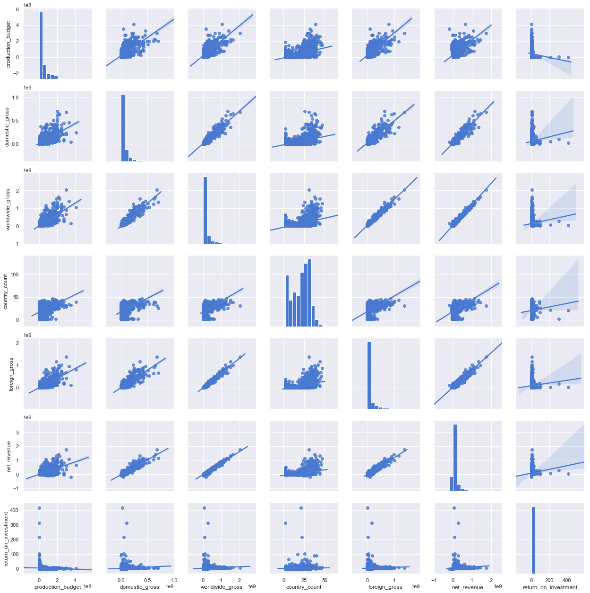
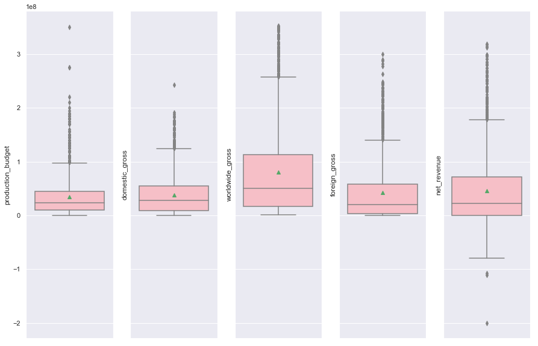
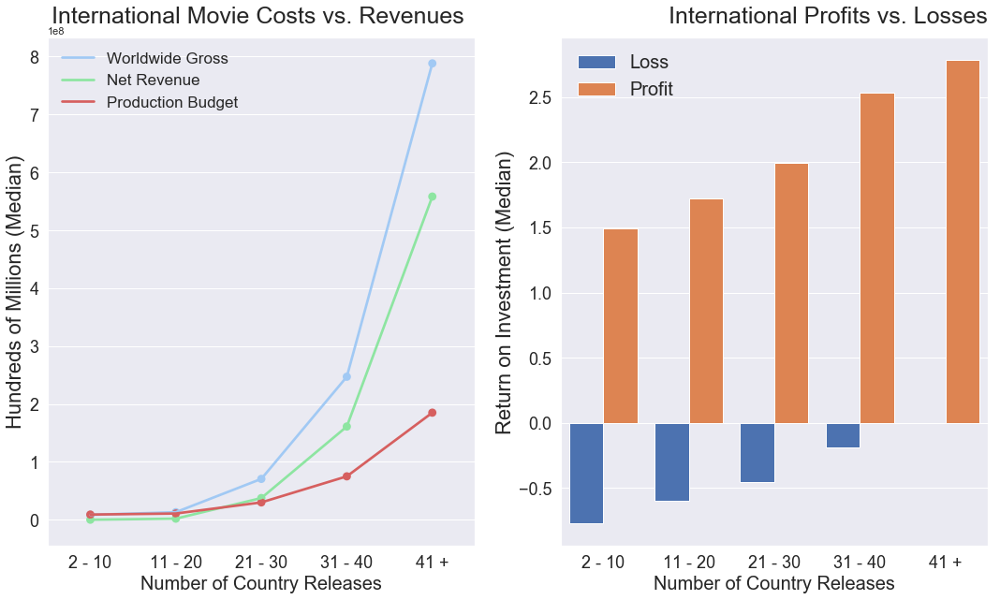

# Introduction & Objectives

**These days when a new movie is being released, it isn't a question of IF it will be released in another country, but rather HOW MANY other countries? The question we aim to analyze for Microsoft Entertainment Studios is:**

**Are movies that are released in more countries more profitable?**

**The findings in this notebook will show that the answer to that question is in fact: yes. This notebook will walk step-by-step through the importing, cleaning, exploration, and visualization processes undertaken to try and answer Microsoft's question and help inform strategic business decisions going forward.**

**The data being analyzed are from two sources: IMDB country data per movie and Box Office Mojo revenue and budget information. These datasets have been saved into an SQL database previously and will be imported into this notebook further down.**

# Bring in data from our SQL database

## Creating our Countries per Movie DataFrame


```python
conn.execute("select name from sqlite_master where type='table';").fetchall()
```


    [('bom_movie_gross',),
     ('imdb_name_basics',),
     ('imdb_title_akas',),
     ('imdb_title_basics',),
     ('imdb_title_crew',),
     ('imdb_title_principals',),
     ('imdb_title_ratings',),
     ('tmdb_movies',),
     ('tn_movie_budgets',)]


```python
cur.execute('''SELECT primary_title, region
                FROM imdb_title_akas a
                JOIN imdb_title_basics b
                ON a.title_id = b.tconst
                ;''')
df_title_region = pd.DataFrame(cur.fetchall())
df_title_region.columns = [x[0] for x in cur.description]
df_title_region.head()
```


<div>
<style scoped>
    .dataframe tbody tr th:only-of-type {
        vertical-align: middle;
    }

    .dataframe tbody tr th {
        vertical-align: top;
    }

    .dataframe thead th {
        text-align: right;
    }
</style>
<table border="1" class="dataframe">
  <thead>
    <tr style="text-align: right;">
      <th></th>
      <th>primary_title</th>
      <th>region</th>
    </tr>
  </thead>
  <tbody>
    <tr>
      <th>0</th>
      <td>Sunghursh</td>
      <td>IN</td>
    </tr>
    <tr>
      <th>1</th>
      <td>Sunghursh</td>
      <td>None</td>
    </tr>
    <tr>
      <th>2</th>
      <td>Sunghursh</td>
      <td>IN</td>
    </tr>
    <tr>
      <th>3</th>
      <td>Sunghursh</td>
      <td>IN</td>
    </tr>
    <tr>
      <th>4</th>
      <td>Sunghursh</td>
      <td>IN</td>
    </tr>
  </tbody>
</table>
</div>


## Creating our Movie Budgets/Revenues DataFrame 


```python
cur.execute('''SELECT * 
                FROM tn_movie_budgets
                ;''')
df_movie_moneys = pd.DataFrame(cur.fetchall())
df_movie_moneys.columns = [x[0] for x in cur.description]
df_movie_moneys.head()
```


<div>
<style scoped>
    .dataframe tbody tr th:only-of-type {
        vertical-align: middle;
    }

    .dataframe tbody tr th {
        vertical-align: top;
    }

    .dataframe thead th {
        text-align: right;
    }
</style>
<table border="1" class="dataframe">
  <thead>
    <tr style="text-align: right;">
      <th></th>
      <th>id</th>
      <th>release_date</th>
      <th>movie</th>
      <th>production_budget</th>
      <th>domestic_gross</th>
      <th>worldwide_gross</th>
    </tr>
  </thead>
  <tbody>
    <tr>
      <th>0</th>
      <td>1</td>
      <td>Dec 18, 2009</td>
      <td>Avatar</td>
      <td>$425,000,000</td>
      <td>$760,507,625</td>
      <td>$2,776,345,279</td>
    </tr>
    <tr>
      <th>1</th>
      <td>2</td>
      <td>May 20, 2011</td>
      <td>Pirates of the Caribbean: On Stranger Tides</td>
      <td>$410,600,000</td>
      <td>$241,063,875</td>
      <td>$1,045,663,875</td>
    </tr>
    <tr>
      <th>2</th>
      <td>3</td>
      <td>Jun 7, 2019</td>
      <td>Dark Phoenix</td>
      <td>$350,000,000</td>
      <td>$42,762,350</td>
      <td>$149,762,350</td>
    </tr>
    <tr>
      <th>3</th>
      <td>4</td>
      <td>May 1, 2015</td>
      <td>Avengers: Age of Ultron</td>
      <td>$330,600,000</td>
      <td>$459,005,868</td>
      <td>$1,403,013,963</td>
    </tr>
    <tr>
      <th>4</th>
      <td>5</td>
      <td>Dec 15, 2017</td>
      <td>Star Wars Ep. VIII: The Last Jedi</td>
      <td>$317,000,000</td>
      <td>$620,181,382</td>
      <td>$1,316,721,747</td>
    </tr>
  </tbody>
</table>
</div>


# Data Cleaning & Converting 

## Cleaning & Converting - Country Releases per Movie 

**Drop 'None' types from the region feature & check the unique values.**


```python
df_title_region = df_title_region.dropna()
df_title_region['region'].unique()
```


    array(['IN', 'XWW', 'VE', 'PL', 'DE', 'PT', 'BR', 'US', 'GB', 'IT', 'RU',
           'AR', 'ES', 'FR', 'CL', 'AU', 'CA', 'NL', 'BG', 'HR', 'HU', 'SE',
           'RO', 'HK', 'FI', 'EE', 'DK', 'LT', 'PK', 'GE', 'TR', 'GR', 'IL',
           'UY', 'RS', 'SI', 'CZ', 'UA', 'MX', 'JP', 'VN', 'PE', 'AZ', 'LV',
           'NO', 'SK', 'AL', 'KR', 'CO', 'EG', 'XEU', 'IR', 'SG', 'BE', 'IS',
           'CH', 'BA', 'ZA', 'CN', 'BD', 'LU', 'CU', 'AM', 'AT', 'MK', 'PH',
           'XSA', 'BO', 'TW', 'LB', 'PR', 'PA', 'IE', 'MY', 'CM', 'KZ', 'NZ',
           'TH', 'ID', 'BY', 'MA', 'CG', 'CR', 'XAS', 'MD', 'PY', 'EC', 'GT',
           'DO', 'TZ', 'DZ', 'BS', 'HT', 'JM', 'CY', 'MZ', 'NG', 'SL', 'PG',
           'MO', 'MN', 'XYU', 'ET', 'AE', 'PS', 'ZW', 'MW', 'FJ', 'MC', 'IQ',
           'SV', 'GL', 'KE', 'CSHH', 'QA', 'AO', 'GP', 'NP', 'ZM', 'AF', 'GH',
           'SZ', 'UG', 'CD', 'ME', 'JO', 'KG', 'RW', 'SN', 'LR', 'NI', 'KH',
           'AG', 'NE', 'VI', 'LI', 'UZ', 'HN', 'TT', 'BF', 'XKV', 'SUHH',
           'TN', 'CSXX', 'LK', 'AN', 'TG', 'BH', 'LS', 'SA', 'SY', 'KW', 'CV',
           'MV', 'BB', 'TJ', 'MH', 'BJ', 'XKO', 'ML', 'GA', 'GU', 'BT', 'SD',
           'MG', 'CI', 'LA', 'BZ', 'BM', 'MM', 'KP', 'IM', 'AW', 'MT', 'XNA',
           'MU', 'AS', 'SR', 'YE', 'SM', 'GW', 'TM', 'NC', 'BN', 'TD', 'KY',
           'TO', 'AD', 'TL', 'MR', 'VU', 'OM', 'PF', 'FO', 'XWG', 'RE', 'BI',
           'SO', 'MQ', 'AQ', 'GM', 'CF', 'DM', 'KN', 'ER', 'VC', 'WF', 'BUMM',
           'LY', 'EH', 'LC', 'SB', 'AI'], dtype=object)


**We noticed that there were different types of country codes in this list. This led to more research to see how one could check that these were all accurate. We found the |pycountry| library, installed it, then imported it below.**


```python
import pycountry
```


```python
def alpha_code_check(value):
    """This function takes in a an alpha code country value, determines its
    classification, and returns that result.  This function is meant to be 
    mapped along a DataFrame series.
    
    Returns:
    Assigned categorical value
    
    Example:
    df['region'].map(lambda x: alpha_code_check(x))"""

    if len(value) == 2:
        value = 'aplha_2'
        return value
    elif len(value) == 3:
        value = 'alpha_3'
        return value
    else:
        value = 'alpha_4'
        return value


df_title_region['alpha_code'] = df_title_region['region'].map(lambda x: alpha_code_check(x))
print(df_title_region['alpha_code'].value_counts())
df_title_region.head()
```

    aplha_2    259181
    alpha_3     19206
    alpha_4        23
    Name: alpha_code, dtype: int64
    


<div>
<style scoped>
    .dataframe tbody tr th:only-of-type {
        vertical-align: middle;
    }

    .dataframe tbody tr th {
        vertical-align: top;
    }

    .dataframe thead th {
        text-align: right;
    }
</style>
<table border="1" class="dataframe">
  <thead>
    <tr style="text-align: right;">
      <th></th>
      <th>primary_title</th>
      <th>region</th>
      <th>alpha_code</th>
    </tr>
  </thead>
  <tbody>
    <tr>
      <th>0</th>
      <td>Sunghursh</td>
      <td>IN</td>
      <td>aplha_2</td>
    </tr>
    <tr>
      <th>2</th>
      <td>Sunghursh</td>
      <td>IN</td>
      <td>aplha_2</td>
    </tr>
    <tr>
      <th>3</th>
      <td>Sunghursh</td>
      <td>IN</td>
      <td>aplha_2</td>
    </tr>
    <tr>
      <th>4</th>
      <td>Sunghursh</td>
      <td>IN</td>
      <td>aplha_2</td>
    </tr>
    <tr>
      <th>5</th>
      <td>One Day Before the Rainy Season</td>
      <td>XWW</td>
      <td>alpha_3</td>
    </tr>
  </tbody>
</table>
</div>


**Great, now we have a new column that identifies the type of alpha code in that row.**

**Let's now convert that to a country name using |pycountry|.**


```python
def country_alpha_converter(value):
    '''This is a function to map columns and convert values of country alpha 
    codes to country names.'''
    
    if len(value) == 2:
        x = pycountry.countries.get(alpha_2=value)
        if x == None:
            return 'None'
        return x.name
    elif len(value) == 3:
        x = pycountry.countries.get(alpha_3=value)
        if x == None:
            return 'None'
        return x.name
    else:
        x = pycountry.historic_countries.get(alpha_4=value) #old country codes
        if x == None:
            return 'None'
        return x.name

df_title_region['country'] = df_title_region['region'].map(lambda x: country_alpha_converter(x))
df_title_region.head()
```


<div>
<style scoped>
    .dataframe tbody tr th:only-of-type {
        vertical-align: middle;
    }

    .dataframe tbody tr th {
        vertical-align: top;
    }

    .dataframe thead th {
        text-align: right;
    }
</style>
<table border="1" class="dataframe">
  <thead>
    <tr style="text-align: right;">
      <th></th>
      <th>primary_title</th>
      <th>region</th>
      <th>alpha_code</th>
      <th>country</th>
    </tr>
  </thead>
  <tbody>
    <tr>
      <th>0</th>
      <td>Sunghursh</td>
      <td>IN</td>
      <td>aplha_2</td>
      <td>India</td>
    </tr>
    <tr>
      <th>2</th>
      <td>Sunghursh</td>
      <td>IN</td>
      <td>aplha_2</td>
      <td>India</td>
    </tr>
    <tr>
      <th>3</th>
      <td>Sunghursh</td>
      <td>IN</td>
      <td>aplha_2</td>
      <td>India</td>
    </tr>
    <tr>
      <th>4</th>
      <td>Sunghursh</td>
      <td>IN</td>
      <td>aplha_2</td>
      <td>India</td>
    </tr>
    <tr>
      <th>5</th>
      <td>One Day Before the Rainy Season</td>
      <td>XWW</td>
      <td>alpha_3</td>
      <td>None</td>
    </tr>
  </tbody>
</table>
</div>


**Looks good, though we can clearly see that there are lots of duplicates, as well as a 'None' in the country feature.**


```python
df_title_region[(df_title_region['alpha_code'] == 'alpha_3')
                | 
                (df_title_region['alpha_code'] == 'alpha_4')
               &
               (df_title_region['country'] == 'None')].head()
```


<div>
<style scoped>
    .dataframe tbody tr th:only-of-type {
        vertical-align: middle;
    }

    .dataframe tbody tr th {
        vertical-align: top;
    }

    .dataframe thead th {
        text-align: right;
    }
</style>
<table border="1" class="dataframe">
  <thead>
    <tr style="text-align: right;">
      <th></th>
      <th>primary_title</th>
      <th>region</th>
      <th>alpha_code</th>
      <th>country</th>
    </tr>
  </thead>
  <tbody>
    <tr>
      <th>5</th>
      <td>One Day Before the Rainy Season</td>
      <td>XWW</td>
      <td>alpha_3</td>
      <td>None</td>
    </tr>
    <tr>
      <th>26</th>
      <td>The Wandering Soap Opera</td>
      <td>XWW</td>
      <td>alpha_3</td>
      <td>None</td>
    </tr>
    <tr>
      <th>47</th>
      <td>So Much for Justice!</td>
      <td>XWW</td>
      <td>alpha_3</td>
      <td>None</td>
    </tr>
    <tr>
      <th>56</th>
      <td>Children of the Green Dragon</td>
      <td>XWW</td>
      <td>alpha_3</td>
      <td>None</td>
    </tr>
    <tr>
      <th>60</th>
      <td>The Tragedy of Man</td>
      <td>XWW</td>
      <td>alpha_3</td>
      <td>None</td>
    </tr>
  </tbody>
</table>
</div>


**Based on the information provided above, we can see that a lot of country_codes containing alpha_3 OR alpha_4 also have a 'None' value for their country feature, making these rows essentially useless for this analysis.  To proceed, we will drop all rows with the value of 'None' for the 'country' feature.**


```python
df_title_region = df_title_region[df_title_region['country'] != 'None']
df_title_region.head()
```


<div>
<style scoped>
    .dataframe tbody tr th:only-of-type {
        vertical-align: middle;
    }

    .dataframe tbody tr th {
        vertical-align: top;
    }

    .dataframe thead th {
        text-align: right;
    }
</style>
<table border="1" class="dataframe">
  <thead>
    <tr style="text-align: right;">
      <th></th>
      <th>primary_title</th>
      <th>region</th>
      <th>alpha_code</th>
      <th>country</th>
    </tr>
  </thead>
  <tbody>
    <tr>
      <th>0</th>
      <td>Sunghursh</td>
      <td>IN</td>
      <td>aplha_2</td>
      <td>India</td>
    </tr>
    <tr>
      <th>2</th>
      <td>Sunghursh</td>
      <td>IN</td>
      <td>aplha_2</td>
      <td>India</td>
    </tr>
    <tr>
      <th>3</th>
      <td>Sunghursh</td>
      <td>IN</td>
      <td>aplha_2</td>
      <td>India</td>
    </tr>
    <tr>
      <th>4</th>
      <td>Sunghursh</td>
      <td>IN</td>
      <td>aplha_2</td>
      <td>India</td>
    </tr>
    <tr>
      <th>6</th>
      <td>One Day Before the Rainy Season</td>
      <td>IN</td>
      <td>aplha_2</td>
      <td>India</td>
    </tr>
  </tbody>
</table>
</div>


```python
df_title_region['alpha_code'].value_counts()
```


    aplha_2    259176
    alpha_4        23
    Name: alpha_code, dtype: int64


**Looks like all of the alpha_3 codes went along with the 'none' values. Let's see what we have left for alpha_4 codes.**


```python
df_title_region[df_title_region['alpha_code'] == 'alpha_4']
```


<div>
<style scoped>
    .dataframe tbody tr th:only-of-type {
        vertical-align: middle;
    }

    .dataframe tbody tr th {
        vertical-align: top;
    }

    .dataframe thead th {
        text-align: right;
    }
</style>
<table border="1" class="dataframe">
  <thead>
    <tr style="text-align: right;">
      <th></th>
      <th>primary_title</th>
      <th>region</th>
      <th>alpha_code</th>
      <th>country</th>
    </tr>
  </thead>
  <tbody>
    <tr>
      <th>38031</th>
      <td>Mumu</td>
      <td>CSHH</td>
      <td>alpha_4</td>
      <td>Czechoslovakia, Czechoslovak Socialist Republic</td>
    </tr>
    <tr>
      <th>60649</th>
      <td>Like Crazy</td>
      <td>SUHH</td>
      <td>alpha_4</td>
      <td>USSR, Union of Soviet Socialist Republics</td>
    </tr>
    <tr>
      <th>63250</th>
      <td>Battery Man</td>
      <td>CSXX</td>
      <td>alpha_4</td>
      <td>Serbia and Montenegro</td>
    </tr>
    <tr>
      <th>89541</th>
      <td>Waldheim-KGB Agent Kurt</td>
      <td>CSXX</td>
      <td>alpha_4</td>
      <td>Serbia and Montenegro</td>
    </tr>
    <tr>
      <th>138179</th>
      <td>Albertov Put</td>
      <td>CSXX</td>
      <td>alpha_4</td>
      <td>Serbia and Montenegro</td>
    </tr>
    <tr>
      <th>146591</th>
      <td>Kosma</td>
      <td>CSXX</td>
      <td>alpha_4</td>
      <td>Serbia and Montenegro</td>
    </tr>
    <tr>
      <th>153295</th>
      <td>Danube Floating Free</td>
      <td>CSXX</td>
      <td>alpha_4</td>
      <td>Serbia and Montenegro</td>
    </tr>
    <tr>
      <th>154420</th>
      <td>Drugo ime za slobodu</td>
      <td>CSXX</td>
      <td>alpha_4</td>
      <td>Serbia and Montenegro</td>
    </tr>
    <tr>
      <th>160770</th>
      <td>Zivan Makes a Punk Festival</td>
      <td>CSXX</td>
      <td>alpha_4</td>
      <td>Serbia and Montenegro</td>
    </tr>
    <tr>
      <th>165231</th>
      <td>Skile</td>
      <td>CSXX</td>
      <td>alpha_4</td>
      <td>Serbia and Montenegro</td>
    </tr>
    <tr>
      <th>166504</th>
      <td>Stay Where You Are</td>
      <td>CSXX</td>
      <td>alpha_4</td>
      <td>Serbia and Montenegro</td>
    </tr>
    <tr>
      <th>196688</th>
      <td>It's a journey not a destination</td>
      <td>CSXX</td>
      <td>alpha_4</td>
      <td>Serbia and Montenegro</td>
    </tr>
    <tr>
      <th>196689</th>
      <td>Summertime Summerfun</td>
      <td>CSXX</td>
      <td>alpha_4</td>
      <td>Serbia and Montenegro</td>
    </tr>
    <tr>
      <th>226314</th>
      <td>Jovica and his teeth</td>
      <td>CSXX</td>
      <td>alpha_4</td>
      <td>Serbia and Montenegro</td>
    </tr>
    <tr>
      <th>230436</th>
      <td>Celebrating Serbia</td>
      <td>CSXX</td>
      <td>alpha_4</td>
      <td>Serbia and Montenegro</td>
    </tr>
    <tr>
      <th>242486</th>
      <td>The Absurd Scam</td>
      <td>CSXX</td>
      <td>alpha_4</td>
      <td>Serbia and Montenegro</td>
    </tr>
    <tr>
      <th>245734</th>
      <td>State of soul</td>
      <td>CSXX</td>
      <td>alpha_4</td>
      <td>Serbia and Montenegro</td>
    </tr>
    <tr>
      <th>256314</th>
      <td>Controindicazione</td>
      <td>CSXX</td>
      <td>alpha_4</td>
      <td>Serbia and Montenegro</td>
    </tr>
    <tr>
      <th>272535</th>
      <td>Prison's Prayer</td>
      <td>CSXX</td>
      <td>alpha_4</td>
      <td>Serbia and Montenegro</td>
    </tr>
    <tr>
      <th>274838</th>
      <td>The Taste of the Dhamma</td>
      <td>BUMM</td>
      <td>alpha_4</td>
      <td>Burma, Socialist Republic of the Union of</td>
    </tr>
    <tr>
      <th>279953</th>
      <td>The Roots of Maya: Adept</td>
      <td>CSXX</td>
      <td>alpha_4</td>
      <td>Serbia and Montenegro</td>
    </tr>
    <tr>
      <th>312340</th>
      <td>Resumption</td>
      <td>CSXX</td>
      <td>alpha_4</td>
      <td>Serbia and Montenegro</td>
    </tr>
    <tr>
      <th>325964</th>
      <td>Lijenstina</td>
      <td>CSXX</td>
      <td>alpha_4</td>
      <td>Serbia and Montenegro</td>
    </tr>
  </tbody>
</table>
</div>


**As we can see above, the countries that were assigned alpha_4 codes are no longer officially recognized today.  For this analysis it is okay to remove these from our dataset.**


```python
df_title_region = df_title_region[df_title_region['alpha_code'] != 'alpha_4']
df_title_region['alpha_code'].value_counts()
```


    aplha_2    259176
    Name: alpha_code, dtype: int64


**Great, now let's drop the alpha_code and region columns.**


```python
df_title_region = df_title_region.drop(['alpha_code', 'region'], axis=1)
print(df_title_region.shape)
df_title_region.head()
```

    (259176, 2)
    


<div>
<style scoped>
    .dataframe tbody tr th:only-of-type {
        vertical-align: middle;
    }

    .dataframe tbody tr th {
        vertical-align: top;
    }

    .dataframe thead th {
        text-align: right;
    }
</style>
<table border="1" class="dataframe">
  <thead>
    <tr style="text-align: right;">
      <th></th>
      <th>primary_title</th>
      <th>country</th>
    </tr>
  </thead>
  <tbody>
    <tr>
      <th>0</th>
      <td>Sunghursh</td>
      <td>India</td>
    </tr>
    <tr>
      <th>2</th>
      <td>Sunghursh</td>
      <td>India</td>
    </tr>
    <tr>
      <th>3</th>
      <td>Sunghursh</td>
      <td>India</td>
    </tr>
    <tr>
      <th>4</th>
      <td>Sunghursh</td>
      <td>India</td>
    </tr>
    <tr>
      <th>6</th>
      <td>One Day Before the Rainy Season</td>
      <td>India</td>
    </tr>
  </tbody>
</table>
</div>


**OK, so now we are only left with the duplicates. Let's drop them now so that later on our lists of countries (for our country_count feature) will be accurate. Let's also update the name of our DF as well.**


```python
df_title_country = df_title_region.drop_duplicates()
print(df_title_country.shape)
df_title_country.head()
```

    (237752, 2)
    


<div>
<style scoped>
    .dataframe tbody tr th:only-of-type {
        vertical-align: middle;
    }

    .dataframe tbody tr th {
        vertical-align: top;
    }

    .dataframe thead th {
        text-align: right;
    }
</style>
<table border="1" class="dataframe">
  <thead>
    <tr style="text-align: right;">
      <th></th>
      <th>primary_title</th>
      <th>country</th>
    </tr>
  </thead>
  <tbody>
    <tr>
      <th>0</th>
      <td>Sunghursh</td>
      <td>India</td>
    </tr>
    <tr>
      <th>6</th>
      <td>One Day Before the Rainy Season</td>
      <td>India</td>
    </tr>
    <tr>
      <th>9</th>
      <td>The Other Side of the Wind</td>
      <td>Venezuela, Bolivarian Republic of</td>
    </tr>
    <tr>
      <th>10</th>
      <td>The Other Side of the Wind</td>
      <td>Poland</td>
    </tr>
    <tr>
      <th>11</th>
      <td>The Other Side of the Wind</td>
      <td>Germany</td>
    </tr>
  </tbody>
</table>
</div>


**Dropped about 20K duplicates, very nice.  Now let's build out our feature containing a list of each country per movie.**


```python
df_title_countrylist = df_title_country.groupby('primary_title')['country'].apply(list).reset_index(name='country_list')
print(df_title_countrylist.shape)
df_title_countrylist.head()
```

    (114284, 2)
    


<div>
<style scoped>
    .dataframe tbody tr th:only-of-type {
        vertical-align: middle;
    }

    .dataframe tbody tr th {
        vertical-align: top;
    }

    .dataframe thead th {
        text-align: right;
    }
</style>
<table border="1" class="dataframe">
  <thead>
    <tr style="text-align: right;">
      <th></th>
      <th>primary_title</th>
      <th>country_list</th>
    </tr>
  </thead>
  <tbody>
    <tr>
      <th>0</th>
      <td>!Women Art Revolution</td>
      <td>[Russian Federation, United States]</td>
    </tr>
    <tr>
      <th>1</th>
      <td>#1 Serial Killer</td>
      <td>[United States]</td>
    </tr>
    <tr>
      <th>2</th>
      <td>#5</td>
      <td>[United States]</td>
    </tr>
    <tr>
      <th>3</th>
      <td>#50Fathers</td>
      <td>[United States]</td>
    </tr>
    <tr>
      <th>4</th>
      <td>#66</td>
      <td>[Indonesia]</td>
    </tr>
  </tbody>
</table>
</div>


**We are now down to 114,284 rows, and with the cleaning that we have done up to this point, it seems fair to assume that all of these movies are unique, but just to be safe, lets check with the .value_counts() method.**


```python
df_title_countrylist['primary_title'].value_counts().head()
```


    Jean-François and the Meaning of Life    1
    Kahin Hai Mera Pyar                      1
    C'est le coeur qui meurt en dernier      1
    The Weight of Elephants                  1
    Mandela: The Death of an Icon            1
    Name: primary_title, dtype: int64


**Perfect!  Next we are going to make a simple feature that counts the number of countries each movie was released in.  This is easily achieved by calculating the length of the country_list feature for each movie using some nice list comprehension. Then update the DF name to be a bit more descriptive.**


```python
pwd
```


    'C:\\Users\\tcast\\Data Science Program\\Module 1\\Mod 1 Project - Movie Analysis\\Movie_Analysis\\Are movies more profitable if they are released in more countries'


```python
df_title_countrylist['country_count'] = [len(x) for x in df_title_countrylist['country_list']]
df_title_countrylist_count = df_title_countrylist
df_title_countrylist_count.to_csv(r'C:\Users\tcast\Data Science Program\Module 1\Mod 1 Project - Movie Analysis\Movie_Analysis\Are movies more profitable if they are released in more countries\CLEAN-title_countrylist_count.csv')
# df_title_countrylist_count.head()
```

**Here we are going to subset the dataframe.  We are going to do so based on whether a movie was either a domestic or international release.  This significant because we will be able to compare these two different release types in the future should we have any questions involving the two.  We will create the domestic dataframe by filtering for movies whose country_count feature has a value of 1.**


```python
df_domestic_title_country = df_title_countrylist_count[
    df_title_countrylist_count[
        'country_count'
    ] == 1
]

df_domestic_title_country = df_domestic_title_country.drop('country_count', axis=1)
# Reassigned variable to avoid 'A value is trying to be set on a copy of a slice from a DataFrame.' error.
df_domestic_title_country['country_list'] = df_domestic_title_country['country_list'].map(lambda x: ''.join(x))
df_domestic_title_country.head()
```


<div>
<style scoped>
    .dataframe tbody tr th:only-of-type {
        vertical-align: middle;
    }

    .dataframe tbody tr th {
        vertical-align: top;
    }

    .dataframe thead th {
        text-align: right;
    }
</style>
<table border="1" class="dataframe">
  <thead>
    <tr style="text-align: right;">
      <th></th>
      <th>primary_title</th>
      <th>country_list</th>
    </tr>
  </thead>
  <tbody>
    <tr>
      <th>1</th>
      <td>#1 Serial Killer</td>
      <td>United States</td>
    </tr>
    <tr>
      <th>2</th>
      <td>#5</td>
      <td>United States</td>
    </tr>
    <tr>
      <th>3</th>
      <td>#50Fathers</td>
      <td>United States</td>
    </tr>
    <tr>
      <th>4</th>
      <td>#66</td>
      <td>Indonesia</td>
    </tr>
    <tr>
      <th>5</th>
      <td>#BKKY</td>
      <td>Thailand</td>
    </tr>
  </tbody>
</table>
</div>


**Great, now we can see all of the domestic movie releases. If we want to, we can also group this dataframe by its country feature and create a list of domestic movies released in each one respectively.**


```python
df_domestic_country_movie_list = df_domestic_title_country.groupby('country_list')['primary_title'].apply(list).reset_index(name='movie_list')
df_domestic_country_movie_list.head()
```


<div>
<style scoped>
    .dataframe tbody tr th:only-of-type {
        vertical-align: middle;
    }

    .dataframe tbody tr th {
        vertical-align: top;
    }

    .dataframe thead th {
        text-align: right;
    }
</style>
<table border="1" class="dataframe">
  <thead>
    <tr style="text-align: right;">
      <th></th>
      <th>country_list</th>
      <th>movie_list</th>
    </tr>
  </thead>
  <tbody>
    <tr>
      <th>0</th>
      <td>Afghanistan</td>
      <td>[A Man's Desire for Fifth Wife, Afghanistan, A...</td>
    </tr>
    <tr>
      <th>1</th>
      <td>Albania</td>
      <td>[6 Idiotet, A Shelter Among the Clouds, Albani...</td>
    </tr>
    <tr>
      <th>2</th>
      <td>Algeria</td>
      <td>[Abd El-Kader, Africa Is Back, Azib Zamoum, a ...</td>
    </tr>
    <tr>
      <th>3</th>
      <td>American Samoa</td>
      <td>[Pacmakman, Seki A Oe: A Crazy Samoan Love Sto...</td>
    </tr>
    <tr>
      <th>4</th>
      <td>Andorra</td>
      <td>[73', Impacto]</td>
    </tr>
  </tbody>
</table>
</div>


**Or we can just see how many domestic movies per country without a list of titles.  We can rearrange this as needed to prepare for a future merge or join with another dataset.**


```python
df_dom_movies_per_country = df_domestic_title_country
df_dom_movies_per_country['movies_per_country'] = 1
df_dom_movies_per_country = df_domestic_title_country.groupby('country_list').sum()
df_dom_movies_per_country.head()
```


<div>
<style scoped>
    .dataframe tbody tr th:only-of-type {
        vertical-align: middle;
    }

    .dataframe tbody tr th {
        vertical-align: top;
    }

    .dataframe thead th {
        text-align: right;
    }
</style>
<table border="1" class="dataframe">
  <thead>
    <tr style="text-align: right;">
      <th></th>
      <th>movies_per_country</th>
    </tr>
    <tr>
      <th>country_list</th>
      <th></th>
    </tr>
  </thead>
  <tbody>
    <tr>
      <th>Afghanistan</th>
      <td>29</td>
    </tr>
    <tr>
      <th>Albania</th>
      <td>35</td>
    </tr>
    <tr>
      <th>Algeria</th>
      <td>42</td>
    </tr>
    <tr>
      <th>American Samoa</th>
      <td>3</td>
    </tr>
    <tr>
      <th>Andorra</th>
      <td>2</td>
    </tr>
  </tbody>
</table>
</div>


**Now we are going to create out dataframe of international movies, those with more than 1 in their country_count feature.
We then reset the index just to make it look nicer, and to lessen any potential merge or join issues later.**


```python
df_int_title_clist_ccount = df_title_countrylist_count[
    df_title_countrylist_count[
        'country_count'
    ] > 1
]

df_int_title_clist_ccount = df_int_title_clist_ccount.reset_index().drop('index', axis=1)
df_int_title_clist_ccount.head()
```


<div>
<style scoped>
    .dataframe tbody tr th:only-of-type {
        vertical-align: middle;
    }

    .dataframe tbody tr th {
        vertical-align: top;
    }

    .dataframe thead th {
        text-align: right;
    }
</style>
<table border="1" class="dataframe">
  <thead>
    <tr style="text-align: right;">
      <th></th>
      <th>primary_title</th>
      <th>country_list</th>
      <th>country_count</th>
    </tr>
  </thead>
  <tbody>
    <tr>
      <th>0</th>
      <td>!Women Art Revolution</td>
      <td>[Russian Federation, United States]</td>
      <td>2</td>
    </tr>
    <tr>
      <th>1</th>
      <td>#Female Pleasure</td>
      <td>[Lithuania, Poland, Germany, Switzerland, Spain]</td>
      <td>5</td>
    </tr>
    <tr>
      <th>2</th>
      <td>#FollowFriday</td>
      <td>[United States, France, Brazil]</td>
      <td>3</td>
    </tr>
    <tr>
      <th>3</th>
      <td>#Horror</td>
      <td>[United States, Russian Federation]</td>
      <td>2</td>
    </tr>
    <tr>
      <th>4</th>
      <td>#REALITYHIGH</td>
      <td>[United States, Russian Federation]</td>
      <td>2</td>
    </tr>
  </tbody>
</table>
</div>


## Cleaning & Converting - Domestic & International Budgets/Revenues

**Let's have a loser look at this dataset and see if anything stands out.**


```python
print(df_movie_moneys.info())
```

    <class 'pandas.core.frame.DataFrame'>
    RangeIndex: 5782 entries, 0 to 5781
    Data columns (total 6 columns):
    id                   5782 non-null int64
    release_date         5782 non-null object
    movie                5782 non-null object
    production_budget    5782 non-null object
    domestic_gross       5782 non-null object
    worldwide_gross      5782 non-null object
    dtypes: int64(1), object(5)
    memory usage: 271.1+ KB
    None
    


```python
df_movie_moneys.head()
```


<div>
<style scoped>
    .dataframe tbody tr th:only-of-type {
        vertical-align: middle;
    }

    .dataframe tbody tr th {
        vertical-align: top;
    }

    .dataframe thead th {
        text-align: right;
    }
</style>
<table border="1" class="dataframe">
  <thead>
    <tr style="text-align: right;">
      <th></th>
      <th>id</th>
      <th>release_date</th>
      <th>movie</th>
      <th>production_budget</th>
      <th>domestic_gross</th>
      <th>worldwide_gross</th>
    </tr>
  </thead>
  <tbody>
    <tr>
      <th>0</th>
      <td>1</td>
      <td>Dec 18, 2009</td>
      <td>Avatar</td>
      <td>$425,000,000</td>
      <td>$760,507,625</td>
      <td>$2,776,345,279</td>
    </tr>
    <tr>
      <th>1</th>
      <td>2</td>
      <td>May 20, 2011</td>
      <td>Pirates of the Caribbean: On Stranger Tides</td>
      <td>$410,600,000</td>
      <td>$241,063,875</td>
      <td>$1,045,663,875</td>
    </tr>
    <tr>
      <th>2</th>
      <td>3</td>
      <td>Jun 7, 2019</td>
      <td>Dark Phoenix</td>
      <td>$350,000,000</td>
      <td>$42,762,350</td>
      <td>$149,762,350</td>
    </tr>
    <tr>
      <th>3</th>
      <td>4</td>
      <td>May 1, 2015</td>
      <td>Avengers: Age of Ultron</td>
      <td>$330,600,000</td>
      <td>$459,005,868</td>
      <td>$1,403,013,963</td>
    </tr>
    <tr>
      <th>4</th>
      <td>5</td>
      <td>Dec 15, 2017</td>
      <td>Star Wars Ep. VIII: The Last Jedi</td>
      <td>$317,000,000</td>
      <td>$620,181,382</td>
      <td>$1,316,721,747</td>
    </tr>
  </tbody>
</table>
</div>


**Let's drop the 'id' column here.**


```python
df_movie_moneys = df_movie_moneys.drop('id', axis=1)
df_movie_moneys.head()
```


<div>
<style scoped>
    .dataframe tbody tr th:only-of-type {
        vertical-align: middle;
    }

    .dataframe tbody tr th {
        vertical-align: top;
    }

    .dataframe thead th {
        text-align: right;
    }
</style>
<table border="1" class="dataframe">
  <thead>
    <tr style="text-align: right;">
      <th></th>
      <th>release_date</th>
      <th>movie</th>
      <th>production_budget</th>
      <th>domestic_gross</th>
      <th>worldwide_gross</th>
    </tr>
  </thead>
  <tbody>
    <tr>
      <th>0</th>
      <td>Dec 18, 2009</td>
      <td>Avatar</td>
      <td>$425,000,000</td>
      <td>$760,507,625</td>
      <td>$2,776,345,279</td>
    </tr>
    <tr>
      <th>1</th>
      <td>May 20, 2011</td>
      <td>Pirates of the Caribbean: On Stranger Tides</td>
      <td>$410,600,000</td>
      <td>$241,063,875</td>
      <td>$1,045,663,875</td>
    </tr>
    <tr>
      <th>2</th>
      <td>Jun 7, 2019</td>
      <td>Dark Phoenix</td>
      <td>$350,000,000</td>
      <td>$42,762,350</td>
      <td>$149,762,350</td>
    </tr>
    <tr>
      <th>3</th>
      <td>May 1, 2015</td>
      <td>Avengers: Age of Ultron</td>
      <td>$330,600,000</td>
      <td>$459,005,868</td>
      <td>$1,403,013,963</td>
    </tr>
    <tr>
      <th>4</th>
      <td>Dec 15, 2017</td>
      <td>Star Wars Ep. VIII: The Last Jedi</td>
      <td>$317,000,000</td>
      <td>$620,181,382</td>
      <td>$1,316,721,747</td>
    </tr>
  </tbody>
</table>
</div>


**Clean and convert the 'production_budget', 'domestic_gross', and 'worldwide_gross' columns from strings to floats using the function created below**


```python
def string_to_float_converter(value, to_replace=None, new_value='', new_dtype=float):
    
    '''This function cleans and converts any column of strings with UP TO 3
    variables at a time. This function is designed to be mapped along columns
    in a Pandas DataFrame and takes in a (value) and the desired string characters
    to be replacesd (to_replace). By default, new_value is: '' and new_dtype 
    is: 'float', though they may be changed as required.
    
    Returns:
    A cleaned and converted value.
    
    Example: 
    df['col'].map(lambda x: string_to_float_converter(x, ['$',',','&']))''' 
    
    if type(to_replace) == list:
        n = len(to_replace)
        if n == 2:
            return new_dtype(value.replace(to_replace[0], new_value).replace(to_replace[1], new_value))
        if n == 3:
            return new_dtype(value.replace(to_replace[0], new_value).replace(to_replace[1], new_value).replace(to_replace[2]))
    else:
        return new_dtype(value.replace(to_replace, new_value))

df_movie_moneys['worldwide_gross'] = df_movie_moneys['worldwide_gross'].map(lambda x: string_to_float_converter(x, to_replace=['$',',']))
df_movie_moneys['production_budget'] = df_movie_moneys['production_budget'].map(lambda x: string_to_float_converter(x, to_replace=['$',',']))
df_movie_moneys['domestic_gross'] = df_movie_moneys['domestic_gross'].map(lambda x: string_to_float_converter(x, to_replace=['$',',']))

df_movie_moneys.head()
```


<div>
<style scoped>
    .dataframe tbody tr th:only-of-type {
        vertical-align: middle;
    }

    .dataframe tbody tr th {
        vertical-align: top;
    }

    .dataframe thead th {
        text-align: right;
    }
</style>
<table border="1" class="dataframe">
  <thead>
    <tr style="text-align: right;">
      <th></th>
      <th>release_date</th>
      <th>movie</th>
      <th>production_budget</th>
      <th>domestic_gross</th>
      <th>worldwide_gross</th>
    </tr>
  </thead>
  <tbody>
    <tr>
      <th>0</th>
      <td>Dec 18, 2009</td>
      <td>Avatar</td>
      <td>425000000.0</td>
      <td>760507625.0</td>
      <td>2.776345e+09</td>
    </tr>
    <tr>
      <th>1</th>
      <td>May 20, 2011</td>
      <td>Pirates of the Caribbean: On Stranger Tides</td>
      <td>410600000.0</td>
      <td>241063875.0</td>
      <td>1.045664e+09</td>
    </tr>
    <tr>
      <th>2</th>
      <td>Jun 7, 2019</td>
      <td>Dark Phoenix</td>
      <td>350000000.0</td>
      <td>42762350.0</td>
      <td>1.497624e+08</td>
    </tr>
    <tr>
      <th>3</th>
      <td>May 1, 2015</td>
      <td>Avengers: Age of Ultron</td>
      <td>330600000.0</td>
      <td>459005868.0</td>
      <td>1.403014e+09</td>
    </tr>
    <tr>
      <th>4</th>
      <td>Dec 15, 2017</td>
      <td>Star Wars Ep. VIII: The Last Jedi</td>
      <td>317000000.0</td>
      <td>620181382.0</td>
      <td>1.316722e+09</td>
    </tr>
  </tbody>
</table>
</div>


**Convert the 'release_date' column to pandas datetime objects.**


```python
df_movie_moneys['release_date'] = pd.to_datetime(df_movie_moneys['release_date'])
df_movie_moneys.head()
```


<div>
<style scoped>
    .dataframe tbody tr th:only-of-type {
        vertical-align: middle;
    }

    .dataframe tbody tr th {
        vertical-align: top;
    }

    .dataframe thead th {
        text-align: right;
    }
</style>
<table border="1" class="dataframe">
  <thead>
    <tr style="text-align: right;">
      <th></th>
      <th>release_date</th>
      <th>movie</th>
      <th>production_budget</th>
      <th>domestic_gross</th>
      <th>worldwide_gross</th>
    </tr>
  </thead>
  <tbody>
    <tr>
      <th>0</th>
      <td>2009-12-18</td>
      <td>Avatar</td>
      <td>425000000.0</td>
      <td>760507625.0</td>
      <td>2.776345e+09</td>
    </tr>
    <tr>
      <th>1</th>
      <td>2011-05-20</td>
      <td>Pirates of the Caribbean: On Stranger Tides</td>
      <td>410600000.0</td>
      <td>241063875.0</td>
      <td>1.045664e+09</td>
    </tr>
    <tr>
      <th>2</th>
      <td>2019-06-07</td>
      <td>Dark Phoenix</td>
      <td>350000000.0</td>
      <td>42762350.0</td>
      <td>1.497624e+08</td>
    </tr>
    <tr>
      <th>3</th>
      <td>2015-05-01</td>
      <td>Avengers: Age of Ultron</td>
      <td>330600000.0</td>
      <td>459005868.0</td>
      <td>1.403014e+09</td>
    </tr>
    <tr>
      <th>4</th>
      <td>2017-12-15</td>
      <td>Star Wars Ep. VIII: The Last Jedi</td>
      <td>317000000.0</td>
      <td>620181382.0</td>
      <td>1.316722e+09</td>
    </tr>
  </tbody>
</table>
</div>


**Excellent, now let's have a closer look at our numeric columns.**


```python
print(df_movie_moneys.shape)
df_movie_moneys.describe()
```

    (5782, 5)
    


<div>
<style scoped>
    .dataframe tbody tr th:only-of-type {
        vertical-align: middle;
    }

    .dataframe tbody tr th {
        vertical-align: top;
    }

    .dataframe thead th {
        text-align: right;
    }
</style>
<table border="1" class="dataframe">
  <thead>
    <tr style="text-align: right;">
      <th></th>
      <th>production_budget</th>
      <th>domestic_gross</th>
      <th>worldwide_gross</th>
    </tr>
  </thead>
  <tbody>
    <tr>
      <th>count</th>
      <td>5.782000e+03</td>
      <td>5.782000e+03</td>
      <td>5.782000e+03</td>
    </tr>
    <tr>
      <th>mean</th>
      <td>3.158776e+07</td>
      <td>4.187333e+07</td>
      <td>9.148746e+07</td>
    </tr>
    <tr>
      <th>std</th>
      <td>4.181208e+07</td>
      <td>6.824060e+07</td>
      <td>1.747200e+08</td>
    </tr>
    <tr>
      <th>min</th>
      <td>1.100000e+03</td>
      <td>0.000000e+00</td>
      <td>0.000000e+00</td>
    </tr>
    <tr>
      <th>25%</th>
      <td>5.000000e+06</td>
      <td>1.429534e+06</td>
      <td>4.125415e+06</td>
    </tr>
    <tr>
      <th>50%</th>
      <td>1.700000e+07</td>
      <td>1.722594e+07</td>
      <td>2.798445e+07</td>
    </tr>
    <tr>
      <th>75%</th>
      <td>4.000000e+07</td>
      <td>5.234866e+07</td>
      <td>9.764584e+07</td>
    </tr>
    <tr>
      <th>max</th>
      <td>4.250000e+08</td>
      <td>9.366622e+08</td>
      <td>2.776345e+09</td>
    </tr>
  </tbody>
</table>
</div>


**Lots to see here.  The first thing to notice is the 0 values in the 'domestic_gross' and 'worldwide_gross' columns.  Let's have a look at what kinds of movies fit this criteria before we decide how to proceed.**


```python
print(df_movie_moneys[(df_movie_moneys['worldwide_gross'] == 0)
                                  |
                                  (df_movie_moneys['domestic_gross'] == 0)].shape)
df_movie_moneys[(df_movie_moneys['worldwide_gross'] == 0)
                                  |
                                  (df_movie_moneys['domestic_gross'] == 0)]
```

    (548, 5)
    


<div>
<style scoped>
    .dataframe tbody tr th:only-of-type {
        vertical-align: middle;
    }

    .dataframe tbody tr th {
        vertical-align: top;
    }

    .dataframe thead th {
        text-align: right;
    }
</style>
<table border="1" class="dataframe">
  <thead>
    <tr style="text-align: right;">
      <th></th>
      <th>release_date</th>
      <th>movie</th>
      <th>production_budget</th>
      <th>domestic_gross</th>
      <th>worldwide_gross</th>
    </tr>
  </thead>
  <tbody>
    <tr>
      <th>194</th>
      <td>2020-12-31</td>
      <td>Moonfall</td>
      <td>150000000.0</td>
      <td>0.0</td>
      <td>0.0</td>
    </tr>
    <tr>
      <th>479</th>
      <td>2017-12-13</td>
      <td>Bright</td>
      <td>90000000.0</td>
      <td>0.0</td>
      <td>0.0</td>
    </tr>
    <tr>
      <th>480</th>
      <td>2019-12-31</td>
      <td>Army of the Dead</td>
      <td>90000000.0</td>
      <td>0.0</td>
      <td>0.0</td>
    </tr>
    <tr>
      <th>535</th>
      <td>2020-02-21</td>
      <td>Call of the Wild</td>
      <td>82000000.0</td>
      <td>0.0</td>
      <td>0.0</td>
    </tr>
    <tr>
      <th>617</th>
      <td>2012-12-31</td>
      <td>Astérix et Obélix: Au service de Sa Majesté</td>
      <td>77600000.0</td>
      <td>0.0</td>
      <td>60680125.0</td>
    </tr>
    <tr>
      <th>619</th>
      <td>2019-01-22</td>
      <td>Renegades</td>
      <td>77500000.0</td>
      <td>0.0</td>
      <td>1521672.0</td>
    </tr>
    <tr>
      <th>670</th>
      <td>2019-08-30</td>
      <td>PLAYMOBIL</td>
      <td>75000000.0</td>
      <td>0.0</td>
      <td>0.0</td>
    </tr>
    <tr>
      <th>671</th>
      <td>2019-12-31</td>
      <td>355</td>
      <td>75000000.0</td>
      <td>0.0</td>
      <td>0.0</td>
    </tr>
    <tr>
      <th>820</th>
      <td>2018-10-26</td>
      <td>Air Strike</td>
      <td>65000000.0</td>
      <td>0.0</td>
      <td>516279.0</td>
    </tr>
    <tr>
      <th>951</th>
      <td>2015-12-11</td>
      <td>The Ridiculous 6</td>
      <td>60000000.0</td>
      <td>0.0</td>
      <td>0.0</td>
    </tr>
    <tr>
      <th>952</th>
      <td>2019-11-08</td>
      <td>Midway</td>
      <td>59500000.0</td>
      <td>0.0</td>
      <td>0.0</td>
    </tr>
    <tr>
      <th>1205</th>
      <td>2020-12-31</td>
      <td>Hannibal the Conqueror</td>
      <td>50000000.0</td>
      <td>0.0</td>
      <td>0.0</td>
    </tr>
    <tr>
      <th>1206</th>
      <td>2019-11-08</td>
      <td>Arctic Dogs</td>
      <td>50000000.0</td>
      <td>0.0</td>
      <td>0.0</td>
    </tr>
    <tr>
      <th>1207</th>
      <td>2019-11-22</td>
      <td>The Rhythm Section</td>
      <td>50000000.0</td>
      <td>0.0</td>
      <td>0.0</td>
    </tr>
    <tr>
      <th>1208</th>
      <td>2019-09-20</td>
      <td>Ad Astra</td>
      <td>49800000.0</td>
      <td>0.0</td>
      <td>0.0</td>
    </tr>
    <tr>
      <th>1325</th>
      <td>2012-12-31</td>
      <td>Foodfight!</td>
      <td>45000000.0</td>
      <td>0.0</td>
      <td>73706.0</td>
    </tr>
    <tr>
      <th>1367</th>
      <td>2006-12-31</td>
      <td>Les Bronzés 3: amis pour la vie</td>
      <td>42000000.0</td>
      <td>0.0</td>
      <td>83833602.0</td>
    </tr>
    <tr>
      <th>1368</th>
      <td>2015-12-31</td>
      <td>Pourquoi j'ai pas mangé mon père</td>
      <td>42000000.0</td>
      <td>0.0</td>
      <td>15451663.0</td>
    </tr>
    <tr>
      <th>1537</th>
      <td>2013-04-16</td>
      <td>Un monstre à Paris</td>
      <td>40000000.0</td>
      <td>0.0</td>
      <td>27000381.0</td>
    </tr>
    <tr>
      <th>1538</th>
      <td>2019-06-21</td>
      <td>Kursk</td>
      <td>40000000.0</td>
      <td>0.0</td>
      <td>4212799.0</td>
    </tr>
    <tr>
      <th>1539</th>
      <td>2016-11-11</td>
      <td>USS Indianapolis: Men of Courage</td>
      <td>40000000.0</td>
      <td>0.0</td>
      <td>1663785.0</td>
    </tr>
    <tr>
      <th>1540</th>
      <td>2014-12-31</td>
      <td>Dragon Nest Warriors' Dawn</td>
      <td>40000000.0</td>
      <td>0.0</td>
      <td>734423.0</td>
    </tr>
    <tr>
      <th>1541</th>
      <td>2018-12-31</td>
      <td>The Crow</td>
      <td>40000000.0</td>
      <td>0.0</td>
      <td>0.0</td>
    </tr>
    <tr>
      <th>1542</th>
      <td>2019-09-13</td>
      <td>The Goldfinch</td>
      <td>40000000.0</td>
      <td>0.0</td>
      <td>0.0</td>
    </tr>
    <tr>
      <th>1543</th>
      <td>2019-12-31</td>
      <td>Down Under Cover</td>
      <td>40000000.0</td>
      <td>0.0</td>
      <td>0.0</td>
    </tr>
    <tr>
      <th>1583</th>
      <td>2008-08-26</td>
      <td>Virgin Territory</td>
      <td>38000000.0</td>
      <td>0.0</td>
      <td>5473041.0</td>
    </tr>
    <tr>
      <th>1603</th>
      <td>2009-12-31</td>
      <td>Obitaemyy ostrov</td>
      <td>36500000.0</td>
      <td>0.0</td>
      <td>15000000.0</td>
    </tr>
    <tr>
      <th>1621</th>
      <td>2017-04-14</td>
      <td>Queen of the Desert</td>
      <td>36000000.0</td>
      <td>0.0</td>
      <td>1578543.0</td>
    </tr>
    <tr>
      <th>1754</th>
      <td>2006-09-22</td>
      <td>Bandidas</td>
      <td>35000000.0</td>
      <td>0.0</td>
      <td>19282590.0</td>
    </tr>
    <tr>
      <th>1755</th>
      <td>2015-03-13</td>
      <td>The Lovers</td>
      <td>35000000.0</td>
      <td>0.0</td>
      <td>53899.0</td>
    </tr>
    <tr>
      <th>1756</th>
      <td>2008-12-31</td>
      <td>Black Water Transit</td>
      <td>35000000.0</td>
      <td>0.0</td>
      <td>0.0</td>
    </tr>
    <tr>
      <th>1818</th>
      <td>2004-12-31</td>
      <td>George and the Dragon</td>
      <td>32000000.0</td>
      <td>0.0</td>
      <td>0.0</td>
    </tr>
    <tr>
      <th>2006</th>
      <td>2010-12-31</td>
      <td>Konferenz der Tiere</td>
      <td>30000000.0</td>
      <td>0.0</td>
      <td>53048539.0</td>
    </tr>
    <tr>
      <th>2007</th>
      <td>2015-12-01</td>
      <td>Grace of Monaco</td>
      <td>30000000.0</td>
      <td>0.0</td>
      <td>25199891.0</td>
    </tr>
    <tr>
      <th>2008</th>
      <td>2016-03-08</td>
      <td>Savva. Serdtse voyna</td>
      <td>30000000.0</td>
      <td>0.0</td>
      <td>5015080.0</td>
    </tr>
    <tr>
      <th>2009</th>
      <td>2007-12-14</td>
      <td>Goodbye Bafana</td>
      <td>30000000.0</td>
      <td>0.0</td>
      <td>2717302.0</td>
    </tr>
    <tr>
      <th>2010</th>
      <td>2013-12-31</td>
      <td>Space Pirate Captain Harlock</td>
      <td>30000000.0</td>
      <td>0.0</td>
      <td>310985.0</td>
    </tr>
    <tr>
      <th>2011</th>
      <td>2003-12-31</td>
      <td>Ripley's Game</td>
      <td>30000000.0</td>
      <td>0.0</td>
      <td>0.0</td>
    </tr>
    <tr>
      <th>2029</th>
      <td>2019-09-30</td>
      <td>Unhinged</td>
      <td>29000000.0</td>
      <td>0.0</td>
      <td>0.0</td>
    </tr>
    <tr>
      <th>2080</th>
      <td>2007-12-31</td>
      <td>Alatriste</td>
      <td>28000000.0</td>
      <td>0.0</td>
      <td>22860477.0</td>
    </tr>
    <tr>
      <th>2117</th>
      <td>2006-12-31</td>
      <td>The Magic Flute</td>
      <td>27000000.0</td>
      <td>0.0</td>
      <td>0.0</td>
    </tr>
    <tr>
      <th>2153</th>
      <td>2015-06-30</td>
      <td>Viy</td>
      <td>26000000.0</td>
      <td>0.0</td>
      <td>34246770.0</td>
    </tr>
    <tr>
      <th>2154</th>
      <td>2015-03-17</td>
      <td>Accidental Love</td>
      <td>26000000.0</td>
      <td>0.0</td>
      <td>135436.0</td>
    </tr>
    <tr>
      <th>2155</th>
      <td>2015-04-24</td>
      <td>The Face of an Angel</td>
      <td>26000000.0</td>
      <td>0.0</td>
      <td>0.0</td>
    </tr>
    <tr>
      <th>2320</th>
      <td>2010-12-31</td>
      <td>Sammy's avonturen: De geheime doorgang</td>
      <td>25000000.0</td>
      <td>0.0</td>
      <td>71594792.0</td>
    </tr>
    <tr>
      <th>2321</th>
      <td>2010-12-31</td>
      <td>Belka i Strelka. Zvezdnye sobaki</td>
      <td>25000000.0</td>
      <td>0.0</td>
      <td>9445081.0</td>
    </tr>
    <tr>
      <th>2322</th>
      <td>2017-12-31</td>
      <td>Matilda</td>
      <td>25000000.0</td>
      <td>0.0</td>
      <td>9370285.0</td>
    </tr>
    <tr>
      <th>2323</th>
      <td>2011-10-04</td>
      <td>La véritable histoire du Chat Botté</td>
      <td>25000000.0</td>
      <td>0.0</td>
      <td>8208594.0</td>
    </tr>
    <tr>
      <th>2324</th>
      <td>2011-07-08</td>
      <td>Ironclad</td>
      <td>25000000.0</td>
      <td>0.0</td>
      <td>5297411.0</td>
    </tr>
    <tr>
      <th>2325</th>
      <td>2019-05-10</td>
      <td>The Professor and the Madman</td>
      <td>25000000.0</td>
      <td>0.0</td>
      <td>5227233.0</td>
    </tr>
    <tr>
      <th>2326</th>
      <td>2015-03-10</td>
      <td>Red Sky</td>
      <td>25000000.0</td>
      <td>0.0</td>
      <td>91116.0</td>
    </tr>
    <tr>
      <th>2327</th>
      <td>1970-01-01</td>
      <td>Waterloo</td>
      <td>25000000.0</td>
      <td>0.0</td>
      <td>0.0</td>
    </tr>
    <tr>
      <th>2328</th>
      <td>2014-01-10</td>
      <td>The Adventurer: The Curse of the Midas Box</td>
      <td>25000000.0</td>
      <td>0.0</td>
      <td>0.0</td>
    </tr>
    <tr>
      <th>2329</th>
      <td>2019-12-31</td>
      <td>Reagan</td>
      <td>25000000.0</td>
      <td>0.0</td>
      <td>0.0</td>
    </tr>
    <tr>
      <th>2365</th>
      <td>2007-12-31</td>
      <td>Flood</td>
      <td>24000000.0</td>
      <td>0.0</td>
      <td>4084232.0</td>
    </tr>
    <tr>
      <th>2398</th>
      <td>2017-05-05</td>
      <td>Chāi dàn zhuānjiā</td>
      <td>23000000.0</td>
      <td>0.0</td>
      <td>58807172.0</td>
    </tr>
    <tr>
      <th>2399</th>
      <td>2011-03-15</td>
      <td>Shi Yue Wei Cheng</td>
      <td>23000000.0</td>
      <td>0.0</td>
      <td>44195779.0</td>
    </tr>
    <tr>
      <th>2451</th>
      <td>2013-12-31</td>
      <td>Metegol</td>
      <td>22000000.0</td>
      <td>0.0</td>
      <td>34061097.0</td>
    </tr>
    <tr>
      <th>2481</th>
      <td>2019-02-01</td>
      <td>Velvet Buzzsaw</td>
      <td>21000000.0</td>
      <td>0.0</td>
      <td>0.0</td>
    </tr>
    <tr>
      <th>2706</th>
      <td>2008-12-31</td>
      <td>Admiral</td>
      <td>20000000.0</td>
      <td>0.0</td>
      <td>38585047.0</td>
    </tr>
    <tr>
      <th>2707</th>
      <td>2012-12-31</td>
      <td>Zambezia</td>
      <td>20000000.0</td>
      <td>0.0</td>
      <td>34454336.0</td>
    </tr>
    <tr>
      <th>2708</th>
      <td>2010-04-13</td>
      <td>Three Kingdoms: Resurrection of the Dragon</td>
      <td>20000000.0</td>
      <td>0.0</td>
      <td>22139590.0</td>
    </tr>
    <tr>
      <th>2709</th>
      <td>2004-03-31</td>
      <td>The Touch</td>
      <td>20000000.0</td>
      <td>0.0</td>
      <td>5918742.0</td>
    </tr>
    <tr>
      <th>2710</th>
      <td>2015-05-29</td>
      <td>Survivor</td>
      <td>20000000.0</td>
      <td>0.0</td>
      <td>1703281.0</td>
    </tr>
    <tr>
      <th>2711</th>
      <td>2016-11-18</td>
      <td>The History of Love</td>
      <td>20000000.0</td>
      <td>0.0</td>
      <td>476624.0</td>
    </tr>
    <tr>
      <th>2712</th>
      <td>2007-12-25</td>
      <td>Butterfly on a Wheel</td>
      <td>20000000.0</td>
      <td>0.0</td>
      <td>0.0</td>
    </tr>
    <tr>
      <th>2713</th>
      <td>2014-08-29</td>
      <td>Dwegons and Leprechauns</td>
      <td>20000000.0</td>
      <td>0.0</td>
      <td>0.0</td>
    </tr>
    <tr>
      <th>2714</th>
      <td>2016-07-22</td>
      <td>Fight Valley</td>
      <td>20000000.0</td>
      <td>0.0</td>
      <td>0.0</td>
    </tr>
    <tr>
      <th>2715</th>
      <td>2017-12-31</td>
      <td>The Thousand Miles</td>
      <td>20000000.0</td>
      <td>0.0</td>
      <td>0.0</td>
    </tr>
    <tr>
      <th>2716</th>
      <td>2018-12-13</td>
      <td>Bird Box</td>
      <td>19800000.0</td>
      <td>0.0</td>
      <td>0.0</td>
    </tr>
    <tr>
      <th>2721</th>
      <td>2013-08-23</td>
      <td>The Frozen Ground</td>
      <td>19200000.0</td>
      <td>0.0</td>
      <td>5617460.0</td>
    </tr>
    <tr>
      <th>2754</th>
      <td>2016-03-08</td>
      <td>Out of the Inferno</td>
      <td>19000000.0</td>
      <td>0.0</td>
      <td>0.0</td>
    </tr>
    <tr>
      <th>2848</th>
      <td>2008-12-31</td>
      <td>I Come with the Rain</td>
      <td>18000000.0</td>
      <td>0.0</td>
      <td>627422.0</td>
    </tr>
    <tr>
      <th>2849</th>
      <td>2016-04-15</td>
      <td>I Am Wrath</td>
      <td>18000000.0</td>
      <td>0.0</td>
      <td>309608.0</td>
    </tr>
    <tr>
      <th>2850</th>
      <td>2014-11-14</td>
      <td>Wolves</td>
      <td>18000000.0</td>
      <td>0.0</td>
      <td>94953.0</td>
    </tr>
    <tr>
      <th>2851</th>
      <td>2008-04-08</td>
      <td>Day of the Dead</td>
      <td>18000000.0</td>
      <td>0.0</td>
      <td>0.0</td>
    </tr>
    <tr>
      <th>2852</th>
      <td>2014-08-22</td>
      <td>The Prince</td>
      <td>18000000.0</td>
      <td>0.0</td>
      <td>0.0</td>
    </tr>
    <tr>
      <th>2853</th>
      <td>2016-02-19</td>
      <td>Forsaken</td>
      <td>18000000.0</td>
      <td>0.0</td>
      <td>0.0</td>
    </tr>
    <tr>
      <th>2864</th>
      <td>2007-12-31</td>
      <td>Taxi 4</td>
      <td>17500000.0</td>
      <td>0.0</td>
      <td>60865364.0</td>
    </tr>
    <tr>
      <th>2912</th>
      <td>2017-09-26</td>
      <td>Mune, le gardien de la lune</td>
      <td>17000000.0</td>
      <td>0.0</td>
      <td>14534046.0</td>
    </tr>
    <tr>
      <th>2913</th>
      <td>2009-06-23</td>
      <td>Chasseurs de dragons</td>
      <td>17000000.0</td>
      <td>0.0</td>
      <td>13446115.0</td>
    </tr>
    <tr>
      <th>2914</th>
      <td>1977-10-21</td>
      <td>Damnation Alley</td>
      <td>17000000.0</td>
      <td>0.0</td>
      <td>0.0</td>
    </tr>
    <tr>
      <th>2915</th>
      <td>2019-07-12</td>
      <td>Crawl</td>
      <td>17000000.0</td>
      <td>0.0</td>
      <td>0.0</td>
    </tr>
    <tr>
      <th>2925</th>
      <td>2007-12-31</td>
      <td>Arn - Tempelriddaren</td>
      <td>16500000.0</td>
      <td>0.0</td>
      <td>21404122.0</td>
    </tr>
    <tr>
      <th>2979</th>
      <td>2010-05-11</td>
      <td>Haeundae</td>
      <td>16000000.0</td>
      <td>0.0</td>
      <td>64733391.0</td>
    </tr>
    <tr>
      <th>2980</th>
      <td>2010-03-09</td>
      <td>Hachiko: A Dog's Story</td>
      <td>16000000.0</td>
      <td>0.0</td>
      <td>47707417.0</td>
    </tr>
    <tr>
      <th>2981</th>
      <td>2013-12-31</td>
      <td>Zulu</td>
      <td>16000000.0</td>
      <td>0.0</td>
      <td>1844228.0</td>
    </tr>
    <tr>
      <th>3153</th>
      <td>2013-12-06</td>
      <td>Khumba</td>
      <td>15000000.0</td>
      <td>0.0</td>
      <td>20898221.0</td>
    </tr>
    <tr>
      <th>3154</th>
      <td>2015-05-05</td>
      <td>A Few Best Men</td>
      <td>15000000.0</td>
      <td>0.0</td>
      <td>17224539.0</td>
    </tr>
    <tr>
      <th>3155</th>
      <td>2014-10-10</td>
      <td>Autómata</td>
      <td>15000000.0</td>
      <td>0.0</td>
      <td>6775458.0</td>
    </tr>
    <tr>
      <th>3156</th>
      <td>2015-12-31</td>
      <td>Chiamatemi Francesco - Il papa della gente</td>
      <td>15000000.0</td>
      <td>0.0</td>
      <td>3925769.0</td>
    </tr>
    <tr>
      <th>3157</th>
      <td>2008-12-31</td>
      <td>Bathory</td>
      <td>15000000.0</td>
      <td>0.0</td>
      <td>3436763.0</td>
    </tr>
    <tr>
      <th>3158</th>
      <td>2010-02-05</td>
      <td>San suk si gin</td>
      <td>15000000.0</td>
      <td>0.0</td>
      <td>2013340.0</td>
    </tr>
    <tr>
      <th>3159</th>
      <td>2005-12-31</td>
      <td>Dungeons &amp; Dragons: Wrath of the Dragon God</td>
      <td>15000000.0</td>
      <td>0.0</td>
      <td>909822.0</td>
    </tr>
    <tr>
      <th>3160</th>
      <td>2017-02-17</td>
      <td>In Dubious Battle</td>
      <td>15000000.0</td>
      <td>0.0</td>
      <td>214182.0</td>
    </tr>
    <tr>
      <th>3161</th>
      <td>2015-09-01</td>
      <td>Broken Horses</td>
      <td>15000000.0</td>
      <td>0.0</td>
      <td>3471.0</td>
    </tr>
    <tr>
      <th>3162</th>
      <td>2001-06-29</td>
      <td>Pandaemonium</td>
      <td>15000000.0</td>
      <td>0.0</td>
      <td>0.0</td>
    </tr>
    <tr>
      <th>3163</th>
      <td>2019-08-14</td>
      <td>Blinded by the Light</td>
      <td>15000000.0</td>
      <td>0.0</td>
      <td>0.0</td>
    </tr>
    <tr>
      <th>3168</th>
      <td>2015-06-05</td>
      <td>Freedom</td>
      <td>14500000.0</td>
      <td>0.0</td>
      <td>872757.0</td>
    </tr>
    <tr>
      <th>3227</th>
      <td>2016-11-01</td>
      <td>Reign of Assassins</td>
      <td>14000000.0</td>
      <td>0.0</td>
      <td>11354230.0</td>
    </tr>
    <tr>
      <th>3228</th>
      <td>2009-10-27</td>
      <td>Stan Helsing: A Parody</td>
      <td>14000000.0</td>
      <td>0.0</td>
      <td>1553556.0</td>
    </tr>
    <tr>
      <th>3231</th>
      <td>2008-12-31</td>
      <td>Ca$h</td>
      <td>13700000.0</td>
      <td>0.0</td>
      <td>11738256.0</td>
    </tr>
    <tr>
      <th>3311</th>
      <td>2012-03-30</td>
      <td>Womb</td>
      <td>13000000.0</td>
      <td>0.0</td>
      <td>0.0</td>
    </tr>
    <tr>
      <th>3312</th>
      <td>2019-12-31</td>
      <td>Rogue City</td>
      <td>13000000.0</td>
      <td>0.0</td>
      <td>0.0</td>
    </tr>
    <tr>
      <th>3448</th>
      <td>2009-04-07</td>
      <td>1612</td>
      <td>12000000.0</td>
      <td>0.0</td>
      <td>5400624.0</td>
    </tr>
    <tr>
      <th>3449</th>
      <td>2015-12-31</td>
      <td>San cheng ji</td>
      <td>12000000.0</td>
      <td>0.0</td>
      <td>1950194.0</td>
    </tr>
    <tr>
      <th>3450</th>
      <td>2011-12-31</td>
      <td>Tu Xia Chuan Qi</td>
      <td>12000000.0</td>
      <td>0.0</td>
      <td>1828400.0</td>
    </tr>
    <tr>
      <th>3451</th>
      <td>2010-02-10</td>
      <td>Triangle</td>
      <td>12000000.0</td>
      <td>0.0</td>
      <td>1594955.0</td>
    </tr>
    <tr>
      <th>3452</th>
      <td>2013-10-19</td>
      <td>Supesu Batorushippu Yamato</td>
      <td>12000000.0</td>
      <td>0.0</td>
      <td>0.0</td>
    </tr>
    <tr>
      <th>3453</th>
      <td>2014-10-03</td>
      <td>Drive Hard</td>
      <td>12000000.0</td>
      <td>0.0</td>
      <td>0.0</td>
    </tr>
    <tr>
      <th>3454</th>
      <td>2015-10-30</td>
      <td>Dancin' It's On</td>
      <td>12000000.0</td>
      <td>0.0</td>
      <td>0.0</td>
    </tr>
    <tr>
      <th>3455</th>
      <td>2009-06-05</td>
      <td>Home</td>
      <td>12000000.0</td>
      <td>0.0</td>
      <td>0.0</td>
    </tr>
    <tr>
      <th>3462</th>
      <td>2009-11-27</td>
      <td>The Cry of the Owl</td>
      <td>11500000.0</td>
      <td>0.0</td>
      <td>0.0</td>
    </tr>
    <tr>
      <th>3512</th>
      <td>2015-05-08</td>
      <td>La famille Bélier</td>
      <td>11000000.0</td>
      <td>0.0</td>
      <td>82438670.0</td>
    </tr>
    <tr>
      <th>3513</th>
      <td>2012-05-04</td>
      <td>LOL</td>
      <td>11000000.0</td>
      <td>0.0</td>
      <td>10431506.0</td>
    </tr>
    <tr>
      <th>3514</th>
      <td>2016-02-05</td>
      <td>Misconduct</td>
      <td>11000000.0</td>
      <td>0.0</td>
      <td>2352511.0</td>
    </tr>
    <tr>
      <th>3515</th>
      <td>2019-12-31</td>
      <td>Eli</td>
      <td>11000000.0</td>
      <td>0.0</td>
      <td>0.0</td>
    </tr>
    <tr>
      <th>3531</th>
      <td>2019-01-04</td>
      <td>PMC: deo beong-keo</td>
      <td>10300000.0</td>
      <td>0.0</td>
      <td>12478635.0</td>
    </tr>
    <tr>
      <th>3732</th>
      <td>2010-12-31</td>
      <td>The Reef</td>
      <td>10000000.0</td>
      <td>0.0</td>
      <td>15037867.0</td>
    </tr>
    <tr>
      <th>3733</th>
      <td>2008-01-08</td>
      <td>White Noise 2: The Light</td>
      <td>10000000.0</td>
      <td>0.0</td>
      <td>8243567.0</td>
    </tr>
    <tr>
      <th>3734</th>
      <td>2015-07-21</td>
      <td>American Heist</td>
      <td>10000000.0</td>
      <td>0.0</td>
      <td>2341218.0</td>
    </tr>
    <tr>
      <th>3735</th>
      <td>2010-10-08</td>
      <td>It's a Wonderful Afterlife</td>
      <td>10000000.0</td>
      <td>0.0</td>
      <td>1642939.0</td>
    </tr>
    <tr>
      <th>3736</th>
      <td>2011-06-21</td>
      <td>You Got Served: Beat The World</td>
      <td>10000000.0</td>
      <td>0.0</td>
      <td>1230542.0</td>
    </tr>
    <tr>
      <th>3737</th>
      <td>2009-08-21</td>
      <td>Fifty Dead Men Walking</td>
      <td>10000000.0</td>
      <td>0.0</td>
      <td>997921.0</td>
    </tr>
    <tr>
      <th>3738</th>
      <td>2014-09-26</td>
      <td>Plastic</td>
      <td>10000000.0</td>
      <td>0.0</td>
      <td>575371.0</td>
    </tr>
    <tr>
      <th>3739</th>
      <td>2015-03-10</td>
      <td>Jungle Shuffle</td>
      <td>10000000.0</td>
      <td>0.0</td>
      <td>360898.0</td>
    </tr>
    <tr>
      <th>3740</th>
      <td>2009-09-22</td>
      <td>Adam Resurrected</td>
      <td>10000000.0</td>
      <td>0.0</td>
      <td>90909.0</td>
    </tr>
    <tr>
      <th>3741</th>
      <td>2009-05-26</td>
      <td>The Devil's Tomb</td>
      <td>10000000.0</td>
      <td>0.0</td>
      <td>0.0</td>
    </tr>
    <tr>
      <th>3742</th>
      <td>2009-12-31</td>
      <td>Good Intentions</td>
      <td>10000000.0</td>
      <td>0.0</td>
      <td>0.0</td>
    </tr>
    <tr>
      <th>3743</th>
      <td>2007-02-02</td>
      <td>Partition</td>
      <td>10000000.0</td>
      <td>0.0</td>
      <td>0.0</td>
    </tr>
    <tr>
      <th>3744</th>
      <td>2012-04-13</td>
      <td>Detention</td>
      <td>10000000.0</td>
      <td>0.0</td>
      <td>0.0</td>
    </tr>
    <tr>
      <th>3745</th>
      <td>2014-02-07</td>
      <td>Nurse 3D</td>
      <td>10000000.0</td>
      <td>0.0</td>
      <td>0.0</td>
    </tr>
    <tr>
      <th>3746</th>
      <td>2015-05-19</td>
      <td>Into the Grizzly Maze</td>
      <td>10000000.0</td>
      <td>0.0</td>
      <td>0.0</td>
    </tr>
    <tr>
      <th>3758</th>
      <td>2013-12-31</td>
      <td>Re-Kill</td>
      <td>9500000.0</td>
      <td>0.0</td>
      <td>0.0</td>
    </tr>
    <tr>
      <th>3766</th>
      <td>2011-12-31</td>
      <td>Red Dog</td>
      <td>9100000.0</td>
      <td>0.0</td>
      <td>20927794.0</td>
    </tr>
    <tr>
      <th>3767</th>
      <td>2010-12-31</td>
      <td>Mine Vaganti</td>
      <td>9100000.0</td>
      <td>0.0</td>
      <td>18872126.0</td>
    </tr>
    <tr>
      <th>3819</th>
      <td>2014-06-17</td>
      <td>Beneath Hill 60</td>
      <td>9000000.0</td>
      <td>0.0</td>
      <td>3440939.0</td>
    </tr>
    <tr>
      <th>3820</th>
      <td>2015-01-20</td>
      <td>Veronika Decides to Die</td>
      <td>9000000.0</td>
      <td>0.0</td>
      <td>2243.0</td>
    </tr>
    <tr>
      <th>3821</th>
      <td>1968-10-10</td>
      <td>Barbarella</td>
      <td>9000000.0</td>
      <td>0.0</td>
      <td>0.0</td>
    </tr>
    <tr>
      <th>3822</th>
      <td>2013-02-01</td>
      <td>A Haunting in Connecticut 2: The Ghosts of Geo...</td>
      <td>9000000.0</td>
      <td>0.0</td>
      <td>0.0</td>
    </tr>
    <tr>
      <th>3825</th>
      <td>2011-02-26</td>
      <td>Ultramarines</td>
      <td>8900000.0</td>
      <td>0.0</td>
      <td>0.0</td>
    </tr>
    <tr>
      <th>3827</th>
      <td>2004-12-31</td>
      <td>The I Inside</td>
      <td>8800000.0</td>
      <td>0.0</td>
      <td>0.0</td>
    </tr>
    <tr>
      <th>3849</th>
      <td>2017-12-31</td>
      <td>Posledniy bogatyr</td>
      <td>8500000.0</td>
      <td>0.0</td>
      <td>30700192.0</td>
    </tr>
    <tr>
      <th>3850</th>
      <td>2016-11-01</td>
      <td>A.C.O.R.N.S.: Operation Crackdown</td>
      <td>8500000.0</td>
      <td>0.0</td>
      <td>1353287.0</td>
    </tr>
    <tr>
      <th>3857</th>
      <td>2006-11-24</td>
      <td>Kurtlar vadisi - Irak</td>
      <td>8300000.0</td>
      <td>0.0</td>
      <td>24906717.0</td>
    </tr>
    <tr>
      <th>3936</th>
      <td>2005-12-31</td>
      <td>Welcome to Dongmakgol</td>
      <td>8000000.0</td>
      <td>0.0</td>
      <td>48000000.0</td>
    </tr>
    <tr>
      <th>3937</th>
      <td>2013-09-20</td>
      <td>Feichang Xingyun</td>
      <td>8000000.0</td>
      <td>0.0</td>
      <td>21970000.0</td>
    </tr>
    <tr>
      <th>3938</th>
      <td>2017-09-29</td>
      <td>Don Gato, el inicio de la pandilla</td>
      <td>8000000.0</td>
      <td>0.0</td>
      <td>4604656.0</td>
    </tr>
    <tr>
      <th>3939</th>
      <td>2007-09-04</td>
      <td>The Death and Life of Bobby Z</td>
      <td>8000000.0</td>
      <td>0.0</td>
      <td>414617.0</td>
    </tr>
    <tr>
      <th>3940</th>
      <td>2018-04-24</td>
      <td>Backstabbing For Beginners</td>
      <td>8000000.0</td>
      <td>0.0</td>
      <td>343773.0</td>
    </tr>
    <tr>
      <th>3941</th>
      <td>2014-08-12</td>
      <td>Swelter</td>
      <td>8000000.0</td>
      <td>0.0</td>
      <td>44197.0</td>
    </tr>
    <tr>
      <th>3942</th>
      <td>2007-11-30</td>
      <td>Maurice Richard</td>
      <td>8000000.0</td>
      <td>0.0</td>
      <td>0.0</td>
    </tr>
    <tr>
      <th>3943</th>
      <td>2015-02-24</td>
      <td>Green Street Hooligans: Underground</td>
      <td>8000000.0</td>
      <td>0.0</td>
      <td>0.0</td>
    </tr>
    <tr>
      <th>3944</th>
      <td>2009-12-31</td>
      <td>Christmas in Beverly Hills</td>
      <td>8000000.0</td>
      <td>0.0</td>
      <td>0.0</td>
    </tr>
    <tr>
      <th>3945</th>
      <td>2015-12-31</td>
      <td>Henry Joseph Church</td>
      <td>8000000.0</td>
      <td>0.0</td>
      <td>0.0</td>
    </tr>
    <tr>
      <th>3946</th>
      <td>2016-05-06</td>
      <td>Code of Honor</td>
      <td>8000000.0</td>
      <td>0.0</td>
      <td>0.0</td>
    </tr>
    <tr>
      <th>3947</th>
      <td>2019-06-21</td>
      <td>Burn Your Maps</td>
      <td>8000000.0</td>
      <td>0.0</td>
      <td>0.0</td>
    </tr>
    <tr>
      <th>3972</th>
      <td>2001-12-31</td>
      <td>The Hole</td>
      <td>7500000.0</td>
      <td>0.0</td>
      <td>10834406.0</td>
    </tr>
    <tr>
      <th>3973</th>
      <td>2015-01-09</td>
      <td>Black November</td>
      <td>7500000.0</td>
      <td>0.0</td>
      <td>32572.0</td>
    </tr>
    <tr>
      <th>3974</th>
      <td>2015-02-24</td>
      <td>Outside Bet</td>
      <td>7500000.0</td>
      <td>0.0</td>
      <td>13524.0</td>
    </tr>
    <tr>
      <th>3975</th>
      <td>2015-05-15</td>
      <td>Pound of Flesh</td>
      <td>7500000.0</td>
      <td>0.0</td>
      <td>0.0</td>
    </tr>
    <tr>
      <th>3981</th>
      <td>2011-05-27</td>
      <td>Die Welle</td>
      <td>7250000.0</td>
      <td>0.0</td>
      <td>35122948.0</td>
    </tr>
    <tr>
      <th>4061</th>
      <td>2014-01-28</td>
      <td>Snezhnaya koroleva</td>
      <td>7000000.0</td>
      <td>0.0</td>
      <td>15193977.0</td>
    </tr>
    <tr>
      <th>4062</th>
      <td>2016-12-06</td>
      <td>Oddball</td>
      <td>7000000.0</td>
      <td>0.0</td>
      <td>10237229.0</td>
    </tr>
    <tr>
      <th>4063</th>
      <td>2015-08-18</td>
      <td>Z Storm</td>
      <td>7000000.0</td>
      <td>0.0</td>
      <td>2053330.0</td>
    </tr>
    <tr>
      <th>4064</th>
      <td>2015-12-31</td>
      <td>Geroy</td>
      <td>7000000.0</td>
      <td>0.0</td>
      <td>1545121.0</td>
    </tr>
    <tr>
      <th>4065</th>
      <td>2013-07-23</td>
      <td>Twixt</td>
      <td>7000000.0</td>
      <td>0.0</td>
      <td>1268346.0</td>
    </tr>
    <tr>
      <th>4066</th>
      <td>2015-11-20</td>
      <td>Criminal Activities</td>
      <td>7000000.0</td>
      <td>0.0</td>
      <td>386744.0</td>
    </tr>
    <tr>
      <th>4067</th>
      <td>2007-12-11</td>
      <td>High School Musical 2</td>
      <td>7000000.0</td>
      <td>0.0</td>
      <td>0.0</td>
    </tr>
    <tr>
      <th>4068</th>
      <td>2008-12-12</td>
      <td>The Kings of Appletown</td>
      <td>7000000.0</td>
      <td>0.0</td>
      <td>0.0</td>
    </tr>
    <tr>
      <th>4069</th>
      <td>2008-03-11</td>
      <td>Stargate - The Ark of Truth</td>
      <td>7000000.0</td>
      <td>0.0</td>
      <td>0.0</td>
    </tr>
    <tr>
      <th>4070</th>
      <td>2015-09-01</td>
      <td>Alpha &amp; Omega: The Legend of the Saw Tooth Cave</td>
      <td>7000000.0</td>
      <td>0.0</td>
      <td>0.0</td>
    </tr>
    <tr>
      <th>4074</th>
      <td>2017-01-31</td>
      <td>Two Lovers and a Bear</td>
      <td>6840000.0</td>
      <td>0.0</td>
      <td>22273.0</td>
    </tr>
    <tr>
      <th>4103</th>
      <td>2011-12-31</td>
      <td>Tracker</td>
      <td>6500000.0</td>
      <td>0.0</td>
      <td>3149.0</td>
    </tr>
    <tr>
      <th>4189</th>
      <td>2005-08-12</td>
      <td>11:14</td>
      <td>6000000.0</td>
      <td>0.0</td>
      <td>0.0</td>
    </tr>
    <tr>
      <th>4190</th>
      <td>2010-02-09</td>
      <td>Icarus</td>
      <td>6000000.0</td>
      <td>0.0</td>
      <td>0.0</td>
    </tr>
    <tr>
      <th>4191</th>
      <td>1995-12-19</td>
      <td>Men of War</td>
      <td>6000000.0</td>
      <td>0.0</td>
      <td>0.0</td>
    </tr>
    <tr>
      <th>4192</th>
      <td>2011-03-15</td>
      <td>A Shine of Rainbows</td>
      <td>6000000.0</td>
      <td>0.0</td>
      <td>0.0</td>
    </tr>
    <tr>
      <th>4193</th>
      <td>2011-12-31</td>
      <td>Freaky Deaky</td>
      <td>6000000.0</td>
      <td>0.0</td>
      <td>0.0</td>
    </tr>
    <tr>
      <th>4194</th>
      <td>2011-05-10</td>
      <td>The Hit List</td>
      <td>6000000.0</td>
      <td>0.0</td>
      <td>0.0</td>
    </tr>
    <tr>
      <th>4232</th>
      <td>2015-05-05</td>
      <td>Miss Julie</td>
      <td>5500000.0</td>
      <td>0.0</td>
      <td>863895.0</td>
    </tr>
    <tr>
      <th>4233</th>
      <td>2008-12-31</td>
      <td>Animals</td>
      <td>5500000.0</td>
      <td>0.0</td>
      <td>0.0</td>
    </tr>
    <tr>
      <th>4235</th>
      <td>2013-02-26</td>
      <td>Tao Jie</td>
      <td>5400000.0</td>
      <td>0.0</td>
      <td>4728896.0</td>
    </tr>
    <tr>
      <th>4237</th>
      <td>2013-07-19</td>
      <td>Grabbers</td>
      <td>5300000.0</td>
      <td>0.0</td>
      <td>440821.0</td>
    </tr>
    <tr>
      <th>4242</th>
      <td>2017-02-24</td>
      <td>The Girl with all the Gifts</td>
      <td>5250000.0</td>
      <td>0.0</td>
      <td>4801837.0</td>
    </tr>
    <tr>
      <th>4381</th>
      <td>2012-10-26</td>
      <td>Mientras duermes</td>
      <td>5000000.0</td>
      <td>0.0</td>
      <td>9109597.0</td>
    </tr>
    <tr>
      <th>4382</th>
      <td>2009-07-07</td>
      <td>Flying By</td>
      <td>5000000.0</td>
      <td>0.0</td>
      <td>4568257.0</td>
    </tr>
    <tr>
      <th>4383</th>
      <td>2008-12-31</td>
      <td>The Cottage</td>
      <td>5000000.0</td>
      <td>0.0</td>
      <td>1504960.0</td>
    </tr>
    <tr>
      <th>4384</th>
      <td>2014-12-05</td>
      <td>Dying of the Light</td>
      <td>5000000.0</td>
      <td>0.0</td>
      <td>74639.0</td>
    </tr>
    <tr>
      <th>4385</th>
      <td>2016-09-02</td>
      <td>Yoga Hosers</td>
      <td>5000000.0</td>
      <td>0.0</td>
      <td>22958.0</td>
    </tr>
    <tr>
      <th>4386</th>
      <td>2009-02-17</td>
      <td>Dead Like Me: Life After Death</td>
      <td>5000000.0</td>
      <td>0.0</td>
      <td>0.0</td>
    </tr>
    <tr>
      <th>4387</th>
      <td>2007-01-30</td>
      <td>Farce of the Penguins</td>
      <td>5000000.0</td>
      <td>0.0</td>
      <td>0.0</td>
    </tr>
    <tr>
      <th>4388</th>
      <td>2010-12-31</td>
      <td>Psych 9</td>
      <td>5000000.0</td>
      <td>0.0</td>
      <td>0.0</td>
    </tr>
    <tr>
      <th>4389</th>
      <td>2014-11-21</td>
      <td>Reach Me</td>
      <td>5000000.0</td>
      <td>0.0</td>
      <td>0.0</td>
    </tr>
    <tr>
      <th>4390</th>
      <td>2014-08-18</td>
      <td>Henry &amp; Me</td>
      <td>5000000.0</td>
      <td>0.0</td>
      <td>0.0</td>
    </tr>
    <tr>
      <th>4391</th>
      <td>2015-01-27</td>
      <td>Born of War</td>
      <td>5000000.0</td>
      <td>0.0</td>
      <td>0.0</td>
    </tr>
    <tr>
      <th>4392</th>
      <td>2015-01-09</td>
      <td>Let's Kill Ward's Wife</td>
      <td>5000000.0</td>
      <td>0.0</td>
      <td>0.0</td>
    </tr>
    <tr>
      <th>4393</th>
      <td>2015-01-13</td>
      <td>Capricorn One</td>
      <td>5000000.0</td>
      <td>0.0</td>
      <td>0.0</td>
    </tr>
    <tr>
      <th>4394</th>
      <td>2011-12-31</td>
      <td>We Have Your Husband</td>
      <td>5000000.0</td>
      <td>0.0</td>
      <td>0.0</td>
    </tr>
    <tr>
      <th>4395</th>
      <td>2012-12-31</td>
      <td>Should've Been Romeo</td>
      <td>5000000.0</td>
      <td>0.0</td>
      <td>0.0</td>
    </tr>
    <tr>
      <th>4396</th>
      <td>2015-12-31</td>
      <td>Aztec Warrior</td>
      <td>5000000.0</td>
      <td>0.0</td>
      <td>0.0</td>
    </tr>
    <tr>
      <th>4397</th>
      <td>2015-09-25</td>
      <td>Navy SEAL vs. Zombies</td>
      <td>5000000.0</td>
      <td>0.0</td>
      <td>0.0</td>
    </tr>
    <tr>
      <th>4398</th>
      <td>2016-03-15</td>
      <td>The Hatching</td>
      <td>5000000.0</td>
      <td>0.0</td>
      <td>0.0</td>
    </tr>
    <tr>
      <th>4399</th>
      <td>2015-10-27</td>
      <td>Running Forever</td>
      <td>5000000.0</td>
      <td>0.0</td>
      <td>0.0</td>
    </tr>
    <tr>
      <th>4413</th>
      <td>2011-12-31</td>
      <td>Without Men</td>
      <td>4700000.0</td>
      <td>0.0</td>
      <td>0.0</td>
    </tr>
    <tr>
      <th>4414</th>
      <td>2015-03-10</td>
      <td>Treading Water</td>
      <td>4700000.0</td>
      <td>0.0</td>
      <td>0.0</td>
    </tr>
    <tr>
      <th>4454</th>
      <td>2013-06-25</td>
      <td>Hansel &amp; Gretel Get Baked</td>
      <td>4500000.0</td>
      <td>0.0</td>
      <td>0.0</td>
    </tr>
    <tr>
      <th>4455</th>
      <td>2014-11-07</td>
      <td>Fugly</td>
      <td>4500000.0</td>
      <td>0.0</td>
      <td>0.0</td>
    </tr>
    <tr>
      <th>4456</th>
      <td>2015-08-28</td>
      <td>Zipper</td>
      <td>4500000.0</td>
      <td>0.0</td>
      <td>0.0</td>
    </tr>
    <tr>
      <th>4457</th>
      <td>2015-11-03</td>
      <td>The Final Girls</td>
      <td>4500000.0</td>
      <td>0.0</td>
      <td>0.0</td>
    </tr>
    <tr>
      <th>4458</th>
      <td>2017-12-01</td>
      <td>Daisy Winters</td>
      <td>4500000.0</td>
      <td>0.0</td>
      <td>0.0</td>
    </tr>
    <tr>
      <th>4461</th>
      <td>2016-12-31</td>
      <td>Airlift (2016)</td>
      <td>4400000.0</td>
      <td>0.0</td>
      <td>9969237.0</td>
    </tr>
    <tr>
      <th>4462</th>
      <td>2015-09-29</td>
      <td>R.L. Stine's Monsterville: The Cabinet of Souls</td>
      <td>4400000.0</td>
      <td>0.0</td>
      <td>0.0</td>
    </tr>
    <tr>
      <th>4463</th>
      <td>2014-06-06</td>
      <td>Anna</td>
      <td>4357373.0</td>
      <td>0.0</td>
      <td>1200000.0</td>
    </tr>
    <tr>
      <th>4472</th>
      <td>2011-10-21</td>
      <td>Cargo</td>
      <td>4200000.0</td>
      <td>0.0</td>
      <td>313230.0</td>
    </tr>
    <tr>
      <th>4473</th>
      <td>2006-05-23</td>
      <td>High School Musical</td>
      <td>4200000.0</td>
      <td>0.0</td>
      <td>0.0</td>
    </tr>
    <tr>
      <th>4553</th>
      <td>2017-12-31</td>
      <td>Perfectos Desconocidos</td>
      <td>4000000.0</td>
      <td>0.0</td>
      <td>31166312.0</td>
    </tr>
    <tr>
      <th>4554</th>
      <td>2013-12-31</td>
      <td>Geograf globus propil</td>
      <td>4000000.0</td>
      <td>0.0</td>
      <td>4454853.0</td>
    </tr>
    <tr>
      <th>4555</th>
      <td>2012-03-20</td>
      <td>A Lonely Place to Die</td>
      <td>4000000.0</td>
      <td>0.0</td>
      <td>442550.0</td>
    </tr>
    <tr>
      <th>4556</th>
      <td>2003-12-31</td>
      <td>Nothing</td>
      <td>4000000.0</td>
      <td>0.0</td>
      <td>63180.0</td>
    </tr>
    <tr>
      <th>4557</th>
      <td>2012-06-01</td>
      <td>The Loved Ones</td>
      <td>4000000.0</td>
      <td>0.0</td>
      <td>12302.0</td>
    </tr>
    <tr>
      <th>4558</th>
      <td>1972-11-09</td>
      <td>1776</td>
      <td>4000000.0</td>
      <td>0.0</td>
      <td>0.0</td>
    </tr>
    <tr>
      <th>4559</th>
      <td>1930-11-15</td>
      <td>Hell's Angels</td>
      <td>4000000.0</td>
      <td>0.0</td>
      <td>0.0</td>
    </tr>
    <tr>
      <th>4560</th>
      <td>2008-08-26</td>
      <td>Purple Violets</td>
      <td>4000000.0</td>
      <td>0.0</td>
      <td>0.0</td>
    </tr>
    <tr>
      <th>4561</th>
      <td>2012-11-09</td>
      <td>Replicas</td>
      <td>4000000.0</td>
      <td>0.0</td>
      <td>0.0</td>
    </tr>
    <tr>
      <th>4562</th>
      <td>2012-12-31</td>
      <td>The Helpers</td>
      <td>4000000.0</td>
      <td>0.0</td>
      <td>0.0</td>
    </tr>
    <tr>
      <th>4563</th>
      <td>2015-12-31</td>
      <td>The Veil</td>
      <td>4000000.0</td>
      <td>0.0</td>
      <td>0.0</td>
    </tr>
    <tr>
      <th>4564</th>
      <td>2014-07-11</td>
      <td>The Perfect Wave</td>
      <td>4000000.0</td>
      <td>0.0</td>
      <td>0.0</td>
    </tr>
    <tr>
      <th>4565</th>
      <td>2012-12-31</td>
      <td>How to Fall in Love</td>
      <td>4000000.0</td>
      <td>0.0</td>
      <td>0.0</td>
    </tr>
    <tr>
      <th>4566</th>
      <td>2015-09-08</td>
      <td>Chain of Command</td>
      <td>4000000.0</td>
      <td>0.0</td>
      <td>0.0</td>
    </tr>
    <tr>
      <th>4575</th>
      <td>1974-12-31</td>
      <td>The Taking of Pelham One Two Three</td>
      <td>3800000.0</td>
      <td>0.0</td>
      <td>0.0</td>
    </tr>
    <tr>
      <th>4586</th>
      <td>2017-12-31</td>
      <td>Utøya 22. juli</td>
      <td>3600000.0</td>
      <td>0.0</td>
      <td>173156.0</td>
    </tr>
    <tr>
      <th>4624</th>
      <td>2011-12-31</td>
      <td>The Kick</td>
      <td>3500000.0</td>
      <td>0.0</td>
      <td>40622.0</td>
    </tr>
    <tr>
      <th>4625</th>
      <td>2009-06-30</td>
      <td>The Betrayed</td>
      <td>3500000.0</td>
      <td>0.0</td>
      <td>0.0</td>
    </tr>
    <tr>
      <th>4626</th>
      <td>2006-10-01</td>
      <td>The Secret</td>
      <td>3500000.0</td>
      <td>0.0</td>
      <td>0.0</td>
    </tr>
    <tr>
      <th>4627</th>
      <td>2011-06-28</td>
      <td>2:13</td>
      <td>3500000.0</td>
      <td>0.0</td>
      <td>0.0</td>
    </tr>
    <tr>
      <th>4628</th>
      <td>2013-01-29</td>
      <td>Batman: The Dark Knight Returns, Part 2</td>
      <td>3500000.0</td>
      <td>0.0</td>
      <td>0.0</td>
    </tr>
    <tr>
      <th>4629</th>
      <td>2014-03-11</td>
      <td>In the Name of the King III</td>
      <td>3500000.0</td>
      <td>0.0</td>
      <td>0.0</td>
    </tr>
    <tr>
      <th>4630</th>
      <td>2014-03-04</td>
      <td>Wicked Blood</td>
      <td>3500000.0</td>
      <td>0.0</td>
      <td>0.0</td>
    </tr>
    <tr>
      <th>4631</th>
      <td>2015-06-05</td>
      <td>Dawn Patrol</td>
      <td>3500000.0</td>
      <td>0.0</td>
      <td>0.0</td>
    </tr>
    <tr>
      <th>4633</th>
      <td>2015-09-01</td>
      <td>Lords of London</td>
      <td>3440000.0</td>
      <td>0.0</td>
      <td>0.0</td>
    </tr>
    <tr>
      <th>4640</th>
      <td>2015-03-03</td>
      <td>To Write Love On Her Arms</td>
      <td>3400000.0</td>
      <td>0.0</td>
      <td>0.0</td>
    </tr>
    <tr>
      <th>4641</th>
      <td>1956-02-16</td>
      <td>Carousel</td>
      <td>3380000.0</td>
      <td>0.0</td>
      <td>3604.0</td>
    </tr>
    <tr>
      <th>4647</th>
      <td>2015-01-20</td>
      <td>The Opposite Sex</td>
      <td>3300000.0</td>
      <td>0.0</td>
      <td>50206.0</td>
    </tr>
    <tr>
      <th>4662</th>
      <td>2013-04-12</td>
      <td>Antiviral</td>
      <td>3100000.0</td>
      <td>0.0</td>
      <td>123407.0</td>
    </tr>
    <tr>
      <th>4755</th>
      <td>2017-10-10</td>
      <td>Demonic</td>
      <td>3000000.0</td>
      <td>0.0</td>
      <td>4668109.0</td>
    </tr>
    <tr>
      <th>4756</th>
      <td>2008-04-15</td>
      <td>à l\'intérieur</td>
      <td>3000000.0</td>
      <td>0.0</td>
      <td>895932.0</td>
    </tr>
    <tr>
      <th>4757</th>
      <td>2014-06-27</td>
      <td>They Came Together</td>
      <td>3000000.0</td>
      <td>0.0</td>
      <td>82780.0</td>
    </tr>
    <tr>
      <th>4758</th>
      <td>2013-05-21</td>
      <td>Open Road</td>
      <td>3000000.0</td>
      <td>0.0</td>
      <td>47469.0</td>
    </tr>
    <tr>
      <th>4759</th>
      <td>1951-07-28</td>
      <td>Alice in Wonderland</td>
      <td>3000000.0</td>
      <td>0.0</td>
      <td>0.0</td>
    </tr>
    <tr>
      <th>...</th>
      <td>...</td>
      <td>...</td>
      <td>...</td>
      <td>...</td>
      <td>...</td>
    </tr>
    <tr>
      <th>4979</th>
      <td>2015-12-31</td>
      <td>To Be Frank, Sinatra at 100</td>
      <td>2000000.0</td>
      <td>0.0</td>
      <td>926.0</td>
    </tr>
    <tr>
      <th>4980</th>
      <td>1971-04-28</td>
      <td>Bananas</td>
      <td>2000000.0</td>
      <td>0.0</td>
      <td>0.0</td>
    </tr>
    <tr>
      <th>4981</th>
      <td>2009-12-31</td>
      <td>Nine Dead</td>
      <td>2000000.0</td>
      <td>0.0</td>
      <td>0.0</td>
    </tr>
    <tr>
      <th>4982</th>
      <td>2008-10-14</td>
      <td>No Man's Land: The Rise of Reeker</td>
      <td>2000000.0</td>
      <td>0.0</td>
      <td>0.0</td>
    </tr>
    <tr>
      <th>4983</th>
      <td>2007-07-07</td>
      <td>Rockaway</td>
      <td>2000000.0</td>
      <td>0.0</td>
      <td>0.0</td>
    </tr>
    <tr>
      <th>4984</th>
      <td>1927-08-12</td>
      <td>Wings</td>
      <td>2000000.0</td>
      <td>0.0</td>
      <td>0.0</td>
    </tr>
    <tr>
      <th>4985</th>
      <td>2015-03-17</td>
      <td>The Lady from Shanghai</td>
      <td>2000000.0</td>
      <td>0.0</td>
      <td>0.0</td>
    </tr>
    <tr>
      <th>4986</th>
      <td>2013-03-19</td>
      <td>Straight A's</td>
      <td>2000000.0</td>
      <td>0.0</td>
      <td>0.0</td>
    </tr>
    <tr>
      <th>4987</th>
      <td>2012-03-30</td>
      <td>The Legend of Hell’s Gate: An American Consp...</td>
      <td>2000000.0</td>
      <td>0.0</td>
      <td>0.0</td>
    </tr>
    <tr>
      <th>4988</th>
      <td>2012-12-31</td>
      <td>Highway</td>
      <td>2000000.0</td>
      <td>0.0</td>
      <td>0.0</td>
    </tr>
    <tr>
      <th>4989</th>
      <td>2013-02-08</td>
      <td>Small Apartments</td>
      <td>2000000.0</td>
      <td>0.0</td>
      <td>0.0</td>
    </tr>
    <tr>
      <th>4990</th>
      <td>2013-07-09</td>
      <td>Coffee Town</td>
      <td>2000000.0</td>
      <td>0.0</td>
      <td>0.0</td>
    </tr>
    <tr>
      <th>4991</th>
      <td>2014-12-31</td>
      <td>Lucky Dog</td>
      <td>2000000.0</td>
      <td>0.0</td>
      <td>0.0</td>
    </tr>
    <tr>
      <th>4992</th>
      <td>2001-12-31</td>
      <td>Pendulum</td>
      <td>2000000.0</td>
      <td>0.0</td>
      <td>0.0</td>
    </tr>
    <tr>
      <th>4993</th>
      <td>1966-10-16</td>
      <td>A Funny Thing Happened on the Way to the Forum</td>
      <td>2000000.0</td>
      <td>0.0</td>
      <td>0.0</td>
    </tr>
    <tr>
      <th>4994</th>
      <td>2008-09-23</td>
      <td>Slacker Uprising</td>
      <td>2000000.0</td>
      <td>0.0</td>
      <td>0.0</td>
    </tr>
    <tr>
      <th>4995</th>
      <td>2015-03-20</td>
      <td>The Walking Deceased</td>
      <td>2000000.0</td>
      <td>0.0</td>
      <td>0.0</td>
    </tr>
    <tr>
      <th>4996</th>
      <td>2011-12-31</td>
      <td>True Bromance</td>
      <td>2000000.0</td>
      <td>0.0</td>
      <td>0.0</td>
    </tr>
    <tr>
      <th>4997</th>
      <td>2015-08-21</td>
      <td>The Curse of Downers Grove</td>
      <td>2000000.0</td>
      <td>0.0</td>
      <td>0.0</td>
    </tr>
    <tr>
      <th>4998</th>
      <td>2015-12-31</td>
      <td>Wind Walkers</td>
      <td>2000000.0</td>
      <td>0.0</td>
      <td>0.0</td>
    </tr>
    <tr>
      <th>4999</th>
      <td>2016-07-08</td>
      <td>The Dog Lover</td>
      <td>2000000.0</td>
      <td>0.0</td>
      <td>0.0</td>
    </tr>
    <tr>
      <th>5000</th>
      <td>2015-12-01</td>
      <td>Shark Lake</td>
      <td>2000000.0</td>
      <td>0.0</td>
      <td>0.0</td>
    </tr>
    <tr>
      <th>5002</th>
      <td>2015-04-21</td>
      <td>The Marine 4</td>
      <td>1950000.0</td>
      <td>0.0</td>
      <td>0.0</td>
    </tr>
    <tr>
      <th>5012</th>
      <td>2013-07-26</td>
      <td>Stranded</td>
      <td>1900000.0</td>
      <td>0.0</td>
      <td>285593.0</td>
    </tr>
    <tr>
      <th>5013</th>
      <td>2015-12-31</td>
      <td>Vaalu</td>
      <td>1900000.0</td>
      <td>0.0</td>
      <td>12444.0</td>
    </tr>
    <tr>
      <th>5028</th>
      <td>2009-12-31</td>
      <td>Deadline</td>
      <td>1800000.0</td>
      <td>0.0</td>
      <td>0.0</td>
    </tr>
    <tr>
      <th>5029</th>
      <td>2007-03-13</td>
      <td>Sublime</td>
      <td>1800000.0</td>
      <td>0.0</td>
      <td>0.0</td>
    </tr>
    <tr>
      <th>5030</th>
      <td>2012-02-03</td>
      <td>Dysfunctional Friends</td>
      <td>1800000.0</td>
      <td>0.0</td>
      <td>0.0</td>
    </tr>
    <tr>
      <th>5031</th>
      <td>2013-12-31</td>
      <td>Independence Daysaster</td>
      <td>1800000.0</td>
      <td>0.0</td>
      <td>0.0</td>
    </tr>
    <tr>
      <th>5032</th>
      <td>2014-03-11</td>
      <td>Against the Wild</td>
      <td>1800000.0</td>
      <td>0.0</td>
      <td>0.0</td>
    </tr>
    <tr>
      <th>5033</th>
      <td>2015-10-20</td>
      <td>Beginner’s Guide to Sex</td>
      <td>1800000.0</td>
      <td>0.0</td>
      <td>0.0</td>
    </tr>
    <tr>
      <th>5037</th>
      <td>2019-04-23</td>
      <td>Living Dark: The Story of Ted the Caver</td>
      <td>1750000.0</td>
      <td>0.0</td>
      <td>0.0</td>
    </tr>
    <tr>
      <th>5047</th>
      <td>2019-02-01</td>
      <td>Braid</td>
      <td>1660000.0</td>
      <td>0.0</td>
      <td>80745.0</td>
    </tr>
    <tr>
      <th>5061</th>
      <td>1955-08-05</td>
      <td>The King’s Thief</td>
      <td>1577000.0</td>
      <td>0.0</td>
      <td>0.0</td>
    </tr>
    <tr>
      <th>5106</th>
      <td>2014-10-17</td>
      <td>Housebound</td>
      <td>1500000.0</td>
      <td>0.0</td>
      <td>236863.0</td>
    </tr>
    <tr>
      <th>5107</th>
      <td>2018-07-20</td>
      <td>Teefa in Trouble</td>
      <td>1500000.0</td>
      <td>0.0</td>
      <td>98806.0</td>
    </tr>
    <tr>
      <th>5108</th>
      <td>2005-11-04</td>
      <td>Wal-Mart: The High Cost of Low Price</td>
      <td>1500000.0</td>
      <td>0.0</td>
      <td>58692.0</td>
    </tr>
    <tr>
      <th>5109</th>
      <td>2014-04-17</td>
      <td>Closer to the Moon</td>
      <td>1500000.0</td>
      <td>0.0</td>
      <td>5396.0</td>
    </tr>
    <tr>
      <th>5110</th>
      <td>2006-03-17</td>
      <td>Fetching Cody</td>
      <td>1500000.0</td>
      <td>0.0</td>
      <td>0.0</td>
    </tr>
    <tr>
      <th>5111</th>
      <td>2011-06-03</td>
      <td>The Lion of Judah</td>
      <td>1500000.0</td>
      <td>0.0</td>
      <td>0.0</td>
    </tr>
    <tr>
      <th>5112</th>
      <td>2014-11-11</td>
      <td>Once Upon a Time in Queens</td>
      <td>1500000.0</td>
      <td>0.0</td>
      <td>0.0</td>
    </tr>
    <tr>
      <th>5113</th>
      <td>2015-02-13</td>
      <td>Girlhouse</td>
      <td>1500000.0</td>
      <td>0.0</td>
      <td>0.0</td>
    </tr>
    <tr>
      <th>5114</th>
      <td>2015-05-26</td>
      <td>Mutant World</td>
      <td>1500000.0</td>
      <td>0.0</td>
      <td>0.0</td>
    </tr>
    <tr>
      <th>5115</th>
      <td>2015-11-20</td>
      <td>#Horror</td>
      <td>1500000.0</td>
      <td>0.0</td>
      <td>0.0</td>
    </tr>
    <tr>
      <th>5116</th>
      <td>2015-09-08</td>
      <td>Checkmate</td>
      <td>1500000.0</td>
      <td>0.0</td>
      <td>0.0</td>
    </tr>
    <tr>
      <th>5125</th>
      <td>2010-05-01</td>
      <td>My Girlfriend's Boyfriend</td>
      <td>1400000.0</td>
      <td>0.0</td>
      <td>0.0</td>
    </tr>
    <tr>
      <th>5126</th>
      <td>2014-12-31</td>
      <td>Kurmanjan datka</td>
      <td>1400000.0</td>
      <td>0.0</td>
      <td>0.0</td>
    </tr>
    <tr>
      <th>5127</th>
      <td>2014-12-31</td>
      <td>House at the End of the Drive</td>
      <td>1400000.0</td>
      <td>0.0</td>
      <td>0.0</td>
    </tr>
    <tr>
      <th>5128</th>
      <td>1966-07-06</td>
      <td>Batman - The Movie</td>
      <td>1377800.0</td>
      <td>0.0</td>
      <td>0.0</td>
    </tr>
    <tr>
      <th>5143</th>
      <td>2011-05-24</td>
      <td>Forget Me Not</td>
      <td>1300000.0</td>
      <td>0.0</td>
      <td>13465.0</td>
    </tr>
    <tr>
      <th>5144</th>
      <td>2010-06-08</td>
      <td>The 41-Year-Old Virgin Who Knocked Up Sarah Ma...</td>
      <td>1300000.0</td>
      <td>0.0</td>
      <td>0.0</td>
    </tr>
    <tr>
      <th>5145</th>
      <td>2015-06-26</td>
      <td>The Algerian</td>
      <td>1300000.0</td>
      <td>0.0</td>
      <td>0.0</td>
    </tr>
    <tr>
      <th>5153</th>
      <td>2016-12-31</td>
      <td>Bodom</td>
      <td>1250000.0</td>
      <td>0.0</td>
      <td>726460.0</td>
    </tr>
    <tr>
      <th>5154</th>
      <td>1941-10-28</td>
      <td>How Green Was My Valley</td>
      <td>1250000.0</td>
      <td>0.0</td>
      <td>0.0</td>
    </tr>
    <tr>
      <th>5155</th>
      <td>2015-01-13</td>
      <td>Da Sweet Blood of Jesus</td>
      <td>1250000.0</td>
      <td>0.0</td>
      <td>0.0</td>
    </tr>
    <tr>
      <th>5179</th>
      <td>2008-12-31</td>
      <td>Extreme Movie</td>
      <td>1200000.0</td>
      <td>0.0</td>
      <td>81338.0</td>
    </tr>
    <tr>
      <th>5180</th>
      <td>1936-10-20</td>
      <td>The Charge of the Light Brigade</td>
      <td>1200000.0</td>
      <td>0.0</td>
      <td>0.0</td>
    </tr>
    <tr>
      <th>5181</th>
      <td>2004-06-18</td>
      <td>Grand Theft Parsons</td>
      <td>1200000.0</td>
      <td>0.0</td>
      <td>0.0</td>
    </tr>
    <tr>
      <th>5182</th>
      <td>2012-08-28</td>
      <td>Below Zero</td>
      <td>1200000.0</td>
      <td>0.0</td>
      <td>0.0</td>
    </tr>
    <tr>
      <th>5183</th>
      <td>2012-09-07</td>
      <td>Crowsnest</td>
      <td>1200000.0</td>
      <td>0.0</td>
      <td>0.0</td>
    </tr>
    <tr>
      <th>5184</th>
      <td>2012-09-14</td>
      <td>Airborne</td>
      <td>1200000.0</td>
      <td>0.0</td>
      <td>0.0</td>
    </tr>
    <tr>
      <th>5185</th>
      <td>2014-09-09</td>
      <td>Cotton Comes to Harlem</td>
      <td>1200000.0</td>
      <td>0.0</td>
      <td>0.0</td>
    </tr>
    <tr>
      <th>5186</th>
      <td>2015-02-03</td>
      <td>Bleeding Hearts</td>
      <td>1200000.0</td>
      <td>0.0</td>
      <td>0.0</td>
    </tr>
    <tr>
      <th>5187</th>
      <td>2013-12-31</td>
      <td>The Wicked Within</td>
      <td>1200000.0</td>
      <td>0.0</td>
      <td>0.0</td>
    </tr>
    <tr>
      <th>5188</th>
      <td>2017-12-31</td>
      <td>The Islands</td>
      <td>1200000.0</td>
      <td>0.0</td>
      <td>0.0</td>
    </tr>
    <tr>
      <th>5202</th>
      <td>2017-03-07</td>
      <td>Departure</td>
      <td>1100000.0</td>
      <td>0.0</td>
      <td>27561.0</td>
    </tr>
    <tr>
      <th>5203</th>
      <td>2009-04-07</td>
      <td>Faith Like Potatoes</td>
      <td>1100000.0</td>
      <td>0.0</td>
      <td>0.0</td>
    </tr>
    <tr>
      <th>5204</th>
      <td>2010-03-23</td>
      <td>Lake Mungo</td>
      <td>1100000.0</td>
      <td>0.0</td>
      <td>0.0</td>
    </tr>
    <tr>
      <th>5205</th>
      <td>2015-04-07</td>
      <td>Silent Running</td>
      <td>1100000.0</td>
      <td>0.0</td>
      <td>0.0</td>
    </tr>
    <tr>
      <th>5206</th>
      <td>2010-12-31</td>
      <td>The Dead Undead</td>
      <td>1100000.0</td>
      <td>0.0</td>
      <td>0.0</td>
    </tr>
    <tr>
      <th>5207</th>
      <td>2013-12-31</td>
      <td>The Vatican Exorcisms</td>
      <td>1100000.0</td>
      <td>0.0</td>
      <td>0.0</td>
    </tr>
    <tr>
      <th>5299</th>
      <td>2013-12-31</td>
      <td>Heli</td>
      <td>1000000.0</td>
      <td>0.0</td>
      <td>552614.0</td>
    </tr>
    <tr>
      <th>5300</th>
      <td>2015-12-31</td>
      <td>Karachi se Lahore</td>
      <td>1000000.0</td>
      <td>0.0</td>
      <td>17721.0</td>
    </tr>
    <tr>
      <th>5301</th>
      <td>2006-12-31</td>
      <td>Loving Annabelle</td>
      <td>1000000.0</td>
      <td>0.0</td>
      <td>5382.0</td>
    </tr>
    <tr>
      <th>5302</th>
      <td>2015-12-11</td>
      <td>American Hero</td>
      <td>1000000.0</td>
      <td>0.0</td>
      <td>26.0</td>
    </tr>
    <tr>
      <th>5303</th>
      <td>2009-12-01</td>
      <td>Frat Party</td>
      <td>1000000.0</td>
      <td>0.0</td>
      <td>0.0</td>
    </tr>
    <tr>
      <th>5304</th>
      <td>2006-09-15</td>
      <td>Jimmy and Judy</td>
      <td>1000000.0</td>
      <td>0.0</td>
      <td>0.0</td>
    </tr>
    <tr>
      <th>5305</th>
      <td>2003-10-24</td>
      <td>The Party's Over</td>
      <td>1000000.0</td>
      <td>0.0</td>
      <td>0.0</td>
    </tr>
    <tr>
      <th>5306</th>
      <td>2009-07-17</td>
      <td>The Poker House</td>
      <td>1000000.0</td>
      <td>0.0</td>
      <td>0.0</td>
    </tr>
    <tr>
      <th>5307</th>
      <td>2005-09-23</td>
      <td>Proud</td>
      <td>1000000.0</td>
      <td>0.0</td>
      <td>0.0</td>
    </tr>
    <tr>
      <th>5308</th>
      <td>2008-12-31</td>
      <td>Steppin: The Movie</td>
      <td>1000000.0</td>
      <td>0.0</td>
      <td>0.0</td>
    </tr>
    <tr>
      <th>5309</th>
      <td>2010-01-29</td>
      <td>Zombies of Mass Destruction</td>
      <td>1000000.0</td>
      <td>0.0</td>
      <td>0.0</td>
    </tr>
    <tr>
      <th>5310</th>
      <td>2012-03-20</td>
      <td>Snow White: A Deadly Summer</td>
      <td>1000000.0</td>
      <td>0.0</td>
      <td>0.0</td>
    </tr>
    <tr>
      <th>5311</th>
      <td>2012-10-09</td>
      <td>Truth or Die</td>
      <td>1000000.0</td>
      <td>0.0</td>
      <td>0.0</td>
    </tr>
    <tr>
      <th>5312</th>
      <td>2013-05-14</td>
      <td>Black Rock</td>
      <td>1000000.0</td>
      <td>0.0</td>
      <td>0.0</td>
    </tr>
    <tr>
      <th>5313</th>
      <td>2014-01-07</td>
      <td>Hidden Away</td>
      <td>1000000.0</td>
      <td>0.0</td>
      <td>0.0</td>
    </tr>
    <tr>
      <th>5314</th>
      <td>2013-10-04</td>
      <td>My Last Day Without You</td>
      <td>1000000.0</td>
      <td>0.0</td>
      <td>0.0</td>
    </tr>
    <tr>
      <th>5315</th>
      <td>2013-10-08</td>
      <td>Zombie Hunter</td>
      <td>1000000.0</td>
      <td>0.0</td>
      <td>0.0</td>
    </tr>
    <tr>
      <th>5316</th>
      <td>2014-12-31</td>
      <td>Doc Holliday's Revenge</td>
      <td>1000000.0</td>
      <td>0.0</td>
      <td>0.0</td>
    </tr>
    <tr>
      <th>5317</th>
      <td>2014-06-24</td>
      <td>A Fine Step</td>
      <td>1000000.0</td>
      <td>0.0</td>
      <td>0.0</td>
    </tr>
    <tr>
      <th>5318</th>
      <td>2015-02-10</td>
      <td>Fear Clinic</td>
      <td>1000000.0</td>
      <td>0.0</td>
      <td>0.0</td>
    </tr>
    <tr>
      <th>5319</th>
      <td>2015-03-10</td>
      <td>The Pet</td>
      <td>1000000.0</td>
      <td>0.0</td>
      <td>0.0</td>
    </tr>
    <tr>
      <th>5320</th>
      <td>2014-12-31</td>
      <td>Bang Bang Baby</td>
      <td>1000000.0</td>
      <td>0.0</td>
      <td>0.0</td>
    </tr>
    <tr>
      <th>5321</th>
      <td>2016-04-08</td>
      <td>Hush</td>
      <td>1000000.0</td>
      <td>0.0</td>
      <td>0.0</td>
    </tr>
    <tr>
      <th>5322</th>
      <td>2016-03-01</td>
      <td>1982</td>
      <td>1000000.0</td>
      <td>0.0</td>
      <td>0.0</td>
    </tr>
    <tr>
      <th>5323</th>
      <td>2015-10-27</td>
      <td>The Horror Network</td>
      <td>1000000.0</td>
      <td>0.0</td>
      <td>0.0</td>
    </tr>
    <tr>
      <th>5324</th>
      <td>2016-12-31</td>
      <td>Chemical Cut</td>
      <td>1000000.0</td>
      <td>0.0</td>
      <td>0.0</td>
    </tr>
    <tr>
      <th>5325</th>
      <td>2015-12-22</td>
      <td>Por amor en el caserio</td>
      <td>1000000.0</td>
      <td>0.0</td>
      <td>0.0</td>
    </tr>
    <tr>
      <th>5329</th>
      <td>2014-01-10</td>
      <td>Banshee Chapter</td>
      <td>950000.0</td>
      <td>0.0</td>
      <td>78122.0</td>
    </tr>
    <tr>
      <th>5330</th>
      <td>2012-12-31</td>
      <td>Trance</td>
      <td>950000.0</td>
      <td>0.0</td>
      <td>0.0</td>
    </tr>
    <tr>
      <th>5331</th>
      <td>2014-08-12</td>
      <td>Jesse</td>
      <td>950000.0</td>
      <td>0.0</td>
      <td>0.0</td>
    </tr>
    <tr>
      <th>5332</th>
      <td>2015-03-03</td>
      <td>Ask Me Anything</td>
      <td>950000.0</td>
      <td>0.0</td>
      <td>0.0</td>
    </tr>
    <tr>
      <th>5335</th>
      <td>2014-11-21</td>
      <td>Food Chains</td>
      <td>913000.0</td>
      <td>0.0</td>
      <td>176.0</td>
    </tr>
    <tr>
      <th>5344</th>
      <td>2014-12-31</td>
      <td>40 Weeks</td>
      <td>900000.0</td>
      <td>0.0</td>
      <td>0.0</td>
    </tr>
    <tr>
      <th>5345</th>
      <td>2015-05-05</td>
      <td>Le bonheur d'Elza</td>
      <td>900000.0</td>
      <td>0.0</td>
      <td>0.0</td>
    </tr>
    <tr>
      <th>5351</th>
      <td>2012-12-31</td>
      <td>Snitch</td>
      <td>850000.0</td>
      <td>0.0</td>
      <td>0.0</td>
    </tr>
    <tr>
      <th>5352</th>
      <td>2008-12-31</td>
      <td>Harrison Montgomery</td>
      <td>850000.0</td>
      <td>0.0</td>
      <td>0.0</td>
    </tr>
    <tr>
      <th>5355</th>
      <td>2009-08-11</td>
      <td>London to Brighton</td>
      <td>825000.0</td>
      <td>0.0</td>
      <td>610776.0</td>
    </tr>
    <tr>
      <th>5356</th>
      <td>2009-12-31</td>
      <td>Crying With Laughter</td>
      <td>820000.0</td>
      <td>0.0</td>
      <td>16909.0</td>
    </tr>
    <tr>
      <th>5370</th>
      <td>2015-01-09</td>
      <td>Vessel</td>
      <td>800000.0</td>
      <td>0.0</td>
      <td>0.0</td>
    </tr>
    <tr>
      <th>5373</th>
      <td>2006-09-08</td>
      <td>Iraq for Sale: The War Profiteers</td>
      <td>775000.0</td>
      <td>0.0</td>
      <td>0.0</td>
    </tr>
    <tr>
      <th>5382</th>
      <td>2013-10-11</td>
      <td>All the Boys Love Mandy Lane</td>
      <td>750000.0</td>
      <td>0.0</td>
      <td>1960521.0</td>
    </tr>
    <tr>
      <th>5383</th>
      <td>2014-12-31</td>
      <td>Destiny</td>
      <td>750000.0</td>
      <td>0.0</td>
      <td>450.0</td>
    </tr>
    <tr>
      <th>5384</th>
      <td>2009-04-07</td>
      <td>Bled</td>
      <td>750000.0</td>
      <td>0.0</td>
      <td>0.0</td>
    </tr>
    <tr>
      <th>5385</th>
      <td>2016-01-05</td>
      <td>Adulterers</td>
      <td>750000.0</td>
      <td>0.0</td>
      <td>0.0</td>
    </tr>
    <tr>
      <th>5394</th>
      <td>2010-01-26</td>
      <td>B-Girl</td>
      <td>700000.0</td>
      <td>0.0</td>
      <td>1160.0</td>
    </tr>
    <tr>
      <th>5395</th>
      <td>2015-03-13</td>
      <td>Walter</td>
      <td>700000.0</td>
      <td>0.0</td>
      <td>0.0</td>
    </tr>
    <tr>
      <th>5401</th>
      <td>2012-12-31</td>
      <td>After</td>
      <td>650000.0</td>
      <td>0.0</td>
      <td>0.0</td>
    </tr>
    <tr>
      <th>5402</th>
      <td>2014-12-31</td>
      <td>The Hadza: Last of the First</td>
      <td>650000.0</td>
      <td>0.0</td>
      <td>0.0</td>
    </tr>
    <tr>
      <th>5403</th>
      <td>2009-12-31</td>
      <td>Starsuckers</td>
      <td>640000.0</td>
      <td>0.0</td>
      <td>14812.0</td>
    </tr>
    <tr>
      <th>5404</th>
      <td>2013-12-31</td>
      <td>Treachery</td>
      <td>625000.0</td>
      <td>0.0</td>
      <td>0.0</td>
    </tr>
    <tr>
      <th>5415</th>
      <td>2016-03-04</td>
      <td>They Will Have to Kill Us First</td>
      <td>600000.0</td>
      <td>0.0</td>
      <td>7943.0</td>
    </tr>
    <tr>
      <th>5416</th>
      <td>2002-08-23</td>
      <td>Crop Circles: Quest for Truth</td>
      <td>600000.0</td>
      <td>0.0</td>
      <td>0.0</td>
    </tr>
    <tr>
      <th>5417</th>
      <td>2014-08-08</td>
      <td>The Maid's Room</td>
      <td>600000.0</td>
      <td>0.0</td>
      <td>0.0</td>
    </tr>
    <tr>
      <th>5418</th>
      <td>2014-12-31</td>
      <td>Light from the Darkroom</td>
      <td>600000.0</td>
      <td>0.0</td>
      <td>0.0</td>
    </tr>
    <tr>
      <th>5419</th>
      <td>2015-02-24</td>
      <td>Irreplaceable</td>
      <td>600000.0</td>
      <td>0.0</td>
      <td>0.0</td>
    </tr>
    <tr>
      <th>5422</th>
      <td>2015-12-31</td>
      <td>Julija in alfa Romeo</td>
      <td>560000.0</td>
      <td>0.0</td>
      <td>8462.0</td>
    </tr>
    <tr>
      <th>5427</th>
      <td>2012-03-06</td>
      <td>High Road</td>
      <td>546173.0</td>
      <td>0.0</td>
      <td>0.0</td>
    </tr>
    <tr>
      <th>5467</th>
      <td>2006-12-31</td>
      <td>Feng kuang de shi tou</td>
      <td>500000.0</td>
      <td>0.0</td>
      <td>3000000.0</td>
    </tr>
    <tr>
      <th>5468</th>
      <td>2013-01-08</td>
      <td>Now is Good</td>
      <td>500000.0</td>
      <td>0.0</td>
      <td>2141436.0</td>
    </tr>
    <tr>
      <th>5469</th>
      <td>2006-12-31</td>
      <td>Griffin &amp; Phoenix</td>
      <td>500000.0</td>
      <td>0.0</td>
      <td>1355967.0</td>
    </tr>
    <tr>
      <th>5470</th>
      <td>2001-11-02</td>
      <td>Everything Put Together</td>
      <td>500000.0</td>
      <td>0.0</td>
      <td>7890.0</td>
    </tr>
    <tr>
      <th>5471</th>
      <td>2010-12-31</td>
      <td>Drones</td>
      <td>500000.0</td>
      <td>0.0</td>
      <td>0.0</td>
    </tr>
    <tr>
      <th>5472</th>
      <td>2012-04-03</td>
      <td>Enter Nowhere</td>
      <td>500000.0</td>
      <td>0.0</td>
      <td>0.0</td>
    </tr>
    <tr>
      <th>5473</th>
      <td>2012-07-17</td>
      <td>Girls Gone Dead</td>
      <td>500000.0</td>
      <td>0.0</td>
      <td>0.0</td>
    </tr>
    <tr>
      <th>5474</th>
      <td>2005-12-31</td>
      <td>Insomnia Manica</td>
      <td>500000.0</td>
      <td>0.0</td>
      <td>0.0</td>
    </tr>
    <tr>
      <th>5475</th>
      <td>2014-12-31</td>
      <td>America Is Still The Place</td>
      <td>500000.0</td>
      <td>0.0</td>
      <td>0.0</td>
    </tr>
    <tr>
      <th>5476</th>
      <td>2015-07-24</td>
      <td>The Outrageous Sophie Tucker</td>
      <td>500000.0</td>
      <td>0.0</td>
      <td>0.0</td>
    </tr>
    <tr>
      <th>5477</th>
      <td>2015-03-10</td>
      <td>Subconscious</td>
      <td>500000.0</td>
      <td>0.0</td>
      <td>0.0</td>
    </tr>
    <tr>
      <th>5478</th>
      <td>2015-04-14</td>
      <td>Roadside</td>
      <td>500000.0</td>
      <td>0.0</td>
      <td>0.0</td>
    </tr>
    <tr>
      <th>5479</th>
      <td>2014-12-31</td>
      <td>Diamond Ruff</td>
      <td>500000.0</td>
      <td>0.0</td>
      <td>0.0</td>
    </tr>
    <tr>
      <th>5480</th>
      <td>2015-02-10</td>
      <td>Love in the Time of Monsters</td>
      <td>500000.0</td>
      <td>0.0</td>
      <td>0.0</td>
    </tr>
    <tr>
      <th>5481</th>
      <td>2012-12-31</td>
      <td>El rey de Najayo</td>
      <td>500000.0</td>
      <td>0.0</td>
      <td>0.0</td>
    </tr>
    <tr>
      <th>5482</th>
      <td>2015-12-31</td>
      <td>Fight to the Finish</td>
      <td>500000.0</td>
      <td>0.0</td>
      <td>0.0</td>
    </tr>
    <tr>
      <th>5483</th>
      <td>2013-12-31</td>
      <td>Bucky and the Squirrels</td>
      <td>500000.0</td>
      <td>0.0</td>
      <td>0.0</td>
    </tr>
    <tr>
      <th>5484</th>
      <td>1990-12-31</td>
      <td>Going Under</td>
      <td>500000.0</td>
      <td>0.0</td>
      <td>0.0</td>
    </tr>
    <tr>
      <th>5485</th>
      <td>2015-06-23</td>
      <td>Crossroads</td>
      <td>500000.0</td>
      <td>0.0</td>
      <td>0.0</td>
    </tr>
    <tr>
      <th>5486</th>
      <td>2015-08-11</td>
      <td>Alleluia! The Devil's Carnival</td>
      <td>500000.0</td>
      <td>0.0</td>
      <td>0.0</td>
    </tr>
    <tr>
      <th>5487</th>
      <td>2015-12-01</td>
      <td>Brooklyn Bizarre</td>
      <td>500000.0</td>
      <td>0.0</td>
      <td>0.0</td>
    </tr>
    <tr>
      <th>5488</th>
      <td>2014-12-31</td>
      <td>The Sound and the Shadow</td>
      <td>500000.0</td>
      <td>0.0</td>
      <td>0.0</td>
    </tr>
    <tr>
      <th>5489</th>
      <td>2015-12-31</td>
      <td>Rodeo Girl</td>
      <td>500000.0</td>
      <td>0.0</td>
      <td>0.0</td>
    </tr>
    <tr>
      <th>5490</th>
      <td>2015-11-10</td>
      <td>The Little Ponderosa Zoo</td>
      <td>500000.0</td>
      <td>0.0</td>
      <td>0.0</td>
    </tr>
    <tr>
      <th>5491</th>
      <td>1984-12-31</td>
      <td>The Toxic Avenger</td>
      <td>475000.0</td>
      <td>0.0</td>
      <td>0.0</td>
    </tr>
    <tr>
      <th>5500</th>
      <td>2014-07-01</td>
      <td>Mutual Friends</td>
      <td>450000.0</td>
      <td>0.0</td>
      <td>0.0</td>
    </tr>
    <tr>
      <th>5501</th>
      <td>2014-12-31</td>
      <td>Rise Of the Entrepreneur - The Search For A Be...</td>
      <td>450000.0</td>
      <td>0.0</td>
      <td>0.0</td>
    </tr>
    <tr>
      <th>5519</th>
      <td>2015-03-31</td>
      <td>Viskningar och rop</td>
      <td>400000.0</td>
      <td>0.0</td>
      <td>9071.0</td>
    </tr>
    <tr>
      <th>5520</th>
      <td>1986-04-01</td>
      <td>My Beautiful Laundrette</td>
      <td>400000.0</td>
      <td>0.0</td>
      <td>0.0</td>
    </tr>
    <tr>
      <th>5521</th>
      <td>2005-11-04</td>
      <td>Show Me</td>
      <td>400000.0</td>
      <td>0.0</td>
      <td>0.0</td>
    </tr>
    <tr>
      <th>5522</th>
      <td>2014-12-31</td>
      <td>Pancakes</td>
      <td>400000.0</td>
      <td>0.0</td>
      <td>0.0</td>
    </tr>
    <tr>
      <th>5523</th>
      <td>1916-09-05</td>
      <td>Intolerance</td>
      <td>385907.0</td>
      <td>0.0</td>
      <td>0.0</td>
    </tr>
    <tr>
      <th>5533</th>
      <td>2009-04-10</td>
      <td>Royal Kill</td>
      <td>350000.0</td>
      <td>0.0</td>
      <td>0.0</td>
    </tr>
    <tr>
      <th>5534</th>
      <td>2015-10-20</td>
      <td>Rotor DR1</td>
      <td>350000.0</td>
      <td>0.0</td>
      <td>0.0</td>
    </tr>
    <tr>
      <th>5535</th>
      <td>1957-04-13</td>
      <td>12 Angry Men</td>
      <td>340000.0</td>
      <td>0.0</td>
      <td>0.0</td>
    </tr>
    <tr>
      <th>5558</th>
      <td>2014-10-31</td>
      <td>All You Need Is Love</td>
      <td>300000.0</td>
      <td>0.0</td>
      <td>3565259.0</td>
    </tr>
    <tr>
      <th>5559</th>
      <td>1975-04-01</td>
      <td>Death Race 2000</td>
      <td>300000.0</td>
      <td>0.0</td>
      <td>0.0</td>
    </tr>
    <tr>
      <th>5560</th>
      <td>2012-07-03</td>
      <td>Some Guy Who Kills People</td>
      <td>300000.0</td>
      <td>0.0</td>
      <td>0.0</td>
    </tr>
    <tr>
      <th>5561</th>
      <td>2013-08-07</td>
      <td>Midnight Cabaret</td>
      <td>300000.0</td>
      <td>0.0</td>
      <td>0.0</td>
    </tr>
    <tr>
      <th>5562</th>
      <td>2015-03-10</td>
      <td>Teeth and Blood</td>
      <td>300000.0</td>
      <td>0.0</td>
      <td>0.0</td>
    </tr>
    <tr>
      <th>5563</th>
      <td>2015-12-31</td>
      <td>Walking to Paris</td>
      <td>300000.0</td>
      <td>0.0</td>
      <td>0.0</td>
    </tr>
    <tr>
      <th>5564</th>
      <td>2010-12-31</td>
      <td>Anderson's Cross</td>
      <td>300000.0</td>
      <td>0.0</td>
      <td>0.0</td>
    </tr>
    <tr>
      <th>5565</th>
      <td>2015-12-08</td>
      <td>Amidst the Devil's Wings</td>
      <td>300000.0</td>
      <td>0.0</td>
      <td>0.0</td>
    </tr>
    <tr>
      <th>5566</th>
      <td>2010-12-31</td>
      <td>Death Calls</td>
      <td>290000.0</td>
      <td>0.0</td>
      <td>0.0</td>
    </tr>
    <tr>
      <th>5590</th>
      <td>2015-03-24</td>
      <td>Along the Roadside</td>
      <td>250000.0</td>
      <td>0.0</td>
      <td>3234.0</td>
    </tr>
    <tr>
      <th>5591</th>
      <td>2008-10-21</td>
      <td>Sunday School Musical</td>
      <td>250000.0</td>
      <td>0.0</td>
      <td>0.0</td>
    </tr>
    <tr>
      <th>5592</th>
      <td>2010-10-05</td>
      <td>Rust</td>
      <td>250000.0</td>
      <td>0.0</td>
      <td>0.0</td>
    </tr>
    <tr>
      <th>5593</th>
      <td>2010-12-31</td>
      <td>The Christmas Bunny</td>
      <td>250000.0</td>
      <td>0.0</td>
      <td>0.0</td>
    </tr>
    <tr>
      <th>5594</th>
      <td>2009-11-10</td>
      <td>Ink</td>
      <td>250000.0</td>
      <td>0.0</td>
      <td>0.0</td>
    </tr>
    <tr>
      <th>5595</th>
      <td>2012-12-18</td>
      <td>The Frozen</td>
      <td>250000.0</td>
      <td>0.0</td>
      <td>0.0</td>
    </tr>
    <tr>
      <th>5596</th>
      <td>2014-04-11</td>
      <td>Jesus People</td>
      <td>250000.0</td>
      <td>0.0</td>
      <td>0.0</td>
    </tr>
    <tr>
      <th>5597</th>
      <td>2010-12-31</td>
      <td>Butterfly</td>
      <td>250000.0</td>
      <td>0.0</td>
      <td>0.0</td>
    </tr>
    <tr>
      <th>5598</th>
      <td>2015-02-03</td>
      <td>UnDivided</td>
      <td>250000.0</td>
      <td>0.0</td>
      <td>0.0</td>
    </tr>
    <tr>
      <th>5599</th>
      <td>2014-12-31</td>
      <td>Horse Camp</td>
      <td>250000.0</td>
      <td>0.0</td>
      <td>0.0</td>
    </tr>
    <tr>
      <th>5600</th>
      <td>2015-02-24</td>
      <td>Give Me Shelter</td>
      <td>250000.0</td>
      <td>0.0</td>
      <td>0.0</td>
    </tr>
    <tr>
      <th>5601</th>
      <td>2011-12-31</td>
      <td>Rock the House</td>
      <td>250000.0</td>
      <td>0.0</td>
      <td>0.0</td>
    </tr>
    <tr>
      <th>5602</th>
      <td>2015-12-31</td>
      <td>Shooting the Warwicks</td>
      <td>250000.0</td>
      <td>0.0</td>
      <td>0.0</td>
    </tr>
    <tr>
      <th>5603</th>
      <td>2015-08-18</td>
      <td>The Love Letter</td>
      <td>250000.0</td>
      <td>0.0</td>
      <td>0.0</td>
    </tr>
    <tr>
      <th>5604</th>
      <td>2015-10-09</td>
      <td>Western Religion</td>
      <td>250000.0</td>
      <td>0.0</td>
      <td>0.0</td>
    </tr>
    <tr>
      <th>5605</th>
      <td>2015-01-01</td>
      <td>4/11</td>
      <td>250000.0</td>
      <td>0.0</td>
      <td>0.0</td>
    </tr>
    <tr>
      <th>5634</th>
      <td>2007-10-19</td>
      <td>The Man From Earth</td>
      <td>200000.0</td>
      <td>0.0</td>
      <td>0.0</td>
    </tr>
    <tr>
      <th>5635</th>
      <td>2004-12-31</td>
      <td>Samantha: An American Girl Holiday</td>
      <td>200000.0</td>
      <td>0.0</td>
      <td>0.0</td>
    </tr>
    <tr>
      <th>5636</th>
      <td>2008-01-17</td>
      <td>Yesterday Was a Lie</td>
      <td>200000.0</td>
      <td>0.0</td>
      <td>0.0</td>
    </tr>
    <tr>
      <th>5637</th>
      <td>2014-09-12</td>
      <td>Archaeology of a Woman</td>
      <td>200000.0</td>
      <td>0.0</td>
      <td>0.0</td>
    </tr>
    <tr>
      <th>5638</th>
      <td>2014-08-26</td>
      <td>Sanctuary; Quite a Conundrum</td>
      <td>200000.0</td>
      <td>0.0</td>
      <td>0.0</td>
    </tr>
    <tr>
      <th>5639</th>
      <td>2015-09-29</td>
      <td>Theresa Is a Mother</td>
      <td>200000.0</td>
      <td>0.0</td>
      <td>0.0</td>
    </tr>
    <tr>
      <th>5640</th>
      <td>2015-11-10</td>
      <td>Perfect Cowboy</td>
      <td>200000.0</td>
      <td>0.0</td>
      <td>0.0</td>
    </tr>
    <tr>
      <th>5641</th>
      <td>2014-12-31</td>
      <td>H.</td>
      <td>200000.0</td>
      <td>0.0</td>
      <td>0.0</td>
    </tr>
    <tr>
      <th>5645</th>
      <td>2017-06-16</td>
      <td>Arrowhead</td>
      <td>180000.0</td>
      <td>0.0</td>
      <td>0.0</td>
    </tr>
    <tr>
      <th>5649</th>
      <td>2015-09-04</td>
      <td>Heroes of Dirt</td>
      <td>175000.0</td>
      <td>0.0</td>
      <td>0.0</td>
    </tr>
    <tr>
      <th>5652</th>
      <td>2015-12-31</td>
      <td>Lumea e a mea</td>
      <td>168000.0</td>
      <td>0.0</td>
      <td>29678.0</td>
    </tr>
    <tr>
      <th>5661</th>
      <td>2013-12-31</td>
      <td>Speak No Evil</td>
      <td>150000.0</td>
      <td>0.0</td>
      <td>32927.0</td>
    </tr>
    <tr>
      <th>5662</th>
      <td>2009-10-06</td>
      <td>A Charlie Brown Christmas</td>
      <td>150000.0</td>
      <td>0.0</td>
      <td>0.0</td>
    </tr>
    <tr>
      <th>5663</th>
      <td>2013-05-03</td>
      <td>Aroused</td>
      <td>150000.0</td>
      <td>0.0</td>
      <td>0.0</td>
    </tr>
    <tr>
      <th>5664</th>
      <td>2015-12-31</td>
      <td>Escaping the Holocost</td>
      <td>150000.0</td>
      <td>0.0</td>
      <td>0.0</td>
    </tr>
    <tr>
      <th>5669</th>
      <td>2014-07-18</td>
      <td>An American in Hollywood</td>
      <td>125000.0</td>
      <td>0.0</td>
      <td>0.0</td>
    </tr>
    <tr>
      <th>5670</th>
      <td>2015-08-11</td>
      <td>The Brain That Sings</td>
      <td>125000.0</td>
      <td>0.0</td>
      <td>0.0</td>
    </tr>
    <tr>
      <th>5671</th>
      <td>2015-12-31</td>
      <td>Romantic Schemer</td>
      <td>125000.0</td>
      <td>0.0</td>
      <td>0.0</td>
    </tr>
    <tr>
      <th>5673</th>
      <td>2006-06-30</td>
      <td>The Blood of My Brother: A Story of Death in Iraq</td>
      <td>120000.0</td>
      <td>0.0</td>
      <td>0.0</td>
    </tr>
    <tr>
      <th>5674</th>
      <td>2007-12-31</td>
      <td>A Dog's Breakfast</td>
      <td>120000.0</td>
      <td>0.0</td>
      <td>0.0</td>
    </tr>
    <tr>
      <th>5675</th>
      <td>2016-05-24</td>
      <td>Une Femme Mariée</td>
      <td>120000.0</td>
      <td>0.0</td>
      <td>0.0</td>
    </tr>
    <tr>
      <th>5691</th>
      <td>2012-05-18</td>
      <td>Indie Game: The Movie</td>
      <td>100000.0</td>
      <td>0.0</td>
      <td>0.0</td>
    </tr>
    <tr>
      <th>5692</th>
      <td>2014-12-31</td>
      <td>Dude, Where's My Dog</td>
      <td>100000.0</td>
      <td>0.0</td>
      <td>0.0</td>
    </tr>
    <tr>
      <th>5693</th>
      <td>2014-06-10</td>
      <td>Echo Dr.</td>
      <td>100000.0</td>
      <td>0.0</td>
      <td>0.0</td>
    </tr>
    <tr>
      <th>5694</th>
      <td>2015-03-17</td>
      <td>Closure</td>
      <td>100000.0</td>
      <td>0.0</td>
      <td>0.0</td>
    </tr>
    <tr>
      <th>5695</th>
      <td>2015-12-31</td>
      <td>Lunchtime Heroes</td>
      <td>100000.0</td>
      <td>0.0</td>
      <td>0.0</td>
    </tr>
    <tr>
      <th>5696</th>
      <td>2015-03-25</td>
      <td>Open Secret</td>
      <td>100000.0</td>
      <td>0.0</td>
      <td>0.0</td>
    </tr>
    <tr>
      <th>5697</th>
      <td>2015-11-10</td>
      <td>The Night Visitor</td>
      <td>100000.0</td>
      <td>0.0</td>
      <td>0.0</td>
    </tr>
    <tr>
      <th>5698</th>
      <td>2015-07-07</td>
      <td>Tiger Orange</td>
      <td>100000.0</td>
      <td>0.0</td>
      <td>0.0</td>
    </tr>
    <tr>
      <th>5702</th>
      <td>2015-09-29</td>
      <td>Queen Crab</td>
      <td>75000.0</td>
      <td>0.0</td>
      <td>0.0</td>
    </tr>
    <tr>
      <th>5705</th>
      <td>2011-12-31</td>
      <td>Absentia</td>
      <td>70000.0</td>
      <td>0.0</td>
      <td>8555.0</td>
    </tr>
    <tr>
      <th>5711</th>
      <td>2012-03-16</td>
      <td>The FP</td>
      <td>60000.0</td>
      <td>0.0</td>
      <td>0.0</td>
    </tr>
    <tr>
      <th>5712</th>
      <td>2012-12-31</td>
      <td>Hayride</td>
      <td>60000.0</td>
      <td>0.0</td>
      <td>0.0</td>
    </tr>
    <tr>
      <th>5713</th>
      <td>1962-08-10</td>
      <td>The Brain That Wouldn't Die</td>
      <td>60000.0</td>
      <td>0.0</td>
      <td>0.0</td>
    </tr>
    <tr>
      <th>5714</th>
      <td>2013-10-04</td>
      <td>The Dirties</td>
      <td>55000.0</td>
      <td>0.0</td>
      <td>0.0</td>
    </tr>
    <tr>
      <th>5720</th>
      <td>2009-12-31</td>
      <td>Big Things</td>
      <td>50000.0</td>
      <td>0.0</td>
      <td>0.0</td>
    </tr>
    <tr>
      <th>5721</th>
      <td>2014-02-14</td>
      <td>Down and Dangerous</td>
      <td>50000.0</td>
      <td>0.0</td>
      <td>0.0</td>
    </tr>
    <tr>
      <th>5722</th>
      <td>2005-12-31</td>
      <td>The Call of Cthulhu</td>
      <td>50000.0</td>
      <td>0.0</td>
      <td>0.0</td>
    </tr>
    <tr>
      <th>5723</th>
      <td>2015-08-04</td>
      <td>Bending Steel</td>
      <td>50000.0</td>
      <td>0.0</td>
      <td>0.0</td>
    </tr>
    <tr>
      <th>5724</th>
      <td>2015-09-01</td>
      <td>Run, Hide, Die</td>
      <td>50000.0</td>
      <td>0.0</td>
      <td>0.0</td>
    </tr>
    <tr>
      <th>5725</th>
      <td>2014-12-31</td>
      <td>The Image Revolution</td>
      <td>50000.0</td>
      <td>0.0</td>
      <td>0.0</td>
    </tr>
    <tr>
      <th>5726</th>
      <td>2013-10-25</td>
      <td>A True Story</td>
      <td>45000.0</td>
      <td>0.0</td>
      <td>0.0</td>
    </tr>
    <tr>
      <th>5728</th>
      <td>2013-06-21</td>
      <td>This Is Martin Bonner</td>
      <td>42000.0</td>
      <td>0.0</td>
      <td>0.0</td>
    </tr>
    <tr>
      <th>5732</th>
      <td>2012-03-31</td>
      <td>Foreign Letters</td>
      <td>40000.0</td>
      <td>0.0</td>
      <td>0.0</td>
    </tr>
    <tr>
      <th>5734</th>
      <td>2013-10-25</td>
      <td>Her Cry: La Llorona Investigation</td>
      <td>35000.0</td>
      <td>0.0</td>
      <td>0.0</td>
    </tr>
    <tr>
      <th>5735</th>
      <td>2014-12-31</td>
      <td>Happy 40th</td>
      <td>35000.0</td>
      <td>0.0</td>
      <td>0.0</td>
    </tr>
    <tr>
      <th>5741</th>
      <td>2013-12-31</td>
      <td>Paraphobia</td>
      <td>30000.0</td>
      <td>0.0</td>
      <td>0.0</td>
    </tr>
    <tr>
      <th>5748</th>
      <td>2015-09-01</td>
      <td>Exeter</td>
      <td>25000.0</td>
      <td>0.0</td>
      <td>489792.0</td>
    </tr>
    <tr>
      <th>5749</th>
      <td>2003-06-13</td>
      <td>Manito</td>
      <td>25000.0</td>
      <td>0.0</td>
      <td>0.0</td>
    </tr>
    <tr>
      <th>5750</th>
      <td>2015-04-21</td>
      <td>Ten</td>
      <td>25000.0</td>
      <td>0.0</td>
      <td>0.0</td>
    </tr>
    <tr>
      <th>5751</th>
      <td>2015-12-01</td>
      <td>Dutch Kills</td>
      <td>25000.0</td>
      <td>0.0</td>
      <td>0.0</td>
    </tr>
    <tr>
      <th>5753</th>
      <td>2014-12-31</td>
      <td>Dry Spell</td>
      <td>22000.0</td>
      <td>0.0</td>
      <td>0.0</td>
    </tr>
    <tr>
      <th>5754</th>
      <td>2003-12-31</td>
      <td>Flywheel</td>
      <td>20000.0</td>
      <td>0.0</td>
      <td>0.0</td>
    </tr>
    <tr>
      <th>5755</th>
      <td>2013-01-04</td>
      <td>All Superheroes Must Die</td>
      <td>20000.0</td>
      <td>0.0</td>
      <td>0.0</td>
    </tr>
    <tr>
      <th>5756</th>
      <td>2015-04-21</td>
      <td>The Front Man</td>
      <td>20000.0</td>
      <td>0.0</td>
      <td>0.0</td>
    </tr>
    <tr>
      <th>5757</th>
      <td>2003-12-01</td>
      <td>Steel Spirit</td>
      <td>20000.0</td>
      <td>0.0</td>
      <td>0.0</td>
    </tr>
    <tr>
      <th>5758</th>
      <td>2011-11-25</td>
      <td>The Ridges</td>
      <td>17300.0</td>
      <td>0.0</td>
      <td>0.0</td>
    </tr>
    <tr>
      <th>5761</th>
      <td>2014-12-31</td>
      <td>Stories of Our Lives</td>
      <td>15000.0</td>
      <td>0.0</td>
      <td>0.0</td>
    </tr>
    <tr>
      <th>5764</th>
      <td>2007-12-31</td>
      <td>Tin Can Man</td>
      <td>12000.0</td>
      <td>0.0</td>
      <td>0.0</td>
    </tr>
    <tr>
      <th>5771</th>
      <td>2015-05-19</td>
      <td>Family Motocross</td>
      <td>10000.0</td>
      <td>0.0</td>
      <td>0.0</td>
    </tr>
    <tr>
      <th>5777</th>
      <td>2018-12-31</td>
      <td>Red 11</td>
      <td>7000.0</td>
      <td>0.0</td>
      <td>0.0</td>
    </tr>
    <tr>
      <th>5780</th>
      <td>2015-09-29</td>
      <td>A Plague So Pleasant</td>
      <td>1400.0</td>
      <td>0.0</td>
      <td>0.0</td>
    </tr>
  </tbody>
</table>
<p>548 rows × 5 columns</p>
</div>


**If we sort by 'release_date' then we can see that some of these movies have not even been released yet.  Furthermore, there are release dates that have since passed and yet these movies still have no financial information.  Finally we have some examples of movies where they have a 'worldwide_gross' figure, yet no 'domestic_gross' figure.  I can think of no good, or logical reason as to why this may be the case other than error in the data, therefore we will drop these rows.  This constitutes a drop of 10% of our data, though it is likely that most of these movies we did not have country information for either.**


```python
df_movie_moneys = df_movie_moneys[(df_movie_moneys['worldwide_gross'] != 0)
                                  &
                                  (df_movie_moneys['domestic_gross'] != 0)]
print(df_movie_moneys.describe())
print(df_movie_moneys.shape)
df_movie_moneys.head()
```

           production_budget  domestic_gross  worldwide_gross
    count       5.234000e+03    5.234000e+03     5.234000e+03
    mean        3.403348e+07    4.625747e+07     1.007615e+08
    std         4.296048e+07    7.029651e+07     1.811226e+08
    min         1.100000e+03    3.880000e+02     4.010000e+02
    25%         6.500000e+06    4.289718e+06     8.142571e+06
    50%         2.000000e+07    2.198422e+07     3.543844e+07
    75%         4.500000e+07    5.756598e+07     1.093357e+08
    max         4.250000e+08    9.366622e+08     2.776345e+09
    (5234, 5)
    


<div>
<style scoped>
    .dataframe tbody tr th:only-of-type {
        vertical-align: middle;
    }

    .dataframe tbody tr th {
        vertical-align: top;
    }

    .dataframe thead th {
        text-align: right;
    }
</style>
<table border="1" class="dataframe">
  <thead>
    <tr style="text-align: right;">
      <th></th>
      <th>release_date</th>
      <th>movie</th>
      <th>production_budget</th>
      <th>domestic_gross</th>
      <th>worldwide_gross</th>
    </tr>
  </thead>
  <tbody>
    <tr>
      <th>0</th>
      <td>2009-12-18</td>
      <td>Avatar</td>
      <td>425000000.0</td>
      <td>760507625.0</td>
      <td>2.776345e+09</td>
    </tr>
    <tr>
      <th>1</th>
      <td>2011-05-20</td>
      <td>Pirates of the Caribbean: On Stranger Tides</td>
      <td>410600000.0</td>
      <td>241063875.0</td>
      <td>1.045664e+09</td>
    </tr>
    <tr>
      <th>2</th>
      <td>2019-06-07</td>
      <td>Dark Phoenix</td>
      <td>350000000.0</td>
      <td>42762350.0</td>
      <td>1.497624e+08</td>
    </tr>
    <tr>
      <th>3</th>
      <td>2015-05-01</td>
      <td>Avengers: Age of Ultron</td>
      <td>330600000.0</td>
      <td>459005868.0</td>
      <td>1.403014e+09</td>
    </tr>
    <tr>
      <th>4</th>
      <td>2017-12-15</td>
      <td>Star Wars Ep. VIII: The Last Jedi</td>
      <td>317000000.0</td>
      <td>620181382.0</td>
      <td>1.316722e+09</td>
    </tr>
  </tbody>
</table>
</div>


**Finally, lets's change the feature name from 'movie' to 'primary_title' so as to make future merges less stressful!**


```python
df_movie_moneys = df_movie_moneys.rename(columns={'movie':'primary_title'})
df_movie_moneys.to_csv(r'C:\Users\tcast\Data Science Program\Module 1\Mod 1 Project - Movie Analysis\Movie_Analysis\Are movies more profitable if they are released in more countries\CLEAN-BOM_budget_revenues.csv')
df_movie_moneys.head()
```


<div>
<style scoped>
    .dataframe tbody tr th:only-of-type {
        vertical-align: middle;
    }

    .dataframe tbody tr th {
        vertical-align: top;
    }

    .dataframe thead th {
        text-align: right;
    }
</style>
<table border="1" class="dataframe">
  <thead>
    <tr style="text-align: right;">
      <th></th>
      <th>release_date</th>
      <th>primary_title</th>
      <th>production_budget</th>
      <th>domestic_gross</th>
      <th>worldwide_gross</th>
    </tr>
  </thead>
  <tbody>
    <tr>
      <th>0</th>
      <td>2009-12-18</td>
      <td>Avatar</td>
      <td>425000000.0</td>
      <td>760507625.0</td>
      <td>2.776345e+09</td>
    </tr>
    <tr>
      <th>1</th>
      <td>2011-05-20</td>
      <td>Pirates of the Caribbean: On Stranger Tides</td>
      <td>410600000.0</td>
      <td>241063875.0</td>
      <td>1.045664e+09</td>
    </tr>
    <tr>
      <th>2</th>
      <td>2019-06-07</td>
      <td>Dark Phoenix</td>
      <td>350000000.0</td>
      <td>42762350.0</td>
      <td>1.497624e+08</td>
    </tr>
    <tr>
      <th>3</th>
      <td>2015-05-01</td>
      <td>Avengers: Age of Ultron</td>
      <td>330600000.0</td>
      <td>459005868.0</td>
      <td>1.403014e+09</td>
    </tr>
    <tr>
      <th>4</th>
      <td>2017-12-15</td>
      <td>Star Wars Ep. VIII: The Last Jedi</td>
      <td>317000000.0</td>
      <td>620181382.0</td>
      <td>1.316722e+09</td>
    </tr>
  </tbody>
</table>
</div>


**We have left the rest of the outlier data in for now so that we can have a better look at the data through EDA before determining the best method of dealing with them.**

# Exploration, Feature Engineering, and Visualizations

## Bringing the data together

**The first step in our Data Exploration & Feature Engineering Phase will be to bring our data together and start to have a look at what stands out.**


```python
df_int_movies_analysis_inner = df_movie_moneys.merge(df_int_title_clist_ccount, on='primary_title')
print(df_int_movies_analysis_inner.shape)
df_int_movies_analysis_inner.head()
```

    (1760, 7)
    


<div>
<style scoped>
    .dataframe tbody tr th:only-of-type {
        vertical-align: middle;
    }

    .dataframe tbody tr th {
        vertical-align: top;
    }

    .dataframe thead th {
        text-align: right;
    }
</style>
<table border="1" class="dataframe">
  <thead>
    <tr style="text-align: right;">
      <th></th>
      <th>release_date</th>
      <th>primary_title</th>
      <th>production_budget</th>
      <th>domestic_gross</th>
      <th>worldwide_gross</th>
      <th>country_list</th>
      <th>country_count</th>
    </tr>
  </thead>
  <tbody>
    <tr>
      <th>0</th>
      <td>2011-05-20</td>
      <td>Pirates of the Caribbean: On Stranger Tides</td>
      <td>410600000.0</td>
      <td>241063875.0</td>
      <td>1.045664e+09</td>
      <td>[Japan, Sweden, Peru, Ukraine, United States, ...</td>
      <td>39</td>
    </tr>
    <tr>
      <th>1</th>
      <td>2019-06-07</td>
      <td>Dark Phoenix</td>
      <td>350000000.0</td>
      <td>42762350.0</td>
      <td>1.497624e+08</td>
      <td>[France, Mexico, Italy, Poland, Hungary, Portu...</td>
      <td>32</td>
    </tr>
    <tr>
      <th>2</th>
      <td>2015-05-01</td>
      <td>Avengers: Age of Ultron</td>
      <td>330600000.0</td>
      <td>459005868.0</td>
      <td>1.403014e+09</td>
      <td>[Azerbaijan, Peru, United States, Israel, Mexi...</td>
      <td>34</td>
    </tr>
    <tr>
      <th>3</th>
      <td>2018-04-27</td>
      <td>Avengers: Infinity War</td>
      <td>300000000.0</td>
      <td>678815482.0</td>
      <td>2.048134e+09</td>
      <td>[Argentina, Spain, Serbia, United States, Czec...</td>
      <td>31</td>
    </tr>
    <tr>
      <th>4</th>
      <td>2017-11-17</td>
      <td>Justice League</td>
      <td>300000000.0</td>
      <td>229024295.0</td>
      <td>6.559452e+08</td>
      <td>[Serbia, Argentina, United States, Hungary, Vi...</td>
      <td>29</td>
    </tr>
  </tbody>
</table>
</div>


## Feature Engineering - Adding more metrics

### Foreign Gross, Net Revenue, and Return on Investment

**Great! We are now down to our ~1800 rows.  This is less than half of the original 'bom_movies_gross' data set but we now have a lot more accurate information about each movie.  Before we look at any relationships, let's add a few more important features to this dataset.  Our question is surrounding profitability so it makes sense to add in features related to that measurement.  Let's add a foreign_gross', 'net_revenue', and 'return_on_investment' each to this dataset.**


```python
df_int_movies_analysis_inner['foreign_gross'] = df_int_movies_analysis_inner[
    'worldwide_gross'] - df_int_movies_analysis_inner['domestic_gross']

df_int_movies_analysis_inner['net_revenue'] = df_int_movies_analysis_inner[
    'worldwide_gross'] - df_int_movies_analysis_inner['production_budget']

df_int_movies_analysis_inner['return_on_investment'] = (
    (df_int_movies_analysis_inner[
        'worldwide_gross'] - df_int_movies_analysis_inner[
        'production_budget'])/df_int_movies_analysis_inner[
        'production_budget'])

df_int_movies_analysis_inner.head()
```


<div>
<style scoped>
    .dataframe tbody tr th:only-of-type {
        vertical-align: middle;
    }

    .dataframe tbody tr th {
        vertical-align: top;
    }

    .dataframe thead th {
        text-align: right;
    }
</style>
<table border="1" class="dataframe">
  <thead>
    <tr style="text-align: right;">
      <th></th>
      <th>release_date</th>
      <th>primary_title</th>
      <th>production_budget</th>
      <th>domestic_gross</th>
      <th>worldwide_gross</th>
      <th>country_list</th>
      <th>country_count</th>
      <th>foreign_gross</th>
      <th>net_revenue</th>
      <th>return_on_investment</th>
    </tr>
  </thead>
  <tbody>
    <tr>
      <th>0</th>
      <td>2011-05-20</td>
      <td>Pirates of the Caribbean: On Stranger Tides</td>
      <td>410600000.0</td>
      <td>241063875.0</td>
      <td>1.045664e+09</td>
      <td>[Japan, Sweden, Peru, Ukraine, United States, ...</td>
      <td>39</td>
      <td>8.046000e+08</td>
      <td>6.350639e+08</td>
      <td>1.546673</td>
    </tr>
    <tr>
      <th>1</th>
      <td>2019-06-07</td>
      <td>Dark Phoenix</td>
      <td>350000000.0</td>
      <td>42762350.0</td>
      <td>1.497624e+08</td>
      <td>[France, Mexico, Italy, Poland, Hungary, Portu...</td>
      <td>32</td>
      <td>1.070000e+08</td>
      <td>-2.002376e+08</td>
      <td>-0.572108</td>
    </tr>
    <tr>
      <th>2</th>
      <td>2015-05-01</td>
      <td>Avengers: Age of Ultron</td>
      <td>330600000.0</td>
      <td>459005868.0</td>
      <td>1.403014e+09</td>
      <td>[Azerbaijan, Peru, United States, Israel, Mexi...</td>
      <td>34</td>
      <td>9.440081e+08</td>
      <td>1.072414e+09</td>
      <td>3.243841</td>
    </tr>
    <tr>
      <th>3</th>
      <td>2018-04-27</td>
      <td>Avengers: Infinity War</td>
      <td>300000000.0</td>
      <td>678815482.0</td>
      <td>2.048134e+09</td>
      <td>[Argentina, Spain, Serbia, United States, Czec...</td>
      <td>31</td>
      <td>1.369319e+09</td>
      <td>1.748134e+09</td>
      <td>5.827114</td>
    </tr>
    <tr>
      <th>4</th>
      <td>2017-11-17</td>
      <td>Justice League</td>
      <td>300000000.0</td>
      <td>229024295.0</td>
      <td>6.559452e+08</td>
      <td>[Serbia, Argentina, United States, Hungary, Vi...</td>
      <td>29</td>
      <td>4.269209e+08</td>
      <td>3.559452e+08</td>
      <td>1.186484</td>
    </tr>
  </tbody>
</table>
</div>


### Add profit/loss feature


```python
def profit_loss_function(ROI):
    
    '''This function takes in an ROI and determins if it value constitues a 
    profit or a loss on a particular investment.
    
    Returns:
    str 'profit' or 'loss'
    
    Eg:
    INPUT:
    profit_loss_function(1.5)
    
    OUTPUT:
    'profit'
    '''
    
    if ROI == 0:
        x = 'break-even'
    if ROI > 0:
        x = 'profit'
    else:
        x = 'loss'
    return x
        
df_int_movies_analysis_inner['profit/loss'] = df_int_movies_analysis_inner['return_on_investment'].map(lambda x: profit_loss_function(x))
```

### Category Feature - Country Bins


```python
def country_count_category(value):
    '''This function is meant to be mapped along a DataFrame series.  It is 
    specifically meant to take in a country_count value from a dataframe and 
    assigns it to the appropriate category.  These categories can be 
    manipulated as needed, see the commented out potential changes below.
    
    Returns:
    Assigned categorical value
    
    Example:
    df['country_count'].map(lambda x: country_count_category(x))'''
    
    if value <=10:
        value = '2 - 10'
    elif value > 10 and value <= 20:
        value = '11 - 20'
    elif value > 20 and value <= 30:
        value = '21 - 30'
    elif value > 30 and value <= 40:
        value = '31 - 40'
    else: 
#         value > 40 and value <= 50:
        value = '41 +'
#     elif value > 50 and value <= 60:
#         value = '51 - 60'
#     else: 
#         value = '61 +'
    return value
    
df_int_movies_analysis_inner['country_count_category'] = df_int_movies_analysis_inner['country_count'].map(lambda x: country_count_category(x))
df_int_movies_analysis_inner.head()
```


<div>
<style scoped>
    .dataframe tbody tr th:only-of-type {
        vertical-align: middle;
    }

    .dataframe tbody tr th {
        vertical-align: top;
    }

    .dataframe thead th {
        text-align: right;
    }
</style>
<table border="1" class="dataframe">
  <thead>
    <tr style="text-align: right;">
      <th></th>
      <th>release_date</th>
      <th>primary_title</th>
      <th>production_budget</th>
      <th>domestic_gross</th>
      <th>worldwide_gross</th>
      <th>country_list</th>
      <th>country_count</th>
      <th>foreign_gross</th>
      <th>net_revenue</th>
      <th>return_on_investment</th>
      <th>profit/loss</th>
      <th>country_count_category</th>
    </tr>
  </thead>
  <tbody>
    <tr>
      <th>0</th>
      <td>2011-05-20</td>
      <td>Pirates of the Caribbean: On Stranger Tides</td>
      <td>410600000.0</td>
      <td>241063875.0</td>
      <td>1.045664e+09</td>
      <td>[Japan, Sweden, Peru, Ukraine, United States, ...</td>
      <td>39</td>
      <td>8.046000e+08</td>
      <td>6.350639e+08</td>
      <td>1.546673</td>
      <td>profit</td>
      <td>31 - 40</td>
    </tr>
    <tr>
      <th>1</th>
      <td>2019-06-07</td>
      <td>Dark Phoenix</td>
      <td>350000000.0</td>
      <td>42762350.0</td>
      <td>1.497624e+08</td>
      <td>[France, Mexico, Italy, Poland, Hungary, Portu...</td>
      <td>32</td>
      <td>1.070000e+08</td>
      <td>-2.002376e+08</td>
      <td>-0.572108</td>
      <td>loss</td>
      <td>31 - 40</td>
    </tr>
    <tr>
      <th>2</th>
      <td>2015-05-01</td>
      <td>Avengers: Age of Ultron</td>
      <td>330600000.0</td>
      <td>459005868.0</td>
      <td>1.403014e+09</td>
      <td>[Azerbaijan, Peru, United States, Israel, Mexi...</td>
      <td>34</td>
      <td>9.440081e+08</td>
      <td>1.072414e+09</td>
      <td>3.243841</td>
      <td>profit</td>
      <td>31 - 40</td>
    </tr>
    <tr>
      <th>3</th>
      <td>2018-04-27</td>
      <td>Avengers: Infinity War</td>
      <td>300000000.0</td>
      <td>678815482.0</td>
      <td>2.048134e+09</td>
      <td>[Argentina, Spain, Serbia, United States, Czec...</td>
      <td>31</td>
      <td>1.369319e+09</td>
      <td>1.748134e+09</td>
      <td>5.827114</td>
      <td>profit</td>
      <td>31 - 40</td>
    </tr>
    <tr>
      <th>4</th>
      <td>2017-11-17</td>
      <td>Justice League</td>
      <td>300000000.0</td>
      <td>229024295.0</td>
      <td>6.559452e+08</td>
      <td>[Serbia, Argentina, United States, Hungary, Vi...</td>
      <td>29</td>
      <td>4.269209e+08</td>
      <td>3.559452e+08</td>
      <td>1.186484</td>
      <td>profit</td>
      <td>21 - 30</td>
    </tr>
    <tr>
      <th>5</th>
      <td>2015-11-06</td>
      <td>Spectre</td>
      <td>300000000.0</td>
      <td>200074175.0</td>
      <td>8.796209e+08</td>
      <td>[Bulgaria, Portugal, Serbia, Russian Federatio...</td>
      <td>29</td>
      <td>6.795467e+08</td>
      <td>5.796209e+08</td>
      <td>1.932070</td>
      <td>profit</td>
      <td>21 - 30</td>
    </tr>
    <tr>
      <th>6</th>
      <td>2012-07-20</td>
      <td>The Dark Knight Rises</td>
      <td>275000000.0</td>
      <td>448139099.0</td>
      <td>1.084439e+09</td>
      <td>[Slovenia, Lithuania, Uruguay, Japan, United S...</td>
      <td>40</td>
      <td>6.363000e+08</td>
      <td>8.094391e+08</td>
      <td>2.943415</td>
      <td>profit</td>
      <td>31 - 40</td>
    </tr>
    <tr>
      <th>7</th>
      <td>2018-05-25</td>
      <td>Solo: A Star Wars Story</td>
      <td>275000000.0</td>
      <td>213767512.0</td>
      <td>3.931513e+08</td>
      <td>[Sweden, Serbia, Hungary, Lithuania, Romania, ...</td>
      <td>33</td>
      <td>1.793838e+08</td>
      <td>1.181513e+08</td>
      <td>0.429641</td>
      <td>profit</td>
      <td>31 - 40</td>
    </tr>
    <tr>
      <th>8</th>
      <td>2013-07-02</td>
      <td>The Lone Ranger</td>
      <td>275000000.0</td>
      <td>89302115.0</td>
      <td>2.600021e+08</td>
      <td>[Italy, Ukraine, Slovakia, Venezuela, Bolivari...</td>
      <td>33</td>
      <td>1.707000e+08</td>
      <td>-1.499788e+07</td>
      <td>-0.054538</td>
      <td>loss</td>
      <td>31 - 40</td>
    </tr>
    <tr>
      <th>9</th>
      <td>2012-03-09</td>
      <td>John Carter</td>
      <td>275000000.0</td>
      <td>73058679.0</td>
      <td>2.827781e+08</td>
      <td>[Ukraine, United States, Argentina, India, Lit...</td>
      <td>28</td>
      <td>2.097194e+08</td>
      <td>7.778100e+06</td>
      <td>0.028284</td>
      <td>profit</td>
      <td>21 - 30</td>
    </tr>
    <tr>
      <th>10</th>
      <td>2010-11-24</td>
      <td>Tangled</td>
      <td>260000000.0</td>
      <td>200821936.0</td>
      <td>5.864772e+08</td>
      <td>[France, Lithuania, Sweden, Bulgaria, Ukraine,...</td>
      <td>44</td>
      <td>3.856553e+08</td>
      <td>3.264772e+08</td>
      <td>1.255682</td>
      <td>profit</td>
      <td>41 +</td>
    </tr>
    <tr>
      <th>11</th>
      <td>2016-05-06</td>
      <td>Captain America: Civil War</td>
      <td>250000000.0</td>
      <td>408084349.0</td>
      <td>1.140069e+09</td>
      <td>[United States, Turkey, Czechia, Chile, Mexico...</td>
      <td>33</td>
      <td>7.319851e+08</td>
      <td>8.900694e+08</td>
      <td>3.560278</td>
      <td>profit</td>
      <td>31 - 40</td>
    </tr>
    <tr>
      <th>12</th>
      <td>2016-03-25</td>
      <td>Batman v Superman: Dawn of Justice</td>
      <td>250000000.0</td>
      <td>330360194.0</td>
      <td>8.675003e+08</td>
      <td>[Croatia, Mexico, Romania, Israel, Canada, Bul...</td>
      <td>31</td>
      <td>5.371401e+08</td>
      <td>6.175003e+08</td>
      <td>2.470001</td>
      <td>profit</td>
      <td>31 - 40</td>
    </tr>
    <tr>
      <th>13</th>
      <td>2012-12-14</td>
      <td>The Hobbit: An Unexpected Journey</td>
      <td>250000000.0</td>
      <td>303003568.0</td>
      <td>1.017004e+09</td>
      <td>[France, Chile, Spain, Sweden, Croatia, Denmar...</td>
      <td>37</td>
      <td>7.140000e+08</td>
      <td>7.670036e+08</td>
      <td>3.068014</td>
      <td>profit</td>
      <td>31 - 40</td>
    </tr>
    <tr>
      <th>14</th>
      <td>2013-12-13</td>
      <td>The Hobbit: The Desolation of Smaug</td>
      <td>250000000.0</td>
      <td>258366855.0</td>
      <td>9.603669e+08</td>
      <td>[Croatia, Greece, Russian Federation, Mexico, ...</td>
      <td>38</td>
      <td>7.020000e+08</td>
      <td>7.103669e+08</td>
      <td>2.841467</td>
      <td>profit</td>
      <td>31 - 40</td>
    </tr>
    <tr>
      <th>15</th>
      <td>2014-12-17</td>
      <td>The Hobbit: The Battle of the Five Armies</td>
      <td>250000000.0</td>
      <td>255119788.0</td>
      <td>9.455776e+08</td>
      <td>[Sweden, Lithuania, Poland, Romania, Greece, S...</td>
      <td>42</td>
      <td>6.904578e+08</td>
      <td>6.955776e+08</td>
      <td>2.782310</td>
      <td>profit</td>
      <td>41 +</td>
    </tr>
    <tr>
      <th>16</th>
      <td>2017-04-14</td>
      <td>The Fate of the Furious</td>
      <td>250000000.0</td>
      <td>225764765.0</td>
      <td>1.234846e+09</td>
      <td>[Italy, Poland, Portugal, Israel, Turkey, Ukra...</td>
      <td>42</td>
      <td>1.009082e+09</td>
      <td>9.848463e+08</td>
      <td>3.939385</td>
      <td>profit</td>
      <td>41 +</td>
    </tr>
    <tr>
      <th>17</th>
      <td>2017-05-26</td>
      <td>Pirates of the Caribbean: Dead Men Tell No Tales</td>
      <td>230000000.0</td>
      <td>172558876.0</td>
      <td>7.882411e+08</td>
      <td>[Sweden, United States, India, Estonia, Japan,...</td>
      <td>42</td>
      <td>6.156823e+08</td>
      <td>5.582411e+08</td>
      <td>2.427135</td>
      <td>profit</td>
      <td>41 +</td>
    </tr>
    <tr>
      <th>18</th>
      <td>2012-05-04</td>
      <td>The Avengers</td>
      <td>225000000.0</td>
      <td>623279547.0</td>
      <td>1.517936e+09</td>
      <td>[Peru, Turkey, Mexico, Slovakia, Colombia, Swe...</td>
      <td>39</td>
      <td>8.946564e+08</td>
      <td>1.292936e+09</td>
      <td>5.746382</td>
      <td>profit</td>
      <td>31 - 40</td>
    </tr>
    <tr>
      <th>19</th>
      <td>1998-08-14</td>
      <td>The Avengers</td>
      <td>60000000.0</td>
      <td>23385416.0</td>
      <td>4.858542e+07</td>
      <td>[Peru, Turkey, Mexico, Slovakia, Colombia, Swe...</td>
      <td>39</td>
      <td>2.520000e+07</td>
      <td>-1.141458e+07</td>
      <td>-0.190243</td>
      <td>loss</td>
      <td>31 - 40</td>
    </tr>
    <tr>
      <th>20</th>
      <td>2013-06-14</td>
      <td>Man of Steel</td>
      <td>225000000.0</td>
      <td>291045518.0</td>
      <td>6.679995e+08</td>
      <td>[Serbia, Colombia, Greece, Czechia, United Sta...</td>
      <td>35</td>
      <td>3.769540e+08</td>
      <td>4.429995e+08</td>
      <td>1.968887</td>
      <td>profit</td>
      <td>31 - 40</td>
    </tr>
    <tr>
      <th>21</th>
      <td>2012-07-03</td>
      <td>The Amazing Spider-Man</td>
      <td>220000000.0</td>
      <td>262030663.0</td>
      <td>7.578903e+08</td>
      <td>[Venezuela, Bolivarian Republic of, Uruguay, C...</td>
      <td>36</td>
      <td>4.958596e+08</td>
      <td>5.378903e+08</td>
      <td>2.444956</td>
      <td>profit</td>
      <td>31 - 40</td>
    </tr>
    <tr>
      <th>22</th>
      <td>2012-05-18</td>
      <td>Battleship</td>
      <td>220000000.0</td>
      <td>65233400.0</td>
      <td>3.134777e+08</td>
      <td>[Uruguay, Greece, Viet Nam, Lithuania, Colombi...</td>
      <td>25</td>
      <td>2.482443e+08</td>
      <td>9.347772e+07</td>
      <td>0.424899</td>
      <td>profit</td>
      <td>21 - 30</td>
    </tr>
    <tr>
      <th>23</th>
      <td>2017-06-21</td>
      <td>Transformers: The Last Knight</td>
      <td>217000000.0</td>
      <td>130168683.0</td>
      <td>6.028933e+08</td>
      <td>[Greece, United States, Iran, Islamic Republic...</td>
      <td>26</td>
      <td>4.727247e+08</td>
      <td>3.858933e+08</td>
      <td>1.778310</td>
      <td>profit</td>
      <td>21 - 30</td>
    </tr>
    <tr>
      <th>24</th>
      <td>2015-06-12</td>
      <td>Jurassic World</td>
      <td>215000000.0</td>
      <td>652270625.0</td>
      <td>1.648855e+09</td>
      <td>[Bulgaria, Japan, Brazil, France, Greece, Ital...</td>
      <td>38</td>
      <td>9.965842e+08</td>
      <td>1.433855e+09</td>
      <td>6.669092</td>
      <td>profit</td>
      <td>31 - 40</td>
    </tr>
    <tr>
      <th>25</th>
      <td>2012-05-25</td>
      <td>Men in Black 3</td>
      <td>215000000.0</td>
      <td>179020854.0</td>
      <td>6.542135e+08</td>
      <td>[Estonia, Russian Federation, Croatia, Chile, ...</td>
      <td>31</td>
      <td>4.751926e+08</td>
      <td>4.392135e+08</td>
      <td>2.042853</td>
      <td>profit</td>
      <td>31 - 40</td>
    </tr>
    <tr>
      <th>26</th>
      <td>2014-06-27</td>
      <td>Transformers: Age of Extinction</td>
      <td>210000000.0</td>
      <td>245439076.0</td>
      <td>1.104039e+09</td>
      <td>[Ukraine, United States, Germany, Turkey, Urug...</td>
      <td>32</td>
      <td>8.586000e+08</td>
      <td>8.940391e+08</td>
      <td>4.257329</td>
      <td>profit</td>
      <td>31 - 40</td>
    </tr>
    <tr>
      <th>27</th>
      <td>2010-05-14</td>
      <td>Robin Hood</td>
      <td>210000000.0</td>
      <td>105487148.0</td>
      <td>3.224590e+08</td>
      <td>[Russian Federation, Serbia, Greece, Turkey, F...</td>
      <td>30</td>
      <td>2.169719e+08</td>
      <td>1.124590e+08</td>
      <td>0.535519</td>
      <td>profit</td>
      <td>21 - 30</td>
    </tr>
    <tr>
      <th>28</th>
      <td>2018-11-21</td>
      <td>Robin Hood</td>
      <td>99000000.0</td>
      <td>30824628.0</td>
      <td>8.474744e+07</td>
      <td>[Russian Federation, Serbia, Greece, Turkey, F...</td>
      <td>30</td>
      <td>5.392281e+07</td>
      <td>-1.425256e+07</td>
      <td>-0.143965</td>
      <td>loss</td>
      <td>21 - 30</td>
    </tr>
    <tr>
      <th>29</th>
      <td>2018-02-16</td>
      <td>Black Panther</td>
      <td>200000000.0</td>
      <td>700059566.0</td>
      <td>1.348258e+09</td>
      <td>[Ukraine, Hungary, France, Portugal, Bulgaria,...</td>
      <td>26</td>
      <td>6.481987e+08</td>
      <td>1.148258e+09</td>
      <td>5.741291</td>
      <td>profit</td>
      <td>21 - 30</td>
    </tr>
    <tr>
      <th>30</th>
      <td>2018-06-15</td>
      <td>Incredibles 2</td>
      <td>200000000.0</td>
      <td>608581744.0</td>
      <td>1.242521e+09</td>
      <td>[Serbia, Finland, Spain, Uruguay, Slovakia, Li...</td>
      <td>34</td>
      <td>6.339390e+08</td>
      <td>1.042521e+09</td>
      <td>5.212604</td>
      <td>profit</td>
      <td>31 - 40</td>
    </tr>
    <tr>
      <th>31</th>
      <td>2016-12-16</td>
      <td>Rogue One: A Star Wars Story</td>
      <td>200000000.0</td>
      <td>532177324.0</td>
      <td>1.049103e+09</td>
      <td>[Italy, Mexico, Sweden, Slovakia, Japan, Alban...</td>
      <td>35</td>
      <td>5.169255e+08</td>
      <td>8.491029e+08</td>
      <td>4.245514</td>
      <td>profit</td>
      <td>31 - 40</td>
    </tr>
    <tr>
      <th>32</th>
      <td>2016-06-17</td>
      <td>Finding Dory</td>
      <td>200000000.0</td>
      <td>486295561.0</td>
      <td>1.021215e+09</td>
      <td>[Croatia, Estonia, Peru, Turkey, Portugal, Mex...</td>
      <td>41</td>
      <td>5.349196e+08</td>
      <td>8.212152e+08</td>
      <td>4.106076</td>
      <td>profit</td>
      <td>41 +</td>
    </tr>
    <tr>
      <th>33</th>
      <td>2010-06-18</td>
      <td>Toy Story 3</td>
      <td>200000000.0</td>
      <td>415004880.0</td>
      <td>1.068880e+09</td>
      <td>[Greece, Georgia, Japan, United States, Italy,...</td>
      <td>32</td>
      <td>6.538746e+08</td>
      <td>8.688795e+08</td>
      <td>4.344398</td>
      <td>profit</td>
      <td>31 - 40</td>
    </tr>
    <tr>
      <th>34</th>
      <td>2013-05-03</td>
      <td>Iron Man 3</td>
      <td>200000000.0</td>
      <td>408992272.0</td>
      <td>1.215392e+09</td>
      <td>[Viet Nam, Sweden, France, India, Brazil, Chil...</td>
      <td>37</td>
      <td>8.064000e+08</td>
      <td>1.015392e+09</td>
      <td>5.076961</td>
      <td>profit</td>
      <td>31 - 40</td>
    </tr>
    <tr>
      <th>35</th>
      <td>2010-03-05</td>
      <td>Alice in Wonderland</td>
      <td>200000000.0</td>
      <td>334191110.0</td>
      <td>1.025491e+09</td>
      <td>[Ireland, Greece, Uruguay, Romania, Portugal, ...</td>
      <td>35</td>
      <td>6.913000e+08</td>
      <td>8.254911e+08</td>
      <td>4.127456</td>
      <td>profit</td>
      <td>31 - 40</td>
    </tr>
    <tr>
      <th>36</th>
      <td>2012-11-08</td>
      <td>Skyfall</td>
      <td>200000000.0</td>
      <td>304360277.0</td>
      <td>1.110527e+09</td>
      <td>[Viet Nam, Israel, Italy, Estonia, Poland, Uni...</td>
      <td>35</td>
      <td>8.061667e+08</td>
      <td>9.105270e+08</td>
      <td>4.552635</td>
      <td>profit</td>
      <td>31 - 40</td>
    </tr>
    <tr>
      <th>37</th>
      <td>2013-06-21</td>
      <td>Monsters University</td>
      <td>200000000.0</td>
      <td>268488329.0</td>
      <td>7.435883e+08</td>
      <td>[Turkey, Norway, Viet Nam, Brazil, France, Ice...</td>
      <td>38</td>
      <td>4.751000e+08</td>
      <td>5.435883e+08</td>
      <td>2.717942</td>
      <td>profit</td>
      <td>31 - 40</td>
    </tr>
    <tr>
      <th>38</th>
      <td>2013-03-08</td>
      <td>Oz the Great and Powerful</td>
      <td>200000000.0</td>
      <td>234770996.0</td>
      <td>4.903591e+08</td>
      <td>[Slovenia, Israel, Germany, United States, Slo...</td>
      <td>34</td>
      <td>2.555881e+08</td>
      <td>2.903591e+08</td>
      <td>1.451795</td>
      <td>profit</td>
      <td>31 - 40</td>
    </tr>
    <tr>
      <th>39</th>
      <td>2014-05-23</td>
      <td>X-Men: Days of Future Past</td>
      <td>200000000.0</td>
      <td>233921534.0</td>
      <td>7.478628e+08</td>
      <td>[United States, Israel, Germany, Brazil, Spain...</td>
      <td>33</td>
      <td>5.139412e+08</td>
      <td>5.478628e+08</td>
      <td>2.739314</td>
      <td>profit</td>
      <td>31 - 40</td>
    </tr>
    <tr>
      <th>40</th>
      <td>2014-05-02</td>
      <td>The Amazing Spider-Man 2</td>
      <td>200000000.0</td>
      <td>202853933.0</td>
      <td>7.089963e+08</td>
      <td>[United States, Chile, Kazakhstan, China, Esto...</td>
      <td>32</td>
      <td>5.061424e+08</td>
      <td>5.089963e+08</td>
      <td>2.544982</td>
      <td>profit</td>
      <td>31 - 40</td>
    </tr>
    <tr>
      <th>41</th>
      <td>2011-06-24</td>
      <td>Cars 2</td>
      <td>200000000.0</td>
      <td>191450875.0</td>
      <td>5.601554e+08</td>
      <td>[Uruguay, Czechia, Kazakhstan, Lithuania, Ukra...</td>
      <td>34</td>
      <td>3.687045e+08</td>
      <td>3.601554e+08</td>
      <td>1.800777</td>
      <td>profit</td>
      <td>31 - 40</td>
    </tr>
    <tr>
      <th>42</th>
      <td>2018-11-16</td>
      <td>Fantastic Beasts: The Crimes of Grindelwald</td>
      <td>200000000.0</td>
      <td>159555901.0</td>
      <td>6.522201e+08</td>
      <td>[Peru, Spain, Canada, Italy, Argentina, United...</td>
      <td>33</td>
      <td>4.926642e+08</td>
      <td>4.522201e+08</td>
      <td>2.261100</td>
      <td>profit</td>
      <td>31 - 40</td>
    </tr>
    <tr>
      <th>43</th>
      <td>2011-06-17</td>
      <td>Green Lantern</td>
      <td>200000000.0</td>
      <td>116601172.0</td>
      <td>2.195355e+08</td>
      <td>[Slovenia, Peru, Korea, Republic of, Turkey, U...</td>
      <td>24</td>
      <td>1.029343e+08</td>
      <td>1.953549e+07</td>
      <td>0.097677</td>
      <td>profit</td>
      <td>21 - 30</td>
    </tr>
    <tr>
      <th>44</th>
      <td>2011-06-29</td>
      <td>Transformers: Dark of the Moon</td>
      <td>195000000.0</td>
      <td>352390543.0</td>
      <td>1.123791e+09</td>
      <td>[Serbia, Argentina, Ukraine, Bulgaria, Israel,...</td>
      <td>36</td>
      <td>7.714000e+08</td>
      <td>9.287905e+08</td>
      <td>4.763028</td>
      <td>profit</td>
      <td>31 - 40</td>
    </tr>
    <tr>
      <th>45</th>
      <td>2017-06-09</td>
      <td>The Mummy</td>
      <td>195000000.0</td>
      <td>80101125.0</td>
      <td>4.099539e+08</td>
      <td>[Mexico, Lithuania, Russian Federation, Urugua...</td>
      <td>32</td>
      <td>3.298528e+08</td>
      <td>2.149539e+08</td>
      <td>1.102328</td>
      <td>profit</td>
      <td>31 - 40</td>
    </tr>
    <tr>
      <th>46</th>
      <td>1999-05-07</td>
      <td>The Mummy</td>
      <td>80000000.0</td>
      <td>155385488.0</td>
      <td>4.163855e+08</td>
      <td>[Mexico, Lithuania, Russian Federation, Urugua...</td>
      <td>32</td>
      <td>2.610000e+08</td>
      <td>3.363855e+08</td>
      <td>4.204819</td>
      <td>profit</td>
      <td>31 - 40</td>
    </tr>
    <tr>
      <th>47</th>
      <td>2013-03-01</td>
      <td>Jack the Giant Slayer</td>
      <td>195000000.0</td>
      <td>65187603.0</td>
      <td>1.976876e+08</td>
      <td>[France, Israel, Bolivia, Plurinational State ...</td>
      <td>32</td>
      <td>1.325000e+08</td>
      <td>2.687603e+06</td>
      <td>0.013783</td>
      <td>profit</td>
      <td>31 - 40</td>
    </tr>
    <tr>
      <th>48</th>
      <td>2015-04-03</td>
      <td>Furious 7</td>
      <td>190000000.0</td>
      <td>353007020.0</td>
      <td>1.518723e+09</td>
      <td>[Netherlands, Poland, Slovakia, Turkey, Ukrain...</td>
      <td>44</td>
      <td>1.165716e+09</td>
      <td>1.328723e+09</td>
      <td>6.993278</td>
      <td>profit</td>
      <td>41 +</td>
    </tr>
    <tr>
      <th>49</th>
      <td>2013-05-16</td>
      <td>Star Trek Into Darkness</td>
      <td>190000000.0</td>
      <td>228778661.0</td>
      <td>4.673816e+08</td>
      <td>[Brazil, Hungary, Viet Nam, Romania, Georgia, ...</td>
      <td>39</td>
      <td>2.386029e+08</td>
      <td>2.773816e+08</td>
      <td>1.459903</td>
      <td>profit</td>
      <td>31 - 40</td>
    </tr>
    <tr>
      <th>50</th>
      <td>2013-06-21</td>
      <td>World War Z</td>
      <td>190000000.0</td>
      <td>202359711.0</td>
      <td>5.315146e+08</td>
      <td>[Brazil, France, Italy, Croatia, Mexico, Roman...</td>
      <td>33</td>
      <td>3.291549e+08</td>
      <td>3.415146e+08</td>
      <td>1.797446</td>
      <td>profit</td>
      <td>31 - 40</td>
    </tr>
    <tr>
      <th>51</th>
      <td>2013-05-10</td>
      <td>The Great Gatsby</td>
      <td>190000000.0</td>
      <td>144840419.0</td>
      <td>3.510404e+08</td>
      <td>[Germany, Czechia, Slovenia, United States, Ve...</td>
      <td>36</td>
      <td>2.062000e+08</td>
      <td>1.610404e+08</td>
      <td>0.847581</td>
      <td>profit</td>
      <td>31 - 40</td>
    </tr>
    <tr>
      <th>52</th>
      <td>1974-03-29</td>
      <td>The Great Gatsby</td>
      <td>7000000.0</td>
      <td>26533200.0</td>
      <td>2.653320e+07</td>
      <td>[Germany, Czechia, Slovenia, United States, Ve...</td>
      <td>36</td>
      <td>0.000000e+00</td>
      <td>1.953320e+07</td>
      <td>2.790457</td>
      <td>profit</td>
      <td>31 - 40</td>
    </tr>
    <tr>
      <th>53</th>
      <td>2013-07-12</td>
      <td>Pacific Rim</td>
      <td>190000000.0</td>
      <td>101802906.0</td>
      <td>4.110029e+08</td>
      <td>[Greece, Spain, Serbia, India, Canada, Japan, ...</td>
      <td>31</td>
      <td>3.092000e+08</td>
      <td>2.210029e+08</td>
      <td>1.163173</td>
      <td>profit</td>
      <td>31 - 40</td>
    </tr>
    <tr>
      <th>54</th>
      <td>2015-11-25</td>
      <td>The Good Dinosaur</td>
      <td>187500000.0</td>
      <td>123087120.0</td>
      <td>3.337710e+08</td>
      <td>[United States, Norway, Indonesia, Denmark, Ch...</td>
      <td>39</td>
      <td>2.106839e+08</td>
      <td>1.462710e+08</td>
      <td>0.780112</td>
      <td>profit</td>
      <td>31 - 40</td>
    </tr>
    <tr>
      <th>55</th>
      <td>2008-05-02</td>
      <td>Iron Man</td>
      <td>186000000.0</td>
      <td>318604126.0</td>
      <td>5.851715e+08</td>
      <td>[United States, Iran, Islamic Republic of]</td>
      <td>2</td>
      <td>2.665674e+08</td>
      <td>3.991715e+08</td>
      <td>2.146084</td>
      <td>profit</td>
      <td>2 - 10</td>
    </tr>
    <tr>
      <th>56</th>
      <td>2012-06-22</td>
      <td>Brave</td>
      <td>185000000.0</td>
      <td>237282182.0</td>
      <td>5.546065e+08</td>
      <td>[Italy, Israel, Denmark, Brazil, Georgia, Norw...</td>
      <td>43</td>
      <td>3.173244e+08</td>
      <td>3.696065e+08</td>
      <td>1.997873</td>
      <td>profit</td>
      <td>41 +</td>
    </tr>
    <tr>
      <th>57</th>
      <td>2017-03-10</td>
      <td>Kong: Skull Island</td>
      <td>185000000.0</td>
      <td>168052812.0</td>
      <td>5.610721e+08</td>
      <td>[Japan, Portugal, Argentina, Canada, Romania, ...</td>
      <td>30</td>
      <td>3.930192e+08</td>
      <td>3.760721e+08</td>
      <td>2.032822</td>
      <td>profit</td>
      <td>21 - 30</td>
    </tr>
    <tr>
      <th>58</th>
      <td>2016-07-22</td>
      <td>Star Trek Beyond</td>
      <td>185000000.0</td>
      <td>158848340.0</td>
      <td>3.358022e+08</td>
      <td>[Spain, Mexico, Netherlands, Uruguay, Lithuani...</td>
      <td>30</td>
      <td>1.769539e+08</td>
      <td>1.508022e+08</td>
      <td>0.815147</td>
      <td>profit</td>
      <td>21 - 30</td>
    </tr>
    <tr>
      <th>59</th>
      <td>2017-10-06</td>
      <td>Blade Runner 2049</td>
      <td>185000000.0</td>
      <td>92054159.0</td>
      <td>2.593574e+08</td>
      <td>[Turkey, United States, Chile, Greece, Italy, ...</td>
      <td>27</td>
      <td>1.673032e+08</td>
      <td>7.435741e+07</td>
      <td>0.401932</td>
      <td>profit</td>
      <td>21 - 30</td>
    </tr>
    <tr>
      <th>60</th>
      <td>2019-05-24</td>
      <td>Aladdin</td>
      <td>182000000.0</td>
      <td>246734314.0</td>
      <td>6.192343e+08</td>
      <td>[Slovenia, Germany, Russian Federation, United...</td>
      <td>33</td>
      <td>3.725000e+08</td>
      <td>4.372343e+08</td>
      <td>2.402386</td>
      <td>profit</td>
      <td>31 - 40</td>
    </tr>
    <tr>
      <th>61</th>
      <td>1992-11-11</td>
      <td>Aladdin</td>
      <td>28000000.0</td>
      <td>217350219.0</td>
      <td>5.040502e+08</td>
      <td>[Slovenia, Germany, Russian Federation, United...</td>
      <td>33</td>
      <td>2.867000e+08</td>
      <td>4.760502e+08</td>
      <td>17.001794</td>
      <td>profit</td>
      <td>31 - 40</td>
    </tr>
    <tr>
      <th>62</th>
      <td>2017-11-03</td>
      <td>Thor: Ragnarok</td>
      <td>180000000.0</td>
      <td>315058289.0</td>
      <td>8.469800e+08</td>
      <td>[Spain, Russian Federation, Australia, Bulgari...</td>
      <td>31</td>
      <td>5.319217e+08</td>
      <td>6.669800e+08</td>
      <td>3.705445</td>
      <td>profit</td>
      <td>31 - 40</td>
    </tr>
    <tr>
      <th>63</th>
      <td>2014-05-30</td>
      <td>Maleficent</td>
      <td>180000000.0</td>
      <td>241407328.0</td>
      <td>7.585367e+08</td>
      <td>[Poland, Bulgaria, Ukraine, Turkey, Chile, Fin...</td>
      <td>34</td>
      <td>5.171294e+08</td>
      <td>5.785367e+08</td>
      <td>3.214093</td>
      <td>profit</td>
      <td>31 - 40</td>
    </tr>
    <tr>
      <th>64</th>
      <td>2016-11-18</td>
      <td>Fantastic Beasts and Where to Find Them</td>
      <td>180000000.0</td>
      <td>234037575.0</td>
      <td>8.024029e+08</td>
      <td>[Mexico, Greece, Viet Nam, Estonia, Slovenia, ...</td>
      <td>35</td>
      <td>5.683653e+08</td>
      <td>6.224029e+08</td>
      <td>3.457794</td>
      <td>profit</td>
      <td>31 - 40</td>
    </tr>
    <tr>
      <th>65</th>
      <td>2016-07-01</td>
      <td>The Legend of Tarzan</td>
      <td>180000000.0</td>
      <td>126643061.0</td>
      <td>3.489020e+08</td>
      <td>[Chile, Germany, Croatia, Peru, Turkey, Viet N...</td>
      <td>36</td>
      <td>2.222590e+08</td>
      <td>1.689020e+08</td>
      <td>0.938345</td>
      <td>profit</td>
      <td>31 - 40</td>
    </tr>
    <tr>
      <th>66</th>
      <td>2011-11-23</td>
      <td>Hugo</td>
      <td>180000000.0</td>
      <td>73864507.0</td>
      <td>1.800478e+08</td>
      <td>[Finland, Serbia, Poland, Hungary, Germany, No...</td>
      <td>33</td>
      <td>1.061833e+08</td>
      <td>4.778400e+04</td>
      <td>0.000265</td>
      <td>profit</td>
      <td>31 - 40</td>
    </tr>
    <tr>
      <th>67</th>
      <td>2017-07-21</td>
      <td>Valerian and the City of a Thousand Planets</td>
      <td>180000000.0</td>
      <td>40479370.0</td>
      <td>2.150984e+08</td>
      <td>[Spain, Germany, Croatia, Slovenia, Lithuania,...</td>
      <td>30</td>
      <td>1.746190e+08</td>
      <td>3.509836e+07</td>
      <td>0.194991</td>
      <td>profit</td>
      <td>21 - 30</td>
    </tr>
    <tr>
      <th>68</th>
      <td>2015-02-06</td>
      <td>Jupiter Ascending</td>
      <td>179000000.0</td>
      <td>47482519.0</td>
      <td>1.819825e+08</td>
      <td>[Estonia, Finland, Spain, Ukraine, United Stat...</td>
      <td>32</td>
      <td>1.345000e+08</td>
      <td>2.982519e+06</td>
      <td>0.016662</td>
      <td>profit</td>
      <td>31 - 40</td>
    </tr>
    <tr>
      <th>69</th>
      <td>2016-05-27</td>
      <td>X-Men: Apocalypse</td>
      <td>178000000.0</td>
      <td>155442489.0</td>
      <td>5.425375e+08</td>
      <td>[Serbia, Estonia, United States, Germany, Mexi...</td>
      <td>30</td>
      <td>3.870951e+08</td>
      <td>3.645375e+08</td>
      <td>2.047964</td>
      <td>profit</td>
      <td>21 - 30</td>
    </tr>
    <tr>
      <th>70</th>
      <td>2018-08-10</td>
      <td>The Meg</td>
      <td>178000000.0</td>
      <td>145443742.0</td>
      <td>5.295307e+08</td>
      <td>[Bulgaria, Germany, Estonia, Russian Federatio...</td>
      <td>29</td>
      <td>3.840870e+08</td>
      <td>3.515307e+08</td>
      <td>1.974892</td>
      <td>profit</td>
      <td>21 - 30</td>
    </tr>
    <tr>
      <th>71</th>
      <td>2014-06-06</td>
      <td>Edge of Tomorrow</td>
      <td>178000000.0</td>
      <td>100206256.0</td>
      <td>3.705413e+08</td>
      <td>[Estonia, Greece, Poland, United States, Ukrai...</td>
      <td>33</td>
      <td>2.703350e+08</td>
      <td>1.925413e+08</td>
      <td>1.081692</td>
      <td>profit</td>
      <td>31 - 40</td>
    </tr>
    <tr>
      <th>72</th>
      <td>2019-03-08</td>
      <td>Captain Marvel</td>
      <td>175000000.0</td>
      <td>426525952.0</td>
      <td>1.123062e+09</td>
      <td>[Portugal, Slovakia, France, Italy, Serbia, Ba...</td>
      <td>29</td>
      <td>6.965356e+08</td>
      <td>9.480616e+08</td>
      <td>5.417495</td>
      <td>profit</td>
      <td>21 - 30</td>
    </tr>
    <tr>
      <th>73</th>
      <td>2016-04-15</td>
      <td>The Jungle Book</td>
      <td>175000000.0</td>
      <td>364001123.0</td>
      <td>9.628545e+08</td>
      <td>[India, Viet Nam, Albania, Greece, Hungary, Po...</td>
      <td>36</td>
      <td>5.988534e+08</td>
      <td>7.878545e+08</td>
      <td>4.502026</td>
      <td>profit</td>
      <td>31 - 40</td>
    </tr>
    <tr>
      <th>74</th>
      <td>1994-12-25</td>
      <td>The Jungle Book</td>
      <td>27000000.0</td>
      <td>44342956.0</td>
      <td>4.434296e+07</td>
      <td>[India, Viet Nam, Albania, Greece, Hungary, Po...</td>
      <td>36</td>
      <td>0.000000e+00</td>
      <td>1.734296e+07</td>
      <td>0.642332</td>
      <td>profit</td>
      <td>31 - 40</td>
    </tr>
    <tr>
      <th>75</th>
      <td>2015-06-19</td>
      <td>Inside Out</td>
      <td>175000000.0</td>
      <td>356461711.0</td>
      <td>8.542360e+08</td>
      <td>[United States, Russian Federation, Greece, Uk...</td>
      <td>46</td>
      <td>4.977743e+08</td>
      <td>6.792360e+08</td>
      <td>3.881349</td>
      <td>profit</td>
      <td>41 +</td>
    </tr>
    <tr>
      <th>76</th>
      <td>2017-07-07</td>
      <td>Spider-Man: Homecoming</td>
      <td>175000000.0</td>
      <td>334201140.0</td>
      <td>8.801664e+08</td>
      <td>[France, Italy, Argentina, India, Bulgaria, Me...</td>
      <td>32</td>
      <td>5.459652e+08</td>
      <td>7.051664e+08</td>
      <td>4.029522</td>
      <td>profit</td>
      <td>31 - 40</td>
    </tr>
    <tr>
      <th>77</th>
      <td>2016-08-05</td>
      <td>Suicide Squad</td>
      <td>175000000.0</td>
      <td>325100054.0</td>
      <td>7.460599e+08</td>
      <td>[United States, Greece, Serbia, Uruguay, Brazi...</td>
      <td>35</td>
      <td>4.209598e+08</td>
      <td>5.710599e+08</td>
      <td>3.263199</td>
      <td>profit</td>
      <td>31 - 40</td>
    </tr>
    <tr>
      <th>78</th>
      <td>2017-11-22</td>
      <td>Coco</td>
      <td>175000000.0</td>
      <td>209726015.0</td>
      <td>7.980081e+08</td>
      <td>[Croatia, Lithuania, Argentina, Brazil, Albani...</td>
      <td>30</td>
      <td>5.882821e+08</td>
      <td>6.230081e+08</td>
      <td>3.560046</td>
      <td>profit</td>
      <td>21 - 30</td>
    </tr>
    <tr>
      <th>79</th>
      <td>2017-06-16</td>
      <td>Cars 3</td>
      <td>175000000.0</td>
      <td>152901115.0</td>
      <td>3.835414e+08</td>
      <td>[Serbia, Croatia, Japan, Canada, Czechia, Germ...</td>
      <td>34</td>
      <td>2.306403e+08</td>
      <td>2.085414e+08</td>
      <td>1.191665</td>
      <td>profit</td>
      <td>31 - 40</td>
    </tr>
    <tr>
      <th>80</th>
      <td>2017-05-12</td>
      <td>King Arthur: Legend of the Sword</td>
      <td>175000000.0</td>
      <td>39175066.0</td>
      <td>1.396303e+08</td>
      <td>[Bosnia and Herzegovina, Israel, Poland, Russi...</td>
      <td>31</td>
      <td>1.004553e+08</td>
      <td>-3.536966e+07</td>
      <td>-0.202112</td>
      <td>loss</td>
      <td>31 - 40</td>
    </tr>
    <tr>
      <th>81</th>
      <td>2013-12-25</td>
      <td>47 Ronin</td>
      <td>175000000.0</td>
      <td>38362475.0</td>
      <td>1.517168e+08</td>
      <td>[Russian Federation, Bulgaria, Belgium, Canada...</td>
      <td>24</td>
      <td>1.133543e+08</td>
      <td>-2.328318e+07</td>
      <td>-0.133047</td>
      <td>loss</td>
      <td>21 - 30</td>
    </tr>
    <tr>
      <th>82</th>
      <td>2018-06-22</td>
      <td>Jurassic World: Fallen Kingdom</td>
      <td>170000000.0</td>
      <td>417719760.0</td>
      <td>1.305773e+09</td>
      <td>[Ukraine, Bulgaria, Japan, Mexico, Peru, Serbi...</td>
      <td>34</td>
      <td>8.880530e+08</td>
      <td>1.135773e+09</td>
      <td>6.681016</td>
      <td>profit</td>
      <td>31 - 40</td>
    </tr>
    <tr>
      <th>83</th>
      <td>2014-08-01</td>
      <td>Guardians of the Galaxy</td>
      <td>170000000.0</td>
      <td>333172112.0</td>
      <td>7.708675e+08</td>
      <td>[Ukraine, Canada, Uruguay, Latvia, Spain, Germ...</td>
      <td>36</td>
      <td>4.376954e+08</td>
      <td>6.008675e+08</td>
      <td>3.534515</td>
      <td>profit</td>
      <td>31 - 40</td>
    </tr>
    <tr>
      <th>84</th>
      <td>2010-05-07</td>
      <td>Iron Man 2</td>
      <td>170000000.0</td>
      <td>312433331.0</td>
      <td>6.211564e+08</td>
      <td>[Brazil, Argentina, United States, Viet Nam, B...</td>
      <td>29</td>
      <td>3.087231e+08</td>
      <td>4.511564e+08</td>
      <td>2.653861</td>
      <td>profit</td>
      <td>21 - 30</td>
    </tr>
    <tr>
      <th>85</th>
      <td>2014-04-04</td>
      <td>Captain America: The Winter Soldier</td>
      <td>170000000.0</td>
      <td>259746958.0</td>
      <td>7.144019e+08</td>
      <td>[Serbia, Mexico, Chile, Poland, United States,...</td>
      <td>37</td>
      <td>4.546549e+08</td>
      <td>5.444019e+08</td>
      <td>3.202364</td>
      <td>profit</td>
      <td>31 - 40</td>
    </tr>
    <tr>
      <th>86</th>
      <td>2014-07-11</td>
      <td>Dawn of the Planet of the Apes</td>
      <td>170000000.0</td>
      <td>208545589.0</td>
      <td>7.106446e+08</td>
      <td>[Finland, Peru, Viet Nam, France, Italy, Latvi...</td>
      <td>35</td>
      <td>5.020990e+08</td>
      <td>5.406446e+08</td>
      <td>3.180262</td>
      <td>profit</td>
      <td>31 - 40</td>
    </tr>
    <tr>
      <th>87</th>
      <td>2012-06-01</td>
      <td>Snow White and the Huntsman</td>
      <td>170000000.0</td>
      <td>155136755.0</td>
      <td>4.010217e+08</td>
      <td>[Chile, Hungary, Serbia, Uruguay, Canada, Germ...</td>
      <td>33</td>
      <td>2.458850e+08</td>
      <td>2.310217e+08</td>
      <td>1.358951</td>
      <td>profit</td>
      <td>31 - 40</td>
    </tr>
    <tr>
      <th>88</th>
      <td>2019-03-29</td>
      <td>Dumbo</td>
      <td>170000000.0</td>
      <td>113883318.0</td>
      <td>3.450044e+08</td>
      <td>[Bulgaria, Portugal, Italy, Romania, United St...</td>
      <td>23</td>
      <td>2.311211e+08</td>
      <td>1.750044e+08</td>
      <td>1.029438</td>
      <td>profit</td>
      <td>21 - 30</td>
    </tr>
    <tr>
      <th>89</th>
      <td>2015-05-22</td>
      <td>Tomorrowland</td>
      <td>170000000.0</td>
      <td>93436322.0</td>
      <td>2.066275e+08</td>
      <td>[Mexico, Turkey, Argentina, Denmark, Ukraine, ...</td>
      <td>35</td>
      <td>1.131912e+08</td>
      <td>3.662752e+07</td>
      <td>0.215456</td>
      <td>profit</td>
      <td>31 - 40</td>
    </tr>
    <tr>
      <th>90</th>
      <td>2019-02-14</td>
      <td>Alita: Battle Angel</td>
      <td>170000000.0</td>
      <td>85710210.0</td>
      <td>4.029760e+08</td>
      <td>[Slovakia, Argentina, United States, Czechia, ...</td>
      <td>31</td>
      <td>3.172658e+08</td>
      <td>2.329760e+08</td>
      <td>1.370447</td>
      <td>profit</td>
      <td>31 - 40</td>
    </tr>
    <tr>
      <th>91</th>
      <td>2019-05-31</td>
      <td>Godzilla: King of the Monsters</td>
      <td>170000000.0</td>
      <td>85576941.0</td>
      <td>2.992769e+08</td>
      <td>[Germany, Norway, Uruguay, Brazil, Serbia, Uni...</td>
      <td>34</td>
      <td>2.137000e+08</td>
      <td>1.292769e+08</td>
      <td>0.760453</td>
      <td>profit</td>
      <td>31 - 40</td>
    </tr>
    <tr>
      <th>92</th>
      <td>2016-05-27</td>
      <td>Alice Through the Looking Glass</td>
      <td>170000000.0</td>
      <td>77042381.0</td>
      <td>2.769281e+08</td>
      <td>[Hungary, Israel, North Macedonia, Canada, Rom...</td>
      <td>37</td>
      <td>1.998857e+08</td>
      <td>1.069281e+08</td>
      <td>0.628989</td>
      <td>profit</td>
      <td>31 - 40</td>
    </tr>
    <tr>
      <th>93</th>
      <td>2010-05-21</td>
      <td>Shrek Forever After</td>
      <td>165000000.0</td>
      <td>238736787.0</td>
      <td>7.562447e+08</td>
      <td>[Estonia, United States, Brazil, Denmark, Spai...</td>
      <td>36</td>
      <td>5.175079e+08</td>
      <td>5.912447e+08</td>
      <td>3.583301</td>
      <td>profit</td>
      <td>31 - 40</td>
    </tr>
    <tr>
      <th>94</th>
      <td>2016-11-04</td>
      <td>Doctor Strange</td>
      <td>165000000.0</td>
      <td>232641920.0</td>
      <td>6.764046e+08</td>
      <td>[Lithuania, Bulgaria, Russian Federation, Spai...</td>
      <td>32</td>
      <td>4.437626e+08</td>
      <td>5.114046e+08</td>
      <td>3.099422</td>
      <td>profit</td>
      <td>31 - 40</td>
    </tr>
    <tr>
      <th>95</th>
      <td>2014-11-07</td>
      <td>Big Hero 6</td>
      <td>165000000.0</td>
      <td>222527828.0</td>
      <td>6.521278e+08</td>
      <td>[Lithuania, Estonia, Japan, Russian Federation...</td>
      <td>35</td>
      <td>4.296000e+08</td>
      <td>4.871278e+08</td>
      <td>2.952290</td>
      <td>profit</td>
      <td>31 - 40</td>
    </tr>
    <tr>
      <th>96</th>
      <td>2010-03-26</td>
      <td>How to Train Your Dragon</td>
      <td>165000000.0</td>
      <td>217581232.0</td>
      <td>4.948710e+08</td>
      <td>[Brazil, Spain, Greece, Belgium, Denmark, Slov...</td>
      <td>40</td>
      <td>2.772898e+08</td>
      <td>3.298710e+08</td>
      <td>1.999218</td>
      <td>profit</td>
      <td>31 - 40</td>
    </tr>
    <tr>
      <th>97</th>
      <td>2012-11-02</td>
      <td>Wreck-It Ralph</td>
      <td>165000000.0</td>
      <td>189412677.0</td>
      <td>4.965115e+08</td>
      <td>[Poland, Peru, Serbia, Denmark, Russian Federa...</td>
      <td>36</td>
      <td>3.070988e+08</td>
      <td>3.315115e+08</td>
      <td>2.009161</td>
      <td>profit</td>
      <td>31 - 40</td>
    </tr>
    <tr>
      <th>98</th>
      <td>2014-11-05</td>
      <td>Interstellar</td>
      <td>165000000.0</td>
      <td>188017894.0</td>
      <td>6.663794e+08</td>
      <td>[Turkey, Romania, Ukraine, Albania, United Sta...</td>
      <td>29</td>
      <td>4.783615e+08</td>
      <td>5.013794e+08</td>
      <td>3.038663</td>
      <td>profit</td>
      <td>21 - 30</td>
    </tr>
    <tr>
      <th>99</th>
      <td>2016-06-24</td>
      <td>Independence Day: Resurgence</td>
      <td>165000000.0</td>
      <td>103144286.0</td>
      <td>3.841694e+08</td>
      <td>[United States, Finland, Russian Federation, V...</td>
      <td>32</td>
      <td>2.810251e+08</td>
      <td>2.191694e+08</td>
      <td>1.328300</td>
      <td>profit</td>
      <td>31 - 40</td>
    </tr>
    <tr>
      <th>100</th>
      <td>2017-03-17</td>
      <td>Beauty and the Beast</td>
      <td>160000000.0</td>
      <td>504014165.0</td>
      <td>1.259200e+09</td>
      <td>[Mexico, Italy, Russian Federation, France, Br...</td>
      <td>40</td>
      <td>7.551855e+08</td>
      <td>1.099200e+09</td>
      <td>6.869998</td>
      <td>profit</td>
      <td>31 - 40</td>
    </tr>
    <tr>
      <th>101</th>
      <td>1991-11-13</td>
      <td>Beauty and the Beast</td>
      <td>20000000.0</td>
      <td>376057266.0</td>
      <td>6.084311e+08</td>
      <td>[Mexico, Italy, Russian Federation, France, Br...</td>
      <td>40</td>
      <td>2.323739e+08</td>
      <td>5.884311e+08</td>
      <td>29.421557</td>
      <td>profit</td>
      <td>31 - 40</td>
    </tr>
    <tr>
      <th>102</th>
      <td>2018-12-21</td>
      <td>Aquaman</td>
      <td>160000000.0</td>
      <td>335061807.0</td>
      <td>1.146895e+09</td>
      <td>[Mexico, Bangladesh, Serbia, Czechia, India, B...</td>
      <td>24</td>
      <td>8.118328e+08</td>
      <td>9.868946e+08</td>
      <td>6.168092</td>
      <td>profit</td>
      <td>21 - 30</td>
    </tr>
    <tr>
      <th>103</th>
      <td>2010-07-16</td>
      <td>Inception</td>
      <td>160000000.0</td>
      <td>292576195.0</td>
      <td>8.355246e+08</td>
      <td>[Romania, Ukraine, Estonia, Serbia, India, Cze...</td>
      <td>39</td>
      <td>5.429484e+08</td>
      <td>6.755246e+08</td>
      <td>4.222029</td>
      <td>profit</td>
      <td>31 - 40</td>
    </tr>
    <tr>
      <th>104</th>
      <td>2015-11-20</td>
      <td>The Hunger Games: Mockingjay - Part 2</td>
      <td>160000000.0</td>
      <td>281723902.0</td>
      <td>6.489868e+08</td>
      <td>[Finland, France, Argentina, Netherlands, Urug...</td>
      <td>35</td>
      <td>3.672629e+08</td>
      <td>4.889868e+08</td>
      <td>3.056167</td>
      <td>profit</td>
      <td>31 - 40</td>
    </tr>
    <tr>
      <th>105</th>
      <td>2014-05-16</td>
      <td>Godzilla</td>
      <td>160000000.0</td>
      <td>200676069.0</td>
      <td>5.290761e+08</td>
      <td>[Japan, Ukraine, Bulgaria, Turkey, Viet Nam, R...</td>
      <td>23</td>
      <td>3.284000e+08</td>
      <td>3.690761e+08</td>
      <td>2.306725</td>
      <td>profit</td>
      <td>21 - 30</td>
    </tr>
    <tr>
      <th>106</th>
      <td>1998-05-19</td>
      <td>Godzilla</td>
      <td>125000000.0</td>
      <td>136314294.0</td>
      <td>3.760000e+08</td>
      <td>[Japan, Ukraine, Bulgaria, Turkey, Viet Nam, R...</td>
      <td>23</td>
      <td>2.396857e+08</td>
      <td>2.510000e+08</td>
      <td>2.008000</td>
      <td>profit</td>
      <td>21 - 30</td>
    </tr>
    <tr>
      <th>107</th>
      <td>2011-06-03</td>
      <td>X-Men: First Class</td>
      <td>160000000.0</td>
      <td>146408305.0</td>
      <td>3.554083e+08</td>
      <td>[Ukraine, Mexico, United States, Norway, Germa...</td>
      <td>37</td>
      <td>2.090000e+08</td>
      <td>1.954083e+08</td>
      <td>1.221302</td>
      <td>profit</td>
      <td>31 - 40</td>
    </tr>
    <tr>
      <th>108</th>
      <td>2010-07-14</td>
      <td>The Sorcerer's Apprentice</td>
      <td>160000000.0</td>
      <td>63150991.0</td>
      <td>2.179863e+08</td>
      <td>[Poland, Ukraine, Greece, Turkey, Brazil, Lith...</td>
      <td>36</td>
      <td>1.548353e+08</td>
      <td>5.798632e+07</td>
      <td>0.362414</td>
      <td>profit</td>
      <td>31 - 40</td>
    </tr>
    <tr>
      <th>109</th>
      <td>2016-06-10</td>
      <td>Warcraft</td>
      <td>160000000.0</td>
      <td>47225655.0</td>
      <td>4.255223e+08</td>
      <td>[Argentina, Peru, Hungary, Korea, Republic of,...</td>
      <td>35</td>
      <td>3.782966e+08</td>
      <td>2.655223e+08</td>
      <td>1.659514</td>
      <td>profit</td>
      <td>31 - 40</td>
    </tr>
    <tr>
      <th>110</th>
      <td>2016-09-30</td>
      <td>Deepwater Horizon</td>
      <td>156000000.0</td>
      <td>61433527.0</td>
      <td>1.226038e+08</td>
      <td>[Spain, Chile, Hong Kong, Canada, Hungary, Mex...</td>
      <td>28</td>
      <td>6.117030e+07</td>
      <td>-3.339618e+07</td>
      <td>-0.214078</td>
      <td>loss</td>
      <td>21 - 30</td>
    </tr>
    <tr>
      <th>111</th>
      <td>2010-12-10</td>
      <td>The Chronicles of Narnia: The Voyage of the Da...</td>
      <td>155000000.0</td>
      <td>104386950.0</td>
      <td>4.181870e+08</td>
      <td>[Spain, Sweden, Germany, United States, Mexico...</td>
      <td>36</td>
      <td>3.138000e+08</td>
      <td>2.631870e+08</td>
      <td>1.697980</td>
      <td>profit</td>
      <td>31 - 40</td>
    </tr>
    <tr>
      <th>112</th>
      <td>2018-03-23</td>
      <td>Pacific Rim: Uprising</td>
      <td>155000000.0</td>
      <td>59874525.0</td>
      <td>2.909301e+08</td>
      <td>[Greece, Serbia, Czechia, Norway, Chile, Germa...</td>
      <td>31</td>
      <td>2.310556e+08</td>
      <td>1.359301e+08</td>
      <td>0.876969</td>
      <td>profit</td>
      <td>31 - 40</td>
    </tr>
    <tr>
      <th>113</th>
      <td>2017-07-14</td>
      <td>War for the Planet of the Apes</td>
      <td>152000000.0</td>
      <td>146880162.0</td>
      <td>4.895923e+08</td>
      <td>[France, Serbia, Denmark, United States, Eston...</td>
      <td>32</td>
      <td>3.427121e+08</td>
      <td>3.375923e+08</td>
      <td>2.221002</td>
      <td>profit</td>
      <td>31 - 40</td>
    </tr>
    <tr>
      <th>114</th>
      <td>2017-06-02</td>
      <td>Wonder Woman</td>
      <td>150000000.0</td>
      <td>412563408.0</td>
      <td>8.211334e+08</td>
      <td>[Russian Federation, Canada, France, Ukraine, ...</td>
      <td>29</td>
      <td>4.085700e+08</td>
      <td>6.711334e+08</td>
      <td>4.474223</td>
      <td>profit</td>
      <td>21 - 30</td>
    </tr>
    <tr>
      <th>115</th>
      <td>2013-11-22</td>
      <td>Frozen</td>
      <td>150000000.0</td>
      <td>400738009.0</td>
      <td>1.272470e+09</td>
      <td>[Sweden, New Zealand, Serbia, Israel, United S...</td>
      <td>47</td>
      <td>8.717319e+08</td>
      <td>1.122470e+09</td>
      <td>7.483133</td>
      <td>profit</td>
      <td>41 +</td>
    </tr>
    <tr>
      <th>116</th>
      <td>2016-03-04</td>
      <td>Zootopia</td>
      <td>150000000.0</td>
      <td>341268248.0</td>
      <td>1.019430e+09</td>
      <td>[Sweden, Russian Federation, Lithuania, Argent...</td>
      <td>45</td>
      <td>6.781614e+08</td>
      <td>8.694296e+08</td>
      <td>5.796197</td>
      <td>profit</td>
      <td>41 +</td>
    </tr>
    <tr>
      <th>117</th>
      <td>2016-11-23</td>
      <td>Moana</td>
      <td>150000000.0</td>
      <td>248757044.0</td>
      <td>6.375174e+08</td>
      <td>[Canada, United States, Czechia, Italy, Israel...</td>
      <td>39</td>
      <td>3.887603e+08</td>
      <td>4.875174e+08</td>
      <td>3.250116</td>
      <td>profit</td>
      <td>31 - 40</td>
    </tr>
    <tr>
      <th>118</th>
      <td>2013-11-08</td>
      <td>Thor: The Dark World</td>
      <td>150000000.0</td>
      <td>206362140.0</td>
      <td>6.446025e+08</td>
      <td>[Peru, Greece, Czechia, Argentina, Serbia, Ita...</td>
      <td>31</td>
      <td>4.382404e+08</td>
      <td>4.946025e+08</td>
      <td>3.297350</td>
      <td>profit</td>
      <td>31 - 40</td>
    </tr>
    <tr>
      <th>119</th>
      <td>2017-07-21</td>
      <td>Dunkirk</td>
      <td>150000000.0</td>
      <td>190068280.0</td>
      <td>4.998374e+08</td>
      <td>[Portugal, Canada, Israel, Poland, Peru, Turke...</td>
      <td>27</td>
      <td>3.097691e+08</td>
      <td>3.498374e+08</td>
      <td>2.332249</td>
      <td>profit</td>
      <td>21 - 30</td>
    </tr>
    <tr>
      <th>120</th>
      <td>2011-05-06</td>
      <td>Thor</td>
      <td>150000000.0</td>
      <td>181030624.0</td>
      <td>4.493266e+08</td>
      <td>[Romania, United States, Viet Nam, Canada, Jap...</td>
      <td>30</td>
      <td>2.682960e+08</td>
      <td>2.993266e+08</td>
      <td>1.995511</td>
      <td>profit</td>
      <td>21 - 30</td>
    </tr>
    <tr>
      <th>121</th>
      <td>2011-05-26</td>
      <td>Kung Fu Panda 2</td>
      <td>150000000.0</td>
      <td>165249063.0</td>
      <td>6.648375e+08</td>
      <td>[Spain, Hungary, Bulgaria, Lithuania, Brazil, ...</td>
      <td>26</td>
      <td>4.995885e+08</td>
      <td>5.148375e+08</td>
      <td>3.432250</td>
      <td>profit</td>
      <td>21 - 30</td>
    </tr>
    <tr>
      <th>122</th>
      <td>2015-05-15</td>
      <td>Mad Max: Fury Road</td>
      <td>150000000.0</td>
      <td>153636354.0</td>
      <td>3.700980e+08</td>
      <td>[Australia, Greece, Israel, Russian Federation...</td>
      <td>33</td>
      <td>2.164617e+08</td>
      <td>2.200980e+08</td>
      <td>1.467320</td>
      <td>profit</td>
      <td>31 - 40</td>
    </tr>
    <tr>
      <th>123</th>
      <td>2018-03-29</td>
      <td>Ready Player One</td>
      <td>150000000.0</td>
      <td>137690172.0</td>
      <td>5.792901e+08</td>
      <td>[Portugal, Czechia, Lithuania, Mexico, Slovaki...</td>
      <td>29</td>
      <td>4.416000e+08</td>
      <td>4.292901e+08</td>
      <td>2.861934</td>
      <td>profit</td>
      <td>21 - 30</td>
    </tr>
    <tr>
      <th>124</th>
      <td>2010-07-01</td>
      <td>The Last Airbender</td>
      <td>150000000.0</td>
      <td>131772187.0</td>
      <td>3.197139e+08</td>
      <td>[Russian Federation, Estonia, Portugal, Ukrain...</td>
      <td>33</td>
      <td>1.879417e+08</td>
      <td>1.697139e+08</td>
      <td>1.131426</td>
      <td>profit</td>
      <td>31 - 40</td>
    </tr>
    <tr>
      <th>125</th>
      <td>2012-03-30</td>
      <td>Wrath of the Titans</td>
      <td>150000000.0</td>
      <td>83670083.0</td>
      <td>3.052701e+08</td>
      <td>[Argentina, Brazil, Israel, Bulgaria, Chile, G...</td>
      <td>34</td>
      <td>2.216000e+08</td>
      <td>1.552701e+08</td>
      <td>1.035134</td>
      <td>profit</td>
      <td>31 - 40</td>
    </tr>
    <tr>
      <th>126</th>
      <td>2012-05-11</td>
      <td>Dark Shadows</td>
      <td>150000000.0</td>
      <td>79727149.0</td>
      <td>2.382027e+08</td>
      <td>[Slovenia, Estonia, Brazil, Czechia, Belgium, ...</td>
      <td>31</td>
      <td>1.584755e+08</td>
      <td>8.820267e+07</td>
      <td>0.588018</td>
      <td>profit</td>
      <td>31 - 40</td>
    </tr>
    <tr>
      <th>127</th>
      <td>2013-06-28</td>
      <td>White House Down</td>
      <td>150000000.0</td>
      <td>73103784.0</td>
      <td>2.054404e+08</td>
      <td>[Viet Nam, Bulgaria, Estonia, Hungary, India, ...</td>
      <td>33</td>
      <td>1.323366e+08</td>
      <td>5.544039e+07</td>
      <td>0.369603</td>
      <td>profit</td>
      <td>31 - 40</td>
    </tr>
    <tr>
      <th>128</th>
      <td>2010-02-12</td>
      <td>The Wolfman</td>
      <td>150000000.0</td>
      <td>62189884.0</td>
      <td>1.426344e+08</td>
      <td>[Venezuela, Bolivarian Republic of, Mexico, Un...</td>
      <td>33</td>
      <td>8.044447e+07</td>
      <td>-7.365642e+06</td>
      <td>-0.049104</td>
      <td>loss</td>
      <td>31 - 40</td>
    </tr>
    <tr>
      <th>129</th>
      <td>2017-02-17</td>
      <td>The Great Wall</td>
      <td>150000000.0</td>
      <td>45157105.0</td>
      <td>3.344869e+08</td>
      <td>[Uruguay, Slovenia, Italy, Greece, United Stat...</td>
      <td>31</td>
      <td>2.893297e+08</td>
      <td>1.844869e+08</td>
      <td>1.229912</td>
      <td>profit</td>
      <td>31 - 40</td>
    </tr>
    <tr>
      <th>130</th>
      <td>2015-10-09</td>
      <td>Pan</td>
      <td>150000000.0</td>
      <td>35088320.0</td>
      <td>1.515260e+08</td>
      <td>[Hungary, Serbia, Georgia, Spain, Poland, Germ...</td>
      <td>26</td>
      <td>1.164377e+08</td>
      <td>1.525973e+06</td>
      <td>0.010173</td>
      <td>profit</td>
      <td>21 - 30</td>
    </tr>
    <tr>
      <th>131</th>
      <td>2011-03-11</td>
      <td>Mars Needs Moms</td>
      <td>150000000.0</td>
      <td>21392758.0</td>
      <td>3.954976e+07</td>
      <td>[Bulgaria, Brazil, Turkey, Argentina, Georgia,...</td>
      <td>28</td>
      <td>1.815700e+07</td>
      <td>-1.104502e+08</td>
      <td>-0.736335</td>
      <td>loss</td>
      <td>21 - 30</td>
    </tr>
    <tr>
      <th>132</th>
      <td>2012-06-08</td>
      <td>Madagascar 3: Europe's Most Wanted</td>
      <td>145000000.0</td>
      <td>216391482.0</td>
      <td>7.469213e+08</td>
      <td>[Greece, Latvia, Israel, Peru, United States, ...</td>
      <td>36</td>
      <td>5.305298e+08</td>
      <td>6.019213e+08</td>
      <td>4.151181</td>
      <td>profit</td>
      <td>31 - 40</td>
    </tr>
    <tr>
      <th>133</th>
      <td>2014-06-13</td>
      <td>How to Train Your Dragon 2</td>
      <td>145000000.0</td>
      <td>177002924.0</td>
      <td>6.145863e+08</td>
      <td>[Finland, Spain, Turkey, Romania, Lithuania, R...</td>
      <td>39</td>
      <td>4.375833e+08</td>
      <td>4.695863e+08</td>
      <td>3.238526</td>
      <td>profit</td>
      <td>31 - 40</td>
    </tr>
    <tr>
      <th>134</th>
      <td>1999-06-16</td>
      <td>Tarzan</td>
      <td>145000000.0</td>
      <td>171091819.0</td>
      <td>4.481918e+08</td>
      <td>[Peru, Israel, Russian Federation, Poland, Tur...</td>
      <td>17</td>
      <td>2.771000e+08</td>
      <td>3.031918e+08</td>
      <td>2.090978</td>
      <td>profit</td>
      <td>11 - 20</td>
    </tr>
    <tr>
      <th>135</th>
      <td>2014-03-07</td>
      <td>Mr. Peabody &amp; Sherman</td>
      <td>145000000.0</td>
      <td>111506430.0</td>
      <td>2.698064e+08</td>
      <td>[Romania, Norway, Estonia, Italy, Brazil, Icel...</td>
      <td>32</td>
      <td>1.583000e+08</td>
      <td>1.248064e+08</td>
      <td>0.860734</td>
      <td>profit</td>
      <td>31 - 40</td>
    </tr>
    <tr>
      <th>136</th>
      <td>2012-11-21</td>
      <td>Rise of the Guardians</td>
      <td>145000000.0</td>
      <td>103412758.0</td>
      <td>3.069009e+08</td>
      <td>[Slovenia, Belgium, Peru, Greece, Latvia, Bulg...</td>
      <td>36</td>
      <td>2.034881e+08</td>
      <td>1.619009e+08</td>
      <td>1.116558</td>
      <td>profit</td>
      <td>31 - 40</td>
    </tr>
    <tr>
      <th>137</th>
      <td>2005-04-08</td>
      <td>Sahara</td>
      <td>145000000.0</td>
      <td>68671925.0</td>
      <td>1.216719e+08</td>
      <td>[Canada, Russian Federation, Brazil, Greece, F...</td>
      <td>6</td>
      <td>5.300000e+07</td>
      <td>-2.332808e+07</td>
      <td>-0.160883</td>
      <td>loss</td>
      <td>2 - 10</td>
    </tr>
    <tr>
      <th>138</th>
      <td>2016-07-15</td>
      <td>Ghostbusters</td>
      <td>144000000.0</td>
      <td>128350574.0</td>
      <td>2.290087e+08</td>
      <td>[Viet Nam, Croatia, Romania, Uruguay, Bulgaria...</td>
      <td>26</td>
      <td>1.006581e+08</td>
      <td>8.500866e+07</td>
      <td>0.590338</td>
      <td>profit</td>
      <td>21 - 30</td>
    </tr>
    <tr>
      <th>139</th>
      <td>1984-06-08</td>
      <td>Ghostbusters</td>
      <td>30000000.0</td>
      <td>242212467.0</td>
      <td>2.952125e+08</td>
      <td>[Viet Nam, Croatia, Romania, Uruguay, Bulgaria...</td>
      <td>26</td>
      <td>5.300000e+07</td>
      <td>2.652125e+08</td>
      <td>8.840416</td>
      <td>profit</td>
      <td>21 - 30</td>
    </tr>
    <tr>
      <th>140</th>
      <td>2011-07-22</td>
      <td>Captain America: The First Avenger</td>
      <td>140000000.0</td>
      <td>176654505.0</td>
      <td>3.705698e+08</td>
      <td>[Japan, United States, Denmark, Italy, Portuga...</td>
      <td>32</td>
      <td>1.939153e+08</td>
      <td>2.305698e+08</td>
      <td>1.646927</td>
      <td>profit</td>
      <td>31 - 40</td>
    </tr>
    <tr>
      <th>141</th>
      <td>2016-01-29</td>
      <td>Kung Fu Panda 3</td>
      <td>140000000.0</td>
      <td>143528619.0</td>
      <td>5.175991e+08</td>
      <td>[Uruguay, China, North Macedonia, Bulgaria, Is...</td>
      <td>23</td>
      <td>3.740705e+08</td>
      <td>3.775991e+08</td>
      <td>2.697137</td>
      <td>profit</td>
      <td>21 - 30</td>
    </tr>
    <tr>
      <th>142</th>
      <td>2013-03-27</td>
      <td>G.I. Joe: Retaliation</td>
      <td>140000000.0</td>
      <td>122523060.0</td>
      <td>3.757407e+08</td>
      <td>[Venezuela, Bolivarian Republic of, Peru, Chil...</td>
      <td>34</td>
      <td>2.532176e+08</td>
      <td>2.357407e+08</td>
      <td>1.683862</td>
      <td>profit</td>
      <td>31 - 40</td>
    </tr>
    <tr>
      <th>143</th>
      <td>2014-12-12</td>
      <td>Exodus: Gods and Kings</td>
      <td>140000000.0</td>
      <td>65014513.0</td>
      <td>2.683145e+08</td>
      <td>[Greece, Argentina, Azerbaijan, Spain, Peru, R...</td>
      <td>33</td>
      <td>2.033000e+08</td>
      <td>1.283145e+08</td>
      <td>0.916532</td>
      <td>profit</td>
      <td>31 - 40</td>
    </tr>
    <tr>
      <th>144</th>
      <td>2016-07-01</td>
      <td>The BFG</td>
      <td>140000000.0</td>
      <td>55483770.0</td>
      <td>1.996467e+08</td>
      <td>[France, Canada, Chile, Mexico, Romania, Urugu...</td>
      <td>33</td>
      <td>1.441629e+08</td>
      <td>5.964668e+07</td>
      <td>0.426048</td>
      <td>profit</td>
      <td>31 - 40</td>
    </tr>
    <tr>
      <th>145</th>
      <td>2016-02-26</td>
      <td>Gods of Egypt</td>
      <td>140000000.0</td>
      <td>31153464.0</td>
      <td>1.388368e+08</td>
      <td>[Israel, Lebanon, Croatia, Uruguay, Lithuania,...</td>
      <td>30</td>
      <td>1.076833e+08</td>
      <td>-1.163244e+06</td>
      <td>-0.008309</td>
      <td>loss</td>
      <td>21 - 30</td>
    </tr>
    <tr>
      <th>146</th>
      <td>2013-03-22</td>
      <td>The Croods</td>
      <td>135000000.0</td>
      <td>187168425.0</td>
      <td>5.730684e+08</td>
      <td>[United States, Chile, Netherlands, Greece, Sl...</td>
      <td>36</td>
      <td>3.859000e+08</td>
      <td>4.380684e+08</td>
      <td>3.244951</td>
      <td>profit</td>
      <td>31 - 40</td>
    </tr>
    <tr>
      <th>147</th>
      <td>2015-12-25</td>
      <td>The Revenant</td>
      <td>135000000.0</td>
      <td>183637894.0</td>
      <td>5.329383e+08</td>
      <td>[Poland, Bulgaria, Mexico, Argentina, Israel, ...</td>
      <td>30</td>
      <td>3.493004e+08</td>
      <td>3.979383e+08</td>
      <td>2.947691</td>
      <td>profit</td>
      <td>21 - 30</td>
    </tr>
    <tr>
      <th>148</th>
      <td>2011-03-04</td>
      <td>Rango</td>
      <td>135000000.0</td>
      <td>123477607.0</td>
      <td>2.457246e+08</td>
      <td>[Argentina, Greece, Mexico, Hungary, Japan, Un...</td>
      <td>19</td>
      <td>1.222470e+08</td>
      <td>1.107246e+08</td>
      <td>0.820182</td>
      <td>profit</td>
      <td>11 - 20</td>
    </tr>
    <tr>
      <th>149</th>
      <td>2013-07-17</td>
      <td>Turbo</td>
      <td>135000000.0</td>
      <td>83028130.0</td>
      <td>2.868966e+08</td>
      <td>[Canada, Venezuela, Bolivarian Republic of, Gr...</td>
      <td>25</td>
      <td>2.038684e+08</td>
      <td>1.518966e+08</td>
      <td>1.125160</td>
      <td>profit</td>
      <td>21 - 30</td>
    </tr>
    <tr>
      <th>150</th>
      <td>2016-06-03</td>
      <td>Teenage Mutant Ninja Turtles: Out of the Shadows</td>
      <td>135000000.0</td>
      <td>82051601.0</td>
      <td>2.453284e+08</td>
      <td>[Argentina, France, Albania, United States, It...</td>
      <td>27</td>
      <td>1.632768e+08</td>
      <td>1.103284e+08</td>
      <td>0.817247</td>
      <td>profit</td>
      <td>21 - 30</td>
    </tr>
    <tr>
      <th>151</th>
      <td>2011-11-18</td>
      <td>Happy Feet Two</td>
      <td>135000000.0</td>
      <td>64006466.0</td>
      <td>1.579565e+08</td>
      <td>[Poland, Estonia, Portugal, Ukraine, Croatia, ...</td>
      <td>31</td>
      <td>9.395000e+07</td>
      <td>2.295647e+07</td>
      <td>0.170048</td>
      <td>profit</td>
      <td>31 - 40</td>
    </tr>
    <tr>
      <th>152</th>
      <td>2018-11-02</td>
      <td>The Nutcracker and the Four Realms</td>
      <td>132900000.0</td>
      <td>54858851.0</td>
      <td>1.702939e+08</td>
      <td>[Uruguay, Canada, Romania, Poland, Greece, Per...</td>
      <td>31</td>
      <td>1.154350e+08</td>
      <td>3.739390e+07</td>
      <td>0.281369</td>
      <td>profit</td>
      <td>31 - 40</td>
    </tr>
    <tr>
      <th>153</th>
      <td>2005-06-29</td>
      <td>War of the Worlds</td>
      <td>132000000.0</td>
      <td>234280354.0</td>
      <td>6.068365e+08</td>
      <td>[United States, United Kingdom]</td>
      <td>2</td>
      <td>3.725562e+08</td>
      <td>4.748365e+08</td>
      <td>3.597246</td>
      <td>profit</td>
      <td>2 - 10</td>
    </tr>
    <tr>
      <th>154</th>
      <td>2014-11-26</td>
      <td>Penguins of Madagascar</td>
      <td>132000000.0</td>
      <td>83350911.0</td>
      <td>3.669425e+08</td>
      <td>[Viet Nam, Taiwan, Province of China, Japan, P...</td>
      <td>37</td>
      <td>2.835916e+08</td>
      <td>2.349425e+08</td>
      <td>1.779868</td>
      <td>profit</td>
      <td>31 - 40</td>
    </tr>
    <tr>
      <th>155</th>
      <td>2013-11-22</td>
      <td>The Hunger Games: Catching Fire</td>
      <td>130000000.0</td>
      <td>424668047.0</td>
      <td>8.648680e+08</td>
      <td>[Lithuania, Japan, Brazil, Russian Federation,...</td>
      <td>34</td>
      <td>4.402000e+08</td>
      <td>7.348680e+08</td>
      <td>5.652831</td>
      <td>profit</td>
      <td>31 - 40</td>
    </tr>
    <tr>
      <th>156</th>
      <td>2018-07-06</td>
      <td>Ant-Man and the Wasp</td>
      <td>130000000.0</td>
      <td>216648740.0</td>
      <td>6.231447e+08</td>
      <td>[Lithuania, Romania, Serbia, Mexico, Ukraine, ...</td>
      <td>27</td>
      <td>4.064959e+08</td>
      <td>4.931447e+08</td>
      <td>3.793420</td>
      <td>profit</td>
      <td>21 - 30</td>
    </tr>
    <tr>
      <th>157</th>
      <td>2015-07-17</td>
      <td>Ant-Man</td>
      <td>130000000.0</td>
      <td>180202163.0</td>
      <td>5.188584e+08</td>
      <td>[Poland, France, Estonia, Greece, Italy, Chile...</td>
      <td>27</td>
      <td>3.386563e+08</td>
      <td>3.888584e+08</td>
      <td>2.991219</td>
      <td>profit</td>
      <td>21 - 30</td>
    </tr>
    <tr>
      <th>158</th>
      <td>2015-03-27</td>
      <td>Home</td>
      <td>130000000.0</td>
      <td>177397510.0</td>
      <td>3.859979e+08</td>
      <td>[Turkey, United Kingdom, Poland, United States...</td>
      <td>37</td>
      <td>2.086004e+08</td>
      <td>2.559979e+08</td>
      <td>1.969215</td>
      <td>profit</td>
      <td>31 - 40</td>
    </tr>
    <tr>
      <th>159</th>
      <td>2009-04-23</td>
      <td>Home</td>
      <td>500000.0</td>
      <td>15433.0</td>
      <td>4.479317e+07</td>
      <td>[Turkey, United Kingdom, Poland, United States...</td>
      <td>37</td>
      <td>4.477774e+07</td>
      <td>4.429317e+07</td>
      <td>88.586336</td>
      <td>profit</td>
      <td>31 - 40</td>
    </tr>
    <tr>
      <th>160</th>
      <td>2018-12-19</td>
      <td>Mary Poppins Returns</td>
      <td>130000000.0</td>
      <td>171958438.0</td>
      <td>3.415285e+08</td>
      <td>[Croatia, Romania, Sweden, Norway, Russian Fed...</td>
      <td>34</td>
      <td>1.695701e+08</td>
      <td>2.115285e+08</td>
      <td>1.627142</td>
      <td>profit</td>
      <td>31 - 40</td>
    </tr>
    <tr>
      <th>161</th>
      <td>2011-10-28</td>
      <td>Puss in Boots</td>
      <td>130000000.0</td>
      <td>149260504.0</td>
      <td>5.549875e+08</td>
      <td>[Spain, Argentina, Colombia, Mexico, Brazil, G...</td>
      <td>37</td>
      <td>4.057270e+08</td>
      <td>4.249875e+08</td>
      <td>3.269134</td>
      <td>profit</td>
      <td>31 - 40</td>
    </tr>
    <tr>
      <th>162</th>
      <td>2010-11-05</td>
      <td>Megamind</td>
      <td>130000000.0</td>
      <td>148415853.0</td>
      <td>3.218872e+08</td>
      <td>[Venezuela, Bolivarian Republic of, United Sta...</td>
      <td>29</td>
      <td>1.734714e+08</td>
      <td>1.918872e+08</td>
      <td>1.476055</td>
      <td>profit</td>
      <td>21 - 30</td>
    </tr>
    <tr>
      <th>163</th>
      <td>2014-04-11</td>
      <td>Rio 2</td>
      <td>130000000.0</td>
      <td>131538435.0</td>
      <td>4.928463e+08</td>
      <td>[Peru, Bulgaria, Germany, Spain, Brazil, Swede...</td>
      <td>19</td>
      <td>3.613079e+08</td>
      <td>3.628463e+08</td>
      <td>2.791125</td>
      <td>profit</td>
      <td>11 - 20</td>
    </tr>
    <tr>
      <th>164</th>
      <td>2010-07-23</td>
      <td>Salt</td>
      <td>130000000.0</td>
      <td>118311368.0</td>
      <td>2.906505e+08</td>
      <td>[Brazil, Latvia, Japan, Greece, Peru, France, ...</td>
      <td>24</td>
      <td>1.723391e+08</td>
      <td>1.606505e+08</td>
      <td>1.235773</td>
      <td>profit</td>
      <td>21 - 30</td>
    </tr>
    <tr>
      <th>165</th>
      <td>2014-03-28</td>
      <td>Noah</td>
      <td>130000000.0</td>
      <td>101200044.0</td>
      <td>3.528311e+08</td>
      <td>[United States, Uruguay, Azerbaijan, Romania, ...</td>
      <td>32</td>
      <td>2.516310e+08</td>
      <td>2.228311e+08</td>
      <td>1.714085</td>
      <td>profit</td>
      <td>31 - 40</td>
    </tr>
    <tr>
      <th>166</th>
      <td>2011-12-21</td>
      <td>The Adventures of Tintin</td>
      <td>130000000.0</td>
      <td>77591831.0</td>
      <td>3.739940e+08</td>
      <td>[Serbia, Mexico, Spain, Norway, Russian Federa...</td>
      <td>38</td>
      <td>2.964021e+08</td>
      <td>2.439940e+08</td>
      <td>1.876877</td>
      <td>profit</td>
      <td>31 - 40</td>
    </tr>
    <tr>
      <th>167</th>
      <td>2013-05-31</td>
      <td>After Earth</td>
      <td>130000000.0</td>
      <td>60522097.0</td>
      <td>2.514997e+08</td>
      <td>[France, Croatia, Greece, Italy, Canada, Turke...</td>
      <td>34</td>
      <td>1.909776e+08</td>
      <td>1.214997e+08</td>
      <td>0.934613</td>
      <td>profit</td>
      <td>31 - 40</td>
    </tr>
    <tr>
      <th>168</th>
      <td>2013-07-19</td>
      <td>R.I.P.D.</td>
      <td>130000000.0</td>
      <td>33618855.0</td>
      <td>7.907668e+07</td>
      <td>[Poland, Russian Federation, Greece, Finland, ...</td>
      <td>27</td>
      <td>4.545782e+07</td>
      <td>-5.092332e+07</td>
      <td>-0.391718</td>
      <td>loss</td>
      <td>21 - 30</td>
    </tr>
    <tr>
      <th>169</th>
      <td>2019-02-22</td>
      <td>How to Train Your Dragon: The Hidden World</td>
      <td>129000000.0</td>
      <td>160791800.0</td>
      <td>5.192583e+08</td>
      <td>[Netherlands, Finland, Italy, Canada, Hungary,...</td>
      <td>36</td>
      <td>3.584665e+08</td>
      <td>3.902583e+08</td>
      <td>3.025258</td>
      <td>profit</td>
      <td>31 - 40</td>
    </tr>
    <tr>
      <th>170</th>
      <td>2017-03-03</td>
      <td>Logan</td>
      <td>127000000.0</td>
      <td>226277068.0</td>
      <td>6.154614e+08</td>
      <td>[United States, Romania, Italy, Serbia, Sweden...</td>
      <td>26</td>
      <td>3.891843e+08</td>
      <td>4.884614e+08</td>
      <td>3.846153</td>
      <td>profit</td>
      <td>21 - 30</td>
    </tr>
    <tr>
      <th>171</th>
      <td>2014-12-19</td>
      <td>Night at the Museum: Secret of the Tomb</td>
      <td>127000000.0</td>
      <td>113746621.0</td>
      <td>3.537566e+08</td>
      <td>[Lithuania, Chile, Portugal, Poland, Turkey, N...</td>
      <td>33</td>
      <td>2.400100e+08</td>
      <td>2.267566e+08</td>
      <td>1.785485</td>
      <td>profit</td>
      <td>31 - 40</td>
    </tr>
    <tr>
      <th>172</th>
      <td>2014-11-21</td>
      <td>The Hunger Games: Mockingjay - Part 1</td>
      <td>125000000.0</td>
      <td>337135885.0</td>
      <td>7.665751e+08</td>
      <td>[Uruguay, Bulgaria, Serbia, Argentina, Sloveni...</td>
      <td>35</td>
      <td>4.294392e+08</td>
      <td>6.415751e+08</td>
      <td>5.132601</td>
      <td>profit</td>
      <td>31 - 40</td>
    </tr>
    <tr>
      <th>173</th>
      <td>2011-04-29</td>
      <td>Fast Five</td>
      <td>125000000.0</td>
      <td>210031325.0</td>
      <td>6.301635e+08</td>
      <td>[France, Poland, Slovakia, Greece, Ukraine, Po...</td>
      <td>38</td>
      <td>4.201321e+08</td>
      <td>5.051635e+08</td>
      <td>4.041308</td>
      <td>profit</td>
      <td>31 - 40</td>
    </tr>
    <tr>
      <th>174</th>
      <td>2014-08-08</td>
      <td>Teenage Mutant Ninja Turtles</td>
      <td>125000000.0</td>
      <td>191204754.0</td>
      <td>4.850048e+08</td>
      <td>[Hungary, Italy, Lithuania, Venezuela, Bolivar...</td>
      <td>30</td>
      <td>2.938000e+08</td>
      <td>3.600048e+08</td>
      <td>2.880038</td>
      <td>profit</td>
      <td>21 - 30</td>
    </tr>
    <tr>
      <th>175</th>
      <td>1990-03-30</td>
      <td>Teenage Mutant Ninja Turtles</td>
      <td>13500000.0</td>
      <td>135265915.0</td>
      <td>2.020000e+08</td>
      <td>[Hungary, Italy, Lithuania, Venezuela, Bolivar...</td>
      <td>30</td>
      <td>6.673408e+07</td>
      <td>1.885000e+08</td>
      <td>13.962963</td>
      <td>profit</td>
      <td>21 - 30</td>
    </tr>
    <tr>
      <th>176</th>
      <td>2011-12-16</td>
      <td>Sherlock Holmes: A Game of Shadows</td>
      <td>125000000.0</td>
      <td>186848418.0</td>
      <td>5.356634e+08</td>
      <td>[Brazil, Greece, Turkey, Croatia, United State...</td>
      <td>31</td>
      <td>3.488150e+08</td>
      <td>4.106634e+08</td>
      <td>3.285308</td>
      <td>profit</td>
      <td>31 - 40</td>
    </tr>
    <tr>
      <th>177</th>
      <td>2017-03-31</td>
      <td>The Boss Baby</td>
      <td>125000000.0</td>
      <td>175003033.0</td>
      <td>5.108788e+08</td>
      <td>[Italy, Spain, Slovenia, Canada, Chile, Turkey...</td>
      <td>32</td>
      <td>3.358757e+08</td>
      <td>3.858788e+08</td>
      <td>3.087030</td>
      <td>profit</td>
      <td>31 - 40</td>
    </tr>
    <tr>
      <th>178</th>
      <td>2010-04-01</td>
      <td>Clash of the Titans</td>
      <td>125000000.0</td>
      <td>163214888.0</td>
      <td>4.932149e+08</td>
      <td>[Lithuania, Latvia, Greece, Serbia, Slovakia, ...</td>
      <td>32</td>
      <td>3.300000e+08</td>
      <td>3.682149e+08</td>
      <td>2.945719</td>
      <td>profit</td>
      <td>31 - 40</td>
    </tr>
    <tr>
      <th>179</th>
      <td>1981-06-12</td>
      <td>Clash of the Titans</td>
      <td>15000000.0</td>
      <td>30000000.0</td>
      <td>4.440000e+07</td>
      <td>[Lithuania, Latvia, Greece, Serbia, Slovakia, ...</td>
      <td>32</td>
      <td>1.440000e+07</td>
      <td>2.940000e+07</td>
      <td>1.960000</td>
      <td>profit</td>
      <td>31 - 40</td>
    </tr>
    <tr>
      <th>180</th>
      <td>2016-11-04</td>
      <td>Trolls</td>
      <td>125000000.0</td>
      <td>153707064.0</td>
      <td>3.441501e+08</td>
      <td>[Poland, Ukraine, Russian Federation, Slovenia...</td>
      <td>20</td>
      <td>1.904431e+08</td>
      <td>2.191501e+08</td>
      <td>1.753201</td>
      <td>profit</td>
      <td>11 - 20</td>
    </tr>
    <tr>
      <th>181</th>
      <td>2012-06-08</td>
      <td>Prometheus</td>
      <td>125000000.0</td>
      <td>126477084.0</td>
      <td>4.024483e+08</td>
      <td>[Korea, Republic of, Italy, Lithuania, France,...</td>
      <td>35</td>
      <td>2.759712e+08</td>
      <td>2.774483e+08</td>
      <td>2.219586</td>
      <td>profit</td>
      <td>31 - 40</td>
    </tr>
    <tr>
      <th>182</th>
      <td>2012-08-10</td>
      <td>The Bourne Legacy</td>
      <td>125000000.0</td>
      <td>113203870.0</td>
      <td>2.803559e+08</td>
      <td>[Serbia, Poland, Brazil, Bulgaria, France, Tur...</td>
      <td>29</td>
      <td>1.671520e+08</td>
      <td>1.553559e+08</td>
      <td>1.242847</td>
      <td>profit</td>
      <td>21 - 30</td>
    </tr>
    <tr>
      <th>183</th>
      <td>2018-07-13</td>
      <td>Skyscraper</td>
      <td>125000000.0</td>
      <td>68420120.0</td>
      <td>3.041155e+08</td>
      <td>[Viet Nam, Peru, Lithuania, Poland, Romania, U...</td>
      <td>27</td>
      <td>2.356954e+08</td>
      <td>1.791155e+08</td>
      <td>1.432924</td>
      <td>profit</td>
      <td>21 - 30</td>
    </tr>
    <tr>
      <th>184</th>
      <td>2012-08-03</td>
      <td>Total Recall</td>
      <td>125000000.0</td>
      <td>58877969.0</td>
      <td>2.118561e+08</td>
      <td>[Spain, Bosnia and Herzegovina, Mexico, Chile,...</td>
      <td>32</td>
      <td>1.529781e+08</td>
      <td>8.685609e+07</td>
      <td>0.694849</td>
      <td>profit</td>
      <td>31 - 40</td>
    </tr>
    <tr>
      <th>185</th>
      <td>1990-06-01</td>
      <td>Total Recall</td>
      <td>65000000.0</td>
      <td>119394839.0</td>
      <td>2.614000e+08</td>
      <td>[Spain, Bosnia and Herzegovina, Mexico, Chile,...</td>
      <td>32</td>
      <td>1.420052e+08</td>
      <td>1.964000e+08</td>
      <td>3.021538</td>
      <td>profit</td>
      <td>31 - 40</td>
    </tr>
    <tr>
      <th>186</th>
      <td>2017-01-13</td>
      <td>Monster Trucks</td>
      <td>125000000.0</td>
      <td>33370166.0</td>
      <td>6.164280e+07</td>
      <td>[Russian Federation, Canada, Hungary, Turkey, ...</td>
      <td>16</td>
      <td>2.827263e+07</td>
      <td>-6.335720e+07</td>
      <td>-0.506858</td>
      <td>loss</td>
      <td>11 - 20</td>
    </tr>
    <tr>
      <th>187</th>
      <td>2016-07-29</td>
      <td>Jason Bourne</td>
      <td>120000000.0</td>
      <td>162192920.0</td>
      <td>4.161683e+08</td>
      <td>[United States, Poland, Thailand, Greece, Bulg...</td>
      <td>23</td>
      <td>2.539754e+08</td>
      <td>2.961683e+08</td>
      <td>2.468069</td>
      <td>profit</td>
      <td>21 - 30</td>
    </tr>
    <tr>
      <th>188</th>
      <td>2012-11-21</td>
      <td>Life of Pi</td>
      <td>120000000.0</td>
      <td>124987022.0</td>
      <td>6.209120e+08</td>
      <td>[Mexico, Estonia, Poland, Romania, Slovenia, N...</td>
      <td>35</td>
      <td>4.959250e+08</td>
      <td>5.009120e+08</td>
      <td>4.174267</td>
      <td>profit</td>
      <td>31 - 40</td>
    </tr>
    <tr>
      <th>189</th>
      <td>2018-04-13</td>
      <td>Rampage</td>
      <td>120000000.0</td>
      <td>101028233.0</td>
      <td>4.280563e+08</td>
      <td>[Czechia, Romania, Bulgaria, Poland, Russian F...</td>
      <td>35</td>
      <td>3.270280e+08</td>
      <td>3.080563e+08</td>
      <td>2.567136</td>
      <td>profit</td>
      <td>31 - 40</td>
    </tr>
    <tr>
      <th>190</th>
      <td>2013-08-09</td>
      <td>Elysium</td>
      <td>120000000.0</td>
      <td>93050117.0</td>
      <td>2.861921e+08</td>
      <td>[United States, Romania, Russian Federation, U...</td>
      <td>24</td>
      <td>1.931420e+08</td>
      <td>1.661921e+08</td>
      <td>1.384934</td>
      <td>profit</td>
      <td>21 - 30</td>
    </tr>
    <tr>
      <th>191</th>
      <td>2013-04-19</td>
      <td>Oblivion</td>
      <td>120000000.0</td>
      <td>89107235.0</td>
      <td>2.879166e+08</td>
      <td>[Russian Federation, Chile, Mexico, Poland, Br...</td>
      <td>30</td>
      <td>1.988094e+08</td>
      <td>1.679166e+08</td>
      <td>1.399305</td>
      <td>profit</td>
      <td>21 - 30</td>
    </tr>
    <tr>
      <th>192</th>
      <td>2017-03-24</td>
      <td>Power Rangers</td>
      <td>120000000.0</td>
      <td>85364450.0</td>
      <td>1.425316e+08</td>
      <td>[Portugal, United States, Uruguay, Israel, Rom...</td>
      <td>16</td>
      <td>5.716710e+07</td>
      <td>2.253155e+07</td>
      <td>0.187763</td>
      <td>profit</td>
      <td>11 - 20</td>
    </tr>
    <tr>
      <th>193</th>
      <td>2014-02-12</td>
      <td>RoboCop</td>
      <td>120000000.0</td>
      <td>58607007.0</td>
      <td>2.429818e+08</td>
      <td>[Serbia, Ukraine, Japan, Germany, Canada, Roma...</td>
      <td>25</td>
      <td>1.843748e+08</td>
      <td>1.229818e+08</td>
      <td>1.024848</td>
      <td>profit</td>
      <td>21 - 30</td>
    </tr>
    <tr>
      <th>194</th>
      <td>1987-07-17</td>
      <td>RoboCop</td>
      <td>13000000.0</td>
      <td>53424681.0</td>
      <td>5.342468e+07</td>
      <td>[Serbia, Ukraine, Japan, Germany, Canada, Roma...</td>
      <td>25</td>
      <td>0.000000e+00</td>
      <td>4.042468e+07</td>
      <td>3.109591</td>
      <td>profit</td>
      <td>21 - 30</td>
    </tr>
    <tr>
      <th>195</th>
      <td>2015-08-07</td>
      <td>Fantastic Four</td>
      <td>120000000.0</td>
      <td>56117548.0</td>
      <td>1.678492e+08</td>
      <td>[Poland, France, Mexico, Chile, United States,...</td>
      <td>26</td>
      <td>1.117316e+08</td>
      <td>4.784919e+07</td>
      <td>0.398743</td>
      <td>profit</td>
      <td>21 - 30</td>
    </tr>
    <tr>
      <th>196</th>
      <td>2005-07-08</td>
      <td>Fantastic Four</td>
      <td>87500000.0</td>
      <td>154696080.0</td>
      <td>3.331328e+08</td>
      <td>[Poland, France, Mexico, Chile, United States,...</td>
      <td>26</td>
      <td>1.784367e+08</td>
      <td>2.456328e+08</td>
      <td>2.807231</td>
      <td>profit</td>
      <td>21 - 30</td>
    </tr>
    <tr>
      <th>197</th>
      <td>2005-07-22</td>
      <td>The Island</td>
      <td>120000000.0</td>
      <td>35818913.0</td>
      <td>1.630189e+08</td>
      <td>[Poland, Greece, Bulgaria, France, Canada, Isr...</td>
      <td>11</td>
      <td>1.272000e+08</td>
      <td>4.301891e+07</td>
      <td>0.358491</td>
      <td>profit</td>
      <td>11 - 20</td>
    </tr>
    <tr>
      <th>198</th>
      <td>1980-06-13</td>
      <td>The Island</td>
      <td>22000000.0</td>
      <td>15716828.0</td>
      <td>1.571683e+07</td>
      <td>[Poland, Greece, Bulgaria, France, Canada, Isr...</td>
      <td>11</td>
      <td>0.000000e+00</td>
      <td>-6.283172e+06</td>
      <td>-0.285599</td>
      <td>loss</td>
      <td>11 - 20</td>
    </tr>
    <tr>
      <th>199</th>
      <td>2010-06-23</td>
      <td>Knight and Day</td>
      <td>117000000.0</td>
      <td>76423035.0</td>
      <td>2.587514e+08</td>
      <td>[Spain, Russian Federation, United States, Arg...</td>
      <td>32</td>
      <td>1.823283e+08</td>
      <td>1.417514e+08</td>
      <td>1.211550</td>
      <td>profit</td>
      <td>31 - 40</td>
    </tr>
    <tr>
      <th>200</th>
      <td>2018-10-05</td>
      <td>Venom</td>
      <td>116000000.0</td>
      <td>213511408.0</td>
      <td>8.536286e+08</td>
      <td>[Uruguay, Turkey, Bulgaria, Hong Kong, Italy, ...</td>
      <td>23</td>
      <td>6.401172e+08</td>
      <td>7.376286e+08</td>
      <td>6.358867</td>
      <td>profit</td>
      <td>21 - 30</td>
    </tr>
    <tr>
      <th>201</th>
      <td>2005-09-16</td>
      <td>Venom</td>
      <td>25000000.0</td>
      <td>881745.0</td>
      <td>8.817450e+05</td>
      <td>[Uruguay, Turkey, Bulgaria, Hong Kong, Italy, ...</td>
      <td>23</td>
      <td>0.000000e+00</td>
      <td>-2.411826e+07</td>
      <td>-0.964730</td>
      <td>loss</td>
      <td>21 - 30</td>
    </tr>
    <tr>
      <th>202</th>
      <td>2013-07-26</td>
      <td>The Wolverine</td>
      <td>115000000.0</td>
      <td>132556852.0</td>
      <td>4.164569e+08</td>
      <td>[Germany, United States, Argentina, Canada, Es...</td>
      <td>33</td>
      <td>2.839000e+08</td>
      <td>3.014569e+08</td>
      <td>2.621364</td>
      <td>profit</td>
      <td>31 - 40</td>
    </tr>
    <tr>
      <th>203</th>
      <td>2010-12-25</td>
      <td>Gulliver's Travels</td>
      <td>112000000.0</td>
      <td>42779261.0</td>
      <td>2.320178e+08</td>
      <td>[Serbia, Hong Kong, Estonia, Mexico, Russian F...</td>
      <td>32</td>
      <td>1.892386e+08</td>
      <td>1.200178e+08</td>
      <td>1.071588</td>
      <td>profit</td>
      <td>31 - 40</td>
    </tr>
    <tr>
      <th>204</th>
      <td>2017-12-15</td>
      <td>Ferdinand</td>
      <td>111000000.0</td>
      <td>84410380.0</td>
      <td>2.898479e+08</td>
      <td>[Poland, Croatia, Lithuania, Argentina, Greece...</td>
      <td>26</td>
      <td>2.054376e+08</td>
      <td>1.788479e+08</td>
      <td>1.611243</td>
      <td>profit</td>
      <td>21 - 30</td>
    </tr>
    <tr>
      <th>205</th>
      <td>2018-05-18</td>
      <td>Deadpool 2</td>
      <td>110000000.0</td>
      <td>324591735.0</td>
      <td>7.866806e+08</td>
      <td>[Brazil, United States, Serbia, Georgia, Czech...</td>
      <td>22</td>
      <td>4.620888e+08</td>
      <td>6.766806e+08</td>
      <td>6.151641</td>
      <td>profit</td>
      <td>21 - 30</td>
    </tr>
    <tr>
      <th>206</th>
      <td>2013-10-04</td>
      <td>Gravity</td>
      <td>110000000.0</td>
      <td>274092705.0</td>
      <td>6.936987e+08</td>
      <td>[Canada, Hungary, Turkey, Georgia, France, Ser...</td>
      <td>36</td>
      <td>4.196060e+08</td>
      <td>5.836987e+08</td>
      <td>5.306352</td>
      <td>profit</td>
      <td>31 - 40</td>
    </tr>
    <tr>
      <th>207</th>
      <td>2015-05-29</td>
      <td>San Andreas</td>
      <td>110000000.0</td>
      <td>155190832.0</td>
      <td>4.562585e+08</td>
      <td>[Chile, Brazil, Viet Nam, Poland, Romania, Tur...</td>
      <td>27</td>
      <td>3.010677e+08</td>
      <td>3.462585e+08</td>
      <td>3.147805</td>
      <td>profit</td>
      <td>21 - 30</td>
    </tr>
    <tr>
      <th>208</th>
      <td>2011-07-29</td>
      <td>The Smurfs</td>
      <td>110000000.0</td>
      <td>142614158.0</td>
      <td>5.637493e+08</td>
      <td>[Czechia, Lithuania, Slovenia, Sweden, Germany...</td>
      <td>37</td>
      <td>4.211352e+08</td>
      <td>4.537493e+08</td>
      <td>4.124994</td>
      <td>profit</td>
      <td>31 - 40</td>
    </tr>
    <tr>
      <th>209</th>
      <td>2014-03-07</td>
      <td>300: Rise of an Empire</td>
      <td>110000000.0</td>
      <td>106580051.0</td>
      <td>3.307801e+08</td>
      <td>[Canada, United States, Israel, Lithuania, Cro...</td>
      <td>29</td>
      <td>2.242000e+08</td>
      <td>2.207801e+08</td>
      <td>2.007091</td>
      <td>profit</td>
      <td>21 - 30</td>
    </tr>
    <tr>
      <th>210</th>
      <td>2016-12-21</td>
      <td>Passengers</td>
      <td>110000000.0</td>
      <td>100014699.0</td>
      <td>3.022397e+08</td>
      <td>[Israel, Albania, Lithuania, Argentina, Spain,...</td>
      <td>26</td>
      <td>2.022250e+08</td>
      <td>1.922397e+08</td>
      <td>1.747633</td>
      <td>profit</td>
      <td>21 - 30</td>
    </tr>
    <tr>
      <th>211</th>
      <td>2011-01-14</td>
      <td>The Green Hornet</td>
      <td>110000000.0</td>
      <td>98780042.0</td>
      <td>2.291555e+08</td>
      <td>[Ukraine, Czechia, Slovakia, Estonia, Croatia,...</td>
      <td>28</td>
      <td>1.303755e+08</td>
      <td>1.191555e+08</td>
      <td>1.083232</td>
      <td>profit</td>
      <td>21 - 30</td>
    </tr>
    <tr>
      <th>212</th>
      <td>2011-10-07</td>
      <td>Real Steel</td>
      <td>110000000.0</td>
      <td>85463309.0</td>
      <td>2.638803e+08</td>
      <td>[Serbia, Israel, Slovenia, Lithuania, Bulgaria...</td>
      <td>31</td>
      <td>1.784170e+08</td>
      <td>1.538803e+08</td>
      <td>1.398912</td>
      <td>profit</td>
      <td>31 - 40</td>
    </tr>
    <tr>
      <th>213</th>
      <td>2010-06-11</td>
      <td>The A-Team</td>
      <td>110000000.0</td>
      <td>77222099.0</td>
      <td>1.772412e+08</td>
      <td>[Hungary, Israel, Germany, Viet Nam, Canada, S...</td>
      <td>27</td>
      <td>1.000191e+08</td>
      <td>6.724117e+07</td>
      <td>0.611283</td>
      <td>profit</td>
      <td>21 - 30</td>
    </tr>
    <tr>
      <th>214</th>
      <td>2013-07-31</td>
      <td>The Smurfs 2</td>
      <td>110000000.0</td>
      <td>71017784.0</td>
      <td>3.485475e+08</td>
      <td>[Austria, Netherlands, Italy, Croatia, Denmark...</td>
      <td>40</td>
      <td>2.775297e+08</td>
      <td>2.385475e+08</td>
      <td>2.168614</td>
      <td>profit</td>
      <td>31 - 40</td>
    </tr>
    <tr>
      <th>215</th>
      <td>2013-11-01</td>
      <td>Ender's Game</td>
      <td>110000000.0</td>
      <td>61737191.0</td>
      <td>1.279833e+08</td>
      <td>[Italy, Canada, Norway, Croatia, United States...</td>
      <td>32</td>
      <td>6.624609e+07</td>
      <td>1.798328e+07</td>
      <td>0.163484</td>
      <td>profit</td>
      <td>31 - 40</td>
    </tr>
    <tr>
      <th>216</th>
      <td>2017-03-31</td>
      <td>Ghost in the Shell</td>
      <td>110000000.0</td>
      <td>40563557.0</td>
      <td>1.679107e+08</td>
      <td>[Ukraine, Israel, Croatia, Argentina, Canada, ...</td>
      <td>36</td>
      <td>1.273471e+08</td>
      <td>5.791069e+07</td>
      <td>0.526461</td>
      <td>profit</td>
      <td>31 - 40</td>
    </tr>
    <tr>
      <th>217</th>
      <td>2019-06-14</td>
      <td>Men in Black: International</td>
      <td>110000000.0</td>
      <td>3100000.0</td>
      <td>3.100000e+06</td>
      <td>[Russian Federation, Greece, Mexico, Argentina...</td>
      <td>24</td>
      <td>0.000000e+00</td>
      <td>-1.069000e+08</td>
      <td>-0.971818</td>
      <td>loss</td>
      <td>21 - 30</td>
    </tr>
    <tr>
      <th>218</th>
      <td>2001-12-25</td>
      <td>Ali</td>
      <td>109000000.0</td>
      <td>58183966.0</td>
      <td>8.768397e+07</td>
      <td>[Spain, India]</td>
      <td>2</td>
      <td>2.950000e+07</td>
      <td>-2.131603e+07</td>
      <td>-0.195560</td>
      <td>loss</td>
      <td>2 - 10</td>
    </tr>
    <tr>
      <th>219</th>
      <td>2015-10-02</td>
      <td>The Martian</td>
      <td>108000000.0</td>
      <td>228433663.0</td>
      <td>6.552714e+08</td>
      <td>[Serbia, United States, Côte d'Ivoire, Finland...</td>
      <td>37</td>
      <td>4.268378e+08</td>
      <td>5.472714e+08</td>
      <td>5.067328</td>
      <td>profit</td>
      <td>31 - 40</td>
    </tr>
    <tr>
      <th>220</th>
      <td>2016-11-23</td>
      <td>Allied</td>
      <td>106000000.0</td>
      <td>40098064.0</td>
      <td>1.192667e+08</td>
      <td>[Slovenia, Spain, Uruguay, Poland, Norway, Isr...</td>
      <td>31</td>
      <td>7.916860e+07</td>
      <td>1.326666e+07</td>
      <td>0.125157</td>
      <td>profit</td>
      <td>31 - 40</td>
    </tr>
    <tr>
      <th>221</th>
      <td>2016-07-22</td>
      <td>Ice Age: Collision Course</td>
      <td>105000000.0</td>
      <td>64063008.0</td>
      <td>4.021567e+08</td>
      <td>[Argentina, Israel, France, United States, Chi...</td>
      <td>34</td>
      <td>3.380937e+08</td>
      <td>2.971567e+08</td>
      <td>2.830064</td>
      <td>profit</td>
      <td>31 - 40</td>
    </tr>
    <tr>
      <th>222</th>
      <td>2017-09-22</td>
      <td>Kingsman: The Golden Circle</td>
      <td>104000000.0</td>
      <td>100234838.0</td>
      <td>4.088037e+08</td>
      <td>[Spain, Argentina, Israel, Slovenia, United St...</td>
      <td>32</td>
      <td>3.085689e+08</td>
      <td>3.048037e+08</td>
      <td>2.930805</td>
      <td>profit</td>
      <td>31 - 40</td>
    </tr>
    <tr>
      <th>223</th>
      <td>2018-03-09</td>
      <td>A Wrinkle in Time</td>
      <td>103000000.0</td>
      <td>100478608.0</td>
      <td>1.334019e+08</td>
      <td>[Sweden, Mexico, Viet Nam, Croatia, Slovenia, ...</td>
      <td>31</td>
      <td>3.292327e+07</td>
      <td>3.040188e+07</td>
      <td>0.295164</td>
      <td>profit</td>
      <td>31 - 40</td>
    </tr>
    <tr>
      <th>224</th>
      <td>2018-12-21</td>
      <td>Bumblebee</td>
      <td>102000000.0</td>
      <td>127195589.0</td>
      <td>4.651956e+08</td>
      <td>[Thailand, Israel, Slovakia, Turkey, Brazil, A...</td>
      <td>22</td>
      <td>3.380000e+08</td>
      <td>3.631956e+08</td>
      <td>3.560741</td>
      <td>profit</td>
      <td>21 - 30</td>
    </tr>
    <tr>
      <th>225</th>
      <td>2012-10-26</td>
      <td>Cloud Atlas</td>
      <td>102000000.0</td>
      <td>27108272.0</td>
      <td>1.306732e+08</td>
      <td>[Argentina, Spain, Chile, Estonia, Germany, Ca...</td>
      <td>30</td>
      <td>1.035649e+08</td>
      <td>2.867315e+07</td>
      <td>0.281109</td>
      <td>profit</td>
      <td>21 - 30</td>
    </tr>
    <tr>
      <th>226</th>
      <td>2012-12-25</td>
      <td>Django Unchained</td>
      <td>100000000.0</td>
      <td>162805434.0</td>
      <td>4.499483e+08</td>
      <td>[Azerbaijan, United States, Portugal, Germany,...</td>
      <td>35</td>
      <td>2.871429e+08</td>
      <td>3.499483e+08</td>
      <td>3.499483</td>
      <td>profit</td>
      <td>31 - 40</td>
    </tr>
    <tr>
      <th>227</th>
      <td>2010-12-22</td>
      <td>Little Fockers</td>
      <td>100000000.0</td>
      <td>148438600.0</td>
      <td>3.106506e+08</td>
      <td>[United States, Israel, Serbia, Austria, Ukrai...</td>
      <td>36</td>
      <td>1.622120e+08</td>
      <td>2.106506e+08</td>
      <td>2.106506</td>
      <td>profit</td>
      <td>31 - 40</td>
    </tr>
    <tr>
      <th>228</th>
      <td>2010-08-06</td>
      <td>The Other Guys</td>
      <td>100000000.0</td>
      <td>119219978.0</td>
      <td>1.709365e+08</td>
      <td>[Israel, Canada, Brazil, Czechia, Finland, Pol...</td>
      <td>29</td>
      <td>5.171649e+07</td>
      <td>7.093647e+07</td>
      <td>0.709365</td>
      <td>profit</td>
      <td>21 - 30</td>
    </tr>
    <tr>
      <th>229</th>
      <td>2013-12-25</td>
      <td>The Wolf of Wall Street</td>
      <td>100000000.0</td>
      <td>116900694.0</td>
      <td>3.898704e+08</td>
      <td>[Lithuania, Germany, United States, Spain, Ire...</td>
      <td>36</td>
      <td>2.729697e+08</td>
      <td>2.898704e+08</td>
      <td>2.898704</td>
      <td>profit</td>
      <td>31 - 40</td>
    </tr>
    <tr>
      <th>230</th>
      <td>2013-05-24</td>
      <td>Epic</td>
      <td>100000000.0</td>
      <td>107518682.0</td>
      <td>2.627944e+08</td>
      <td>[Hungary, Estonia, Ukraine, Canada, France, Bo...</td>
      <td>32</td>
      <td>1.552758e+08</td>
      <td>1.627944e+08</td>
      <td>1.627944</td>
      <td>profit</td>
      <td>31 - 40</td>
    </tr>
    <tr>
      <th>231</th>
      <td>2012-08-17</td>
      <td>The Expendables 2</td>
      <td>100000000.0</td>
      <td>85028192.0</td>
      <td>3.119793e+08</td>
      <td>[United States, Czechia, Argentina, Germany, R...</td>
      <td>32</td>
      <td>2.269511e+08</td>
      <td>2.119793e+08</td>
      <td>2.119793</td>
      <td>profit</td>
      <td>31 - 40</td>
    </tr>
    <tr>
      <th>232</th>
      <td>2014-07-25</td>
      <td>Hercules</td>
      <td>100000000.0</td>
      <td>72688614.0</td>
      <td>2.433886e+08</td>
      <td>[Albania, France, Sweden, Ukraine, Peru, Bulga...</td>
      <td>28</td>
      <td>1.707000e+08</td>
      <td>1.433886e+08</td>
      <td>1.433886</td>
      <td>profit</td>
      <td>21 - 30</td>
    </tr>
    <tr>
      <th>233</th>
      <td>1997-06-13</td>
      <td>Hercules</td>
      <td>70000000.0</td>
      <td>99112101.0</td>
      <td>2.507000e+08</td>
      <td>[Albania, France, Sweden, Ukraine, Peru, Bulga...</td>
      <td>28</td>
      <td>1.515879e+08</td>
      <td>1.807000e+08</td>
      <td>2.581429</td>
      <td>profit</td>
      <td>21 - 30</td>
    </tr>
    <tr>
      <th>234</th>
      <td>2010-12-10</td>
      <td>The Tourist</td>
      <td>100000000.0</td>
      <td>67631157.0</td>
      <td>2.787314e+08</td>
      <td>[Ukraine, Germany, Georgia, Slovenia, Turkey, ...</td>
      <td>27</td>
      <td>2.111002e+08</td>
      <td>1.787314e+08</td>
      <td>1.787314</td>
      <td>profit</td>
      <td>21 - 30</td>
    </tr>
    <tr>
      <th>235</th>
      <td>2010-09-24</td>
      <td>Legend of the Guardians: The Owls of Ga'Hoole</td>
      <td>100000000.0</td>
      <td>55675313.0</td>
      <td>1.397167e+08</td>
      <td>[Italy, United States, Czechia, Poland, Sweden...</td>
      <td>32</td>
      <td>8.404140e+07</td>
      <td>3.971672e+07</td>
      <td>0.397167</td>
      <td>profit</td>
      <td>31 - 40</td>
    </tr>
    <tr>
      <th>236</th>
      <td>2019-03-15</td>
      <td>Wonder Park</td>
      <td>100000000.0</td>
      <td>45216793.0</td>
      <td>1.151494e+08</td>
      <td>[Germany, Ukraine, Portugal, Sweden, Finland, ...</td>
      <td>27</td>
      <td>6.993263e+07</td>
      <td>1.514942e+07</td>
      <td>0.151494</td>
      <td>profit</td>
      <td>21 - 30</td>
    </tr>
    <tr>
      <th>237</th>
      <td>2014-08-15</td>
      <td>The Expendables 3</td>
      <td>100000000.0</td>
      <td>39322544.0</td>
      <td>2.094614e+08</td>
      <td>[Chile, United States, Serbia, Argentina, Roma...</td>
      <td>32</td>
      <td>1.701388e+08</td>
      <td>1.094614e+08</td>
      <td>1.094614</td>
      <td>profit</td>
      <td>31 - 40</td>
    </tr>
    <tr>
      <th>238</th>
      <td>2010-03-12</td>
      <td>Green Zone</td>
      <td>100000000.0</td>
      <td>35497337.0</td>
      <td>9.752302e+07</td>
      <td>[United Kingdom, United States, Argentina, Ser...</td>
      <td>26</td>
      <td>6.202568e+07</td>
      <td>-2.476980e+06</td>
      <td>-0.024770</td>
      <td>loss</td>
      <td>21 - 30</td>
    </tr>
    <tr>
      <th>239</th>
      <td>2017-10-20</td>
      <td>Geostorm</td>
      <td>100000000.0</td>
      <td>33700160.0</td>
      <td>2.207960e+08</td>
      <td>[Italy, Spain, Lithuania, Russian Federation, ...</td>
      <td>23</td>
      <td>1.870958e+08</td>
      <td>1.207960e+08</td>
      <td>1.207960</td>
      <td>profit</td>
      <td>21 - 30</td>
    </tr>
    <tr>
      <th>240</th>
      <td>2015-12-25</td>
      <td>Point Break</td>
      <td>100000000.0</td>
      <td>28782481.0</td>
      <td>1.267046e+08</td>
      <td>[Peru, Brazil, Hungary, Russian Federation, Po...</td>
      <td>26</td>
      <td>9.792211e+07</td>
      <td>2.670459e+07</td>
      <td>0.267046</td>
      <td>profit</td>
      <td>21 - 30</td>
    </tr>
    <tr>
      <th>241</th>
      <td>1991-07-12</td>
      <td>Point Break</td>
      <td>24000000.0</td>
      <td>43218387.0</td>
      <td>8.353196e+07</td>
      <td>[Peru, Brazil, Hungary, Russian Federation, Po...</td>
      <td>26</td>
      <td>4.031357e+07</td>
      <td>5.953196e+07</td>
      <td>2.480498</td>
      <td>profit</td>
      <td>21 - 30</td>
    </tr>
    <tr>
      <th>242</th>
      <td>2015-12-11</td>
      <td>In the Heart of the Sea</td>
      <td>100000000.0</td>
      <td>25020758.0</td>
      <td>8.969331e+07</td>
      <td>[Estonia, Denmark, Brazil, Turkey, Serbia, Isr...</td>
      <td>30</td>
      <td>6.467255e+07</td>
      <td>-1.030669e+07</td>
      <td>-0.103067</td>
      <td>loss</td>
      <td>21 - 30</td>
    </tr>
    <tr>
      <th>243</th>
      <td>2014-04-18</td>
      <td>Transcendence</td>
      <td>100000000.0</td>
      <td>23022309.0</td>
      <td>1.030393e+08</td>
      <td>[United States, Slovakia, Venezuela, Bolivaria...</td>
      <td>31</td>
      <td>8.001695e+07</td>
      <td>3.039258e+06</td>
      <td>0.030393</td>
      <td>profit</td>
      <td>31 - 40</td>
    </tr>
    <tr>
      <th>244</th>
      <td>2018-12-14</td>
      <td>Mortal Engines</td>
      <td>100000000.0</td>
      <td>15951040.0</td>
      <td>8.528742e+07</td>
      <td>[Czechia, Greece, Mexico, Germany, Israel, Pol...</td>
      <td>29</td>
      <td>6.933638e+07</td>
      <td>-1.471258e+07</td>
      <td>-0.147126</td>
      <td>loss</td>
      <td>21 - 30</td>
    </tr>
    <tr>
      <th>245</th>
      <td>2015-11-06</td>
      <td>The Peanuts Movie</td>
      <td>99000000.0</td>
      <td>130178411.0</td>
      <td>2.500916e+08</td>
      <td>[Slovenia, Turkey, Argentina, Finland, Spain, ...</td>
      <td>39</td>
      <td>1.199132e+08</td>
      <td>1.510916e+08</td>
      <td>1.526178</td>
      <td>profit</td>
      <td>31 - 40</td>
    </tr>
    <tr>
      <th>246</th>
      <td>2017-05-19</td>
      <td>Alien: Covenant</td>
      <td>97000000.0</td>
      <td>74262031.0</td>
      <td>2.385212e+08</td>
      <td>[Brazil, Viet Nam, Uruguay, Lithuania, United ...</td>
      <td>29</td>
      <td>1.642592e+08</td>
      <td>1.415212e+08</td>
      <td>1.458982</td>
      <td>profit</td>
      <td>21 - 30</td>
    </tr>
    <tr>
      <th>247</th>
      <td>2015-03-13</td>
      <td>Cinderella</td>
      <td>95000000.0</td>
      <td>201151353.0</td>
      <td>5.345514e+08</td>
      <td>[Azerbaijan, Bulgaria, Greece, Sweden, Brazil,...</td>
      <td>40</td>
      <td>3.334000e+08</td>
      <td>4.395514e+08</td>
      <td>4.626856</td>
      <td>profit</td>
      <td>31 - 40</td>
    </tr>
    <tr>
      <th>248</th>
      <td>1950-02-15</td>
      <td>Cinderella</td>
      <td>2900000.0</td>
      <td>85000000.0</td>
      <td>2.635914e+08</td>
      <td>[Azerbaijan, Bulgaria, Greece, Sweden, Brazil,...</td>
      <td>40</td>
      <td>1.785914e+08</td>
      <td>2.606914e+08</td>
      <td>89.893591</td>
      <td>profit</td>
      <td>31 - 40</td>
    </tr>
    <tr>
      <th>249</th>
      <td>2012-07-13</td>
      <td>Ice Age: Continental Drift</td>
      <td>95000000.0</td>
      <td>161321843.0</td>
      <td>8.797651e+08</td>
      <td>[Lithuania, Bulgaria, Turkey, Israel, Croatia,...</td>
      <td>37</td>
      <td>7.184433e+08</td>
      <td>7.847651e+08</td>
      <td>8.260686</td>
      <td>profit</td>
      <td>31 - 40</td>
    </tr>
    <tr>
      <th>...</th>
      <td>...</td>
      <td>...</td>
      <td>...</td>
      <td>...</td>
      <td>...</td>
      <td>...</td>
      <td>...</td>
      <td>...</td>
      <td>...</td>
      <td>...</td>
      <td>...</td>
      <td>...</td>
    </tr>
    <tr>
      <th>1510</th>
      <td>2016-05-13</td>
      <td>The Darkness</td>
      <td>4000000.0</td>
      <td>10753574.0</td>
      <td>1.089829e+07</td>
      <td>[Bosnia and Herzegovina, United States, Poland...</td>
      <td>14</td>
      <td>1.447190e+05</td>
      <td>6.898293e+06</td>
      <td>1.724573</td>
      <td>profit</td>
      <td>11 - 20</td>
    </tr>
    <tr>
      <th>1511</th>
      <td>2008-04-11</td>
      <td>The Visitor</td>
      <td>4000000.0</td>
      <td>9427026.0</td>
      <td>1.917482e+07</td>
      <td>[Germany, Poland, United States, Switzerland, ...</td>
      <td>6</td>
      <td>9.747791e+06</td>
      <td>1.517482e+07</td>
      <td>3.793704</td>
      <td>profit</td>
      <td>2 - 10</td>
    </tr>
    <tr>
      <th>1512</th>
      <td>2007-05-25</td>
      <td>Bug</td>
      <td>4000000.0</td>
      <td>7006708.0</td>
      <td>8.302995e+06</td>
      <td>[United States, Russian Federation]</td>
      <td>2</td>
      <td>1.296287e+06</td>
      <td>4.302995e+06</td>
      <td>1.075749</td>
      <td>profit</td>
      <td>2 - 10</td>
    </tr>
    <tr>
      <th>1513</th>
      <td>2012-08-24</td>
      <td>Samsara</td>
      <td>4000000.0</td>
      <td>2672413.0</td>
      <td>5.966671e+06</td>
      <td>[Russian Federation, Hungary, Ukraine, United ...</td>
      <td>5</td>
      <td>3.294258e+06</td>
      <td>1.966671e+06</td>
      <td>0.491668</td>
      <td>profit</td>
      <td>2 - 10</td>
    </tr>
    <tr>
      <th>1514</th>
      <td>2011-06-17</td>
      <td>The Art of Getting By</td>
      <td>4000000.0</td>
      <td>1430241.0</td>
      <td>1.989035e+06</td>
      <td>[United States, Greece, Spain, Serbia, Czechia...</td>
      <td>21</td>
      <td>5.587940e+05</td>
      <td>-2.010965e+06</td>
      <td>-0.502741</td>
      <td>loss</td>
      <td>21 - 30</td>
    </tr>
    <tr>
      <th>1515</th>
      <td>2011-09-23</td>
      <td>Red State</td>
      <td>4000000.0</td>
      <td>1065429.0</td>
      <td>1.983596e+06</td>
      <td>[Estonia, Serbia, Hungary, United States, Roma...</td>
      <td>17</td>
      <td>9.181670e+05</td>
      <td>-2.016404e+06</td>
      <td>-0.504101</td>
      <td>loss</td>
      <td>11 - 20</td>
    </tr>
    <tr>
      <th>1516</th>
      <td>2012-10-17</td>
      <td>Holy Motors</td>
      <td>4000000.0</td>
      <td>641054.0</td>
      <td>4.230426e+06</td>
      <td>[Israel, Romania, Bulgaria, Ukraine, Hungary, ...</td>
      <td>14</td>
      <td>3.589372e+06</td>
      <td>2.304260e+05</td>
      <td>0.057606</td>
      <td>profit</td>
      <td>11 - 20</td>
    </tr>
    <tr>
      <th>1517</th>
      <td>2014-06-13</td>
      <td>The Signal</td>
      <td>4000000.0</td>
      <td>600896.0</td>
      <td>2.665322e+06</td>
      <td>[Portugal, France, Serbia, Greece, Italy, Mexi...</td>
      <td>14</td>
      <td>2.064426e+06</td>
      <td>-1.334678e+06</td>
      <td>-0.333670</td>
      <td>loss</td>
      <td>11 - 20</td>
    </tr>
    <tr>
      <th>1518</th>
      <td>2008-02-22</td>
      <td>The Signal</td>
      <td>50000.0</td>
      <td>251150.0</td>
      <td>4.062990e+05</td>
      <td>[Portugal, France, Serbia, Greece, Italy, Mexi...</td>
      <td>14</td>
      <td>1.551490e+05</td>
      <td>3.562990e+05</td>
      <td>7.125980</td>
      <td>profit</td>
      <td>11 - 20</td>
    </tr>
    <tr>
      <th>1519</th>
      <td>2014-03-07</td>
      <td>The Face of Love</td>
      <td>4000000.0</td>
      <td>385069.0</td>
      <td>1.158877e+06</td>
      <td>[Venezuela, Bolivarian Republic of, Estonia, P...</td>
      <td>19</td>
      <td>7.738080e+05</td>
      <td>-2.841123e+06</td>
      <td>-0.710281</td>
      <td>loss</td>
      <td>11 - 20</td>
    </tr>
    <tr>
      <th>1520</th>
      <td>2014-04-11</td>
      <td>Joe</td>
      <td>4000000.0</td>
      <td>373375.0</td>
      <td>3.733750e+05</td>
      <td>[Lithuania, Germany, Italy, Serbia, Spain, Hun...</td>
      <td>16</td>
      <td>0.000000e+00</td>
      <td>-3.626625e+06</td>
      <td>-0.906656</td>
      <td>loss</td>
      <td>11 - 20</td>
    </tr>
    <tr>
      <th>1521</th>
      <td>2019-06-07</td>
      <td>Late Night</td>
      <td>4000000.0</td>
      <td>246305.0</td>
      <td>2.463050e+05</td>
      <td>[United States, Russian Federation]</td>
      <td>2</td>
      <td>0.000000e+00</td>
      <td>-3.753695e+06</td>
      <td>-0.938424</td>
      <td>loss</td>
      <td>2 - 10</td>
    </tr>
    <tr>
      <th>1522</th>
      <td>2015-04-10</td>
      <td>Desert Dancer</td>
      <td>4000000.0</td>
      <td>155271.0</td>
      <td>5.963350e+05</td>
      <td>[Peru, United Kingdom, Chile, United States, S...</td>
      <td>9</td>
      <td>4.410640e+05</td>
      <td>-3.403665e+06</td>
      <td>-0.850916</td>
      <td>loss</td>
      <td>2 - 10</td>
    </tr>
    <tr>
      <th>1523</th>
      <td>2015-06-19</td>
      <td>Manglehorn</td>
      <td>4000000.0</td>
      <td>132270.0</td>
      <td>7.974390e+05</td>
      <td>[Greece, Spain, Turkey, Germany, United States...</td>
      <td>12</td>
      <td>6.651690e+05</td>
      <td>-3.202561e+06</td>
      <td>-0.800640</td>
      <td>loss</td>
      <td>11 - 20</td>
    </tr>
    <tr>
      <th>1524</th>
      <td>2011-04-01</td>
      <td>Trust</td>
      <td>4000000.0</td>
      <td>120016.0</td>
      <td>1.200160e+05</td>
      <td>[United States, Lithuania, Greece, Ukraine, Sl...</td>
      <td>19</td>
      <td>0.000000e+00</td>
      <td>-3.879984e+06</td>
      <td>-0.969996</td>
      <td>loss</td>
      <td>11 - 20</td>
    </tr>
    <tr>
      <th>1525</th>
      <td>2011-04-22</td>
      <td>Stake Land</td>
      <td>4000000.0</td>
      <td>33245.0</td>
      <td>6.794820e+05</td>
      <td>[Russian Federation, Spain, Portugal, Poland, ...</td>
      <td>12</td>
      <td>6.462370e+05</td>
      <td>-3.320518e+06</td>
      <td>-0.830129</td>
      <td>loss</td>
      <td>11 - 20</td>
    </tr>
    <tr>
      <th>1526</th>
      <td>2002-12-27</td>
      <td>Sonny</td>
      <td>4000000.0</td>
      <td>17639.0</td>
      <td>1.763900e+04</td>
      <td>[Poland, France, Russian Federation, United St...</td>
      <td>4</td>
      <td>0.000000e+00</td>
      <td>-3.982361e+06</td>
      <td>-0.995590</td>
      <td>loss</td>
      <td>2 - 10</td>
    </tr>
    <tr>
      <th>1527</th>
      <td>2014-04-18</td>
      <td>13 Sins</td>
      <td>4000000.0</td>
      <td>9134.0</td>
      <td>4.755200e+04</td>
      <td>[Croatia, Italy, Peru, Poland, Germany, Chile,...</td>
      <td>18</td>
      <td>3.841800e+04</td>
      <td>-3.952448e+06</td>
      <td>-0.988112</td>
      <td>loss</td>
      <td>11 - 20</td>
    </tr>
    <tr>
      <th>1528</th>
      <td>2011-11-18</td>
      <td>Another Happy Day</td>
      <td>4000000.0</td>
      <td>9120.0</td>
      <td>9.785270e+05</td>
      <td>[United States, Russian Federation, Greece, Tu...</td>
      <td>9</td>
      <td>9.694070e+05</td>
      <td>-3.021473e+06</td>
      <td>-0.755368</td>
      <td>loss</td>
      <td>2 - 10</td>
    </tr>
    <tr>
      <th>1529</th>
      <td>2013-02-22</td>
      <td>Inescapable</td>
      <td>4000000.0</td>
      <td>4327.0</td>
      <td>4.327000e+03</td>
      <td>[Spain, Sweden, Canada, Italy, Russian Federat...</td>
      <td>10</td>
      <td>0.000000e+00</td>
      <td>-3.995673e+06</td>
      <td>-0.998918</td>
      <td>loss</td>
      <td>2 - 10</td>
    </tr>
    <tr>
      <th>1530</th>
      <td>2010-11-05</td>
      <td>Four Lions</td>
      <td>3750000.0</td>
      <td>310007.0</td>
      <td>2.436111e+06</td>
      <td>[Finland, Portugal, Denmark, Brazil, Slovenia,...</td>
      <td>16</td>
      <td>2.126104e+06</td>
      <td>-1.313889e+06</td>
      <td>-0.350370</td>
      <td>loss</td>
      <td>11 - 20</td>
    </tr>
    <tr>
      <th>1531</th>
      <td>2018-04-13</td>
      <td>Truth or Dare</td>
      <td>3500000.0</td>
      <td>41411015.0</td>
      <td>9.512734e+07</td>
      <td>[United States, China, Dominican Republic, Ger...</td>
      <td>28</td>
      <td>5.371633e+07</td>
      <td>9.162734e+07</td>
      <td>26.179241</td>
      <td>profit</td>
      <td>21 - 30</td>
    </tr>
    <tr>
      <th>1532</th>
      <td>2016-02-19</td>
      <td>The Witch</td>
      <td>3500000.0</td>
      <td>25138705.0</td>
      <td>4.045452e+07</td>
      <td>[Poland, Czechia, Serbia, Hungary, Germany, No...</td>
      <td>28</td>
      <td>1.531582e+07</td>
      <td>3.695452e+07</td>
      <td>10.558434</td>
      <td>profit</td>
      <td>21 - 30</td>
    </tr>
    <tr>
      <th>1533</th>
      <td>2018-02-02</td>
      <td>Winchester</td>
      <td>3500000.0</td>
      <td>25091816.0</td>
      <td>4.437804e+07</td>
      <td>[Argentina, Peru, Romania, Finland, Viet Nam, ...</td>
      <td>29</td>
      <td>1.928622e+07</td>
      <td>4.087804e+07</td>
      <td>11.679440</td>
      <td>profit</td>
      <td>21 - 30</td>
    </tr>
    <tr>
      <th>1534</th>
      <td>2013-02-22</td>
      <td>Dark Skies</td>
      <td>3500000.0</td>
      <td>17418667.0</td>
      <td>2.770411e+07</td>
      <td>[Lithuania, Chile, Canada, Romania, Russian Fe...</td>
      <td>24</td>
      <td>1.028544e+07</td>
      <td>2.420411e+07</td>
      <td>6.915460</td>
      <td>profit</td>
      <td>21 - 30</td>
    </tr>
    <tr>
      <th>1535</th>
      <td>2018-01-19</td>
      <td>Forever My Girl</td>
      <td>3500000.0</td>
      <td>16376066.0</td>
      <td>1.637607e+07</td>
      <td>[Italy, Canada, Russian Federation, France, Sp...</td>
      <td>7</td>
      <td>0.000000e+00</td>
      <td>1.287607e+07</td>
      <td>3.678876</td>
      <td>profit</td>
      <td>2 - 10</td>
    </tr>
    <tr>
      <th>1536</th>
      <td>1972-06-21</td>
      <td>Frenzy</td>
      <td>3500000.0</td>
      <td>12600000.0</td>
      <td>1.260000e+07</td>
      <td>[Australia, Romania, Poland, Serbia, Russian F...</td>
      <td>9</td>
      <td>0.000000e+00</td>
      <td>9.100000e+06</td>
      <td>2.600000</td>
      <td>profit</td>
      <td>2 - 10</td>
    </tr>
    <tr>
      <th>1537</th>
      <td>2018-05-18</td>
      <td>First Reformed</td>
      <td>3500000.0</td>
      <td>3448256.0</td>
      <td>3.874772e+06</td>
      <td>[Poland, Russian Federation, Serbia, Argentina...</td>
      <td>16</td>
      <td>4.265160e+05</td>
      <td>3.747720e+05</td>
      <td>0.107078</td>
      <td>profit</td>
      <td>11 - 20</td>
    </tr>
    <tr>
      <th>1538</th>
      <td>2016-12-02</td>
      <td>Believe</td>
      <td>3500000.0</td>
      <td>890303.0</td>
      <td>8.903030e+05</td>
      <td>[Germany, Austria, United Kingdom, Poland, Uni...</td>
      <td>5</td>
      <td>0.000000e+00</td>
      <td>-2.609697e+06</td>
      <td>-0.745628</td>
      <td>loss</td>
      <td>2 - 10</td>
    </tr>
    <tr>
      <th>1539</th>
      <td>2016-09-30</td>
      <td>American Honey</td>
      <td>3500000.0</td>
      <td>663247.0</td>
      <td>2.611750e+06</td>
      <td>[Lithuania, Serbia, Russian Federation, Ukrain...</td>
      <td>14</td>
      <td>1.948503e+06</td>
      <td>-8.882500e+05</td>
      <td>-0.253786</td>
      <td>loss</td>
      <td>11 - 20</td>
    </tr>
    <tr>
      <th>1540</th>
      <td>2016-03-18</td>
      <td>The Bronze</td>
      <td>3500000.0</td>
      <td>615816.0</td>
      <td>6.158160e+05</td>
      <td>[Portugal, Spain, Brazil, Hungary, United Stat...</td>
      <td>8</td>
      <td>0.000000e+00</td>
      <td>-2.884184e+06</td>
      <td>-0.824053</td>
      <td>loss</td>
      <td>2 - 10</td>
    </tr>
    <tr>
      <th>1541</th>
      <td>2016-01-08</td>
      <td>The Masked Saint</td>
      <td>3500000.0</td>
      <td>182695.0</td>
      <td>1.826950e+05</td>
      <td>[Spain, Canada, Russian Federation]</td>
      <td>3</td>
      <td>0.000000e+00</td>
      <td>-3.317305e+06</td>
      <td>-0.947801</td>
      <td>loss</td>
      <td>2 - 10</td>
    </tr>
    <tr>
      <th>1542</th>
      <td>2016-06-03</td>
      <td>Time to Choose</td>
      <td>3500000.0</td>
      <td>29233.0</td>
      <td>2.923300e+04</td>
      <td>[United States, Denmark]</td>
      <td>2</td>
      <td>0.000000e+00</td>
      <td>-3.470767e+06</td>
      <td>-0.991648</td>
      <td>loss</td>
      <td>2 - 10</td>
    </tr>
    <tr>
      <th>1543</th>
      <td>2011-10-21</td>
      <td>Margin Call</td>
      <td>3400000.0</td>
      <td>5353586.0</td>
      <td>2.043323e+07</td>
      <td>[Portugal, Brazil, Venezuela, Bolivarian Repub...</td>
      <td>28</td>
      <td>1.507964e+07</td>
      <td>1.703323e+07</td>
      <td>5.009773</td>
      <td>profit</td>
      <td>21 - 30</td>
    </tr>
    <tr>
      <th>1544</th>
      <td>2008-07-11</td>
      <td>August</td>
      <td>3400000.0</td>
      <td>12636.0</td>
      <td>1.263600e+04</td>
      <td>[Serbia, United States, Russian Federation, Br...</td>
      <td>10</td>
      <td>0.000000e+00</td>
      <td>-3.387364e+06</td>
      <td>-0.996284</td>
      <td>loss</td>
      <td>2 - 10</td>
    </tr>
    <tr>
      <th>1545</th>
      <td>2014-10-10</td>
      <td>Whiplash</td>
      <td>3300000.0</td>
      <td>13092006.0</td>
      <td>3.896904e+07</td>
      <td>[Latvia, Turkey, Brazil, Portugal, Greece, Per...</td>
      <td>28</td>
      <td>2.587703e+07</td>
      <td>3.566904e+07</td>
      <td>10.808799</td>
      <td>profit</td>
      <td>21 - 30</td>
    </tr>
    <tr>
      <th>1546</th>
      <td>2018-07-06</td>
      <td>Sorry to Bother You</td>
      <td>3200000.0</td>
      <td>17493096.0</td>
      <td>1.828556e+07</td>
      <td>[Russian Federation, Poland, Spain, United Sta...</td>
      <td>5</td>
      <td>7.924640e+05</td>
      <td>1.508556e+07</td>
      <td>4.714238</td>
      <td>profit</td>
      <td>2 - 10</td>
    </tr>
    <tr>
      <th>1547</th>
      <td>2011-06-03</td>
      <td>Beginners</td>
      <td>3200000.0</td>
      <td>5790894.0</td>
      <td>1.431441e+07</td>
      <td>[Israel, Spain, Slovenia, United States, Serbi...</td>
      <td>24</td>
      <td>8.523513e+06</td>
      <td>1.111441e+07</td>
      <td>3.473252</td>
      <td>profit</td>
      <td>21 - 30</td>
    </tr>
    <tr>
      <th>1548</th>
      <td>2016-04-22</td>
      <td>The Meddler</td>
      <td>3200000.0</td>
      <td>4267219.0</td>
      <td>5.526942e+06</td>
      <td>[France, United States, Brazil, Romania, Germa...</td>
      <td>10</td>
      <td>1.259723e+06</td>
      <td>2.326942e+06</td>
      <td>0.727169</td>
      <td>profit</td>
      <td>2 - 10</td>
    </tr>
    <tr>
      <th>1549</th>
      <td>2009-07-29</td>
      <td>Adam</td>
      <td>3200000.0</td>
      <td>2283291.0</td>
      <td>2.834485e+06</td>
      <td>[Morocco, Russian Federation, France, Austria,...</td>
      <td>6</td>
      <td>5.511940e+05</td>
      <td>-3.655150e+05</td>
      <td>-0.114223</td>
      <td>loss</td>
      <td>2 - 10</td>
    </tr>
    <tr>
      <th>1550</th>
      <td>2010-10-20</td>
      <td>Paranormal Activity 2</td>
      <td>3000000.0</td>
      <td>84752907.0</td>
      <td>1.775120e+08</td>
      <td>[Spain, Serbia, Mexico, Russian Federation, Cr...</td>
      <td>22</td>
      <td>9.275912e+07</td>
      <td>1.745120e+08</td>
      <td>58.170677</td>
      <td>profit</td>
      <td>21 - 30</td>
    </tr>
    <tr>
      <th>1551</th>
      <td>2015-08-28</td>
      <td>War Room</td>
      <td>3000000.0</td>
      <td>67790117.0</td>
      <td>7.397524e+07</td>
      <td>[Russian Federation, Bulgaria, Spain, Brazil, ...</td>
      <td>14</td>
      <td>6.185122e+06</td>
      <td>7.097524e+07</td>
      <td>23.658413</td>
      <td>profit</td>
      <td>11 - 20</td>
    </tr>
    <tr>
      <th>1552</th>
      <td>2013-06-07</td>
      <td>The Purge</td>
      <td>3000000.0</td>
      <td>64473115.0</td>
      <td>9.126658e+07</td>
      <td>[United States, Estonia, Germany, Uruguay, Cro...</td>
      <td>32</td>
      <td>2.679347e+07</td>
      <td>8.826658e+07</td>
      <td>29.422194</td>
      <td>profit</td>
      <td>31 - 40</td>
    </tr>
    <tr>
      <th>1553</th>
      <td>2012-10-12</td>
      <td>Sinister</td>
      <td>3000000.0</td>
      <td>48086903.0</td>
      <td>8.772781e+07</td>
      <td>[United States, Ukraine, France, Serbia, Bosni...</td>
      <td>25</td>
      <td>3.964090e+07</td>
      <td>8.472781e+07</td>
      <td>28.242602</td>
      <td>profit</td>
      <td>21 - 30</td>
    </tr>
    <tr>
      <th>1554</th>
      <td>1978-01-01</td>
      <td>Coming Home</td>
      <td>3000000.0</td>
      <td>32653000.0</td>
      <td>3.265300e+07</td>
      <td>[United States, Ireland, France, Turkey, China...</td>
      <td>20</td>
      <td>0.000000e+00</td>
      <td>2.965300e+07</td>
      <td>9.884333</td>
      <td>profit</td>
      <td>11 - 20</td>
    </tr>
    <tr>
      <th>1555</th>
      <td>2018-06-01</td>
      <td>Upgrade</td>
      <td>3000000.0</td>
      <td>11977130.0</td>
      <td>1.655328e+07</td>
      <td>[Ukraine, Hungary, Serbia, Germany, Russian Fe...</td>
      <td>16</td>
      <td>4.576155e+06</td>
      <td>1.355328e+07</td>
      <td>4.517762</td>
      <td>profit</td>
      <td>11 - 20</td>
    </tr>
    <tr>
      <th>1556</th>
      <td>2013-05-24</td>
      <td>Before Midnight</td>
      <td>3000000.0</td>
      <td>8110621.0</td>
      <td>2.325193e+07</td>
      <td>[Ukraine, Slovenia, Uruguay, Brazil, Lithuania...</td>
      <td>32</td>
      <td>1.514131e+07</td>
      <td>2.025193e+07</td>
      <td>6.750643</td>
      <td>profit</td>
      <td>31 - 40</td>
    </tr>
    <tr>
      <th>1557</th>
      <td>2009-07-31</td>
      <td>The Collector</td>
      <td>3000000.0</td>
      <td>7712114.0</td>
      <td>1.047384e+07</td>
      <td>[Malaysia, United States]</td>
      <td>2</td>
      <td>2.761722e+06</td>
      <td>7.473836e+06</td>
      <td>2.491279</td>
      <td>profit</td>
      <td>2 - 10</td>
    </tr>
    <tr>
      <th>1558</th>
      <td>2017-10-27</td>
      <td>Let There Be Light</td>
      <td>3000000.0</td>
      <td>7233471.0</td>
      <td>7.241309e+06</td>
      <td>[United States, Ecuador, Germany, Hungary, Rus...</td>
      <td>9</td>
      <td>7.838000e+03</td>
      <td>4.241309e+06</td>
      <td>1.413770</td>
      <td>profit</td>
      <td>2 - 10</td>
    </tr>
    <tr>
      <th>1559</th>
      <td>2006-04-28</td>
      <td>Water</td>
      <td>3000000.0</td>
      <td>5529144.0</td>
      <td>1.132257e+07</td>
      <td>[United States, Israel, Sweden, India]</td>
      <td>4</td>
      <td>5.793429e+06</td>
      <td>8.322573e+06</td>
      <td>2.774191</td>
      <td>profit</td>
      <td>2 - 10</td>
    </tr>
    <tr>
      <th>1560</th>
      <td>2016-06-24</td>
      <td>Swiss Army Man</td>
      <td>3000000.0</td>
      <td>4210454.0</td>
      <td>5.837111e+06</td>
      <td>[Brazil, Hungary, France, Turkey, Italy, Eston...</td>
      <td>16</td>
      <td>1.626657e+06</td>
      <td>2.837111e+06</td>
      <td>0.945704</td>
      <td>profit</td>
      <td>11 - 20</td>
    </tr>
    <tr>
      <th>1561</th>
      <td>2013-05-17</td>
      <td>Frances Ha</td>
      <td>3000000.0</td>
      <td>4067398.0</td>
      <td>1.126277e+07</td>
      <td>[United States, Turkey, Finland, Switzerland, ...</td>
      <td>15</td>
      <td>7.195371e+06</td>
      <td>8.262769e+06</td>
      <td>2.754256</td>
      <td>profit</td>
      <td>11 - 20</td>
    </tr>
    <tr>
      <th>1562</th>
      <td>2010-04-30</td>
      <td>Please Give</td>
      <td>3000000.0</td>
      <td>4033574.0</td>
      <td>4.570178e+06</td>
      <td>[Turkey, France, Slovenia, Bulgaria, United St...</td>
      <td>17</td>
      <td>5.366040e+05</td>
      <td>1.570178e+06</td>
      <td>0.523393</td>
      <td>profit</td>
      <td>11 - 20</td>
    </tr>
    <tr>
      <th>1563</th>
      <td>2016-04-22</td>
      <td>Compadres</td>
      <td>3000000.0</td>
      <td>3127773.0</td>
      <td>7.445044e+06</td>
      <td>[Russian Federation, Mexico, Turkey]</td>
      <td>3</td>
      <td>4.317271e+06</td>
      <td>4.445044e+06</td>
      <td>1.481681</td>
      <td>profit</td>
      <td>2 - 10</td>
    </tr>
    <tr>
      <th>1564</th>
      <td>2010-04-09</td>
      <td>Letters to God</td>
      <td>3000000.0</td>
      <td>2848587.0</td>
      <td>3.237452e+06</td>
      <td>[Argentina, Spain, Germany, Greece, Poland, Br...</td>
      <td>8</td>
      <td>3.888650e+05</td>
      <td>2.374520e+05</td>
      <td>0.079151</td>
      <td>profit</td>
      <td>2 - 10</td>
    </tr>
    <tr>
      <th>1565</th>
      <td>1998-10-16</td>
      <td>Happiness</td>
      <td>3000000.0</td>
      <td>2746453.0</td>
      <td>5.746453e+06</td>
      <td>[Finland, Denmark, Greece, Poland, Hungary, Ru...</td>
      <td>11</td>
      <td>3.000000e+06</td>
      <td>2.746453e+06</td>
      <td>0.915484</td>
      <td>profit</td>
      <td>11 - 20</td>
    </tr>
    <tr>
      <th>1566</th>
      <td>2014-09-19</td>
      <td>Tusk</td>
      <td>3000000.0</td>
      <td>1821983.0</td>
      <td>1.887554e+06</td>
      <td>[Russian Federation, Bulgaria, Poland, Azerbai...</td>
      <td>14</td>
      <td>6.557100e+04</td>
      <td>-1.112446e+06</td>
      <td>-0.370815</td>
      <td>loss</td>
      <td>11 - 20</td>
    </tr>
    <tr>
      <th>1567</th>
      <td>2017-05-12</td>
      <td>The Wall</td>
      <td>3000000.0</td>
      <td>1803064.0</td>
      <td>4.495262e+06</td>
      <td>[United States, Czechia, France, Poland, Austr...</td>
      <td>20</td>
      <td>2.692198e+06</td>
      <td>1.495262e+06</td>
      <td>0.498421</td>
      <td>profit</td>
      <td>11 - 20</td>
    </tr>
    <tr>
      <th>1568</th>
      <td>2012-04-06</td>
      <td>Damsels in Distress</td>
      <td>3000000.0</td>
      <td>1007535.0</td>
      <td>1.324299e+06</td>
      <td>[Greece, Argentina, Russian Federation, Croati...</td>
      <td>12</td>
      <td>3.167640e+05</td>
      <td>-1.675701e+06</td>
      <td>-0.558567</td>
      <td>loss</td>
      <td>11 - 20</td>
    </tr>
    <tr>
      <th>1569</th>
      <td>2005-03-25</td>
      <td>Oldboy</td>
      <td>3000000.0</td>
      <td>707391.0</td>
      <td>6.239723e+06</td>
      <td>[Bulgaria, Serbia, Viet Nam, Canada, United St...</td>
      <td>23</td>
      <td>5.532332e+06</td>
      <td>3.239723e+06</td>
      <td>1.079908</td>
      <td>profit</td>
      <td>21 - 30</td>
    </tr>
    <tr>
      <th>1570</th>
      <td>2011-05-06</td>
      <td>Hobo with a Shotgun</td>
      <td>3000000.0</td>
      <td>703372.0</td>
      <td>8.349530e+05</td>
      <td>[Serbia, Russian Federation, Hungary, Romania,...</td>
      <td>11</td>
      <td>1.315810e+05</td>
      <td>-2.165047e+06</td>
      <td>-0.721682</td>
      <td>loss</td>
      <td>11 - 20</td>
    </tr>
    <tr>
      <th>1571</th>
      <td>2015-05-08</td>
      <td>The D Train</td>
      <td>3000000.0</td>
      <td>669688.0</td>
      <td>7.723660e+05</td>
      <td>[Italy, United States, Spain, United Kingdom, ...</td>
      <td>11</td>
      <td>1.026780e+05</td>
      <td>-2.227634e+06</td>
      <td>-0.742545</td>
      <td>loss</td>
      <td>11 - 20</td>
    </tr>
    <tr>
      <th>1572</th>
      <td>2012-09-07</td>
      <td>Bachelorette</td>
      <td>3000000.0</td>
      <td>446770.0</td>
      <td>1.257740e+07</td>
      <td>[Estonia, Hungary, Italy, Mexico, Norway, Unit...</td>
      <td>25</td>
      <td>1.213063e+07</td>
      <td>9.577401e+06</td>
      <td>3.192467</td>
      <td>profit</td>
      <td>21 - 30</td>
    </tr>
    <tr>
      <th>1573</th>
      <td>2011-09-09</td>
      <td>Creature</td>
      <td>3000000.0</td>
      <td>331000.0</td>
      <td>3.310000e+05</td>
      <td>[France, Russian Federation, United States, Pe...</td>
      <td>6</td>
      <td>0.000000e+00</td>
      <td>-2.669000e+06</td>
      <td>-0.889667</td>
      <td>loss</td>
      <td>2 - 10</td>
    </tr>
    <tr>
      <th>1574</th>
      <td>2016-12-09</td>
      <td>The Bounce Back</td>
      <td>3000000.0</td>
      <td>321910.0</td>
      <td>4.214040e+05</td>
      <td>[France, United States, Portugal]</td>
      <td>3</td>
      <td>9.949400e+04</td>
      <td>-2.578596e+06</td>
      <td>-0.859532</td>
      <td>loss</td>
      <td>2 - 10</td>
    </tr>
    <tr>
      <th>1575</th>
      <td>2012-03-02</td>
      <td>Tim and Eric's Billion Dollar Movie</td>
      <td>3000000.0</td>
      <td>201436.0</td>
      <td>2.236520e+05</td>
      <td>[Brazil, Russian Federation, United States]</td>
      <td>3</td>
      <td>2.221600e+04</td>
      <td>-2.776348e+06</td>
      <td>-0.925449</td>
      <td>loss</td>
      <td>2 - 10</td>
    </tr>
    <tr>
      <th>1576</th>
      <td>2014-08-15</td>
      <td>Fort McCoy</td>
      <td>3000000.0</td>
      <td>78948.0</td>
      <td>7.894800e+04</td>
      <td>[Russian Federation, United States]</td>
      <td>2</td>
      <td>0.000000e+00</td>
      <td>-2.921052e+06</td>
      <td>-0.973684</td>
      <td>loss</td>
      <td>2 - 10</td>
    </tr>
    <tr>
      <th>1577</th>
      <td>2015-09-04</td>
      <td>Before We Go</td>
      <td>3000000.0</td>
      <td>37151.0</td>
      <td>4.839380e+05</td>
      <td>[Greece, Portugal, Brazil, Slovakia, United St...</td>
      <td>16</td>
      <td>4.467870e+05</td>
      <td>-2.516062e+06</td>
      <td>-0.838687</td>
      <td>loss</td>
      <td>11 - 20</td>
    </tr>
    <tr>
      <th>1578</th>
      <td>2012-01-13</td>
      <td>The Divide</td>
      <td>3000000.0</td>
      <td>18000.0</td>
      <td>1.563620e+05</td>
      <td>[Turkey, Germany, Bulgaria, Russian Federation...</td>
      <td>15</td>
      <td>1.383620e+05</td>
      <td>-2.843638e+06</td>
      <td>-0.947879</td>
      <td>loss</td>
      <td>11 - 20</td>
    </tr>
    <tr>
      <th>1579</th>
      <td>2010-10-01</td>
      <td>Freakonomics</td>
      <td>2900000.0</td>
      <td>101270.0</td>
      <td>1.728670e+05</td>
      <td>[Greece, Poland, Russian Federation, France, U...</td>
      <td>5</td>
      <td>7.159700e+04</td>
      <td>-2.727133e+06</td>
      <td>-0.940391</td>
      <td>loss</td>
      <td>2 - 10</td>
    </tr>
    <tr>
      <th>1580</th>
      <td>2011-08-19</td>
      <td>Griff the Invisible</td>
      <td>2900000.0</td>
      <td>20778.0</td>
      <td>2.593500e+04</td>
      <td>[Australia, Russian Federation, Israel, Turkey...</td>
      <td>5</td>
      <td>5.157000e+03</td>
      <td>-2.874065e+06</td>
      <td>-0.991057</td>
      <td>loss</td>
      <td>2 - 10</td>
    </tr>
    <tr>
      <th>1581</th>
      <td>2018-10-26</td>
      <td>Indivisible</td>
      <td>2700000.0</td>
      <td>3511417.0</td>
      <td>3.588305e+06</td>
      <td>[United States, France, Poland, Russian Federa...</td>
      <td>6</td>
      <td>7.688800e+04</td>
      <td>8.883050e+05</td>
      <td>0.329002</td>
      <td>profit</td>
      <td>2 - 10</td>
    </tr>
    <tr>
      <th>1582</th>
      <td>2014-05-02</td>
      <td>Ida</td>
      <td>2600000.0</td>
      <td>3827060.0</td>
      <td>1.529836e+07</td>
      <td>[Italy, Russian Federation, Germany, Finland, ...</td>
      <td>19</td>
      <td>1.147130e+07</td>
      <td>1.269836e+07</td>
      <td>4.883983</td>
      <td>profit</td>
      <td>11 - 20</td>
    </tr>
    <tr>
      <th>1583</th>
      <td>2013-01-11</td>
      <td>A Haunted House</td>
      <td>2500000.0</td>
      <td>40041683.0</td>
      <td>5.992256e+07</td>
      <td>[Argentina, Canada, Chile, Poland, Romania, Bu...</td>
      <td>24</td>
      <td>1.988088e+07</td>
      <td>5.742256e+07</td>
      <td>22.969023</td>
      <td>profit</td>
      <td>21 - 30</td>
    </tr>
    <tr>
      <th>1584</th>
      <td>2013-07-03</td>
      <td>Kevin Hart: Let Me Explain</td>
      <td>2500000.0</td>
      <td>32244051.0</td>
      <td>3.232726e+07</td>
      <td>[Russian Federation, United States]</td>
      <td>2</td>
      <td>8.320400e+04</td>
      <td>2.982726e+07</td>
      <td>11.930902</td>
      <td>profit</td>
      <td>2 - 10</td>
    </tr>
    <tr>
      <th>1585</th>
      <td>2013-08-02</td>
      <td>The Spectacular Now</td>
      <td>2500000.0</td>
      <td>6852971.0</td>
      <td>6.916951e+06</td>
      <td>[Portugal, Turkey, Poland, Serbia, Greece, Est...</td>
      <td>15</td>
      <td>6.398000e+04</td>
      <td>4.416951e+06</td>
      <td>1.766780</td>
      <td>profit</td>
      <td>11 - 20</td>
    </tr>
    <tr>
      <th>1586</th>
      <td>2016-06-24</td>
      <td>Hunt for the Wilderpeople</td>
      <td>2500000.0</td>
      <td>5205471.0</td>
      <td>2.384553e+07</td>
      <td>[Poland, Serbia, Greece, Bulgaria, Romania, Uk...</td>
      <td>18</td>
      <td>1.864006e+07</td>
      <td>2.134553e+07</td>
      <td>8.538213</td>
      <td>profit</td>
      <td>11 - 20</td>
    </tr>
    <tr>
      <th>1587</th>
      <td>2012-08-17</td>
      <td>Robot &amp; Frank</td>
      <td>2500000.0</td>
      <td>3317468.0</td>
      <td>4.934356e+06</td>
      <td>[Canada, Greece, Bulgaria, Argentina, Germany,...</td>
      <td>18</td>
      <td>1.616888e+06</td>
      <td>2.434356e+06</td>
      <td>0.973742</td>
      <td>profit</td>
      <td>11 - 20</td>
    </tr>
    <tr>
      <th>1588</th>
      <td>2013-03-01</td>
      <td>The Lost Medallion: The Adventures of Billy Stone</td>
      <td>2500000.0</td>
      <td>549632.0</td>
      <td>5.496320e+05</td>
      <td>[Brazil, Germany, France, Poland, Greece, Mexi...</td>
      <td>10</td>
      <td>0.000000e+00</td>
      <td>-1.950368e+06</td>
      <td>-0.780147</td>
      <td>loss</td>
      <td>2 - 10</td>
    </tr>
    <tr>
      <th>1589</th>
      <td>2011-04-01</td>
      <td>Super</td>
      <td>2500000.0</td>
      <td>327716.0</td>
      <td>5.939330e+05</td>
      <td>[Russian Federation, Greece, Italy, Israel, Ge...</td>
      <td>9</td>
      <td>2.662170e+05</td>
      <td>-1.906067e+06</td>
      <td>-0.762427</td>
      <td>loss</td>
      <td>2 - 10</td>
    </tr>
    <tr>
      <th>1590</th>
      <td>2010-06-18</td>
      <td>8: The Mormon Proposition</td>
      <td>2500000.0</td>
      <td>100280.0</td>
      <td>1.002800e+05</td>
      <td>[United States, Russian Federation]</td>
      <td>2</td>
      <td>0.000000e+00</td>
      <td>-2.399720e+06</td>
      <td>-0.959888</td>
      <td>loss</td>
      <td>2 - 10</td>
    </tr>
    <tr>
      <th>1591</th>
      <td>2013-08-16</td>
      <td>Underdogs</td>
      <td>2500000.0</td>
      <td>35017.0</td>
      <td>1.392649e+06</td>
      <td>[Argentina, Ireland, Brazil, Ukraine, New Zeal...</td>
      <td>25</td>
      <td>1.357632e+06</td>
      <td>-1.107351e+06</td>
      <td>-0.442940</td>
      <td>loss</td>
      <td>21 - 30</td>
    </tr>
    <tr>
      <th>1592</th>
      <td>2015-03-20</td>
      <td>Do You Believe?</td>
      <td>2300000.0</td>
      <td>12985600.0</td>
      <td>1.430493e+07</td>
      <td>[Chile, Mexico, Lithuania, Russian Federation,...</td>
      <td>13</td>
      <td>1.319331e+06</td>
      <td>1.200493e+07</td>
      <td>5.219535</td>
      <td>profit</td>
      <td>11 - 20</td>
    </tr>
    <tr>
      <th>1593</th>
      <td>2014-09-05</td>
      <td>Frontera</td>
      <td>2300000.0</td>
      <td>59696.0</td>
      <td>5.969600e+04</td>
      <td>[Mexico, Azerbaijan, Russian Federation, Bulga...</td>
      <td>7</td>
      <td>0.000000e+00</td>
      <td>-2.240304e+06</td>
      <td>-0.974045</td>
      <td>loss</td>
      <td>2 - 10</td>
    </tr>
    <tr>
      <th>1594</th>
      <td>2011-08-26</td>
      <td>Redemption Road</td>
      <td>2300000.0</td>
      <td>29384.0</td>
      <td>2.938400e+04</td>
      <td>[Germany, United States, Hungary]</td>
      <td>3</td>
      <td>0.000000e+00</td>
      <td>-2.270616e+06</td>
      <td>-0.987224</td>
      <td>loss</td>
      <td>2 - 10</td>
    </tr>
    <tr>
      <th>1595</th>
      <td>2001-07-13</td>
      <td>Bully</td>
      <td>2100000.0</td>
      <td>881824.0</td>
      <td>1.381824e+06</td>
      <td>[Canada, Brazil, United States, Russian Federa...</td>
      <td>6</td>
      <td>5.000000e+05</td>
      <td>-7.181760e+05</td>
      <td>-0.341989</td>
      <td>loss</td>
      <td>2 - 10</td>
    </tr>
    <tr>
      <th>1596</th>
      <td>2011-09-30</td>
      <td>Courageous</td>
      <td>2000000.0</td>
      <td>34522221.0</td>
      <td>3.518588e+07</td>
      <td>[Italy, Peru, United States, Argentina, Poland...</td>
      <td>14</td>
      <td>6.636630e+05</td>
      <td>3.318588e+07</td>
      <td>16.592942</td>
      <td>profit</td>
      <td>11 - 20</td>
    </tr>
    <tr>
      <th>1597</th>
      <td>1973-12-17</td>
      <td>Sleeper</td>
      <td>2000000.0</td>
      <td>18344729.0</td>
      <td>1.834473e+07</td>
      <td>[Germany, Australia, United Kingdom, United St...</td>
      <td>4</td>
      <td>0.000000e+00</td>
      <td>1.634473e+07</td>
      <td>8.172365</td>
      <td>profit</td>
      <td>2 - 10</td>
    </tr>
    <tr>
      <th>1598</th>
      <td>2015-03-13</td>
      <td>It Follows</td>
      <td>2000000.0</td>
      <td>14674077.0</td>
      <td>2.325076e+07</td>
      <td>[Brazil, Argentina, Spain, Australia, United K...</td>
      <td>27</td>
      <td>8.576678e+06</td>
      <td>2.125076e+07</td>
      <td>10.625378</td>
      <td>profit</td>
      <td>21 - 30</td>
    </tr>
    <tr>
      <th>1599</th>
      <td>2018-07-13</td>
      <td>Eighth Grade</td>
      <td>2000000.0</td>
      <td>13539710.0</td>
      <td>1.434102e+07</td>
      <td>[United States, Russian Federation, Brazil, Se...</td>
      <td>8</td>
      <td>8.013060e+05</td>
      <td>1.234102e+07</td>
      <td>6.170508</td>
      <td>profit</td>
      <td>2 - 10</td>
    </tr>
    <tr>
      <th>1600</th>
      <td>2012-03-09</td>
      <td>Silent House</td>
      <td>2000000.0</td>
      <td>12739737.0</td>
      <td>1.661076e+07</td>
      <td>[Uruguay, Chile, Greece, Portugal, Peru, Polan...</td>
      <td>15</td>
      <td>3.871023e+06</td>
      <td>1.461076e+07</td>
      <td>7.305380</td>
      <td>profit</td>
      <td>11 - 20</td>
    </tr>
    <tr>
      <th>1601</th>
      <td>2016-04-08</td>
      <td>Hardcore Henry</td>
      <td>2000000.0</td>
      <td>9252038.0</td>
      <td>1.718743e+07</td>
      <td>[Canada, Germany, Norway, Finland, Serbia, Ukr...</td>
      <td>24</td>
      <td>7.935396e+06</td>
      <td>1.518743e+07</td>
      <td>7.593717</td>
      <td>profit</td>
      <td>21 - 30</td>
    </tr>
    <tr>
      <th>1602</th>
      <td>2010-06-11</td>
      <td>Winter's Bone</td>
      <td>2000000.0</td>
      <td>6531503.0</td>
      <td>1.613155e+07</td>
      <td>[Brazil, Colombia, Portugal, United States, Gr...</td>
      <td>27</td>
      <td>9.600048e+06</td>
      <td>1.413155e+07</td>
      <td>7.065775</td>
      <td>profit</td>
      <td>21 - 30</td>
    </tr>
    <tr>
      <th>1603</th>
      <td>2014-10-10</td>
      <td>Meet the Mormons</td>
      <td>2000000.0</td>
      <td>6047363.0</td>
      <td>6.049171e+06</td>
      <td>[Russian Federation, Mexico, United States]</td>
      <td>3</td>
      <td>1.808000e+03</td>
      <td>4.049171e+06</td>
      <td>2.024586</td>
      <td>profit</td>
      <td>2 - 10</td>
    </tr>
    <tr>
      <th>1604</th>
      <td>2017-10-06</td>
      <td>The Florida Project</td>
      <td>2000000.0</td>
      <td>5904366.0</td>
      <td>1.129532e+07</td>
      <td>[Mexico, Spain, Russian Federation, Lithuania,...</td>
      <td>24</td>
      <td>5.390958e+06</td>
      <td>9.295324e+06</td>
      <td>4.647662</td>
      <td>profit</td>
      <td>21 - 30</td>
    </tr>
    <tr>
      <th>1605</th>
      <td>2017-08-25</td>
      <td>All Saints</td>
      <td>2000000.0</td>
      <td>5802208.0</td>
      <td>5.941994e+06</td>
      <td>[Turkey, Canada, Russian Federation, United St...</td>
      <td>4</td>
      <td>1.397860e+05</td>
      <td>3.941994e+06</td>
      <td>1.970997</td>
      <td>profit</td>
      <td>2 - 10</td>
    </tr>
    <tr>
      <th>1606</th>
      <td>2010-10-08</td>
      <td>Inside Job</td>
      <td>2000000.0</td>
      <td>4311834.0</td>
      <td>7.799257e+06</td>
      <td>[Mexico, Russian Federation, Poland, Portugal,...</td>
      <td>14</td>
      <td>3.487423e+06</td>
      <td>5.799257e+06</td>
      <td>2.899628</td>
      <td>profit</td>
      <td>11 - 20</td>
    </tr>
    <tr>
      <th>1607</th>
      <td>2015-08-28</td>
      <td>We Are Your Friends</td>
      <td>2000000.0</td>
      <td>3591417.0</td>
      <td>1.015342e+07</td>
      <td>[Argentina, Russian Federation, Poland, United...</td>
      <td>16</td>
      <td>6.561998e+06</td>
      <td>8.153415e+06</td>
      <td>4.076708</td>
      <td>profit</td>
      <td>11 - 20</td>
    </tr>
    <tr>
      <th>1608</th>
      <td>2015-09-18</td>
      <td>Captive</td>
      <td>2000000.0</td>
      <td>2583301.0</td>
      <td>2.791973e+06</td>
      <td>[France, Portugal, Russian Federation, Germany...</td>
      <td>14</td>
      <td>2.086720e+05</td>
      <td>7.919730e+05</td>
      <td>0.395987</td>
      <td>profit</td>
      <td>11 - 20</td>
    </tr>
    <tr>
      <th>1609</th>
      <td>2018-06-08</td>
      <td>Hearts Beat Loud</td>
      <td>2000000.0</td>
      <td>2386254.0</td>
      <td>2.420962e+06</td>
      <td>[Poland, United States, Spain, Germany, Mexico...</td>
      <td>8</td>
      <td>3.470800e+04</td>
      <td>4.209620e+05</td>
      <td>0.210481</td>
      <td>profit</td>
      <td>2 - 10</td>
    </tr>
    <tr>
      <th>1610</th>
      <td>2017-01-20</td>
      <td>The Resurrection of Gavin Stone</td>
      <td>2000000.0</td>
      <td>2303792.0</td>
      <td>2.303792e+06</td>
      <td>[United States, Germany, Brazil, Russian Feder...</td>
      <td>4</td>
      <td>0.000000e+00</td>
      <td>3.037920e+05</td>
      <td>0.151896</td>
      <td>profit</td>
      <td>2 - 10</td>
    </tr>
    <tr>
      <th>1611</th>
      <td>2015-08-07</td>
      <td>The Diary of a Teenage Girl</td>
      <td>2000000.0</td>
      <td>1477002.0</td>
      <td>2.279959e+06</td>
      <td>[Portugal, Hungary, Italy, Greece, Russian Fed...</td>
      <td>12</td>
      <td>8.029570e+05</td>
      <td>2.799590e+05</td>
      <td>0.139980</td>
      <td>profit</td>
      <td>11 - 20</td>
    </tr>
    <tr>
      <th>1612</th>
      <td>2014-04-25</td>
      <td>Locke</td>
      <td>2000000.0</td>
      <td>1370646.0</td>
      <td>2.088390e+06</td>
      <td>[Russian Federation, Brazil, Hungary, Spain, G...</td>
      <td>19</td>
      <td>7.177440e+05</td>
      <td>8.839000e+04</td>
      <td>0.044195</td>
      <td>profit</td>
      <td>11 - 20</td>
    </tr>
    <tr>
      <th>1613</th>
      <td>2007-09-07</td>
      <td>In the Shadow of the Moon</td>
      <td>2000000.0</td>
      <td>1134358.0</td>
      <td>2.175587e+06</td>
      <td>[Greece, United States]</td>
      <td>2</td>
      <td>1.041229e+06</td>
      <td>1.755870e+05</td>
      <td>0.087793</td>
      <td>profit</td>
      <td>2 - 10</td>
    </tr>
    <tr>
      <th>1614</th>
      <td>2011-04-08</td>
      <td>Meek's Cutoff</td>
      <td>2000000.0</td>
      <td>977772.0</td>
      <td>1.869928e+06</td>
      <td>[Finland, Brazil, United States, Portugal, Mex...</td>
      <td>10</td>
      <td>8.921560e+05</td>
      <td>-1.300720e+05</td>
      <td>-0.065036</td>
      <td>loss</td>
      <td>2 - 10</td>
    </tr>
    <tr>
      <th>1615</th>
      <td>2014-11-28</td>
      <td>The Babadook</td>
      <td>2000000.0</td>
      <td>950792.0</td>
      <td>7.482387e+06</td>
      <td>[Australia, Spain, Viet Nam, Portugal, Serbia,...</td>
      <td>21</td>
      <td>6.531595e+06</td>
      <td>5.482387e+06</td>
      <td>2.741194</td>
      <td>profit</td>
      <td>21 - 30</td>
    </tr>
    <tr>
      <th>1616</th>
      <td>2010-09-24</td>
      <td>The Virginity Hit</td>
      <td>2000000.0</td>
      <td>636706.0</td>
      <td>6.367060e+05</td>
      <td>[Hungary, Brazil, Greece, Portugal, Turkey, Ru...</td>
      <td>11</td>
      <td>0.000000e+00</td>
      <td>-1.363294e+06</td>
      <td>-0.681647</td>
      <td>loss</td>
      <td>11 - 20</td>
    </tr>
    <tr>
      <th>1617</th>
      <td>2008-01-18</td>
      <td>Teeth</td>
      <td>2000000.0</td>
      <td>347578.0</td>
      <td>2.350641e+06</td>
      <td>[Netherlands, United States, Romania]</td>
      <td>3</td>
      <td>2.003063e+06</td>
      <td>3.506410e+05</td>
      <td>0.175320</td>
      <td>profit</td>
      <td>2 - 10</td>
    </tr>
    <tr>
      <th>1618</th>
      <td>1996-07-26</td>
      <td>Stonewall</td>
      <td>2000000.0</td>
      <td>304602.0</td>
      <td>3.046020e+05</td>
      <td>[Russian Federation, Germany, United States, F...</td>
      <td>5</td>
      <td>0.000000e+00</td>
      <td>-1.695398e+06</td>
      <td>-0.847699</td>
      <td>loss</td>
      <td>2 - 10</td>
    </tr>
    <tr>
      <th>1619</th>
      <td>2015-02-13</td>
      <td>The Last Five Years</td>
      <td>2000000.0</td>
      <td>147299.0</td>
      <td>2.052980e+05</td>
      <td>[Poland, Serbia, United States, Hungary, Spain...</td>
      <td>10</td>
      <td>5.799900e+04</td>
      <td>-1.794702e+06</td>
      <td>-0.897351</td>
      <td>loss</td>
      <td>2 - 10</td>
    </tr>
    <tr>
      <th>1620</th>
      <td>2014-09-19</td>
      <td>Pump</td>
      <td>2000000.0</td>
      <td>72277.0</td>
      <td>7.227700e+04</td>
      <td>[United States, Azerbaijan]</td>
      <td>2</td>
      <td>0.000000e+00</td>
      <td>-1.927723e+06</td>
      <td>-0.963862</td>
      <td>loss</td>
      <td>2 - 10</td>
    </tr>
    <tr>
      <th>1621</th>
      <td>2015-04-07</td>
      <td>Lost River</td>
      <td>2000000.0</td>
      <td>45431.0</td>
      <td>2.009644e+06</td>
      <td>[Turkey, United States, Chile, Portugal, Russi...</td>
      <td>9</td>
      <td>1.964213e+06</td>
      <td>9.644000e+03</td>
      <td>0.004822</td>
      <td>profit</td>
      <td>2 - 10</td>
    </tr>
    <tr>
      <th>1622</th>
      <td>2015-10-09</td>
      <td>Knock Knock</td>
      <td>2000000.0</td>
      <td>36336.0</td>
      <td>6.328516e+06</td>
      <td>[Canada, Greece, Hungary, Chile, Australia, Me...</td>
      <td>25</td>
      <td>6.292180e+06</td>
      <td>4.328516e+06</td>
      <td>2.164258</td>
      <td>profit</td>
      <td>21 - 30</td>
    </tr>
    <tr>
      <th>1623</th>
      <td>2012-10-19</td>
      <td>The First Time</td>
      <td>2000000.0</td>
      <td>17061.0</td>
      <td>1.706100e+04</td>
      <td>[Poland, United States, Israel, Croatia, Eston...</td>
      <td>10</td>
      <td>0.000000e+00</td>
      <td>-1.982939e+06</td>
      <td>-0.991470</td>
      <td>loss</td>
      <td>2 - 10</td>
    </tr>
    <tr>
      <th>1624</th>
      <td>2010-08-27</td>
      <td>Circle</td>
      <td>2000000.0</td>
      <td>10024.0</td>
      <td>1.002400e+04</td>
      <td>[Romania, Russian Federation, Brazil, Greece, ...</td>
      <td>11</td>
      <td>0.000000e+00</td>
      <td>-1.989976e+06</td>
      <td>-0.994988</td>
      <td>loss</td>
      <td>11 - 20</td>
    </tr>
    <tr>
      <th>1625</th>
      <td>2013-09-13</td>
      <td>Plush</td>
      <td>2000000.0</td>
      <td>3080.0</td>
      <td>2.886400e+04</td>
      <td>[Russian Federation, United States, Ukraine, G...</td>
      <td>6</td>
      <td>2.578400e+04</td>
      <td>-1.971136e+06</td>
      <td>-0.985568</td>
      <td>loss</td>
      <td>2 - 10</td>
    </tr>
    <tr>
      <th>1626</th>
      <td>2010-09-24</td>
      <td>Buried</td>
      <td>1987650.0</td>
      <td>1044143.0</td>
      <td>2.127029e+07</td>
      <td>[Russian Federation, Slovenia, Germany, Mexico...</td>
      <td>27</td>
      <td>2.022615e+07</td>
      <td>1.928264e+07</td>
      <td>9.701225</td>
      <td>profit</td>
      <td>21 - 30</td>
    </tr>
    <tr>
      <th>1627</th>
      <td>1987-05-08</td>
      <td>River's Edge</td>
      <td>1900000.0</td>
      <td>4600000.0</td>
      <td>4.600000e+06</td>
      <td>[Japan, France, Poland, Brazil]</td>
      <td>4</td>
      <td>0.000000e+00</td>
      <td>2.700000e+06</td>
      <td>1.421053</td>
      <td>profit</td>
      <td>2 - 10</td>
    </tr>
    <tr>
      <th>1628</th>
      <td>2015-04-24</td>
      <td>Brotherly Love</td>
      <td>1900000.0</td>
      <td>478595.0</td>
      <td>4.785950e+05</td>
      <td>[Russian Federation, United States]</td>
      <td>2</td>
      <td>0.000000e+00</td>
      <td>-1.421405e+06</td>
      <td>-0.748108</td>
      <td>loss</td>
      <td>2 - 10</td>
    </tr>
    <tr>
      <th>1629</th>
      <td>2011-06-03</td>
      <td>Submarine</td>
      <td>1900000.0</td>
      <td>467602.0</td>
      <td>4.581937e+06</td>
      <td>[Poland, Portugal, Ukraine, United Kingdom, Ru...</td>
      <td>12</td>
      <td>4.114335e+06</td>
      <td>2.681937e+06</td>
      <td>1.411546</td>
      <td>profit</td>
      <td>11 - 20</td>
    </tr>
    <tr>
      <th>1630</th>
      <td>2010-04-09</td>
      <td>The Square</td>
      <td>1900000.0</td>
      <td>406216.0</td>
      <td>7.409320e+05</td>
      <td>[Sweden, United Kingdom, Turkey, Hungary, Egyp...</td>
      <td>28</td>
      <td>3.347160e+05</td>
      <td>-1.159068e+06</td>
      <td>-0.610036</td>
      <td>loss</td>
      <td>21 - 30</td>
    </tr>
    <tr>
      <th>1631</th>
      <td>2013-10-25</td>
      <td>The Square</td>
      <td>1500000.0</td>
      <td>124244.0</td>
      <td>1.762620e+05</td>
      <td>[Sweden, United Kingdom, Turkey, Hungary, Egyp...</td>
      <td>28</td>
      <td>5.201800e+04</td>
      <td>-1.323738e+06</td>
      <td>-0.882492</td>
      <td>loss</td>
      <td>21 - 30</td>
    </tr>
    <tr>
      <th>1632</th>
      <td>2013-02-08</td>
      <td>ABCD (Any Body Can Dance)</td>
      <td>1900000.0</td>
      <td>222098.0</td>
      <td>1.013723e+07</td>
      <td>[India, Romania, Russian Federation]</td>
      <td>3</td>
      <td>9.915136e+06</td>
      <td>8.237234e+06</td>
      <td>4.335386</td>
      <td>profit</td>
      <td>2 - 10</td>
    </tr>
    <tr>
      <th>1633</th>
      <td>2010-08-27</td>
      <td>The Last Exorcism</td>
      <td>1800000.0</td>
      <td>41034350.0</td>
      <td>7.016590e+07</td>
      <td>[Finland, Hungary, Romania, Estonia, Bulgaria,...</td>
      <td>24</td>
      <td>2.913155e+07</td>
      <td>6.836590e+07</td>
      <td>37.981056</td>
      <td>profit</td>
      <td>21 - 30</td>
    </tr>
    <tr>
      <th>1634</th>
      <td>2012-06-27</td>
      <td>Beasts of the Southern Wild</td>
      <td>1800000.0</td>
      <td>12795746.0</td>
      <td>2.326513e+07</td>
      <td>[Portugal, Greece, Turkey, Viet Nam, Serbia, B...</td>
      <td>25</td>
      <td>1.046939e+07</td>
      <td>2.146513e+07</td>
      <td>11.925073</td>
      <td>profit</td>
      <td>21 - 30</td>
    </tr>
    <tr>
      <th>1635</th>
      <td>2011-08-23</td>
      <td>Higher Ground</td>
      <td>1800000.0</td>
      <td>841056.0</td>
      <td>8.426930e+05</td>
      <td>[Slovenia, Argentina, Poland, United States, G...</td>
      <td>10</td>
      <td>1.637000e+03</td>
      <td>-9.573070e+05</td>
      <td>-0.531837</td>
      <td>loss</td>
      <td>2 - 10</td>
    </tr>
    <tr>
      <th>1636</th>
      <td>2010-10-08</td>
      <td>I Spit on Your Grave</td>
      <td>1750000.0</td>
      <td>93051.0</td>
      <td>1.278471e+06</td>
      <td>[Chile, Brazil, Spain, Argentina, Peru, Poland...</td>
      <td>18</td>
      <td>1.185420e+06</td>
      <td>-4.715290e+05</td>
      <td>-0.269445</td>
      <td>loss</td>
      <td>11 - 20</td>
    </tr>
    <tr>
      <th>1637</th>
      <td>2014-02-28</td>
      <td>The Lunchbox</td>
      <td>1700000.0</td>
      <td>4231500.0</td>
      <td>1.223150e+07</td>
      <td>[Sweden, Colombia, Ukraine, Canada, Poland, Tu...</td>
      <td>31</td>
      <td>8.000000e+06</td>
      <td>1.053150e+07</td>
      <td>6.195000</td>
      <td>profit</td>
      <td>31 - 40</td>
    </tr>
    <tr>
      <th>1638</th>
      <td>2013-10-04</td>
      <td>Grace Unplugged</td>
      <td>1700000.0</td>
      <td>2507159.0</td>
      <td>2.507159e+06</td>
      <td>[United States, Bulgaria, Russian Federation, ...</td>
      <td>7</td>
      <td>0.000000e+00</td>
      <td>8.071590e+05</td>
      <td>0.474799</td>
      <td>profit</td>
      <td>2 - 10</td>
    </tr>
    <tr>
      <th>1639</th>
      <td>2005-06-24</td>
      <td>Yes</td>
      <td>1700000.0</td>
      <td>396035.0</td>
      <td>6.612210e+05</td>
      <td>[Canada, United States]</td>
      <td>2</td>
      <td>2.651860e+05</td>
      <td>-1.038779e+06</td>
      <td>-0.611046</td>
      <td>loss</td>
      <td>2 - 10</td>
    </tr>
    <tr>
      <th>1640</th>
      <td>1989-12-31</td>
      <td>Out of the Dark</td>
      <td>1600000.0</td>
      <td>419428.0</td>
      <td>4.194280e+05</td>
      <td>[Russian Federation, Bulgaria, Chile, Israel, ...</td>
      <td>13</td>
      <td>0.000000e+00</td>
      <td>-1.180572e+06</td>
      <td>-0.737858</td>
      <td>loss</td>
      <td>11 - 20</td>
    </tr>
    <tr>
      <th>1641</th>
      <td>2014-09-26</td>
      <td>Two Night Stand</td>
      <td>1600000.0</td>
      <td>15600.0</td>
      <td>8.680810e+05</td>
      <td>[Hungary, Russian Federation, Spain, Latvia, U...</td>
      <td>21</td>
      <td>8.524810e+05</td>
      <td>-7.319190e+05</td>
      <td>-0.457449</td>
      <td>loss</td>
      <td>21 - 30</td>
    </tr>
    <tr>
      <th>1642</th>
      <td>2011-04-01</td>
      <td>Insidious</td>
      <td>1500000.0</td>
      <td>54009150.0</td>
      <td>9.987089e+07</td>
      <td>[Bulgaria, Croatia, Mexico, Brazil, Bosnia and...</td>
      <td>26</td>
      <td>4.586174e+07</td>
      <td>9.837089e+07</td>
      <td>65.580591</td>
      <td>profit</td>
      <td>21 - 30</td>
    </tr>
    <tr>
      <th>1643</th>
      <td>2016-10-21</td>
      <td>Moonlight</td>
      <td>1500000.0</td>
      <td>27854931.0</td>
      <td>6.524551e+07</td>
      <td>[Spain, Russian Federation, Germany, Hungary, ...</td>
      <td>30</td>
      <td>3.739058e+07</td>
      <td>6.374551e+07</td>
      <td>42.497008</td>
      <td>profit</td>
      <td>21 - 30</td>
    </tr>
    <tr>
      <th>1644</th>
      <td>2003-09-12</td>
      <td>Cabin Fever</td>
      <td>1500000.0</td>
      <td>21158188.0</td>
      <td>3.035166e+07</td>
      <td>[United States, Argentina, Brazil, Peru, Urugu...</td>
      <td>8</td>
      <td>9.193476e+06</td>
      <td>2.885166e+07</td>
      <td>19.234443</td>
      <td>profit</td>
      <td>2 - 10</td>
    </tr>
    <tr>
      <th>1645</th>
      <td>2018-03-23</td>
      <td>Unsane</td>
      <td>1500000.0</td>
      <td>7690044.0</td>
      <td>1.424493e+07</td>
      <td>[Poland, Bosnia and Herzegovina, Hungary, Germ...</td>
      <td>16</td>
      <td>6.554887e+06</td>
      <td>1.274493e+07</td>
      <td>8.496621</td>
      <td>profit</td>
      <td>11 - 20</td>
    </tr>
    <tr>
      <th>1646</th>
      <td>1945-10-31</td>
      <td>Spellbound</td>
      <td>1500000.0</td>
      <td>7000000.0</td>
      <td>7.000000e+06</td>
      <td>[Korea, Republic of, Brazil, Russian Federatio...</td>
      <td>5</td>
      <td>0.000000e+00</td>
      <td>5.500000e+06</td>
      <td>3.666667</td>
      <td>profit</td>
      <td>2 - 10</td>
    </tr>
    <tr>
      <th>1647</th>
      <td>2013-07-26</td>
      <td>The To Do List</td>
      <td>1500000.0</td>
      <td>3491669.0</td>
      <td>4.128828e+06</td>
      <td>[Italy, Serbia, United States, Argentina, Lith...</td>
      <td>18</td>
      <td>6.371590e+05</td>
      <td>2.628828e+06</td>
      <td>1.752552</td>
      <td>profit</td>
      <td>11 - 20</td>
    </tr>
    <tr>
      <th>1648</th>
      <td>2013-02-01</td>
      <td>The Gatekeepers</td>
      <td>1500000.0</td>
      <td>2408553.0</td>
      <td>2.592308e+06</td>
      <td>[Poland, Finland, Spain, Italy, Canada, Brazil...</td>
      <td>10</td>
      <td>1.837550e+05</td>
      <td>1.092308e+06</td>
      <td>0.728205</td>
      <td>profit</td>
      <td>2 - 10</td>
    </tr>
    <tr>
      <th>1649</th>
      <td>2013-04-19</td>
      <td>The Lords of Salem</td>
      <td>1500000.0</td>
      <td>1165881.0</td>
      <td>1.541131e+06</td>
      <td>[Lithuania, Brazil, Spain, Finland, Estonia, S...</td>
      <td>13</td>
      <td>3.752500e+05</td>
      <td>4.113100e+04</td>
      <td>0.027421</td>
      <td>profit</td>
      <td>11 - 20</td>
    </tr>
    <tr>
      <th>1650</th>
      <td>2016-10-21</td>
      <td>31</td>
      <td>1500000.0</td>
      <td>779820.0</td>
      <td>9.227270e+05</td>
      <td>[Russian Federation, United Kingdom]</td>
      <td>2</td>
      <td>1.429070e+05</td>
      <td>-5.772730e+05</td>
      <td>-0.384849</td>
      <td>loss</td>
      <td>2 - 10</td>
    </tr>
    <tr>
      <th>1651</th>
      <td>2011-08-19</td>
      <td>Amigo</td>
      <td>1500000.0</td>
      <td>184705.0</td>
      <td>1.847050e+05</td>
      <td>[Russian Federation, United States, Argentina]</td>
      <td>3</td>
      <td>0.000000e+00</td>
      <td>-1.315295e+06</td>
      <td>-0.876863</td>
      <td>loss</td>
      <td>2 - 10</td>
    </tr>
    <tr>
      <th>1652</th>
      <td>2015-03-06</td>
      <td>Road Hard</td>
      <td>1500000.0</td>
      <td>113169.0</td>
      <td>1.131690e+05</td>
      <td>[Russian Federation, United States]</td>
      <td>2</td>
      <td>0.000000e+00</td>
      <td>-1.386831e+06</td>
      <td>-0.924554</td>
      <td>loss</td>
      <td>2 - 10</td>
    </tr>
    <tr>
      <th>1653</th>
      <td>2015-11-20</td>
      <td>Mustang</td>
      <td>1400000.0</td>
      <td>845464.0</td>
      <td>5.552584e+06</td>
      <td>[Romania, Turkey, Israel, Mexico, Uruguay, Bra...</td>
      <td>19</td>
      <td>4.707120e+06</td>
      <td>4.152584e+06</td>
      <td>2.966131</td>
      <td>profit</td>
      <td>11 - 20</td>
    </tr>
    <tr>
      <th>1654</th>
      <td>2013-04-05</td>
      <td>Eddie: The Sleepwalking Cannibal</td>
      <td>1400000.0</td>
      <td>1632.0</td>
      <td>1.632000e+03</td>
      <td>[Russian Federation, Brazil, Canada, United St...</td>
      <td>8</td>
      <td>0.000000e+00</td>
      <td>-1.398368e+06</td>
      <td>-0.998834</td>
      <td>loss</td>
      <td>2 - 10</td>
    </tr>
    <tr>
      <th>1655</th>
      <td>2015-01-30</td>
      <td>Above and Beyond</td>
      <td>1300000.0</td>
      <td>288751.0</td>
      <td>2.887510e+05</td>
      <td>[Israel, United Kingdom, United States]</td>
      <td>3</td>
      <td>0.000000e+00</td>
      <td>-1.011249e+06</td>
      <td>-0.777884</td>
      <td>loss</td>
      <td>2 - 10</td>
    </tr>
    <tr>
      <th>1656</th>
      <td>2006-04-07</td>
      <td>Simon</td>
      <td>1300000.0</td>
      <td>4055.0</td>
      <td>1.738663e+06</td>
      <td>[France, United Kingdom, Albania]</td>
      <td>3</td>
      <td>1.734608e+06</td>
      <td>4.386630e+05</td>
      <td>0.337433</td>
      <td>profit</td>
      <td>2 - 10</td>
    </tr>
    <tr>
      <th>1657</th>
      <td>2014-10-17</td>
      <td>Dear White People</td>
      <td>1250000.0</td>
      <td>4404154.0</td>
      <td>5.403771e+06</td>
      <td>[Poland, Turkey, Spain, United States, Russian...</td>
      <td>6</td>
      <td>9.996170e+05</td>
      <td>4.153771e+06</td>
      <td>3.323017</td>
      <td>profit</td>
      <td>2 - 10</td>
    </tr>
    <tr>
      <th>1658</th>
      <td>2013-04-19</td>
      <td>Filly Brown</td>
      <td>1250000.0</td>
      <td>2850357.0</td>
      <td>2.940411e+06</td>
      <td>[Russian Federation, United States, Portugal]</td>
      <td>3</td>
      <td>9.005400e+04</td>
      <td>1.690411e+06</td>
      <td>1.352329</td>
      <td>profit</td>
      <td>2 - 10</td>
    </tr>
    <tr>
      <th>1659</th>
      <td>2013-04-19</td>
      <td>Home Run</td>
      <td>1200000.0</td>
      <td>2859955.0</td>
      <td>2.859955e+06</td>
      <td>[Taiwan, Province of China, Hungary, Russian F...</td>
      <td>8</td>
      <td>0.000000e+00</td>
      <td>1.659955e+06</td>
      <td>1.383296</td>
      <td>profit</td>
      <td>2 - 10</td>
    </tr>
    <tr>
      <th>1660</th>
      <td>2012-04-13</td>
      <td>Blue Like Jazz</td>
      <td>1200000.0</td>
      <td>595018.0</td>
      <td>5.950180e+05</td>
      <td>[Hungary, Poland, United States, Russian Feder...</td>
      <td>5</td>
      <td>0.000000e+00</td>
      <td>-6.049820e+05</td>
      <td>-0.504152</td>
      <td>loss</td>
      <td>2 - 10</td>
    </tr>
    <tr>
      <th>1661</th>
      <td>1982-11-19</td>
      <td>Q</td>
      <td>1200000.0</td>
      <td>255000.0</td>
      <td>2.550000e+05</td>
      <td>[France, Bulgaria, Croatia, Chile, Sweden, Uni...</td>
      <td>9</td>
      <td>0.000000e+00</td>
      <td>-9.450000e+05</td>
      <td>-0.787500</td>
      <td>loss</td>
      <td>2 - 10</td>
    </tr>
    <tr>
      <th>1662</th>
      <td>2012-06-01</td>
      <td>Pink Ribbons, Inc.</td>
      <td>1200000.0</td>
      <td>26608.0</td>
      <td>2.660800e+04</td>
      <td>[Canada, Russian Federation]</td>
      <td>2</td>
      <td>0.000000e+00</td>
      <td>-1.173392e+06</td>
      <td>-0.977827</td>
      <td>loss</td>
      <td>2 - 10</td>
    </tr>
    <tr>
      <th>1663</th>
      <td>2018-02-06</td>
      <td>Blood Feast</td>
      <td>1200000.0</td>
      <td>8708.0</td>
      <td>8.708000e+03</td>
      <td>[Russian Federation, Serbia, United States]</td>
      <td>3</td>
      <td>0.000000e+00</td>
      <td>-1.191292e+06</td>
      <td>-0.992743</td>
      <td>loss</td>
      <td>2 - 10</td>
    </tr>
    <tr>
      <th>1664</th>
      <td>2012-05-18</td>
      <td>Beyond the Black Rainbow</td>
      <td>1100000.0</td>
      <td>56491.0</td>
      <td>5.649100e+04</td>
      <td>[Canada, Poland, Brazil, Russian Federation, S...</td>
      <td>5</td>
      <td>0.000000e+00</td>
      <td>-1.043509e+06</td>
      <td>-0.948645</td>
      <td>loss</td>
      <td>2 - 10</td>
    </tr>
    <tr>
      <th>1665</th>
      <td>2014-11-21</td>
      <td>The Sleepwalker</td>
      <td>1100000.0</td>
      <td>2636.0</td>
      <td>2.636000e+03</td>
      <td>[Brazil, Norway, Turkey]</td>
      <td>3</td>
      <td>0.000000e+00</td>
      <td>-1.097364e+06</td>
      <td>-0.997604</td>
      <td>loss</td>
      <td>2 - 10</td>
    </tr>
    <tr>
      <th>1666</th>
      <td>2012-01-06</td>
      <td>The Devil Inside</td>
      <td>1000000.0</td>
      <td>53262945.0</td>
      <td>1.017595e+08</td>
      <td>[Croatia, France, Mexico, Chile, Turkey, Israe...</td>
      <td>26</td>
      <td>4.849654e+07</td>
      <td>1.007595e+08</td>
      <td>100.759490</td>
      <td>profit</td>
      <td>21 - 30</td>
    </tr>
    <tr>
      <th>1667</th>
      <td>2015-04-17</td>
      <td>Unfriended</td>
      <td>1000000.0</td>
      <td>32789645.0</td>
      <td>6.436420e+07</td>
      <td>[Italy, Mexico, Sweden, Chile, Poland, Hungary...</td>
      <td>28</td>
      <td>3.157455e+07</td>
      <td>6.336420e+07</td>
      <td>63.364198</td>
      <td>profit</td>
      <td>21 - 30</td>
    </tr>
    <tr>
      <th>1668</th>
      <td>2013-08-23</td>
      <td>You're Next</td>
      <td>1000000.0</td>
      <td>18494006.0</td>
      <td>2.688718e+07</td>
      <td>[Croatia, France, Poland, Greece, Russian Fede...</td>
      <td>19</td>
      <td>8.393171e+06</td>
      <td>2.588718e+07</td>
      <td>25.887177</td>
      <td>profit</td>
      <td>11 - 20</td>
    </tr>
    <tr>
      <th>1669</th>
      <td>2012-05-25</td>
      <td>Chernobyl Diaries</td>
      <td>1000000.0</td>
      <td>18119640.0</td>
      <td>4.241172e+07</td>
      <td>[Spain, France, United States, Italy, Peru, Po...</td>
      <td>22</td>
      <td>2.429208e+07</td>
      <td>4.141172e+07</td>
      <td>41.411721</td>
      <td>profit</td>
      <td>21 - 30</td>
    </tr>
    <tr>
      <th>1670</th>
      <td>2010-12-29</td>
      <td>Blue Valentine</td>
      <td>1000000.0</td>
      <td>9737892.0</td>
      <td>1.656624e+07</td>
      <td>[Croatia, Russian Federation, Australia, Israe...</td>
      <td>30</td>
      <td>6.828348e+06</td>
      <td>1.556624e+07</td>
      <td>15.566240</td>
      <td>profit</td>
      <td>21 - 30</td>
    </tr>
    <tr>
      <th>1671</th>
      <td>2018-07-20</td>
      <td>Unfriended: Dark Web</td>
      <td>1000000.0</td>
      <td>8866745.0</td>
      <td>1.643459e+07</td>
      <td>[Italy, Russian Federation, France, Germany, S...</td>
      <td>10</td>
      <td>7.567843e+06</td>
      <td>1.543459e+07</td>
      <td>15.434588</td>
      <td>profit</td>
      <td>2 - 10</td>
    </tr>
    <tr>
      <th>1672</th>
      <td>2015-09-25</td>
      <td>The Green Inferno</td>
      <td>1000000.0</td>
      <td>7192291.0</td>
      <td>1.293142e+07</td>
      <td>[Norway, Azerbaijan, Bulgaria, Mexico, Chile, ...</td>
      <td>16</td>
      <td>5.739129e+06</td>
      <td>1.193142e+07</td>
      <td>11.931420</td>
      <td>profit</td>
      <td>11 - 20</td>
    </tr>
    <tr>
      <th>1673</th>
      <td>2017-02-03</td>
      <td>I Am Not Your Negro</td>
      <td>1000000.0</td>
      <td>7123919.0</td>
      <td>9.617402e+06</td>
      <td>[Viet Nam, Mexico, United States, Poland, Port...</td>
      <td>17</td>
      <td>2.493483e+06</td>
      <td>8.617402e+06</td>
      <td>8.617402</td>
      <td>profit</td>
      <td>11 - 20</td>
    </tr>
    <tr>
      <th>1674</th>
      <td>2012-10-19</td>
      <td>The Sessions</td>
      <td>1000000.0</td>
      <td>6002451.0</td>
      <td>1.149520e+07</td>
      <td>[Croatia, Spain, Russian Federation, Chile, Me...</td>
      <td>26</td>
      <td>5.492753e+06</td>
      <td>1.049520e+07</td>
      <td>10.495204</td>
      <td>profit</td>
      <td>21 - 30</td>
    </tr>
    <tr>
      <th>1675</th>
      <td>2012-03-23</td>
      <td>October Baby</td>
      <td>1000000.0</td>
      <td>5355847.0</td>
      <td>5.391992e+06</td>
      <td>[Russian Federation, Spain, Brazil, Greece, Un...</td>
      <td>5</td>
      <td>3.614500e+04</td>
      <td>4.391992e+06</td>
      <td>4.391992</td>
      <td>profit</td>
      <td>2 - 10</td>
    </tr>
    <tr>
      <th>1676</th>
      <td>2014-09-12</td>
      <td>The Skeleton Twins</td>
      <td>1000000.0</td>
      <td>5284309.0</td>
      <td>5.797192e+06</td>
      <td>[Brazil, Portugal, Italy, Russian Federation, ...</td>
      <td>14</td>
      <td>5.128830e+05</td>
      <td>4.797192e+06</td>
      <td>4.797192</td>
      <td>profit</td>
      <td>11 - 20</td>
    </tr>
    <tr>
      <th>1677</th>
      <td>2014-06-06</td>
      <td>Obvious Child</td>
      <td>1000000.0</td>
      <td>3122616.0</td>
      <td>3.324070e+06</td>
      <td>[Italy, Brazil, Hungary, Russian Federation, U...</td>
      <td>8</td>
      <td>2.014540e+05</td>
      <td>2.324070e+06</td>
      <td>2.324070</td>
      <td>profit</td>
      <td>2 - 10</td>
    </tr>
    <tr>
      <th>1678</th>
      <td>2011-10-21</td>
      <td>Martha Marcy May Marlene</td>
      <td>1000000.0</td>
      <td>2981038.0</td>
      <td>5.438911e+06</td>
      <td>[Turkey, Greece, Chile, Denmark, Italy, Portug...</td>
      <td>15</td>
      <td>2.457873e+06</td>
      <td>4.438911e+06</td>
      <td>4.438911</td>
      <td>profit</td>
      <td>11 - 20</td>
    </tr>
    <tr>
      <th>1679</th>
      <td>2001-12-07</td>
      <td>No Man's Land</td>
      <td>1000000.0</td>
      <td>1067481.0</td>
      <td>2.684207e+06</td>
      <td>[Poland, China, Russian Federation, Hungary, N...</td>
      <td>7</td>
      <td>1.616726e+06</td>
      <td>1.684207e+06</td>
      <td>1.684207</td>
      <td>profit</td>
      <td>2 - 10</td>
    </tr>
    <tr>
      <th>1680</th>
      <td>1998-10-09</td>
      <td>Slam</td>
      <td>1000000.0</td>
      <td>1009819.0</td>
      <td>1.087521e+06</td>
      <td>[Spain, Austria, Germany, Italy, Portugal, Rus...</td>
      <td>8</td>
      <td>7.770200e+04</td>
      <td>8.752100e+04</td>
      <td>0.087521</td>
      <td>profit</td>
      <td>2 - 10</td>
    </tr>
    <tr>
      <th>1681</th>
      <td>2017-08-18</td>
      <td>Patti Cake$</td>
      <td>1000000.0</td>
      <td>800148.0</td>
      <td>1.471090e+06</td>
      <td>[Ukraine, Canada, Israel, Russian Federation, ...</td>
      <td>6</td>
      <td>6.709420e+05</td>
      <td>4.710900e+05</td>
      <td>0.471090</td>
      <td>profit</td>
      <td>2 - 10</td>
    </tr>
    <tr>
      <th>1682</th>
      <td>2014-05-09</td>
      <td>Palo Alto</td>
      <td>1000000.0</td>
      <td>767732.0</td>
      <td>1.156309e+06</td>
      <td>[Russian Federation, Greece, Bulgaria, Serbia,...</td>
      <td>6</td>
      <td>3.885770e+05</td>
      <td>1.563090e+05</td>
      <td>0.156309</td>
      <td>profit</td>
      <td>2 - 10</td>
    </tr>
    <tr>
      <th>1683</th>
      <td>2011-07-29</td>
      <td>The Future</td>
      <td>1000000.0</td>
      <td>568662.0</td>
      <td>1.239174e+06</td>
      <td>[Poland, Hungary, Portugal, Russian Federation...</td>
      <td>10</td>
      <td>6.705120e+05</td>
      <td>2.391740e+05</td>
      <td>0.239174</td>
      <td>profit</td>
      <td>2 - 10</td>
    </tr>
    <tr>
      <th>1684</th>
      <td>2014-10-24</td>
      <td>23 Blast</td>
      <td>1000000.0</td>
      <td>549185.0</td>
      <td>5.491850e+05</td>
      <td>[United States, Brazil, Germany, Russian Feder...</td>
      <td>4</td>
      <td>0.000000e+00</td>
      <td>-4.508150e+05</td>
      <td>-0.450815</td>
      <td>loss</td>
      <td>2 - 10</td>
    </tr>
    <tr>
      <th>1685</th>
      <td>2013-07-19</td>
      <td>The Act of Killing</td>
      <td>1000000.0</td>
      <td>486919.0</td>
      <td>1.227316e+06</td>
      <td>[Finland, United Kingdom, Ukraine, Indonesia, ...</td>
      <td>18</td>
      <td>7.403970e+05</td>
      <td>2.273160e+05</td>
      <td>0.227316</td>
      <td>profit</td>
      <td>11 - 20</td>
    </tr>
    <tr>
      <th>1686</th>
      <td>2014-07-18</td>
      <td>I Origins</td>
      <td>1000000.0</td>
      <td>336472.0</td>
      <td>8.523990e+05</td>
      <td>[Serbia, United States, Brazil, Spain, Russian...</td>
      <td>12</td>
      <td>5.159270e+05</td>
      <td>-1.476010e+05</td>
      <td>-0.147601</td>
      <td>loss</td>
      <td>11 - 20</td>
    </tr>
    <tr>
      <th>1687</th>
      <td>2014-11-28</td>
      <td>Antarctica: A Year on Ice</td>
      <td>1000000.0</td>
      <td>288757.0</td>
      <td>2.887570e+05</td>
      <td>[Russian Federation, Serbia, Germany, Poland, ...</td>
      <td>5</td>
      <td>0.000000e+00</td>
      <td>-7.112430e+05</td>
      <td>-0.711243</td>
      <td>loss</td>
      <td>2 - 10</td>
    </tr>
    <tr>
      <th>1688</th>
      <td>2016-04-08</td>
      <td>The Invitation</td>
      <td>1000000.0</td>
      <td>231738.0</td>
      <td>3.548360e+05</td>
      <td>[United States, Hungary, Albania, Spain, Brazi...</td>
      <td>8</td>
      <td>1.230980e+05</td>
      <td>-6.451640e+05</td>
      <td>-0.645164</td>
      <td>loss</td>
      <td>2 - 10</td>
    </tr>
    <tr>
      <th>1689</th>
      <td>2012-06-01</td>
      <td>Hardflip</td>
      <td>1000000.0</td>
      <td>96734.0</td>
      <td>9.673400e+04</td>
      <td>[Germany, United States]</td>
      <td>2</td>
      <td>0.000000e+00</td>
      <td>-9.032660e+05</td>
      <td>-0.903266</td>
      <td>loss</td>
      <td>2 - 10</td>
    </tr>
    <tr>
      <th>1690</th>
      <td>2016-03-11</td>
      <td>Creative Control</td>
      <td>1000000.0</td>
      <td>63014.0</td>
      <td>6.301400e+04</td>
      <td>[Russian Federation, Estonia, Poland, United S...</td>
      <td>4</td>
      <td>0.000000e+00</td>
      <td>-9.369860e+05</td>
      <td>-0.936986</td>
      <td>loss</td>
      <td>2 - 10</td>
    </tr>
    <tr>
      <th>1691</th>
      <td>2011-07-01</td>
      <td>The Perfect Host</td>
      <td>1000000.0</td>
      <td>48764.0</td>
      <td>5.158700e+04</td>
      <td>[Germany, Spain, United States, Russian Federa...</td>
      <td>8</td>
      <td>2.823000e+03</td>
      <td>-9.484130e+05</td>
      <td>-0.948413</td>
      <td>loss</td>
      <td>2 - 10</td>
    </tr>
    <tr>
      <th>1692</th>
      <td>2015-02-13</td>
      <td>Hits</td>
      <td>1000000.0</td>
      <td>15156.0</td>
      <td>1.515600e+04</td>
      <td>[Russian Federation, United States]</td>
      <td>2</td>
      <td>0.000000e+00</td>
      <td>-9.848440e+05</td>
      <td>-0.984844</td>
      <td>loss</td>
      <td>2 - 10</td>
    </tr>
    <tr>
      <th>1693</th>
      <td>2014-10-17</td>
      <td>Camp X-Ray</td>
      <td>1000000.0</td>
      <td>9837.0</td>
      <td>1.010530e+05</td>
      <td>[Turkey, France, Russian Federation, Argentina...</td>
      <td>9</td>
      <td>9.121600e+04</td>
      <td>-8.989470e+05</td>
      <td>-0.898947</td>
      <td>loss</td>
      <td>2 - 10</td>
    </tr>
    <tr>
      <th>1694</th>
      <td>2015-04-10</td>
      <td>The Sisterhood of Night</td>
      <td>1000000.0</td>
      <td>6870.0</td>
      <td>6.870000e+03</td>
      <td>[Russian Federation, United States]</td>
      <td>2</td>
      <td>0.000000e+00</td>
      <td>-9.931300e+05</td>
      <td>-0.993130</td>
      <td>loss</td>
      <td>2 - 10</td>
    </tr>
    <tr>
      <th>1695</th>
      <td>2012-04-13</td>
      <td>L!fe Happens</td>
      <td>930000.0</td>
      <td>30905.0</td>
      <td>3.090500e+04</td>
      <td>[Brazil, Hungary, Argentina, United States, Bu...</td>
      <td>13</td>
      <td>0.000000e+00</td>
      <td>-8.990950e+05</td>
      <td>-0.966769</td>
      <td>loss</td>
      <td>11 - 20</td>
    </tr>
    <tr>
      <th>1696</th>
      <td>2017-05-12</td>
      <td>Lowriders</td>
      <td>916000.0</td>
      <td>6179955.0</td>
      <td>6.188421e+06</td>
      <td>[United States, Russian Federation, Turkey]</td>
      <td>3</td>
      <td>8.466000e+03</td>
      <td>5.272421e+06</td>
      <td>5.755918</td>
      <td>profit</td>
      <td>2 - 10</td>
    </tr>
    <tr>
      <th>1697</th>
      <td>2013-07-12</td>
      <td>Fruitvale Station</td>
      <td>900000.0</td>
      <td>16098998.0</td>
      <td>1.754964e+07</td>
      <td>[Turkey, United States, Portugal, Serbia, Pola...</td>
      <td>16</td>
      <td>1.450647e+06</td>
      <td>1.664964e+07</td>
      <td>18.499606</td>
      <td>profit</td>
      <td>11 - 20</td>
    </tr>
    <tr>
      <th>1698</th>
      <td>2016-04-01</td>
      <td>Meet the Blacks</td>
      <td>900000.0</td>
      <td>9097072.0</td>
      <td>9.097072e+06</td>
      <td>[Russian Federation, United States, Poland]</td>
      <td>3</td>
      <td>0.000000e+00</td>
      <td>8.197072e+06</td>
      <td>9.107858</td>
      <td>profit</td>
      <td>2 - 10</td>
    </tr>
    <tr>
      <th>1699</th>
      <td>2011-08-26</td>
      <td>Circumstance</td>
      <td>900000.0</td>
      <td>454121.0</td>
      <td>9.589780e+05</td>
      <td>[Sweden, France, Germany, Hungary, Brazil, Den...</td>
      <td>7</td>
      <td>5.048570e+05</td>
      <td>5.897800e+04</td>
      <td>0.065531</td>
      <td>profit</td>
      <td>2 - 10</td>
    </tr>
    <tr>
      <th>1700</th>
      <td>2006-08-25</td>
      <td>The Quiet</td>
      <td>900000.0</td>
      <td>381420.0</td>
      <td>3.814200e+05</td>
      <td>[Hungary, United States]</td>
      <td>2</td>
      <td>0.000000e+00</td>
      <td>-5.185800e+05</td>
      <td>-0.576200</td>
      <td>loss</td>
      <td>2 - 10</td>
    </tr>
    <tr>
      <th>1701</th>
      <td>2012-04-27</td>
      <td>The Giant Mechanical Man</td>
      <td>900000.0</td>
      <td>7396.0</td>
      <td>7.396000e+03</td>
      <td>[Turkey, Denmark, Russian Federation, United S...</td>
      <td>7</td>
      <td>0.000000e+00</td>
      <td>-8.926040e+05</td>
      <td>-0.991782</td>
      <td>loss</td>
      <td>2 - 10</td>
    </tr>
    <tr>
      <th>1702</th>
      <td>2013-04-05</td>
      <td>The Brass Teapot</td>
      <td>900000.0</td>
      <td>6997.0</td>
      <td>4.137330e+05</td>
      <td>[Russian Federation, Bosnia and Herzegovina, B...</td>
      <td>13</td>
      <td>4.067360e+05</td>
      <td>-4.862670e+05</td>
      <td>-0.540297</td>
      <td>loss</td>
      <td>11 - 20</td>
    </tr>
    <tr>
      <th>1703</th>
      <td>1942-08-13</td>
      <td>Bambi</td>
      <td>858000.0</td>
      <td>102797000.0</td>
      <td>2.680000e+08</td>
      <td>[France, Poland]</td>
      <td>2</td>
      <td>1.652030e+08</td>
      <td>2.671420e+08</td>
      <td>311.354312</td>
      <td>profit</td>
      <td>2 - 10</td>
    </tr>
    <tr>
      <th>1704</th>
      <td>2008-03-21</td>
      <td>The Hammer</td>
      <td>850000.0</td>
      <td>442638.0</td>
      <td>4.426380e+05</td>
      <td>[Hungary, Sweden, United States, Italy, Russia...</td>
      <td>5</td>
      <td>0.000000e+00</td>
      <td>-4.073620e+05</td>
      <td>-0.479249</td>
      <td>loss</td>
      <td>2 - 10</td>
    </tr>
    <tr>
      <th>1705</th>
      <td>2014-09-19</td>
      <td>Not Cool</td>
      <td>800000.0</td>
      <td>35688.0</td>
      <td>3.568800e+04</td>
      <td>[Russian Federation, United States]</td>
      <td>2</td>
      <td>0.000000e+00</td>
      <td>-7.643120e+05</td>
      <td>-0.955390</td>
      <td>loss</td>
      <td>2 - 10</td>
    </tr>
    <tr>
      <th>1706</th>
      <td>2012-02-03</td>
      <td>Kill List</td>
      <td>800000.0</td>
      <td>29063.0</td>
      <td>4.622060e+05</td>
      <td>[Serbia, Hungary, Portugal, Israel, United Kin...</td>
      <td>11</td>
      <td>4.331430e+05</td>
      <td>-3.377940e+05</td>
      <td>-0.422243</td>
      <td>loss</td>
      <td>11 - 20</td>
    </tr>
    <tr>
      <th>1707</th>
      <td>2011-09-09</td>
      <td>Kevin Hart: Laugh at My Pain</td>
      <td>750000.0</td>
      <td>7706436.0</td>
      <td>7.712436e+06</td>
      <td>[United States, Iran, Islamic Republic of, Rus...</td>
      <td>3</td>
      <td>6.000000e+03</td>
      <td>6.962436e+06</td>
      <td>9.283248</td>
      <td>profit</td>
      <td>2 - 10</td>
    </tr>
    <tr>
      <th>1708</th>
      <td>2012-06-08</td>
      <td>Safety Not Guaranteed</td>
      <td>750000.0</td>
      <td>4010957.0</td>
      <td>4.422318e+06</td>
      <td>[Slovenia, Hungary, United States, Spain, Turk...</td>
      <td>12</td>
      <td>4.113610e+05</td>
      <td>3.672318e+06</td>
      <td>4.896424</td>
      <td>profit</td>
      <td>11 - 20</td>
    </tr>
    <tr>
      <th>1709</th>
      <td>2012-02-03</td>
      <td>The Innkeepers</td>
      <td>750000.0</td>
      <td>78396.0</td>
      <td>1.011535e+06</td>
      <td>[Romania, Mexico, Bulgaria, United States, Bra...</td>
      <td>17</td>
      <td>9.331390e+05</td>
      <td>2.615350e+05</td>
      <td>0.348713</td>
      <td>profit</td>
      <td>11 - 20</td>
    </tr>
    <tr>
      <th>1710</th>
      <td>2017-08-04</td>
      <td>Columbus</td>
      <td>700000.0</td>
      <td>1017107.0</td>
      <td>1.110511e+06</td>
      <td>[India, Argentina, Ukraine, Spain, United Stat...</td>
      <td>10</td>
      <td>9.340400e+04</td>
      <td>4.105110e+05</td>
      <td>0.586444</td>
      <td>profit</td>
      <td>2 - 10</td>
    </tr>
    <tr>
      <th>1711</th>
      <td>2013-10-11</td>
      <td>Escape from Tomorrow</td>
      <td>650000.0</td>
      <td>171962.0</td>
      <td>1.719620e+05</td>
      <td>[Russian Federation, United States]</td>
      <td>2</td>
      <td>0.000000e+00</td>
      <td>-4.780380e+05</td>
      <td>-0.735443</td>
      <td>loss</td>
      <td>2 - 10</td>
    </tr>
    <tr>
      <th>1712</th>
      <td>2015-05-22</td>
      <td>Drunk Wedding</td>
      <td>600000.0</td>
      <td>3301.0</td>
      <td>3.301000e+03</td>
      <td>[Brazil, United States, Hungary]</td>
      <td>3</td>
      <td>0.000000e+00</td>
      <td>-5.966990e+05</td>
      <td>-0.994498</td>
      <td>loss</td>
      <td>2 - 10</td>
    </tr>
    <tr>
      <th>1713</th>
      <td>2014-09-12</td>
      <td>Faith Connections</td>
      <td>550000.0</td>
      <td>9111.0</td>
      <td>9.111000e+03</td>
      <td>[Serbia, France, India, Germany, Russian Feder...</td>
      <td>5</td>
      <td>0.000000e+00</td>
      <td>-5.408890e+05</td>
      <td>-0.983435</td>
      <td>loss</td>
      <td>2 - 10</td>
    </tr>
    <tr>
      <th>1714</th>
      <td>1974-11-15</td>
      <td>Benji</td>
      <td>500000.0</td>
      <td>31559560.0</td>
      <td>3.155956e+07</td>
      <td>[Germany, United Arab Emirates, Romania, Greec...</td>
      <td>6</td>
      <td>0.000000e+00</td>
      <td>3.105956e+07</td>
      <td>62.119120</td>
      <td>profit</td>
      <td>2 - 10</td>
    </tr>
    <tr>
      <th>1715</th>
      <td>2013-08-23</td>
      <td>Drinking Buddies</td>
      <td>500000.0</td>
      <td>343706.0</td>
      <td>4.071000e+05</td>
      <td>[Spain, Argentina, Lithuania, Portugal, Greece...</td>
      <td>16</td>
      <td>6.339400e+04</td>
      <td>-9.290000e+04</td>
      <td>-0.185800</td>
      <td>loss</td>
      <td>11 - 20</td>
    </tr>
    <tr>
      <th>1716</th>
      <td>2010-10-29</td>
      <td>Monsters</td>
      <td>500000.0</td>
      <td>237301.0</td>
      <td>5.639730e+06</td>
      <td>[Brazil, Estonia, Japan, Greece, Ukraine, Czec...</td>
      <td>19</td>
      <td>5.402429e+06</td>
      <td>5.139730e+06</td>
      <td>10.279460</td>
      <td>profit</td>
      <td>11 - 20</td>
    </tr>
    <tr>
      <th>1717</th>
      <td>2012-09-28</td>
      <td>The Other Dream Team</td>
      <td>500000.0</td>
      <td>134109.0</td>
      <td>3.144440e+05</td>
      <td>[Poland, United States, Lithuania, Serbia, Rus...</td>
      <td>5</td>
      <td>1.803350e+05</td>
      <td>-1.855560e+05</td>
      <td>-0.371112</td>
      <td>loss</td>
      <td>2 - 10</td>
    </tr>
    <tr>
      <th>1718</th>
      <td>2011-04-01</td>
      <td>Rubber</td>
      <td>500000.0</td>
      <td>100370.0</td>
      <td>6.809140e+05</td>
      <td>[Mexico, Serbia, Greece, Israel, Belgium, Russ...</td>
      <td>14</td>
      <td>5.805440e+05</td>
      <td>1.809140e+05</td>
      <td>0.361828</td>
      <td>profit</td>
      <td>11 - 20</td>
    </tr>
    <tr>
      <th>1719</th>
      <td>2003-07-11</td>
      <td>The Journey</td>
      <td>500000.0</td>
      <td>19800.0</td>
      <td>1.980000e+04</td>
      <td>[United States, Australia, Malaysia, Spain, Un...</td>
      <td>14</td>
      <td>0.000000e+00</td>
      <td>-4.802000e+05</td>
      <td>-0.960400</td>
      <td>loss</td>
      <td>11 - 20</td>
    </tr>
    <tr>
      <th>1720</th>
      <td>2013-06-28</td>
      <td>Detention of the Dead</td>
      <td>500000.0</td>
      <td>1778.0</td>
      <td>1.778000e+03</td>
      <td>[Japan, Germany, Russian Federation, Spain, Un...</td>
      <td>5</td>
      <td>0.000000e+00</td>
      <td>-4.982220e+05</td>
      <td>-0.996444</td>
      <td>loss</td>
      <td>2 - 10</td>
    </tr>
    <tr>
      <th>1721</th>
      <td>2018-05-11</td>
      <td>Higher Power</td>
      <td>500000.0</td>
      <td>528.0</td>
      <td>5.280000e+02</td>
      <td>[Serbia, France, United States, Turkey, Russia...</td>
      <td>5</td>
      <td>0.000000e+00</td>
      <td>-4.994720e+05</td>
      <td>-0.998944</td>
      <td>loss</td>
      <td>2 - 10</td>
    </tr>
    <tr>
      <th>1722</th>
      <td>1997-08-22</td>
      <td>Sunday</td>
      <td>450000.0</td>
      <td>410919.0</td>
      <td>4.503490e+05</td>
      <td>[Russian Federation, Canada, United Kingdom, N...</td>
      <td>6</td>
      <td>3.943000e+04</td>
      <td>3.490000e+02</td>
      <td>0.000776</td>
      <td>profit</td>
      <td>2 - 10</td>
    </tr>
    <tr>
      <th>1723</th>
      <td>2014-04-25</td>
      <td>Blue Ruin</td>
      <td>420000.0</td>
      <td>258384.0</td>
      <td>4.370020e+05</td>
      <td>[Romania, Brazil, Hungary, United States, Gree...</td>
      <td>12</td>
      <td>1.786180e+05</td>
      <td>1.700200e+04</td>
      <td>0.040481</td>
      <td>profit</td>
      <td>11 - 20</td>
    </tr>
    <tr>
      <th>1724</th>
      <td>2004-10-06</td>
      <td>Tarnation</td>
      <td>400000.0</td>
      <td>592014.0</td>
      <td>1.162014e+06</td>
      <td>[Russian Federation, Australia, Germany]</td>
      <td>3</td>
      <td>5.700000e+05</td>
      <td>7.620140e+05</td>
      <td>1.905035</td>
      <td>profit</td>
      <td>2 - 10</td>
    </tr>
    <tr>
      <th>1725</th>
      <td>2010-10-15</td>
      <td>I Want Your Money</td>
      <td>400000.0</td>
      <td>433588.0</td>
      <td>4.335880e+05</td>
      <td>[United States, Russian Federation]</td>
      <td>2</td>
      <td>0.000000e+00</td>
      <td>3.358800e+04</td>
      <td>0.083970</td>
      <td>profit</td>
      <td>2 - 10</td>
    </tr>
    <tr>
      <th>1726</th>
      <td>1980-05-16</td>
      <td>Home Movies</td>
      <td>400000.0</td>
      <td>89134.0</td>
      <td>8.913400e+04</td>
      <td>[United States, Canada]</td>
      <td>2</td>
      <td>0.000000e+00</td>
      <td>-3.108660e+05</td>
      <td>-0.777165</td>
      <td>loss</td>
      <td>2 - 10</td>
    </tr>
    <tr>
      <th>1727</th>
      <td>2001-07-27</td>
      <td>Jackpot</td>
      <td>400000.0</td>
      <td>44452.0</td>
      <td>4.445200e+04</td>
      <td>[Bulgaria, Germany, Norway, Hungary, Russian F...</td>
      <td>10</td>
      <td>0.000000e+00</td>
      <td>-3.555480e+05</td>
      <td>-0.888870</td>
      <td>loss</td>
      <td>2 - 10</td>
    </tr>
    <tr>
      <th>1728</th>
      <td>1980-01-01</td>
      <td>Maniac</td>
      <td>350000.0</td>
      <td>10000000.0</td>
      <td>1.000000e+07</td>
      <td>[India, Czechia, Lithuania, France, Spain, Ger...</td>
      <td>12</td>
      <td>0.000000e+00</td>
      <td>9.650000e+06</td>
      <td>27.571429</td>
      <td>profit</td>
      <td>11 - 20</td>
    </tr>
    <tr>
      <th>1729</th>
      <td>2015-10-23</td>
      <td>The Looking Glass</td>
      <td>300000.0</td>
      <td>1711.0</td>
      <td>1.711000e+03</td>
      <td>[Ireland, United States, Hungary]</td>
      <td>3</td>
      <td>0.000000e+00</td>
      <td>-2.982890e+05</td>
      <td>-0.994297</td>
      <td>loss</td>
      <td>2 - 10</td>
    </tr>
    <tr>
      <th>1730</th>
      <td>2012-08-17</td>
      <td>Compliance</td>
      <td>270000.0</td>
      <td>319285.0</td>
      <td>8.307000e+05</td>
      <td>[Croatia, Hungary, Japan, Russian Federation, ...</td>
      <td>18</td>
      <td>5.114150e+05</td>
      <td>5.607000e+05</td>
      <td>2.076667</td>
      <td>profit</td>
      <td>11 - 20</td>
    </tr>
    <tr>
      <th>1731</th>
      <td>2017-04-28</td>
      <td>Sleight</td>
      <td>250000.0</td>
      <td>3930990.0</td>
      <td>3.934450e+06</td>
      <td>[United States, Spain, Italy, Russian Federati...</td>
      <td>6</td>
      <td>3.460000e+03</td>
      <td>3.684450e+06</td>
      <td>14.737800</td>
      <td>profit</td>
      <td>2 - 10</td>
    </tr>
    <tr>
      <th>1732</th>
      <td>2011-10-28</td>
      <td>Like Crazy</td>
      <td>250000.0</td>
      <td>3395391.0</td>
      <td>3.728400e+06</td>
      <td>[Bosnia and Herzegovina, Estonia, Turkey, Spai...</td>
      <td>31</td>
      <td>3.330090e+05</td>
      <td>3.478400e+06</td>
      <td>13.913600</td>
      <td>profit</td>
      <td>31 - 40</td>
    </tr>
    <tr>
      <th>1733</th>
      <td>2005-07-22</td>
      <td>November</td>
      <td>250000.0</td>
      <td>191862.0</td>
      <td>1.918620e+05</td>
      <td>[Italy, Estonia, Poland, Romania, Turkey, Panama]</td>
      <td>6</td>
      <td>0.000000e+00</td>
      <td>-5.813800e+04</td>
      <td>-0.232552</td>
      <td>loss</td>
      <td>2 - 10</td>
    </tr>
    <tr>
      <th>1734</th>
      <td>2008-03-28</td>
      <td>Happy Valley</td>
      <td>250000.0</td>
      <td>67665.0</td>
      <td>6.766500e+04</td>
      <td>[Denmark, United States]</td>
      <td>2</td>
      <td>0.000000e+00</td>
      <td>-1.823350e+05</td>
      <td>-0.729340</td>
      <td>loss</td>
      <td>2 - 10</td>
    </tr>
    <tr>
      <th>1735</th>
      <td>2013-08-02</td>
      <td>The Canyons</td>
      <td>250000.0</td>
      <td>59671.0</td>
      <td>6.237500e+04</td>
      <td>[Hungary, Russian Federation, Portugal, Turkey...</td>
      <td>8</td>
      <td>2.704000e+03</td>
      <td>-1.876250e+05</td>
      <td>-0.750500</td>
      <td>loss</td>
      <td>2 - 10</td>
    </tr>
    <tr>
      <th>1736</th>
      <td>2014-06-06</td>
      <td>Test</td>
      <td>250000.0</td>
      <td>18823.0</td>
      <td>1.882300e+04</td>
      <td>[Serbia, France, United States, Hungary, Russi...</td>
      <td>8</td>
      <td>0.000000e+00</td>
      <td>-2.311770e+05</td>
      <td>-0.924708</td>
      <td>loss</td>
      <td>2 - 10</td>
    </tr>
    <tr>
      <th>1737</th>
      <td>2012-07-20</td>
      <td>Burn</td>
      <td>225000.0</td>
      <td>1109276.0</td>
      <td>1.109276e+06</td>
      <td>[United States, Russian Federation]</td>
      <td>2</td>
      <td>0.000000e+00</td>
      <td>8.842760e+05</td>
      <td>3.930116</td>
      <td>profit</td>
      <td>2 - 10</td>
    </tr>
    <tr>
      <th>1738</th>
      <td>2011-02-25</td>
      <td>The Grace Card</td>
      <td>200000.0</td>
      <td>2430735.0</td>
      <td>2.430735e+06</td>
      <td>[Portugal, Argentina, Greece, Spain, Hungary, ...</td>
      <td>8</td>
      <td>0.000000e+00</td>
      <td>2.230735e+06</td>
      <td>11.153675</td>
      <td>profit</td>
      <td>2 - 10</td>
    </tr>
    <tr>
      <th>1739</th>
      <td>2015-06-19</td>
      <td>The Overnight</td>
      <td>200000.0</td>
      <td>1109808.0</td>
      <td>1.165996e+06</td>
      <td>[United States, Hungary, Turkey, Russian Feder...</td>
      <td>10</td>
      <td>5.618800e+04</td>
      <td>9.659960e+05</td>
      <td>4.829980</td>
      <td>profit</td>
      <td>2 - 10</td>
    </tr>
    <tr>
      <th>1740</th>
      <td>2012-10-12</td>
      <td>Middle of Nowhere</td>
      <td>200000.0</td>
      <td>236806.0</td>
      <td>2.368060e+05</td>
      <td>[Spain, Hungary, United States, Russian Federa...</td>
      <td>6</td>
      <td>0.000000e+00</td>
      <td>3.680600e+04</td>
      <td>0.184030</td>
      <td>profit</td>
      <td>2 - 10</td>
    </tr>
    <tr>
      <th>1741</th>
      <td>2002-05-10</td>
      <td>Hybrid</td>
      <td>200000.0</td>
      <td>162605.0</td>
      <td>1.626050e+05</td>
      <td>[Japan, United States]</td>
      <td>2</td>
      <td>0.000000e+00</td>
      <td>-3.739500e+04</td>
      <td>-0.186975</td>
      <td>loss</td>
      <td>2 - 10</td>
    </tr>
    <tr>
      <th>1742</th>
      <td>2005-01-07</td>
      <td>Solitude</td>
      <td>200000.0</td>
      <td>6260.0</td>
      <td>6.260000e+03</td>
      <td>[Germany, United States]</td>
      <td>2</td>
      <td>0.000000e+00</td>
      <td>-1.937400e+05</td>
      <td>-0.968700</td>
      <td>loss</td>
      <td>2 - 10</td>
    </tr>
    <tr>
      <th>1743</th>
      <td>2014-03-14</td>
      <td>The Word</td>
      <td>200000.0</td>
      <td>3648.0</td>
      <td>3.648000e+03</td>
      <td>[United States, Germany, Sweden, Argentina, Br...</td>
      <td>7</td>
      <td>0.000000e+00</td>
      <td>-1.963520e+05</td>
      <td>-0.981760</td>
      <td>loss</td>
      <td>2 - 10</td>
    </tr>
    <tr>
      <th>1744</th>
      <td>2011-09-23</td>
      <td>Weekend</td>
      <td>190000.0</td>
      <td>484592.0</td>
      <td>1.577585e+06</td>
      <td>[Serbia, Hungary, Uruguay, Spain, Brazil, Turk...</td>
      <td>17</td>
      <td>1.092993e+06</td>
      <td>1.387585e+06</td>
      <td>7.303079</td>
      <td>profit</td>
      <td>11 - 20</td>
    </tr>
    <tr>
      <th>1745</th>
      <td>2011-07-22</td>
      <td>Another Earth</td>
      <td>175000.0</td>
      <td>1321194.0</td>
      <td>2.102779e+06</td>
      <td>[Portugal, Georgia, Argentina, Romania, Croati...</td>
      <td>20</td>
      <td>7.815850e+05</td>
      <td>1.927779e+06</td>
      <td>11.015880</td>
      <td>profit</td>
      <td>11 - 20</td>
    </tr>
    <tr>
      <th>1746</th>
      <td>2016-06-03</td>
      <td>The Fits</td>
      <td>170000.0</td>
      <td>166425.0</td>
      <td>1.692420e+05</td>
      <td>[Poland, Bulgaria, United States]</td>
      <td>3</td>
      <td>2.817000e+03</td>
      <td>-7.580000e+02</td>
      <td>-0.004459</td>
      <td>loss</td>
      <td>2 - 10</td>
    </tr>
    <tr>
      <th>1747</th>
      <td>2002-03-01</td>
      <td>The Calling</td>
      <td>160000.0</td>
      <td>32092.0</td>
      <td>3.209200e+04</td>
      <td>[United States, Brazil, Germany, Hungary, Spai...</td>
      <td>14</td>
      <td>0.000000e+00</td>
      <td>-1.279080e+05</td>
      <td>-0.799425</td>
      <td>loss</td>
      <td>11 - 20</td>
    </tr>
    <tr>
      <th>1748</th>
      <td>2012-04-27</td>
      <td>Sound of My Voice</td>
      <td>135000.0</td>
      <td>408015.0</td>
      <td>4.294480e+05</td>
      <td>[Poland, Turkey, Brazil, Canada, Russian Feder...</td>
      <td>7</td>
      <td>2.143300e+04</td>
      <td>2.944480e+05</td>
      <td>2.181096</td>
      <td>profit</td>
      <td>2 - 10</td>
    </tr>
    <tr>
      <th>1749</th>
      <td>2012-06-15</td>
      <td>Your Sister's Sister</td>
      <td>120000.0</td>
      <td>1597486.0</td>
      <td>3.090593e+06</td>
      <td>[Bulgaria, Russian Federation, Spain, Latvia, ...</td>
      <td>15</td>
      <td>1.493107e+06</td>
      <td>2.970593e+06</td>
      <td>24.754942</td>
      <td>profit</td>
      <td>11 - 20</td>
    </tr>
    <tr>
      <th>1750</th>
      <td>2015-07-10</td>
      <td>The Gallows</td>
      <td>100000.0</td>
      <td>22764410.0</td>
      <td>4.165647e+07</td>
      <td>[Turkey, Chile, United States, Canada, Italy, ...</td>
      <td>21</td>
      <td>1.889206e+07</td>
      <td>4.155647e+07</td>
      <td>415.564740</td>
      <td>profit</td>
      <td>21 - 30</td>
    </tr>
    <tr>
      <th>1751</th>
      <td>2017-07-07</td>
      <td>A Ghost Story</td>
      <td>100000.0</td>
      <td>1594798.0</td>
      <td>2.769782e+06</td>
      <td>[Mexico, Russian Federation, Serbia, Portugal,...</td>
      <td>14</td>
      <td>1.174984e+06</td>
      <td>2.669782e+06</td>
      <td>26.697820</td>
      <td>profit</td>
      <td>11 - 20</td>
    </tr>
    <tr>
      <th>1752</th>
      <td>2014-03-21</td>
      <td>Cheap Thrills</td>
      <td>100000.0</td>
      <td>59424.0</td>
      <td>5.942400e+04</td>
      <td>[Russian Federation, United States, Greece, Sp...</td>
      <td>5</td>
      <td>0.000000e+00</td>
      <td>-4.057600e+04</td>
      <td>-0.405760</td>
      <td>loss</td>
      <td>2 - 10</td>
    </tr>
    <tr>
      <th>1753</th>
      <td>2014-07-25</td>
      <td>Happy Christmas</td>
      <td>70000.0</td>
      <td>30312.0</td>
      <td>3.031200e+04</td>
      <td>[United Kingdom, Turkey, Poland, Czechia, Braz...</td>
      <td>8</td>
      <td>0.000000e+00</td>
      <td>-3.968800e+04</td>
      <td>-0.566971</td>
      <td>loss</td>
      <td>2 - 10</td>
    </tr>
    <tr>
      <th>1754</th>
      <td>2013-01-25</td>
      <td>Supporting Characters</td>
      <td>60000.0</td>
      <td>4917.0</td>
      <td>4.917000e+03</td>
      <td>[Poland, United States]</td>
      <td>2</td>
      <td>0.000000e+00</td>
      <td>-5.508300e+04</td>
      <td>-0.918050</td>
      <td>loss</td>
      <td>2 - 10</td>
    </tr>
    <tr>
      <th>1755</th>
      <td>2010-11-12</td>
      <td>Tiny Furniture</td>
      <td>50000.0</td>
      <td>391674.0</td>
      <td>4.241490e+05</td>
      <td>[Israel, Poland, United States, Russian Federa...</td>
      <td>6</td>
      <td>3.247500e+04</td>
      <td>3.741490e+05</td>
      <td>7.482980</td>
      <td>profit</td>
      <td>2 - 10</td>
    </tr>
    <tr>
      <th>1756</th>
      <td>2015-07-31</td>
      <td>Counting</td>
      <td>50000.0</td>
      <td>8374.0</td>
      <td>8.374000e+03</td>
      <td>[United States, Poland]</td>
      <td>2</td>
      <td>0.000000e+00</td>
      <td>-4.162600e+04</td>
      <td>-0.832520</td>
      <td>loss</td>
      <td>2 - 10</td>
    </tr>
    <tr>
      <th>1757</th>
      <td>2016-03-18</td>
      <td>Krisha</td>
      <td>30000.0</td>
      <td>144822.0</td>
      <td>1.448220e+05</td>
      <td>[United States, Czechia, Russian Federation]</td>
      <td>3</td>
      <td>0.000000e+00</td>
      <td>1.148220e+05</td>
      <td>3.827400</td>
      <td>profit</td>
      <td>2 - 10</td>
    </tr>
    <tr>
      <th>1758</th>
      <td>2001-07-06</td>
      <td>Cure</td>
      <td>10000.0</td>
      <td>94596.0</td>
      <td>9.459600e+04</td>
      <td>[Hong Kong, Greece]</td>
      <td>2</td>
      <td>0.000000e+00</td>
      <td>8.459600e+04</td>
      <td>8.459600</td>
      <td>profit</td>
      <td>2 - 10</td>
    </tr>
    <tr>
      <th>1759</th>
      <td>2012-01-13</td>
      <td>Newlyweds</td>
      <td>9000.0</td>
      <td>4584.0</td>
      <td>4.584000e+03</td>
      <td>[United States, Russian Federation]</td>
      <td>2</td>
      <td>0.000000e+00</td>
      <td>-4.416000e+03</td>
      <td>-0.490667</td>
      <td>loss</td>
      <td>2 - 10</td>
    </tr>
  </tbody>
</table>
<p>1760 rows × 12 columns</p>
</div>


  **That was easy! Now that we have the features that we would liketo see, let's start out with Seaborn's .pairplot and see what kinds of relationships exist.** 

## Pairplot - Initial Visualization


```python
sns.set(context='notebook', style='darkgrid', color_codes=True, palette='muted')

sns.pairplot(df_int_movies_analysis_inner, kind='reg');
```

    C:\Users\tcast\anaconda3\envs\learn-env\lib\site-packages\scipy\stats\stats.py:1713: FutureWarning: Using a non-tuple sequence for multidimensional indexing is deprecated; use `arr[tuple(seq)]` instead of `arr[seq]`. In the future this will be interpreted as an array index, `arr[np.array(seq)]`, which will result either in an error or a different result.
      return np.add.reduce(sorted[indexer] * weights, axis=axis) / sumval
    





**This is great! On our first look we can already see that a positive relationship exists between 'country_count' and our gross figures. Though remember, our question is interested in profitability, not just revenue. The last column on the above matrix shows a very wide range of potential profitability, however the direction that is it going is great! We also observe that there are A LOT of positively-skewed features for budget and revenue distributions.**

**Next, let's take a closer look at our individual features using a boxplot to help us better contextualize the outliers.** 

## Boxplot - Outlier Identification


```python
fig, (ax1, ax2, ax3, ax4, ax5) = plt.subplots(ncols=5, figsize=(15,10), sharey=True)

ax_list = [ax1, ax2, ax3, ax4, ax5]
x = [df_int_movies_analysis_inner['production_budget'],
     df_int_movies_analysis_inner['domestic_gross'],
     df_int_movies_analysis_inner['worldwide_gross'],
     df_int_movies_analysis_inner['foreign_gross'],
     df_int_movies_analysis_inner['net_revenue']]


for n in range(1,6):
    ax = ax_list[n-1]
    x_new = x[n-1]
    sns.set_style('darkgrid')
    sns.boxplot(x_new, ax=ax, orient='v')
```


**Whoa! Looks like the data here are littered with outliers on the positive end of the spectrum.  Let's try a few different techniques and see which ones result in a more normalized distribution!**

## Outlier Exploration & Visualizations

**Let's create a new dataframe to use for the following EDA purposes since we have so many outliers in our original dataset.**


```python
df_int_movies_analysis_inner_cleaned = df_int_movies_analysis_inner.copy()
print(df_int_movies_analysis_inner_cleaned.shape)
df_int_movies_analysis_inner_cleaned.head()
```

    (1760, 12)
    


<div>
<style scoped>
    .dataframe tbody tr th:only-of-type {
        vertical-align: middle;
    }

    .dataframe tbody tr th {
        vertical-align: top;
    }

    .dataframe thead th {
        text-align: right;
    }
</style>
<table border="1" class="dataframe">
  <thead>
    <tr style="text-align: right;">
      <th></th>
      <th>release_date</th>
      <th>primary_title</th>
      <th>production_budget</th>
      <th>domestic_gross</th>
      <th>worldwide_gross</th>
      <th>country_list</th>
      <th>country_count</th>
      <th>foreign_gross</th>
      <th>net_revenue</th>
      <th>return_on_investment</th>
      <th>profit/loss</th>
      <th>country_count_category</th>
    </tr>
  </thead>
  <tbody>
    <tr>
      <th>0</th>
      <td>2011-05-20</td>
      <td>Pirates of the Caribbean: On Stranger Tides</td>
      <td>410600000.0</td>
      <td>241063875.0</td>
      <td>1.045664e+09</td>
      <td>[Japan, Sweden, Peru, Ukraine, United States, ...</td>
      <td>39</td>
      <td>8.046000e+08</td>
      <td>6.350639e+08</td>
      <td>1.546673</td>
      <td>profit</td>
      <td>31 - 40</td>
    </tr>
    <tr>
      <th>1</th>
      <td>2019-06-07</td>
      <td>Dark Phoenix</td>
      <td>350000000.0</td>
      <td>42762350.0</td>
      <td>1.497624e+08</td>
      <td>[France, Mexico, Italy, Poland, Hungary, Portu...</td>
      <td>32</td>
      <td>1.070000e+08</td>
      <td>-2.002376e+08</td>
      <td>-0.572108</td>
      <td>loss</td>
      <td>31 - 40</td>
    </tr>
    <tr>
      <th>2</th>
      <td>2015-05-01</td>
      <td>Avengers: Age of Ultron</td>
      <td>330600000.0</td>
      <td>459005868.0</td>
      <td>1.403014e+09</td>
      <td>[Azerbaijan, Peru, United States, Israel, Mexi...</td>
      <td>34</td>
      <td>9.440081e+08</td>
      <td>1.072414e+09</td>
      <td>3.243841</td>
      <td>profit</td>
      <td>31 - 40</td>
    </tr>
    <tr>
      <th>3</th>
      <td>2018-04-27</td>
      <td>Avengers: Infinity War</td>
      <td>300000000.0</td>
      <td>678815482.0</td>
      <td>2.048134e+09</td>
      <td>[Argentina, Spain, Serbia, United States, Czec...</td>
      <td>31</td>
      <td>1.369319e+09</td>
      <td>1.748134e+09</td>
      <td>5.827114</td>
      <td>profit</td>
      <td>31 - 40</td>
    </tr>
    <tr>
      <th>4</th>
      <td>2017-11-17</td>
      <td>Justice League</td>
      <td>300000000.0</td>
      <td>229024295.0</td>
      <td>6.559452e+08</td>
      <td>[Serbia, Argentina, United States, Hungary, Vi...</td>
      <td>29</td>
      <td>4.269209e+08</td>
      <td>3.559452e+08</td>
      <td>1.186484</td>
      <td>profit</td>
      <td>21 - 30</td>
    </tr>
  </tbody>
</table>
</div>


**The feature that looks like it contains the most egregious amount of outliers is 'worldwide_gross'. Let's see how the data are affected when we start to preform some outlier cleaning in the cell below.  Let's write a function in the following cell that will take in information about how we want to adjust our dataframe using quantiles. This function will allow us to perform quick EDA, and if we see something that we like, we can just re-define a new dataframe as needed.**

##  Function - Quantile Column Cleaning


```python
def between_quantile_col_cleaner(df, colname, lower_quantile, upper_quantile):
    
    '''This function\'s purpose is to address outliers in data.  This funciton
    takes in a dataframe, column name, and both lower/upper quantiles to keep
    data using the .between method.
    
    Returns:
    Dataframe
    
    Example:
    between_quantile_cleaner(df_cars, 'type', 0.05, 0.95)'''
    
    column_total = df[colname]
    
    column_remaining = column_total.between(
        column_total.quantile
        (
            lower_quantile
        ),
        column_total.quantile
        (
            upper_quantile
        ))
    df = df.iloc[column_remaining[column_remaining].index]
    print(df.shape)
    return df

between_quantile_col_cleaner(df_int_movies_analysis_inner_cleaned, 'worldwide_gross', .10, .90)
```

    (1408, 12)
    


<div>
<style scoped>
    .dataframe tbody tr th:only-of-type {
        vertical-align: middle;
    }

    .dataframe tbody tr th {
        vertical-align: top;
    }

    .dataframe thead th {
        text-align: right;
    }
</style>
<table border="1" class="dataframe">
  <thead>
    <tr style="text-align: right;">
      <th></th>
      <th>release_date</th>
      <th>primary_title</th>
      <th>production_budget</th>
      <th>domestic_gross</th>
      <th>worldwide_gross</th>
      <th>country_list</th>
      <th>country_count</th>
      <th>foreign_gross</th>
      <th>net_revenue</th>
      <th>return_on_investment</th>
      <th>profit/loss</th>
      <th>country_count_category</th>
    </tr>
  </thead>
  <tbody>
    <tr>
      <th>1</th>
      <td>2019-06-07</td>
      <td>Dark Phoenix</td>
      <td>350000000.0</td>
      <td>42762350.0</td>
      <td>149762350.0</td>
      <td>[France, Mexico, Italy, Poland, Hungary, Portu...</td>
      <td>32</td>
      <td>107000000.0</td>
      <td>-200237650.0</td>
      <td>-0.572108</td>
      <td>loss</td>
      <td>31 - 40</td>
    </tr>
    <tr>
      <th>8</th>
      <td>2013-07-02</td>
      <td>The Lone Ranger</td>
      <td>275000000.0</td>
      <td>89302115.0</td>
      <td>260002115.0</td>
      <td>[Italy, Ukraine, Slovakia, Venezuela, Bolivari...</td>
      <td>33</td>
      <td>170700000.0</td>
      <td>-14997885.0</td>
      <td>-0.054538</td>
      <td>loss</td>
      <td>31 - 40</td>
    </tr>
    <tr>
      <th>9</th>
      <td>2012-03-09</td>
      <td>John Carter</td>
      <td>275000000.0</td>
      <td>73058679.0</td>
      <td>282778100.0</td>
      <td>[Ukraine, United States, Argentina, India, Lit...</td>
      <td>28</td>
      <td>209719421.0</td>
      <td>7778100.0</td>
      <td>0.028284</td>
      <td>profit</td>
      <td>21 - 30</td>
    </tr>
    <tr>
      <th>19</th>
      <td>1998-08-14</td>
      <td>The Avengers</td>
      <td>60000000.0</td>
      <td>23385416.0</td>
      <td>48585416.0</td>
      <td>[Peru, Turkey, Mexico, Slovakia, Colombia, Swe...</td>
      <td>39</td>
      <td>25200000.0</td>
      <td>-11414584.0</td>
      <td>-0.190243</td>
      <td>loss</td>
      <td>31 - 40</td>
    </tr>
    <tr>
      <th>22</th>
      <td>2012-05-18</td>
      <td>Battleship</td>
      <td>220000000.0</td>
      <td>65233400.0</td>
      <td>313477717.0</td>
      <td>[Uruguay, Greece, Viet Nam, Lithuania, Colombi...</td>
      <td>25</td>
      <td>248244317.0</td>
      <td>93477717.0</td>
      <td>0.424899</td>
      <td>profit</td>
      <td>21 - 30</td>
    </tr>
    <tr>
      <th>27</th>
      <td>2010-05-14</td>
      <td>Robin Hood</td>
      <td>210000000.0</td>
      <td>105487148.0</td>
      <td>322459006.0</td>
      <td>[Russian Federation, Serbia, Greece, Turkey, F...</td>
      <td>30</td>
      <td>216971858.0</td>
      <td>112459006.0</td>
      <td>0.535519</td>
      <td>profit</td>
      <td>21 - 30</td>
    </tr>
    <tr>
      <th>28</th>
      <td>2018-11-21</td>
      <td>Robin Hood</td>
      <td>99000000.0</td>
      <td>30824628.0</td>
      <td>84747441.0</td>
      <td>[Russian Federation, Serbia, Greece, Turkey, F...</td>
      <td>30</td>
      <td>53922813.0</td>
      <td>-14252559.0</td>
      <td>-0.143965</td>
      <td>loss</td>
      <td>21 - 30</td>
    </tr>
    <tr>
      <th>43</th>
      <td>2011-06-17</td>
      <td>Green Lantern</td>
      <td>200000000.0</td>
      <td>116601172.0</td>
      <td>219535492.0</td>
      <td>[Slovenia, Peru, Korea, Republic of, Turkey, U...</td>
      <td>24</td>
      <td>102934320.0</td>
      <td>19535492.0</td>
      <td>0.097677</td>
      <td>profit</td>
      <td>21 - 30</td>
    </tr>
    <tr>
      <th>47</th>
      <td>2013-03-01</td>
      <td>Jack the Giant Slayer</td>
      <td>195000000.0</td>
      <td>65187603.0</td>
      <td>197687603.0</td>
      <td>[France, Israel, Bolivia, Plurinational State ...</td>
      <td>32</td>
      <td>132500000.0</td>
      <td>2687603.0</td>
      <td>0.013783</td>
      <td>profit</td>
      <td>31 - 40</td>
    </tr>
    <tr>
      <th>51</th>
      <td>2013-05-10</td>
      <td>The Great Gatsby</td>
      <td>190000000.0</td>
      <td>144840419.0</td>
      <td>351040419.0</td>
      <td>[Germany, Czechia, Slovenia, United States, Ve...</td>
      <td>36</td>
      <td>206200000.0</td>
      <td>161040419.0</td>
      <td>0.847581</td>
      <td>profit</td>
      <td>31 - 40</td>
    </tr>
    <tr>
      <th>52</th>
      <td>1974-03-29</td>
      <td>The Great Gatsby</td>
      <td>7000000.0</td>
      <td>26533200.0</td>
      <td>26533200.0</td>
      <td>[Germany, Czechia, Slovenia, United States, Ve...</td>
      <td>36</td>
      <td>0.0</td>
      <td>19533200.0</td>
      <td>2.790457</td>
      <td>profit</td>
      <td>31 - 40</td>
    </tr>
    <tr>
      <th>54</th>
      <td>2015-11-25</td>
      <td>The Good Dinosaur</td>
      <td>187500000.0</td>
      <td>123087120.0</td>
      <td>333771037.0</td>
      <td>[United States, Norway, Indonesia, Denmark, Ch...</td>
      <td>39</td>
      <td>210683917.0</td>
      <td>146271037.0</td>
      <td>0.780112</td>
      <td>profit</td>
      <td>31 - 40</td>
    </tr>
    <tr>
      <th>58</th>
      <td>2016-07-22</td>
      <td>Star Trek Beyond</td>
      <td>185000000.0</td>
      <td>158848340.0</td>
      <td>335802233.0</td>
      <td>[Spain, Mexico, Netherlands, Uruguay, Lithuani...</td>
      <td>30</td>
      <td>176953893.0</td>
      <td>150802233.0</td>
      <td>0.815147</td>
      <td>profit</td>
      <td>21 - 30</td>
    </tr>
    <tr>
      <th>59</th>
      <td>2017-10-06</td>
      <td>Blade Runner 2049</td>
      <td>185000000.0</td>
      <td>92054159.0</td>
      <td>259357408.0</td>
      <td>[Turkey, United States, Chile, Greece, Italy, ...</td>
      <td>27</td>
      <td>167303249.0</td>
      <td>74357408.0</td>
      <td>0.401932</td>
      <td>profit</td>
      <td>21 - 30</td>
    </tr>
    <tr>
      <th>65</th>
      <td>2016-07-01</td>
      <td>The Legend of Tarzan</td>
      <td>180000000.0</td>
      <td>126643061.0</td>
      <td>348902025.0</td>
      <td>[Chile, Germany, Croatia, Peru, Turkey, Viet N...</td>
      <td>36</td>
      <td>222258964.0</td>
      <td>168902025.0</td>
      <td>0.938345</td>
      <td>profit</td>
      <td>31 - 40</td>
    </tr>
    <tr>
      <th>66</th>
      <td>2011-11-23</td>
      <td>Hugo</td>
      <td>180000000.0</td>
      <td>73864507.0</td>
      <td>180047784.0</td>
      <td>[Finland, Serbia, Poland, Hungary, Germany, No...</td>
      <td>33</td>
      <td>106183277.0</td>
      <td>47784.0</td>
      <td>0.000265</td>
      <td>profit</td>
      <td>31 - 40</td>
    </tr>
    <tr>
      <th>67</th>
      <td>2017-07-21</td>
      <td>Valerian and the City of a Thousand Planets</td>
      <td>180000000.0</td>
      <td>40479370.0</td>
      <td>215098356.0</td>
      <td>[Spain, Germany, Croatia, Slovenia, Lithuania,...</td>
      <td>30</td>
      <td>174618986.0</td>
      <td>35098356.0</td>
      <td>0.194991</td>
      <td>profit</td>
      <td>21 - 30</td>
    </tr>
    <tr>
      <th>68</th>
      <td>2015-02-06</td>
      <td>Jupiter Ascending</td>
      <td>179000000.0</td>
      <td>47482519.0</td>
      <td>181982519.0</td>
      <td>[Estonia, Finland, Spain, Ukraine, United Stat...</td>
      <td>32</td>
      <td>134500000.0</td>
      <td>2982519.0</td>
      <td>0.016662</td>
      <td>profit</td>
      <td>31 - 40</td>
    </tr>
    <tr>
      <th>74</th>
      <td>1994-12-25</td>
      <td>The Jungle Book</td>
      <td>27000000.0</td>
      <td>44342956.0</td>
      <td>44342956.0</td>
      <td>[India, Viet Nam, Albania, Greece, Hungary, Po...</td>
      <td>36</td>
      <td>0.0</td>
      <td>17342956.0</td>
      <td>0.642332</td>
      <td>profit</td>
      <td>31 - 40</td>
    </tr>
    <tr>
      <th>80</th>
      <td>2017-05-12</td>
      <td>King Arthur: Legend of the Sword</td>
      <td>175000000.0</td>
      <td>39175066.0</td>
      <td>139630336.0</td>
      <td>[Bosnia and Herzegovina, Israel, Poland, Russi...</td>
      <td>31</td>
      <td>100455270.0</td>
      <td>-35369664.0</td>
      <td>-0.202112</td>
      <td>loss</td>
      <td>31 - 40</td>
    </tr>
    <tr>
      <th>81</th>
      <td>2013-12-25</td>
      <td>47 Ronin</td>
      <td>175000000.0</td>
      <td>38362475.0</td>
      <td>151716815.0</td>
      <td>[Russian Federation, Bulgaria, Belgium, Canada...</td>
      <td>24</td>
      <td>113354340.0</td>
      <td>-23283185.0</td>
      <td>-0.133047</td>
      <td>loss</td>
      <td>21 - 30</td>
    </tr>
    <tr>
      <th>88</th>
      <td>2019-03-29</td>
      <td>Dumbo</td>
      <td>170000000.0</td>
      <td>113883318.0</td>
      <td>345004422.0</td>
      <td>[Bulgaria, Portugal, Italy, Romania, United St...</td>
      <td>23</td>
      <td>231121104.0</td>
      <td>175004422.0</td>
      <td>1.029438</td>
      <td>profit</td>
      <td>21 - 30</td>
    </tr>
    <tr>
      <th>89</th>
      <td>2015-05-22</td>
      <td>Tomorrowland</td>
      <td>170000000.0</td>
      <td>93436322.0</td>
      <td>206627518.0</td>
      <td>[Mexico, Turkey, Argentina, Denmark, Ukraine, ...</td>
      <td>35</td>
      <td>113191196.0</td>
      <td>36627518.0</td>
      <td>0.215456</td>
      <td>profit</td>
      <td>31 - 40</td>
    </tr>
    <tr>
      <th>91</th>
      <td>2019-05-31</td>
      <td>Godzilla: King of the Monsters</td>
      <td>170000000.0</td>
      <td>85576941.0</td>
      <td>299276941.0</td>
      <td>[Germany, Norway, Uruguay, Brazil, Serbia, Uni...</td>
      <td>34</td>
      <td>213700000.0</td>
      <td>129276941.0</td>
      <td>0.760453</td>
      <td>profit</td>
      <td>31 - 40</td>
    </tr>
    <tr>
      <th>92</th>
      <td>2016-05-27</td>
      <td>Alice Through the Looking Glass</td>
      <td>170000000.0</td>
      <td>77042381.0</td>
      <td>276928112.0</td>
      <td>[Hungary, Israel, North Macedonia, Canada, Rom...</td>
      <td>37</td>
      <td>199885731.0</td>
      <td>106928112.0</td>
      <td>0.628989</td>
      <td>profit</td>
      <td>31 - 40</td>
    </tr>
    <tr>
      <th>108</th>
      <td>2010-07-14</td>
      <td>The Sorcerer's Apprentice</td>
      <td>160000000.0</td>
      <td>63150991.0</td>
      <td>217986320.0</td>
      <td>[Poland, Ukraine, Greece, Turkey, Brazil, Lith...</td>
      <td>36</td>
      <td>154835329.0</td>
      <td>57986320.0</td>
      <td>0.362414</td>
      <td>profit</td>
      <td>31 - 40</td>
    </tr>
    <tr>
      <th>110</th>
      <td>2016-09-30</td>
      <td>Deepwater Horizon</td>
      <td>156000000.0</td>
      <td>61433527.0</td>
      <td>122603824.0</td>
      <td>[Spain, Chile, Hong Kong, Canada, Hungary, Mex...</td>
      <td>28</td>
      <td>61170297.0</td>
      <td>-33396176.0</td>
      <td>-0.214078</td>
      <td>loss</td>
      <td>21 - 30</td>
    </tr>
    <tr>
      <th>112</th>
      <td>2018-03-23</td>
      <td>Pacific Rim: Uprising</td>
      <td>155000000.0</td>
      <td>59874525.0</td>
      <td>290930148.0</td>
      <td>[Greece, Serbia, Czechia, Norway, Chile, Germa...</td>
      <td>31</td>
      <td>231055623.0</td>
      <td>135930148.0</td>
      <td>0.876969</td>
      <td>profit</td>
      <td>31 - 40</td>
    </tr>
    <tr>
      <th>124</th>
      <td>2010-07-01</td>
      <td>The Last Airbender</td>
      <td>150000000.0</td>
      <td>131772187.0</td>
      <td>319713881.0</td>
      <td>[Russian Federation, Estonia, Portugal, Ukrain...</td>
      <td>33</td>
      <td>187941694.0</td>
      <td>169713881.0</td>
      <td>1.131426</td>
      <td>profit</td>
      <td>31 - 40</td>
    </tr>
    <tr>
      <th>125</th>
      <td>2012-03-30</td>
      <td>Wrath of the Titans</td>
      <td>150000000.0</td>
      <td>83670083.0</td>
      <td>305270083.0</td>
      <td>[Argentina, Brazil, Israel, Bulgaria, Chile, G...</td>
      <td>34</td>
      <td>221600000.0</td>
      <td>155270083.0</td>
      <td>1.035134</td>
      <td>profit</td>
      <td>31 - 40</td>
    </tr>
    <tr>
      <th>126</th>
      <td>2012-05-11</td>
      <td>Dark Shadows</td>
      <td>150000000.0</td>
      <td>79727149.0</td>
      <td>238202668.0</td>
      <td>[Slovenia, Estonia, Brazil, Czechia, Belgium, ...</td>
      <td>31</td>
      <td>158475519.0</td>
      <td>88202668.0</td>
      <td>0.588018</td>
      <td>profit</td>
      <td>31 - 40</td>
    </tr>
    <tr>
      <th>127</th>
      <td>2013-06-28</td>
      <td>White House Down</td>
      <td>150000000.0</td>
      <td>73103784.0</td>
      <td>205440387.0</td>
      <td>[Viet Nam, Bulgaria, Estonia, Hungary, India, ...</td>
      <td>33</td>
      <td>132336603.0</td>
      <td>55440387.0</td>
      <td>0.369603</td>
      <td>profit</td>
      <td>31 - 40</td>
    </tr>
    <tr>
      <th>128</th>
      <td>2010-02-12</td>
      <td>The Wolfman</td>
      <td>150000000.0</td>
      <td>62189884.0</td>
      <td>142634358.0</td>
      <td>[Venezuela, Bolivarian Republic of, Mexico, Un...</td>
      <td>33</td>
      <td>80444474.0</td>
      <td>-7365642.0</td>
      <td>-0.049104</td>
      <td>loss</td>
      <td>31 - 40</td>
    </tr>
    <tr>
      <th>129</th>
      <td>2017-02-17</td>
      <td>The Great Wall</td>
      <td>150000000.0</td>
      <td>45157105.0</td>
      <td>334486852.0</td>
      <td>[Uruguay, Slovenia, Italy, Greece, United Stat...</td>
      <td>31</td>
      <td>289329747.0</td>
      <td>184486852.0</td>
      <td>1.229912</td>
      <td>profit</td>
      <td>31 - 40</td>
    </tr>
    <tr>
      <th>130</th>
      <td>2015-10-09</td>
      <td>Pan</td>
      <td>150000000.0</td>
      <td>35088320.0</td>
      <td>151525973.0</td>
      <td>[Hungary, Serbia, Georgia, Spain, Poland, Germ...</td>
      <td>26</td>
      <td>116437653.0</td>
      <td>1525973.0</td>
      <td>0.010173</td>
      <td>profit</td>
      <td>21 - 30</td>
    </tr>
    <tr>
      <th>131</th>
      <td>2011-03-11</td>
      <td>Mars Needs Moms</td>
      <td>150000000.0</td>
      <td>21392758.0</td>
      <td>39549758.0</td>
      <td>[Bulgaria, Brazil, Turkey, Argentina, Georgia,...</td>
      <td>28</td>
      <td>18157000.0</td>
      <td>-110450242.0</td>
      <td>-0.736335</td>
      <td>loss</td>
      <td>21 - 30</td>
    </tr>
    <tr>
      <th>135</th>
      <td>2014-03-07</td>
      <td>Mr. Peabody &amp; Sherman</td>
      <td>145000000.0</td>
      <td>111506430.0</td>
      <td>269806430.0</td>
      <td>[Romania, Norway, Estonia, Italy, Brazil, Icel...</td>
      <td>32</td>
      <td>158300000.0</td>
      <td>124806430.0</td>
      <td>0.860734</td>
      <td>profit</td>
      <td>31 - 40</td>
    </tr>
    <tr>
      <th>136</th>
      <td>2012-11-21</td>
      <td>Rise of the Guardians</td>
      <td>145000000.0</td>
      <td>103412758.0</td>
      <td>306900902.0</td>
      <td>[Slovenia, Belgium, Peru, Greece, Latvia, Bulg...</td>
      <td>36</td>
      <td>203488144.0</td>
      <td>161900902.0</td>
      <td>1.116558</td>
      <td>profit</td>
      <td>31 - 40</td>
    </tr>
    <tr>
      <th>137</th>
      <td>2005-04-08</td>
      <td>Sahara</td>
      <td>145000000.0</td>
      <td>68671925.0</td>
      <td>121671925.0</td>
      <td>[Canada, Russian Federation, Brazil, Greece, F...</td>
      <td>6</td>
      <td>53000000.0</td>
      <td>-23328075.0</td>
      <td>-0.160883</td>
      <td>loss</td>
      <td>2 - 10</td>
    </tr>
    <tr>
      <th>138</th>
      <td>2016-07-15</td>
      <td>Ghostbusters</td>
      <td>144000000.0</td>
      <td>128350574.0</td>
      <td>229008658.0</td>
      <td>[Viet Nam, Croatia, Romania, Uruguay, Bulgaria...</td>
      <td>26</td>
      <td>100658084.0</td>
      <td>85008658.0</td>
      <td>0.590338</td>
      <td>profit</td>
      <td>21 - 30</td>
    </tr>
    <tr>
      <th>139</th>
      <td>1984-06-08</td>
      <td>Ghostbusters</td>
      <td>30000000.0</td>
      <td>242212467.0</td>
      <td>295212467.0</td>
      <td>[Viet Nam, Croatia, Romania, Uruguay, Bulgaria...</td>
      <td>26</td>
      <td>53000000.0</td>
      <td>265212467.0</td>
      <td>8.840416</td>
      <td>profit</td>
      <td>21 - 30</td>
    </tr>
    <tr>
      <th>143</th>
      <td>2014-12-12</td>
      <td>Exodus: Gods and Kings</td>
      <td>140000000.0</td>
      <td>65014513.0</td>
      <td>268314513.0</td>
      <td>[Greece, Argentina, Azerbaijan, Spain, Peru, R...</td>
      <td>33</td>
      <td>203300000.0</td>
      <td>128314513.0</td>
      <td>0.916532</td>
      <td>profit</td>
      <td>31 - 40</td>
    </tr>
    <tr>
      <th>144</th>
      <td>2016-07-01</td>
      <td>The BFG</td>
      <td>140000000.0</td>
      <td>55483770.0</td>
      <td>199646680.0</td>
      <td>[France, Canada, Chile, Mexico, Romania, Urugu...</td>
      <td>33</td>
      <td>144162910.0</td>
      <td>59646680.0</td>
      <td>0.426048</td>
      <td>profit</td>
      <td>31 - 40</td>
    </tr>
    <tr>
      <th>145</th>
      <td>2016-02-26</td>
      <td>Gods of Egypt</td>
      <td>140000000.0</td>
      <td>31153464.0</td>
      <td>138836756.0</td>
      <td>[Israel, Lebanon, Croatia, Uruguay, Lithuania,...</td>
      <td>30</td>
      <td>107683292.0</td>
      <td>-1163244.0</td>
      <td>-0.008309</td>
      <td>loss</td>
      <td>21 - 30</td>
    </tr>
    <tr>
      <th>148</th>
      <td>2011-03-04</td>
      <td>Rango</td>
      <td>135000000.0</td>
      <td>123477607.0</td>
      <td>245724600.0</td>
      <td>[Argentina, Greece, Mexico, Hungary, Japan, Un...</td>
      <td>19</td>
      <td>122246993.0</td>
      <td>110724600.0</td>
      <td>0.820182</td>
      <td>profit</td>
      <td>11 - 20</td>
    </tr>
    <tr>
      <th>149</th>
      <td>2013-07-17</td>
      <td>Turbo</td>
      <td>135000000.0</td>
      <td>83028130.0</td>
      <td>286896578.0</td>
      <td>[Canada, Venezuela, Bolivarian Republic of, Gr...</td>
      <td>25</td>
      <td>203868448.0</td>
      <td>151896578.0</td>
      <td>1.125160</td>
      <td>profit</td>
      <td>21 - 30</td>
    </tr>
    <tr>
      <th>150</th>
      <td>2016-06-03</td>
      <td>Teenage Mutant Ninja Turtles: Out of the Shadows</td>
      <td>135000000.0</td>
      <td>82051601.0</td>
      <td>245328374.0</td>
      <td>[Argentina, France, Albania, United States, It...</td>
      <td>27</td>
      <td>163276773.0</td>
      <td>110328374.0</td>
      <td>0.817247</td>
      <td>profit</td>
      <td>21 - 30</td>
    </tr>
    <tr>
      <th>151</th>
      <td>2011-11-18</td>
      <td>Happy Feet Two</td>
      <td>135000000.0</td>
      <td>64006466.0</td>
      <td>157956466.0</td>
      <td>[Poland, Estonia, Portugal, Ukraine, Croatia, ...</td>
      <td>31</td>
      <td>93950000.0</td>
      <td>22956466.0</td>
      <td>0.170048</td>
      <td>profit</td>
      <td>31 - 40</td>
    </tr>
    <tr>
      <th>152</th>
      <td>2018-11-02</td>
      <td>The Nutcracker and the Four Realms</td>
      <td>132900000.0</td>
      <td>54858851.0</td>
      <td>170293899.0</td>
      <td>[Uruguay, Canada, Romania, Poland, Greece, Per...</td>
      <td>31</td>
      <td>115435048.0</td>
      <td>37393899.0</td>
      <td>0.281369</td>
      <td>profit</td>
      <td>31 - 40</td>
    </tr>
    <tr>
      <th>159</th>
      <td>2009-04-23</td>
      <td>Home</td>
      <td>500000.0</td>
      <td>15433.0</td>
      <td>44793168.0</td>
      <td>[Turkey, United Kingdom, Poland, United States...</td>
      <td>37</td>
      <td>44777735.0</td>
      <td>44293168.0</td>
      <td>88.586336</td>
      <td>profit</td>
      <td>31 - 40</td>
    </tr>
    <tr>
      <th>160</th>
      <td>2018-12-19</td>
      <td>Mary Poppins Returns</td>
      <td>130000000.0</td>
      <td>171958438.0</td>
      <td>341528518.0</td>
      <td>[Croatia, Romania, Sweden, Norway, Russian Fed...</td>
      <td>34</td>
      <td>169570080.0</td>
      <td>211528518.0</td>
      <td>1.627142</td>
      <td>profit</td>
      <td>31 - 40</td>
    </tr>
    <tr>
      <th>162</th>
      <td>2010-11-05</td>
      <td>Megamind</td>
      <td>130000000.0</td>
      <td>148415853.0</td>
      <td>321887208.0</td>
      <td>[Venezuela, Bolivarian Republic of, United Sta...</td>
      <td>29</td>
      <td>173471355.0</td>
      <td>191887208.0</td>
      <td>1.476055</td>
      <td>profit</td>
      <td>21 - 30</td>
    </tr>
    <tr>
      <th>164</th>
      <td>2010-07-23</td>
      <td>Salt</td>
      <td>130000000.0</td>
      <td>118311368.0</td>
      <td>290650494.0</td>
      <td>[Brazil, Latvia, Japan, Greece, Peru, France, ...</td>
      <td>24</td>
      <td>172339126.0</td>
      <td>160650494.0</td>
      <td>1.235773</td>
      <td>profit</td>
      <td>21 - 30</td>
    </tr>
    <tr>
      <th>167</th>
      <td>2013-05-31</td>
      <td>After Earth</td>
      <td>130000000.0</td>
      <td>60522097.0</td>
      <td>251499665.0</td>
      <td>[France, Croatia, Greece, Italy, Canada, Turke...</td>
      <td>34</td>
      <td>190977568.0</td>
      <td>121499665.0</td>
      <td>0.934613</td>
      <td>profit</td>
      <td>31 - 40</td>
    </tr>
    <tr>
      <th>168</th>
      <td>2013-07-19</td>
      <td>R.I.P.D.</td>
      <td>130000000.0</td>
      <td>33618855.0</td>
      <td>79076678.0</td>
      <td>[Poland, Russian Federation, Greece, Finland, ...</td>
      <td>27</td>
      <td>45457823.0</td>
      <td>-50923322.0</td>
      <td>-0.391718</td>
      <td>loss</td>
      <td>21 - 30</td>
    </tr>
    <tr>
      <th>175</th>
      <td>1990-03-30</td>
      <td>Teenage Mutant Ninja Turtles</td>
      <td>13500000.0</td>
      <td>135265915.0</td>
      <td>202000000.0</td>
      <td>[Hungary, Italy, Lithuania, Venezuela, Bolivar...</td>
      <td>30</td>
      <td>66734085.0</td>
      <td>188500000.0</td>
      <td>13.962963</td>
      <td>profit</td>
      <td>21 - 30</td>
    </tr>
    <tr>
      <th>179</th>
      <td>1981-06-12</td>
      <td>Clash of the Titans</td>
      <td>15000000.0</td>
      <td>30000000.0</td>
      <td>44400000.0</td>
      <td>[Lithuania, Latvia, Greece, Serbia, Slovakia, ...</td>
      <td>32</td>
      <td>14400000.0</td>
      <td>29400000.0</td>
      <td>1.960000</td>
      <td>profit</td>
      <td>31 - 40</td>
    </tr>
    <tr>
      <th>180</th>
      <td>2016-11-04</td>
      <td>Trolls</td>
      <td>125000000.0</td>
      <td>153707064.0</td>
      <td>344150134.0</td>
      <td>[Poland, Ukraine, Russian Federation, Slovenia...</td>
      <td>20</td>
      <td>190443070.0</td>
      <td>219150134.0</td>
      <td>1.753201</td>
      <td>profit</td>
      <td>11 - 20</td>
    </tr>
    <tr>
      <th>182</th>
      <td>2012-08-10</td>
      <td>The Bourne Legacy</td>
      <td>125000000.0</td>
      <td>113203870.0</td>
      <td>280355920.0</td>
      <td>[Serbia, Poland, Brazil, Bulgaria, France, Tur...</td>
      <td>29</td>
      <td>167152050.0</td>
      <td>155355920.0</td>
      <td>1.242847</td>
      <td>profit</td>
      <td>21 - 30</td>
    </tr>
    <tr>
      <th>183</th>
      <td>2018-07-13</td>
      <td>Skyscraper</td>
      <td>125000000.0</td>
      <td>68420120.0</td>
      <td>304115534.0</td>
      <td>[Viet Nam, Peru, Lithuania, Poland, Romania, U...</td>
      <td>27</td>
      <td>235695414.0</td>
      <td>179115534.0</td>
      <td>1.432924</td>
      <td>profit</td>
      <td>21 - 30</td>
    </tr>
    <tr>
      <th>184</th>
      <td>2012-08-03</td>
      <td>Total Recall</td>
      <td>125000000.0</td>
      <td>58877969.0</td>
      <td>211856088.0</td>
      <td>[Spain, Bosnia and Herzegovina, Mexico, Chile,...</td>
      <td>32</td>
      <td>152978119.0</td>
      <td>86856088.0</td>
      <td>0.694849</td>
      <td>profit</td>
      <td>31 - 40</td>
    </tr>
    <tr>
      <th>185</th>
      <td>1990-06-01</td>
      <td>Total Recall</td>
      <td>65000000.0</td>
      <td>119394839.0</td>
      <td>261400000.0</td>
      <td>[Spain, Bosnia and Herzegovina, Mexico, Chile,...</td>
      <td>32</td>
      <td>142005161.0</td>
      <td>196400000.0</td>
      <td>3.021538</td>
      <td>profit</td>
      <td>31 - 40</td>
    </tr>
    <tr>
      <th>186</th>
      <td>2017-01-13</td>
      <td>Monster Trucks</td>
      <td>125000000.0</td>
      <td>33370166.0</td>
      <td>61642798.0</td>
      <td>[Russian Federation, Canada, Hungary, Turkey, ...</td>
      <td>16</td>
      <td>28272632.0</td>
      <td>-63357202.0</td>
      <td>-0.506858</td>
      <td>loss</td>
      <td>11 - 20</td>
    </tr>
    <tr>
      <th>190</th>
      <td>2013-08-09</td>
      <td>Elysium</td>
      <td>120000000.0</td>
      <td>93050117.0</td>
      <td>286192091.0</td>
      <td>[United States, Romania, Russian Federation, U...</td>
      <td>24</td>
      <td>193141974.0</td>
      <td>166192091.0</td>
      <td>1.384934</td>
      <td>profit</td>
      <td>21 - 30</td>
    </tr>
    <tr>
      <th>191</th>
      <td>2013-04-19</td>
      <td>Oblivion</td>
      <td>120000000.0</td>
      <td>89107235.0</td>
      <td>287916633.0</td>
      <td>[Russian Federation, Chile, Mexico, Poland, Br...</td>
      <td>30</td>
      <td>198809398.0</td>
      <td>167916633.0</td>
      <td>1.399305</td>
      <td>profit</td>
      <td>21 - 30</td>
    </tr>
    <tr>
      <th>192</th>
      <td>2017-03-24</td>
      <td>Power Rangers</td>
      <td>120000000.0</td>
      <td>85364450.0</td>
      <td>142531552.0</td>
      <td>[Portugal, United States, Uruguay, Israel, Rom...</td>
      <td>16</td>
      <td>57167102.0</td>
      <td>22531552.0</td>
      <td>0.187763</td>
      <td>profit</td>
      <td>11 - 20</td>
    </tr>
    <tr>
      <th>193</th>
      <td>2014-02-12</td>
      <td>RoboCop</td>
      <td>120000000.0</td>
      <td>58607007.0</td>
      <td>242981799.0</td>
      <td>[Serbia, Ukraine, Japan, Germany, Canada, Roma...</td>
      <td>25</td>
      <td>184374792.0</td>
      <td>122981799.0</td>
      <td>1.024848</td>
      <td>profit</td>
      <td>21 - 30</td>
    </tr>
    <tr>
      <th>194</th>
      <td>1987-07-17</td>
      <td>RoboCop</td>
      <td>13000000.0</td>
      <td>53424681.0</td>
      <td>53424681.0</td>
      <td>[Serbia, Ukraine, Japan, Germany, Canada, Roma...</td>
      <td>25</td>
      <td>0.0</td>
      <td>40424681.0</td>
      <td>3.109591</td>
      <td>profit</td>
      <td>21 - 30</td>
    </tr>
    <tr>
      <th>195</th>
      <td>2015-08-07</td>
      <td>Fantastic Four</td>
      <td>120000000.0</td>
      <td>56117548.0</td>
      <td>167849187.0</td>
      <td>[Poland, France, Mexico, Chile, United States,...</td>
      <td>26</td>
      <td>111731639.0</td>
      <td>47849187.0</td>
      <td>0.398743</td>
      <td>profit</td>
      <td>21 - 30</td>
    </tr>
    <tr>
      <th>196</th>
      <td>2005-07-08</td>
      <td>Fantastic Four</td>
      <td>87500000.0</td>
      <td>154696080.0</td>
      <td>333132750.0</td>
      <td>[Poland, France, Mexico, Chile, United States,...</td>
      <td>26</td>
      <td>178436670.0</td>
      <td>245632750.0</td>
      <td>2.807231</td>
      <td>profit</td>
      <td>21 - 30</td>
    </tr>
    <tr>
      <th>197</th>
      <td>2005-07-22</td>
      <td>The Island</td>
      <td>120000000.0</td>
      <td>35818913.0</td>
      <td>163018913.0</td>
      <td>[Poland, Greece, Bulgaria, France, Canada, Isr...</td>
      <td>11</td>
      <td>127200000.0</td>
      <td>43018913.0</td>
      <td>0.358491</td>
      <td>profit</td>
      <td>11 - 20</td>
    </tr>
    <tr>
      <th>198</th>
      <td>1980-06-13</td>
      <td>The Island</td>
      <td>22000000.0</td>
      <td>15716828.0</td>
      <td>15716828.0</td>
      <td>[Poland, Greece, Bulgaria, France, Canada, Isr...</td>
      <td>11</td>
      <td>0.0</td>
      <td>-6283172.0</td>
      <td>-0.285599</td>
      <td>loss</td>
      <td>11 - 20</td>
    </tr>
    <tr>
      <th>199</th>
      <td>2010-06-23</td>
      <td>Knight and Day</td>
      <td>117000000.0</td>
      <td>76423035.0</td>
      <td>258751370.0</td>
      <td>[Spain, Russian Federation, United States, Arg...</td>
      <td>32</td>
      <td>182328335.0</td>
      <td>141751370.0</td>
      <td>1.211550</td>
      <td>profit</td>
      <td>31 - 40</td>
    </tr>
    <tr>
      <th>203</th>
      <td>2010-12-25</td>
      <td>Gulliver's Travels</td>
      <td>112000000.0</td>
      <td>42779261.0</td>
      <td>232017848.0</td>
      <td>[Serbia, Hong Kong, Estonia, Mexico, Russian F...</td>
      <td>32</td>
      <td>189238587.0</td>
      <td>120017848.0</td>
      <td>1.071588</td>
      <td>profit</td>
      <td>31 - 40</td>
    </tr>
    <tr>
      <th>204</th>
      <td>2017-12-15</td>
      <td>Ferdinand</td>
      <td>111000000.0</td>
      <td>84410380.0</td>
      <td>289847930.0</td>
      <td>[Poland, Croatia, Lithuania, Argentina, Greece...</td>
      <td>26</td>
      <td>205437550.0</td>
      <td>178847930.0</td>
      <td>1.611243</td>
      <td>profit</td>
      <td>21 - 30</td>
    </tr>
    <tr>
      <th>209</th>
      <td>2014-03-07</td>
      <td>300: Rise of an Empire</td>
      <td>110000000.0</td>
      <td>106580051.0</td>
      <td>330780051.0</td>
      <td>[Canada, United States, Israel, Lithuania, Cro...</td>
      <td>29</td>
      <td>224200000.0</td>
      <td>220780051.0</td>
      <td>2.007091</td>
      <td>profit</td>
      <td>21 - 30</td>
    </tr>
    <tr>
      <th>210</th>
      <td>2016-12-21</td>
      <td>Passengers</td>
      <td>110000000.0</td>
      <td>100014699.0</td>
      <td>302239672.0</td>
      <td>[Israel, Albania, Lithuania, Argentina, Spain,...</td>
      <td>26</td>
      <td>202224973.0</td>
      <td>192239672.0</td>
      <td>1.747633</td>
      <td>profit</td>
      <td>21 - 30</td>
    </tr>
    <tr>
      <th>211</th>
      <td>2011-01-14</td>
      <td>The Green Hornet</td>
      <td>110000000.0</td>
      <td>98780042.0</td>
      <td>229155503.0</td>
      <td>[Ukraine, Czechia, Slovakia, Estonia, Croatia,...</td>
      <td>28</td>
      <td>130375461.0</td>
      <td>119155503.0</td>
      <td>1.083232</td>
      <td>profit</td>
      <td>21 - 30</td>
    </tr>
    <tr>
      <th>212</th>
      <td>2011-10-07</td>
      <td>Real Steel</td>
      <td>110000000.0</td>
      <td>85463309.0</td>
      <td>263880341.0</td>
      <td>[Serbia, Israel, Slovenia, Lithuania, Bulgaria...</td>
      <td>31</td>
      <td>178417032.0</td>
      <td>153880341.0</td>
      <td>1.398912</td>
      <td>profit</td>
      <td>31 - 40</td>
    </tr>
    <tr>
      <th>213</th>
      <td>2010-06-11</td>
      <td>The A-Team</td>
      <td>110000000.0</td>
      <td>77222099.0</td>
      <td>177241171.0</td>
      <td>[Hungary, Israel, Germany, Viet Nam, Canada, S...</td>
      <td>27</td>
      <td>100019072.0</td>
      <td>67241171.0</td>
      <td>0.611283</td>
      <td>profit</td>
      <td>21 - 30</td>
    </tr>
    <tr>
      <th>214</th>
      <td>2013-07-31</td>
      <td>The Smurfs 2</td>
      <td>110000000.0</td>
      <td>71017784.0</td>
      <td>348547523.0</td>
      <td>[Austria, Netherlands, Italy, Croatia, Denmark...</td>
      <td>40</td>
      <td>277529739.0</td>
      <td>238547523.0</td>
      <td>2.168614</td>
      <td>profit</td>
      <td>31 - 40</td>
    </tr>
    <tr>
      <th>215</th>
      <td>2013-11-01</td>
      <td>Ender's Game</td>
      <td>110000000.0</td>
      <td>61737191.0</td>
      <td>127983283.0</td>
      <td>[Italy, Canada, Norway, Croatia, United States...</td>
      <td>32</td>
      <td>66246092.0</td>
      <td>17983283.0</td>
      <td>0.163484</td>
      <td>profit</td>
      <td>31 - 40</td>
    </tr>
    <tr>
      <th>216</th>
      <td>2017-03-31</td>
      <td>Ghost in the Shell</td>
      <td>110000000.0</td>
      <td>40563557.0</td>
      <td>167910690.0</td>
      <td>[Ukraine, Israel, Croatia, Argentina, Canada, ...</td>
      <td>36</td>
      <td>127347133.0</td>
      <td>57910690.0</td>
      <td>0.526461</td>
      <td>profit</td>
      <td>31 - 40</td>
    </tr>
    <tr>
      <th>217</th>
      <td>2019-06-14</td>
      <td>Men in Black: International</td>
      <td>110000000.0</td>
      <td>3100000.0</td>
      <td>3100000.0</td>
      <td>[Russian Federation, Greece, Mexico, Argentina...</td>
      <td>24</td>
      <td>0.0</td>
      <td>-106900000.0</td>
      <td>-0.971818</td>
      <td>loss</td>
      <td>21 - 30</td>
    </tr>
    <tr>
      <th>218</th>
      <td>2001-12-25</td>
      <td>Ali</td>
      <td>109000000.0</td>
      <td>58183966.0</td>
      <td>87683966.0</td>
      <td>[Spain, India]</td>
      <td>2</td>
      <td>29500000.0</td>
      <td>-21316034.0</td>
      <td>-0.195560</td>
      <td>loss</td>
      <td>2 - 10</td>
    </tr>
    <tr>
      <th>220</th>
      <td>2016-11-23</td>
      <td>Allied</td>
      <td>106000000.0</td>
      <td>40098064.0</td>
      <td>119266661.0</td>
      <td>[Slovenia, Spain, Uruguay, Poland, Norway, Isr...</td>
      <td>31</td>
      <td>79168597.0</td>
      <td>13266661.0</td>
      <td>0.125157</td>
      <td>profit</td>
      <td>31 - 40</td>
    </tr>
    <tr>
      <th>223</th>
      <td>2018-03-09</td>
      <td>A Wrinkle in Time</td>
      <td>103000000.0</td>
      <td>100478608.0</td>
      <td>133401882.0</td>
      <td>[Sweden, Mexico, Viet Nam, Croatia, Slovenia, ...</td>
      <td>31</td>
      <td>32923274.0</td>
      <td>30401882.0</td>
      <td>0.295164</td>
      <td>profit</td>
      <td>31 - 40</td>
    </tr>
    <tr>
      <th>225</th>
      <td>2012-10-26</td>
      <td>Cloud Atlas</td>
      <td>102000000.0</td>
      <td>27108272.0</td>
      <td>130673154.0</td>
      <td>[Argentina, Spain, Chile, Estonia, Germany, Ca...</td>
      <td>30</td>
      <td>103564882.0</td>
      <td>28673154.0</td>
      <td>0.281109</td>
      <td>profit</td>
      <td>21 - 30</td>
    </tr>
    <tr>
      <th>227</th>
      <td>2010-12-22</td>
      <td>Little Fockers</td>
      <td>100000000.0</td>
      <td>148438600.0</td>
      <td>310650574.0</td>
      <td>[United States, Israel, Serbia, Austria, Ukrai...</td>
      <td>36</td>
      <td>162211974.0</td>
      <td>210650574.0</td>
      <td>2.106506</td>
      <td>profit</td>
      <td>31 - 40</td>
    </tr>
    <tr>
      <th>228</th>
      <td>2010-08-06</td>
      <td>The Other Guys</td>
      <td>100000000.0</td>
      <td>119219978.0</td>
      <td>170936470.0</td>
      <td>[Israel, Canada, Brazil, Czechia, Finland, Pol...</td>
      <td>29</td>
      <td>51716492.0</td>
      <td>70936470.0</td>
      <td>0.709365</td>
      <td>profit</td>
      <td>21 - 30</td>
    </tr>
    <tr>
      <th>230</th>
      <td>2013-05-24</td>
      <td>Epic</td>
      <td>100000000.0</td>
      <td>107518682.0</td>
      <td>262794441.0</td>
      <td>[Hungary, Estonia, Ukraine, Canada, France, Bo...</td>
      <td>32</td>
      <td>155275759.0</td>
      <td>162794441.0</td>
      <td>1.627944</td>
      <td>profit</td>
      <td>31 - 40</td>
    </tr>
    <tr>
      <th>231</th>
      <td>2012-08-17</td>
      <td>The Expendables 2</td>
      <td>100000000.0</td>
      <td>85028192.0</td>
      <td>311979256.0</td>
      <td>[United States, Czechia, Argentina, Germany, R...</td>
      <td>32</td>
      <td>226951064.0</td>
      <td>211979256.0</td>
      <td>2.119793</td>
      <td>profit</td>
      <td>31 - 40</td>
    </tr>
    <tr>
      <th>232</th>
      <td>2014-07-25</td>
      <td>Hercules</td>
      <td>100000000.0</td>
      <td>72688614.0</td>
      <td>243388614.0</td>
      <td>[Albania, France, Sweden, Ukraine, Peru, Bulga...</td>
      <td>28</td>
      <td>170700000.0</td>
      <td>143388614.0</td>
      <td>1.433886</td>
      <td>profit</td>
      <td>21 - 30</td>
    </tr>
    <tr>
      <th>233</th>
      <td>1997-06-13</td>
      <td>Hercules</td>
      <td>70000000.0</td>
      <td>99112101.0</td>
      <td>250700000.0</td>
      <td>[Albania, France, Sweden, Ukraine, Peru, Bulga...</td>
      <td>28</td>
      <td>151587899.0</td>
      <td>180700000.0</td>
      <td>2.581429</td>
      <td>profit</td>
      <td>21 - 30</td>
    </tr>
    <tr>
      <th>234</th>
      <td>2010-12-10</td>
      <td>The Tourist</td>
      <td>100000000.0</td>
      <td>67631157.0</td>
      <td>278731369.0</td>
      <td>[Ukraine, Germany, Georgia, Slovenia, Turkey, ...</td>
      <td>27</td>
      <td>211100212.0</td>
      <td>178731369.0</td>
      <td>1.787314</td>
      <td>profit</td>
      <td>21 - 30</td>
    </tr>
    <tr>
      <th>235</th>
      <td>2010-09-24</td>
      <td>Legend of the Guardians: The Owls of Ga'Hoole</td>
      <td>100000000.0</td>
      <td>55675313.0</td>
      <td>139716717.0</td>
      <td>[Italy, United States, Czechia, Poland, Sweden...</td>
      <td>32</td>
      <td>84041404.0</td>
      <td>39716717.0</td>
      <td>0.397167</td>
      <td>profit</td>
      <td>31 - 40</td>
    </tr>
    <tr>
      <th>236</th>
      <td>2019-03-15</td>
      <td>Wonder Park</td>
      <td>100000000.0</td>
      <td>45216793.0</td>
      <td>115149422.0</td>
      <td>[Germany, Ukraine, Portugal, Sweden, Finland, ...</td>
      <td>27</td>
      <td>69932629.0</td>
      <td>15149422.0</td>
      <td>0.151494</td>
      <td>profit</td>
      <td>21 - 30</td>
    </tr>
    <tr>
      <th>237</th>
      <td>2014-08-15</td>
      <td>The Expendables 3</td>
      <td>100000000.0</td>
      <td>39322544.0</td>
      <td>209461378.0</td>
      <td>[Chile, United States, Serbia, Argentina, Roma...</td>
      <td>32</td>
      <td>170138834.0</td>
      <td>109461378.0</td>
      <td>1.094614</td>
      <td>profit</td>
      <td>31 - 40</td>
    </tr>
    <tr>
      <th>238</th>
      <td>2010-03-12</td>
      <td>Green Zone</td>
      <td>100000000.0</td>
      <td>35497337.0</td>
      <td>97523020.0</td>
      <td>[United Kingdom, United States, Argentina, Ser...</td>
      <td>26</td>
      <td>62025683.0</td>
      <td>-2476980.0</td>
      <td>-0.024770</td>
      <td>loss</td>
      <td>21 - 30</td>
    </tr>
    <tr>
      <th>239</th>
      <td>2017-10-20</td>
      <td>Geostorm</td>
      <td>100000000.0</td>
      <td>33700160.0</td>
      <td>220796009.0</td>
      <td>[Italy, Spain, Lithuania, Russian Federation, ...</td>
      <td>23</td>
      <td>187095849.0</td>
      <td>120796009.0</td>
      <td>1.207960</td>
      <td>profit</td>
      <td>21 - 30</td>
    </tr>
    <tr>
      <th>240</th>
      <td>2015-12-25</td>
      <td>Point Break</td>
      <td>100000000.0</td>
      <td>28782481.0</td>
      <td>126704591.0</td>
      <td>[Peru, Brazil, Hungary, Russian Federation, Po...</td>
      <td>26</td>
      <td>97922110.0</td>
      <td>26704591.0</td>
      <td>0.267046</td>
      <td>profit</td>
      <td>21 - 30</td>
    </tr>
    <tr>
      <th>241</th>
      <td>1991-07-12</td>
      <td>Point Break</td>
      <td>24000000.0</td>
      <td>43218387.0</td>
      <td>83531958.0</td>
      <td>[Peru, Brazil, Hungary, Russian Federation, Po...</td>
      <td>26</td>
      <td>40313571.0</td>
      <td>59531958.0</td>
      <td>2.480498</td>
      <td>profit</td>
      <td>21 - 30</td>
    </tr>
    <tr>
      <th>242</th>
      <td>2015-12-11</td>
      <td>In the Heart of the Sea</td>
      <td>100000000.0</td>
      <td>25020758.0</td>
      <td>89693309.0</td>
      <td>[Estonia, Denmark, Brazil, Turkey, Serbia, Isr...</td>
      <td>30</td>
      <td>64672551.0</td>
      <td>-10306691.0</td>
      <td>-0.103067</td>
      <td>loss</td>
      <td>21 - 30</td>
    </tr>
    <tr>
      <th>243</th>
      <td>2014-04-18</td>
      <td>Transcendence</td>
      <td>100000000.0</td>
      <td>23022309.0</td>
      <td>103039258.0</td>
      <td>[United States, Slovakia, Venezuela, Bolivaria...</td>
      <td>31</td>
      <td>80016949.0</td>
      <td>3039258.0</td>
      <td>0.030393</td>
      <td>profit</td>
      <td>31 - 40</td>
    </tr>
    <tr>
      <th>244</th>
      <td>2018-12-14</td>
      <td>Mortal Engines</td>
      <td>100000000.0</td>
      <td>15951040.0</td>
      <td>85287417.0</td>
      <td>[Czechia, Greece, Mexico, Germany, Israel, Pol...</td>
      <td>29</td>
      <td>69336377.0</td>
      <td>-14712583.0</td>
      <td>-0.147126</td>
      <td>loss</td>
      <td>21 - 30</td>
    </tr>
    <tr>
      <th>245</th>
      <td>2015-11-06</td>
      <td>The Peanuts Movie</td>
      <td>99000000.0</td>
      <td>130178411.0</td>
      <td>250091610.0</td>
      <td>[Slovenia, Turkey, Argentina, Finland, Spain, ...</td>
      <td>39</td>
      <td>119913199.0</td>
      <td>151091610.0</td>
      <td>1.526178</td>
      <td>profit</td>
      <td>31 - 40</td>
    </tr>
    <tr>
      <th>246</th>
      <td>2017-05-19</td>
      <td>Alien: Covenant</td>
      <td>97000000.0</td>
      <td>74262031.0</td>
      <td>238521247.0</td>
      <td>[Brazil, Viet Nam, Uruguay, Lithuania, United ...</td>
      <td>29</td>
      <td>164259216.0</td>
      <td>141521247.0</td>
      <td>1.458982</td>
      <td>profit</td>
      <td>21 - 30</td>
    </tr>
    <tr>
      <th>248</th>
      <td>1950-02-15</td>
      <td>Cinderella</td>
      <td>2900000.0</td>
      <td>85000000.0</td>
      <td>263591415.0</td>
      <td>[Azerbaijan, Bulgaria, Greece, Sweden, Brazil,...</td>
      <td>40</td>
      <td>178591415.0</td>
      <td>260691415.0</td>
      <td>89.893591</td>
      <td>profit</td>
      <td>31 - 40</td>
    </tr>
    <tr>
      <th>250</th>
      <td>2010-05-27</td>
      <td>Sex and the City 2</td>
      <td>95000000.0</td>
      <td>95347692.0</td>
      <td>294680778.0</td>
      <td>[Poland, Argentina, Brazil, Spain, Israel, Den...</td>
      <td>27</td>
      <td>199333086.0</td>
      <td>199680778.0</td>
      <td>2.101903</td>
      <td>profit</td>
      <td>21 - 30</td>
    </tr>
    <tr>
      <th>251</th>
      <td>2010-02-12</td>
      <td>Percy Jackson &amp; the Olympians: The Lightning T...</td>
      <td>95000000.0</td>
      <td>88768303.0</td>
      <td>223050874.0</td>
      <td>[Mexico, Romania, Singapore, Sweden, Serbia, B...</td>
      <td>35</td>
      <td>134282571.0</td>
      <td>128050874.0</td>
      <td>1.347904</td>
      <td>profit</td>
      <td>31 - 40</td>
    </tr>
    <tr>
      <th>252</th>
      <td>2012-08-10</td>
      <td>The Campaign</td>
      <td>95000000.0</td>
      <td>86907746.0</td>
      <td>104907746.0</td>
      <td>[Greece, Serbia, Sweden, Argentina, Peru, Roma...</td>
      <td>26</td>
      <td>18000000.0</td>
      <td>9907746.0</td>
      <td>0.104292</td>
      <td>profit</td>
      <td>21 - 30</td>
    </tr>
    <tr>
      <th>253</th>
      <td>2010-11-12</td>
      <td>Unstoppable</td>
      <td>95000000.0</td>
      <td>81562942.0</td>
      <td>165720921.0</td>
      <td>[Finland, Lithuania, Slovenia, Israel, Ukraine...</td>
      <td>33</td>
      <td>84157979.0</td>
      <td>70720921.0</td>
      <td>0.744431</td>
      <td>profit</td>
      <td>31 - 40</td>
    </tr>
    <tr>
      <th>254</th>
      <td>2016-08-19</td>
      <td>Ben-Hur</td>
      <td>95000000.0</td>
      <td>26410477.0</td>
      <td>91669648.0</td>
      <td>[Canada, Finland, Ukraine, Portugal, Uruguay, ...</td>
      <td>20</td>
      <td>65259171.0</td>
      <td>-3330352.0</td>
      <td>-0.035056</td>
      <td>loss</td>
      <td>11 - 20</td>
    </tr>
    <tr>
      <th>255</th>
      <td>1959-11-18</td>
      <td>Ben-Hur</td>
      <td>15000000.0</td>
      <td>73000000.0</td>
      <td>73259017.0</td>
      <td>[Canada, Finland, Ukraine, Portugal, Uruguay, ...</td>
      <td>20</td>
      <td>259017.0</td>
      <td>58259017.0</td>
      <td>3.883934</td>
      <td>profit</td>
      <td>11 - 20</td>
    </tr>
    <tr>
      <th>256</th>
      <td>2015-02-06</td>
      <td>Seventh Son</td>
      <td>95000000.0</td>
      <td>17725785.0</td>
      <td>108874967.0</td>
      <td>[Portugal, Ukraine, Romania, Azerbaijan, Bulga...</td>
      <td>30</td>
      <td>91149182.0</td>
      <td>13874967.0</td>
      <td>0.146052</td>
      <td>profit</td>
      <td>21 - 30</td>
    </tr>
    <tr>
      <th>259</th>
      <td>2013-02-14</td>
      <td>A Good Day to Die Hard</td>
      <td>92000000.0</td>
      <td>67349198.0</td>
      <td>304249198.0</td>
      <td>[United States, Ukraine, Germany, Greece, Roma...</td>
      <td>34</td>
      <td>236900000.0</td>
      <td>212249198.0</td>
      <td>2.307056</td>
      <td>profit</td>
      <td>31 - 40</td>
    </tr>
    <tr>
      <th>260</th>
      <td>2013-12-25</td>
      <td>The Secret Life of Walter Mitty</td>
      <td>91000000.0</td>
      <td>58236838.0</td>
      <td>187861183.0</td>
      <td>[Czechia, Romania, Spain, Ukraine, Serbia, Arg...</td>
      <td>31</td>
      <td>129624345.0</td>
      <td>96861183.0</td>
      <td>1.064409</td>
      <td>profit</td>
      <td>31 - 40</td>
    </tr>
    <tr>
      <th>263</th>
      <td>2000-11-03</td>
      <td>Charlie's Angels</td>
      <td>90000000.0</td>
      <td>125305545.0</td>
      <td>259736090.0</td>
      <td>[Viet Nam, Argentina, Russian Federation, Unit...</td>
      <td>6</td>
      <td>134430545.0</td>
      <td>169736090.0</td>
      <td>1.885957</td>
      <td>profit</td>
      <td>2 - 10</td>
    </tr>
    <tr>
      <th>264</th>
      <td>1998-06-19</td>
      <td>Mulan</td>
      <td>90000000.0</td>
      <td>120620254.0</td>
      <td>303500000.0</td>
      <td>[Russian Federation, Mexico, Ukraine, United S...</td>
      <td>6</td>
      <td>182879746.0</td>
      <td>213500000.0</td>
      <td>2.372222</td>
      <td>profit</td>
      <td>2 - 10</td>
    </tr>
    <tr>
      <th>265</th>
      <td>2011-12-20</td>
      <td>The Girl with the Dragon Tattoo</td>
      <td>90000000.0</td>
      <td>102515793.0</td>
      <td>239373970.0</td>
      <td>[Ukraine, Belgium, Greece, Canada, Czechia, It...</td>
      <td>33</td>
      <td>136858177.0</td>
      <td>149373970.0</td>
      <td>1.659711</td>
      <td>profit</td>
      <td>31 - 40</td>
    </tr>
    <tr>
      <th>266</th>
      <td>1997-07-11</td>
      <td>Contact</td>
      <td>90000000.0</td>
      <td>100920329.0</td>
      <td>165900000.0</td>
      <td>[Australia, Serbia]</td>
      <td>2</td>
      <td>64979671.0</td>
      <td>75900000.0</td>
      <td>0.843333</td>
      <td>profit</td>
      <td>2 - 10</td>
    </tr>
    <tr>
      <th>267</th>
      <td>2016-09-23</td>
      <td>The Magnificent Seven</td>
      <td>90000000.0</td>
      <td>93432655.0</td>
      <td>162525156.0</td>
      <td>[Mexico, Germany, Argentina, Poland, Serbia, G...</td>
      <td>29</td>
      <td>69092501.0</td>
      <td>72525156.0</td>
      <td>0.805835</td>
      <td>profit</td>
      <td>21 - 30</td>
    </tr>
    <tr>
      <th>268</th>
      <td>2015-12-18</td>
      <td>Alvin and the Chipmunks: The Road Chip</td>
      <td>90000000.0</td>
      <td>85886987.0</td>
      <td>249517956.0</td>
      <td>[France, Uruguay, Russian Federation, Slovenia...</td>
      <td>27</td>
      <td>163630969.0</td>
      <td>159517956.0</td>
      <td>1.772422</td>
      <td>profit</td>
      <td>21 - 30</td>
    </tr>
    <tr>
      <th>269</th>
      <td>2015-07-24</td>
      <td>Pixels</td>
      <td>90000000.0</td>
      <td>78765986.0</td>
      <td>244041804.0</td>
      <td>[Poland, Hungary, Uruguay, Peru, Bulgaria, Arg...</td>
      <td>28</td>
      <td>165275818.0</td>
      <td>154041804.0</td>
      <td>1.711576</td>
      <td>profit</td>
      <td>21 - 30</td>
    </tr>
    <tr>
      <th>270</th>
      <td>2005-04-22</td>
      <td>The Interpreter</td>
      <td>90000000.0</td>
      <td>72708161.0</td>
      <td>162753837.0</td>
      <td>[Germany, Greece, Brazil, Czechia, Bulgaria, S...</td>
      <td>11</td>
      <td>90045676.0</td>
      <td>72753837.0</td>
      <td>0.808376</td>
      <td>profit</td>
      <td>11 - 20</td>
    </tr>
    <tr>
      <th>271</th>
      <td>2013-08-07</td>
      <td>Percy Jackson: Sea of Monsters</td>
      <td>90000000.0</td>
      <td>68559554.0</td>
      <td>200859554.0</td>
      <td>[Romania, Croatia, Sweden, Estonia, Italy, Uni...</td>
      <td>31</td>
      <td>132300000.0</td>
      <td>110859554.0</td>
      <td>1.231773</td>
      <td>profit</td>
      <td>31 - 40</td>
    </tr>
    <tr>
      <th>272</th>
      <td>2016-06-10</td>
      <td>Now You See Me 2</td>
      <td>90000000.0</td>
      <td>65075540.0</td>
      <td>328325007.0</td>
      <td>[Mexico, Poland, Hungary, Spain, Finland, Unit...</td>
      <td>33</td>
      <td>263249467.0</td>
      <td>238325007.0</td>
      <td>2.648056</td>
      <td>profit</td>
      <td>31 - 40</td>
    </tr>
    <tr>
      <th>273</th>
      <td>1997-04-04</td>
      <td>The Saint</td>
      <td>90000000.0</td>
      <td>61363304.0</td>
      <td>169400000.0</td>
      <td>[Lithuania, Poland]</td>
      <td>2</td>
      <td>108036696.0</td>
      <td>79400000.0</td>
      <td>0.882222</td>
      <td>profit</td>
      <td>2 - 10</td>
    </tr>
    <tr>
      <th>274</th>
      <td>2018-03-16</td>
      <td>Tomb Raider</td>
      <td>90000000.0</td>
      <td>58250803.0</td>
      <td>273477501.0</td>
      <td>[Hungary, Spain, Uruguay, Japan, Canada, Peru,...</td>
      <td>25</td>
      <td>215226698.0</td>
      <td>183477501.0</td>
      <td>2.038639</td>
      <td>profit</td>
      <td>21 - 30</td>
    </tr>
    <tr>
      <th>275</th>
      <td>1997-04-25</td>
      <td>Volcano</td>
      <td>90000000.0</td>
      <td>47546796.0</td>
      <td>120100000.0</td>
      <td>[Serbia, Greece, Brazil, Finland, Norway, Hung...</td>
      <td>14</td>
      <td>72553204.0</td>
      <td>30100000.0</td>
      <td>0.334444</td>
      <td>profit</td>
      <td>11 - 20</td>
    </tr>
    <tr>
      <th>276</th>
      <td>2011-08-19</td>
      <td>Conan the Barbarian</td>
      <td>90000000.0</td>
      <td>21295021.0</td>
      <td>63356133.0</td>
      <td>[Czechia, Hungary, United States, Greece, Germ...</td>
      <td>28</td>
      <td>42061112.0</td>
      <td>-26643867.0</td>
      <td>-0.296043</td>
      <td>loss</td>
      <td>21 - 30</td>
    </tr>
    <tr>
      <th>277</th>
      <td>1982-05-14</td>
      <td>Conan the Barbarian</td>
      <td>20000000.0</td>
      <td>38264085.0</td>
      <td>79114085.0</td>
      <td>[Czechia, Hungary, United States, Greece, Germ...</td>
      <td>28</td>
      <td>40850000.0</td>
      <td>59114085.0</td>
      <td>2.955704</td>
      <td>profit</td>
      <td>21 - 30</td>
    </tr>
    <tr>
      <th>278</th>
      <td>2011-10-21</td>
      <td>The Three Musketeers</td>
      <td>90000000.0</td>
      <td>20377913.0</td>
      <td>139877913.0</td>
      <td>[Germany, Norway, Russian Federation, Croatia,...</td>
      <td>28</td>
      <td>119500000.0</td>
      <td>49877913.0</td>
      <td>0.554199</td>
      <td>profit</td>
      <td>21 - 30</td>
    </tr>
    <tr>
      <th>279</th>
      <td>2017-04-21</td>
      <td>The Promise</td>
      <td>90000000.0</td>
      <td>8224288.0</td>
      <td>10551417.0</td>
      <td>[United States, Iran, Islamic Republic of, Spa...</td>
      <td>25</td>
      <td>2327129.0</td>
      <td>-79448583.0</td>
      <td>-0.882762</td>
      <td>loss</td>
      <td>21 - 30</td>
    </tr>
    <tr>
      <th>280</th>
      <td>2010-11-24</td>
      <td>The Nutcracker in 3D</td>
      <td>90000000.0</td>
      <td>195459.0</td>
      <td>20466016.0</td>
      <td>[Poland, Greece, Lithuania, United States, Isr...</td>
      <td>19</td>
      <td>20270557.0</td>
      <td>-69533984.0</td>
      <td>-0.772600</td>
      <td>loss</td>
      <td>11 - 20</td>
    </tr>
    <tr>
      <th>281</th>
      <td>2018-09-14</td>
      <td>The Predator</td>
      <td>88000000.0</td>
      <td>51024708.0</td>
      <td>159487563.0</td>
      <td>[Lithuania, Viet Nam, Canada, Russian Federati...</td>
      <td>29</td>
      <td>108462855.0</td>
      <td>71487563.0</td>
      <td>0.812359</td>
      <td>profit</td>
      <td>21 - 30</td>
    </tr>
    <tr>
      <th>282</th>
      <td>2014-03-21</td>
      <td>Divergent</td>
      <td>85000000.0</td>
      <td>150947895.0</td>
      <td>276014965.0</td>
      <td>[Uruguay, Ukraine, Israel, Canada, Albania, Sp...</td>
      <td>31</td>
      <td>125067070.0</td>
      <td>191014965.0</td>
      <td>2.247235</td>
      <td>profit</td>
      <td>31 - 40</td>
    </tr>
    <tr>
      <th>285</th>
      <td>2012-02-10</td>
      <td>Safe House</td>
      <td>85000000.0</td>
      <td>126181630.0</td>
      <td>208542162.0</td>
      <td>[Greece, Estonia, Italy, Romania, Lithuania, S...</td>
      <td>29</td>
      <td>82360532.0</td>
      <td>123542162.0</td>
      <td>1.453437</td>
      <td>profit</td>
      <td>21 - 30</td>
    </tr>
    <tr>
      <th>286</th>
      <td>2011-11-04</td>
      <td>Tower Heist</td>
      <td>85000000.0</td>
      <td>78046570.0</td>
      <td>150422946.0</td>
      <td>[Israel, France, Germany, Greece, Poland, Russ...</td>
      <td>29</td>
      <td>72376376.0</td>
      <td>65422946.0</td>
      <td>0.769682</td>
      <td>profit</td>
      <td>21 - 30</td>
    </tr>
    <tr>
      <th>287</th>
      <td>2012-03-30</td>
      <td>Mirror Mirror</td>
      <td>85000000.0</td>
      <td>64935167.0</td>
      <td>173613482.0</td>
      <td>[Turkey, Norway, Greece, Netherlands, France, ...</td>
      <td>35</td>
      <td>108678315.0</td>
      <td>88613482.0</td>
      <td>1.042512</td>
      <td>profit</td>
      <td>31 - 40</td>
    </tr>
    <tr>
      <th>288</th>
      <td>2011-11-23</td>
      <td>Arthur Christmas</td>
      <td>85000000.0</td>
      <td>46462469.0</td>
      <td>149717124.0</td>
      <td>[Colombia, Slovenia, Greece, United States, Cr...</td>
      <td>30</td>
      <td>103254655.0</td>
      <td>64717124.0</td>
      <td>0.761378</td>
      <td>profit</td>
      <td>21 - 30</td>
    </tr>
    <tr>
      <th>289</th>
      <td>2017-01-20</td>
      <td>xXx: Return of Xander Cage</td>
      <td>85000000.0</td>
      <td>44898413.0</td>
      <td>345033359.0</td>
      <td>[Hong Kong, Greece, Canada, Uruguay, Portugal,...</td>
      <td>31</td>
      <td>300134946.0</td>
      <td>260033359.0</td>
      <td>3.059216</td>
      <td>profit</td>
      <td>31 - 40</td>
    </tr>
    <tr>
      <th>290</th>
      <td>2010-07-30</td>
      <td>Cats &amp; Dogs: The Revenge of Kitty Galore</td>
      <td>85000000.0</td>
      <td>43585753.0</td>
      <td>113026383.0</td>
      <td>[United States, Brazil, Finland, Sweden, Bulga...</td>
      <td>30</td>
      <td>69440630.0</td>
      <td>28026383.0</td>
      <td>0.329722</td>
      <td>profit</td>
      <td>21 - 30</td>
    </tr>
    <tr>
      <th>291</th>
      <td>2002-03-15</td>
      <td>Showtime</td>
      <td>85000000.0</td>
      <td>37948765.0</td>
      <td>78948765.0</td>
      <td>[China, United States]</td>
      <td>2</td>
      <td>41000000.0</td>
      <td>-6051235.0</td>
      <td>-0.071191</td>
      <td>loss</td>
      <td>2 - 10</td>
    </tr>
    <tr>
      <th>292</th>
      <td>1997-05-09</td>
      <td>Father's Day</td>
      <td>85000000.0</td>
      <td>28681080.0</td>
      <td>35681080.0</td>
      <td>[France, Russian Federation, Canada, India]</td>
      <td>4</td>
      <td>7000000.0</td>
      <td>-49318920.0</td>
      <td>-0.580223</td>
      <td>loss</td>
      <td>2 - 10</td>
    </tr>
    <tr>
      <th>294</th>
      <td>2013-07-19</td>
      <td>RED 2</td>
      <td>84000000.0</td>
      <td>53262560.0</td>
      <td>141507355.0</td>
      <td>[Finland, Argentina, Korea, Republic of, Brazi...</td>
      <td>28</td>
      <td>88244795.0</td>
      <td>57507355.0</td>
      <td>0.684611</td>
      <td>profit</td>
      <td>21 - 30</td>
    </tr>
    <tr>
      <th>295</th>
      <td>2010-08-13</td>
      <td>The Expendables</td>
      <td>82000000.0</td>
      <td>103068524.0</td>
      <td>268268174.0</td>
      <td>[Croatia, Czechia, Estonia, Bulgaria, Hungary,...</td>
      <td>32</td>
      <td>165199650.0</td>
      <td>186268174.0</td>
      <td>2.271563</td>
      <td>profit</td>
      <td>31 - 40</td>
    </tr>
    <tr>
      <th>298</th>
      <td>2017-02-10</td>
      <td>The Lego Batman Movie</td>
      <td>80000000.0</td>
      <td>175750384.0</td>
      <td>310660018.0</td>
      <td>[Canada, France, Israel, Bulgaria, United Stat...</td>
      <td>30</td>
      <td>134909634.0</td>
      <td>230660018.0</td>
      <td>2.883250</td>
      <td>profit</td>
      <td>21 - 30</td>
    </tr>
    <tr>
      <th>300</th>
      <td>2013-07-12</td>
      <td>Grown Ups 2</td>
      <td>80000000.0</td>
      <td>133668525.0</td>
      <td>247023808.0</td>
      <td>[Brazil, Viet Nam, Denmark, Russian Federation...</td>
      <td>33</td>
      <td>113355283.0</td>
      <td>167023808.0</td>
      <td>2.087798</td>
      <td>profit</td>
      <td>31 - 40</td>
    </tr>
    <tr>
      <th>301</th>
      <td>2011-12-16</td>
      <td>Alvin and the Chipmunks: Chipwrecked</td>
      <td>80000000.0</td>
      <td>133107389.0</td>
      <td>349088523.0</td>
      <td>[Italy, Canada, Serbia, Poland, United States,...</td>
      <td>30</td>
      <td>215981134.0</td>
      <td>269088523.0</td>
      <td>3.363607</td>
      <td>profit</td>
      <td>21 - 30</td>
    </tr>
    <tr>
      <th>302</th>
      <td>2010-02-19</td>
      <td>Shutter Island</td>
      <td>80000000.0</td>
      <td>128012934.0</td>
      <td>299461782.0</td>
      <td>[Latvia, Peru, Greece, Poland, Serbia, Estonia...</td>
      <td>32</td>
      <td>171448848.0</td>
      <td>219461782.0</td>
      <td>2.743272</td>
      <td>profit</td>
      <td>31 - 40</td>
    </tr>
    <tr>
      <th>303</th>
      <td>2010-12-17</td>
      <td>Yogi Bear</td>
      <td>80000000.0</td>
      <td>100246011.0</td>
      <td>204774690.0</td>
      <td>[Chile, Portugal, Spain, Hungary, Peru, Canada...</td>
      <td>30</td>
      <td>104528679.0</td>
      <td>124774690.0</td>
      <td>1.559684</td>
      <td>profit</td>
      <td>21 - 30</td>
    </tr>
    <tr>
      <th>304</th>
      <td>2010-01-15</td>
      <td>The Book of Eli</td>
      <td>80000000.0</td>
      <td>94835059.0</td>
      <td>158750817.0</td>
      <td>[Slovakia, Turkey, Romania, Slovenia, Portugal...</td>
      <td>29</td>
      <td>63915758.0</td>
      <td>78750817.0</td>
      <td>0.984385</td>
      <td>profit</td>
      <td>21 - 30</td>
    </tr>
    <tr>
      <th>305</th>
      <td>2014-10-17</td>
      <td>Fury</td>
      <td>80000000.0</td>
      <td>85817906.0</td>
      <td>210315681.0</td>
      <td>[Greece, Croatia, Viet Nam, Hungary, Poland, S...</td>
      <td>28</td>
      <td>124497775.0</td>
      <td>130315681.0</td>
      <td>1.628946</td>
      <td>profit</td>
      <td>21 - 30</td>
    </tr>
    <tr>
      <th>306</th>
      <td>2018-09-28</td>
      <td>Smallfoot</td>
      <td>80000000.0</td>
      <td>83240103.0</td>
      <td>213691277.0</td>
      <td>[Israel, Italy, Mexico, Argentina, Hungary, Cz...</td>
      <td>27</td>
      <td>130451174.0</td>
      <td>133691277.0</td>
      <td>1.671141</td>
      <td>profit</td>
      <td>21 - 30</td>
    </tr>
    <tr>
      <th>307</th>
      <td>2011-07-08</td>
      <td>Zookeeper</td>
      <td>80000000.0</td>
      <td>80360866.0</td>
      <td>170805525.0</td>
      <td>[Lithuania, Romania, Sweden, Israel, Russian F...</td>
      <td>30</td>
      <td>90444659.0</td>
      <td>90805525.0</td>
      <td>1.135069</td>
      <td>profit</td>
      <td>21 - 30</td>
    </tr>
    <tr>
      <th>308</th>
      <td>1997-08-08</td>
      <td>Conspiracy Theory</td>
      <td>80000000.0</td>
      <td>76118990.0</td>
      <td>142783718.0</td>
      <td>[United States, Norway]</td>
      <td>2</td>
      <td>66664728.0</td>
      <td>62783718.0</td>
      <td>0.784796</td>
      <td>profit</td>
      <td>2 - 10</td>
    </tr>
    <tr>
      <th>309</th>
      <td>2019-06-07</td>
      <td>The Secret Life of Pets 2</td>
      <td>80000000.0</td>
      <td>63795655.0</td>
      <td>113351496.0</td>
      <td>[Denmark, Canada, Lithuania, Bulgaria, France,...</td>
      <td>27</td>
      <td>49555841.0</td>
      <td>33351496.0</td>
      <td>0.416894</td>
      <td>profit</td>
      <td>21 - 30</td>
    </tr>
    <tr>
      <th>310</th>
      <td>2001-06-08</td>
      <td>Evolution</td>
      <td>80000000.0</td>
      <td>38311134.0</td>
      <td>98341932.0</td>
      <td>[Hungary, Serbia, France, Turkey, Romania, Por...</td>
      <td>9</td>
      <td>60030798.0</td>
      <td>18341932.0</td>
      <td>0.229274</td>
      <td>profit</td>
      <td>2 - 10</td>
    </tr>
    <tr>
      <th>311</th>
      <td>1996-12-06</td>
      <td>Daylight</td>
      <td>80000000.0</td>
      <td>32908290.0</td>
      <td>158908290.0</td>
      <td>[United States, Netherlands, Ukraine, Bulgaria...</td>
      <td>5</td>
      <td>126000000.0</td>
      <td>78908290.0</td>
      <td>0.986354</td>
      <td>profit</td>
      <td>2 - 10</td>
    </tr>
    <tr>
      <th>312</th>
      <td>2015-10-23</td>
      <td>The Last Witch Hunter</td>
      <td>80000000.0</td>
      <td>27367660.0</td>
      <td>130818912.0</td>
      <td>[Israel, Peru, Bulgaria, Estonia, Hungary, Rus...</td>
      <td>25</td>
      <td>103451252.0</td>
      <td>50818912.0</td>
      <td>0.635236</td>
      <td>profit</td>
      <td>21 - 30</td>
    </tr>
    <tr>
      <th>313</th>
      <td>2014-02-21</td>
      <td>Pompeii</td>
      <td>80000000.0</td>
      <td>23169033.0</td>
      <td>108469033.0</td>
      <td>[Romania, Finland, Israel, Turkey, Brazil, Hun...</td>
      <td>28</td>
      <td>85300000.0</td>
      <td>28469033.0</td>
      <td>0.355863</td>
      <td>profit</td>
      <td>21 - 30</td>
    </tr>
    <tr>
      <th>315</th>
      <td>2012-02-10</td>
      <td>Journey 2: The Mysterious Island</td>
      <td>79000000.0</td>
      <td>103860290.0</td>
      <td>318146162.0</td>
      <td>[Lithuania, Japan, Venezuela, Bolivarian Repub...</td>
      <td>34</td>
      <td>214285872.0</td>
      <td>239146162.0</td>
      <td>3.027167</td>
      <td>profit</td>
      <td>31 - 40</td>
    </tr>
    <tr>
      <th>316</th>
      <td>2011-11-11</td>
      <td>Jack and Jill</td>
      <td>79000000.0</td>
      <td>74158157.0</td>
      <td>150519217.0</td>
      <td>[Argentina, Lithuania, United States, Russian ...</td>
      <td>28</td>
      <td>76361060.0</td>
      <td>71519217.0</td>
      <td>0.905307</td>
      <td>profit</td>
      <td>21 - 30</td>
    </tr>
    <tr>
      <th>317</th>
      <td>2013-09-27</td>
      <td>Cloudy with a Chance of Meatballs 2</td>
      <td>78000000.0</td>
      <td>119793567.0</td>
      <td>274392649.0</td>
      <td>[Belgium, Sweden, Turkey, Bulgaria, Croatia, R...</td>
      <td>38</td>
      <td>154599082.0</td>
      <td>196392649.0</td>
      <td>2.517854</td>
      <td>profit</td>
      <td>31 - 40</td>
    </tr>
    <tr>
      <th>318</th>
      <td>2016-02-12</td>
      <td>The Little Prince</td>
      <td>77500000.0</td>
      <td>1311213.0</td>
      <td>102028919.0</td>
      <td>[Slovenia, Denmark, Chile, Finland, Portugal, ...</td>
      <td>32</td>
      <td>100717706.0</td>
      <td>24528919.0</td>
      <td>0.316502</td>
      <td>profit</td>
      <td>31 - 40</td>
    </tr>
    <tr>
      <th>319</th>
      <td>2018-07-20</td>
      <td>The Equalizer 2</td>
      <td>77000000.0</td>
      <td>102084362.0</td>
      <td>190453132.0</td>
      <td>[France, Peru, Russian Federation, Viet Nam, A...</td>
      <td>24</td>
      <td>88368770.0</td>
      <td>113453132.0</td>
      <td>1.473417</td>
      <td>profit</td>
      <td>21 - 30</td>
    </tr>
    <tr>
      <th>324</th>
      <td>2010-06-25</td>
      <td>Grown Ups</td>
      <td>75000000.0</td>
      <td>162001186.0</td>
      <td>272223430.0</td>
      <td>[United States, Portugal, Italy, Romania, Spai...</td>
      <td>33</td>
      <td>110222244.0</td>
      <td>197223430.0</td>
      <td>2.629646</td>
      <td>profit</td>
      <td>31 - 40</td>
    </tr>
    <tr>
      <th>325</th>
      <td>1996-06-07</td>
      <td>The Rock</td>
      <td>75000000.0</td>
      <td>134069511.0</td>
      <td>336069511.0</td>
      <td>[Australia, Mexico]</td>
      <td>2</td>
      <td>202000000.0</td>
      <td>261069511.0</td>
      <td>3.480927</td>
      <td>profit</td>
      <td>2 - 10</td>
    </tr>
    <tr>
      <th>326</th>
      <td>2013-05-31</td>
      <td>Now You See Me</td>
      <td>75000000.0</td>
      <td>117723989.0</td>
      <td>342769200.0</td>
      <td>[Brazil, Italy, Turkey, Lithuania, Poland, Vie...</td>
      <td>36</td>
      <td>225045211.0</td>
      <td>267769200.0</td>
      <td>3.570256</td>
      <td>profit</td>
      <td>31 - 40</td>
    </tr>
    <tr>
      <th>327</th>
      <td>2018-08-03</td>
      <td>Christopher Robin</td>
      <td>75000000.0</td>
      <td>99215042.0</td>
      <td>197504758.0</td>
      <td>[Greece, Argentina, Canada, Spain, Russian Fed...</td>
      <td>33</td>
      <td>98289716.0</td>
      <td>122504758.0</td>
      <td>1.633397</td>
      <td>profit</td>
      <td>31 - 40</td>
    </tr>
    <tr>
      <th>328</th>
      <td>2011-11-11</td>
      <td>Immortals</td>
      <td>75000000.0</td>
      <td>83504017.0</td>
      <td>211562435.0</td>
      <td>[Peru, Belgium, Greece, Argentina, Brazil, Cro...</td>
      <td>28</td>
      <td>128058418.0</td>
      <td>136562435.0</td>
      <td>1.820832</td>
      <td>profit</td>
      <td>21 - 30</td>
    </tr>
    <tr>
      <th>329</th>
      <td>1999-04-16</td>
      <td>Life</td>
      <td>75000000.0</td>
      <td>64062587.0</td>
      <td>73521587.0</td>
      <td>[Belgium, Argentina, Portugal, Brazil, Canada,...</td>
      <td>30</td>
      <td>9459000.0</td>
      <td>-1478413.0</td>
      <td>-0.019712</td>
      <td>loss</td>
      <td>21 - 30</td>
    </tr>
    <tr>
      <th>330</th>
      <td>2017-03-24</td>
      <td>Life</td>
      <td>58000000.0</td>
      <td>30234022.0</td>
      <td>100929666.0</td>
      <td>[Belgium, Argentina, Portugal, Brazil, Canada,...</td>
      <td>30</td>
      <td>70695644.0</td>
      <td>42929666.0</td>
      <td>0.740167</td>
      <td>profit</td>
      <td>21 - 30</td>
    </tr>
    <tr>
      <th>331</th>
      <td>2010-06-04</td>
      <td>Killers</td>
      <td>75000000.0</td>
      <td>47059963.0</td>
      <td>95572749.0</td>
      <td>[Peru, Latvia, Brazil, Ukraine, United States,...</td>
      <td>30</td>
      <td>48512786.0</td>
      <td>20572749.0</td>
      <td>0.274303</td>
      <td>profit</td>
      <td>21 - 30</td>
    </tr>
    <tr>
      <th>332</th>
      <td>2011-03-25</td>
      <td>Sucker Punch</td>
      <td>75000000.0</td>
      <td>36392502.0</td>
      <td>89758389.0</td>
      <td>[Sweden, Venezuela, Bolivarian Republic of, Se...</td>
      <td>27</td>
      <td>53365887.0</td>
      <td>14758389.0</td>
      <td>0.196779</td>
      <td>profit</td>
      <td>21 - 30</td>
    </tr>
    <tr>
      <th>333</th>
      <td>2005-03-11</td>
      <td>Hostage</td>
      <td>75000000.0</td>
      <td>34636443.0</td>
      <td>77636443.0</td>
      <td>[United States, Slovakia, Netherlands, Poland,...</td>
      <td>5</td>
      <td>43000000.0</td>
      <td>2636443.0</td>
      <td>0.035153</td>
      <td>profit</td>
      <td>2 - 10</td>
    </tr>
    <tr>
      <th>334</th>
      <td>2016-10-28</td>
      <td>Inferno</td>
      <td>75000000.0</td>
      <td>34343574.0</td>
      <td>219519367.0</td>
      <td>[Viet Nam, Turkey, Slovenia, Israel, United St...</td>
      <td>20</td>
      <td>185175793.0</td>
      <td>144519367.0</td>
      <td>1.926925</td>
      <td>profit</td>
      <td>11 - 20</td>
    </tr>
    <tr>
      <th>335</th>
      <td>1999-01-15</td>
      <td>Virus</td>
      <td>75000000.0</td>
      <td>14010690.0</td>
      <td>30626690.0</td>
      <td>[United States, India, Uzbekistan]</td>
      <td>3</td>
      <td>16616000.0</td>
      <td>-44373310.0</td>
      <td>-0.591644</td>
      <td>loss</td>
      <td>2 - 10</td>
    </tr>
    <tr>
      <th>337</th>
      <td>2015-02-06</td>
      <td>The SpongeBob Movie: Sponge Out of Water</td>
      <td>74000000.0</td>
      <td>162994032.0</td>
      <td>311013181.0</td>
      <td>[Netherlands, Slovenia, Spain, Israel, Norway,...</td>
      <td>34</td>
      <td>148019149.0</td>
      <td>237013181.0</td>
      <td>3.202881</td>
      <td>profit</td>
      <td>31 - 40</td>
    </tr>
    <tr>
      <th>338</th>
      <td>2000-11-22</td>
      <td>Unbreakable</td>
      <td>73243106.0</td>
      <td>94999143.0</td>
      <td>248099143.0</td>
      <td>[United Kingdom, Ireland]</td>
      <td>2</td>
      <td>153100000.0</td>
      <td>174856037.0</td>
      <td>2.387338</td>
      <td>profit</td>
      <td>2 - 10</td>
    </tr>
    <tr>
      <th>339</th>
      <td>2016-05-20</td>
      <td>The Angry Birds Movie</td>
      <td>73000000.0</td>
      <td>107509366.0</td>
      <td>352327887.0</td>
      <td>[Chile, Sweden, Viet Nam, Greece, Poland, Unit...</td>
      <td>30</td>
      <td>244818521.0</td>
      <td>279327887.0</td>
      <td>3.826409</td>
      <td>profit</td>
      <td>21 - 30</td>
    </tr>
    <tr>
      <th>340</th>
      <td>2001-04-27</td>
      <td>Driven</td>
      <td>72000000.0</td>
      <td>32616869.0</td>
      <td>54616869.0</td>
      <td>[United States, China]</td>
      <td>2</td>
      <td>22000000.0</td>
      <td>-17383131.0</td>
      <td>-0.241432</td>
      <td>loss</td>
      <td>2 - 10</td>
    </tr>
    <tr>
      <th>341</th>
      <td>2013-03-22</td>
      <td>Olympus Has Fallen</td>
      <td>70000000.0</td>
      <td>98927592.0</td>
      <td>172878928.0</td>
      <td>[Poland, Greece, Uruguay, Portugal, Romania, S...</td>
      <td>32</td>
      <td>73951336.0</td>
      <td>102878928.0</td>
      <td>1.469699</td>
      <td>profit</td>
      <td>31 - 40</td>
    </tr>
    <tr>
      <th>342</th>
      <td>2011-12-25</td>
      <td>War Horse</td>
      <td>70000000.0</td>
      <td>79883359.0</td>
      <td>156815529.0</td>
      <td>[Slovenia, Greece, Finland, Estonia, France, P...</td>
      <td>31</td>
      <td>76932170.0</td>
      <td>86815529.0</td>
      <td>1.240222</td>
      <td>profit</td>
      <td>31 - 40</td>
    </tr>
    <tr>
      <th>343</th>
      <td>2014-02-07</td>
      <td>The Monuments Men</td>
      <td>70000000.0</td>
      <td>78031620.0</td>
      <td>158702748.0</td>
      <td>[Estonia, Japan, Turkey, Canada, Spain, Denmar...</td>
      <td>33</td>
      <td>80671128.0</td>
      <td>88702748.0</td>
      <td>1.267182</td>
      <td>profit</td>
      <td>31 - 40</td>
    </tr>
    <tr>
      <th>344</th>
      <td>2016-09-23</td>
      <td>Storks</td>
      <td>70000000.0</td>
      <td>72679278.0</td>
      <td>183353431.0</td>
      <td>[Argentina, Turkey, Chile, Slovenia, Brazil, F...</td>
      <td>31</td>
      <td>110674153.0</td>
      <td>113353431.0</td>
      <td>1.619335</td>
      <td>profit</td>
      <td>31 - 40</td>
    </tr>
    <tr>
      <th>345</th>
      <td>1994-06-17</td>
      <td>Wolf</td>
      <td>70000000.0</td>
      <td>65011757.0</td>
      <td>131011757.0</td>
      <td>[Belgium, United States, Netherlands, Serbia, ...</td>
      <td>9</td>
      <td>66000000.0</td>
      <td>61011757.0</td>
      <td>0.871597</td>
      <td>profit</td>
      <td>2 - 10</td>
    </tr>
    <tr>
      <th>346</th>
      <td>2017-09-22</td>
      <td>The Lego Ninjago Movie</td>
      <td>70000000.0</td>
      <td>59281555.0</td>
      <td>122737201.0</td>
      <td>[Finland, Bulgaria, Denmark, Hungary, Canada, ...</td>
      <td>21</td>
      <td>63455646.0</td>
      <td>52737201.0</td>
      <td>0.753389</td>
      <td>profit</td>
      <td>21 - 30</td>
    </tr>
    <tr>
      <th>347</th>
      <td>2014-10-10</td>
      <td>Dracula Untold</td>
      <td>70000000.0</td>
      <td>55991880.0</td>
      <td>220241723.0</td>
      <td>[Brazil, Croatia, Peru, Slovenia, Serbia, Isra...</td>
      <td>29</td>
      <td>164249843.0</td>
      <td>150241723.0</td>
      <td>2.146310</td>
      <td>profit</td>
      <td>21 - 30</td>
    </tr>
    <tr>
      <th>348</th>
      <td>2006-09-29</td>
      <td>The Guardian</td>
      <td>70000000.0</td>
      <td>55011732.0</td>
      <td>94973540.0</td>
      <td>[Canada, Mexico, United States, Poland, China]</td>
      <td>5</td>
      <td>39961808.0</td>
      <td>24973540.0</td>
      <td>0.356765</td>
      <td>profit</td>
      <td>2 - 10</td>
    </tr>
    <tr>
      <th>349</th>
      <td>2011-01-14</td>
      <td>The Dilemma</td>
      <td>70000000.0</td>
      <td>48475290.0</td>
      <td>70546865.0</td>
      <td>[Mexico, Brazil, Latvia, United States, Argent...</td>
      <td>26</td>
      <td>22071575.0</td>
      <td>546865.0</td>
      <td>0.007812</td>
      <td>profit</td>
      <td>21 - 30</td>
    </tr>
    <tr>
      <th>350</th>
      <td>1998-11-06</td>
      <td>The Siege</td>
      <td>70000000.0</td>
      <td>40934175.0</td>
      <td>116625798.0</td>
      <td>[Colombia, France, Germany]</td>
      <td>3</td>
      <td>75691623.0</td>
      <td>46625798.0</td>
      <td>0.666083</td>
      <td>profit</td>
      <td>2 - 10</td>
    </tr>
    <tr>
      <th>351</th>
      <td>2012-06-15</td>
      <td>Rock of Ages</td>
      <td>70000000.0</td>
      <td>38518613.0</td>
      <td>61031932.0</td>
      <td>[Hungary, United States, Bulgaria, Argentina, ...</td>
      <td>21</td>
      <td>22513319.0</td>
      <td>-8968068.0</td>
      <td>-0.128115</td>
      <td>loss</td>
      <td>21 - 30</td>
    </tr>
    <tr>
      <th>352</th>
      <td>2002-06-07</td>
      <td>Bad Company</td>
      <td>70000000.0</td>
      <td>30157016.0</td>
      <td>69157016.0</td>
      <td>[United Kingdom, United States]</td>
      <td>2</td>
      <td>39000000.0</td>
      <td>-842984.0</td>
      <td>-0.012043</td>
      <td>loss</td>
      <td>2 - 10</td>
    </tr>
    <tr>
      <th>353</th>
      <td>2016-01-29</td>
      <td>The Finest Hours</td>
      <td>70000000.0</td>
      <td>27569558.0</td>
      <td>49252761.0</td>
      <td>[Ukraine, Brazil, Portugal, Israel, Greece, Fr...</td>
      <td>23</td>
      <td>21683203.0</td>
      <td>-20747239.0</td>
      <td>-0.296389</td>
      <td>loss</td>
      <td>21 - 30</td>
    </tr>
    <tr>
      <th>354</th>
      <td>2013-10-18</td>
      <td>Escape Plan</td>
      <td>70000000.0</td>
      <td>25135965.0</td>
      <td>103735965.0</td>
      <td>[Czechia, Slovenia, Spain, Ukraine, Bulgaria, ...</td>
      <td>39</td>
      <td>78600000.0</td>
      <td>33735965.0</td>
      <td>0.481942</td>
      <td>profit</td>
      <td>31 - 40</td>
    </tr>
    <tr>
      <th>355</th>
      <td>2011-09-23</td>
      <td>Killer Elite</td>
      <td>70000000.0</td>
      <td>25124986.0</td>
      <td>65409046.0</td>
      <td>[Portugal, Spain, Hungary, Uruguay, Chile, Tur...</td>
      <td>24</td>
      <td>40284060.0</td>
      <td>-4590954.0</td>
      <td>-0.065585</td>
      <td>loss</td>
      <td>21 - 30</td>
    </tr>
    <tr>
      <th>356</th>
      <td>2014-01-10</td>
      <td>The Legend of Hercules</td>
      <td>70000000.0</td>
      <td>18848538.0</td>
      <td>58953319.0</td>
      <td>[Portugal, Japan, Albania, Croatia, Viet Nam, ...</td>
      <td>25</td>
      <td>40104781.0</td>
      <td>-11046681.0</td>
      <td>-0.157810</td>
      <td>loss</td>
      <td>21 - 30</td>
    </tr>
    <tr>
      <th>357</th>
      <td>2015-01-16</td>
      <td>Blackhat</td>
      <td>70000000.0</td>
      <td>8005980.0</td>
      <td>19665004.0</td>
      <td>[Spain, Canada, United States, Latvia, Argenti...</td>
      <td>24</td>
      <td>11659024.0</td>
      <td>-50334996.0</td>
      <td>-0.719071</td>
      <td>loss</td>
      <td>21 - 30</td>
    </tr>
    <tr>
      <th>359</th>
      <td>2010-07-30</td>
      <td>Dinner for Schmucks</td>
      <td>69000000.0</td>
      <td>73026337.0</td>
      <td>86796502.0</td>
      <td>[Russian Federation, Croatia, Hungary, Serbia,...</td>
      <td>22</td>
      <td>13770165.0</td>
      <td>17796502.0</td>
      <td>0.257920</td>
      <td>profit</td>
      <td>21 - 30</td>
    </tr>
    <tr>
      <th>360</th>
      <td>2018-03-02</td>
      <td>Red Sparrow</td>
      <td>69000000.0</td>
      <td>46874505.0</td>
      <td>145951861.0</td>
      <td>[Canada, Italy, Poland, France, Serbia, Bulgar...</td>
      <td>29</td>
      <td>99077356.0</td>
      <td>76951861.0</td>
      <td>1.115244</td>
      <td>profit</td>
      <td>21 - 30</td>
    </tr>
    <tr>
      <th>362</th>
      <td>2015-06-26</td>
      <td>Ted 2</td>
      <td>68000000.0</td>
      <td>81476385.0</td>
      <td>217214143.0</td>
      <td>[United States, Ukraine, Latvia, Lithuania, Is...</td>
      <td>23</td>
      <td>135737758.0</td>
      <td>149214143.0</td>
      <td>2.194326</td>
      <td>profit</td>
      <td>21 - 30</td>
    </tr>
    <tr>
      <th>363</th>
      <td>2011-02-25</td>
      <td>Hall Pass</td>
      <td>68000000.0</td>
      <td>45060734.0</td>
      <td>87173475.0</td>
      <td>[Hungary, Israel, Lithuania, Turkey, Brazil, B...</td>
      <td>28</td>
      <td>42112741.0</td>
      <td>19173475.0</td>
      <td>0.281963</td>
      <td>profit</td>
      <td>21 - 30</td>
    </tr>
    <tr>
      <th>364</th>
      <td>2003-03-21</td>
      <td>Dreamcatcher</td>
      <td>68000000.0</td>
      <td>33685268.0</td>
      <td>75685268.0</td>
      <td>[United Kingdom, Denmark, Estonia, Finland, Po...</td>
      <td>5</td>
      <td>42000000.0</td>
      <td>7685268.0</td>
      <td>0.113019</td>
      <td>profit</td>
      <td>2 - 10</td>
    </tr>
    <tr>
      <th>365</th>
      <td>2017-12-22</td>
      <td>Downsizing</td>
      <td>68000000.0</td>
      <td>24449754.0</td>
      <td>54462971.0</td>
      <td>[Portugal, Croatia, Russian Federation, Spain,...</td>
      <td>27</td>
      <td>30013217.0</td>
      <td>-13537029.0</td>
      <td>-0.199074</td>
      <td>loss</td>
      <td>21 - 30</td>
    </tr>
    <tr>
      <th>366</th>
      <td>2012-06-22</td>
      <td>Abraham Lincoln: Vampire Hunter</td>
      <td>67500000.0</td>
      <td>37519139.0</td>
      <td>137489730.0</td>
      <td>[Lithuania, Croatia, Viet Nam, Turkey, Germany...</td>
      <td>26</td>
      <td>99970591.0</td>
      <td>69989730.0</td>
      <td>1.036885</td>
      <td>profit</td>
      <td>21 - 30</td>
    </tr>
    <tr>
      <th>367</th>
      <td>1996-09-20</td>
      <td>Last Man Standing</td>
      <td>67000000.0</td>
      <td>18115927.0</td>
      <td>18115927.0</td>
      <td>[United States, United Kingdom]</td>
      <td>2</td>
      <td>0.0</td>
      <td>-48884073.0</td>
      <td>-0.729613</td>
      <td>loss</td>
      <td>2 - 10</td>
    </tr>
    <tr>
      <th>368</th>
      <td>2014-03-14</td>
      <td>Need for Speed</td>
      <td>66000000.0</td>
      <td>43568507.0</td>
      <td>194169619.0</td>
      <td>[Lithuania, Bulgaria, France, Mexico, Serbia, ...</td>
      <td>23</td>
      <td>150601112.0</td>
      <td>128169619.0</td>
      <td>1.941964</td>
      <td>profit</td>
      <td>21 - 30</td>
    </tr>
    <tr>
      <th>370</th>
      <td>2012-11-09</td>
      <td>Lincoln</td>
      <td>65000000.0</td>
      <td>182207973.0</td>
      <td>273346281.0</td>
      <td>[Croatia, Greece, Mexico, Argentina, Ukraine, ...</td>
      <td>23</td>
      <td>91138308.0</td>
      <td>208346281.0</td>
      <td>3.205327</td>
      <td>profit</td>
      <td>21 - 30</td>
    </tr>
    <tr>
      <th>372</th>
      <td>2014-12-25</td>
      <td>Unbroken</td>
      <td>65000000.0</td>
      <td>115637895.0</td>
      <td>163527824.0</td>
      <td>[Finland, Israel, Turkey, Czechia, Lithuania, ...</td>
      <td>27</td>
      <td>47889929.0</td>
      <td>98527824.0</td>
      <td>1.515813</td>
      <td>profit</td>
      <td>21 - 30</td>
    </tr>
    <tr>
      <th>373</th>
      <td>2010-11-05</td>
      <td>Due Date</td>
      <td>65000000.0</td>
      <td>100539043.0</td>
      <td>211739043.0</td>
      <td>[Greece, Ukraine, Bulgaria, Finland, Portugal,...</td>
      <td>29</td>
      <td>111200000.0</td>
      <td>146739043.0</td>
      <td>2.257524</td>
      <td>profit</td>
      <td>21 - 30</td>
    </tr>
    <tr>
      <th>374</th>
      <td>2014-12-19</td>
      <td>Annie</td>
      <td>65000000.0</td>
      <td>85911262.0</td>
      <td>139829625.0</td>
      <td>[Italy, Hungary, Greece, Israel, Brazil, Argen...</td>
      <td>17</td>
      <td>53918363.0</td>
      <td>74829625.0</td>
      <td>1.151225</td>
      <td>profit</td>
      <td>11 - 20</td>
    </tr>
    <tr>
      <th>375</th>
      <td>2000-07-07</td>
      <td>The Kid</td>
      <td>65000000.0</td>
      <td>69688384.0</td>
      <td>69688384.0</td>
      <td>[United Kingdom, Russian Federation, United St...</td>
      <td>7</td>
      <td>0.0</td>
      <td>4688384.0</td>
      <td>0.072129</td>
      <td>profit</td>
      <td>2 - 10</td>
    </tr>
    <tr>
      <th>376</th>
      <td>2012-05-16</td>
      <td>The Dictator</td>
      <td>65000000.0</td>
      <td>59650222.0</td>
      <td>180148897.0</td>
      <td>[Germany, Denmark, Ukraine, Greece, Hungary, C...</td>
      <td>31</td>
      <td>120498675.0</td>
      <td>115148897.0</td>
      <td>1.771521</td>
      <td>profit</td>
      <td>31 - 40</td>
    </tr>
    <tr>
      <th>377</th>
      <td>2012-02-17</td>
      <td>This Means War</td>
      <td>65000000.0</td>
      <td>54760791.0</td>
      <td>156974557.0</td>
      <td>[Estonia, Lithuania, Greece, Japan, Bulgaria, ...</td>
      <td>29</td>
      <td>102213766.0</td>
      <td>91974557.0</td>
      <td>1.414993</td>
      <td>profit</td>
      <td>21 - 30</td>
    </tr>
    <tr>
      <th>378</th>
      <td>2015-02-27</td>
      <td>Focus</td>
      <td>65000000.0</td>
      <td>53862963.0</td>
      <td>168065700.0</td>
      <td>[Brazil, Israel, Argentina, Azerbaijan, Ukrain...</td>
      <td>25</td>
      <td>114202737.0</td>
      <td>103065700.0</td>
      <td>1.585626</td>
      <td>profit</td>
      <td>21 - 30</td>
    </tr>
    <tr>
      <th>379</th>
      <td>2012-11-21</td>
      <td>Red Dawn</td>
      <td>65000000.0</td>
      <td>44806783.0</td>
      <td>48164150.0</td>
      <td>[Peru, Brazil, Italy, Estonia, Lithuania, Vene...</td>
      <td>27</td>
      <td>3357367.0</td>
      <td>-16835850.0</td>
      <td>-0.259013</td>
      <td>loss</td>
      <td>21 - 30</td>
    </tr>
    <tr>
      <th>380</th>
      <td>2015-09-18</td>
      <td>Everest</td>
      <td>65000000.0</td>
      <td>43482270.0</td>
      <td>221297061.0</td>
      <td>[Bulgaria, Czechia, Poland, Argentina, Greece,...</td>
      <td>19</td>
      <td>177814791.0</td>
      <td>156297061.0</td>
      <td>2.404570</td>
      <td>profit</td>
      <td>11 - 20</td>
    </tr>
    <tr>
      <th>381</th>
      <td>2012-09-14</td>
      <td>Resident Evil: Retribution</td>
      <td>65000000.0</td>
      <td>42345531.0</td>
      <td>240647629.0</td>
      <td>[Hungary, Turkey, United States, Spain, Mexico...</td>
      <td>30</td>
      <td>198302098.0</td>
      <td>175647629.0</td>
      <td>2.702271</td>
      <td>profit</td>
      <td>21 - 30</td>
    </tr>
    <tr>
      <th>382</th>
      <td>2003-11-26</td>
      <td>The Missing</td>
      <td>65000000.0</td>
      <td>26900336.0</td>
      <td>38253433.0</td>
      <td>[China, Nigeria]</td>
      <td>2</td>
      <td>11353097.0</td>
      <td>-26746567.0</td>
      <td>-0.411486</td>
      <td>loss</td>
      <td>2 - 10</td>
    </tr>
    <tr>
      <th>383</th>
      <td>2014-01-24</td>
      <td>I, Frankenstein</td>
      <td>65000000.0</td>
      <td>19075290.0</td>
      <td>74575290.0</td>
      <td>[Czechia, Chile, Greece, Peru, United States, ...</td>
      <td>26</td>
      <td>55500000.0</td>
      <td>9575290.0</td>
      <td>0.147312</td>
      <td>profit</td>
      <td>21 - 30</td>
    </tr>
    <tr>
      <th>384</th>
      <td>2014-08-22</td>
      <td>Sin City: A Dame to Kill For</td>
      <td>65000000.0</td>
      <td>13757804.0</td>
      <td>40650842.0</td>
      <td>[Korea, Republic of, Canada, Azerbaijan, Russi...</td>
      <td>30</td>
      <td>26893038.0</td>
      <td>-24349158.0</td>
      <td>-0.374602</td>
      <td>loss</td>
      <td>21 - 30</td>
    </tr>
    <tr>
      <th>385</th>
      <td>2016-12-25</td>
      <td>Live by Night</td>
      <td>65000000.0</td>
      <td>10378555.0</td>
      <td>21774432.0</td>
      <td>[Estonia, Italy, Spain, Viet Nam, Bulgaria, Pe...</td>
      <td>27</td>
      <td>11395877.0</td>
      <td>-43225568.0</td>
      <td>-0.665009</td>
      <td>loss</td>
      <td>21 - 30</td>
    </tr>
    <tr>
      <th>386</th>
      <td>2011-04-01</td>
      <td>Hop</td>
      <td>63000000.0</td>
      <td>108085305.0</td>
      <td>188657593.0</td>
      <td>[United States, Bulgaria, Hungary, Venezuela, ...</td>
      <td>22</td>
      <td>80572288.0</td>
      <td>125657593.0</td>
      <td>1.994565</td>
      <td>profit</td>
      <td>21 - 30</td>
    </tr>
    <tr>
      <th>387</th>
      <td>2017-09-15</td>
      <td>American Assassin</td>
      <td>63000000.0</td>
      <td>36249674.0</td>
      <td>68310140.0</td>
      <td>[Lithuania, Estonia, Greece, Viet Nam, Sloveni...</td>
      <td>28</td>
      <td>32060466.0</td>
      <td>5310140.0</td>
      <td>0.084288</td>
      <td>profit</td>
      <td>21 - 30</td>
    </tr>
    <tr>
      <th>388</th>
      <td>2015-12-25</td>
      <td>The Hateful Eight</td>
      <td>62000000.0</td>
      <td>54117416.0</td>
      <td>147864886.0</td>
      <td>[Mexico, United States, Argentina, Colombia, P...</td>
      <td>35</td>
      <td>93747470.0</td>
      <td>85864886.0</td>
      <td>1.384918</td>
      <td>profit</td>
      <td>31 - 40</td>
    </tr>
    <tr>
      <th>390</th>
      <td>2015-09-18</td>
      <td>Maze Runner: The Scorch Trials</td>
      <td>61000000.0</td>
      <td>81697192.0</td>
      <td>310566162.0</td>
      <td>[Germany, Bulgaria, Turkey, United States, Can...</td>
      <td>31</td>
      <td>228868970.0</td>
      <td>249566162.0</td>
      <td>4.091249</td>
      <td>profit</td>
      <td>31 - 40</td>
    </tr>
    <tr>
      <th>391</th>
      <td>2013-08-02</td>
      <td>2 Guns</td>
      <td>61000000.0</td>
      <td>75612460.0</td>
      <td>132493015.0</td>
      <td>[Canada, Slovenia, United States, Brazil, Russ...</td>
      <td>27</td>
      <td>56880555.0</td>
      <td>71493015.0</td>
      <td>1.172017</td>
      <td>profit</td>
      <td>21 - 30</td>
    </tr>
    <tr>
      <th>393</th>
      <td>2016-09-09</td>
      <td>Sully</td>
      <td>60000000.0</td>
      <td>125070033.0</td>
      <td>238524556.0</td>
      <td>[Brazil, Spain, Mexico, Croatia, Latvia, Urugu...</td>
      <td>31</td>
      <td>113454523.0</td>
      <td>178524556.0</td>
      <td>2.975409</td>
      <td>profit</td>
      <td>31 - 40</td>
    </tr>
    <tr>
      <th>394</th>
      <td>2010-10-15</td>
      <td>Red</td>
      <td>60000000.0</td>
      <td>90380162.0</td>
      <td>196439693.0</td>
      <td>[United States, Russian Federation, South Afri...</td>
      <td>5</td>
      <td>106059531.0</td>
      <td>136439693.0</td>
      <td>2.273995</td>
      <td>profit</td>
      <td>2 - 10</td>
    </tr>
    <tr>
      <th>395</th>
      <td>2010-08-13</td>
      <td>Eat Pray Love</td>
      <td>60000000.0</td>
      <td>80574010.0</td>
      <td>206598789.0</td>
      <td>[Romania, Peru, Turkey, Denmark, Estonia, Gree...</td>
      <td>29</td>
      <td>126024779.0</td>
      <td>146598789.0</td>
      <td>2.443313</td>
      <td>profit</td>
      <td>21 - 30</td>
    </tr>
    <tr>
      <th>396</th>
      <td>2012-12-21</td>
      <td>Jack Reacher</td>
      <td>60000000.0</td>
      <td>80070736.0</td>
      <td>217370736.0</td>
      <td>[Poland, Brazil, Greece, Croatia, Lithuania, A...</td>
      <td>29</td>
      <td>137300000.0</td>
      <td>157370736.0</td>
      <td>2.622846</td>
      <td>profit</td>
      <td>21 - 30</td>
    </tr>
    <tr>
      <th>397</th>
      <td>2011-09-09</td>
      <td>Contagion</td>
      <td>60000000.0</td>
      <td>75658097.0</td>
      <td>137551594.0</td>
      <td>[Poland, Chile, United States, Brazil, Argenti...</td>
      <td>26</td>
      <td>61893497.0</td>
      <td>77551594.0</td>
      <td>1.292527</td>
      <td>profit</td>
      <td>21 - 30</td>
    </tr>
    <tr>
      <th>398</th>
      <td>2016-03-04</td>
      <td>London Has Fallen</td>
      <td>60000000.0</td>
      <td>62524260.0</td>
      <td>195194085.0</td>
      <td>[Japan, Croatia, Russian Federation, Italy, Un...</td>
      <td>31</td>
      <td>132669825.0</td>
      <td>135194085.0</td>
      <td>2.253235</td>
      <td>profit</td>
      <td>31 - 40</td>
    </tr>
    <tr>
      <th>399</th>
      <td>2004-04-02</td>
      <td>Hellboy</td>
      <td>60000000.0</td>
      <td>59623958.0</td>
      <td>99823958.0</td>
      <td>[Uruguay, Turkey, Bulgaria, Israel, Portugal, ...</td>
      <td>20</td>
      <td>40200000.0</td>
      <td>39823958.0</td>
      <td>0.663733</td>
      <td>profit</td>
      <td>11 - 20</td>
    </tr>
    <tr>
      <th>400</th>
      <td>2019-04-12</td>
      <td>Hellboy</td>
      <td>50000000.0</td>
      <td>21903748.0</td>
      <td>40725492.0</td>
      <td>[Uruguay, Turkey, Bulgaria, Israel, Portugal, ...</td>
      <td>20</td>
      <td>18821744.0</td>
      <td>-9274508.0</td>
      <td>-0.185490</td>
      <td>loss</td>
      <td>11 - 20</td>
    </tr>
    <tr>
      <th>401</th>
      <td>2016-10-21</td>
      <td>Jack Reacher: Never Go Back</td>
      <td>60000000.0</td>
      <td>58697076.0</td>
      <td>159946489.0</td>
      <td>[Canada, Finland, Bulgaria, Czechia, United St...</td>
      <td>32</td>
      <td>101249413.0</td>
      <td>99946489.0</td>
      <td>1.665775</td>
      <td>profit</td>
      <td>31 - 40</td>
    </tr>
    <tr>
      <th>402</th>
      <td>2017-05-25</td>
      <td>Baywatch</td>
      <td>60000000.0</td>
      <td>58060186.0</td>
      <td>175863783.0</td>
      <td>[Poland, Canada, Viet Nam, United Kingdom, Cro...</td>
      <td>29</td>
      <td>117803597.0</td>
      <td>115863783.0</td>
      <td>1.931063</td>
      <td>profit</td>
      <td>21 - 30</td>
    </tr>
    <tr>
      <th>403</th>
      <td>2015-12-25</td>
      <td>Joy</td>
      <td>60000000.0</td>
      <td>56451232.0</td>
      <td>101134059.0</td>
      <td>[Netherlands, Belgium, Greece, Georgia, Spain,...</td>
      <td>26</td>
      <td>44682827.0</td>
      <td>41134059.0</td>
      <td>0.685568</td>
      <td>profit</td>
      <td>21 - 30</td>
    </tr>
    <tr>
      <th>404</th>
      <td>2012-08-17</td>
      <td>ParaNorman</td>
      <td>60000000.0</td>
      <td>56003051.0</td>
      <td>108119662.0</td>
      <td>[Romania, Greece, Spain, Israel, Ukraine, Braz...</td>
      <td>19</td>
      <td>52116611.0</td>
      <td>48119662.0</td>
      <td>0.801994</td>
      <td>profit</td>
      <td>11 - 20</td>
    </tr>
    <tr>
      <th>405</th>
      <td>2014-09-26</td>
      <td>The Boxtrolls</td>
      <td>60000000.0</td>
      <td>50837305.0</td>
      <td>111946251.0</td>
      <td>[Denmark, Netherlands, Israel, Russian Federat...</td>
      <td>31</td>
      <td>61108946.0</td>
      <td>51946251.0</td>
      <td>0.865771</td>
      <td>profit</td>
      <td>31 - 40</td>
    </tr>
    <tr>
      <th>406</th>
      <td>2017-08-04</td>
      <td>The Dark Tower</td>
      <td>60000000.0</td>
      <td>50701325.0</td>
      <td>113461527.0</td>
      <td>[Brazil, Turkey, Uruguay, Lithuania, Poland, E...</td>
      <td>44</td>
      <td>62760202.0</td>
      <td>53461527.0</td>
      <td>0.891025</td>
      <td>profit</td>
      <td>41 +</td>
    </tr>
    <tr>
      <th>407</th>
      <td>2014-01-17</td>
      <td>Jack Ryan: Shadow Recruit</td>
      <td>60000000.0</td>
      <td>50577412.0</td>
      <td>131377412.0</td>
      <td>[Ukraine, United States, Portugal, Italy, Germ...</td>
      <td>30</td>
      <td>80800000.0</td>
      <td>71377412.0</td>
      <td>1.189624</td>
      <td>profit</td>
      <td>21 - 30</td>
    </tr>
    <tr>
      <th>408</th>
      <td>2018-12-25</td>
      <td>Vice</td>
      <td>60000000.0</td>
      <td>47836282.0</td>
      <td>70883171.0</td>
      <td>[Romania, Brazil, Portugal, France, Viet Nam, ...</td>
      <td>29</td>
      <td>23046889.0</td>
      <td>10883171.0</td>
      <td>0.181386</td>
      <td>profit</td>
      <td>21 - 30</td>
    </tr>
    <tr>
      <th>409</th>
      <td>2007-03-23</td>
      <td>Shooter</td>
      <td>60000000.0</td>
      <td>47003582.0</td>
      <td>95538560.0</td>
      <td>[India, Bangladesh]</td>
      <td>2</td>
      <td>48534978.0</td>
      <td>35538560.0</td>
      <td>0.592309</td>
      <td>profit</td>
      <td>2 - 10</td>
    </tr>
    <tr>
      <th>410</th>
      <td>2013-01-11</td>
      <td>Gangster Squad</td>
      <td>60000000.0</td>
      <td>46000903.0</td>
      <td>104100903.0</td>
      <td>[Romania, Mexico, Hungary, Lithuania, Greece, ...</td>
      <td>28</td>
      <td>58100000.0</td>
      <td>44100903.0</td>
      <td>0.735015</td>
      <td>profit</td>
      <td>21 - 30</td>
    </tr>
    <tr>
      <th>411</th>
      <td>2017-04-07</td>
      <td>Smurfs: The Lost Village</td>
      <td>60000000.0</td>
      <td>45020282.0</td>
      <td>197578586.0</td>
      <td>[Serbia, United States, Slovenia, Germany, Hun...</td>
      <td>32</td>
      <td>152558304.0</td>
      <td>137578586.0</td>
      <td>2.292976</td>
      <td>profit</td>
      <td>31 - 40</td>
    </tr>
    <tr>
      <th>412</th>
      <td>2018-10-12</td>
      <td>First Man</td>
      <td>60000000.0</td>
      <td>44936545.0</td>
      <td>105203825.0</td>
      <td>[Bulgaria, Russian Federation, Canada, Italy, ...</td>
      <td>26</td>
      <td>60267280.0</td>
      <td>45203825.0</td>
      <td>0.753397</td>
      <td>profit</td>
      <td>21 - 30</td>
    </tr>
    <tr>
      <th>413</th>
      <td>2010-01-29</td>
      <td>Edge of Darkness</td>
      <td>60000000.0</td>
      <td>43313890.0</td>
      <td>82812456.0</td>
      <td>[Slovenia, Bulgaria, Brazil, Finland, Poland, ...</td>
      <td>31</td>
      <td>39498566.0</td>
      <td>22812456.0</td>
      <td>0.380208</td>
      <td>profit</td>
      <td>31 - 40</td>
    </tr>
    <tr>
      <th>...</th>
      <td>...</td>
      <td>...</td>
      <td>...</td>
      <td>...</td>
      <td>...</td>
      <td>...</td>
      <td>...</td>
      <td>...</td>
      <td>...</td>
      <td>...</td>
      <td>...</td>
      <td>...</td>
    </tr>
    <tr>
      <th>1378</th>
      <td>1983-05-13</td>
      <td>Breathless</td>
      <td>7000000.0</td>
      <td>19910002.0</td>
      <td>19910002.0</td>
      <td>[Brazil, Bulgaria, Germany, Greece, Portugal, ...</td>
      <td>9</td>
      <td>0.0</td>
      <td>12910002.0</td>
      <td>1.844286</td>
      <td>profit</td>
      <td>2 - 10</td>
    </tr>
    <tr>
      <th>1379</th>
      <td>2015-06-19</td>
      <td>Dope</td>
      <td>7000000.0</td>
      <td>17506470.0</td>
      <td>18190831.0</td>
      <td>[United States, Russian Federation, Argentina,...</td>
      <td>15</td>
      <td>684361.0</td>
      <td>11190831.0</td>
      <td>1.598690</td>
      <td>profit</td>
      <td>11 - 20</td>
    </tr>
    <tr>
      <th>1380</th>
      <td>2014-01-17</td>
      <td>Devil's Due</td>
      <td>7000000.0</td>
      <td>15821461.0</td>
      <td>36146087.0</td>
      <td>[Turkey, Czechia, Portugal, Russian Federation...</td>
      <td>22</td>
      <td>20324626.0</td>
      <td>29146087.0</td>
      <td>4.163727</td>
      <td>profit</td>
      <td>21 - 30</td>
    </tr>
    <tr>
      <th>1381</th>
      <td>2014-11-14</td>
      <td>Beyond the Lights</td>
      <td>7000000.0</td>
      <td>14618727.0</td>
      <td>14618727.0</td>
      <td>[Turkey, Portugal, Brazil, Bulgaria, Azerbaija...</td>
      <td>10</td>
      <td>0.0</td>
      <td>7618727.0</td>
      <td>1.088390</td>
      <td>profit</td>
      <td>2 - 10</td>
    </tr>
    <tr>
      <th>1382</th>
      <td>2010-06-18</td>
      <td>Cyrus</td>
      <td>7000000.0</td>
      <td>7468936.0</td>
      <td>10062896.0</td>
      <td>[Australia, Germany, Russian Federation, Unite...</td>
      <td>12</td>
      <td>2593960.0</td>
      <td>3062896.0</td>
      <td>0.437557</td>
      <td>profit</td>
      <td>11 - 20</td>
    </tr>
    <tr>
      <th>1383</th>
      <td>2010-12-22</td>
      <td>Somewhere</td>
      <td>7000000.0</td>
      <td>1785645.0</td>
      <td>17023121.0</td>
      <td>[Lithuania, Peru, Latvia, Georgia, Romania, Tu...</td>
      <td>31</td>
      <td>15237476.0</td>
      <td>10023121.0</td>
      <td>1.431874</td>
      <td>profit</td>
      <td>31 - 40</td>
    </tr>
    <tr>
      <th>1384</th>
      <td>2012-01-13</td>
      <td>We Need to Talk About Kevin</td>
      <td>7000000.0</td>
      <td>1738692.0</td>
      <td>10765283.0</td>
      <td>[Croatia, Italy, Hong Kong, Slovenia, Uruguay,...</td>
      <td>33</td>
      <td>9026591.0</td>
      <td>3765283.0</td>
      <td>0.537898</td>
      <td>profit</td>
      <td>31 - 40</td>
    </tr>
    <tr>
      <th>1385</th>
      <td>2007-02-02</td>
      <td>Factory Girl</td>
      <td>7000000.0</td>
      <td>1661464.0</td>
      <td>1661464.0</td>
      <td>[United Arab Emirates, Sweden, Brazil, Russian...</td>
      <td>4</td>
      <td>0.0</td>
      <td>-5338536.0</td>
      <td>-0.762648</td>
      <td>loss</td>
      <td>2 - 10</td>
    </tr>
    <tr>
      <th>1386</th>
      <td>2013-11-15</td>
      <td>The Christmas Candle</td>
      <td>7000000.0</td>
      <td>1632000.0</td>
      <td>1933829.0</td>
      <td>[Germany, Russian Federation, United Kingdom]</td>
      <td>3</td>
      <td>301829.0</td>
      <td>-5066171.0</td>
      <td>-0.723739</td>
      <td>loss</td>
      <td>2 - 10</td>
    </tr>
    <tr>
      <th>1387</th>
      <td>2015-10-02</td>
      <td>Freeheld</td>
      <td>7000000.0</td>
      <td>546201.0</td>
      <td>1732228.0</td>
      <td>[Italy, Chile, Japan, United States, Poland, I...</td>
      <td>24</td>
      <td>1186027.0</td>
      <td>-5267772.0</td>
      <td>-0.752539</td>
      <td>loss</td>
      <td>21 - 30</td>
    </tr>
    <tr>
      <th>1388</th>
      <td>2014-04-02</td>
      <td>Dom Hemingway</td>
      <td>7000000.0</td>
      <td>523511.0</td>
      <td>1857458.0</td>
      <td>[Luxembourg, Spain, Serbia, Israel, United Kin...</td>
      <td>12</td>
      <td>1333947.0</td>
      <td>-5142542.0</td>
      <td>-0.734649</td>
      <td>loss</td>
      <td>11 - 20</td>
    </tr>
    <tr>
      <th>1392</th>
      <td>2012-09-21</td>
      <td>House at the End of the Street</td>
      <td>6900000.0</td>
      <td>31611916.0</td>
      <td>44103982.0</td>
      <td>[Japan, Spain, Greece, Croatia, Italy, Russian...</td>
      <td>24</td>
      <td>12492066.0</td>
      <td>37203982.0</td>
      <td>5.391881</td>
      <td>profit</td>
      <td>21 - 30</td>
    </tr>
    <tr>
      <th>1393</th>
      <td>2010-09-17</td>
      <td>Incendies</td>
      <td>6800000.0</td>
      <td>6857096.0</td>
      <td>16038343.0</td>
      <td>[United States, Hungary, Serbia, Ukraine, Geor...</td>
      <td>30</td>
      <td>9181247.0</td>
      <td>9238343.0</td>
      <td>1.358580</td>
      <td>profit</td>
      <td>21 - 30</td>
    </tr>
    <tr>
      <th>1394</th>
      <td>2014-10-03</td>
      <td>Annabelle</td>
      <td>6500000.0</td>
      <td>84273813.0</td>
      <td>256862920.0</td>
      <td>[Greece, France, Bulgaria, Azerbaijan, Argenti...</td>
      <td>21</td>
      <td>172589107.0</td>
      <td>250362920.0</td>
      <td>38.517372</td>
      <td>profit</td>
      <td>21 - 30</td>
    </tr>
    <tr>
      <th>1395</th>
      <td>1993-04-02</td>
      <td>The Adventures of Huck Finn</td>
      <td>6500000.0</td>
      <td>24103594.0</td>
      <td>24103594.0</td>
      <td>[Poland, United States, Brazil, Russian Federa...</td>
      <td>8</td>
      <td>0.0</td>
      <td>17603594.0</td>
      <td>2.708245</td>
      <td>profit</td>
      <td>2 - 10</td>
    </tr>
    <tr>
      <th>1396</th>
      <td>2017-10-20</td>
      <td>Same Kind of Different as Me</td>
      <td>6500000.0</td>
      <td>6423605.0</td>
      <td>6423605.0</td>
      <td>[Portugal, Hungary, Russian Federation, Poland...</td>
      <td>13</td>
      <td>0.0</td>
      <td>-76395.0</td>
      <td>-0.011753</td>
      <td>loss</td>
      <td>11 - 20</td>
    </tr>
    <tr>
      <th>1397</th>
      <td>2011-12-02</td>
      <td>Shame</td>
      <td>6500000.0</td>
      <td>4002293.0</td>
      <td>20412841.0</td>
      <td>[United States, Lithuania, Mexico, Chile, Fran...</td>
      <td>24</td>
      <td>16410548.0</td>
      <td>13912841.0</td>
      <td>2.140437</td>
      <td>profit</td>
      <td>21 - 30</td>
    </tr>
    <tr>
      <th>1398</th>
      <td>2013-05-31</td>
      <td>The East</td>
      <td>6500000.0</td>
      <td>2274649.0</td>
      <td>3027956.0</td>
      <td>[Poland, Greece, Turkey, Hungary, Spain, Russi...</td>
      <td>12</td>
      <td>753307.0</td>
      <td>-3472044.0</td>
      <td>-0.534161</td>
      <td>loss</td>
      <td>11 - 20</td>
    </tr>
    <tr>
      <th>1399</th>
      <td>2009-11-13</td>
      <td>The Messenger</td>
      <td>6500000.0</td>
      <td>1109660.0</td>
      <td>1744952.0</td>
      <td>[United States, Russian Federation, United Kin...</td>
      <td>7</td>
      <td>635292.0</td>
      <td>-4755048.0</td>
      <td>-0.731546</td>
      <td>loss</td>
      <td>2 - 10</td>
    </tr>
    <tr>
      <th>1401</th>
      <td>2007-10-10</td>
      <td>Control</td>
      <td>6400000.0</td>
      <td>871577.0</td>
      <td>8902141.0</td>
      <td>[Russian Federation, Belgium, Germany, France,...</td>
      <td>9</td>
      <td>8030564.0</td>
      <td>2502141.0</td>
      <td>0.390960</td>
      <td>profit</td>
      <td>2 - 10</td>
    </tr>
    <tr>
      <th>1402</th>
      <td>1980-09-19</td>
      <td>Ordinary People</td>
      <td>6000000.0</td>
      <td>52302978.0</td>
      <td>52302978.0</td>
      <td>[Sweden, Lithuania, Philippines, Poland, Nigeria]</td>
      <td>5</td>
      <td>0.0</td>
      <td>46302978.0</td>
      <td>7.717163</td>
      <td>profit</td>
      <td>2 - 10</td>
    </tr>
    <tr>
      <th>1403</th>
      <td>2018-05-11</td>
      <td>Breaking In</td>
      <td>6000000.0</td>
      <td>46840590.0</td>
      <td>51411620.0</td>
      <td>[Spain, United States, Hungary, France, Turkey...</td>
      <td>11</td>
      <td>4571030.0</td>
      <td>45411620.0</td>
      <td>7.568603</td>
      <td>profit</td>
      <td>11 - 20</td>
    </tr>
    <tr>
      <th>1404</th>
      <td>1961-10-18</td>
      <td>West Side Story</td>
      <td>6000000.0</td>
      <td>43700000.0</td>
      <td>43700000.0</td>
      <td>[Lithuania, United States]</td>
      <td>2</td>
      <td>0.0</td>
      <td>37700000.0</td>
      <td>6.283333</td>
      <td>profit</td>
      <td>2 - 10</td>
    </tr>
    <tr>
      <th>1405</th>
      <td>2019-03-29</td>
      <td>Unplanned</td>
      <td>6000000.0</td>
      <td>18107621.0</td>
      <td>18107621.0</td>
      <td>[Russian Federation, United States]</td>
      <td>2</td>
      <td>0.0</td>
      <td>12107621.0</td>
      <td>2.017937</td>
      <td>profit</td>
      <td>2 - 10</td>
    </tr>
    <tr>
      <th>1406</th>
      <td>2019-02-08</td>
      <td>The Prodigy</td>
      <td>6000000.0</td>
      <td>14856291.0</td>
      <td>19789712.0</td>
      <td>[United States, Germany, Canada, Israel, Italy...</td>
      <td>18</td>
      <td>4933421.0</td>
      <td>13789712.0</td>
      <td>2.298285</td>
      <td>profit</td>
      <td>11 - 20</td>
    </tr>
    <tr>
      <th>1407</th>
      <td>2018-11-30</td>
      <td>The Possession of Hannah Grace</td>
      <td>6000000.0</td>
      <td>14836174.0</td>
      <td>42785387.0</td>
      <td>[Germany, Turkey, Canada, Uruguay, France, Uni...</td>
      <td>24</td>
      <td>27949213.0</td>
      <td>36785387.0</td>
      <td>6.130898</td>
      <td>profit</td>
      <td>21 - 30</td>
    </tr>
    <tr>
      <th>1408</th>
      <td>2012-09-07</td>
      <td>The Words</td>
      <td>6000000.0</td>
      <td>11494838.0</td>
      <td>16369708.0</td>
      <td>[Bulgaria, Serbia, Portugal, Peru, Greece, Ger...</td>
      <td>25</td>
      <td>4874870.0</td>
      <td>10369708.0</td>
      <td>1.728285</td>
      <td>profit</td>
      <td>21 - 30</td>
    </tr>
    <tr>
      <th>1409</th>
      <td>2016-01-15</td>
      <td>The Lady in the Van</td>
      <td>6000000.0</td>
      <td>10021175.0</td>
      <td>42320503.0</td>
      <td>[Spain, France, Canada, Portugal, Croatia, Col...</td>
      <td>16</td>
      <td>32299328.0</td>
      <td>36320503.0</td>
      <td>6.053417</td>
      <td>profit</td>
      <td>11 - 20</td>
    </tr>
    <tr>
      <th>1410</th>
      <td>2012-04-27</td>
      <td>Bernie</td>
      <td>6000000.0</td>
      <td>9204489.0</td>
      <td>10106975.0</td>
      <td>[Russian Federation, Hong Kong, Portugal, Turk...</td>
      <td>13</td>
      <td>902486.0</td>
      <td>4106975.0</td>
      <td>0.684496</td>
      <td>profit</td>
      <td>11 - 20</td>
    </tr>
    <tr>
      <th>1411</th>
      <td>2012-03-16</td>
      <td>Casa de mi Padre</td>
      <td>6000000.0</td>
      <td>5909483.0</td>
      <td>8446952.0</td>
      <td>[United States, Finland, Russian Federation, U...</td>
      <td>8</td>
      <td>2537469.0</td>
      <td>2446952.0</td>
      <td>0.407825</td>
      <td>profit</td>
      <td>2 - 10</td>
    </tr>
    <tr>
      <th>1412</th>
      <td>2011-07-29</td>
      <td>The Guard</td>
      <td>6000000.0</td>
      <td>5359774.0</td>
      <td>21197454.0</td>
      <td>[Israel, Hungary, Bulgaria, Spain, Croatia, Po...</td>
      <td>20</td>
      <td>15837680.0</td>
      <td>15197454.0</td>
      <td>2.532909</td>
      <td>profit</td>
      <td>11 - 20</td>
    </tr>
    <tr>
      <th>1413</th>
      <td>2014-07-18</td>
      <td>Wish I Was Here</td>
      <td>6000000.0</td>
      <td>3591299.0</td>
      <td>6591365.0</td>
      <td>[Hungary, Romania, Portugal, Russian Federatio...</td>
      <td>13</td>
      <td>3000066.0</td>
      <td>591365.0</td>
      <td>0.098561</td>
      <td>profit</td>
      <td>11 - 20</td>
    </tr>
    <tr>
      <th>1414</th>
      <td>2006-12-21</td>
      <td>Venus</td>
      <td>6000000.0</td>
      <td>3347411.0</td>
      <td>7818479.0</td>
      <td>[Finland, Spain, Denmark, Germany, Poland, Can...</td>
      <td>6</td>
      <td>4471068.0</td>
      <td>1818479.0</td>
      <td>0.303080</td>
      <td>profit</td>
      <td>2 - 10</td>
    </tr>
    <tr>
      <th>1415</th>
      <td>2014-03-14</td>
      <td>Veronica Mars</td>
      <td>6000000.0</td>
      <td>3322127.0</td>
      <td>3485383.0</td>
      <td>[Bulgaria, United States, Ukraine, Italy, Mexi...</td>
      <td>10</td>
      <td>163256.0</td>
      <td>-2514617.0</td>
      <td>-0.419103</td>
      <td>loss</td>
      <td>2 - 10</td>
    </tr>
    <tr>
      <th>1416</th>
      <td>2011-07-15</td>
      <td>Snow Flower and the Secret Fan</td>
      <td>6000000.0</td>
      <td>1348205.0</td>
      <td>11348205.0</td>
      <td>[Germany, Brazil, Canada, China, Argentina, Ro...</td>
      <td>10</td>
      <td>10000000.0</td>
      <td>5348205.0</td>
      <td>0.891367</td>
      <td>profit</td>
      <td>2 - 10</td>
    </tr>
    <tr>
      <th>1417</th>
      <td>2018-09-14</td>
      <td>Mandy</td>
      <td>6000000.0</td>
      <td>1214525.0</td>
      <td>1427656.0</td>
      <td>[United States, Germany, Russian Federation, P...</td>
      <td>14</td>
      <td>213131.0</td>
      <td>-4572344.0</td>
      <td>-0.762057</td>
      <td>loss</td>
      <td>11 - 20</td>
    </tr>
    <tr>
      <th>1419</th>
      <td>2012-12-07</td>
      <td>Deadfall</td>
      <td>6000000.0</td>
      <td>66351.0</td>
      <td>1673635.0</td>
      <td>[Slovenia, Germany, Ukraine, Serbia, Turkey, G...</td>
      <td>27</td>
      <td>1607284.0</td>
      <td>-4326365.0</td>
      <td>-0.721061</td>
      <td>loss</td>
      <td>21 - 30</td>
    </tr>
    <tr>
      <th>1420</th>
      <td>2009-05-08</td>
      <td>Julia</td>
      <td>6000000.0</td>
      <td>65108.0</td>
      <td>1365108.0</td>
      <td>[Germany, Russian Federation, United States]</td>
      <td>3</td>
      <td>1300000.0</td>
      <td>-4634892.0</td>
      <td>-0.772482</td>
      <td>loss</td>
      <td>2 - 10</td>
    </tr>
    <tr>
      <th>1422</th>
      <td>1996-08-02</td>
      <td>Emma</td>
      <td>5900000.0</td>
      <td>22231658.0</td>
      <td>37831658.0</td>
      <td>[United States, Canada]</td>
      <td>2</td>
      <td>15600000.0</td>
      <td>31931658.0</td>
      <td>5.412145</td>
      <td>profit</td>
      <td>2 - 10</td>
    </tr>
    <tr>
      <th>1425</th>
      <td>2012-12-07</td>
      <td>Khiladi 786</td>
      <td>5600000.0</td>
      <td>385422.0</td>
      <td>14683763.0</td>
      <td>[India, United States, Romania, Russian Federa...</td>
      <td>4</td>
      <td>14298341.0</td>
      <td>9083763.0</td>
      <td>1.622101</td>
      <td>profit</td>
      <td>2 - 10</td>
    </tr>
    <tr>
      <th>1426</th>
      <td>1996-11-22</td>
      <td>Shine</td>
      <td>5500000.0</td>
      <td>35811509.0</td>
      <td>36672493.0</td>
      <td>[United States, United Kingdom]</td>
      <td>2</td>
      <td>860984.0</td>
      <td>31172493.0</td>
      <td>5.667726</td>
      <td>profit</td>
      <td>2 - 10</td>
    </tr>
    <tr>
      <th>1427</th>
      <td>2013-09-27</td>
      <td>Don Jon</td>
      <td>5500000.0</td>
      <td>24477704.0</td>
      <td>41268579.0</td>
      <td>[Croatia, Latvia, Serbia, Belgium, Canada, Ger...</td>
      <td>25</td>
      <td>16790875.0</td>
      <td>35768579.0</td>
      <td>6.503378</td>
      <td>profit</td>
      <td>21 - 30</td>
    </tr>
    <tr>
      <th>1428</th>
      <td>2018-09-28</td>
      <td>Hell Fest</td>
      <td>5500000.0</td>
      <td>11107431.0</td>
      <td>18119231.0</td>
      <td>[Portugal, Spain, Argentina, Poland, Peru, Rus...</td>
      <td>15</td>
      <td>7011800.0</td>
      <td>12619231.0</td>
      <td>2.294406</td>
      <td>profit</td>
      <td>11 - 20</td>
    </tr>
    <tr>
      <th>1429</th>
      <td>2001-12-14</td>
      <td>Iris</td>
      <td>5500000.0</td>
      <td>5580479.0</td>
      <td>5580479.0</td>
      <td>[Greece, Germany, Finland, United States, Russ...</td>
      <td>5</td>
      <td>0.0</td>
      <td>80479.0</td>
      <td>0.014633</td>
      <td>profit</td>
      <td>2 - 10</td>
    </tr>
    <tr>
      <th>1431</th>
      <td>2011-10-21</td>
      <td>Le Havre</td>
      <td>5500000.0</td>
      <td>611709.0</td>
      <td>13480196.0</td>
      <td>[France, Japan, Russian Federation, Portugal, ...</td>
      <td>26</td>
      <td>12868487.0</td>
      <td>7980196.0</td>
      <td>1.450945</td>
      <td>profit</td>
      <td>21 - 30</td>
    </tr>
    <tr>
      <th>1434</th>
      <td>1944-08-01</td>
      <td>Wilson</td>
      <td>5200000.0</td>
      <td>2000000.0</td>
      <td>2000000.0</td>
      <td>[Serbia, Lithuania, United States, Germany, Ro...</td>
      <td>10</td>
      <td>0.0</td>
      <td>-3200000.0</td>
      <td>-0.615385</td>
      <td>loss</td>
      <td>2 - 10</td>
    </tr>
    <tr>
      <th>1435</th>
      <td>2011-04-22</td>
      <td>Dum Maaro Dum</td>
      <td>5200000.0</td>
      <td>564489.0</td>
      <td>11633427.0</td>
      <td>[Romania, India, Russian Federation]</td>
      <td>3</td>
      <td>11068938.0</td>
      <td>6433427.0</td>
      <td>1.237197</td>
      <td>profit</td>
      <td>2 - 10</td>
    </tr>
    <tr>
      <th>1436</th>
      <td>2017-02-24</td>
      <td>Get Out</td>
      <td>5000000.0</td>
      <td>176040665.0</td>
      <td>255367951.0</td>
      <td>[Viet Nam, Serbia, Peru, Turkey, Poland, Unite...</td>
      <td>28</td>
      <td>79327286.0</td>
      <td>250367951.0</td>
      <td>50.073590</td>
      <td>profit</td>
      <td>21 - 30</td>
    </tr>
    <tr>
      <th>1437</th>
      <td>2017-01-20</td>
      <td>Split</td>
      <td>5000000.0</td>
      <td>138141585.0</td>
      <td>278964806.0</td>
      <td>[United States, Ireland, Brazil, Turkey, Argen...</td>
      <td>32</td>
      <td>140823221.0</td>
      <td>273964806.0</td>
      <td>54.792961</td>
      <td>profit</td>
      <td>31 - 40</td>
    </tr>
    <tr>
      <th>1438</th>
      <td>2011-10-21</td>
      <td>Paranormal Activity 3</td>
      <td>5000000.0</td>
      <td>104028807.0</td>
      <td>207039844.0</td>
      <td>[Croatia, Bosnia and Herzegovina, Brazil, Russ...</td>
      <td>23</td>
      <td>103011037.0</td>
      <td>202039844.0</td>
      <td>40.407969</td>
      <td>profit</td>
      <td>21 - 30</td>
    </tr>
    <tr>
      <th>1439</th>
      <td>2016-03-11</td>
      <td>10 Cloverfield Lane</td>
      <td>5000000.0</td>
      <td>72082999.0</td>
      <td>108286422.0</td>
      <td>[Romania, Estonia, Turkey, United States, Lith...</td>
      <td>25</td>
      <td>36203423.0</td>
      <td>103286422.0</td>
      <td>20.657284</td>
      <td>profit</td>
      <td>21 - 30</td>
    </tr>
    <tr>
      <th>1440</th>
      <td>2016-07-22</td>
      <td>Lights Out</td>
      <td>5000000.0</td>
      <td>67268835.0</td>
      <td>148806510.0</td>
      <td>[United States, France, United Kingdom, Hungar...</td>
      <td>28</td>
      <td>81537675.0</td>
      <td>143806510.0</td>
      <td>28.761302</td>
      <td>profit</td>
      <td>21 - 30</td>
    </tr>
    <tr>
      <th>1441</th>
      <td>2015-09-11</td>
      <td>The Visit</td>
      <td>5000000.0</td>
      <td>65206105.0</td>
      <td>98677816.0</td>
      <td>[France, United States, United Kingdom, Lithua...</td>
      <td>23</td>
      <td>33471711.0</td>
      <td>93677816.0</td>
      <td>18.735563</td>
      <td>profit</td>
      <td>21 - 30</td>
    </tr>
    <tr>
      <th>1442</th>
      <td>2017-10-13</td>
      <td>Happy Death Day</td>
      <td>5000000.0</td>
      <td>55683845.0</td>
      <td>125010260.0</td>
      <td>[Spain, United States, France, Slovenia, Hunga...</td>
      <td>26</td>
      <td>69326415.0</td>
      <td>120010260.0</td>
      <td>24.002052</td>
      <td>profit</td>
      <td>21 - 30</td>
    </tr>
    <tr>
      <th>1443</th>
      <td>2012-10-19</td>
      <td>Paranormal Activity 4</td>
      <td>5000000.0</td>
      <td>53900335.0</td>
      <td>142817992.0</td>
      <td>[Bosnia and Herzegovina, Russian Federation, U...</td>
      <td>23</td>
      <td>88917657.0</td>
      <td>137817992.0</td>
      <td>27.563598</td>
      <td>profit</td>
      <td>21 - 30</td>
    </tr>
    <tr>
      <th>1444</th>
      <td>2014-10-24</td>
      <td>Ouija</td>
      <td>5000000.0</td>
      <td>50856010.0</td>
      <td>103300632.0</td>
      <td>[Uruguay, United States, Portugal, Czechia, Se...</td>
      <td>22</td>
      <td>52444622.0</td>
      <td>98300632.0</td>
      <td>19.660126</td>
      <td>profit</td>
      <td>21 - 30</td>
    </tr>
    <tr>
      <th>1445</th>
      <td>2017-06-23</td>
      <td>The Big Sick</td>
      <td>5000000.0</td>
      <td>42872467.0</td>
      <td>53972860.0</td>
      <td>[Norway, Lithuania, Mexico, Brazil, Canada, Po...</td>
      <td>21</td>
      <td>11100393.0</td>
      <td>48972860.0</td>
      <td>9.794572</td>
      <td>profit</td>
      <td>21 - 30</td>
    </tr>
    <tr>
      <th>1446</th>
      <td>2003-12-24</td>
      <td>Monster</td>
      <td>5000000.0</td>
      <td>34469210.0</td>
      <td>64240813.0</td>
      <td>[Australia, Japan, Korea, Republic of, United ...</td>
      <td>4</td>
      <td>29771603.0</td>
      <td>59240813.0</td>
      <td>11.848163</td>
      <td>profit</td>
      <td>2 - 10</td>
    </tr>
    <tr>
      <th>1447</th>
      <td>2014-01-03</td>
      <td>Paranormal Activity: The Marked Ones</td>
      <td>5000000.0</td>
      <td>32462372.0</td>
      <td>90904854.0</td>
      <td>[Croatia, Turkey, Israel, Canada, Brazil, Peru...</td>
      <td>25</td>
      <td>58442482.0</td>
      <td>85904854.0</td>
      <td>17.180971</td>
      <td>profit</td>
      <td>21 - 30</td>
    </tr>
    <tr>
      <th>1448</th>
      <td>2014-04-11</td>
      <td>Oculus</td>
      <td>5000000.0</td>
      <td>27695246.0</td>
      <td>44115496.0</td>
      <td>[Turkey, United States, Chile, Brazil, Argenti...</td>
      <td>19</td>
      <td>16420250.0</td>
      <td>39115496.0</td>
      <td>7.823099</td>
      <td>profit</td>
      <td>11 - 20</td>
    </tr>
    <tr>
      <th>1449</th>
      <td>2013-11-01</td>
      <td>Dallas Buyers Club</td>
      <td>5000000.0</td>
      <td>27298285.0</td>
      <td>60611845.0</td>
      <td>[Venezuela, Bolivarian Republic of, Ukraine, F...</td>
      <td>25</td>
      <td>33313560.0</td>
      <td>55611845.0</td>
      <td>11.122369</td>
      <td>profit</td>
      <td>21 - 30</td>
    </tr>
    <tr>
      <th>1450</th>
      <td>2015-08-26</td>
      <td>No Escape</td>
      <td>5000000.0</td>
      <td>27288872.0</td>
      <td>42844516.0</td>
      <td>[Spain, Israel, Mexico, Chile, Japan, Italy, V...</td>
      <td>28</td>
      <td>15555644.0</td>
      <td>37844516.0</td>
      <td>7.568903</td>
      <td>profit</td>
      <td>21 - 30</td>
    </tr>
    <tr>
      <th>1451</th>
      <td>2015-02-27</td>
      <td>The Lazarus Effect</td>
      <td>5000000.0</td>
      <td>25801570.0</td>
      <td>38359310.0</td>
      <td>[Viet Nam, Bulgaria, United States, Peru, Esto...</td>
      <td>23</td>
      <td>12557740.0</td>
      <td>33359310.0</td>
      <td>6.671862</td>
      <td>profit</td>
      <td>21 - 30</td>
    </tr>
    <tr>
      <th>1452</th>
      <td>2011-08-26</td>
      <td>Our Idiot Brother</td>
      <td>5000000.0</td>
      <td>24814830.0</td>
      <td>25861249.0</td>
      <td>[Ukraine, Hungary, United States, Romania, Isr...</td>
      <td>19</td>
      <td>1046419.0</td>
      <td>20861249.0</td>
      <td>4.172250</td>
      <td>profit</td>
      <td>11 - 20</td>
    </tr>
    <tr>
      <th>1453</th>
      <td>2018-03-09</td>
      <td>The Strangers: Prey at Night</td>
      <td>5000000.0</td>
      <td>24431472.0</td>
      <td>29960051.0</td>
      <td>[Poland, Serbia, Hungary, Lithuania, Ukraine, ...</td>
      <td>26</td>
      <td>5528579.0</td>
      <td>24960051.0</td>
      <td>4.992010</td>
      <td>profit</td>
      <td>21 - 30</td>
    </tr>
    <tr>
      <th>1454</th>
      <td>2000-10-13</td>
      <td>Billy Elliot</td>
      <td>5000000.0</td>
      <td>21995263.0</td>
      <td>109253745.0</td>
      <td>[Brazil, Hungary, Czechia, Spain, Greece, Unit...</td>
      <td>8</td>
      <td>87258482.0</td>
      <td>104253745.0</td>
      <td>20.850749</td>
      <td>profit</td>
      <td>2 - 10</td>
    </tr>
    <tr>
      <th>1455</th>
      <td>2013-07-05</td>
      <td>The Way Way Back</td>
      <td>5000000.0</td>
      <td>21502690.0</td>
      <td>26853810.0</td>
      <td>[Hungary, Estonia, France, United States, Port...</td>
      <td>22</td>
      <td>5351120.0</td>
      <td>21853810.0</td>
      <td>4.370762</td>
      <td>profit</td>
      <td>21 - 30</td>
    </tr>
    <tr>
      <th>1456</th>
      <td>2014-08-29</td>
      <td>As Above, So Below</td>
      <td>5000000.0</td>
      <td>21222315.0</td>
      <td>41824066.0</td>
      <td>[Viet Nam, Greece, Lithuania, Mexico, Israel, ...</td>
      <td>29</td>
      <td>20601751.0</td>
      <td>36824066.0</td>
      <td>7.364813</td>
      <td>profit</td>
      <td>21 - 30</td>
    </tr>
    <tr>
      <th>1457</th>
      <td>1997-12-17</td>
      <td>The Apostle</td>
      <td>5000000.0</td>
      <td>20733485.0</td>
      <td>21277770.0</td>
      <td>[Hungary, Spain, Russian Federation, Romania, ...</td>
      <td>6</td>
      <td>544285.0</td>
      <td>16277770.0</td>
      <td>3.255554</td>
      <td>profit</td>
      <td>2 - 10</td>
    </tr>
    <tr>
      <th>1458</th>
      <td>2016-02-19</td>
      <td>Race</td>
      <td>5000000.0</td>
      <td>19115191.0</td>
      <td>23745772.0</td>
      <td>[United States, India, Canada, Croatia, Hungar...</td>
      <td>20</td>
      <td>4630581.0</td>
      <td>18745772.0</td>
      <td>3.749154</td>
      <td>profit</td>
      <td>11 - 20</td>
    </tr>
    <tr>
      <th>1459</th>
      <td>2015-01-16</td>
      <td>Still Alice</td>
      <td>5000000.0</td>
      <td>18656400.0</td>
      <td>41699612.0</td>
      <td>[Israel, Romania, Estonia, Denmark, Lithuania,...</td>
      <td>28</td>
      <td>23043212.0</td>
      <td>36699612.0</td>
      <td>7.339922</td>
      <td>profit</td>
      <td>21 - 30</td>
    </tr>
    <tr>
      <th>1460</th>
      <td>2011-09-02</td>
      <td>Apollo 18</td>
      <td>5000000.0</td>
      <td>17686929.0</td>
      <td>26517819.0</td>
      <td>[Portugal, Ukraine, Serbia, Turkey, Greece, Ar...</td>
      <td>13</td>
      <td>8830890.0</td>
      <td>21517819.0</td>
      <td>4.303564</td>
      <td>profit</td>
      <td>11 - 20</td>
    </tr>
    <tr>
      <th>1461</th>
      <td>2018-03-23</td>
      <td>Paul, Apostle of Christ</td>
      <td>5000000.0</td>
      <td>17547999.0</td>
      <td>25529498.0</td>
      <td>[Norway, United States, Bosnia and Herzegovina...</td>
      <td>17</td>
      <td>7981499.0</td>
      <td>20529498.0</td>
      <td>4.105900</td>
      <td>profit</td>
      <td>11 - 20</td>
    </tr>
    <tr>
      <th>1462</th>
      <td>2014-10-10</td>
      <td>Addicted</td>
      <td>5000000.0</td>
      <td>17390770.0</td>
      <td>17499242.0</td>
      <td>[Viet Nam, Croatia, Mexico, Russian Federation...</td>
      <td>9</td>
      <td>108472.0</td>
      <td>12499242.0</td>
      <td>2.499848</td>
      <td>profit</td>
      <td>2 - 10</td>
    </tr>
    <tr>
      <th>1463</th>
      <td>1981-04-10</td>
      <td>Nighthawks</td>
      <td>5000000.0</td>
      <td>14600000.0</td>
      <td>19600000.0</td>
      <td>[Canada, Netherlands, United States]</td>
      <td>3</td>
      <td>5000000.0</td>
      <td>14600000.0</td>
      <td>2.920000</td>
      <td>profit</td>
      <td>2 - 10</td>
    </tr>
    <tr>
      <th>1464</th>
      <td>2013-03-15</td>
      <td>Spring Breakers</td>
      <td>5000000.0</td>
      <td>14124286.0</td>
      <td>31149251.0</td>
      <td>[Turkey, Ukraine, Mexico, Croatia, Serbia, Spa...</td>
      <td>23</td>
      <td>17024965.0</td>
      <td>26149251.0</td>
      <td>5.229850</td>
      <td>profit</td>
      <td>21 - 30</td>
    </tr>
    <tr>
      <th>1465</th>
      <td>2017-06-09</td>
      <td>It Comes at Night</td>
      <td>5000000.0</td>
      <td>13985117.0</td>
      <td>19720203.0</td>
      <td>[Chile, Greece, Turkey, France, Spain, Portuga...</td>
      <td>17</td>
      <td>5735086.0</td>
      <td>14720203.0</td>
      <td>2.944041</td>
      <td>profit</td>
      <td>11 - 20</td>
    </tr>
    <tr>
      <th>1466</th>
      <td>2017-03-03</td>
      <td>Before I Fall</td>
      <td>5000000.0</td>
      <td>12241072.0</td>
      <td>18945682.0</td>
      <td>[Greece, Italy, Ukraine, Hungary, United State...</td>
      <td>19</td>
      <td>6704610.0</td>
      <td>13945682.0</td>
      <td>2.789136</td>
      <td>profit</td>
      <td>11 - 20</td>
    </tr>
    <tr>
      <th>1467</th>
      <td>2016-01-29</td>
      <td>Fifty Shades of Black</td>
      <td>5000000.0</td>
      <td>11686940.0</td>
      <td>22113075.0</td>
      <td>[Poland, France, Brazil, United States, Russia...</td>
      <td>21</td>
      <td>10426135.0</td>
      <td>17113075.0</td>
      <td>3.422615</td>
      <td>profit</td>
      <td>21 - 30</td>
    </tr>
    <tr>
      <th>1468</th>
      <td>2017-03-17</td>
      <td>The Belko Experiment</td>
      <td>5000000.0</td>
      <td>10166820.0</td>
      <td>11792942.0</td>
      <td>[Ukraine, United States, Norway, Brazil, Italy...</td>
      <td>10</td>
      <td>1626122.0</td>
      <td>6792942.0</td>
      <td>1.358588</td>
      <td>profit</td>
      <td>2 - 10</td>
    </tr>
    <tr>
      <th>1469</th>
      <td>2016-03-11</td>
      <td>The Perfect Match</td>
      <td>5000000.0</td>
      <td>9669521.0</td>
      <td>10182050.0</td>
      <td>[United States, China, Russian Federation, Ser...</td>
      <td>4</td>
      <td>512529.0</td>
      <td>5182050.0</td>
      <td>1.036410</td>
      <td>profit</td>
      <td>2 - 10</td>
    </tr>
    <tr>
      <th>1470</th>
      <td>2018-09-21</td>
      <td>Fahrenheit 11/9</td>
      <td>5000000.0</td>
      <td>6352306.0</td>
      <td>6653715.0</td>
      <td>[Israel, Portugal, Canada, France, Spain, Unit...</td>
      <td>9</td>
      <td>301409.0</td>
      <td>1653715.0</td>
      <td>0.330743</td>
      <td>profit</td>
      <td>2 - 10</td>
    </tr>
    <tr>
      <th>1471</th>
      <td>2010-05-28</td>
      <td>Sea Rex 3D: Journey to a Prehistoric World</td>
      <td>5000000.0</td>
      <td>6096582.0</td>
      <td>16515203.0</td>
      <td>[Finland, Russian Federation, France, Romania,...</td>
      <td>7</td>
      <td>10418621.0</td>
      <td>11515203.0</td>
      <td>2.303041</td>
      <td>profit</td>
      <td>2 - 10</td>
    </tr>
    <tr>
      <th>1472</th>
      <td>2015-09-11</td>
      <td>90 Minutes in Heaven</td>
      <td>5000000.0</td>
      <td>4816142.0</td>
      <td>4816142.0</td>
      <td>[Greece, Germany, Portugal, Turkey, Brazil, Bu...</td>
      <td>12</td>
      <td>0.0</td>
      <td>-183858.0</td>
      <td>-0.036772</td>
      <td>loss</td>
      <td>11 - 20</td>
    </tr>
    <tr>
      <th>1473</th>
      <td>2016-12-02</td>
      <td>Incarnate</td>
      <td>5000000.0</td>
      <td>4799774.0</td>
      <td>9371036.0</td>
      <td>[Viet Nam, Chile, Mexico, Brazil, Slovakia, Un...</td>
      <td>22</td>
      <td>4571262.0</td>
      <td>4371036.0</td>
      <td>0.874207</td>
      <td>profit</td>
      <td>21 - 30</td>
    </tr>
    <tr>
      <th>1474</th>
      <td>2017-03-03</td>
      <td>Table 19</td>
      <td>5000000.0</td>
      <td>3614896.0</td>
      <td>4620399.0</td>
      <td>[Ukraine, Romania, United States, Canada, Braz...</td>
      <td>13</td>
      <td>1005503.0</td>
      <td>-379601.0</td>
      <td>-0.075920</td>
      <td>loss</td>
      <td>11 - 20</td>
    </tr>
    <tr>
      <th>1475</th>
      <td>2016-04-15</td>
      <td>Green Room</td>
      <td>5000000.0</td>
      <td>3220371.0</td>
      <td>3807503.0</td>
      <td>[Lithuania, Spain, Sweden, Poland, Portugal, F...</td>
      <td>17</td>
      <td>587132.0</td>
      <td>-1192497.0</td>
      <td>-0.238499</td>
      <td>loss</td>
      <td>11 - 20</td>
    </tr>
    <tr>
      <th>1476</th>
      <td>2018-03-09</td>
      <td>Thoroughbreds</td>
      <td>5000000.0</td>
      <td>3072605.0</td>
      <td>3187302.0</td>
      <td>[France, United States, Brazil, Germany, Russi...</td>
      <td>12</td>
      <td>114697.0</td>
      <td>-1812698.0</td>
      <td>-0.362540</td>
      <td>loss</td>
      <td>11 - 20</td>
    </tr>
    <tr>
      <th>1477</th>
      <td>2016-03-04</td>
      <td>The Other Side of the Door</td>
      <td>5000000.0</td>
      <td>3000342.0</td>
      <td>12905107.0</td>
      <td>[United States, Mexico, United Kingdom, Romani...</td>
      <td>14</td>
      <td>9904765.0</td>
      <td>7905107.0</td>
      <td>1.581021</td>
      <td>profit</td>
      <td>11 - 20</td>
    </tr>
    <tr>
      <th>1478</th>
      <td>2011-05-13</td>
      <td>Everything Must Go</td>
      <td>5000000.0</td>
      <td>2712131.0</td>
      <td>2821010.0</td>
      <td>[United Kingdom, Hungary, Mexico, Poland, Russ...</td>
      <td>14</td>
      <td>108879.0</td>
      <td>-2178990.0</td>
      <td>-0.435798</td>
      <td>loss</td>
      <td>11 - 20</td>
    </tr>
    <tr>
      <th>1479</th>
      <td>2014-10-10</td>
      <td>Kill the Messenger</td>
      <td>5000000.0</td>
      <td>2450846.0</td>
      <td>6656705.0</td>
      <td>[Portugal, Romania, France, Russian Federation...</td>
      <td>20</td>
      <td>4205859.0</td>
      <td>1656705.0</td>
      <td>0.331341</td>
      <td>profit</td>
      <td>11 - 20</td>
    </tr>
    <tr>
      <th>1480</th>
      <td>2010-12-17</td>
      <td>Rabbit Hole</td>
      <td>5000000.0</td>
      <td>2229058.0</td>
      <td>6205034.0</td>
      <td>[Ukraine, Venezuela, Bolivarian Republic of, C...</td>
      <td>24</td>
      <td>3975976.0</td>
      <td>1205034.0</td>
      <td>0.241007</td>
      <td>profit</td>
      <td>21 - 30</td>
    </tr>
    <tr>
      <th>1481</th>
      <td>2015-10-23</td>
      <td>Jem and the Holograms</td>
      <td>5000000.0</td>
      <td>2184640.0</td>
      <td>2368937.0</td>
      <td>[Portugal, Italy, France, Poland, Bulgaria, Hu...</td>
      <td>16</td>
      <td>184297.0</td>
      <td>-2631063.0</td>
      <td>-0.526213</td>
      <td>loss</td>
      <td>11 - 20</td>
    </tr>
    <tr>
      <th>1482</th>
      <td>2016-12-28</td>
      <td>Paterson</td>
      <td>5000000.0</td>
      <td>2141423.0</td>
      <td>10727536.0</td>
      <td>[Italy, France, Russian Federation, Germany, N...</td>
      <td>18</td>
      <td>8586113.0</td>
      <td>5727536.0</td>
      <td>1.145507</td>
      <td>profit</td>
      <td>11 - 20</td>
    </tr>
    <tr>
      <th>1490</th>
      <td>2015-01-23</td>
      <td>Mommy</td>
      <td>4900000.0</td>
      <td>3498695.0</td>
      <td>17536004.0</td>
      <td>[Finland, Poland, Canada, Slovenia, Israel, Po...</td>
      <td>18</td>
      <td>14037309.0</td>
      <td>12636004.0</td>
      <td>2.578776</td>
      <td>profit</td>
      <td>11 - 20</td>
    </tr>
    <tr>
      <th>1491</th>
      <td>2012-08-17</td>
      <td>The Awakening</td>
      <td>4900000.0</td>
      <td>95933.0</td>
      <td>6924321.0</td>
      <td>[United States, Brazil, Italy, Venezuela, Boli...</td>
      <td>21</td>
      <td>6828388.0</td>
      <td>2024321.0</td>
      <td>0.413127</td>
      <td>profit</td>
      <td>21 - 30</td>
    </tr>
    <tr>
      <th>1492</th>
      <td>2006-01-06</td>
      <td>Hostel</td>
      <td>4800000.0</td>
      <td>47326473.0</td>
      <td>82241110.0</td>
      <td>[India, Nepal]</td>
      <td>2</td>
      <td>34914637.0</td>
      <td>77441110.0</td>
      <td>16.133565</td>
      <td>profit</td>
      <td>2 - 10</td>
    </tr>
    <tr>
      <th>1493</th>
      <td>2013-07-19</td>
      <td>Only God Forgives</td>
      <td>4800000.0</td>
      <td>775849.0</td>
      <td>4494560.0</td>
      <td>[Brazil, Greece, Canada, Poland, Italy, Mexico...</td>
      <td>26</td>
      <td>3718711.0</td>
      <td>-305440.0</td>
      <td>-0.063633</td>
      <td>loss</td>
      <td>21 - 30</td>
    </tr>
    <tr>
      <th>1494</th>
      <td>2011-09-30</td>
      <td>Take Shelter</td>
      <td>4750000.0</td>
      <td>1728953.0</td>
      <td>4972016.0</td>
      <td>[Portugal, Greece, Slovenia, Turkey, United St...</td>
      <td>16</td>
      <td>3243063.0</td>
      <td>222016.0</td>
      <td>0.046740</td>
      <td>profit</td>
      <td>11 - 20</td>
    </tr>
    <tr>
      <th>1496</th>
      <td>1956-06-27</td>
      <td>Moby Dick</td>
      <td>4500000.0</td>
      <td>10400000.0</td>
      <td>10400000.0</td>
      <td>[Russian Federation, Korea, Republic of]</td>
      <td>2</td>
      <td>0.0</td>
      <td>5900000.0</td>
      <td>1.311111</td>
      <td>profit</td>
      <td>2 - 10</td>
    </tr>
    <tr>
      <th>1497</th>
      <td>2016-03-25</td>
      <td>The Lobster</td>
      <td>4500000.0</td>
      <td>9196278.0</td>
      <td>18019834.0</td>
      <td>[Cuba, Turkey, Poland, Lithuania, Spain, Czech...</td>
      <td>28</td>
      <td>8823556.0</td>
      <td>13519834.0</td>
      <td>3.004408</td>
      <td>profit</td>
      <td>21 - 30</td>
    </tr>
    <tr>
      <th>1498</th>
      <td>1996-10-04</td>
      <td>Bound</td>
      <td>4500000.0</td>
      <td>3802260.0</td>
      <td>7011317.0</td>
      <td>[United States, Bulgaria, France, Germany, Rus...</td>
      <td>7</td>
      <td>3209057.0</td>
      <td>2511317.0</td>
      <td>0.558070</td>
      <td>profit</td>
      <td>2 - 10</td>
    </tr>
    <tr>
      <th>1499</th>
      <td>2011-10-07</td>
      <td>Blackthorn</td>
      <td>4500000.0</td>
      <td>200558.0</td>
      <td>1217307.0</td>
      <td>[Spain, Brazil, Argentina, Bulgaria, France, R...</td>
      <td>8</td>
      <td>1016749.0</td>
      <td>-3282693.0</td>
      <td>-0.729487</td>
      <td>loss</td>
      <td>2 - 10</td>
    </tr>
    <tr>
      <th>1501</th>
      <td>2013-03-01</td>
      <td>The Sweeney</td>
      <td>4500000.0</td>
      <td>26345.0</td>
      <td>8000366.0</td>
      <td>[Germany, Hungary, Portugal, France, Turkey, U...</td>
      <td>13</td>
      <td>7974021.0</td>
      <td>3500366.0</td>
      <td>0.777859</td>
      <td>profit</td>
      <td>11 - 20</td>
    </tr>
    <tr>
      <th>1503</th>
      <td>2010-08-13</td>
      <td>Animal Kingdom</td>
      <td>4200000.0</td>
      <td>1044039.0</td>
      <td>8078683.0</td>
      <td>[Australia, Czechia, Israel, Spain, Greece, Po...</td>
      <td>19</td>
      <td>7034644.0</td>
      <td>3878683.0</td>
      <td>0.923496</td>
      <td>profit</td>
      <td>11 - 20</td>
    </tr>
    <tr>
      <th>1504</th>
      <td>2015-01-23</td>
      <td>The Boy Next Door</td>
      <td>4000000.0</td>
      <td>36006065.0</td>
      <td>53401938.0</td>
      <td>[Turkey, Romania, Slovenia, Argentina, Peru, P...</td>
      <td>24</td>
      <td>17395873.0</td>
      <td>49401938.0</td>
      <td>12.350485</td>
      <td>profit</td>
      <td>21 - 30</td>
    </tr>
    <tr>
      <th>1505</th>
      <td>2014-07-11</td>
      <td>Boyhood</td>
      <td>4000000.0</td>
      <td>25379975.0</td>
      <td>57273049.0</td>
      <td>[Czechia, United States, Japan, Lithuania, Cro...</td>
      <td>29</td>
      <td>31893074.0</td>
      <td>53273049.0</td>
      <td>13.318262</td>
      <td>profit</td>
      <td>21 - 30</td>
    </tr>
    <tr>
      <th>1506</th>
      <td>1960-12-15</td>
      <td>Exodus</td>
      <td>4000000.0</td>
      <td>21750000.0</td>
      <td>21750000.0</td>
      <td>[Brazil, Germany, United States, Australia, Un...</td>
      <td>5</td>
      <td>0.0</td>
      <td>17750000.0</td>
      <td>4.437500</td>
      <td>profit</td>
      <td>2 - 10</td>
    </tr>
    <tr>
      <th>1507</th>
      <td>2010-07-09</td>
      <td>The Kids Are All Right</td>
      <td>4000000.0</td>
      <td>20811365.0</td>
      <td>36275469.0</td>
      <td>[Uruguay, Mexico, Venezuela, Bolivarian Republ...</td>
      <td>28</td>
      <td>15464104.0</td>
      <td>32275469.0</td>
      <td>8.068867</td>
      <td>profit</td>
      <td>21 - 30</td>
    </tr>
    <tr>
      <th>1508</th>
      <td>2014-04-18</td>
      <td>A Haunted House 2</td>
      <td>4000000.0</td>
      <td>17329487.0</td>
      <td>21206861.0</td>
      <td>[Turkey, Germany, Russian Federation, Bulgaria...</td>
      <td>16</td>
      <td>3877374.0</td>
      <td>17206861.0</td>
      <td>4.301715</td>
      <td>profit</td>
      <td>11 - 20</td>
    </tr>
    <tr>
      <th>1509</th>
      <td>2013-03-01</td>
      <td>The Last Exorcism Part II</td>
      <td>4000000.0</td>
      <td>15179303.0</td>
      <td>25448707.0</td>
      <td>[Peru, Spain, Russian Federation, Greece, Unit...</td>
      <td>26</td>
      <td>10269404.0</td>
      <td>21448707.0</td>
      <td>5.362177</td>
      <td>profit</td>
      <td>21 - 30</td>
    </tr>
    <tr>
      <th>1510</th>
      <td>2016-05-13</td>
      <td>The Darkness</td>
      <td>4000000.0</td>
      <td>10753574.0</td>
      <td>10898293.0</td>
      <td>[Bosnia and Herzegovina, United States, Poland...</td>
      <td>14</td>
      <td>144719.0</td>
      <td>6898293.0</td>
      <td>1.724573</td>
      <td>profit</td>
      <td>11 - 20</td>
    </tr>
    <tr>
      <th>1511</th>
      <td>2008-04-11</td>
      <td>The Visitor</td>
      <td>4000000.0</td>
      <td>9427026.0</td>
      <td>19174817.0</td>
      <td>[Germany, Poland, United States, Switzerland, ...</td>
      <td>6</td>
      <td>9747791.0</td>
      <td>15174817.0</td>
      <td>3.793704</td>
      <td>profit</td>
      <td>2 - 10</td>
    </tr>
    <tr>
      <th>1512</th>
      <td>2007-05-25</td>
      <td>Bug</td>
      <td>4000000.0</td>
      <td>7006708.0</td>
      <td>8302995.0</td>
      <td>[United States, Russian Federation]</td>
      <td>2</td>
      <td>1296287.0</td>
      <td>4302995.0</td>
      <td>1.075749</td>
      <td>profit</td>
      <td>2 - 10</td>
    </tr>
    <tr>
      <th>1513</th>
      <td>2012-08-24</td>
      <td>Samsara</td>
      <td>4000000.0</td>
      <td>2672413.0</td>
      <td>5966671.0</td>
      <td>[Russian Federation, Hungary, Ukraine, United ...</td>
      <td>5</td>
      <td>3294258.0</td>
      <td>1966671.0</td>
      <td>0.491668</td>
      <td>profit</td>
      <td>2 - 10</td>
    </tr>
    <tr>
      <th>1514</th>
      <td>2011-06-17</td>
      <td>The Art of Getting By</td>
      <td>4000000.0</td>
      <td>1430241.0</td>
      <td>1989035.0</td>
      <td>[United States, Greece, Spain, Serbia, Czechia...</td>
      <td>21</td>
      <td>558794.0</td>
      <td>-2010965.0</td>
      <td>-0.502741</td>
      <td>loss</td>
      <td>21 - 30</td>
    </tr>
    <tr>
      <th>1515</th>
      <td>2011-09-23</td>
      <td>Red State</td>
      <td>4000000.0</td>
      <td>1065429.0</td>
      <td>1983596.0</td>
      <td>[Estonia, Serbia, Hungary, United States, Roma...</td>
      <td>17</td>
      <td>918167.0</td>
      <td>-2016404.0</td>
      <td>-0.504101</td>
      <td>loss</td>
      <td>11 - 20</td>
    </tr>
    <tr>
      <th>1516</th>
      <td>2012-10-17</td>
      <td>Holy Motors</td>
      <td>4000000.0</td>
      <td>641054.0</td>
      <td>4230426.0</td>
      <td>[Israel, Romania, Bulgaria, Ukraine, Hungary, ...</td>
      <td>14</td>
      <td>3589372.0</td>
      <td>230426.0</td>
      <td>0.057606</td>
      <td>profit</td>
      <td>11 - 20</td>
    </tr>
    <tr>
      <th>1517</th>
      <td>2014-06-13</td>
      <td>The Signal</td>
      <td>4000000.0</td>
      <td>600896.0</td>
      <td>2665322.0</td>
      <td>[Portugal, France, Serbia, Greece, Italy, Mexi...</td>
      <td>14</td>
      <td>2064426.0</td>
      <td>-1334678.0</td>
      <td>-0.333670</td>
      <td>loss</td>
      <td>11 - 20</td>
    </tr>
    <tr>
      <th>1519</th>
      <td>2014-03-07</td>
      <td>The Face of Love</td>
      <td>4000000.0</td>
      <td>385069.0</td>
      <td>1158877.0</td>
      <td>[Venezuela, Bolivarian Republic of, Estonia, P...</td>
      <td>19</td>
      <td>773808.0</td>
      <td>-2841123.0</td>
      <td>-0.710281</td>
      <td>loss</td>
      <td>11 - 20</td>
    </tr>
    <tr>
      <th>1530</th>
      <td>2010-11-05</td>
      <td>Four Lions</td>
      <td>3750000.0</td>
      <td>310007.0</td>
      <td>2436111.0</td>
      <td>[Finland, Portugal, Denmark, Brazil, Slovenia,...</td>
      <td>16</td>
      <td>2126104.0</td>
      <td>-1313889.0</td>
      <td>-0.350370</td>
      <td>loss</td>
      <td>11 - 20</td>
    </tr>
    <tr>
      <th>1531</th>
      <td>2018-04-13</td>
      <td>Truth or Dare</td>
      <td>3500000.0</td>
      <td>41411015.0</td>
      <td>95127344.0</td>
      <td>[United States, China, Dominican Republic, Ger...</td>
      <td>28</td>
      <td>53716329.0</td>
      <td>91627344.0</td>
      <td>26.179241</td>
      <td>profit</td>
      <td>21 - 30</td>
    </tr>
    <tr>
      <th>1532</th>
      <td>2016-02-19</td>
      <td>The Witch</td>
      <td>3500000.0</td>
      <td>25138705.0</td>
      <td>40454520.0</td>
      <td>[Poland, Czechia, Serbia, Hungary, Germany, No...</td>
      <td>28</td>
      <td>15315815.0</td>
      <td>36954520.0</td>
      <td>10.558434</td>
      <td>profit</td>
      <td>21 - 30</td>
    </tr>
    <tr>
      <th>1533</th>
      <td>2018-02-02</td>
      <td>Winchester</td>
      <td>3500000.0</td>
      <td>25091816.0</td>
      <td>44378040.0</td>
      <td>[Argentina, Peru, Romania, Finland, Viet Nam, ...</td>
      <td>29</td>
      <td>19286224.0</td>
      <td>40878040.0</td>
      <td>11.679440</td>
      <td>profit</td>
      <td>21 - 30</td>
    </tr>
    <tr>
      <th>1534</th>
      <td>2013-02-22</td>
      <td>Dark Skies</td>
      <td>3500000.0</td>
      <td>17418667.0</td>
      <td>27704111.0</td>
      <td>[Lithuania, Chile, Canada, Romania, Russian Fe...</td>
      <td>24</td>
      <td>10285444.0</td>
      <td>24204111.0</td>
      <td>6.915460</td>
      <td>profit</td>
      <td>21 - 30</td>
    </tr>
    <tr>
      <th>1535</th>
      <td>2018-01-19</td>
      <td>Forever My Girl</td>
      <td>3500000.0</td>
      <td>16376066.0</td>
      <td>16376066.0</td>
      <td>[Italy, Canada, Russian Federation, France, Sp...</td>
      <td>7</td>
      <td>0.0</td>
      <td>12876066.0</td>
      <td>3.678876</td>
      <td>profit</td>
      <td>2 - 10</td>
    </tr>
    <tr>
      <th>1536</th>
      <td>1972-06-21</td>
      <td>Frenzy</td>
      <td>3500000.0</td>
      <td>12600000.0</td>
      <td>12600000.0</td>
      <td>[Australia, Romania, Poland, Serbia, Russian F...</td>
      <td>9</td>
      <td>0.0</td>
      <td>9100000.0</td>
      <td>2.600000</td>
      <td>profit</td>
      <td>2 - 10</td>
    </tr>
    <tr>
      <th>1537</th>
      <td>2018-05-18</td>
      <td>First Reformed</td>
      <td>3500000.0</td>
      <td>3448256.0</td>
      <td>3874772.0</td>
      <td>[Poland, Russian Federation, Serbia, Argentina...</td>
      <td>16</td>
      <td>426516.0</td>
      <td>374772.0</td>
      <td>0.107078</td>
      <td>profit</td>
      <td>11 - 20</td>
    </tr>
    <tr>
      <th>1539</th>
      <td>2016-09-30</td>
      <td>American Honey</td>
      <td>3500000.0</td>
      <td>663247.0</td>
      <td>2611750.0</td>
      <td>[Lithuania, Serbia, Russian Federation, Ukrain...</td>
      <td>14</td>
      <td>1948503.0</td>
      <td>-888250.0</td>
      <td>-0.253786</td>
      <td>loss</td>
      <td>11 - 20</td>
    </tr>
    <tr>
      <th>1543</th>
      <td>2011-10-21</td>
      <td>Margin Call</td>
      <td>3400000.0</td>
      <td>5353586.0</td>
      <td>20433227.0</td>
      <td>[Portugal, Brazil, Venezuela, Bolivarian Repub...</td>
      <td>28</td>
      <td>15079641.0</td>
      <td>17033227.0</td>
      <td>5.009773</td>
      <td>profit</td>
      <td>21 - 30</td>
    </tr>
    <tr>
      <th>1545</th>
      <td>2014-10-10</td>
      <td>Whiplash</td>
      <td>3300000.0</td>
      <td>13092006.0</td>
      <td>38969037.0</td>
      <td>[Latvia, Turkey, Brazil, Portugal, Greece, Per...</td>
      <td>28</td>
      <td>25877031.0</td>
      <td>35669037.0</td>
      <td>10.808799</td>
      <td>profit</td>
      <td>21 - 30</td>
    </tr>
    <tr>
      <th>1546</th>
      <td>2018-07-06</td>
      <td>Sorry to Bother You</td>
      <td>3200000.0</td>
      <td>17493096.0</td>
      <td>18285560.0</td>
      <td>[Russian Federation, Poland, Spain, United Sta...</td>
      <td>5</td>
      <td>792464.0</td>
      <td>15085560.0</td>
      <td>4.714238</td>
      <td>profit</td>
      <td>2 - 10</td>
    </tr>
    <tr>
      <th>1547</th>
      <td>2011-06-03</td>
      <td>Beginners</td>
      <td>3200000.0</td>
      <td>5790894.0</td>
      <td>14314407.0</td>
      <td>[Israel, Spain, Slovenia, United States, Serbi...</td>
      <td>24</td>
      <td>8523513.0</td>
      <td>11114407.0</td>
      <td>3.473252</td>
      <td>profit</td>
      <td>21 - 30</td>
    </tr>
    <tr>
      <th>1548</th>
      <td>2016-04-22</td>
      <td>The Meddler</td>
      <td>3200000.0</td>
      <td>4267219.0</td>
      <td>5526942.0</td>
      <td>[France, United States, Brazil, Romania, Germa...</td>
      <td>10</td>
      <td>1259723.0</td>
      <td>2326942.0</td>
      <td>0.727169</td>
      <td>profit</td>
      <td>2 - 10</td>
    </tr>
    <tr>
      <th>1549</th>
      <td>2009-07-29</td>
      <td>Adam</td>
      <td>3200000.0</td>
      <td>2283291.0</td>
      <td>2834485.0</td>
      <td>[Morocco, Russian Federation, France, Austria,...</td>
      <td>6</td>
      <td>551194.0</td>
      <td>-365515.0</td>
      <td>-0.114223</td>
      <td>loss</td>
      <td>2 - 10</td>
    </tr>
    <tr>
      <th>1550</th>
      <td>2010-10-20</td>
      <td>Paranormal Activity 2</td>
      <td>3000000.0</td>
      <td>84752907.0</td>
      <td>177512032.0</td>
      <td>[Spain, Serbia, Mexico, Russian Federation, Cr...</td>
      <td>22</td>
      <td>92759125.0</td>
      <td>174512032.0</td>
      <td>58.170677</td>
      <td>profit</td>
      <td>21 - 30</td>
    </tr>
    <tr>
      <th>1551</th>
      <td>2015-08-28</td>
      <td>War Room</td>
      <td>3000000.0</td>
      <td>67790117.0</td>
      <td>73975239.0</td>
      <td>[Russian Federation, Bulgaria, Spain, Brazil, ...</td>
      <td>14</td>
      <td>6185122.0</td>
      <td>70975239.0</td>
      <td>23.658413</td>
      <td>profit</td>
      <td>11 - 20</td>
    </tr>
    <tr>
      <th>1552</th>
      <td>2013-06-07</td>
      <td>The Purge</td>
      <td>3000000.0</td>
      <td>64473115.0</td>
      <td>91266581.0</td>
      <td>[United States, Estonia, Germany, Uruguay, Cro...</td>
      <td>32</td>
      <td>26793466.0</td>
      <td>88266581.0</td>
      <td>29.422194</td>
      <td>profit</td>
      <td>31 - 40</td>
    </tr>
    <tr>
      <th>1553</th>
      <td>2012-10-12</td>
      <td>Sinister</td>
      <td>3000000.0</td>
      <td>48086903.0</td>
      <td>87727807.0</td>
      <td>[United States, Ukraine, France, Serbia, Bosni...</td>
      <td>25</td>
      <td>39640904.0</td>
      <td>84727807.0</td>
      <td>28.242602</td>
      <td>profit</td>
      <td>21 - 30</td>
    </tr>
    <tr>
      <th>1554</th>
      <td>1978-01-01</td>
      <td>Coming Home</td>
      <td>3000000.0</td>
      <td>32653000.0</td>
      <td>32653000.0</td>
      <td>[United States, Ireland, France, Turkey, China...</td>
      <td>20</td>
      <td>0.0</td>
      <td>29653000.0</td>
      <td>9.884333</td>
      <td>profit</td>
      <td>11 - 20</td>
    </tr>
    <tr>
      <th>1555</th>
      <td>2018-06-01</td>
      <td>Upgrade</td>
      <td>3000000.0</td>
      <td>11977130.0</td>
      <td>16553285.0</td>
      <td>[Ukraine, Hungary, Serbia, Germany, Russian Fe...</td>
      <td>16</td>
      <td>4576155.0</td>
      <td>13553285.0</td>
      <td>4.517762</td>
      <td>profit</td>
      <td>11 - 20</td>
    </tr>
    <tr>
      <th>1556</th>
      <td>2013-05-24</td>
      <td>Before Midnight</td>
      <td>3000000.0</td>
      <td>8110621.0</td>
      <td>23251930.0</td>
      <td>[Ukraine, Slovenia, Uruguay, Brazil, Lithuania...</td>
      <td>32</td>
      <td>15141309.0</td>
      <td>20251930.0</td>
      <td>6.750643</td>
      <td>profit</td>
      <td>31 - 40</td>
    </tr>
    <tr>
      <th>1557</th>
      <td>2009-07-31</td>
      <td>The Collector</td>
      <td>3000000.0</td>
      <td>7712114.0</td>
      <td>10473836.0</td>
      <td>[Malaysia, United States]</td>
      <td>2</td>
      <td>2761722.0</td>
      <td>7473836.0</td>
      <td>2.491279</td>
      <td>profit</td>
      <td>2 - 10</td>
    </tr>
    <tr>
      <th>1558</th>
      <td>2017-10-27</td>
      <td>Let There Be Light</td>
      <td>3000000.0</td>
      <td>7233471.0</td>
      <td>7241309.0</td>
      <td>[United States, Ecuador, Germany, Hungary, Rus...</td>
      <td>9</td>
      <td>7838.0</td>
      <td>4241309.0</td>
      <td>1.413770</td>
      <td>profit</td>
      <td>2 - 10</td>
    </tr>
    <tr>
      <th>1559</th>
      <td>2006-04-28</td>
      <td>Water</td>
      <td>3000000.0</td>
      <td>5529144.0</td>
      <td>11322573.0</td>
      <td>[United States, Israel, Sweden, India]</td>
      <td>4</td>
      <td>5793429.0</td>
      <td>8322573.0</td>
      <td>2.774191</td>
      <td>profit</td>
      <td>2 - 10</td>
    </tr>
    <tr>
      <th>1560</th>
      <td>2016-06-24</td>
      <td>Swiss Army Man</td>
      <td>3000000.0</td>
      <td>4210454.0</td>
      <td>5837111.0</td>
      <td>[Brazil, Hungary, France, Turkey, Italy, Eston...</td>
      <td>16</td>
      <td>1626657.0</td>
      <td>2837111.0</td>
      <td>0.945704</td>
      <td>profit</td>
      <td>11 - 20</td>
    </tr>
    <tr>
      <th>1561</th>
      <td>2013-05-17</td>
      <td>Frances Ha</td>
      <td>3000000.0</td>
      <td>4067398.0</td>
      <td>11262769.0</td>
      <td>[United States, Turkey, Finland, Switzerland, ...</td>
      <td>15</td>
      <td>7195371.0</td>
      <td>8262769.0</td>
      <td>2.754256</td>
      <td>profit</td>
      <td>11 - 20</td>
    </tr>
    <tr>
      <th>1562</th>
      <td>2010-04-30</td>
      <td>Please Give</td>
      <td>3000000.0</td>
      <td>4033574.0</td>
      <td>4570178.0</td>
      <td>[Turkey, France, Slovenia, Bulgaria, United St...</td>
      <td>17</td>
      <td>536604.0</td>
      <td>1570178.0</td>
      <td>0.523393</td>
      <td>profit</td>
      <td>11 - 20</td>
    </tr>
    <tr>
      <th>1563</th>
      <td>2016-04-22</td>
      <td>Compadres</td>
      <td>3000000.0</td>
      <td>3127773.0</td>
      <td>7445044.0</td>
      <td>[Russian Federation, Mexico, Turkey]</td>
      <td>3</td>
      <td>4317271.0</td>
      <td>4445044.0</td>
      <td>1.481681</td>
      <td>profit</td>
      <td>2 - 10</td>
    </tr>
    <tr>
      <th>1564</th>
      <td>2010-04-09</td>
      <td>Letters to God</td>
      <td>3000000.0</td>
      <td>2848587.0</td>
      <td>3237452.0</td>
      <td>[Argentina, Spain, Germany, Greece, Poland, Br...</td>
      <td>8</td>
      <td>388865.0</td>
      <td>237452.0</td>
      <td>0.079151</td>
      <td>profit</td>
      <td>2 - 10</td>
    </tr>
    <tr>
      <th>1565</th>
      <td>1998-10-16</td>
      <td>Happiness</td>
      <td>3000000.0</td>
      <td>2746453.0</td>
      <td>5746453.0</td>
      <td>[Finland, Denmark, Greece, Poland, Hungary, Ru...</td>
      <td>11</td>
      <td>3000000.0</td>
      <td>2746453.0</td>
      <td>0.915484</td>
      <td>profit</td>
      <td>11 - 20</td>
    </tr>
    <tr>
      <th>1566</th>
      <td>2014-09-19</td>
      <td>Tusk</td>
      <td>3000000.0</td>
      <td>1821983.0</td>
      <td>1887554.0</td>
      <td>[Russian Federation, Bulgaria, Poland, Azerbai...</td>
      <td>14</td>
      <td>65571.0</td>
      <td>-1112446.0</td>
      <td>-0.370815</td>
      <td>loss</td>
      <td>11 - 20</td>
    </tr>
    <tr>
      <th>1567</th>
      <td>2017-05-12</td>
      <td>The Wall</td>
      <td>3000000.0</td>
      <td>1803064.0</td>
      <td>4495262.0</td>
      <td>[United States, Czechia, France, Poland, Austr...</td>
      <td>20</td>
      <td>2692198.0</td>
      <td>1495262.0</td>
      <td>0.498421</td>
      <td>profit</td>
      <td>11 - 20</td>
    </tr>
    <tr>
      <th>1568</th>
      <td>2012-04-06</td>
      <td>Damsels in Distress</td>
      <td>3000000.0</td>
      <td>1007535.0</td>
      <td>1324299.0</td>
      <td>[Greece, Argentina, Russian Federation, Croati...</td>
      <td>12</td>
      <td>316764.0</td>
      <td>-1675701.0</td>
      <td>-0.558567</td>
      <td>loss</td>
      <td>11 - 20</td>
    </tr>
    <tr>
      <th>1569</th>
      <td>2005-03-25</td>
      <td>Oldboy</td>
      <td>3000000.0</td>
      <td>707391.0</td>
      <td>6239723.0</td>
      <td>[Bulgaria, Serbia, Viet Nam, Canada, United St...</td>
      <td>23</td>
      <td>5532332.0</td>
      <td>3239723.0</td>
      <td>1.079908</td>
      <td>profit</td>
      <td>21 - 30</td>
    </tr>
    <tr>
      <th>1572</th>
      <td>2012-09-07</td>
      <td>Bachelorette</td>
      <td>3000000.0</td>
      <td>446770.0</td>
      <td>12577401.0</td>
      <td>[Estonia, Hungary, Italy, Mexico, Norway, Unit...</td>
      <td>25</td>
      <td>12130631.0</td>
      <td>9577401.0</td>
      <td>3.192467</td>
      <td>profit</td>
      <td>21 - 30</td>
    </tr>
    <tr>
      <th>1581</th>
      <td>2018-10-26</td>
      <td>Indivisible</td>
      <td>2700000.0</td>
      <td>3511417.0</td>
      <td>3588305.0</td>
      <td>[United States, France, Poland, Russian Federa...</td>
      <td>6</td>
      <td>76888.0</td>
      <td>888305.0</td>
      <td>0.329002</td>
      <td>profit</td>
      <td>2 - 10</td>
    </tr>
    <tr>
      <th>1582</th>
      <td>2014-05-02</td>
      <td>Ida</td>
      <td>2600000.0</td>
      <td>3827060.0</td>
      <td>15298355.0</td>
      <td>[Italy, Russian Federation, Germany, Finland, ...</td>
      <td>19</td>
      <td>11471295.0</td>
      <td>12698355.0</td>
      <td>4.883983</td>
      <td>profit</td>
      <td>11 - 20</td>
    </tr>
    <tr>
      <th>1583</th>
      <td>2013-01-11</td>
      <td>A Haunted House</td>
      <td>2500000.0</td>
      <td>40041683.0</td>
      <td>59922558.0</td>
      <td>[Argentina, Canada, Chile, Poland, Romania, Bu...</td>
      <td>24</td>
      <td>19880875.0</td>
      <td>57422558.0</td>
      <td>22.969023</td>
      <td>profit</td>
      <td>21 - 30</td>
    </tr>
    <tr>
      <th>1584</th>
      <td>2013-07-03</td>
      <td>Kevin Hart: Let Me Explain</td>
      <td>2500000.0</td>
      <td>32244051.0</td>
      <td>32327255.0</td>
      <td>[Russian Federation, United States]</td>
      <td>2</td>
      <td>83204.0</td>
      <td>29827255.0</td>
      <td>11.930902</td>
      <td>profit</td>
      <td>2 - 10</td>
    </tr>
    <tr>
      <th>1585</th>
      <td>2013-08-02</td>
      <td>The Spectacular Now</td>
      <td>2500000.0</td>
      <td>6852971.0</td>
      <td>6916951.0</td>
      <td>[Portugal, Turkey, Poland, Serbia, Greece, Est...</td>
      <td>15</td>
      <td>63980.0</td>
      <td>4416951.0</td>
      <td>1.766780</td>
      <td>profit</td>
      <td>11 - 20</td>
    </tr>
    <tr>
      <th>1586</th>
      <td>2016-06-24</td>
      <td>Hunt for the Wilderpeople</td>
      <td>2500000.0</td>
      <td>5205471.0</td>
      <td>23845533.0</td>
      <td>[Poland, Serbia, Greece, Bulgaria, Romania, Uk...</td>
      <td>18</td>
      <td>18640062.0</td>
      <td>21345533.0</td>
      <td>8.538213</td>
      <td>profit</td>
      <td>11 - 20</td>
    </tr>
    <tr>
      <th>1587</th>
      <td>2012-08-17</td>
      <td>Robot &amp; Frank</td>
      <td>2500000.0</td>
      <td>3317468.0</td>
      <td>4934356.0</td>
      <td>[Canada, Greece, Bulgaria, Argentina, Germany,...</td>
      <td>18</td>
      <td>1616888.0</td>
      <td>2434356.0</td>
      <td>0.973742</td>
      <td>profit</td>
      <td>11 - 20</td>
    </tr>
    <tr>
      <th>1591</th>
      <td>2013-08-16</td>
      <td>Underdogs</td>
      <td>2500000.0</td>
      <td>35017.0</td>
      <td>1392649.0</td>
      <td>[Argentina, Ireland, Brazil, Ukraine, New Zeal...</td>
      <td>25</td>
      <td>1357632.0</td>
      <td>-1107351.0</td>
      <td>-0.442940</td>
      <td>loss</td>
      <td>21 - 30</td>
    </tr>
    <tr>
      <th>1592</th>
      <td>2015-03-20</td>
      <td>Do You Believe?</td>
      <td>2300000.0</td>
      <td>12985600.0</td>
      <td>14304931.0</td>
      <td>[Chile, Mexico, Lithuania, Russian Federation,...</td>
      <td>13</td>
      <td>1319331.0</td>
      <td>12004931.0</td>
      <td>5.219535</td>
      <td>profit</td>
      <td>11 - 20</td>
    </tr>
    <tr>
      <th>1595</th>
      <td>2001-07-13</td>
      <td>Bully</td>
      <td>2100000.0</td>
      <td>881824.0</td>
      <td>1381824.0</td>
      <td>[Canada, Brazil, United States, Russian Federa...</td>
      <td>6</td>
      <td>500000.0</td>
      <td>-718176.0</td>
      <td>-0.341989</td>
      <td>loss</td>
      <td>2 - 10</td>
    </tr>
    <tr>
      <th>1596</th>
      <td>2011-09-30</td>
      <td>Courageous</td>
      <td>2000000.0</td>
      <td>34522221.0</td>
      <td>35185884.0</td>
      <td>[Italy, Peru, United States, Argentina, Poland...</td>
      <td>14</td>
      <td>663663.0</td>
      <td>33185884.0</td>
      <td>16.592942</td>
      <td>profit</td>
      <td>11 - 20</td>
    </tr>
    <tr>
      <th>1597</th>
      <td>1973-12-17</td>
      <td>Sleeper</td>
      <td>2000000.0</td>
      <td>18344729.0</td>
      <td>18344729.0</td>
      <td>[Germany, Australia, United Kingdom, United St...</td>
      <td>4</td>
      <td>0.0</td>
      <td>16344729.0</td>
      <td>8.172365</td>
      <td>profit</td>
      <td>2 - 10</td>
    </tr>
    <tr>
      <th>1598</th>
      <td>2015-03-13</td>
      <td>It Follows</td>
      <td>2000000.0</td>
      <td>14674077.0</td>
      <td>23250755.0</td>
      <td>[Brazil, Argentina, Spain, Australia, United K...</td>
      <td>27</td>
      <td>8576678.0</td>
      <td>21250755.0</td>
      <td>10.625378</td>
      <td>profit</td>
      <td>21 - 30</td>
    </tr>
    <tr>
      <th>1599</th>
      <td>2018-07-13</td>
      <td>Eighth Grade</td>
      <td>2000000.0</td>
      <td>13539710.0</td>
      <td>14341016.0</td>
      <td>[United States, Russian Federation, Brazil, Se...</td>
      <td>8</td>
      <td>801306.0</td>
      <td>12341016.0</td>
      <td>6.170508</td>
      <td>profit</td>
      <td>2 - 10</td>
    </tr>
    <tr>
      <th>1600</th>
      <td>2012-03-09</td>
      <td>Silent House</td>
      <td>2000000.0</td>
      <td>12739737.0</td>
      <td>16610760.0</td>
      <td>[Uruguay, Chile, Greece, Portugal, Peru, Polan...</td>
      <td>15</td>
      <td>3871023.0</td>
      <td>14610760.0</td>
      <td>7.305380</td>
      <td>profit</td>
      <td>11 - 20</td>
    </tr>
    <tr>
      <th>1601</th>
      <td>2016-04-08</td>
      <td>Hardcore Henry</td>
      <td>2000000.0</td>
      <td>9252038.0</td>
      <td>17187434.0</td>
      <td>[Canada, Germany, Norway, Finland, Serbia, Ukr...</td>
      <td>24</td>
      <td>7935396.0</td>
      <td>15187434.0</td>
      <td>7.593717</td>
      <td>profit</td>
      <td>21 - 30</td>
    </tr>
    <tr>
      <th>1602</th>
      <td>2010-06-11</td>
      <td>Winter's Bone</td>
      <td>2000000.0</td>
      <td>6531503.0</td>
      <td>16131551.0</td>
      <td>[Brazil, Colombia, Portugal, United States, Gr...</td>
      <td>27</td>
      <td>9600048.0</td>
      <td>14131551.0</td>
      <td>7.065775</td>
      <td>profit</td>
      <td>21 - 30</td>
    </tr>
    <tr>
      <th>1603</th>
      <td>2014-10-10</td>
      <td>Meet the Mormons</td>
      <td>2000000.0</td>
      <td>6047363.0</td>
      <td>6049171.0</td>
      <td>[Russian Federation, Mexico, United States]</td>
      <td>3</td>
      <td>1808.0</td>
      <td>4049171.0</td>
      <td>2.024586</td>
      <td>profit</td>
      <td>2 - 10</td>
    </tr>
    <tr>
      <th>1604</th>
      <td>2017-10-06</td>
      <td>The Florida Project</td>
      <td>2000000.0</td>
      <td>5904366.0</td>
      <td>11295324.0</td>
      <td>[Mexico, Spain, Russian Federation, Lithuania,...</td>
      <td>24</td>
      <td>5390958.0</td>
      <td>9295324.0</td>
      <td>4.647662</td>
      <td>profit</td>
      <td>21 - 30</td>
    </tr>
    <tr>
      <th>1605</th>
      <td>2017-08-25</td>
      <td>All Saints</td>
      <td>2000000.0</td>
      <td>5802208.0</td>
      <td>5941994.0</td>
      <td>[Turkey, Canada, Russian Federation, United St...</td>
      <td>4</td>
      <td>139786.0</td>
      <td>3941994.0</td>
      <td>1.970997</td>
      <td>profit</td>
      <td>2 - 10</td>
    </tr>
    <tr>
      <th>1606</th>
      <td>2010-10-08</td>
      <td>Inside Job</td>
      <td>2000000.0</td>
      <td>4311834.0</td>
      <td>7799257.0</td>
      <td>[Mexico, Russian Federation, Poland, Portugal,...</td>
      <td>14</td>
      <td>3487423.0</td>
      <td>5799257.0</td>
      <td>2.899628</td>
      <td>profit</td>
      <td>11 - 20</td>
    </tr>
    <tr>
      <th>1607</th>
      <td>2015-08-28</td>
      <td>We Are Your Friends</td>
      <td>2000000.0</td>
      <td>3591417.0</td>
      <td>10153415.0</td>
      <td>[Argentina, Russian Federation, Poland, United...</td>
      <td>16</td>
      <td>6561998.0</td>
      <td>8153415.0</td>
      <td>4.076708</td>
      <td>profit</td>
      <td>11 - 20</td>
    </tr>
    <tr>
      <th>1608</th>
      <td>2015-09-18</td>
      <td>Captive</td>
      <td>2000000.0</td>
      <td>2583301.0</td>
      <td>2791973.0</td>
      <td>[France, Portugal, Russian Federation, Germany...</td>
      <td>14</td>
      <td>208672.0</td>
      <td>791973.0</td>
      <td>0.395987</td>
      <td>profit</td>
      <td>11 - 20</td>
    </tr>
    <tr>
      <th>1609</th>
      <td>2018-06-08</td>
      <td>Hearts Beat Loud</td>
      <td>2000000.0</td>
      <td>2386254.0</td>
      <td>2420962.0</td>
      <td>[Poland, United States, Spain, Germany, Mexico...</td>
      <td>8</td>
      <td>34708.0</td>
      <td>420962.0</td>
      <td>0.210481</td>
      <td>profit</td>
      <td>2 - 10</td>
    </tr>
    <tr>
      <th>1610</th>
      <td>2017-01-20</td>
      <td>The Resurrection of Gavin Stone</td>
      <td>2000000.0</td>
      <td>2303792.0</td>
      <td>2303792.0</td>
      <td>[United States, Germany, Brazil, Russian Feder...</td>
      <td>4</td>
      <td>0.0</td>
      <td>303792.0</td>
      <td>0.151896</td>
      <td>profit</td>
      <td>2 - 10</td>
    </tr>
    <tr>
      <th>1611</th>
      <td>2015-08-07</td>
      <td>The Diary of a Teenage Girl</td>
      <td>2000000.0</td>
      <td>1477002.0</td>
      <td>2279959.0</td>
      <td>[Portugal, Hungary, Italy, Greece, Russian Fed...</td>
      <td>12</td>
      <td>802957.0</td>
      <td>279959.0</td>
      <td>0.139980</td>
      <td>profit</td>
      <td>11 - 20</td>
    </tr>
    <tr>
      <th>1612</th>
      <td>2014-04-25</td>
      <td>Locke</td>
      <td>2000000.0</td>
      <td>1370646.0</td>
      <td>2088390.0</td>
      <td>[Russian Federation, Brazil, Hungary, Spain, G...</td>
      <td>19</td>
      <td>717744.0</td>
      <td>88390.0</td>
      <td>0.044195</td>
      <td>profit</td>
      <td>11 - 20</td>
    </tr>
    <tr>
      <th>1613</th>
      <td>2007-09-07</td>
      <td>In the Shadow of the Moon</td>
      <td>2000000.0</td>
      <td>1134358.0</td>
      <td>2175587.0</td>
      <td>[Greece, United States]</td>
      <td>2</td>
      <td>1041229.0</td>
      <td>175587.0</td>
      <td>0.087793</td>
      <td>profit</td>
      <td>2 - 10</td>
    </tr>
    <tr>
      <th>1614</th>
      <td>2011-04-08</td>
      <td>Meek's Cutoff</td>
      <td>2000000.0</td>
      <td>977772.0</td>
      <td>1869928.0</td>
      <td>[Finland, Brazil, United States, Portugal, Mex...</td>
      <td>10</td>
      <td>892156.0</td>
      <td>-130072.0</td>
      <td>-0.065036</td>
      <td>loss</td>
      <td>2 - 10</td>
    </tr>
    <tr>
      <th>1615</th>
      <td>2014-11-28</td>
      <td>The Babadook</td>
      <td>2000000.0</td>
      <td>950792.0</td>
      <td>7482387.0</td>
      <td>[Australia, Spain, Viet Nam, Portugal, Serbia,...</td>
      <td>21</td>
      <td>6531595.0</td>
      <td>5482387.0</td>
      <td>2.741194</td>
      <td>profit</td>
      <td>21 - 30</td>
    </tr>
    <tr>
      <th>1617</th>
      <td>2008-01-18</td>
      <td>Teeth</td>
      <td>2000000.0</td>
      <td>347578.0</td>
      <td>2350641.0</td>
      <td>[Netherlands, United States, Romania]</td>
      <td>3</td>
      <td>2003063.0</td>
      <td>350641.0</td>
      <td>0.175320</td>
      <td>profit</td>
      <td>2 - 10</td>
    </tr>
    <tr>
      <th>1621</th>
      <td>2015-04-07</td>
      <td>Lost River</td>
      <td>2000000.0</td>
      <td>45431.0</td>
      <td>2009644.0</td>
      <td>[Turkey, United States, Chile, Portugal, Russi...</td>
      <td>9</td>
      <td>1964213.0</td>
      <td>9644.0</td>
      <td>0.004822</td>
      <td>profit</td>
      <td>2 - 10</td>
    </tr>
    <tr>
      <th>1622</th>
      <td>2015-10-09</td>
      <td>Knock Knock</td>
      <td>2000000.0</td>
      <td>36336.0</td>
      <td>6328516.0</td>
      <td>[Canada, Greece, Hungary, Chile, Australia, Me...</td>
      <td>25</td>
      <td>6292180.0</td>
      <td>4328516.0</td>
      <td>2.164258</td>
      <td>profit</td>
      <td>21 - 30</td>
    </tr>
    <tr>
      <th>1626</th>
      <td>2010-09-24</td>
      <td>Buried</td>
      <td>1987650.0</td>
      <td>1044143.0</td>
      <td>21270290.0</td>
      <td>[Russian Federation, Slovenia, Germany, Mexico...</td>
      <td>27</td>
      <td>20226147.0</td>
      <td>19282640.0</td>
      <td>9.701225</td>
      <td>profit</td>
      <td>21 - 30</td>
    </tr>
    <tr>
      <th>1627</th>
      <td>1987-05-08</td>
      <td>River's Edge</td>
      <td>1900000.0</td>
      <td>4600000.0</td>
      <td>4600000.0</td>
      <td>[Japan, France, Poland, Brazil]</td>
      <td>4</td>
      <td>0.0</td>
      <td>2700000.0</td>
      <td>1.421053</td>
      <td>profit</td>
      <td>2 - 10</td>
    </tr>
    <tr>
      <th>1629</th>
      <td>2011-06-03</td>
      <td>Submarine</td>
      <td>1900000.0</td>
      <td>467602.0</td>
      <td>4581937.0</td>
      <td>[Poland, Portugal, Ukraine, United Kingdom, Ru...</td>
      <td>12</td>
      <td>4114335.0</td>
      <td>2681937.0</td>
      <td>1.411546</td>
      <td>profit</td>
      <td>11 - 20</td>
    </tr>
    <tr>
      <th>1632</th>
      <td>2013-02-08</td>
      <td>ABCD (Any Body Can Dance)</td>
      <td>1900000.0</td>
      <td>222098.0</td>
      <td>10137234.0</td>
      <td>[India, Romania, Russian Federation]</td>
      <td>3</td>
      <td>9915136.0</td>
      <td>8237234.0</td>
      <td>4.335386</td>
      <td>profit</td>
      <td>2 - 10</td>
    </tr>
    <tr>
      <th>1633</th>
      <td>2010-08-27</td>
      <td>The Last Exorcism</td>
      <td>1800000.0</td>
      <td>41034350.0</td>
      <td>70165900.0</td>
      <td>[Finland, Hungary, Romania, Estonia, Bulgaria,...</td>
      <td>24</td>
      <td>29131550.0</td>
      <td>68365900.0</td>
      <td>37.981056</td>
      <td>profit</td>
      <td>21 - 30</td>
    </tr>
    <tr>
      <th>1634</th>
      <td>2012-06-27</td>
      <td>Beasts of the Southern Wild</td>
      <td>1800000.0</td>
      <td>12795746.0</td>
      <td>23265132.0</td>
      <td>[Portugal, Greece, Turkey, Viet Nam, Serbia, B...</td>
      <td>25</td>
      <td>10469386.0</td>
      <td>21465132.0</td>
      <td>11.925073</td>
      <td>profit</td>
      <td>21 - 30</td>
    </tr>
    <tr>
      <th>1636</th>
      <td>2010-10-08</td>
      <td>I Spit on Your Grave</td>
      <td>1750000.0</td>
      <td>93051.0</td>
      <td>1278471.0</td>
      <td>[Chile, Brazil, Spain, Argentina, Peru, Poland...</td>
      <td>18</td>
      <td>1185420.0</td>
      <td>-471529.0</td>
      <td>-0.269445</td>
      <td>loss</td>
      <td>11 - 20</td>
    </tr>
    <tr>
      <th>1637</th>
      <td>2014-02-28</td>
      <td>The Lunchbox</td>
      <td>1700000.0</td>
      <td>4231500.0</td>
      <td>12231500.0</td>
      <td>[Sweden, Colombia, Ukraine, Canada, Poland, Tu...</td>
      <td>31</td>
      <td>8000000.0</td>
      <td>10531500.0</td>
      <td>6.195000</td>
      <td>profit</td>
      <td>31 - 40</td>
    </tr>
    <tr>
      <th>1638</th>
      <td>2013-10-04</td>
      <td>Grace Unplugged</td>
      <td>1700000.0</td>
      <td>2507159.0</td>
      <td>2507159.0</td>
      <td>[United States, Bulgaria, Russian Federation, ...</td>
      <td>7</td>
      <td>0.0</td>
      <td>807159.0</td>
      <td>0.474799</td>
      <td>profit</td>
      <td>2 - 10</td>
    </tr>
    <tr>
      <th>1642</th>
      <td>2011-04-01</td>
      <td>Insidious</td>
      <td>1500000.0</td>
      <td>54009150.0</td>
      <td>99870886.0</td>
      <td>[Bulgaria, Croatia, Mexico, Brazil, Bosnia and...</td>
      <td>26</td>
      <td>45861736.0</td>
      <td>98370886.0</td>
      <td>65.580591</td>
      <td>profit</td>
      <td>21 - 30</td>
    </tr>
    <tr>
      <th>1643</th>
      <td>2016-10-21</td>
      <td>Moonlight</td>
      <td>1500000.0</td>
      <td>27854931.0</td>
      <td>65245512.0</td>
      <td>[Spain, Russian Federation, Germany, Hungary, ...</td>
      <td>30</td>
      <td>37390581.0</td>
      <td>63745512.0</td>
      <td>42.497008</td>
      <td>profit</td>
      <td>21 - 30</td>
    </tr>
    <tr>
      <th>1644</th>
      <td>2003-09-12</td>
      <td>Cabin Fever</td>
      <td>1500000.0</td>
      <td>21158188.0</td>
      <td>30351664.0</td>
      <td>[United States, Argentina, Brazil, Peru, Urugu...</td>
      <td>8</td>
      <td>9193476.0</td>
      <td>28851664.0</td>
      <td>19.234443</td>
      <td>profit</td>
      <td>2 - 10</td>
    </tr>
    <tr>
      <th>1645</th>
      <td>2018-03-23</td>
      <td>Unsane</td>
      <td>1500000.0</td>
      <td>7690044.0</td>
      <td>14244931.0</td>
      <td>[Poland, Bosnia and Herzegovina, Hungary, Germ...</td>
      <td>16</td>
      <td>6554887.0</td>
      <td>12744931.0</td>
      <td>8.496621</td>
      <td>profit</td>
      <td>11 - 20</td>
    </tr>
    <tr>
      <th>1646</th>
      <td>1945-10-31</td>
      <td>Spellbound</td>
      <td>1500000.0</td>
      <td>7000000.0</td>
      <td>7000000.0</td>
      <td>[Korea, Republic of, Brazil, Russian Federatio...</td>
      <td>5</td>
      <td>0.0</td>
      <td>5500000.0</td>
      <td>3.666667</td>
      <td>profit</td>
      <td>2 - 10</td>
    </tr>
    <tr>
      <th>1647</th>
      <td>2013-07-26</td>
      <td>The To Do List</td>
      <td>1500000.0</td>
      <td>3491669.0</td>
      <td>4128828.0</td>
      <td>[Italy, Serbia, United States, Argentina, Lith...</td>
      <td>18</td>
      <td>637159.0</td>
      <td>2628828.0</td>
      <td>1.752552</td>
      <td>profit</td>
      <td>11 - 20</td>
    </tr>
    <tr>
      <th>1648</th>
      <td>2013-02-01</td>
      <td>The Gatekeepers</td>
      <td>1500000.0</td>
      <td>2408553.0</td>
      <td>2592308.0</td>
      <td>[Poland, Finland, Spain, Italy, Canada, Brazil...</td>
      <td>10</td>
      <td>183755.0</td>
      <td>1092308.0</td>
      <td>0.728205</td>
      <td>profit</td>
      <td>2 - 10</td>
    </tr>
    <tr>
      <th>1649</th>
      <td>2013-04-19</td>
      <td>The Lords of Salem</td>
      <td>1500000.0</td>
      <td>1165881.0</td>
      <td>1541131.0</td>
      <td>[Lithuania, Brazil, Spain, Finland, Estonia, S...</td>
      <td>13</td>
      <td>375250.0</td>
      <td>41131.0</td>
      <td>0.027421</td>
      <td>profit</td>
      <td>11 - 20</td>
    </tr>
    <tr>
      <th>1653</th>
      <td>2015-11-20</td>
      <td>Mustang</td>
      <td>1400000.0</td>
      <td>845464.0</td>
      <td>5552584.0</td>
      <td>[Romania, Turkey, Israel, Mexico, Uruguay, Bra...</td>
      <td>19</td>
      <td>4707120.0</td>
      <td>4152584.0</td>
      <td>2.966131</td>
      <td>profit</td>
      <td>11 - 20</td>
    </tr>
    <tr>
      <th>1656</th>
      <td>2006-04-07</td>
      <td>Simon</td>
      <td>1300000.0</td>
      <td>4055.0</td>
      <td>1738663.0</td>
      <td>[France, United Kingdom, Albania]</td>
      <td>3</td>
      <td>1734608.0</td>
      <td>438663.0</td>
      <td>0.337433</td>
      <td>profit</td>
      <td>2 - 10</td>
    </tr>
    <tr>
      <th>1657</th>
      <td>2014-10-17</td>
      <td>Dear White People</td>
      <td>1250000.0</td>
      <td>4404154.0</td>
      <td>5403771.0</td>
      <td>[Poland, Turkey, Spain, United States, Russian...</td>
      <td>6</td>
      <td>999617.0</td>
      <td>4153771.0</td>
      <td>3.323017</td>
      <td>profit</td>
      <td>2 - 10</td>
    </tr>
    <tr>
      <th>1658</th>
      <td>2013-04-19</td>
      <td>Filly Brown</td>
      <td>1250000.0</td>
      <td>2850357.0</td>
      <td>2940411.0</td>
      <td>[Russian Federation, United States, Portugal]</td>
      <td>3</td>
      <td>90054.0</td>
      <td>1690411.0</td>
      <td>1.352329</td>
      <td>profit</td>
      <td>2 - 10</td>
    </tr>
    <tr>
      <th>1659</th>
      <td>2013-04-19</td>
      <td>Home Run</td>
      <td>1200000.0</td>
      <td>2859955.0</td>
      <td>2859955.0</td>
      <td>[Taiwan, Province of China, Hungary, Russian F...</td>
      <td>8</td>
      <td>0.0</td>
      <td>1659955.0</td>
      <td>1.383296</td>
      <td>profit</td>
      <td>2 - 10</td>
    </tr>
    <tr>
      <th>1666</th>
      <td>2012-01-06</td>
      <td>The Devil Inside</td>
      <td>1000000.0</td>
      <td>53262945.0</td>
      <td>101759490.0</td>
      <td>[Croatia, France, Mexico, Chile, Turkey, Israe...</td>
      <td>26</td>
      <td>48496545.0</td>
      <td>100759490.0</td>
      <td>100.759490</td>
      <td>profit</td>
      <td>21 - 30</td>
    </tr>
    <tr>
      <th>1667</th>
      <td>2015-04-17</td>
      <td>Unfriended</td>
      <td>1000000.0</td>
      <td>32789645.0</td>
      <td>64364198.0</td>
      <td>[Italy, Mexico, Sweden, Chile, Poland, Hungary...</td>
      <td>28</td>
      <td>31574553.0</td>
      <td>63364198.0</td>
      <td>63.364198</td>
      <td>profit</td>
      <td>21 - 30</td>
    </tr>
    <tr>
      <th>1668</th>
      <td>2013-08-23</td>
      <td>You're Next</td>
      <td>1000000.0</td>
      <td>18494006.0</td>
      <td>26887177.0</td>
      <td>[Croatia, France, Poland, Greece, Russian Fede...</td>
      <td>19</td>
      <td>8393171.0</td>
      <td>25887177.0</td>
      <td>25.887177</td>
      <td>profit</td>
      <td>11 - 20</td>
    </tr>
    <tr>
      <th>1669</th>
      <td>2012-05-25</td>
      <td>Chernobyl Diaries</td>
      <td>1000000.0</td>
      <td>18119640.0</td>
      <td>42411721.0</td>
      <td>[Spain, France, United States, Italy, Peru, Po...</td>
      <td>22</td>
      <td>24292081.0</td>
      <td>41411721.0</td>
      <td>41.411721</td>
      <td>profit</td>
      <td>21 - 30</td>
    </tr>
    <tr>
      <th>1670</th>
      <td>2010-12-29</td>
      <td>Blue Valentine</td>
      <td>1000000.0</td>
      <td>9737892.0</td>
      <td>16566240.0</td>
      <td>[Croatia, Russian Federation, Australia, Israe...</td>
      <td>30</td>
      <td>6828348.0</td>
      <td>15566240.0</td>
      <td>15.566240</td>
      <td>profit</td>
      <td>21 - 30</td>
    </tr>
    <tr>
      <th>1671</th>
      <td>2018-07-20</td>
      <td>Unfriended: Dark Web</td>
      <td>1000000.0</td>
      <td>8866745.0</td>
      <td>16434588.0</td>
      <td>[Italy, Russian Federation, France, Germany, S...</td>
      <td>10</td>
      <td>7567843.0</td>
      <td>15434588.0</td>
      <td>15.434588</td>
      <td>profit</td>
      <td>2 - 10</td>
    </tr>
    <tr>
      <th>1672</th>
      <td>2015-09-25</td>
      <td>The Green Inferno</td>
      <td>1000000.0</td>
      <td>7192291.0</td>
      <td>12931420.0</td>
      <td>[Norway, Azerbaijan, Bulgaria, Mexico, Chile, ...</td>
      <td>16</td>
      <td>5739129.0</td>
      <td>11931420.0</td>
      <td>11.931420</td>
      <td>profit</td>
      <td>11 - 20</td>
    </tr>
    <tr>
      <th>1673</th>
      <td>2017-02-03</td>
      <td>I Am Not Your Negro</td>
      <td>1000000.0</td>
      <td>7123919.0</td>
      <td>9617402.0</td>
      <td>[Viet Nam, Mexico, United States, Poland, Port...</td>
      <td>17</td>
      <td>2493483.0</td>
      <td>8617402.0</td>
      <td>8.617402</td>
      <td>profit</td>
      <td>11 - 20</td>
    </tr>
    <tr>
      <th>1674</th>
      <td>2012-10-19</td>
      <td>The Sessions</td>
      <td>1000000.0</td>
      <td>6002451.0</td>
      <td>11495204.0</td>
      <td>[Croatia, Spain, Russian Federation, Chile, Me...</td>
      <td>26</td>
      <td>5492753.0</td>
      <td>10495204.0</td>
      <td>10.495204</td>
      <td>profit</td>
      <td>21 - 30</td>
    </tr>
    <tr>
      <th>1675</th>
      <td>2012-03-23</td>
      <td>October Baby</td>
      <td>1000000.0</td>
      <td>5355847.0</td>
      <td>5391992.0</td>
      <td>[Russian Federation, Spain, Brazil, Greece, Un...</td>
      <td>5</td>
      <td>36145.0</td>
      <td>4391992.0</td>
      <td>4.391992</td>
      <td>profit</td>
      <td>2 - 10</td>
    </tr>
    <tr>
      <th>1676</th>
      <td>2014-09-12</td>
      <td>The Skeleton Twins</td>
      <td>1000000.0</td>
      <td>5284309.0</td>
      <td>5797192.0</td>
      <td>[Brazil, Portugal, Italy, Russian Federation, ...</td>
      <td>14</td>
      <td>512883.0</td>
      <td>4797192.0</td>
      <td>4.797192</td>
      <td>profit</td>
      <td>11 - 20</td>
    </tr>
    <tr>
      <th>1677</th>
      <td>2014-06-06</td>
      <td>Obvious Child</td>
      <td>1000000.0</td>
      <td>3122616.0</td>
      <td>3324070.0</td>
      <td>[Italy, Brazil, Hungary, Russian Federation, U...</td>
      <td>8</td>
      <td>201454.0</td>
      <td>2324070.0</td>
      <td>2.324070</td>
      <td>profit</td>
      <td>2 - 10</td>
    </tr>
    <tr>
      <th>1678</th>
      <td>2011-10-21</td>
      <td>Martha Marcy May Marlene</td>
      <td>1000000.0</td>
      <td>2981038.0</td>
      <td>5438911.0</td>
      <td>[Turkey, Greece, Chile, Denmark, Italy, Portug...</td>
      <td>15</td>
      <td>2457873.0</td>
      <td>4438911.0</td>
      <td>4.438911</td>
      <td>profit</td>
      <td>11 - 20</td>
    </tr>
    <tr>
      <th>1679</th>
      <td>2001-12-07</td>
      <td>No Man's Land</td>
      <td>1000000.0</td>
      <td>1067481.0</td>
      <td>2684207.0</td>
      <td>[Poland, China, Russian Federation, Hungary, N...</td>
      <td>7</td>
      <td>1616726.0</td>
      <td>1684207.0</td>
      <td>1.684207</td>
      <td>profit</td>
      <td>2 - 10</td>
    </tr>
    <tr>
      <th>1681</th>
      <td>2017-08-18</td>
      <td>Patti Cake$</td>
      <td>1000000.0</td>
      <td>800148.0</td>
      <td>1471090.0</td>
      <td>[Ukraine, Canada, Israel, Russian Federation, ...</td>
      <td>6</td>
      <td>670942.0</td>
      <td>471090.0</td>
      <td>0.471090</td>
      <td>profit</td>
      <td>2 - 10</td>
    </tr>
    <tr>
      <th>1682</th>
      <td>2014-05-09</td>
      <td>Palo Alto</td>
      <td>1000000.0</td>
      <td>767732.0</td>
      <td>1156309.0</td>
      <td>[Russian Federation, Greece, Bulgaria, Serbia,...</td>
      <td>6</td>
      <td>388577.0</td>
      <td>156309.0</td>
      <td>0.156309</td>
      <td>profit</td>
      <td>2 - 10</td>
    </tr>
    <tr>
      <th>1683</th>
      <td>2011-07-29</td>
      <td>The Future</td>
      <td>1000000.0</td>
      <td>568662.0</td>
      <td>1239174.0</td>
      <td>[Poland, Hungary, Portugal, Russian Federation...</td>
      <td>10</td>
      <td>670512.0</td>
      <td>239174.0</td>
      <td>0.239174</td>
      <td>profit</td>
      <td>2 - 10</td>
    </tr>
    <tr>
      <th>1685</th>
      <td>2013-07-19</td>
      <td>The Act of Killing</td>
      <td>1000000.0</td>
      <td>486919.0</td>
      <td>1227316.0</td>
      <td>[Finland, United Kingdom, Ukraine, Indonesia, ...</td>
      <td>18</td>
      <td>740397.0</td>
      <td>227316.0</td>
      <td>0.227316</td>
      <td>profit</td>
      <td>11 - 20</td>
    </tr>
    <tr>
      <th>1696</th>
      <td>2017-05-12</td>
      <td>Lowriders</td>
      <td>916000.0</td>
      <td>6179955.0</td>
      <td>6188421.0</td>
      <td>[United States, Russian Federation, Turkey]</td>
      <td>3</td>
      <td>8466.0</td>
      <td>5272421.0</td>
      <td>5.755918</td>
      <td>profit</td>
      <td>2 - 10</td>
    </tr>
    <tr>
      <th>1697</th>
      <td>2013-07-12</td>
      <td>Fruitvale Station</td>
      <td>900000.0</td>
      <td>16098998.0</td>
      <td>17549645.0</td>
      <td>[Turkey, United States, Portugal, Serbia, Pola...</td>
      <td>16</td>
      <td>1450647.0</td>
      <td>16649645.0</td>
      <td>18.499606</td>
      <td>profit</td>
      <td>11 - 20</td>
    </tr>
    <tr>
      <th>1698</th>
      <td>2016-04-01</td>
      <td>Meet the Blacks</td>
      <td>900000.0</td>
      <td>9097072.0</td>
      <td>9097072.0</td>
      <td>[Russian Federation, United States, Poland]</td>
      <td>3</td>
      <td>0.0</td>
      <td>8197072.0</td>
      <td>9.107858</td>
      <td>profit</td>
      <td>2 - 10</td>
    </tr>
    <tr>
      <th>1703</th>
      <td>1942-08-13</td>
      <td>Bambi</td>
      <td>858000.0</td>
      <td>102797000.0</td>
      <td>268000000.0</td>
      <td>[France, Poland]</td>
      <td>2</td>
      <td>165203000.0</td>
      <td>267142000.0</td>
      <td>311.354312</td>
      <td>profit</td>
      <td>2 - 10</td>
    </tr>
    <tr>
      <th>1707</th>
      <td>2011-09-09</td>
      <td>Kevin Hart: Laugh at My Pain</td>
      <td>750000.0</td>
      <td>7706436.0</td>
      <td>7712436.0</td>
      <td>[United States, Iran, Islamic Republic of, Rus...</td>
      <td>3</td>
      <td>6000.0</td>
      <td>6962436.0</td>
      <td>9.283248</td>
      <td>profit</td>
      <td>2 - 10</td>
    </tr>
    <tr>
      <th>1708</th>
      <td>2012-06-08</td>
      <td>Safety Not Guaranteed</td>
      <td>750000.0</td>
      <td>4010957.0</td>
      <td>4422318.0</td>
      <td>[Slovenia, Hungary, United States, Spain, Turk...</td>
      <td>12</td>
      <td>411361.0</td>
      <td>3672318.0</td>
      <td>4.896424</td>
      <td>profit</td>
      <td>11 - 20</td>
    </tr>
    <tr>
      <th>1710</th>
      <td>2017-08-04</td>
      <td>Columbus</td>
      <td>700000.0</td>
      <td>1017107.0</td>
      <td>1110511.0</td>
      <td>[India, Argentina, Ukraine, Spain, United Stat...</td>
      <td>10</td>
      <td>93404.0</td>
      <td>410511.0</td>
      <td>0.586444</td>
      <td>profit</td>
      <td>2 - 10</td>
    </tr>
    <tr>
      <th>1714</th>
      <td>1974-11-15</td>
      <td>Benji</td>
      <td>500000.0</td>
      <td>31559560.0</td>
      <td>31559560.0</td>
      <td>[Germany, United Arab Emirates, Romania, Greec...</td>
      <td>6</td>
      <td>0.0</td>
      <td>31059560.0</td>
      <td>62.119120</td>
      <td>profit</td>
      <td>2 - 10</td>
    </tr>
    <tr>
      <th>1716</th>
      <td>2010-10-29</td>
      <td>Monsters</td>
      <td>500000.0</td>
      <td>237301.0</td>
      <td>5639730.0</td>
      <td>[Brazil, Estonia, Japan, Greece, Ukraine, Czec...</td>
      <td>19</td>
      <td>5402429.0</td>
      <td>5139730.0</td>
      <td>10.279460</td>
      <td>profit</td>
      <td>11 - 20</td>
    </tr>
    <tr>
      <th>1724</th>
      <td>2004-10-06</td>
      <td>Tarnation</td>
      <td>400000.0</td>
      <td>592014.0</td>
      <td>1162014.0</td>
      <td>[Russian Federation, Australia, Germany]</td>
      <td>3</td>
      <td>570000.0</td>
      <td>762014.0</td>
      <td>1.905035</td>
      <td>profit</td>
      <td>2 - 10</td>
    </tr>
    <tr>
      <th>1728</th>
      <td>1980-01-01</td>
      <td>Maniac</td>
      <td>350000.0</td>
      <td>10000000.0</td>
      <td>10000000.0</td>
      <td>[India, Czechia, Lithuania, France, Spain, Ger...</td>
      <td>12</td>
      <td>0.0</td>
      <td>9650000.0</td>
      <td>27.571429</td>
      <td>profit</td>
      <td>11 - 20</td>
    </tr>
    <tr>
      <th>1731</th>
      <td>2017-04-28</td>
      <td>Sleight</td>
      <td>250000.0</td>
      <td>3930990.0</td>
      <td>3934450.0</td>
      <td>[United States, Spain, Italy, Russian Federati...</td>
      <td>6</td>
      <td>3460.0</td>
      <td>3684450.0</td>
      <td>14.737800</td>
      <td>profit</td>
      <td>2 - 10</td>
    </tr>
    <tr>
      <th>1732</th>
      <td>2011-10-28</td>
      <td>Like Crazy</td>
      <td>250000.0</td>
      <td>3395391.0</td>
      <td>3728400.0</td>
      <td>[Bosnia and Herzegovina, Estonia, Turkey, Spai...</td>
      <td>31</td>
      <td>333009.0</td>
      <td>3478400.0</td>
      <td>13.913600</td>
      <td>profit</td>
      <td>31 - 40</td>
    </tr>
    <tr>
      <th>1737</th>
      <td>2012-07-20</td>
      <td>Burn</td>
      <td>225000.0</td>
      <td>1109276.0</td>
      <td>1109276.0</td>
      <td>[United States, Russian Federation]</td>
      <td>2</td>
      <td>0.0</td>
      <td>884276.0</td>
      <td>3.930116</td>
      <td>profit</td>
      <td>2 - 10</td>
    </tr>
    <tr>
      <th>1738</th>
      <td>2011-02-25</td>
      <td>The Grace Card</td>
      <td>200000.0</td>
      <td>2430735.0</td>
      <td>2430735.0</td>
      <td>[Portugal, Argentina, Greece, Spain, Hungary, ...</td>
      <td>8</td>
      <td>0.0</td>
      <td>2230735.0</td>
      <td>11.153675</td>
      <td>profit</td>
      <td>2 - 10</td>
    </tr>
    <tr>
      <th>1739</th>
      <td>2015-06-19</td>
      <td>The Overnight</td>
      <td>200000.0</td>
      <td>1109808.0</td>
      <td>1165996.0</td>
      <td>[United States, Hungary, Turkey, Russian Feder...</td>
      <td>10</td>
      <td>56188.0</td>
      <td>965996.0</td>
      <td>4.829980</td>
      <td>profit</td>
      <td>2 - 10</td>
    </tr>
    <tr>
      <th>1744</th>
      <td>2011-09-23</td>
      <td>Weekend</td>
      <td>190000.0</td>
      <td>484592.0</td>
      <td>1577585.0</td>
      <td>[Serbia, Hungary, Uruguay, Spain, Brazil, Turk...</td>
      <td>17</td>
      <td>1092993.0</td>
      <td>1387585.0</td>
      <td>7.303079</td>
      <td>profit</td>
      <td>11 - 20</td>
    </tr>
    <tr>
      <th>1745</th>
      <td>2011-07-22</td>
      <td>Another Earth</td>
      <td>175000.0</td>
      <td>1321194.0</td>
      <td>2102779.0</td>
      <td>[Portugal, Georgia, Argentina, Romania, Croati...</td>
      <td>20</td>
      <td>781585.0</td>
      <td>1927779.0</td>
      <td>11.015880</td>
      <td>profit</td>
      <td>11 - 20</td>
    </tr>
    <tr>
      <th>1749</th>
      <td>2012-06-15</td>
      <td>Your Sister's Sister</td>
      <td>120000.0</td>
      <td>1597486.0</td>
      <td>3090593.0</td>
      <td>[Bulgaria, Russian Federation, Spain, Latvia, ...</td>
      <td>15</td>
      <td>1493107.0</td>
      <td>2970593.0</td>
      <td>24.754942</td>
      <td>profit</td>
      <td>11 - 20</td>
    </tr>
    <tr>
      <th>1750</th>
      <td>2015-07-10</td>
      <td>The Gallows</td>
      <td>100000.0</td>
      <td>22764410.0</td>
      <td>41656474.0</td>
      <td>[Turkey, Chile, United States, Canada, Italy, ...</td>
      <td>21</td>
      <td>18892064.0</td>
      <td>41556474.0</td>
      <td>415.564740</td>
      <td>profit</td>
      <td>21 - 30</td>
    </tr>
    <tr>
      <th>1751</th>
      <td>2017-07-07</td>
      <td>A Ghost Story</td>
      <td>100000.0</td>
      <td>1594798.0</td>
      <td>2769782.0</td>
      <td>[Mexico, Russian Federation, Serbia, Portugal,...</td>
      <td>14</td>
      <td>1174984.0</td>
      <td>2669782.0</td>
      <td>26.697820</td>
      <td>profit</td>
      <td>11 - 20</td>
    </tr>
  </tbody>
</table>
<p>1408 rows × 12 columns</p>
</div>


## Funtion - Quantile Column Cleaning (Removed Rows)

**Here is a function that shows us the movies that were dropped.  This is a useful function as it allows us to see which movies don't make the cleaning-cut!**


```python
def between_quantile_col_removed(df, colname, lower_quantile, upper_quantile):
    
    '''This function\'s purpose is to address outliers in data.  This funciton
    takes in a dataframe, column name, and both lower/upper quantiles to keep
    data using the .between method.
    
    Returns:
    Dataframe
    
    Example:
    between_quantile_cleaner(df_cars, 'type', 0.05, 0.95)'''
    
    column_total = df[colname]
    
    column_remaining = column_total.between(
        column_total.quantile
        (
            lower_quantile
        ),
        column_total.quantile
        (
            upper_quantile
        ))
    df = df.drop(column_remaining[column_remaining].index)
    print(df.shape)
    return df

between_quantile_col_removed(df_int_movies_analysis_inner_cleaned, 'worldwide_gross', .10, .90)
```

    (352, 12)
    


<div>
<style scoped>
    .dataframe tbody tr th:only-of-type {
        vertical-align: middle;
    }

    .dataframe tbody tr th {
        vertical-align: top;
    }

    .dataframe thead th {
        text-align: right;
    }
</style>
<table border="1" class="dataframe">
  <thead>
    <tr style="text-align: right;">
      <th></th>
      <th>release_date</th>
      <th>primary_title</th>
      <th>production_budget</th>
      <th>domestic_gross</th>
      <th>worldwide_gross</th>
      <th>country_list</th>
      <th>country_count</th>
      <th>foreign_gross</th>
      <th>net_revenue</th>
      <th>return_on_investment</th>
      <th>profit/loss</th>
      <th>country_count_category</th>
    </tr>
  </thead>
  <tbody>
    <tr>
      <th>0</th>
      <td>2011-05-20</td>
      <td>Pirates of the Caribbean: On Stranger Tides</td>
      <td>410600000.0</td>
      <td>241063875.0</td>
      <td>1.045664e+09</td>
      <td>[Japan, Sweden, Peru, Ukraine, United States, ...</td>
      <td>39</td>
      <td>8.046000e+08</td>
      <td>6.350639e+08</td>
      <td>1.546673</td>
      <td>profit</td>
      <td>31 - 40</td>
    </tr>
    <tr>
      <th>2</th>
      <td>2015-05-01</td>
      <td>Avengers: Age of Ultron</td>
      <td>330600000.0</td>
      <td>459005868.0</td>
      <td>1.403014e+09</td>
      <td>[Azerbaijan, Peru, United States, Israel, Mexi...</td>
      <td>34</td>
      <td>9.440081e+08</td>
      <td>1.072414e+09</td>
      <td>3.243841</td>
      <td>profit</td>
      <td>31 - 40</td>
    </tr>
    <tr>
      <th>3</th>
      <td>2018-04-27</td>
      <td>Avengers: Infinity War</td>
      <td>300000000.0</td>
      <td>678815482.0</td>
      <td>2.048134e+09</td>
      <td>[Argentina, Spain, Serbia, United States, Czec...</td>
      <td>31</td>
      <td>1.369319e+09</td>
      <td>1.748134e+09</td>
      <td>5.827114</td>
      <td>profit</td>
      <td>31 - 40</td>
    </tr>
    <tr>
      <th>4</th>
      <td>2017-11-17</td>
      <td>Justice League</td>
      <td>300000000.0</td>
      <td>229024295.0</td>
      <td>6.559452e+08</td>
      <td>[Serbia, Argentina, United States, Hungary, Vi...</td>
      <td>29</td>
      <td>4.269209e+08</td>
      <td>3.559452e+08</td>
      <td>1.186484</td>
      <td>profit</td>
      <td>21 - 30</td>
    </tr>
    <tr>
      <th>5</th>
      <td>2015-11-06</td>
      <td>Spectre</td>
      <td>300000000.0</td>
      <td>200074175.0</td>
      <td>8.796209e+08</td>
      <td>[Bulgaria, Portugal, Serbia, Russian Federatio...</td>
      <td>29</td>
      <td>6.795467e+08</td>
      <td>5.796209e+08</td>
      <td>1.932070</td>
      <td>profit</td>
      <td>21 - 30</td>
    </tr>
    <tr>
      <th>6</th>
      <td>2012-07-20</td>
      <td>The Dark Knight Rises</td>
      <td>275000000.0</td>
      <td>448139099.0</td>
      <td>1.084439e+09</td>
      <td>[Slovenia, Lithuania, Uruguay, Japan, United S...</td>
      <td>40</td>
      <td>6.363000e+08</td>
      <td>8.094391e+08</td>
      <td>2.943415</td>
      <td>profit</td>
      <td>31 - 40</td>
    </tr>
    <tr>
      <th>7</th>
      <td>2018-05-25</td>
      <td>Solo: A Star Wars Story</td>
      <td>275000000.0</td>
      <td>213767512.0</td>
      <td>3.931513e+08</td>
      <td>[Sweden, Serbia, Hungary, Lithuania, Romania, ...</td>
      <td>33</td>
      <td>1.793838e+08</td>
      <td>1.181513e+08</td>
      <td>0.429641</td>
      <td>profit</td>
      <td>31 - 40</td>
    </tr>
    <tr>
      <th>10</th>
      <td>2010-11-24</td>
      <td>Tangled</td>
      <td>260000000.0</td>
      <td>200821936.0</td>
      <td>5.864772e+08</td>
      <td>[France, Lithuania, Sweden, Bulgaria, Ukraine,...</td>
      <td>44</td>
      <td>3.856553e+08</td>
      <td>3.264772e+08</td>
      <td>1.255682</td>
      <td>profit</td>
      <td>41 +</td>
    </tr>
    <tr>
      <th>11</th>
      <td>2016-05-06</td>
      <td>Captain America: Civil War</td>
      <td>250000000.0</td>
      <td>408084349.0</td>
      <td>1.140069e+09</td>
      <td>[United States, Turkey, Czechia, Chile, Mexico...</td>
      <td>33</td>
      <td>7.319851e+08</td>
      <td>8.900694e+08</td>
      <td>3.560278</td>
      <td>profit</td>
      <td>31 - 40</td>
    </tr>
    <tr>
      <th>12</th>
      <td>2016-03-25</td>
      <td>Batman v Superman: Dawn of Justice</td>
      <td>250000000.0</td>
      <td>330360194.0</td>
      <td>8.675003e+08</td>
      <td>[Croatia, Mexico, Romania, Israel, Canada, Bul...</td>
      <td>31</td>
      <td>5.371401e+08</td>
      <td>6.175003e+08</td>
      <td>2.470001</td>
      <td>profit</td>
      <td>31 - 40</td>
    </tr>
    <tr>
      <th>13</th>
      <td>2012-12-14</td>
      <td>The Hobbit: An Unexpected Journey</td>
      <td>250000000.0</td>
      <td>303003568.0</td>
      <td>1.017004e+09</td>
      <td>[France, Chile, Spain, Sweden, Croatia, Denmar...</td>
      <td>37</td>
      <td>7.140000e+08</td>
      <td>7.670036e+08</td>
      <td>3.068014</td>
      <td>profit</td>
      <td>31 - 40</td>
    </tr>
    <tr>
      <th>14</th>
      <td>2013-12-13</td>
      <td>The Hobbit: The Desolation of Smaug</td>
      <td>250000000.0</td>
      <td>258366855.0</td>
      <td>9.603669e+08</td>
      <td>[Croatia, Greece, Russian Federation, Mexico, ...</td>
      <td>38</td>
      <td>7.020000e+08</td>
      <td>7.103669e+08</td>
      <td>2.841467</td>
      <td>profit</td>
      <td>31 - 40</td>
    </tr>
    <tr>
      <th>15</th>
      <td>2014-12-17</td>
      <td>The Hobbit: The Battle of the Five Armies</td>
      <td>250000000.0</td>
      <td>255119788.0</td>
      <td>9.455776e+08</td>
      <td>[Sweden, Lithuania, Poland, Romania, Greece, S...</td>
      <td>42</td>
      <td>6.904578e+08</td>
      <td>6.955776e+08</td>
      <td>2.782310</td>
      <td>profit</td>
      <td>41 +</td>
    </tr>
    <tr>
      <th>16</th>
      <td>2017-04-14</td>
      <td>The Fate of the Furious</td>
      <td>250000000.0</td>
      <td>225764765.0</td>
      <td>1.234846e+09</td>
      <td>[Italy, Poland, Portugal, Israel, Turkey, Ukra...</td>
      <td>42</td>
      <td>1.009082e+09</td>
      <td>9.848463e+08</td>
      <td>3.939385</td>
      <td>profit</td>
      <td>41 +</td>
    </tr>
    <tr>
      <th>17</th>
      <td>2017-05-26</td>
      <td>Pirates of the Caribbean: Dead Men Tell No Tales</td>
      <td>230000000.0</td>
      <td>172558876.0</td>
      <td>7.882411e+08</td>
      <td>[Sweden, United States, India, Estonia, Japan,...</td>
      <td>42</td>
      <td>6.156823e+08</td>
      <td>5.582411e+08</td>
      <td>2.427135</td>
      <td>profit</td>
      <td>41 +</td>
    </tr>
    <tr>
      <th>18</th>
      <td>2012-05-04</td>
      <td>The Avengers</td>
      <td>225000000.0</td>
      <td>623279547.0</td>
      <td>1.517936e+09</td>
      <td>[Peru, Turkey, Mexico, Slovakia, Colombia, Swe...</td>
      <td>39</td>
      <td>8.946564e+08</td>
      <td>1.292936e+09</td>
      <td>5.746382</td>
      <td>profit</td>
      <td>31 - 40</td>
    </tr>
    <tr>
      <th>20</th>
      <td>2013-06-14</td>
      <td>Man of Steel</td>
      <td>225000000.0</td>
      <td>291045518.0</td>
      <td>6.679995e+08</td>
      <td>[Serbia, Colombia, Greece, Czechia, United Sta...</td>
      <td>35</td>
      <td>3.769540e+08</td>
      <td>4.429995e+08</td>
      <td>1.968887</td>
      <td>profit</td>
      <td>31 - 40</td>
    </tr>
    <tr>
      <th>21</th>
      <td>2012-07-03</td>
      <td>The Amazing Spider-Man</td>
      <td>220000000.0</td>
      <td>262030663.0</td>
      <td>7.578903e+08</td>
      <td>[Venezuela, Bolivarian Republic of, Uruguay, C...</td>
      <td>36</td>
      <td>4.958596e+08</td>
      <td>5.378903e+08</td>
      <td>2.444956</td>
      <td>profit</td>
      <td>31 - 40</td>
    </tr>
    <tr>
      <th>23</th>
      <td>2017-06-21</td>
      <td>Transformers: The Last Knight</td>
      <td>217000000.0</td>
      <td>130168683.0</td>
      <td>6.028933e+08</td>
      <td>[Greece, United States, Iran, Islamic Republic...</td>
      <td>26</td>
      <td>4.727247e+08</td>
      <td>3.858933e+08</td>
      <td>1.778310</td>
      <td>profit</td>
      <td>21 - 30</td>
    </tr>
    <tr>
      <th>24</th>
      <td>2015-06-12</td>
      <td>Jurassic World</td>
      <td>215000000.0</td>
      <td>652270625.0</td>
      <td>1.648855e+09</td>
      <td>[Bulgaria, Japan, Brazil, France, Greece, Ital...</td>
      <td>38</td>
      <td>9.965842e+08</td>
      <td>1.433855e+09</td>
      <td>6.669092</td>
      <td>profit</td>
      <td>31 - 40</td>
    </tr>
    <tr>
      <th>25</th>
      <td>2012-05-25</td>
      <td>Men in Black 3</td>
      <td>215000000.0</td>
      <td>179020854.0</td>
      <td>6.542135e+08</td>
      <td>[Estonia, Russian Federation, Croatia, Chile, ...</td>
      <td>31</td>
      <td>4.751926e+08</td>
      <td>4.392135e+08</td>
      <td>2.042853</td>
      <td>profit</td>
      <td>31 - 40</td>
    </tr>
    <tr>
      <th>26</th>
      <td>2014-06-27</td>
      <td>Transformers: Age of Extinction</td>
      <td>210000000.0</td>
      <td>245439076.0</td>
      <td>1.104039e+09</td>
      <td>[Ukraine, United States, Germany, Turkey, Urug...</td>
      <td>32</td>
      <td>8.586000e+08</td>
      <td>8.940391e+08</td>
      <td>4.257329</td>
      <td>profit</td>
      <td>31 - 40</td>
    </tr>
    <tr>
      <th>29</th>
      <td>2018-02-16</td>
      <td>Black Panther</td>
      <td>200000000.0</td>
      <td>700059566.0</td>
      <td>1.348258e+09</td>
      <td>[Ukraine, Hungary, France, Portugal, Bulgaria,...</td>
      <td>26</td>
      <td>6.481987e+08</td>
      <td>1.148258e+09</td>
      <td>5.741291</td>
      <td>profit</td>
      <td>21 - 30</td>
    </tr>
    <tr>
      <th>30</th>
      <td>2018-06-15</td>
      <td>Incredibles 2</td>
      <td>200000000.0</td>
      <td>608581744.0</td>
      <td>1.242521e+09</td>
      <td>[Serbia, Finland, Spain, Uruguay, Slovakia, Li...</td>
      <td>34</td>
      <td>6.339390e+08</td>
      <td>1.042521e+09</td>
      <td>5.212604</td>
      <td>profit</td>
      <td>31 - 40</td>
    </tr>
    <tr>
      <th>31</th>
      <td>2016-12-16</td>
      <td>Rogue One: A Star Wars Story</td>
      <td>200000000.0</td>
      <td>532177324.0</td>
      <td>1.049103e+09</td>
      <td>[Italy, Mexico, Sweden, Slovakia, Japan, Alban...</td>
      <td>35</td>
      <td>5.169255e+08</td>
      <td>8.491029e+08</td>
      <td>4.245514</td>
      <td>profit</td>
      <td>31 - 40</td>
    </tr>
    <tr>
      <th>32</th>
      <td>2016-06-17</td>
      <td>Finding Dory</td>
      <td>200000000.0</td>
      <td>486295561.0</td>
      <td>1.021215e+09</td>
      <td>[Croatia, Estonia, Peru, Turkey, Portugal, Mex...</td>
      <td>41</td>
      <td>5.349196e+08</td>
      <td>8.212152e+08</td>
      <td>4.106076</td>
      <td>profit</td>
      <td>41 +</td>
    </tr>
    <tr>
      <th>33</th>
      <td>2010-06-18</td>
      <td>Toy Story 3</td>
      <td>200000000.0</td>
      <td>415004880.0</td>
      <td>1.068880e+09</td>
      <td>[Greece, Georgia, Japan, United States, Italy,...</td>
      <td>32</td>
      <td>6.538746e+08</td>
      <td>8.688795e+08</td>
      <td>4.344398</td>
      <td>profit</td>
      <td>31 - 40</td>
    </tr>
    <tr>
      <th>34</th>
      <td>2013-05-03</td>
      <td>Iron Man 3</td>
      <td>200000000.0</td>
      <td>408992272.0</td>
      <td>1.215392e+09</td>
      <td>[Viet Nam, Sweden, France, India, Brazil, Chil...</td>
      <td>37</td>
      <td>8.064000e+08</td>
      <td>1.015392e+09</td>
      <td>5.076961</td>
      <td>profit</td>
      <td>31 - 40</td>
    </tr>
    <tr>
      <th>35</th>
      <td>2010-03-05</td>
      <td>Alice in Wonderland</td>
      <td>200000000.0</td>
      <td>334191110.0</td>
      <td>1.025491e+09</td>
      <td>[Ireland, Greece, Uruguay, Romania, Portugal, ...</td>
      <td>35</td>
      <td>6.913000e+08</td>
      <td>8.254911e+08</td>
      <td>4.127456</td>
      <td>profit</td>
      <td>31 - 40</td>
    </tr>
    <tr>
      <th>36</th>
      <td>2012-11-08</td>
      <td>Skyfall</td>
      <td>200000000.0</td>
      <td>304360277.0</td>
      <td>1.110527e+09</td>
      <td>[Viet Nam, Israel, Italy, Estonia, Poland, Uni...</td>
      <td>35</td>
      <td>8.061667e+08</td>
      <td>9.105270e+08</td>
      <td>4.552635</td>
      <td>profit</td>
      <td>31 - 40</td>
    </tr>
    <tr>
      <th>37</th>
      <td>2013-06-21</td>
      <td>Monsters University</td>
      <td>200000000.0</td>
      <td>268488329.0</td>
      <td>7.435883e+08</td>
      <td>[Turkey, Norway, Viet Nam, Brazil, France, Ice...</td>
      <td>38</td>
      <td>4.751000e+08</td>
      <td>5.435883e+08</td>
      <td>2.717942</td>
      <td>profit</td>
      <td>31 - 40</td>
    </tr>
    <tr>
      <th>38</th>
      <td>2013-03-08</td>
      <td>Oz the Great and Powerful</td>
      <td>200000000.0</td>
      <td>234770996.0</td>
      <td>4.903591e+08</td>
      <td>[Slovenia, Israel, Germany, United States, Slo...</td>
      <td>34</td>
      <td>2.555881e+08</td>
      <td>2.903591e+08</td>
      <td>1.451795</td>
      <td>profit</td>
      <td>31 - 40</td>
    </tr>
    <tr>
      <th>39</th>
      <td>2014-05-23</td>
      <td>X-Men: Days of Future Past</td>
      <td>200000000.0</td>
      <td>233921534.0</td>
      <td>7.478628e+08</td>
      <td>[United States, Israel, Germany, Brazil, Spain...</td>
      <td>33</td>
      <td>5.139412e+08</td>
      <td>5.478628e+08</td>
      <td>2.739314</td>
      <td>profit</td>
      <td>31 - 40</td>
    </tr>
    <tr>
      <th>40</th>
      <td>2014-05-02</td>
      <td>The Amazing Spider-Man 2</td>
      <td>200000000.0</td>
      <td>202853933.0</td>
      <td>7.089963e+08</td>
      <td>[United States, Chile, Kazakhstan, China, Esto...</td>
      <td>32</td>
      <td>5.061424e+08</td>
      <td>5.089963e+08</td>
      <td>2.544982</td>
      <td>profit</td>
      <td>31 - 40</td>
    </tr>
    <tr>
      <th>41</th>
      <td>2011-06-24</td>
      <td>Cars 2</td>
      <td>200000000.0</td>
      <td>191450875.0</td>
      <td>5.601554e+08</td>
      <td>[Uruguay, Czechia, Kazakhstan, Lithuania, Ukra...</td>
      <td>34</td>
      <td>3.687045e+08</td>
      <td>3.601554e+08</td>
      <td>1.800777</td>
      <td>profit</td>
      <td>31 - 40</td>
    </tr>
    <tr>
      <th>42</th>
      <td>2018-11-16</td>
      <td>Fantastic Beasts: The Crimes of Grindelwald</td>
      <td>200000000.0</td>
      <td>159555901.0</td>
      <td>6.522201e+08</td>
      <td>[Peru, Spain, Canada, Italy, Argentina, United...</td>
      <td>33</td>
      <td>4.926642e+08</td>
      <td>4.522201e+08</td>
      <td>2.261100</td>
      <td>profit</td>
      <td>31 - 40</td>
    </tr>
    <tr>
      <th>44</th>
      <td>2011-06-29</td>
      <td>Transformers: Dark of the Moon</td>
      <td>195000000.0</td>
      <td>352390543.0</td>
      <td>1.123791e+09</td>
      <td>[Serbia, Argentina, Ukraine, Bulgaria, Israel,...</td>
      <td>36</td>
      <td>7.714000e+08</td>
      <td>9.287905e+08</td>
      <td>4.763028</td>
      <td>profit</td>
      <td>31 - 40</td>
    </tr>
    <tr>
      <th>45</th>
      <td>2017-06-09</td>
      <td>The Mummy</td>
      <td>195000000.0</td>
      <td>80101125.0</td>
      <td>4.099539e+08</td>
      <td>[Mexico, Lithuania, Russian Federation, Urugua...</td>
      <td>32</td>
      <td>3.298528e+08</td>
      <td>2.149539e+08</td>
      <td>1.102328</td>
      <td>profit</td>
      <td>31 - 40</td>
    </tr>
    <tr>
      <th>46</th>
      <td>1999-05-07</td>
      <td>The Mummy</td>
      <td>80000000.0</td>
      <td>155385488.0</td>
      <td>4.163855e+08</td>
      <td>[Mexico, Lithuania, Russian Federation, Urugua...</td>
      <td>32</td>
      <td>2.610000e+08</td>
      <td>3.363855e+08</td>
      <td>4.204819</td>
      <td>profit</td>
      <td>31 - 40</td>
    </tr>
    <tr>
      <th>48</th>
      <td>2015-04-03</td>
      <td>Furious 7</td>
      <td>190000000.0</td>
      <td>353007020.0</td>
      <td>1.518723e+09</td>
      <td>[Netherlands, Poland, Slovakia, Turkey, Ukrain...</td>
      <td>44</td>
      <td>1.165716e+09</td>
      <td>1.328723e+09</td>
      <td>6.993278</td>
      <td>profit</td>
      <td>41 +</td>
    </tr>
    <tr>
      <th>49</th>
      <td>2013-05-16</td>
      <td>Star Trek Into Darkness</td>
      <td>190000000.0</td>
      <td>228778661.0</td>
      <td>4.673816e+08</td>
      <td>[Brazil, Hungary, Viet Nam, Romania, Georgia, ...</td>
      <td>39</td>
      <td>2.386029e+08</td>
      <td>2.773816e+08</td>
      <td>1.459903</td>
      <td>profit</td>
      <td>31 - 40</td>
    </tr>
    <tr>
      <th>50</th>
      <td>2013-06-21</td>
      <td>World War Z</td>
      <td>190000000.0</td>
      <td>202359711.0</td>
      <td>5.315146e+08</td>
      <td>[Brazil, France, Italy, Croatia, Mexico, Roman...</td>
      <td>33</td>
      <td>3.291549e+08</td>
      <td>3.415146e+08</td>
      <td>1.797446</td>
      <td>profit</td>
      <td>31 - 40</td>
    </tr>
    <tr>
      <th>53</th>
      <td>2013-07-12</td>
      <td>Pacific Rim</td>
      <td>190000000.0</td>
      <td>101802906.0</td>
      <td>4.110029e+08</td>
      <td>[Greece, Spain, Serbia, India, Canada, Japan, ...</td>
      <td>31</td>
      <td>3.092000e+08</td>
      <td>2.210029e+08</td>
      <td>1.163173</td>
      <td>profit</td>
      <td>31 - 40</td>
    </tr>
    <tr>
      <th>55</th>
      <td>2008-05-02</td>
      <td>Iron Man</td>
      <td>186000000.0</td>
      <td>318604126.0</td>
      <td>5.851715e+08</td>
      <td>[United States, Iran, Islamic Republic of]</td>
      <td>2</td>
      <td>2.665674e+08</td>
      <td>3.991715e+08</td>
      <td>2.146084</td>
      <td>profit</td>
      <td>2 - 10</td>
    </tr>
    <tr>
      <th>56</th>
      <td>2012-06-22</td>
      <td>Brave</td>
      <td>185000000.0</td>
      <td>237282182.0</td>
      <td>5.546065e+08</td>
      <td>[Italy, Israel, Denmark, Brazil, Georgia, Norw...</td>
      <td>43</td>
      <td>3.173244e+08</td>
      <td>3.696065e+08</td>
      <td>1.997873</td>
      <td>profit</td>
      <td>41 +</td>
    </tr>
    <tr>
      <th>57</th>
      <td>2017-03-10</td>
      <td>Kong: Skull Island</td>
      <td>185000000.0</td>
      <td>168052812.0</td>
      <td>5.610721e+08</td>
      <td>[Japan, Portugal, Argentina, Canada, Romania, ...</td>
      <td>30</td>
      <td>3.930192e+08</td>
      <td>3.760721e+08</td>
      <td>2.032822</td>
      <td>profit</td>
      <td>21 - 30</td>
    </tr>
    <tr>
      <th>60</th>
      <td>2019-05-24</td>
      <td>Aladdin</td>
      <td>182000000.0</td>
      <td>246734314.0</td>
      <td>6.192343e+08</td>
      <td>[Slovenia, Germany, Russian Federation, United...</td>
      <td>33</td>
      <td>3.725000e+08</td>
      <td>4.372343e+08</td>
      <td>2.402386</td>
      <td>profit</td>
      <td>31 - 40</td>
    </tr>
    <tr>
      <th>61</th>
      <td>1992-11-11</td>
      <td>Aladdin</td>
      <td>28000000.0</td>
      <td>217350219.0</td>
      <td>5.040502e+08</td>
      <td>[Slovenia, Germany, Russian Federation, United...</td>
      <td>33</td>
      <td>2.867000e+08</td>
      <td>4.760502e+08</td>
      <td>17.001794</td>
      <td>profit</td>
      <td>31 - 40</td>
    </tr>
    <tr>
      <th>62</th>
      <td>2017-11-03</td>
      <td>Thor: Ragnarok</td>
      <td>180000000.0</td>
      <td>315058289.0</td>
      <td>8.469800e+08</td>
      <td>[Spain, Russian Federation, Australia, Bulgari...</td>
      <td>31</td>
      <td>5.319217e+08</td>
      <td>6.669800e+08</td>
      <td>3.705445</td>
      <td>profit</td>
      <td>31 - 40</td>
    </tr>
    <tr>
      <th>63</th>
      <td>2014-05-30</td>
      <td>Maleficent</td>
      <td>180000000.0</td>
      <td>241407328.0</td>
      <td>7.585367e+08</td>
      <td>[Poland, Bulgaria, Ukraine, Turkey, Chile, Fin...</td>
      <td>34</td>
      <td>5.171294e+08</td>
      <td>5.785367e+08</td>
      <td>3.214093</td>
      <td>profit</td>
      <td>31 - 40</td>
    </tr>
    <tr>
      <th>64</th>
      <td>2016-11-18</td>
      <td>Fantastic Beasts and Where to Find Them</td>
      <td>180000000.0</td>
      <td>234037575.0</td>
      <td>8.024029e+08</td>
      <td>[Mexico, Greece, Viet Nam, Estonia, Slovenia, ...</td>
      <td>35</td>
      <td>5.683653e+08</td>
      <td>6.224029e+08</td>
      <td>3.457794</td>
      <td>profit</td>
      <td>31 - 40</td>
    </tr>
    <tr>
      <th>69</th>
      <td>2016-05-27</td>
      <td>X-Men: Apocalypse</td>
      <td>178000000.0</td>
      <td>155442489.0</td>
      <td>5.425375e+08</td>
      <td>[Serbia, Estonia, United States, Germany, Mexi...</td>
      <td>30</td>
      <td>3.870951e+08</td>
      <td>3.645375e+08</td>
      <td>2.047964</td>
      <td>profit</td>
      <td>21 - 30</td>
    </tr>
    <tr>
      <th>70</th>
      <td>2018-08-10</td>
      <td>The Meg</td>
      <td>178000000.0</td>
      <td>145443742.0</td>
      <td>5.295307e+08</td>
      <td>[Bulgaria, Germany, Estonia, Russian Federatio...</td>
      <td>29</td>
      <td>3.840870e+08</td>
      <td>3.515307e+08</td>
      <td>1.974892</td>
      <td>profit</td>
      <td>21 - 30</td>
    </tr>
    <tr>
      <th>71</th>
      <td>2014-06-06</td>
      <td>Edge of Tomorrow</td>
      <td>178000000.0</td>
      <td>100206256.0</td>
      <td>3.705413e+08</td>
      <td>[Estonia, Greece, Poland, United States, Ukrai...</td>
      <td>33</td>
      <td>2.703350e+08</td>
      <td>1.925413e+08</td>
      <td>1.081692</td>
      <td>profit</td>
      <td>31 - 40</td>
    </tr>
    <tr>
      <th>72</th>
      <td>2019-03-08</td>
      <td>Captain Marvel</td>
      <td>175000000.0</td>
      <td>426525952.0</td>
      <td>1.123062e+09</td>
      <td>[Portugal, Slovakia, France, Italy, Serbia, Ba...</td>
      <td>29</td>
      <td>6.965356e+08</td>
      <td>9.480616e+08</td>
      <td>5.417495</td>
      <td>profit</td>
      <td>21 - 30</td>
    </tr>
    <tr>
      <th>73</th>
      <td>2016-04-15</td>
      <td>The Jungle Book</td>
      <td>175000000.0</td>
      <td>364001123.0</td>
      <td>9.628545e+08</td>
      <td>[India, Viet Nam, Albania, Greece, Hungary, Po...</td>
      <td>36</td>
      <td>5.988534e+08</td>
      <td>7.878545e+08</td>
      <td>4.502026</td>
      <td>profit</td>
      <td>31 - 40</td>
    </tr>
    <tr>
      <th>75</th>
      <td>2015-06-19</td>
      <td>Inside Out</td>
      <td>175000000.0</td>
      <td>356461711.0</td>
      <td>8.542360e+08</td>
      <td>[United States, Russian Federation, Greece, Uk...</td>
      <td>46</td>
      <td>4.977743e+08</td>
      <td>6.792360e+08</td>
      <td>3.881349</td>
      <td>profit</td>
      <td>41 +</td>
    </tr>
    <tr>
      <th>76</th>
      <td>2017-07-07</td>
      <td>Spider-Man: Homecoming</td>
      <td>175000000.0</td>
      <td>334201140.0</td>
      <td>8.801664e+08</td>
      <td>[France, Italy, Argentina, India, Bulgaria, Me...</td>
      <td>32</td>
      <td>5.459652e+08</td>
      <td>7.051664e+08</td>
      <td>4.029522</td>
      <td>profit</td>
      <td>31 - 40</td>
    </tr>
    <tr>
      <th>77</th>
      <td>2016-08-05</td>
      <td>Suicide Squad</td>
      <td>175000000.0</td>
      <td>325100054.0</td>
      <td>7.460599e+08</td>
      <td>[United States, Greece, Serbia, Uruguay, Brazi...</td>
      <td>35</td>
      <td>4.209598e+08</td>
      <td>5.710599e+08</td>
      <td>3.263199</td>
      <td>profit</td>
      <td>31 - 40</td>
    </tr>
    <tr>
      <th>78</th>
      <td>2017-11-22</td>
      <td>Coco</td>
      <td>175000000.0</td>
      <td>209726015.0</td>
      <td>7.980081e+08</td>
      <td>[Croatia, Lithuania, Argentina, Brazil, Albani...</td>
      <td>30</td>
      <td>5.882821e+08</td>
      <td>6.230081e+08</td>
      <td>3.560046</td>
      <td>profit</td>
      <td>21 - 30</td>
    </tr>
    <tr>
      <th>79</th>
      <td>2017-06-16</td>
      <td>Cars 3</td>
      <td>175000000.0</td>
      <td>152901115.0</td>
      <td>3.835414e+08</td>
      <td>[Serbia, Croatia, Japan, Canada, Czechia, Germ...</td>
      <td>34</td>
      <td>2.306403e+08</td>
      <td>2.085414e+08</td>
      <td>1.191665</td>
      <td>profit</td>
      <td>31 - 40</td>
    </tr>
    <tr>
      <th>82</th>
      <td>2018-06-22</td>
      <td>Jurassic World: Fallen Kingdom</td>
      <td>170000000.0</td>
      <td>417719760.0</td>
      <td>1.305773e+09</td>
      <td>[Ukraine, Bulgaria, Japan, Mexico, Peru, Serbi...</td>
      <td>34</td>
      <td>8.880530e+08</td>
      <td>1.135773e+09</td>
      <td>6.681016</td>
      <td>profit</td>
      <td>31 - 40</td>
    </tr>
    <tr>
      <th>83</th>
      <td>2014-08-01</td>
      <td>Guardians of the Galaxy</td>
      <td>170000000.0</td>
      <td>333172112.0</td>
      <td>7.708675e+08</td>
      <td>[Ukraine, Canada, Uruguay, Latvia, Spain, Germ...</td>
      <td>36</td>
      <td>4.376954e+08</td>
      <td>6.008675e+08</td>
      <td>3.534515</td>
      <td>profit</td>
      <td>31 - 40</td>
    </tr>
    <tr>
      <th>84</th>
      <td>2010-05-07</td>
      <td>Iron Man 2</td>
      <td>170000000.0</td>
      <td>312433331.0</td>
      <td>6.211564e+08</td>
      <td>[Brazil, Argentina, United States, Viet Nam, B...</td>
      <td>29</td>
      <td>3.087231e+08</td>
      <td>4.511564e+08</td>
      <td>2.653861</td>
      <td>profit</td>
      <td>21 - 30</td>
    </tr>
    <tr>
      <th>85</th>
      <td>2014-04-04</td>
      <td>Captain America: The Winter Soldier</td>
      <td>170000000.0</td>
      <td>259746958.0</td>
      <td>7.144019e+08</td>
      <td>[Serbia, Mexico, Chile, Poland, United States,...</td>
      <td>37</td>
      <td>4.546549e+08</td>
      <td>5.444019e+08</td>
      <td>3.202364</td>
      <td>profit</td>
      <td>31 - 40</td>
    </tr>
    <tr>
      <th>86</th>
      <td>2014-07-11</td>
      <td>Dawn of the Planet of the Apes</td>
      <td>170000000.0</td>
      <td>208545589.0</td>
      <td>7.106446e+08</td>
      <td>[Finland, Peru, Viet Nam, France, Italy, Latvi...</td>
      <td>35</td>
      <td>5.020990e+08</td>
      <td>5.406446e+08</td>
      <td>3.180262</td>
      <td>profit</td>
      <td>31 - 40</td>
    </tr>
    <tr>
      <th>87</th>
      <td>2012-06-01</td>
      <td>Snow White and the Huntsman</td>
      <td>170000000.0</td>
      <td>155136755.0</td>
      <td>4.010217e+08</td>
      <td>[Chile, Hungary, Serbia, Uruguay, Canada, Germ...</td>
      <td>33</td>
      <td>2.458850e+08</td>
      <td>2.310217e+08</td>
      <td>1.358951</td>
      <td>profit</td>
      <td>31 - 40</td>
    </tr>
    <tr>
      <th>90</th>
      <td>2019-02-14</td>
      <td>Alita: Battle Angel</td>
      <td>170000000.0</td>
      <td>85710210.0</td>
      <td>4.029760e+08</td>
      <td>[Slovakia, Argentina, United States, Czechia, ...</td>
      <td>31</td>
      <td>3.172658e+08</td>
      <td>2.329760e+08</td>
      <td>1.370447</td>
      <td>profit</td>
      <td>31 - 40</td>
    </tr>
    <tr>
      <th>93</th>
      <td>2010-05-21</td>
      <td>Shrek Forever After</td>
      <td>165000000.0</td>
      <td>238736787.0</td>
      <td>7.562447e+08</td>
      <td>[Estonia, United States, Brazil, Denmark, Spai...</td>
      <td>36</td>
      <td>5.175079e+08</td>
      <td>5.912447e+08</td>
      <td>3.583301</td>
      <td>profit</td>
      <td>31 - 40</td>
    </tr>
    <tr>
      <th>94</th>
      <td>2016-11-04</td>
      <td>Doctor Strange</td>
      <td>165000000.0</td>
      <td>232641920.0</td>
      <td>6.764046e+08</td>
      <td>[Lithuania, Bulgaria, Russian Federation, Spai...</td>
      <td>32</td>
      <td>4.437626e+08</td>
      <td>5.114046e+08</td>
      <td>3.099422</td>
      <td>profit</td>
      <td>31 - 40</td>
    </tr>
    <tr>
      <th>95</th>
      <td>2014-11-07</td>
      <td>Big Hero 6</td>
      <td>165000000.0</td>
      <td>222527828.0</td>
      <td>6.521278e+08</td>
      <td>[Lithuania, Estonia, Japan, Russian Federation...</td>
      <td>35</td>
      <td>4.296000e+08</td>
      <td>4.871278e+08</td>
      <td>2.952290</td>
      <td>profit</td>
      <td>31 - 40</td>
    </tr>
    <tr>
      <th>96</th>
      <td>2010-03-26</td>
      <td>How to Train Your Dragon</td>
      <td>165000000.0</td>
      <td>217581232.0</td>
      <td>4.948710e+08</td>
      <td>[Brazil, Spain, Greece, Belgium, Denmark, Slov...</td>
      <td>40</td>
      <td>2.772898e+08</td>
      <td>3.298710e+08</td>
      <td>1.999218</td>
      <td>profit</td>
      <td>31 - 40</td>
    </tr>
    <tr>
      <th>97</th>
      <td>2012-11-02</td>
      <td>Wreck-It Ralph</td>
      <td>165000000.0</td>
      <td>189412677.0</td>
      <td>4.965115e+08</td>
      <td>[Poland, Peru, Serbia, Denmark, Russian Federa...</td>
      <td>36</td>
      <td>3.070988e+08</td>
      <td>3.315115e+08</td>
      <td>2.009161</td>
      <td>profit</td>
      <td>31 - 40</td>
    </tr>
    <tr>
      <th>98</th>
      <td>2014-11-05</td>
      <td>Interstellar</td>
      <td>165000000.0</td>
      <td>188017894.0</td>
      <td>6.663794e+08</td>
      <td>[Turkey, Romania, Ukraine, Albania, United Sta...</td>
      <td>29</td>
      <td>4.783615e+08</td>
      <td>5.013794e+08</td>
      <td>3.038663</td>
      <td>profit</td>
      <td>21 - 30</td>
    </tr>
    <tr>
      <th>99</th>
      <td>2016-06-24</td>
      <td>Independence Day: Resurgence</td>
      <td>165000000.0</td>
      <td>103144286.0</td>
      <td>3.841694e+08</td>
      <td>[United States, Finland, Russian Federation, V...</td>
      <td>32</td>
      <td>2.810251e+08</td>
      <td>2.191694e+08</td>
      <td>1.328300</td>
      <td>profit</td>
      <td>31 - 40</td>
    </tr>
    <tr>
      <th>100</th>
      <td>2017-03-17</td>
      <td>Beauty and the Beast</td>
      <td>160000000.0</td>
      <td>504014165.0</td>
      <td>1.259200e+09</td>
      <td>[Mexico, Italy, Russian Federation, France, Br...</td>
      <td>40</td>
      <td>7.551855e+08</td>
      <td>1.099200e+09</td>
      <td>6.869998</td>
      <td>profit</td>
      <td>31 - 40</td>
    </tr>
    <tr>
      <th>101</th>
      <td>1991-11-13</td>
      <td>Beauty and the Beast</td>
      <td>20000000.0</td>
      <td>376057266.0</td>
      <td>6.084311e+08</td>
      <td>[Mexico, Italy, Russian Federation, France, Br...</td>
      <td>40</td>
      <td>2.323739e+08</td>
      <td>5.884311e+08</td>
      <td>29.421557</td>
      <td>profit</td>
      <td>31 - 40</td>
    </tr>
    <tr>
      <th>102</th>
      <td>2018-12-21</td>
      <td>Aquaman</td>
      <td>160000000.0</td>
      <td>335061807.0</td>
      <td>1.146895e+09</td>
      <td>[Mexico, Bangladesh, Serbia, Czechia, India, B...</td>
      <td>24</td>
      <td>8.118328e+08</td>
      <td>9.868946e+08</td>
      <td>6.168092</td>
      <td>profit</td>
      <td>21 - 30</td>
    </tr>
    <tr>
      <th>103</th>
      <td>2010-07-16</td>
      <td>Inception</td>
      <td>160000000.0</td>
      <td>292576195.0</td>
      <td>8.355246e+08</td>
      <td>[Romania, Ukraine, Estonia, Serbia, India, Cze...</td>
      <td>39</td>
      <td>5.429484e+08</td>
      <td>6.755246e+08</td>
      <td>4.222029</td>
      <td>profit</td>
      <td>31 - 40</td>
    </tr>
    <tr>
      <th>104</th>
      <td>2015-11-20</td>
      <td>The Hunger Games: Mockingjay - Part 2</td>
      <td>160000000.0</td>
      <td>281723902.0</td>
      <td>6.489868e+08</td>
      <td>[Finland, France, Argentina, Netherlands, Urug...</td>
      <td>35</td>
      <td>3.672629e+08</td>
      <td>4.889868e+08</td>
      <td>3.056167</td>
      <td>profit</td>
      <td>31 - 40</td>
    </tr>
    <tr>
      <th>105</th>
      <td>2014-05-16</td>
      <td>Godzilla</td>
      <td>160000000.0</td>
      <td>200676069.0</td>
      <td>5.290761e+08</td>
      <td>[Japan, Ukraine, Bulgaria, Turkey, Viet Nam, R...</td>
      <td>23</td>
      <td>3.284000e+08</td>
      <td>3.690761e+08</td>
      <td>2.306725</td>
      <td>profit</td>
      <td>21 - 30</td>
    </tr>
    <tr>
      <th>106</th>
      <td>1998-05-19</td>
      <td>Godzilla</td>
      <td>125000000.0</td>
      <td>136314294.0</td>
      <td>3.760000e+08</td>
      <td>[Japan, Ukraine, Bulgaria, Turkey, Viet Nam, R...</td>
      <td>23</td>
      <td>2.396857e+08</td>
      <td>2.510000e+08</td>
      <td>2.008000</td>
      <td>profit</td>
      <td>21 - 30</td>
    </tr>
    <tr>
      <th>107</th>
      <td>2011-06-03</td>
      <td>X-Men: First Class</td>
      <td>160000000.0</td>
      <td>146408305.0</td>
      <td>3.554083e+08</td>
      <td>[Ukraine, Mexico, United States, Norway, Germa...</td>
      <td>37</td>
      <td>2.090000e+08</td>
      <td>1.954083e+08</td>
      <td>1.221302</td>
      <td>profit</td>
      <td>31 - 40</td>
    </tr>
    <tr>
      <th>109</th>
      <td>2016-06-10</td>
      <td>Warcraft</td>
      <td>160000000.0</td>
      <td>47225655.0</td>
      <td>4.255223e+08</td>
      <td>[Argentina, Peru, Hungary, Korea, Republic of,...</td>
      <td>35</td>
      <td>3.782966e+08</td>
      <td>2.655223e+08</td>
      <td>1.659514</td>
      <td>profit</td>
      <td>31 - 40</td>
    </tr>
    <tr>
      <th>111</th>
      <td>2010-12-10</td>
      <td>The Chronicles of Narnia: The Voyage of the Da...</td>
      <td>155000000.0</td>
      <td>104386950.0</td>
      <td>4.181870e+08</td>
      <td>[Spain, Sweden, Germany, United States, Mexico...</td>
      <td>36</td>
      <td>3.138000e+08</td>
      <td>2.631870e+08</td>
      <td>1.697980</td>
      <td>profit</td>
      <td>31 - 40</td>
    </tr>
    <tr>
      <th>113</th>
      <td>2017-07-14</td>
      <td>War for the Planet of the Apes</td>
      <td>152000000.0</td>
      <td>146880162.0</td>
      <td>4.895923e+08</td>
      <td>[France, Serbia, Denmark, United States, Eston...</td>
      <td>32</td>
      <td>3.427121e+08</td>
      <td>3.375923e+08</td>
      <td>2.221002</td>
      <td>profit</td>
      <td>31 - 40</td>
    </tr>
    <tr>
      <th>114</th>
      <td>2017-06-02</td>
      <td>Wonder Woman</td>
      <td>150000000.0</td>
      <td>412563408.0</td>
      <td>8.211334e+08</td>
      <td>[Russian Federation, Canada, France, Ukraine, ...</td>
      <td>29</td>
      <td>4.085700e+08</td>
      <td>6.711334e+08</td>
      <td>4.474223</td>
      <td>profit</td>
      <td>21 - 30</td>
    </tr>
    <tr>
      <th>115</th>
      <td>2013-11-22</td>
      <td>Frozen</td>
      <td>150000000.0</td>
      <td>400738009.0</td>
      <td>1.272470e+09</td>
      <td>[Sweden, New Zealand, Serbia, Israel, United S...</td>
      <td>47</td>
      <td>8.717319e+08</td>
      <td>1.122470e+09</td>
      <td>7.483133</td>
      <td>profit</td>
      <td>41 +</td>
    </tr>
    <tr>
      <th>116</th>
      <td>2016-03-04</td>
      <td>Zootopia</td>
      <td>150000000.0</td>
      <td>341268248.0</td>
      <td>1.019430e+09</td>
      <td>[Sweden, Russian Federation, Lithuania, Argent...</td>
      <td>45</td>
      <td>6.781614e+08</td>
      <td>8.694296e+08</td>
      <td>5.796197</td>
      <td>profit</td>
      <td>41 +</td>
    </tr>
    <tr>
      <th>117</th>
      <td>2016-11-23</td>
      <td>Moana</td>
      <td>150000000.0</td>
      <td>248757044.0</td>
      <td>6.375174e+08</td>
      <td>[Canada, United States, Czechia, Italy, Israel...</td>
      <td>39</td>
      <td>3.887603e+08</td>
      <td>4.875174e+08</td>
      <td>3.250116</td>
      <td>profit</td>
      <td>31 - 40</td>
    </tr>
    <tr>
      <th>118</th>
      <td>2013-11-08</td>
      <td>Thor: The Dark World</td>
      <td>150000000.0</td>
      <td>206362140.0</td>
      <td>6.446025e+08</td>
      <td>[Peru, Greece, Czechia, Argentina, Serbia, Ita...</td>
      <td>31</td>
      <td>4.382404e+08</td>
      <td>4.946025e+08</td>
      <td>3.297350</td>
      <td>profit</td>
      <td>31 - 40</td>
    </tr>
    <tr>
      <th>119</th>
      <td>2017-07-21</td>
      <td>Dunkirk</td>
      <td>150000000.0</td>
      <td>190068280.0</td>
      <td>4.998374e+08</td>
      <td>[Portugal, Canada, Israel, Poland, Peru, Turke...</td>
      <td>27</td>
      <td>3.097691e+08</td>
      <td>3.498374e+08</td>
      <td>2.332249</td>
      <td>profit</td>
      <td>21 - 30</td>
    </tr>
    <tr>
      <th>120</th>
      <td>2011-05-06</td>
      <td>Thor</td>
      <td>150000000.0</td>
      <td>181030624.0</td>
      <td>4.493266e+08</td>
      <td>[Romania, United States, Viet Nam, Canada, Jap...</td>
      <td>30</td>
      <td>2.682960e+08</td>
      <td>2.993266e+08</td>
      <td>1.995511</td>
      <td>profit</td>
      <td>21 - 30</td>
    </tr>
    <tr>
      <th>121</th>
      <td>2011-05-26</td>
      <td>Kung Fu Panda 2</td>
      <td>150000000.0</td>
      <td>165249063.0</td>
      <td>6.648375e+08</td>
      <td>[Spain, Hungary, Bulgaria, Lithuania, Brazil, ...</td>
      <td>26</td>
      <td>4.995885e+08</td>
      <td>5.148375e+08</td>
      <td>3.432250</td>
      <td>profit</td>
      <td>21 - 30</td>
    </tr>
    <tr>
      <th>122</th>
      <td>2015-05-15</td>
      <td>Mad Max: Fury Road</td>
      <td>150000000.0</td>
      <td>153636354.0</td>
      <td>3.700980e+08</td>
      <td>[Australia, Greece, Israel, Russian Federation...</td>
      <td>33</td>
      <td>2.164617e+08</td>
      <td>2.200980e+08</td>
      <td>1.467320</td>
      <td>profit</td>
      <td>31 - 40</td>
    </tr>
    <tr>
      <th>123</th>
      <td>2018-03-29</td>
      <td>Ready Player One</td>
      <td>150000000.0</td>
      <td>137690172.0</td>
      <td>5.792901e+08</td>
      <td>[Portugal, Czechia, Lithuania, Mexico, Slovaki...</td>
      <td>29</td>
      <td>4.416000e+08</td>
      <td>4.292901e+08</td>
      <td>2.861934</td>
      <td>profit</td>
      <td>21 - 30</td>
    </tr>
    <tr>
      <th>132</th>
      <td>2012-06-08</td>
      <td>Madagascar 3: Europe's Most Wanted</td>
      <td>145000000.0</td>
      <td>216391482.0</td>
      <td>7.469213e+08</td>
      <td>[Greece, Latvia, Israel, Peru, United States, ...</td>
      <td>36</td>
      <td>5.305298e+08</td>
      <td>6.019213e+08</td>
      <td>4.151181</td>
      <td>profit</td>
      <td>31 - 40</td>
    </tr>
    <tr>
      <th>133</th>
      <td>2014-06-13</td>
      <td>How to Train Your Dragon 2</td>
      <td>145000000.0</td>
      <td>177002924.0</td>
      <td>6.145863e+08</td>
      <td>[Finland, Spain, Turkey, Romania, Lithuania, R...</td>
      <td>39</td>
      <td>4.375833e+08</td>
      <td>4.695863e+08</td>
      <td>3.238526</td>
      <td>profit</td>
      <td>31 - 40</td>
    </tr>
    <tr>
      <th>134</th>
      <td>1999-06-16</td>
      <td>Tarzan</td>
      <td>145000000.0</td>
      <td>171091819.0</td>
      <td>4.481918e+08</td>
      <td>[Peru, Israel, Russian Federation, Poland, Tur...</td>
      <td>17</td>
      <td>2.771000e+08</td>
      <td>3.031918e+08</td>
      <td>2.090978</td>
      <td>profit</td>
      <td>11 - 20</td>
    </tr>
    <tr>
      <th>140</th>
      <td>2011-07-22</td>
      <td>Captain America: The First Avenger</td>
      <td>140000000.0</td>
      <td>176654505.0</td>
      <td>3.705698e+08</td>
      <td>[Japan, United States, Denmark, Italy, Portuga...</td>
      <td>32</td>
      <td>1.939153e+08</td>
      <td>2.305698e+08</td>
      <td>1.646927</td>
      <td>profit</td>
      <td>31 - 40</td>
    </tr>
    <tr>
      <th>141</th>
      <td>2016-01-29</td>
      <td>Kung Fu Panda 3</td>
      <td>140000000.0</td>
      <td>143528619.0</td>
      <td>5.175991e+08</td>
      <td>[Uruguay, China, North Macedonia, Bulgaria, Is...</td>
      <td>23</td>
      <td>3.740705e+08</td>
      <td>3.775991e+08</td>
      <td>2.697137</td>
      <td>profit</td>
      <td>21 - 30</td>
    </tr>
    <tr>
      <th>142</th>
      <td>2013-03-27</td>
      <td>G.I. Joe: Retaliation</td>
      <td>140000000.0</td>
      <td>122523060.0</td>
      <td>3.757407e+08</td>
      <td>[Venezuela, Bolivarian Republic of, Peru, Chil...</td>
      <td>34</td>
      <td>2.532176e+08</td>
      <td>2.357407e+08</td>
      <td>1.683862</td>
      <td>profit</td>
      <td>31 - 40</td>
    </tr>
    <tr>
      <th>146</th>
      <td>2013-03-22</td>
      <td>The Croods</td>
      <td>135000000.0</td>
      <td>187168425.0</td>
      <td>5.730684e+08</td>
      <td>[United States, Chile, Netherlands, Greece, Sl...</td>
      <td>36</td>
      <td>3.859000e+08</td>
      <td>4.380684e+08</td>
      <td>3.244951</td>
      <td>profit</td>
      <td>31 - 40</td>
    </tr>
    <tr>
      <th>147</th>
      <td>2015-12-25</td>
      <td>The Revenant</td>
      <td>135000000.0</td>
      <td>183637894.0</td>
      <td>5.329383e+08</td>
      <td>[Poland, Bulgaria, Mexico, Argentina, Israel, ...</td>
      <td>30</td>
      <td>3.493004e+08</td>
      <td>3.979383e+08</td>
      <td>2.947691</td>
      <td>profit</td>
      <td>21 - 30</td>
    </tr>
    <tr>
      <th>153</th>
      <td>2005-06-29</td>
      <td>War of the Worlds</td>
      <td>132000000.0</td>
      <td>234280354.0</td>
      <td>6.068365e+08</td>
      <td>[United States, United Kingdom]</td>
      <td>2</td>
      <td>3.725562e+08</td>
      <td>4.748365e+08</td>
      <td>3.597246</td>
      <td>profit</td>
      <td>2 - 10</td>
    </tr>
    <tr>
      <th>154</th>
      <td>2014-11-26</td>
      <td>Penguins of Madagascar</td>
      <td>132000000.0</td>
      <td>83350911.0</td>
      <td>3.669425e+08</td>
      <td>[Viet Nam, Taiwan, Province of China, Japan, P...</td>
      <td>37</td>
      <td>2.835916e+08</td>
      <td>2.349425e+08</td>
      <td>1.779868</td>
      <td>profit</td>
      <td>31 - 40</td>
    </tr>
    <tr>
      <th>155</th>
      <td>2013-11-22</td>
      <td>The Hunger Games: Catching Fire</td>
      <td>130000000.0</td>
      <td>424668047.0</td>
      <td>8.648680e+08</td>
      <td>[Lithuania, Japan, Brazil, Russian Federation,...</td>
      <td>34</td>
      <td>4.402000e+08</td>
      <td>7.348680e+08</td>
      <td>5.652831</td>
      <td>profit</td>
      <td>31 - 40</td>
    </tr>
    <tr>
      <th>156</th>
      <td>2018-07-06</td>
      <td>Ant-Man and the Wasp</td>
      <td>130000000.0</td>
      <td>216648740.0</td>
      <td>6.231447e+08</td>
      <td>[Lithuania, Romania, Serbia, Mexico, Ukraine, ...</td>
      <td>27</td>
      <td>4.064959e+08</td>
      <td>4.931447e+08</td>
      <td>3.793420</td>
      <td>profit</td>
      <td>21 - 30</td>
    </tr>
    <tr>
      <th>157</th>
      <td>2015-07-17</td>
      <td>Ant-Man</td>
      <td>130000000.0</td>
      <td>180202163.0</td>
      <td>5.188584e+08</td>
      <td>[Poland, France, Estonia, Greece, Italy, Chile...</td>
      <td>27</td>
      <td>3.386563e+08</td>
      <td>3.888584e+08</td>
      <td>2.991219</td>
      <td>profit</td>
      <td>21 - 30</td>
    </tr>
    <tr>
      <th>158</th>
      <td>2015-03-27</td>
      <td>Home</td>
      <td>130000000.0</td>
      <td>177397510.0</td>
      <td>3.859979e+08</td>
      <td>[Turkey, United Kingdom, Poland, United States...</td>
      <td>37</td>
      <td>2.086004e+08</td>
      <td>2.559979e+08</td>
      <td>1.969215</td>
      <td>profit</td>
      <td>31 - 40</td>
    </tr>
    <tr>
      <th>161</th>
      <td>2011-10-28</td>
      <td>Puss in Boots</td>
      <td>130000000.0</td>
      <td>149260504.0</td>
      <td>5.549875e+08</td>
      <td>[Spain, Argentina, Colombia, Mexico, Brazil, G...</td>
      <td>37</td>
      <td>4.057270e+08</td>
      <td>4.249875e+08</td>
      <td>3.269134</td>
      <td>profit</td>
      <td>31 - 40</td>
    </tr>
    <tr>
      <th>163</th>
      <td>2014-04-11</td>
      <td>Rio 2</td>
      <td>130000000.0</td>
      <td>131538435.0</td>
      <td>4.928463e+08</td>
      <td>[Peru, Bulgaria, Germany, Spain, Brazil, Swede...</td>
      <td>19</td>
      <td>3.613079e+08</td>
      <td>3.628463e+08</td>
      <td>2.791125</td>
      <td>profit</td>
      <td>11 - 20</td>
    </tr>
    <tr>
      <th>165</th>
      <td>2014-03-28</td>
      <td>Noah</td>
      <td>130000000.0</td>
      <td>101200044.0</td>
      <td>3.528311e+08</td>
      <td>[United States, Uruguay, Azerbaijan, Romania, ...</td>
      <td>32</td>
      <td>2.516310e+08</td>
      <td>2.228311e+08</td>
      <td>1.714085</td>
      <td>profit</td>
      <td>31 - 40</td>
    </tr>
    <tr>
      <th>166</th>
      <td>2011-12-21</td>
      <td>The Adventures of Tintin</td>
      <td>130000000.0</td>
      <td>77591831.0</td>
      <td>3.739940e+08</td>
      <td>[Serbia, Mexico, Spain, Norway, Russian Federa...</td>
      <td>38</td>
      <td>2.964021e+08</td>
      <td>2.439940e+08</td>
      <td>1.876877</td>
      <td>profit</td>
      <td>31 - 40</td>
    </tr>
    <tr>
      <th>169</th>
      <td>2019-02-22</td>
      <td>How to Train Your Dragon: The Hidden World</td>
      <td>129000000.0</td>
      <td>160791800.0</td>
      <td>5.192583e+08</td>
      <td>[Netherlands, Finland, Italy, Canada, Hungary,...</td>
      <td>36</td>
      <td>3.584665e+08</td>
      <td>3.902583e+08</td>
      <td>3.025258</td>
      <td>profit</td>
      <td>31 - 40</td>
    </tr>
    <tr>
      <th>170</th>
      <td>2017-03-03</td>
      <td>Logan</td>
      <td>127000000.0</td>
      <td>226277068.0</td>
      <td>6.154614e+08</td>
      <td>[United States, Romania, Italy, Serbia, Sweden...</td>
      <td>26</td>
      <td>3.891843e+08</td>
      <td>4.884614e+08</td>
      <td>3.846153</td>
      <td>profit</td>
      <td>21 - 30</td>
    </tr>
    <tr>
      <th>171</th>
      <td>2014-12-19</td>
      <td>Night at the Museum: Secret of the Tomb</td>
      <td>127000000.0</td>
      <td>113746621.0</td>
      <td>3.537566e+08</td>
      <td>[Lithuania, Chile, Portugal, Poland, Turkey, N...</td>
      <td>33</td>
      <td>2.400100e+08</td>
      <td>2.267566e+08</td>
      <td>1.785485</td>
      <td>profit</td>
      <td>31 - 40</td>
    </tr>
    <tr>
      <th>172</th>
      <td>2014-11-21</td>
      <td>The Hunger Games: Mockingjay - Part 1</td>
      <td>125000000.0</td>
      <td>337135885.0</td>
      <td>7.665751e+08</td>
      <td>[Uruguay, Bulgaria, Serbia, Argentina, Sloveni...</td>
      <td>35</td>
      <td>4.294392e+08</td>
      <td>6.415751e+08</td>
      <td>5.132601</td>
      <td>profit</td>
      <td>31 - 40</td>
    </tr>
    <tr>
      <th>173</th>
      <td>2011-04-29</td>
      <td>Fast Five</td>
      <td>125000000.0</td>
      <td>210031325.0</td>
      <td>6.301635e+08</td>
      <td>[France, Poland, Slovakia, Greece, Ukraine, Po...</td>
      <td>38</td>
      <td>4.201321e+08</td>
      <td>5.051635e+08</td>
      <td>4.041308</td>
      <td>profit</td>
      <td>31 - 40</td>
    </tr>
    <tr>
      <th>174</th>
      <td>2014-08-08</td>
      <td>Teenage Mutant Ninja Turtles</td>
      <td>125000000.0</td>
      <td>191204754.0</td>
      <td>4.850048e+08</td>
      <td>[Hungary, Italy, Lithuania, Venezuela, Bolivar...</td>
      <td>30</td>
      <td>2.938000e+08</td>
      <td>3.600048e+08</td>
      <td>2.880038</td>
      <td>profit</td>
      <td>21 - 30</td>
    </tr>
    <tr>
      <th>176</th>
      <td>2011-12-16</td>
      <td>Sherlock Holmes: A Game of Shadows</td>
      <td>125000000.0</td>
      <td>186848418.0</td>
      <td>5.356634e+08</td>
      <td>[Brazil, Greece, Turkey, Croatia, United State...</td>
      <td>31</td>
      <td>3.488150e+08</td>
      <td>4.106634e+08</td>
      <td>3.285308</td>
      <td>profit</td>
      <td>31 - 40</td>
    </tr>
    <tr>
      <th>177</th>
      <td>2017-03-31</td>
      <td>The Boss Baby</td>
      <td>125000000.0</td>
      <td>175003033.0</td>
      <td>5.108788e+08</td>
      <td>[Italy, Spain, Slovenia, Canada, Chile, Turkey...</td>
      <td>32</td>
      <td>3.358757e+08</td>
      <td>3.858788e+08</td>
      <td>3.087030</td>
      <td>profit</td>
      <td>31 - 40</td>
    </tr>
    <tr>
      <th>178</th>
      <td>2010-04-01</td>
      <td>Clash of the Titans</td>
      <td>125000000.0</td>
      <td>163214888.0</td>
      <td>4.932149e+08</td>
      <td>[Lithuania, Latvia, Greece, Serbia, Slovakia, ...</td>
      <td>32</td>
      <td>3.300000e+08</td>
      <td>3.682149e+08</td>
      <td>2.945719</td>
      <td>profit</td>
      <td>31 - 40</td>
    </tr>
    <tr>
      <th>181</th>
      <td>2012-06-08</td>
      <td>Prometheus</td>
      <td>125000000.0</td>
      <td>126477084.0</td>
      <td>4.024483e+08</td>
      <td>[Korea, Republic of, Italy, Lithuania, France,...</td>
      <td>35</td>
      <td>2.759712e+08</td>
      <td>2.774483e+08</td>
      <td>2.219586</td>
      <td>profit</td>
      <td>31 - 40</td>
    </tr>
    <tr>
      <th>187</th>
      <td>2016-07-29</td>
      <td>Jason Bourne</td>
      <td>120000000.0</td>
      <td>162192920.0</td>
      <td>4.161683e+08</td>
      <td>[United States, Poland, Thailand, Greece, Bulg...</td>
      <td>23</td>
      <td>2.539754e+08</td>
      <td>2.961683e+08</td>
      <td>2.468069</td>
      <td>profit</td>
      <td>21 - 30</td>
    </tr>
    <tr>
      <th>188</th>
      <td>2012-11-21</td>
      <td>Life of Pi</td>
      <td>120000000.0</td>
      <td>124987022.0</td>
      <td>6.209120e+08</td>
      <td>[Mexico, Estonia, Poland, Romania, Slovenia, N...</td>
      <td>35</td>
      <td>4.959250e+08</td>
      <td>5.009120e+08</td>
      <td>4.174267</td>
      <td>profit</td>
      <td>31 - 40</td>
    </tr>
    <tr>
      <th>189</th>
      <td>2018-04-13</td>
      <td>Rampage</td>
      <td>120000000.0</td>
      <td>101028233.0</td>
      <td>4.280563e+08</td>
      <td>[Czechia, Romania, Bulgaria, Poland, Russian F...</td>
      <td>35</td>
      <td>3.270280e+08</td>
      <td>3.080563e+08</td>
      <td>2.567136</td>
      <td>profit</td>
      <td>31 - 40</td>
    </tr>
    <tr>
      <th>200</th>
      <td>2018-10-05</td>
      <td>Venom</td>
      <td>116000000.0</td>
      <td>213511408.0</td>
      <td>8.536286e+08</td>
      <td>[Uruguay, Turkey, Bulgaria, Hong Kong, Italy, ...</td>
      <td>23</td>
      <td>6.401172e+08</td>
      <td>7.376286e+08</td>
      <td>6.358867</td>
      <td>profit</td>
      <td>21 - 30</td>
    </tr>
    <tr>
      <th>201</th>
      <td>2005-09-16</td>
      <td>Venom</td>
      <td>25000000.0</td>
      <td>881745.0</td>
      <td>8.817450e+05</td>
      <td>[Uruguay, Turkey, Bulgaria, Hong Kong, Italy, ...</td>
      <td>23</td>
      <td>0.000000e+00</td>
      <td>-2.411826e+07</td>
      <td>-0.964730</td>
      <td>loss</td>
      <td>21 - 30</td>
    </tr>
    <tr>
      <th>202</th>
      <td>2013-07-26</td>
      <td>The Wolverine</td>
      <td>115000000.0</td>
      <td>132556852.0</td>
      <td>4.164569e+08</td>
      <td>[Germany, United States, Argentina, Canada, Es...</td>
      <td>33</td>
      <td>2.839000e+08</td>
      <td>3.014569e+08</td>
      <td>2.621364</td>
      <td>profit</td>
      <td>31 - 40</td>
    </tr>
    <tr>
      <th>205</th>
      <td>2018-05-18</td>
      <td>Deadpool 2</td>
      <td>110000000.0</td>
      <td>324591735.0</td>
      <td>7.866806e+08</td>
      <td>[Brazil, United States, Serbia, Georgia, Czech...</td>
      <td>22</td>
      <td>4.620888e+08</td>
      <td>6.766806e+08</td>
      <td>6.151641</td>
      <td>profit</td>
      <td>21 - 30</td>
    </tr>
    <tr>
      <th>206</th>
      <td>2013-10-04</td>
      <td>Gravity</td>
      <td>110000000.0</td>
      <td>274092705.0</td>
      <td>6.936987e+08</td>
      <td>[Canada, Hungary, Turkey, Georgia, France, Ser...</td>
      <td>36</td>
      <td>4.196060e+08</td>
      <td>5.836987e+08</td>
      <td>5.306352</td>
      <td>profit</td>
      <td>31 - 40</td>
    </tr>
    <tr>
      <th>207</th>
      <td>2015-05-29</td>
      <td>San Andreas</td>
      <td>110000000.0</td>
      <td>155190832.0</td>
      <td>4.562585e+08</td>
      <td>[Chile, Brazil, Viet Nam, Poland, Romania, Tur...</td>
      <td>27</td>
      <td>3.010677e+08</td>
      <td>3.462585e+08</td>
      <td>3.147805</td>
      <td>profit</td>
      <td>21 - 30</td>
    </tr>
    <tr>
      <th>208</th>
      <td>2011-07-29</td>
      <td>The Smurfs</td>
      <td>110000000.0</td>
      <td>142614158.0</td>
      <td>5.637493e+08</td>
      <td>[Czechia, Lithuania, Slovenia, Sweden, Germany...</td>
      <td>37</td>
      <td>4.211352e+08</td>
      <td>4.537493e+08</td>
      <td>4.124994</td>
      <td>profit</td>
      <td>31 - 40</td>
    </tr>
    <tr>
      <th>219</th>
      <td>2015-10-02</td>
      <td>The Martian</td>
      <td>108000000.0</td>
      <td>228433663.0</td>
      <td>6.552714e+08</td>
      <td>[Serbia, United States, Côte d'Ivoire, Finland...</td>
      <td>37</td>
      <td>4.268378e+08</td>
      <td>5.472714e+08</td>
      <td>5.067328</td>
      <td>profit</td>
      <td>31 - 40</td>
    </tr>
    <tr>
      <th>221</th>
      <td>2016-07-22</td>
      <td>Ice Age: Collision Course</td>
      <td>105000000.0</td>
      <td>64063008.0</td>
      <td>4.021567e+08</td>
      <td>[Argentina, Israel, France, United States, Chi...</td>
      <td>34</td>
      <td>3.380937e+08</td>
      <td>2.971567e+08</td>
      <td>2.830064</td>
      <td>profit</td>
      <td>31 - 40</td>
    </tr>
    <tr>
      <th>222</th>
      <td>2017-09-22</td>
      <td>Kingsman: The Golden Circle</td>
      <td>104000000.0</td>
      <td>100234838.0</td>
      <td>4.088037e+08</td>
      <td>[Spain, Argentina, Israel, Slovenia, United St...</td>
      <td>32</td>
      <td>3.085689e+08</td>
      <td>3.048037e+08</td>
      <td>2.930805</td>
      <td>profit</td>
      <td>31 - 40</td>
    </tr>
    <tr>
      <th>224</th>
      <td>2018-12-21</td>
      <td>Bumblebee</td>
      <td>102000000.0</td>
      <td>127195589.0</td>
      <td>4.651956e+08</td>
      <td>[Thailand, Israel, Slovakia, Turkey, Brazil, A...</td>
      <td>22</td>
      <td>3.380000e+08</td>
      <td>3.631956e+08</td>
      <td>3.560741</td>
      <td>profit</td>
      <td>21 - 30</td>
    </tr>
    <tr>
      <th>226</th>
      <td>2012-12-25</td>
      <td>Django Unchained</td>
      <td>100000000.0</td>
      <td>162805434.0</td>
      <td>4.499483e+08</td>
      <td>[Azerbaijan, United States, Portugal, Germany,...</td>
      <td>35</td>
      <td>2.871429e+08</td>
      <td>3.499483e+08</td>
      <td>3.499483</td>
      <td>profit</td>
      <td>31 - 40</td>
    </tr>
    <tr>
      <th>229</th>
      <td>2013-12-25</td>
      <td>The Wolf of Wall Street</td>
      <td>100000000.0</td>
      <td>116900694.0</td>
      <td>3.898704e+08</td>
      <td>[Lithuania, Germany, United States, Spain, Ire...</td>
      <td>36</td>
      <td>2.729697e+08</td>
      <td>2.898704e+08</td>
      <td>2.898704</td>
      <td>profit</td>
      <td>31 - 40</td>
    </tr>
    <tr>
      <th>247</th>
      <td>2015-03-13</td>
      <td>Cinderella</td>
      <td>95000000.0</td>
      <td>201151353.0</td>
      <td>5.345514e+08</td>
      <td>[Azerbaijan, Bulgaria, Greece, Sweden, Brazil,...</td>
      <td>40</td>
      <td>3.334000e+08</td>
      <td>4.395514e+08</td>
      <td>4.626856</td>
      <td>profit</td>
      <td>31 - 40</td>
    </tr>
    <tr>
      <th>249</th>
      <td>2012-07-13</td>
      <td>Ice Age: Continental Drift</td>
      <td>95000000.0</td>
      <td>161321843.0</td>
      <td>8.797651e+08</td>
      <td>[Lithuania, Bulgaria, Turkey, Israel, Croatia,...</td>
      <td>37</td>
      <td>7.184433e+08</td>
      <td>7.847651e+08</td>
      <td>8.260686</td>
      <td>profit</td>
      <td>31 - 40</td>
    </tr>
    <tr>
      <th>257</th>
      <td>2015-02-13</td>
      <td>Kingsman: The Secret Service</td>
      <td>94000000.0</td>
      <td>128261724.0</td>
      <td>4.045617e+08</td>
      <td>[Poland, Russian Federation, United States, Ge...</td>
      <td>35</td>
      <td>2.763000e+08</td>
      <td>3.105617e+08</td>
      <td>3.303848</td>
      <td>profit</td>
      <td>31 - 40</td>
    </tr>
    <tr>
      <th>258</th>
      <td>2011-08-05</td>
      <td>Rise of the Planet of the Apes</td>
      <td>93000000.0</td>
      <td>176760185.0</td>
      <td>4.709862e+08</td>
      <td>[Portugal, Greece, Romania, Croatia, Viet Nam,...</td>
      <td>36</td>
      <td>2.942260e+08</td>
      <td>3.779862e+08</td>
      <td>4.064368</td>
      <td>profit</td>
      <td>31 - 40</td>
    </tr>
    <tr>
      <th>261</th>
      <td>2017-12-20</td>
      <td>Jumanji: Welcome to the Jungle</td>
      <td>90000000.0</td>
      <td>404508916.0</td>
      <td>9.644962e+08</td>
      <td>[Italy, Russian Federation, Poland, Israel, Sl...</td>
      <td>30</td>
      <td>5.599873e+08</td>
      <td>8.744962e+08</td>
      <td>9.716624</td>
      <td>profit</td>
      <td>21 - 30</td>
    </tr>
    <tr>
      <th>262</th>
      <td>2011-04-15</td>
      <td>Rio</td>
      <td>90000000.0</td>
      <td>143619809.0</td>
      <td>4.875198e+08</td>
      <td>[Turkey, Greece, Russian Federation, United St...</td>
      <td>23</td>
      <td>3.439000e+08</td>
      <td>3.975198e+08</td>
      <td>4.416887</td>
      <td>profit</td>
      <td>21 - 30</td>
    </tr>
    <tr>
      <th>283</th>
      <td>2012-09-28</td>
      <td>Hotel Transylvania</td>
      <td>85000000.0</td>
      <td>148313048.0</td>
      <td>3.785058e+08</td>
      <td>[Germany, Greece, Romania, Slovenia, Argentina...</td>
      <td>26</td>
      <td>2.301928e+08</td>
      <td>2.935058e+08</td>
      <td>3.453010</td>
      <td>profit</td>
      <td>21 - 30</td>
    </tr>
    <tr>
      <th>284</th>
      <td>2019-04-05</td>
      <td>Shazam!</td>
      <td>85000000.0</td>
      <td>139606856.0</td>
      <td>3.628997e+08</td>
      <td>[Chile, France, United States, Russian Federat...</td>
      <td>19</td>
      <td>2.232929e+08</td>
      <td>2.778997e+08</td>
      <td>3.269409</td>
      <td>profit</td>
      <td>11 - 20</td>
    </tr>
    <tr>
      <th>293</th>
      <td>2017-12-20</td>
      <td>The Greatest Showman</td>
      <td>84000000.0</td>
      <td>174340174.0</td>
      <td>3.866656e+08</td>
      <td>[Uruguay, Poland, Greece, Italy, Croatia, Fran...</td>
      <td>29</td>
      <td>2.123254e+08</td>
      <td>3.026656e+08</td>
      <td>3.603161</td>
      <td>profit</td>
      <td>21 - 30</td>
    </tr>
    <tr>
      <th>296</th>
      <td>2012-03-23</td>
      <td>The Hunger Games</td>
      <td>80000000.0</td>
      <td>408010692.0</td>
      <td>6.779234e+08</td>
      <td>[Portugal, Uruguay, Israel, Slovenia, United S...</td>
      <td>39</td>
      <td>2.699127e+08</td>
      <td>5.979234e+08</td>
      <td>7.474042</td>
      <td>profit</td>
      <td>31 - 40</td>
    </tr>
    <tr>
      <th>297</th>
      <td>2011-05-26</td>
      <td>The Hangover Part II</td>
      <td>80000000.0</td>
      <td>254464305.0</td>
      <td>5.864643e+08</td>
      <td>[Greece, Peru, Hungary, Russian Federation, Po...</td>
      <td>34</td>
      <td>3.320000e+08</td>
      <td>5.064643e+08</td>
      <td>6.330804</td>
      <td>profit</td>
      <td>31 - 40</td>
    </tr>
    <tr>
      <th>299</th>
      <td>2015-09-25</td>
      <td>Hotel Transylvania 2</td>
      <td>80000000.0</td>
      <td>169700110.0</td>
      <td>4.695003e+08</td>
      <td>[Romania, Sweden, Turkey, Japan, United States...</td>
      <td>26</td>
      <td>2.998002e+08</td>
      <td>3.895003e+08</td>
      <td>4.868754</td>
      <td>profit</td>
      <td>21 - 30</td>
    </tr>
    <tr>
      <th>314</th>
      <td>1994-06-15</td>
      <td>The Lion King</td>
      <td>79300000.0</td>
      <td>421785283.0</td>
      <td>9.862149e+08</td>
      <td>[Slovakia, Norway, Greece, Romania, Viet Nam, ...</td>
      <td>27</td>
      <td>5.644296e+08</td>
      <td>9.069149e+08</td>
      <td>11.436505</td>
      <td>profit</td>
      <td>21 - 30</td>
    </tr>
    <tr>
      <th>320</th>
      <td>2013-07-03</td>
      <td>Despicable Me 2</td>
      <td>76000000.0</td>
      <td>368065385.0</td>
      <td>9.752168e+08</td>
      <td>[Viet Nam, Greece, Germany, Ukraine, Canada, F...</td>
      <td>37</td>
      <td>6.071514e+08</td>
      <td>8.992168e+08</td>
      <td>11.831800</td>
      <td>profit</td>
      <td>31 - 40</td>
    </tr>
    <tr>
      <th>321</th>
      <td>2016-07-08</td>
      <td>The Secret Life of Pets</td>
      <td>75000000.0</td>
      <td>368384330.0</td>
      <td>8.867505e+08</td>
      <td>[Slovakia, Canada, Norway, Serbia, Bulgaria, P...</td>
      <td>38</td>
      <td>5.183662e+08</td>
      <td>8.117505e+08</td>
      <td>10.823340</td>
      <td>profit</td>
      <td>31 - 40</td>
    </tr>
    <tr>
      <th>322</th>
      <td>2016-12-21</td>
      <td>Sing</td>
      <td>75000000.0</td>
      <td>270329045.0</td>
      <td>6.344548e+08</td>
      <td>[Viet Nam, Bulgaria, Greece, Japan, Portugal, ...</td>
      <td>32</td>
      <td>3.641257e+08</td>
      <td>5.594548e+08</td>
      <td>7.459397</td>
      <td>profit</td>
      <td>31 - 40</td>
    </tr>
    <tr>
      <th>323</th>
      <td>2017-06-30</td>
      <td>Despicable Me 3</td>
      <td>75000000.0</td>
      <td>264624300.0</td>
      <td>1.034728e+09</td>
      <td>[Italy, Norway, Turkey, Portugal, Greece, Germ...</td>
      <td>34</td>
      <td>7.701034e+08</td>
      <td>9.597278e+08</td>
      <td>12.796370</td>
      <td>profit</td>
      <td>31 - 40</td>
    </tr>
    <tr>
      <th>336</th>
      <td>2015-07-10</td>
      <td>Minions</td>
      <td>74000000.0</td>
      <td>336045770.0</td>
      <td>1.160336e+09</td>
      <td>[Italy, Sweden, Hungary, Russian Federation, F...</td>
      <td>32</td>
      <td>8.242904e+08</td>
      <td>1.086336e+09</td>
      <td>14.680219</td>
      <td>profit</td>
      <td>31 - 40</td>
    </tr>
    <tr>
      <th>358</th>
      <td>2010-07-09</td>
      <td>Despicable Me</td>
      <td>69000000.0</td>
      <td>251513985.0</td>
      <td>5.434646e+08</td>
      <td>[Israel, Japan, Netherlands, United States, Vi...</td>
      <td>40</td>
      <td>2.919506e+08</td>
      <td>4.744646e+08</td>
      <td>6.876298</td>
      <td>profit</td>
      <td>31 - 40</td>
    </tr>
    <tr>
      <th>361</th>
      <td>2010-06-30</td>
      <td>The Twilight Saga: Eclipse</td>
      <td>68000000.0</td>
      <td>300531751.0</td>
      <td>7.061028e+08</td>
      <td>[Italy, Latvia, Serbia, Mexico, Sweden, Hungar...</td>
      <td>34</td>
      <td>4.055711e+08</td>
      <td>6.381028e+08</td>
      <td>9.383865</td>
      <td>profit</td>
      <td>31 - 40</td>
    </tr>
    <tr>
      <th>369</th>
      <td>2000-12-15</td>
      <td>What Women Want</td>
      <td>65000000.0</td>
      <td>182805123.0</td>
      <td>3.741051e+08</td>
      <td>[Russian Federation, Germany, China]</td>
      <td>3</td>
      <td>1.913000e+08</td>
      <td>3.091051e+08</td>
      <td>4.755463</td>
      <td>profit</td>
      <td>2 - 10</td>
    </tr>
    <tr>
      <th>371</th>
      <td>2018-07-13</td>
      <td>Hotel Transylvania 3: Summer Vacation</td>
      <td>65000000.0</td>
      <td>167500092.0</td>
      <td>5.270800e+08</td>
      <td>[Ukraine, Finland, Uruguay, Peru, Czechia, Gre...</td>
      <td>33</td>
      <td>3.595799e+08</td>
      <td>4.620800e+08</td>
      <td>7.108922</td>
      <td>profit</td>
      <td>31 - 40</td>
    </tr>
    <tr>
      <th>389</th>
      <td>2014-10-03</td>
      <td>Gone Girl</td>
      <td>61000000.0</td>
      <td>167767189.0</td>
      <td>3.685672e+08</td>
      <td>[Bulgaria, Hungary, Spain, Azerbaijan, Canada,...</td>
      <td>35</td>
      <td>2.008000e+08</td>
      <td>3.075672e+08</td>
      <td>5.042085</td>
      <td>profit</td>
      <td>31 - 40</td>
    </tr>
    <tr>
      <th>392</th>
      <td>2014-02-07</td>
      <td>The Lego Movie</td>
      <td>60000000.0</td>
      <td>257784718.0</td>
      <td>4.577294e+08</td>
      <td>[Serbia, Belgium, Norway, Canada, Hungary, Tur...</td>
      <td>35</td>
      <td>1.999447e+08</td>
      <td>3.977294e+08</td>
      <td>6.628823</td>
      <td>profit</td>
      <td>31 - 40</td>
    </tr>
    <tr>
      <th>424</th>
      <td>2016-02-12</td>
      <td>Deadpool</td>
      <td>58000000.0</td>
      <td>363070709.0</td>
      <td>8.010256e+08</td>
      <td>[Spain, Hungary, Denmark, Canada, Serbia, Finl...</td>
      <td>26</td>
      <td>4.379549e+08</td>
      <td>7.430256e+08</td>
      <td>12.810786</td>
      <td>profit</td>
      <td>21 - 30</td>
    </tr>
    <tr>
      <th>425</th>
      <td>2014-12-25</td>
      <td>American Sniper</td>
      <td>58000000.0</td>
      <td>350126372.0</td>
      <td>5.473264e+08</td>
      <td>[Spain, Czechia, Canada, Serbia, Slovenia, Bra...</td>
      <td>30</td>
      <td>1.972000e+08</td>
      <td>4.893264e+08</td>
      <td>8.436662</td>
      <td>profit</td>
      <td>21 - 30</td>
    </tr>
    <tr>
      <th>434</th>
      <td>2018-11-02</td>
      <td>Bohemian Rhapsody</td>
      <td>55000000.0</td>
      <td>216303339.0</td>
      <td>8.949853e+08</td>
      <td>[Serbia, Turkey, Latvia, Brazil, Romania, Czec...</td>
      <td>29</td>
      <td>6.786820e+08</td>
      <td>8.399853e+08</td>
      <td>15.272461</td>
      <td>profit</td>
      <td>21 - 30</td>
    </tr>
    <tr>
      <th>435</th>
      <td>2017-02-10</td>
      <td>Fifty Shades Darker</td>
      <td>55000000.0</td>
      <td>114434010.0</td>
      <td>3.813985e+08</td>
      <td>[Mexico, United States, Argentina, Czechia, Pe...</td>
      <td>31</td>
      <td>2.669645e+08</td>
      <td>3.263985e+08</td>
      <td>5.934518</td>
      <td>profit</td>
      <td>31 - 40</td>
    </tr>
    <tr>
      <th>439</th>
      <td>2018-02-09</td>
      <td>Fifty Shades Freed</td>
      <td>55000000.0</td>
      <td>100407760.0</td>
      <td>3.713506e+08</td>
      <td>[Portugal, Argentina, Germany, Turkey, Peru, V...</td>
      <td>29</td>
      <td>2.709429e+08</td>
      <td>3.163506e+08</td>
      <td>5.751829</td>
      <td>profit</td>
      <td>21 - 30</td>
    </tr>
    <tr>
      <th>454</th>
      <td>2019-06-14</td>
      <td>Shaft</td>
      <td>30000000.0</td>
      <td>600000.0</td>
      <td>6.000000e+05</td>
      <td>[United States, Germany, Russian Federation]</td>
      <td>3</td>
      <td>0.000000e+00</td>
      <td>-2.940000e+07</td>
      <td>-0.980000</td>
      <td>loss</td>
      <td>2 - 10</td>
    </tr>
    <tr>
      <th>463</th>
      <td>2012-06-29</td>
      <td>Ted</td>
      <td>50000000.0</td>
      <td>218665740.0</td>
      <td>5.560166e+08</td>
      <td>[Slovakia, Canada, Uruguay, Georgia, United St...</td>
      <td>25</td>
      <td>3.373509e+08</td>
      <td>5.060166e+08</td>
      <td>10.120333</td>
      <td>profit</td>
      <td>21 - 30</td>
    </tr>
    <tr>
      <th>521</th>
      <td>2012-10-05</td>
      <td>Taken 2</td>
      <td>45000000.0</td>
      <td>139854287.0</td>
      <td>3.778074e+08</td>
      <td>[Poland, France, Italy, Germany, Russian Feder...</td>
      <td>32</td>
      <td>2.379531e+08</td>
      <td>3.328074e+08</td>
      <td>7.395720</td>
      <td>profit</td>
      <td>31 - 40</td>
    </tr>
    <tr>
      <th>563</th>
      <td>2015-02-13</td>
      <td>Fifty Shades of Grey</td>
      <td>40000000.0</td>
      <td>166167230.0</td>
      <td>5.709981e+08</td>
      <td>[Israel, Latvia, Lithuania, Serbia, Brazil, Al...</td>
      <td>31</td>
      <td>4.048309e+08</td>
      <td>5.309981e+08</td>
      <td>13.274953</td>
      <td>profit</td>
      <td>31 - 40</td>
    </tr>
    <tr>
      <th>565</th>
      <td>2014-07-25</td>
      <td>Lucy</td>
      <td>40000000.0</td>
      <td>126573960.0</td>
      <td>4.575078e+08</td>
      <td>[Turkey, Azerbaijan, Viet Nam, Greece, Italy, ...</td>
      <td>21</td>
      <td>3.309338e+08</td>
      <td>4.175078e+08</td>
      <td>10.437694</td>
      <td>profit</td>
      <td>21 - 30</td>
    </tr>
    <tr>
      <th>614</th>
      <td>2007-03-16</td>
      <td>Nomad</td>
      <td>40000000.0</td>
      <td>79123.0</td>
      <td>7.912300e+04</td>
      <td>[United States, Turkey]</td>
      <td>2</td>
      <td>0.000000e+00</td>
      <td>-3.992088e+07</td>
      <td>-0.998022</td>
      <td>loss</td>
      <td>2 - 10</td>
    </tr>
    <tr>
      <th>641</th>
      <td>2018-10-05</td>
      <td>A Star is Born</td>
      <td>36000000.0</td>
      <td>215288866.0</td>
      <td>4.334496e+08</td>
      <td>[Hungary, Serbia]</td>
      <td>2</td>
      <td>2.181607e+08</td>
      <td>3.974496e+08</td>
      <td>11.040266</td>
      <td>profit</td>
      <td>2 - 10</td>
    </tr>
    <tr>
      <th>647</th>
      <td>2017-09-08</td>
      <td>It</td>
      <td>35000000.0</td>
      <td>327481748.0</td>
      <td>6.974580e+08</td>
      <td>[Canada, Czechia, Slovakia, Croatia, Portugal,...</td>
      <td>33</td>
      <td>3.699762e+08</td>
      <td>6.624580e+08</td>
      <td>18.927371</td>
      <td>profit</td>
      <td>31 - 40</td>
    </tr>
    <tr>
      <th>698</th>
      <td>2011-10-14</td>
      <td>Trespass</td>
      <td>35000000.0</td>
      <td>16816.0</td>
      <td>7.865320e+05</td>
      <td>[Serbia, Estonia, Greece, Italy, Portugal, Bul...</td>
      <td>23</td>
      <td>7.697160e+05</td>
      <td>-3.421347e+07</td>
      <td>-0.977528</td>
      <td>loss</td>
      <td>21 - 30</td>
    </tr>
    <tr>
      <th>709</th>
      <td>2015-07-31</td>
      <td>The Young and Prodigious T.S. Spivet</td>
      <td>33000000.0</td>
      <td>176847.0</td>
      <td>3.576870e+05</td>
      <td>[Denmark, Brazil, Ukraine, Spain, Hungary, Rus...</td>
      <td>18</td>
      <td>1.808400e+05</td>
      <td>-3.264231e+07</td>
      <td>-0.989161</td>
      <td>loss</td>
      <td>11 - 20</td>
    </tr>
    <tr>
      <th>710</th>
      <td>2015-10-30</td>
      <td>Freaks of Nature</td>
      <td>33000000.0</td>
      <td>70958.0</td>
      <td>7.095800e+04</td>
      <td>[Italy, Canada, Russian Federation, Greece, Br...</td>
      <td>10</td>
      <td>0.000000e+00</td>
      <td>-3.292904e+07</td>
      <td>-0.997850</td>
      <td>loss</td>
      <td>2 - 10</td>
    </tr>
    <tr>
      <th>765</th>
      <td>2005-09-09</td>
      <td>Side Effects</td>
      <td>200000.0</td>
      <td>44701.0</td>
      <td>4.470100e+04</td>
      <td>[Chile, Czechia, Romania, Croatia, Argentina, ...</td>
      <td>29</td>
      <td>0.000000e+00</td>
      <td>-1.552990e+05</td>
      <td>-0.776495</td>
      <td>loss</td>
      <td>21 - 30</td>
    </tr>
    <tr>
      <th>792</th>
      <td>2018-02-02</td>
      <td>Bilal: A New Breed of Hero</td>
      <td>30000000.0</td>
      <td>490973.0</td>
      <td>6.485990e+05</td>
      <td>[Portugal, Russian Federation, France, Germany...</td>
      <td>10</td>
      <td>1.576260e+05</td>
      <td>-2.935140e+07</td>
      <td>-0.978380</td>
      <td>loss</td>
      <td>2 - 10</td>
    </tr>
    <tr>
      <th>794</th>
      <td>2015-06-05</td>
      <td>United Passions</td>
      <td>30000000.0</td>
      <td>918.0</td>
      <td>1.688320e+05</td>
      <td>[France, Poland, Portugal, Hungary, Brazil, Se...</td>
      <td>8</td>
      <td>1.679140e+05</td>
      <td>-2.983117e+07</td>
      <td>-0.994372</td>
      <td>loss</td>
      <td>2 - 10</td>
    </tr>
    <tr>
      <th>855</th>
      <td>1999-08-04</td>
      <td>The Gambler</td>
      <td>3000000.0</td>
      <td>51773.0</td>
      <td>1.017730e+05</td>
      <td>[United States, Chile, Azerbaijan, Lithuania, ...</td>
      <td>20</td>
      <td>5.000000e+04</td>
      <td>-2.898227e+06</td>
      <td>-0.966076</td>
      <td>loss</td>
      <td>11 - 20</td>
    </tr>
    <tr>
      <th>888</th>
      <td>2010-06-30</td>
      <td>Love Ranch</td>
      <td>25000000.0</td>
      <td>137885.0</td>
      <td>1.461490e+05</td>
      <td>[United States, Slovenia, Portugal, Greece, Br...</td>
      <td>11</td>
      <td>8.264000e+03</td>
      <td>-2.485385e+07</td>
      <td>-0.994154</td>
      <td>loss</td>
      <td>11 - 20</td>
    </tr>
    <tr>
      <th>912</th>
      <td>1990-07-13</td>
      <td>Ghost</td>
      <td>22000000.0</td>
      <td>217631306.0</td>
      <td>5.176000e+08</td>
      <td>[Korea, Republic of, United States, India]</td>
      <td>3</td>
      <td>2.999687e+08</td>
      <td>4.956000e+08</td>
      <td>22.527273</td>
      <td>profit</td>
      <td>2 - 10</td>
    </tr>
    <tr>
      <th>939</th>
      <td>2017-02-24</td>
      <td>Bitter Harvest</td>
      <td>21000000.0</td>
      <td>557241.0</td>
      <td>6.061620e+05</td>
      <td>[Ukraine, United States, Hungary, Poland, Braz...</td>
      <td>10</td>
      <td>4.892100e+04</td>
      <td>-2.039384e+07</td>
      <td>-0.971135</td>
      <td>loss</td>
      <td>2 - 10</td>
    </tr>
    <tr>
      <th>940</th>
      <td>1999-10-22</td>
      <td>Molly</td>
      <td>21000000.0</td>
      <td>17396.0</td>
      <td>1.739600e+04</td>
      <td>[Netherlands, Korea, Republic of, United States]</td>
      <td>3</td>
      <td>0.000000e+00</td>
      <td>-2.098260e+07</td>
      <td>-0.999172</td>
      <td>loss</td>
      <td>2 - 10</td>
    </tr>
    <tr>
      <th>942</th>
      <td>2016-12-09</td>
      <td>La La Land</td>
      <td>20000000.0</td>
      <td>151101803.0</td>
      <td>4.263512e+08</td>
      <td>[United States, Ecuador, Brazil, Viet Nam, Isr...</td>
      <td>38</td>
      <td>2.752494e+08</td>
      <td>4.063512e+08</td>
      <td>20.317558</td>
      <td>profit</td>
      <td>31 - 40</td>
    </tr>
    <tr>
      <th>1007</th>
      <td>2010-12-03</td>
      <td>All Good Things</td>
      <td>20000000.0</td>
      <td>582024.0</td>
      <td>8.736170e+05</td>
      <td>[Israel, Brazil, Russian Federation, United St...</td>
      <td>23</td>
      <td>2.915930e+05</td>
      <td>-1.912638e+07</td>
      <td>-0.956319</td>
      <td>loss</td>
      <td>21 - 30</td>
    </tr>
    <tr>
      <th>1009</th>
      <td>2010-12-10</td>
      <td>The Tempest</td>
      <td>20000000.0</td>
      <td>277943.0</td>
      <td>2.779430e+05</td>
      <td>[United States, France, Portugal, Mexico, Braz...</td>
      <td>13</td>
      <td>0.000000e+00</td>
      <td>-1.972206e+07</td>
      <td>-0.986103</td>
      <td>loss</td>
      <td>11 - 20</td>
    </tr>
    <tr>
      <th>1059</th>
      <td>2003-04-25</td>
      <td>City of Ghosts</td>
      <td>17500000.0</td>
      <td>325491.0</td>
      <td>3.254910e+05</td>
      <td>[Finland, United States, Russian Federation, S...</td>
      <td>10</td>
      <td>0.000000e+00</td>
      <td>-1.717451e+07</td>
      <td>-0.981401</td>
      <td>loss</td>
      <td>2 - 10</td>
    </tr>
    <tr>
      <th>1083</th>
      <td>2012-11-02</td>
      <td>Vamps</td>
      <td>16000000.0</td>
      <td>3361.0</td>
      <td>9.481200e+04</td>
      <td>[Hungary, Romania, Lithuania, Poland, Russian ...</td>
      <td>10</td>
      <td>9.145100e+04</td>
      <td>-1.590519e+07</td>
      <td>-0.994074</td>
      <td>loss</td>
      <td>2 - 10</td>
    </tr>
    <tr>
      <th>1128</th>
      <td>2013-04-26</td>
      <td>The Reluctant Fundamentalist</td>
      <td>15000000.0</td>
      <td>528731.0</td>
      <td>5.287310e+05</td>
      <td>[Hungary, Spain, Sweden, Greece, Argentina, Po...</td>
      <td>18</td>
      <td>0.000000e+00</td>
      <td>-1.447127e+07</td>
      <td>-0.964751</td>
      <td>loss</td>
      <td>11 - 20</td>
    </tr>
    <tr>
      <th>1131</th>
      <td>2013-09-06</td>
      <td>Winnie Mandela</td>
      <td>15000000.0</td>
      <td>61847.0</td>
      <td>6.184700e+04</td>
      <td>[Canada, South Africa, United States]</td>
      <td>3</td>
      <td>0.000000e+00</td>
      <td>-1.493815e+07</td>
      <td>-0.995877</td>
      <td>loss</td>
      <td>2 - 10</td>
    </tr>
    <tr>
      <th>1148</th>
      <td>2003-01-24</td>
      <td>Amen</td>
      <td>14000000.0</td>
      <td>274299.0</td>
      <td>2.742990e+05</td>
      <td>[Azerbaijan, Korea, Republic of, Russian Feder...</td>
      <td>4</td>
      <td>0.000000e+00</td>
      <td>-1.372570e+07</td>
      <td>-0.980407</td>
      <td>loss</td>
      <td>2 - 10</td>
    </tr>
    <tr>
      <th>1149</th>
      <td>2011-09-30</td>
      <td>Margaret</td>
      <td>14000000.0</td>
      <td>47185.0</td>
      <td>6.232920e+05</td>
      <td>[Spain, United States, Russian Federation, Lit...</td>
      <td>10</td>
      <td>5.761070e+05</td>
      <td>-1.337671e+07</td>
      <td>-0.955479</td>
      <td>loss</td>
      <td>2 - 10</td>
    </tr>
    <tr>
      <th>1151</th>
      <td>2011-04-01</td>
      <td>The Last Godfather</td>
      <td>13400000.0</td>
      <td>164247.0</td>
      <td>1.642470e+05</td>
      <td>[Serbia, United States, Bulgaria, Korea, Repub...</td>
      <td>6</td>
      <td>0.000000e+00</td>
      <td>-1.323575e+07</td>
      <td>-0.987743</td>
      <td>loss</td>
      <td>2 - 10</td>
    </tr>
    <tr>
      <th>1180</th>
      <td>2012-05-04</td>
      <td>A Little Bit of Heaven</td>
      <td>12500000.0</td>
      <td>10011.0</td>
      <td>1.100287e+06</td>
      <td>[Canada, Israel, Italy, Estonia, Spain, United...</td>
      <td>24</td>
      <td>1.090276e+06</td>
      <td>-1.139971e+07</td>
      <td>-0.911977</td>
      <td>loss</td>
      <td>21 - 30</td>
    </tr>
    <tr>
      <th>1213</th>
      <td>2001-07-20</td>
      <td>Brother</td>
      <td>12000000.0</td>
      <td>450594.0</td>
      <td>4.505940e+05</td>
      <td>[Poland, Venezuela, Bolivarian Republic of, Ru...</td>
      <td>7</td>
      <td>0.000000e+00</td>
      <td>-1.154941e+07</td>
      <td>-0.962450</td>
      <td>loss</td>
      <td>2 - 10</td>
    </tr>
    <tr>
      <th>1215</th>
      <td>2011-08-19</td>
      <td>5 Days of War</td>
      <td>12000000.0</td>
      <td>17479.0</td>
      <td>8.779300e+04</td>
      <td>[Romania, Poland, United States, Georgia, Finl...</td>
      <td>15</td>
      <td>7.031400e+04</td>
      <td>-1.191221e+07</td>
      <td>-0.992684</td>
      <td>loss</td>
      <td>11 - 20</td>
    </tr>
    <tr>
      <th>1216</th>
      <td>2015-11-11</td>
      <td>10 Days in a Madhouse</td>
      <td>12000000.0</td>
      <td>14616.0</td>
      <td>1.461600e+04</td>
      <td>[United States, Russian Federation]</td>
      <td>2</td>
      <td>0.000000e+00</td>
      <td>-1.198538e+07</td>
      <td>-0.998782</td>
      <td>loss</td>
      <td>2 - 10</td>
    </tr>
    <tr>
      <th>1231</th>
      <td>2011-08-26</td>
      <td>Brighton Rock</td>
      <td>11000000.0</td>
      <td>229653.0</td>
      <td>2.296530e+05</td>
      <td>[Canada, Israel, Brazil, United Kingdom, Hunga...</td>
      <td>14</td>
      <td>0.000000e+00</td>
      <td>-1.077035e+07</td>
      <td>-0.979122</td>
      <td>loss</td>
      <td>11 - 20</td>
    </tr>
    <tr>
      <th>1232</th>
      <td>2013-12-06</td>
      <td>The Last Days on Mars</td>
      <td>10600000.0</td>
      <td>24084.0</td>
      <td>2.613640e+05</td>
      <td>[Brazil, Greece, United Kingdom, Croatia, Pola...</td>
      <td>15</td>
      <td>2.372800e+05</td>
      <td>-1.033864e+07</td>
      <td>-0.975343</td>
      <td>loss</td>
      <td>11 - 20</td>
    </tr>
    <tr>
      <th>1297</th>
      <td>2014-03-21</td>
      <td>50 to 1</td>
      <td>10000000.0</td>
      <td>1069454.0</td>
      <td>1.069454e+06</td>
      <td>[Greece, Turkey, Portugal, Canada, United Stat...</td>
      <td>10</td>
      <td>0.000000e+00</td>
      <td>-8.930546e+06</td>
      <td>-0.893055</td>
      <td>loss</td>
      <td>2 - 10</td>
    </tr>
    <tr>
      <th>1300</th>
      <td>2013-05-03</td>
      <td>Cinco de Mayo, La Batalla</td>
      <td>10000000.0</td>
      <td>173472.0</td>
      <td>1.734720e+05</td>
      <td>[Belgium, Mexico, Portugal, United States, Uni...</td>
      <td>7</td>
      <td>0.000000e+00</td>
      <td>-9.826528e+06</td>
      <td>-0.982653</td>
      <td>loss</td>
      <td>2 - 10</td>
    </tr>
    <tr>
      <th>1301</th>
      <td>2010-10-29</td>
      <td>Welcome to the Rileys</td>
      <td>10000000.0</td>
      <td>152857.0</td>
      <td>3.559190e+05</td>
      <td>[Slovenia, Portugal, Greece, Hungary, Germany,...</td>
      <td>17</td>
      <td>2.030620e+05</td>
      <td>-9.644081e+06</td>
      <td>-0.964408</td>
      <td>loss</td>
      <td>11 - 20</td>
    </tr>
    <tr>
      <th>1302</th>
      <td>2016-09-09</td>
      <td>Kicks</td>
      <td>10000000.0</td>
      <td>150191.0</td>
      <td>1.501910e+05</td>
      <td>[Turkey, Poland, United States, Russian Federa...</td>
      <td>4</td>
      <td>0.000000e+00</td>
      <td>-9.849809e+06</td>
      <td>-0.984981</td>
      <td>loss</td>
      <td>2 - 10</td>
    </tr>
    <tr>
      <th>1303</th>
      <td>2012-06-01</td>
      <td>High School</td>
      <td>10000000.0</td>
      <td>139034.0</td>
      <td>2.481330e+05</td>
      <td>[Russian Federation, Germany, Poland, Brazil, ...</td>
      <td>6</td>
      <td>1.090990e+05</td>
      <td>-9.751867e+06</td>
      <td>-0.975187</td>
      <td>loss</td>
      <td>2 - 10</td>
    </tr>
    <tr>
      <th>1304</th>
      <td>2006-07-14</td>
      <td>Edmond</td>
      <td>10000000.0</td>
      <td>131719.0</td>
      <td>2.417190e+05</td>
      <td>[Brazil, Germany, France, Italy, Russian Feder...</td>
      <td>9</td>
      <td>1.100000e+05</td>
      <td>-9.758281e+06</td>
      <td>-0.975828</td>
      <td>loss</td>
      <td>2 - 10</td>
    </tr>
    <tr>
      <th>1305</th>
      <td>2014-11-07</td>
      <td>Elsa &amp; Fred</td>
      <td>10000000.0</td>
      <td>67657.0</td>
      <td>1.979010e+05</td>
      <td>[United States, Mexico, Brazil, Poland, Ukrain...</td>
      <td>13</td>
      <td>1.302440e+05</td>
      <td>-9.802099e+06</td>
      <td>-0.980210</td>
      <td>loss</td>
      <td>11 - 20</td>
    </tr>
    <tr>
      <th>1306</th>
      <td>2015-07-10</td>
      <td>Strangerland</td>
      <td>10000000.0</td>
      <td>17472.0</td>
      <td>1.610970e+05</td>
      <td>[Russian Federation, Greece, Lithuania, Irelan...</td>
      <td>13</td>
      <td>1.436250e+05</td>
      <td>-9.838903e+06</td>
      <td>-0.983890</td>
      <td>loss</td>
      <td>11 - 20</td>
    </tr>
    <tr>
      <th>1307</th>
      <td>2014-12-26</td>
      <td>Barbecue</td>
      <td>10000000.0</td>
      <td>388.0</td>
      <td>2.475650e+05</td>
      <td>[France, Israel, Spain, Russian Federation, Hu...</td>
      <td>12</td>
      <td>2.471770e+05</td>
      <td>-9.752435e+06</td>
      <td>-0.975244</td>
      <td>loss</td>
      <td>11 - 20</td>
    </tr>
    <tr>
      <th>1309</th>
      <td>2010-04-30</td>
      <td>Gunless</td>
      <td>9900000.0</td>
      <td>458054.0</td>
      <td>4.580540e+05</td>
      <td>[Russian Federation, Australia, Italy, Canada,...</td>
      <td>5</td>
      <td>0.000000e+00</td>
      <td>-9.441946e+06</td>
      <td>-0.953732</td>
      <td>loss</td>
      <td>2 - 10</td>
    </tr>
    <tr>
      <th>1331</th>
      <td>2002-10-25</td>
      <td>All or Nothing</td>
      <td>9000000.0</td>
      <td>184255.0</td>
      <td>1.842550e+05</td>
      <td>[United States, Ireland, Czechia, Slovakia, Po...</td>
      <td>6</td>
      <td>0.000000e+00</td>
      <td>-8.815745e+06</td>
      <td>-0.979527</td>
      <td>loss</td>
      <td>2 - 10</td>
    </tr>
    <tr>
      <th>1332</th>
      <td>2015-05-08</td>
      <td>Skin Trade</td>
      <td>9000000.0</td>
      <td>1242.0</td>
      <td>1.242000e+03</td>
      <td>[United States, Viet Nam, Bulgaria, Russian Fe...</td>
      <td>15</td>
      <td>0.000000e+00</td>
      <td>-8.998758e+06</td>
      <td>-0.999862</td>
      <td>loss</td>
      <td>11 - 20</td>
    </tr>
    <tr>
      <th>1360</th>
      <td>2018-10-26</td>
      <td>London Fields</td>
      <td>8000000.0</td>
      <td>252676.0</td>
      <td>4.337320e+05</td>
      <td>[France, United Kingdom, Russian Federation, U...</td>
      <td>7</td>
      <td>1.810560e+05</td>
      <td>-7.566268e+06</td>
      <td>-0.945783</td>
      <td>loss</td>
      <td>2 - 10</td>
    </tr>
    <tr>
      <th>1365</th>
      <td>2015-05-22</td>
      <td>Aloft</td>
      <td>8000000.0</td>
      <td>53086.0</td>
      <td>2.376880e+05</td>
      <td>[Peru, Slovenia, Estonia, Serbia, Spain, Polan...</td>
      <td>12</td>
      <td>1.846020e+05</td>
      <td>-7.762312e+06</td>
      <td>-0.970289</td>
      <td>loss</td>
      <td>11 - 20</td>
    </tr>
    <tr>
      <th>1366</th>
      <td>2001-04-27</td>
      <td>Akira</td>
      <td>8000000.0</td>
      <td>19585.0</td>
      <td>1.958500e+04</td>
      <td>[United States, India]</td>
      <td>2</td>
      <td>0.000000e+00</td>
      <td>-7.980415e+06</td>
      <td>-0.997552</td>
      <td>loss</td>
      <td>2 - 10</td>
    </tr>
    <tr>
      <th>1370</th>
      <td>2011-09-16</td>
      <td>3</td>
      <td>7200000.0</td>
      <td>59774.0</td>
      <td>2.954920e+05</td>
      <td>[Hong Kong, Finland, France, Norway, Hungary, ...</td>
      <td>20</td>
      <td>2.357180e+05</td>
      <td>-6.904508e+06</td>
      <td>-0.958959</td>
      <td>loss</td>
      <td>11 - 20</td>
    </tr>
    <tr>
      <th>1389</th>
      <td>2010-07-30</td>
      <td>The Extra Man</td>
      <td>7000000.0</td>
      <td>453377.0</td>
      <td>4.921080e+05</td>
      <td>[France, Turkey, Greece, Brazil, Hungary, Russ...</td>
      <td>11</td>
      <td>3.873100e+04</td>
      <td>-6.507892e+06</td>
      <td>-0.929699</td>
      <td>loss</td>
      <td>11 - 20</td>
    </tr>
    <tr>
      <th>1390</th>
      <td>2011-05-13</td>
      <td>Hesher</td>
      <td>7000000.0</td>
      <td>382946.0</td>
      <td>3.829460e+05</td>
      <td>[Japan, Germany, Lithuania, United States, Ita...</td>
      <td>14</td>
      <td>0.000000e+00</td>
      <td>-6.617054e+06</td>
      <td>-0.945293</td>
      <td>loss</td>
      <td>11 - 20</td>
    </tr>
    <tr>
      <th>1391</th>
      <td>2010-03-26</td>
      <td>Ca$h</td>
      <td>7000000.0</td>
      <td>46488.0</td>
      <td>4.648800e+04</td>
      <td>[Romania, United States, Lithuania, Ukraine, P...</td>
      <td>15</td>
      <td>0.000000e+00</td>
      <td>-6.953512e+06</td>
      <td>-0.993359</td>
      <td>loss</td>
      <td>11 - 20</td>
    </tr>
    <tr>
      <th>1400</th>
      <td>2001-08-17</td>
      <td>Aberdeen</td>
      <td>6500000.0</td>
      <td>64148.0</td>
      <td>6.414800e+04</td>
      <td>[Hong Kong, Russian Federation, Sweden]</td>
      <td>3</td>
      <td>0.000000e+00</td>
      <td>-6.435852e+06</td>
      <td>-0.990131</td>
      <td>loss</td>
      <td>2 - 10</td>
    </tr>
    <tr>
      <th>1418</th>
      <td>2011-03-25</td>
      <td>The 5th Quarter</td>
      <td>6000000.0</td>
      <td>408159.0</td>
      <td>4.081590e+05</td>
      <td>[United States, Russian Federation, Italy, Spa...</td>
      <td>5</td>
      <td>0.000000e+00</td>
      <td>-5.591841e+06</td>
      <td>-0.931974</td>
      <td>loss</td>
      <td>2 - 10</td>
    </tr>
    <tr>
      <th>1421</th>
      <td>2015-01-23</td>
      <td>Song One</td>
      <td>6000000.0</td>
      <td>32251.0</td>
      <td>4.370890e+05</td>
      <td>[Hungary, United States, Greece, Poland, Spain...</td>
      <td>9</td>
      <td>4.048380e+05</td>
      <td>-5.562911e+06</td>
      <td>-0.927152</td>
      <td>loss</td>
      <td>2 - 10</td>
    </tr>
    <tr>
      <th>1423</th>
      <td>2012-10-05</td>
      <td>Trade of Innocents</td>
      <td>5800000.0</td>
      <td>15091.0</td>
      <td>1.509100e+04</td>
      <td>[United States, Brazil, Poland, Spain]</td>
      <td>4</td>
      <td>0.000000e+00</td>
      <td>-5.784909e+06</td>
      <td>-0.997398</td>
      <td>loss</td>
      <td>2 - 10</td>
    </tr>
    <tr>
      <th>1424</th>
      <td>2010-07-16</td>
      <td>Standing Ovation</td>
      <td>5600000.0</td>
      <td>531806.0</td>
      <td>5.318060e+05</td>
      <td>[United States, Italy]</td>
      <td>2</td>
      <td>0.000000e+00</td>
      <td>-5.068194e+06</td>
      <td>-0.905035</td>
      <td>loss</td>
      <td>2 - 10</td>
    </tr>
    <tr>
      <th>1430</th>
      <td>2003-10-03</td>
      <td>Wonderland</td>
      <td>5500000.0</td>
      <td>1060512.0</td>
      <td>1.060512e+06</td>
      <td>[United States, France, Switzerland, Hungary, ...</td>
      <td>8</td>
      <td>0.000000e+00</td>
      <td>-4.439488e+06</td>
      <td>-0.807180</td>
      <td>loss</td>
      <td>2 - 10</td>
    </tr>
    <tr>
      <th>1432</th>
      <td>2011-07-15</td>
      <td>Salvation Boulevard</td>
      <td>5500000.0</td>
      <td>28468.0</td>
      <td>2.846800e+04</td>
      <td>[Hungary, United States, Greece, Portugal, Pol...</td>
      <td>9</td>
      <td>0.000000e+00</td>
      <td>-5.471532e+06</td>
      <td>-0.994824</td>
      <td>loss</td>
      <td>2 - 10</td>
    </tr>
    <tr>
      <th>1433</th>
      <td>2015-01-23</td>
      <td>R100</td>
      <td>5500000.0</td>
      <td>24956.0</td>
      <td>2.495600e+04</td>
      <td>[Germany, Japan, Russian Federation]</td>
      <td>3</td>
      <td>0.000000e+00</td>
      <td>-5.475044e+06</td>
      <td>-0.995463</td>
      <td>loss</td>
      <td>2 - 10</td>
    </tr>
    <tr>
      <th>1483</th>
      <td>2014-09-12</td>
      <td>Atlas Shrugged: Who Is John Galt?</td>
      <td>5000000.0</td>
      <td>851690.0</td>
      <td>8.516900e+05</td>
      <td>[Poland, Russian Federation, United States]</td>
      <td>3</td>
      <td>0.000000e+00</td>
      <td>-4.148310e+06</td>
      <td>-0.829662</td>
      <td>loss</td>
      <td>2 - 10</td>
    </tr>
    <tr>
      <th>1484</th>
      <td>2013-08-16</td>
      <td>Ain't Them Bodies Saints</td>
      <td>5000000.0</td>
      <td>391611.0</td>
      <td>1.075009e+06</td>
      <td>[Hungary, Israel, Poland, Turkey, United State...</td>
      <td>18</td>
      <td>6.833980e+05</td>
      <td>-3.924991e+06</td>
      <td>-0.784998</td>
      <td>loss</td>
      <td>11 - 20</td>
    </tr>
    <tr>
      <th>1485</th>
      <td>2015-08-07</td>
      <td>Cop Car</td>
      <td>5000000.0</td>
      <td>134552.0</td>
      <td>1.436580e+05</td>
      <td>[Uruguay, Mexico, Turkey, Brazil, Russian Fede...</td>
      <td>11</td>
      <td>9.106000e+03</td>
      <td>-4.856342e+06</td>
      <td>-0.971268</td>
      <td>loss</td>
      <td>11 - 20</td>
    </tr>
    <tr>
      <th>1486</th>
      <td>2008-05-30</td>
      <td>Stuck</td>
      <td>5000000.0</td>
      <td>67505.0</td>
      <td>6.750500e+04</td>
      <td>[United States, Canada, Russian Federation, Tu...</td>
      <td>4</td>
      <td>0.000000e+00</td>
      <td>-4.932495e+06</td>
      <td>-0.986499</td>
      <td>loss</td>
      <td>2 - 10</td>
    </tr>
    <tr>
      <th>1487</th>
      <td>2014-10-17</td>
      <td>Rudderless</td>
      <td>5000000.0</td>
      <td>56001.0</td>
      <td>5.672190e+05</td>
      <td>[Serbia, Italy, Hungary, Ukraine, United State...</td>
      <td>13</td>
      <td>5.112180e+05</td>
      <td>-4.432781e+06</td>
      <td>-0.886556</td>
      <td>loss</td>
      <td>11 - 20</td>
    </tr>
    <tr>
      <th>1488</th>
      <td>2009-08-14</td>
      <td>Grace</td>
      <td>5000000.0</td>
      <td>8297.0</td>
      <td>8.297000e+03</td>
      <td>[Canada, United States]</td>
      <td>2</td>
      <td>0.000000e+00</td>
      <td>-4.991703e+06</td>
      <td>-0.998341</td>
      <td>loss</td>
      <td>2 - 10</td>
    </tr>
    <tr>
      <th>1489</th>
      <td>2015-05-15</td>
      <td>Area 51</td>
      <td>5000000.0</td>
      <td>7556.0</td>
      <td>7.556000e+03</td>
      <td>[United States, Brazil, Russian Federation, Se...</td>
      <td>6</td>
      <td>0.000000e+00</td>
      <td>-4.992444e+06</td>
      <td>-0.998489</td>
      <td>loss</td>
      <td>2 - 10</td>
    </tr>
    <tr>
      <th>1495</th>
      <td>2007-10-19</td>
      <td>Out of the Blue</td>
      <td>4600000.0</td>
      <td>728.0</td>
      <td>7.317670e+05</td>
      <td>[Hungary, Italy, Argentina, Poland, Sweden]</td>
      <td>5</td>
      <td>7.310390e+05</td>
      <td>-3.868233e+06</td>
      <td>-0.840920</td>
      <td>loss</td>
      <td>2 - 10</td>
    </tr>
    <tr>
      <th>1500</th>
      <td>2015-05-08</td>
      <td>Maggie</td>
      <td>4500000.0</td>
      <td>187112.0</td>
      <td>1.027760e+06</td>
      <td>[Israel, United States, Hungary, Romania, Viet...</td>
      <td>16</td>
      <td>8.406480e+05</td>
      <td>-3.472240e+06</td>
      <td>-0.771609</td>
      <td>loss</td>
      <td>11 - 20</td>
    </tr>
    <tr>
      <th>1502</th>
      <td>2014-09-04</td>
      <td>Falcon Rising</td>
      <td>4500000.0</td>
      <td>11774.0</td>
      <td>1.177400e+04</td>
      <td>[Hungary, Spain, Brazil, Serbia, United States...</td>
      <td>8</td>
      <td>0.000000e+00</td>
      <td>-4.488226e+06</td>
      <td>-0.997384</td>
      <td>loss</td>
      <td>2 - 10</td>
    </tr>
    <tr>
      <th>1518</th>
      <td>2008-02-22</td>
      <td>The Signal</td>
      <td>50000.0</td>
      <td>251150.0</td>
      <td>4.062990e+05</td>
      <td>[Portugal, France, Serbia, Greece, Italy, Mexi...</td>
      <td>14</td>
      <td>1.551490e+05</td>
      <td>3.562990e+05</td>
      <td>7.125980</td>
      <td>profit</td>
      <td>11 - 20</td>
    </tr>
    <tr>
      <th>1520</th>
      <td>2014-04-11</td>
      <td>Joe</td>
      <td>4000000.0</td>
      <td>373375.0</td>
      <td>3.733750e+05</td>
      <td>[Lithuania, Germany, Italy, Serbia, Spain, Hun...</td>
      <td>16</td>
      <td>0.000000e+00</td>
      <td>-3.626625e+06</td>
      <td>-0.906656</td>
      <td>loss</td>
      <td>11 - 20</td>
    </tr>
    <tr>
      <th>1521</th>
      <td>2019-06-07</td>
      <td>Late Night</td>
      <td>4000000.0</td>
      <td>246305.0</td>
      <td>2.463050e+05</td>
      <td>[United States, Russian Federation]</td>
      <td>2</td>
      <td>0.000000e+00</td>
      <td>-3.753695e+06</td>
      <td>-0.938424</td>
      <td>loss</td>
      <td>2 - 10</td>
    </tr>
    <tr>
      <th>1522</th>
      <td>2015-04-10</td>
      <td>Desert Dancer</td>
      <td>4000000.0</td>
      <td>155271.0</td>
      <td>5.963350e+05</td>
      <td>[Peru, United Kingdom, Chile, United States, S...</td>
      <td>9</td>
      <td>4.410640e+05</td>
      <td>-3.403665e+06</td>
      <td>-0.850916</td>
      <td>loss</td>
      <td>2 - 10</td>
    </tr>
    <tr>
      <th>1523</th>
      <td>2015-06-19</td>
      <td>Manglehorn</td>
      <td>4000000.0</td>
      <td>132270.0</td>
      <td>7.974390e+05</td>
      <td>[Greece, Spain, Turkey, Germany, United States...</td>
      <td>12</td>
      <td>6.651690e+05</td>
      <td>-3.202561e+06</td>
      <td>-0.800640</td>
      <td>loss</td>
      <td>11 - 20</td>
    </tr>
    <tr>
      <th>1524</th>
      <td>2011-04-01</td>
      <td>Trust</td>
      <td>4000000.0</td>
      <td>120016.0</td>
      <td>1.200160e+05</td>
      <td>[United States, Lithuania, Greece, Ukraine, Sl...</td>
      <td>19</td>
      <td>0.000000e+00</td>
      <td>-3.879984e+06</td>
      <td>-0.969996</td>
      <td>loss</td>
      <td>11 - 20</td>
    </tr>
    <tr>
      <th>1525</th>
      <td>2011-04-22</td>
      <td>Stake Land</td>
      <td>4000000.0</td>
      <td>33245.0</td>
      <td>6.794820e+05</td>
      <td>[Russian Federation, Spain, Portugal, Poland, ...</td>
      <td>12</td>
      <td>6.462370e+05</td>
      <td>-3.320518e+06</td>
      <td>-0.830129</td>
      <td>loss</td>
      <td>11 - 20</td>
    </tr>
    <tr>
      <th>1526</th>
      <td>2002-12-27</td>
      <td>Sonny</td>
      <td>4000000.0</td>
      <td>17639.0</td>
      <td>1.763900e+04</td>
      <td>[Poland, France, Russian Federation, United St...</td>
      <td>4</td>
      <td>0.000000e+00</td>
      <td>-3.982361e+06</td>
      <td>-0.995590</td>
      <td>loss</td>
      <td>2 - 10</td>
    </tr>
    <tr>
      <th>1527</th>
      <td>2014-04-18</td>
      <td>13 Sins</td>
      <td>4000000.0</td>
      <td>9134.0</td>
      <td>4.755200e+04</td>
      <td>[Croatia, Italy, Peru, Poland, Germany, Chile,...</td>
      <td>18</td>
      <td>3.841800e+04</td>
      <td>-3.952448e+06</td>
      <td>-0.988112</td>
      <td>loss</td>
      <td>11 - 20</td>
    </tr>
    <tr>
      <th>1528</th>
      <td>2011-11-18</td>
      <td>Another Happy Day</td>
      <td>4000000.0</td>
      <td>9120.0</td>
      <td>9.785270e+05</td>
      <td>[United States, Russian Federation, Greece, Tu...</td>
      <td>9</td>
      <td>9.694070e+05</td>
      <td>-3.021473e+06</td>
      <td>-0.755368</td>
      <td>loss</td>
      <td>2 - 10</td>
    </tr>
    <tr>
      <th>1529</th>
      <td>2013-02-22</td>
      <td>Inescapable</td>
      <td>4000000.0</td>
      <td>4327.0</td>
      <td>4.327000e+03</td>
      <td>[Spain, Sweden, Canada, Italy, Russian Federat...</td>
      <td>10</td>
      <td>0.000000e+00</td>
      <td>-3.995673e+06</td>
      <td>-0.998918</td>
      <td>loss</td>
      <td>2 - 10</td>
    </tr>
    <tr>
      <th>1538</th>
      <td>2016-12-02</td>
      <td>Believe</td>
      <td>3500000.0</td>
      <td>890303.0</td>
      <td>8.903030e+05</td>
      <td>[Germany, Austria, United Kingdom, Poland, Uni...</td>
      <td>5</td>
      <td>0.000000e+00</td>
      <td>-2.609697e+06</td>
      <td>-0.745628</td>
      <td>loss</td>
      <td>2 - 10</td>
    </tr>
    <tr>
      <th>1540</th>
      <td>2016-03-18</td>
      <td>The Bronze</td>
      <td>3500000.0</td>
      <td>615816.0</td>
      <td>6.158160e+05</td>
      <td>[Portugal, Spain, Brazil, Hungary, United Stat...</td>
      <td>8</td>
      <td>0.000000e+00</td>
      <td>-2.884184e+06</td>
      <td>-0.824053</td>
      <td>loss</td>
      <td>2 - 10</td>
    </tr>
    <tr>
      <th>1541</th>
      <td>2016-01-08</td>
      <td>The Masked Saint</td>
      <td>3500000.0</td>
      <td>182695.0</td>
      <td>1.826950e+05</td>
      <td>[Spain, Canada, Russian Federation]</td>
      <td>3</td>
      <td>0.000000e+00</td>
      <td>-3.317305e+06</td>
      <td>-0.947801</td>
      <td>loss</td>
      <td>2 - 10</td>
    </tr>
    <tr>
      <th>1542</th>
      <td>2016-06-03</td>
      <td>Time to Choose</td>
      <td>3500000.0</td>
      <td>29233.0</td>
      <td>2.923300e+04</td>
      <td>[United States, Denmark]</td>
      <td>2</td>
      <td>0.000000e+00</td>
      <td>-3.470767e+06</td>
      <td>-0.991648</td>
      <td>loss</td>
      <td>2 - 10</td>
    </tr>
    <tr>
      <th>1544</th>
      <td>2008-07-11</td>
      <td>August</td>
      <td>3400000.0</td>
      <td>12636.0</td>
      <td>1.263600e+04</td>
      <td>[Serbia, United States, Russian Federation, Br...</td>
      <td>10</td>
      <td>0.000000e+00</td>
      <td>-3.387364e+06</td>
      <td>-0.996284</td>
      <td>loss</td>
      <td>2 - 10</td>
    </tr>
    <tr>
      <th>1570</th>
      <td>2011-05-06</td>
      <td>Hobo with a Shotgun</td>
      <td>3000000.0</td>
      <td>703372.0</td>
      <td>8.349530e+05</td>
      <td>[Serbia, Russian Federation, Hungary, Romania,...</td>
      <td>11</td>
      <td>1.315810e+05</td>
      <td>-2.165047e+06</td>
      <td>-0.721682</td>
      <td>loss</td>
      <td>11 - 20</td>
    </tr>
    <tr>
      <th>1571</th>
      <td>2015-05-08</td>
      <td>The D Train</td>
      <td>3000000.0</td>
      <td>669688.0</td>
      <td>7.723660e+05</td>
      <td>[Italy, United States, Spain, United Kingdom, ...</td>
      <td>11</td>
      <td>1.026780e+05</td>
      <td>-2.227634e+06</td>
      <td>-0.742545</td>
      <td>loss</td>
      <td>11 - 20</td>
    </tr>
    <tr>
      <th>1573</th>
      <td>2011-09-09</td>
      <td>Creature</td>
      <td>3000000.0</td>
      <td>331000.0</td>
      <td>3.310000e+05</td>
      <td>[France, Russian Federation, United States, Pe...</td>
      <td>6</td>
      <td>0.000000e+00</td>
      <td>-2.669000e+06</td>
      <td>-0.889667</td>
      <td>loss</td>
      <td>2 - 10</td>
    </tr>
    <tr>
      <th>1574</th>
      <td>2016-12-09</td>
      <td>The Bounce Back</td>
      <td>3000000.0</td>
      <td>321910.0</td>
      <td>4.214040e+05</td>
      <td>[France, United States, Portugal]</td>
      <td>3</td>
      <td>9.949400e+04</td>
      <td>-2.578596e+06</td>
      <td>-0.859532</td>
      <td>loss</td>
      <td>2 - 10</td>
    </tr>
    <tr>
      <th>1575</th>
      <td>2012-03-02</td>
      <td>Tim and Eric's Billion Dollar Movie</td>
      <td>3000000.0</td>
      <td>201436.0</td>
      <td>2.236520e+05</td>
      <td>[Brazil, Russian Federation, United States]</td>
      <td>3</td>
      <td>2.221600e+04</td>
      <td>-2.776348e+06</td>
      <td>-0.925449</td>
      <td>loss</td>
      <td>2 - 10</td>
    </tr>
    <tr>
      <th>1576</th>
      <td>2014-08-15</td>
      <td>Fort McCoy</td>
      <td>3000000.0</td>
      <td>78948.0</td>
      <td>7.894800e+04</td>
      <td>[Russian Federation, United States]</td>
      <td>2</td>
      <td>0.000000e+00</td>
      <td>-2.921052e+06</td>
      <td>-0.973684</td>
      <td>loss</td>
      <td>2 - 10</td>
    </tr>
    <tr>
      <th>1577</th>
      <td>2015-09-04</td>
      <td>Before We Go</td>
      <td>3000000.0</td>
      <td>37151.0</td>
      <td>4.839380e+05</td>
      <td>[Greece, Portugal, Brazil, Slovakia, United St...</td>
      <td>16</td>
      <td>4.467870e+05</td>
      <td>-2.516062e+06</td>
      <td>-0.838687</td>
      <td>loss</td>
      <td>11 - 20</td>
    </tr>
    <tr>
      <th>1578</th>
      <td>2012-01-13</td>
      <td>The Divide</td>
      <td>3000000.0</td>
      <td>18000.0</td>
      <td>1.563620e+05</td>
      <td>[Turkey, Germany, Bulgaria, Russian Federation...</td>
      <td>15</td>
      <td>1.383620e+05</td>
      <td>-2.843638e+06</td>
      <td>-0.947879</td>
      <td>loss</td>
      <td>11 - 20</td>
    </tr>
    <tr>
      <th>1579</th>
      <td>2010-10-01</td>
      <td>Freakonomics</td>
      <td>2900000.0</td>
      <td>101270.0</td>
      <td>1.728670e+05</td>
      <td>[Greece, Poland, Russian Federation, France, U...</td>
      <td>5</td>
      <td>7.159700e+04</td>
      <td>-2.727133e+06</td>
      <td>-0.940391</td>
      <td>loss</td>
      <td>2 - 10</td>
    </tr>
    <tr>
      <th>1580</th>
      <td>2011-08-19</td>
      <td>Griff the Invisible</td>
      <td>2900000.0</td>
      <td>20778.0</td>
      <td>2.593500e+04</td>
      <td>[Australia, Russian Federation, Israel, Turkey...</td>
      <td>5</td>
      <td>5.157000e+03</td>
      <td>-2.874065e+06</td>
      <td>-0.991057</td>
      <td>loss</td>
      <td>2 - 10</td>
    </tr>
    <tr>
      <th>1588</th>
      <td>2013-03-01</td>
      <td>The Lost Medallion: The Adventures of Billy Stone</td>
      <td>2500000.0</td>
      <td>549632.0</td>
      <td>5.496320e+05</td>
      <td>[Brazil, Germany, France, Poland, Greece, Mexi...</td>
      <td>10</td>
      <td>0.000000e+00</td>
      <td>-1.950368e+06</td>
      <td>-0.780147</td>
      <td>loss</td>
      <td>2 - 10</td>
    </tr>
    <tr>
      <th>1589</th>
      <td>2011-04-01</td>
      <td>Super</td>
      <td>2500000.0</td>
      <td>327716.0</td>
      <td>5.939330e+05</td>
      <td>[Russian Federation, Greece, Italy, Israel, Ge...</td>
      <td>9</td>
      <td>2.662170e+05</td>
      <td>-1.906067e+06</td>
      <td>-0.762427</td>
      <td>loss</td>
      <td>2 - 10</td>
    </tr>
    <tr>
      <th>1590</th>
      <td>2010-06-18</td>
      <td>8: The Mormon Proposition</td>
      <td>2500000.0</td>
      <td>100280.0</td>
      <td>1.002800e+05</td>
      <td>[United States, Russian Federation]</td>
      <td>2</td>
      <td>0.000000e+00</td>
      <td>-2.399720e+06</td>
      <td>-0.959888</td>
      <td>loss</td>
      <td>2 - 10</td>
    </tr>
    <tr>
      <th>1593</th>
      <td>2014-09-05</td>
      <td>Frontera</td>
      <td>2300000.0</td>
      <td>59696.0</td>
      <td>5.969600e+04</td>
      <td>[Mexico, Azerbaijan, Russian Federation, Bulga...</td>
      <td>7</td>
      <td>0.000000e+00</td>
      <td>-2.240304e+06</td>
      <td>-0.974045</td>
      <td>loss</td>
      <td>2 - 10</td>
    </tr>
    <tr>
      <th>1594</th>
      <td>2011-08-26</td>
      <td>Redemption Road</td>
      <td>2300000.0</td>
      <td>29384.0</td>
      <td>2.938400e+04</td>
      <td>[Germany, United States, Hungary]</td>
      <td>3</td>
      <td>0.000000e+00</td>
      <td>-2.270616e+06</td>
      <td>-0.987224</td>
      <td>loss</td>
      <td>2 - 10</td>
    </tr>
    <tr>
      <th>1616</th>
      <td>2010-09-24</td>
      <td>The Virginity Hit</td>
      <td>2000000.0</td>
      <td>636706.0</td>
      <td>6.367060e+05</td>
      <td>[Hungary, Brazil, Greece, Portugal, Turkey, Ru...</td>
      <td>11</td>
      <td>0.000000e+00</td>
      <td>-1.363294e+06</td>
      <td>-0.681647</td>
      <td>loss</td>
      <td>11 - 20</td>
    </tr>
    <tr>
      <th>1618</th>
      <td>1996-07-26</td>
      <td>Stonewall</td>
      <td>2000000.0</td>
      <td>304602.0</td>
      <td>3.046020e+05</td>
      <td>[Russian Federation, Germany, United States, F...</td>
      <td>5</td>
      <td>0.000000e+00</td>
      <td>-1.695398e+06</td>
      <td>-0.847699</td>
      <td>loss</td>
      <td>2 - 10</td>
    </tr>
    <tr>
      <th>1619</th>
      <td>2015-02-13</td>
      <td>The Last Five Years</td>
      <td>2000000.0</td>
      <td>147299.0</td>
      <td>2.052980e+05</td>
      <td>[Poland, Serbia, United States, Hungary, Spain...</td>
      <td>10</td>
      <td>5.799900e+04</td>
      <td>-1.794702e+06</td>
      <td>-0.897351</td>
      <td>loss</td>
      <td>2 - 10</td>
    </tr>
    <tr>
      <th>1620</th>
      <td>2014-09-19</td>
      <td>Pump</td>
      <td>2000000.0</td>
      <td>72277.0</td>
      <td>7.227700e+04</td>
      <td>[United States, Azerbaijan]</td>
      <td>2</td>
      <td>0.000000e+00</td>
      <td>-1.927723e+06</td>
      <td>-0.963862</td>
      <td>loss</td>
      <td>2 - 10</td>
    </tr>
    <tr>
      <th>1623</th>
      <td>2012-10-19</td>
      <td>The First Time</td>
      <td>2000000.0</td>
      <td>17061.0</td>
      <td>1.706100e+04</td>
      <td>[Poland, United States, Israel, Croatia, Eston...</td>
      <td>10</td>
      <td>0.000000e+00</td>
      <td>-1.982939e+06</td>
      <td>-0.991470</td>
      <td>loss</td>
      <td>2 - 10</td>
    </tr>
    <tr>
      <th>1624</th>
      <td>2010-08-27</td>
      <td>Circle</td>
      <td>2000000.0</td>
      <td>10024.0</td>
      <td>1.002400e+04</td>
      <td>[Romania, Russian Federation, Brazil, Greece, ...</td>
      <td>11</td>
      <td>0.000000e+00</td>
      <td>-1.989976e+06</td>
      <td>-0.994988</td>
      <td>loss</td>
      <td>11 - 20</td>
    </tr>
    <tr>
      <th>1625</th>
      <td>2013-09-13</td>
      <td>Plush</td>
      <td>2000000.0</td>
      <td>3080.0</td>
      <td>2.886400e+04</td>
      <td>[Russian Federation, United States, Ukraine, G...</td>
      <td>6</td>
      <td>2.578400e+04</td>
      <td>-1.971136e+06</td>
      <td>-0.985568</td>
      <td>loss</td>
      <td>2 - 10</td>
    </tr>
    <tr>
      <th>1628</th>
      <td>2015-04-24</td>
      <td>Brotherly Love</td>
      <td>1900000.0</td>
      <td>478595.0</td>
      <td>4.785950e+05</td>
      <td>[Russian Federation, United States]</td>
      <td>2</td>
      <td>0.000000e+00</td>
      <td>-1.421405e+06</td>
      <td>-0.748108</td>
      <td>loss</td>
      <td>2 - 10</td>
    </tr>
    <tr>
      <th>1630</th>
      <td>2010-04-09</td>
      <td>The Square</td>
      <td>1900000.0</td>
      <td>406216.0</td>
      <td>7.409320e+05</td>
      <td>[Sweden, United Kingdom, Turkey, Hungary, Egyp...</td>
      <td>28</td>
      <td>3.347160e+05</td>
      <td>-1.159068e+06</td>
      <td>-0.610036</td>
      <td>loss</td>
      <td>21 - 30</td>
    </tr>
    <tr>
      <th>1631</th>
      <td>2013-10-25</td>
      <td>The Square</td>
      <td>1500000.0</td>
      <td>124244.0</td>
      <td>1.762620e+05</td>
      <td>[Sweden, United Kingdom, Turkey, Hungary, Egyp...</td>
      <td>28</td>
      <td>5.201800e+04</td>
      <td>-1.323738e+06</td>
      <td>-0.882492</td>
      <td>loss</td>
      <td>21 - 30</td>
    </tr>
    <tr>
      <th>1635</th>
      <td>2011-08-23</td>
      <td>Higher Ground</td>
      <td>1800000.0</td>
      <td>841056.0</td>
      <td>8.426930e+05</td>
      <td>[Slovenia, Argentina, Poland, United States, G...</td>
      <td>10</td>
      <td>1.637000e+03</td>
      <td>-9.573070e+05</td>
      <td>-0.531837</td>
      <td>loss</td>
      <td>2 - 10</td>
    </tr>
    <tr>
      <th>1639</th>
      <td>2005-06-24</td>
      <td>Yes</td>
      <td>1700000.0</td>
      <td>396035.0</td>
      <td>6.612210e+05</td>
      <td>[Canada, United States]</td>
      <td>2</td>
      <td>2.651860e+05</td>
      <td>-1.038779e+06</td>
      <td>-0.611046</td>
      <td>loss</td>
      <td>2 - 10</td>
    </tr>
    <tr>
      <th>1640</th>
      <td>1989-12-31</td>
      <td>Out of the Dark</td>
      <td>1600000.0</td>
      <td>419428.0</td>
      <td>4.194280e+05</td>
      <td>[Russian Federation, Bulgaria, Chile, Israel, ...</td>
      <td>13</td>
      <td>0.000000e+00</td>
      <td>-1.180572e+06</td>
      <td>-0.737858</td>
      <td>loss</td>
      <td>11 - 20</td>
    </tr>
    <tr>
      <th>1641</th>
      <td>2014-09-26</td>
      <td>Two Night Stand</td>
      <td>1600000.0</td>
      <td>15600.0</td>
      <td>8.680810e+05</td>
      <td>[Hungary, Russian Federation, Spain, Latvia, U...</td>
      <td>21</td>
      <td>8.524810e+05</td>
      <td>-7.319190e+05</td>
      <td>-0.457449</td>
      <td>loss</td>
      <td>21 - 30</td>
    </tr>
    <tr>
      <th>1650</th>
      <td>2016-10-21</td>
      <td>31</td>
      <td>1500000.0</td>
      <td>779820.0</td>
      <td>9.227270e+05</td>
      <td>[Russian Federation, United Kingdom]</td>
      <td>2</td>
      <td>1.429070e+05</td>
      <td>-5.772730e+05</td>
      <td>-0.384849</td>
      <td>loss</td>
      <td>2 - 10</td>
    </tr>
    <tr>
      <th>1651</th>
      <td>2011-08-19</td>
      <td>Amigo</td>
      <td>1500000.0</td>
      <td>184705.0</td>
      <td>1.847050e+05</td>
      <td>[Russian Federation, United States, Argentina]</td>
      <td>3</td>
      <td>0.000000e+00</td>
      <td>-1.315295e+06</td>
      <td>-0.876863</td>
      <td>loss</td>
      <td>2 - 10</td>
    </tr>
    <tr>
      <th>1652</th>
      <td>2015-03-06</td>
      <td>Road Hard</td>
      <td>1500000.0</td>
      <td>113169.0</td>
      <td>1.131690e+05</td>
      <td>[Russian Federation, United States]</td>
      <td>2</td>
      <td>0.000000e+00</td>
      <td>-1.386831e+06</td>
      <td>-0.924554</td>
      <td>loss</td>
      <td>2 - 10</td>
    </tr>
    <tr>
      <th>1654</th>
      <td>2013-04-05</td>
      <td>Eddie: The Sleepwalking Cannibal</td>
      <td>1400000.0</td>
      <td>1632.0</td>
      <td>1.632000e+03</td>
      <td>[Russian Federation, Brazil, Canada, United St...</td>
      <td>8</td>
      <td>0.000000e+00</td>
      <td>-1.398368e+06</td>
      <td>-0.998834</td>
      <td>loss</td>
      <td>2 - 10</td>
    </tr>
    <tr>
      <th>1655</th>
      <td>2015-01-30</td>
      <td>Above and Beyond</td>
      <td>1300000.0</td>
      <td>288751.0</td>
      <td>2.887510e+05</td>
      <td>[Israel, United Kingdom, United States]</td>
      <td>3</td>
      <td>0.000000e+00</td>
      <td>-1.011249e+06</td>
      <td>-0.777884</td>
      <td>loss</td>
      <td>2 - 10</td>
    </tr>
    <tr>
      <th>1660</th>
      <td>2012-04-13</td>
      <td>Blue Like Jazz</td>
      <td>1200000.0</td>
      <td>595018.0</td>
      <td>5.950180e+05</td>
      <td>[Hungary, Poland, United States, Russian Feder...</td>
      <td>5</td>
      <td>0.000000e+00</td>
      <td>-6.049820e+05</td>
      <td>-0.504152</td>
      <td>loss</td>
      <td>2 - 10</td>
    </tr>
    <tr>
      <th>1661</th>
      <td>1982-11-19</td>
      <td>Q</td>
      <td>1200000.0</td>
      <td>255000.0</td>
      <td>2.550000e+05</td>
      <td>[France, Bulgaria, Croatia, Chile, Sweden, Uni...</td>
      <td>9</td>
      <td>0.000000e+00</td>
      <td>-9.450000e+05</td>
      <td>-0.787500</td>
      <td>loss</td>
      <td>2 - 10</td>
    </tr>
    <tr>
      <th>1662</th>
      <td>2012-06-01</td>
      <td>Pink Ribbons, Inc.</td>
      <td>1200000.0</td>
      <td>26608.0</td>
      <td>2.660800e+04</td>
      <td>[Canada, Russian Federation]</td>
      <td>2</td>
      <td>0.000000e+00</td>
      <td>-1.173392e+06</td>
      <td>-0.977827</td>
      <td>loss</td>
      <td>2 - 10</td>
    </tr>
    <tr>
      <th>1663</th>
      <td>2018-02-06</td>
      <td>Blood Feast</td>
      <td>1200000.0</td>
      <td>8708.0</td>
      <td>8.708000e+03</td>
      <td>[Russian Federation, Serbia, United States]</td>
      <td>3</td>
      <td>0.000000e+00</td>
      <td>-1.191292e+06</td>
      <td>-0.992743</td>
      <td>loss</td>
      <td>2 - 10</td>
    </tr>
    <tr>
      <th>1664</th>
      <td>2012-05-18</td>
      <td>Beyond the Black Rainbow</td>
      <td>1100000.0</td>
      <td>56491.0</td>
      <td>5.649100e+04</td>
      <td>[Canada, Poland, Brazil, Russian Federation, S...</td>
      <td>5</td>
      <td>0.000000e+00</td>
      <td>-1.043509e+06</td>
      <td>-0.948645</td>
      <td>loss</td>
      <td>2 - 10</td>
    </tr>
    <tr>
      <th>1665</th>
      <td>2014-11-21</td>
      <td>The Sleepwalker</td>
      <td>1100000.0</td>
      <td>2636.0</td>
      <td>2.636000e+03</td>
      <td>[Brazil, Norway, Turkey]</td>
      <td>3</td>
      <td>0.000000e+00</td>
      <td>-1.097364e+06</td>
      <td>-0.997604</td>
      <td>loss</td>
      <td>2 - 10</td>
    </tr>
    <tr>
      <th>1680</th>
      <td>1998-10-09</td>
      <td>Slam</td>
      <td>1000000.0</td>
      <td>1009819.0</td>
      <td>1.087521e+06</td>
      <td>[Spain, Austria, Germany, Italy, Portugal, Rus...</td>
      <td>8</td>
      <td>7.770200e+04</td>
      <td>8.752100e+04</td>
      <td>0.087521</td>
      <td>profit</td>
      <td>2 - 10</td>
    </tr>
    <tr>
      <th>1684</th>
      <td>2014-10-24</td>
      <td>23 Blast</td>
      <td>1000000.0</td>
      <td>549185.0</td>
      <td>5.491850e+05</td>
      <td>[United States, Brazil, Germany, Russian Feder...</td>
      <td>4</td>
      <td>0.000000e+00</td>
      <td>-4.508150e+05</td>
      <td>-0.450815</td>
      <td>loss</td>
      <td>2 - 10</td>
    </tr>
    <tr>
      <th>1686</th>
      <td>2014-07-18</td>
      <td>I Origins</td>
      <td>1000000.0</td>
      <td>336472.0</td>
      <td>8.523990e+05</td>
      <td>[Serbia, United States, Brazil, Spain, Russian...</td>
      <td>12</td>
      <td>5.159270e+05</td>
      <td>-1.476010e+05</td>
      <td>-0.147601</td>
      <td>loss</td>
      <td>11 - 20</td>
    </tr>
    <tr>
      <th>1687</th>
      <td>2014-11-28</td>
      <td>Antarctica: A Year on Ice</td>
      <td>1000000.0</td>
      <td>288757.0</td>
      <td>2.887570e+05</td>
      <td>[Russian Federation, Serbia, Germany, Poland, ...</td>
      <td>5</td>
      <td>0.000000e+00</td>
      <td>-7.112430e+05</td>
      <td>-0.711243</td>
      <td>loss</td>
      <td>2 - 10</td>
    </tr>
    <tr>
      <th>1688</th>
      <td>2016-04-08</td>
      <td>The Invitation</td>
      <td>1000000.0</td>
      <td>231738.0</td>
      <td>3.548360e+05</td>
      <td>[United States, Hungary, Albania, Spain, Brazi...</td>
      <td>8</td>
      <td>1.230980e+05</td>
      <td>-6.451640e+05</td>
      <td>-0.645164</td>
      <td>loss</td>
      <td>2 - 10</td>
    </tr>
    <tr>
      <th>1689</th>
      <td>2012-06-01</td>
      <td>Hardflip</td>
      <td>1000000.0</td>
      <td>96734.0</td>
      <td>9.673400e+04</td>
      <td>[Germany, United States]</td>
      <td>2</td>
      <td>0.000000e+00</td>
      <td>-9.032660e+05</td>
      <td>-0.903266</td>
      <td>loss</td>
      <td>2 - 10</td>
    </tr>
    <tr>
      <th>1690</th>
      <td>2016-03-11</td>
      <td>Creative Control</td>
      <td>1000000.0</td>
      <td>63014.0</td>
      <td>6.301400e+04</td>
      <td>[Russian Federation, Estonia, Poland, United S...</td>
      <td>4</td>
      <td>0.000000e+00</td>
      <td>-9.369860e+05</td>
      <td>-0.936986</td>
      <td>loss</td>
      <td>2 - 10</td>
    </tr>
    <tr>
      <th>1691</th>
      <td>2011-07-01</td>
      <td>The Perfect Host</td>
      <td>1000000.0</td>
      <td>48764.0</td>
      <td>5.158700e+04</td>
      <td>[Germany, Spain, United States, Russian Federa...</td>
      <td>8</td>
      <td>2.823000e+03</td>
      <td>-9.484130e+05</td>
      <td>-0.948413</td>
      <td>loss</td>
      <td>2 - 10</td>
    </tr>
    <tr>
      <th>1692</th>
      <td>2015-02-13</td>
      <td>Hits</td>
      <td>1000000.0</td>
      <td>15156.0</td>
      <td>1.515600e+04</td>
      <td>[Russian Federation, United States]</td>
      <td>2</td>
      <td>0.000000e+00</td>
      <td>-9.848440e+05</td>
      <td>-0.984844</td>
      <td>loss</td>
      <td>2 - 10</td>
    </tr>
    <tr>
      <th>1693</th>
      <td>2014-10-17</td>
      <td>Camp X-Ray</td>
      <td>1000000.0</td>
      <td>9837.0</td>
      <td>1.010530e+05</td>
      <td>[Turkey, France, Russian Federation, Argentina...</td>
      <td>9</td>
      <td>9.121600e+04</td>
      <td>-8.989470e+05</td>
      <td>-0.898947</td>
      <td>loss</td>
      <td>2 - 10</td>
    </tr>
    <tr>
      <th>1694</th>
      <td>2015-04-10</td>
      <td>The Sisterhood of Night</td>
      <td>1000000.0</td>
      <td>6870.0</td>
      <td>6.870000e+03</td>
      <td>[Russian Federation, United States]</td>
      <td>2</td>
      <td>0.000000e+00</td>
      <td>-9.931300e+05</td>
      <td>-0.993130</td>
      <td>loss</td>
      <td>2 - 10</td>
    </tr>
    <tr>
      <th>1695</th>
      <td>2012-04-13</td>
      <td>L!fe Happens</td>
      <td>930000.0</td>
      <td>30905.0</td>
      <td>3.090500e+04</td>
      <td>[Brazil, Hungary, Argentina, United States, Bu...</td>
      <td>13</td>
      <td>0.000000e+00</td>
      <td>-8.990950e+05</td>
      <td>-0.966769</td>
      <td>loss</td>
      <td>11 - 20</td>
    </tr>
    <tr>
      <th>1699</th>
      <td>2011-08-26</td>
      <td>Circumstance</td>
      <td>900000.0</td>
      <td>454121.0</td>
      <td>9.589780e+05</td>
      <td>[Sweden, France, Germany, Hungary, Brazil, Den...</td>
      <td>7</td>
      <td>5.048570e+05</td>
      <td>5.897800e+04</td>
      <td>0.065531</td>
      <td>profit</td>
      <td>2 - 10</td>
    </tr>
    <tr>
      <th>1700</th>
      <td>2006-08-25</td>
      <td>The Quiet</td>
      <td>900000.0</td>
      <td>381420.0</td>
      <td>3.814200e+05</td>
      <td>[Hungary, United States]</td>
      <td>2</td>
      <td>0.000000e+00</td>
      <td>-5.185800e+05</td>
      <td>-0.576200</td>
      <td>loss</td>
      <td>2 - 10</td>
    </tr>
    <tr>
      <th>1701</th>
      <td>2012-04-27</td>
      <td>The Giant Mechanical Man</td>
      <td>900000.0</td>
      <td>7396.0</td>
      <td>7.396000e+03</td>
      <td>[Turkey, Denmark, Russian Federation, United S...</td>
      <td>7</td>
      <td>0.000000e+00</td>
      <td>-8.926040e+05</td>
      <td>-0.991782</td>
      <td>loss</td>
      <td>2 - 10</td>
    </tr>
    <tr>
      <th>1702</th>
      <td>2013-04-05</td>
      <td>The Brass Teapot</td>
      <td>900000.0</td>
      <td>6997.0</td>
      <td>4.137330e+05</td>
      <td>[Russian Federation, Bosnia and Herzegovina, B...</td>
      <td>13</td>
      <td>4.067360e+05</td>
      <td>-4.862670e+05</td>
      <td>-0.540297</td>
      <td>loss</td>
      <td>11 - 20</td>
    </tr>
    <tr>
      <th>1704</th>
      <td>2008-03-21</td>
      <td>The Hammer</td>
      <td>850000.0</td>
      <td>442638.0</td>
      <td>4.426380e+05</td>
      <td>[Hungary, Sweden, United States, Italy, Russia...</td>
      <td>5</td>
      <td>0.000000e+00</td>
      <td>-4.073620e+05</td>
      <td>-0.479249</td>
      <td>loss</td>
      <td>2 - 10</td>
    </tr>
    <tr>
      <th>1705</th>
      <td>2014-09-19</td>
      <td>Not Cool</td>
      <td>800000.0</td>
      <td>35688.0</td>
      <td>3.568800e+04</td>
      <td>[Russian Federation, United States]</td>
      <td>2</td>
      <td>0.000000e+00</td>
      <td>-7.643120e+05</td>
      <td>-0.955390</td>
      <td>loss</td>
      <td>2 - 10</td>
    </tr>
    <tr>
      <th>1706</th>
      <td>2012-02-03</td>
      <td>Kill List</td>
      <td>800000.0</td>
      <td>29063.0</td>
      <td>4.622060e+05</td>
      <td>[Serbia, Hungary, Portugal, Israel, United Kin...</td>
      <td>11</td>
      <td>4.331430e+05</td>
      <td>-3.377940e+05</td>
      <td>-0.422243</td>
      <td>loss</td>
      <td>11 - 20</td>
    </tr>
    <tr>
      <th>1709</th>
      <td>2012-02-03</td>
      <td>The Innkeepers</td>
      <td>750000.0</td>
      <td>78396.0</td>
      <td>1.011535e+06</td>
      <td>[Romania, Mexico, Bulgaria, United States, Bra...</td>
      <td>17</td>
      <td>9.331390e+05</td>
      <td>2.615350e+05</td>
      <td>0.348713</td>
      <td>profit</td>
      <td>11 - 20</td>
    </tr>
    <tr>
      <th>1711</th>
      <td>2013-10-11</td>
      <td>Escape from Tomorrow</td>
      <td>650000.0</td>
      <td>171962.0</td>
      <td>1.719620e+05</td>
      <td>[Russian Federation, United States]</td>
      <td>2</td>
      <td>0.000000e+00</td>
      <td>-4.780380e+05</td>
      <td>-0.735443</td>
      <td>loss</td>
      <td>2 - 10</td>
    </tr>
    <tr>
      <th>1712</th>
      <td>2015-05-22</td>
      <td>Drunk Wedding</td>
      <td>600000.0</td>
      <td>3301.0</td>
      <td>3.301000e+03</td>
      <td>[Brazil, United States, Hungary]</td>
      <td>3</td>
      <td>0.000000e+00</td>
      <td>-5.966990e+05</td>
      <td>-0.994498</td>
      <td>loss</td>
      <td>2 - 10</td>
    </tr>
    <tr>
      <th>1713</th>
      <td>2014-09-12</td>
      <td>Faith Connections</td>
      <td>550000.0</td>
      <td>9111.0</td>
      <td>9.111000e+03</td>
      <td>[Serbia, France, India, Germany, Russian Feder...</td>
      <td>5</td>
      <td>0.000000e+00</td>
      <td>-5.408890e+05</td>
      <td>-0.983435</td>
      <td>loss</td>
      <td>2 - 10</td>
    </tr>
    <tr>
      <th>1715</th>
      <td>2013-08-23</td>
      <td>Drinking Buddies</td>
      <td>500000.0</td>
      <td>343706.0</td>
      <td>4.071000e+05</td>
      <td>[Spain, Argentina, Lithuania, Portugal, Greece...</td>
      <td>16</td>
      <td>6.339400e+04</td>
      <td>-9.290000e+04</td>
      <td>-0.185800</td>
      <td>loss</td>
      <td>11 - 20</td>
    </tr>
    <tr>
      <th>1717</th>
      <td>2012-09-28</td>
      <td>The Other Dream Team</td>
      <td>500000.0</td>
      <td>134109.0</td>
      <td>3.144440e+05</td>
      <td>[Poland, United States, Lithuania, Serbia, Rus...</td>
      <td>5</td>
      <td>1.803350e+05</td>
      <td>-1.855560e+05</td>
      <td>-0.371112</td>
      <td>loss</td>
      <td>2 - 10</td>
    </tr>
    <tr>
      <th>1718</th>
      <td>2011-04-01</td>
      <td>Rubber</td>
      <td>500000.0</td>
      <td>100370.0</td>
      <td>6.809140e+05</td>
      <td>[Mexico, Serbia, Greece, Israel, Belgium, Russ...</td>
      <td>14</td>
      <td>5.805440e+05</td>
      <td>1.809140e+05</td>
      <td>0.361828</td>
      <td>profit</td>
      <td>11 - 20</td>
    </tr>
    <tr>
      <th>1719</th>
      <td>2003-07-11</td>
      <td>The Journey</td>
      <td>500000.0</td>
      <td>19800.0</td>
      <td>1.980000e+04</td>
      <td>[United States, Australia, Malaysia, Spain, Un...</td>
      <td>14</td>
      <td>0.000000e+00</td>
      <td>-4.802000e+05</td>
      <td>-0.960400</td>
      <td>loss</td>
      <td>11 - 20</td>
    </tr>
    <tr>
      <th>1720</th>
      <td>2013-06-28</td>
      <td>Detention of the Dead</td>
      <td>500000.0</td>
      <td>1778.0</td>
      <td>1.778000e+03</td>
      <td>[Japan, Germany, Russian Federation, Spain, Un...</td>
      <td>5</td>
      <td>0.000000e+00</td>
      <td>-4.982220e+05</td>
      <td>-0.996444</td>
      <td>loss</td>
      <td>2 - 10</td>
    </tr>
    <tr>
      <th>1721</th>
      <td>2018-05-11</td>
      <td>Higher Power</td>
      <td>500000.0</td>
      <td>528.0</td>
      <td>5.280000e+02</td>
      <td>[Serbia, France, United States, Turkey, Russia...</td>
      <td>5</td>
      <td>0.000000e+00</td>
      <td>-4.994720e+05</td>
      <td>-0.998944</td>
      <td>loss</td>
      <td>2 - 10</td>
    </tr>
    <tr>
      <th>1722</th>
      <td>1997-08-22</td>
      <td>Sunday</td>
      <td>450000.0</td>
      <td>410919.0</td>
      <td>4.503490e+05</td>
      <td>[Russian Federation, Canada, United Kingdom, N...</td>
      <td>6</td>
      <td>3.943000e+04</td>
      <td>3.490000e+02</td>
      <td>0.000776</td>
      <td>profit</td>
      <td>2 - 10</td>
    </tr>
    <tr>
      <th>1723</th>
      <td>2014-04-25</td>
      <td>Blue Ruin</td>
      <td>420000.0</td>
      <td>258384.0</td>
      <td>4.370020e+05</td>
      <td>[Romania, Brazil, Hungary, United States, Gree...</td>
      <td>12</td>
      <td>1.786180e+05</td>
      <td>1.700200e+04</td>
      <td>0.040481</td>
      <td>profit</td>
      <td>11 - 20</td>
    </tr>
    <tr>
      <th>1725</th>
      <td>2010-10-15</td>
      <td>I Want Your Money</td>
      <td>400000.0</td>
      <td>433588.0</td>
      <td>4.335880e+05</td>
      <td>[United States, Russian Federation]</td>
      <td>2</td>
      <td>0.000000e+00</td>
      <td>3.358800e+04</td>
      <td>0.083970</td>
      <td>profit</td>
      <td>2 - 10</td>
    </tr>
    <tr>
      <th>1726</th>
      <td>1980-05-16</td>
      <td>Home Movies</td>
      <td>400000.0</td>
      <td>89134.0</td>
      <td>8.913400e+04</td>
      <td>[United States, Canada]</td>
      <td>2</td>
      <td>0.000000e+00</td>
      <td>-3.108660e+05</td>
      <td>-0.777165</td>
      <td>loss</td>
      <td>2 - 10</td>
    </tr>
    <tr>
      <th>1727</th>
      <td>2001-07-27</td>
      <td>Jackpot</td>
      <td>400000.0</td>
      <td>44452.0</td>
      <td>4.445200e+04</td>
      <td>[Bulgaria, Germany, Norway, Hungary, Russian F...</td>
      <td>10</td>
      <td>0.000000e+00</td>
      <td>-3.555480e+05</td>
      <td>-0.888870</td>
      <td>loss</td>
      <td>2 - 10</td>
    </tr>
    <tr>
      <th>1729</th>
      <td>2015-10-23</td>
      <td>The Looking Glass</td>
      <td>300000.0</td>
      <td>1711.0</td>
      <td>1.711000e+03</td>
      <td>[Ireland, United States, Hungary]</td>
      <td>3</td>
      <td>0.000000e+00</td>
      <td>-2.982890e+05</td>
      <td>-0.994297</td>
      <td>loss</td>
      <td>2 - 10</td>
    </tr>
    <tr>
      <th>1730</th>
      <td>2012-08-17</td>
      <td>Compliance</td>
      <td>270000.0</td>
      <td>319285.0</td>
      <td>8.307000e+05</td>
      <td>[Croatia, Hungary, Japan, Russian Federation, ...</td>
      <td>18</td>
      <td>5.114150e+05</td>
      <td>5.607000e+05</td>
      <td>2.076667</td>
      <td>profit</td>
      <td>11 - 20</td>
    </tr>
    <tr>
      <th>1733</th>
      <td>2005-07-22</td>
      <td>November</td>
      <td>250000.0</td>
      <td>191862.0</td>
      <td>1.918620e+05</td>
      <td>[Italy, Estonia, Poland, Romania, Turkey, Panama]</td>
      <td>6</td>
      <td>0.000000e+00</td>
      <td>-5.813800e+04</td>
      <td>-0.232552</td>
      <td>loss</td>
      <td>2 - 10</td>
    </tr>
    <tr>
      <th>1734</th>
      <td>2008-03-28</td>
      <td>Happy Valley</td>
      <td>250000.0</td>
      <td>67665.0</td>
      <td>6.766500e+04</td>
      <td>[Denmark, United States]</td>
      <td>2</td>
      <td>0.000000e+00</td>
      <td>-1.823350e+05</td>
      <td>-0.729340</td>
      <td>loss</td>
      <td>2 - 10</td>
    </tr>
    <tr>
      <th>1735</th>
      <td>2013-08-02</td>
      <td>The Canyons</td>
      <td>250000.0</td>
      <td>59671.0</td>
      <td>6.237500e+04</td>
      <td>[Hungary, Russian Federation, Portugal, Turkey...</td>
      <td>8</td>
      <td>2.704000e+03</td>
      <td>-1.876250e+05</td>
      <td>-0.750500</td>
      <td>loss</td>
      <td>2 - 10</td>
    </tr>
    <tr>
      <th>1736</th>
      <td>2014-06-06</td>
      <td>Test</td>
      <td>250000.0</td>
      <td>18823.0</td>
      <td>1.882300e+04</td>
      <td>[Serbia, France, United States, Hungary, Russi...</td>
      <td>8</td>
      <td>0.000000e+00</td>
      <td>-2.311770e+05</td>
      <td>-0.924708</td>
      <td>loss</td>
      <td>2 - 10</td>
    </tr>
    <tr>
      <th>1740</th>
      <td>2012-10-12</td>
      <td>Middle of Nowhere</td>
      <td>200000.0</td>
      <td>236806.0</td>
      <td>2.368060e+05</td>
      <td>[Spain, Hungary, United States, Russian Federa...</td>
      <td>6</td>
      <td>0.000000e+00</td>
      <td>3.680600e+04</td>
      <td>0.184030</td>
      <td>profit</td>
      <td>2 - 10</td>
    </tr>
    <tr>
      <th>1741</th>
      <td>2002-05-10</td>
      <td>Hybrid</td>
      <td>200000.0</td>
      <td>162605.0</td>
      <td>1.626050e+05</td>
      <td>[Japan, United States]</td>
      <td>2</td>
      <td>0.000000e+00</td>
      <td>-3.739500e+04</td>
      <td>-0.186975</td>
      <td>loss</td>
      <td>2 - 10</td>
    </tr>
    <tr>
      <th>1742</th>
      <td>2005-01-07</td>
      <td>Solitude</td>
      <td>200000.0</td>
      <td>6260.0</td>
      <td>6.260000e+03</td>
      <td>[Germany, United States]</td>
      <td>2</td>
      <td>0.000000e+00</td>
      <td>-1.937400e+05</td>
      <td>-0.968700</td>
      <td>loss</td>
      <td>2 - 10</td>
    </tr>
    <tr>
      <th>1743</th>
      <td>2014-03-14</td>
      <td>The Word</td>
      <td>200000.0</td>
      <td>3648.0</td>
      <td>3.648000e+03</td>
      <td>[United States, Germany, Sweden, Argentina, Br...</td>
      <td>7</td>
      <td>0.000000e+00</td>
      <td>-1.963520e+05</td>
      <td>-0.981760</td>
      <td>loss</td>
      <td>2 - 10</td>
    </tr>
    <tr>
      <th>1746</th>
      <td>2016-06-03</td>
      <td>The Fits</td>
      <td>170000.0</td>
      <td>166425.0</td>
      <td>1.692420e+05</td>
      <td>[Poland, Bulgaria, United States]</td>
      <td>3</td>
      <td>2.817000e+03</td>
      <td>-7.580000e+02</td>
      <td>-0.004459</td>
      <td>loss</td>
      <td>2 - 10</td>
    </tr>
    <tr>
      <th>1747</th>
      <td>2002-03-01</td>
      <td>The Calling</td>
      <td>160000.0</td>
      <td>32092.0</td>
      <td>3.209200e+04</td>
      <td>[United States, Brazil, Germany, Hungary, Spai...</td>
      <td>14</td>
      <td>0.000000e+00</td>
      <td>-1.279080e+05</td>
      <td>-0.799425</td>
      <td>loss</td>
      <td>11 - 20</td>
    </tr>
    <tr>
      <th>1748</th>
      <td>2012-04-27</td>
      <td>Sound of My Voice</td>
      <td>135000.0</td>
      <td>408015.0</td>
      <td>4.294480e+05</td>
      <td>[Poland, Turkey, Brazil, Canada, Russian Feder...</td>
      <td>7</td>
      <td>2.143300e+04</td>
      <td>2.944480e+05</td>
      <td>2.181096</td>
      <td>profit</td>
      <td>2 - 10</td>
    </tr>
    <tr>
      <th>1752</th>
      <td>2014-03-21</td>
      <td>Cheap Thrills</td>
      <td>100000.0</td>
      <td>59424.0</td>
      <td>5.942400e+04</td>
      <td>[Russian Federation, United States, Greece, Sp...</td>
      <td>5</td>
      <td>0.000000e+00</td>
      <td>-4.057600e+04</td>
      <td>-0.405760</td>
      <td>loss</td>
      <td>2 - 10</td>
    </tr>
    <tr>
      <th>1753</th>
      <td>2014-07-25</td>
      <td>Happy Christmas</td>
      <td>70000.0</td>
      <td>30312.0</td>
      <td>3.031200e+04</td>
      <td>[United Kingdom, Turkey, Poland, Czechia, Braz...</td>
      <td>8</td>
      <td>0.000000e+00</td>
      <td>-3.968800e+04</td>
      <td>-0.566971</td>
      <td>loss</td>
      <td>2 - 10</td>
    </tr>
    <tr>
      <th>1754</th>
      <td>2013-01-25</td>
      <td>Supporting Characters</td>
      <td>60000.0</td>
      <td>4917.0</td>
      <td>4.917000e+03</td>
      <td>[Poland, United States]</td>
      <td>2</td>
      <td>0.000000e+00</td>
      <td>-5.508300e+04</td>
      <td>-0.918050</td>
      <td>loss</td>
      <td>2 - 10</td>
    </tr>
    <tr>
      <th>1755</th>
      <td>2010-11-12</td>
      <td>Tiny Furniture</td>
      <td>50000.0</td>
      <td>391674.0</td>
      <td>4.241490e+05</td>
      <td>[Israel, Poland, United States, Russian Federa...</td>
      <td>6</td>
      <td>3.247500e+04</td>
      <td>3.741490e+05</td>
      <td>7.482980</td>
      <td>profit</td>
      <td>2 - 10</td>
    </tr>
    <tr>
      <th>1756</th>
      <td>2015-07-31</td>
      <td>Counting</td>
      <td>50000.0</td>
      <td>8374.0</td>
      <td>8.374000e+03</td>
      <td>[United States, Poland]</td>
      <td>2</td>
      <td>0.000000e+00</td>
      <td>-4.162600e+04</td>
      <td>-0.832520</td>
      <td>loss</td>
      <td>2 - 10</td>
    </tr>
    <tr>
      <th>1757</th>
      <td>2016-03-18</td>
      <td>Krisha</td>
      <td>30000.0</td>
      <td>144822.0</td>
      <td>1.448220e+05</td>
      <td>[United States, Czechia, Russian Federation]</td>
      <td>3</td>
      <td>0.000000e+00</td>
      <td>1.148220e+05</td>
      <td>3.827400</td>
      <td>profit</td>
      <td>2 - 10</td>
    </tr>
    <tr>
      <th>1758</th>
      <td>2001-07-06</td>
      <td>Cure</td>
      <td>10000.0</td>
      <td>94596.0</td>
      <td>9.459600e+04</td>
      <td>[Hong Kong, Greece]</td>
      <td>2</td>
      <td>0.000000e+00</td>
      <td>8.459600e+04</td>
      <td>8.459600</td>
      <td>profit</td>
      <td>2 - 10</td>
    </tr>
    <tr>
      <th>1759</th>
      <td>2012-01-13</td>
      <td>Newlyweds</td>
      <td>9000.0</td>
      <td>4584.0</td>
      <td>4.584000e+03</td>
      <td>[United States, Russian Federation]</td>
      <td>2</td>
      <td>0.000000e+00</td>
      <td>-4.416000e+03</td>
      <td>-0.490667</td>
      <td>loss</td>
      <td>2 - 10</td>
    </tr>
  </tbody>
</table>
</div>


## Boxplot - Box Office Numbers w/ Outlier Manipulation

 **Ok, let's have a look at our data now using our new function and see how the below plots change. The data between the 10th and 90th percentile looks the most reasonable for this visualization.**


```python
df_int_movies_analysis_inner_cleaned_boxtest = between_quantile_col_cleaner(
    df_int_movies_analysis_inner_cleaned,
    'worldwide_gross',
    .10,
    .90)

fig, (ax1, ax2, ax3, ax4, ax5) = plt.subplots(ncols=5, sharey=True, figsize=(15,10))

ax_list = [ax1, ax2, ax3, ax4, ax5]
x = [df_int_movies_analysis_inner_cleaned_boxtest['production_budget'],
     df_int_movies_analysis_inner_cleaned_boxtest['domestic_gross'],
     df_int_movies_analysis_inner_cleaned_boxtest['worldwide_gross'],
     df_int_movies_analysis_inner_cleaned_boxtest['foreign_gross'],
     df_int_movies_analysis_inner_cleaned_boxtest['net_revenue']]

for n in range(1,6):
    ax = ax_list[n-1]
    x_new = x[n-1]
    sns.set_style('darkgrid');
    sns.boxplot(x_new, ax=ax, orient='v', showmeans=True, color='lightpink');
```

    (1408, 12)
    





## Countplot - Countries Per Movie w/ Outlier Manipulation

**Now lets do the same testing but with a countplot.  This visual looks quite similar regardless of the manner with which it was sliced.  Therefore the full dataset was chosen for the best representation of this visual.**


```python
df_int_movies_analysis_inner_cleaned_histtest = df_int_movies_analysis_inner_cleaned

# between_quantile_col_cleaner(
#     df_int_movies_analysis_inner_cleaned,
#     'worldwide_gross',
#     .10,
#     .90)

plt.figure(figsize=(15,10))

column = df_int_movies_analysis_inner_cleaned_histtest['country_count']

sns.countplot(x=column,
              data=df_int_movies_analysis_inner_cleaned_histtest,
              saturation=2,
              palette="rocket");

plt.ylabel('Number of Movies', fontsize=23)
plt.xlabel('Number of Countries', fontsize=23)
plt.title('Countries Per Movie - Countplot Distribution', fontsize=30, pad=10, loc='right');
```


# Microsoft Question Visualization & Conclusion

**Okay, now for the last step.  We have seen above how the data can change depending on how we treat our outliers.  Let's now aim to answer the big question:**

**Are movies that are released in more countries more profitable?**

**Let's create two more plots and put them side by side.  The firs plot will look at the costs of producing these movies, as well as how much money the tend to bring back in.  The second plot will look at the number of movies that come out of the international scene with either a profit or a loss.  The following plots will use the MEDIAN as its estimator fucntion as it is the best tool we have to combat against the many outliers that remain.**

**These last two visualizations will be shown using the data from the 1st to 99th percentile. There were some variations in the plotting depending on how the dataset was sliced, but the reasons were mostly due to not having a large sample size of movies in over 40 coutnries.  Therefore we chose to stick with the subset below in the end.**


```python
df_int_movies_analysis_inner_cleaned_bartest = between_quantile_col_cleaner(
    df_int_movies_analysis_inner_cleaned,
    'worldwide_gross',
    .01,
    .99)

fig = plt.figure(figsize=(18,10));
sns.set(style='darkgrid');
order = ['2 - 10', '11 - 20', '21 - 30', '31 - 40', '41 +']
#  - 50', '51 - 60', '61 +'

ax1 = fig.add_subplot(121)

sns.set_color_codes('pastel')
sns.pointplot(x='country_count_category',
            y='worldwide_gross',
            data=df_int_movies_analysis_inner_cleaned_bartest,
            color='b',
            order=order,
            estimator=np.median,
            ax=ax1,
            ci=None);

sns.set_color_codes('pastel')
sns.pointplot(x='country_count_category',
            y='net_revenue',
            data=df_int_movies_analysis_inner_cleaned_bartest,
            color='g',
            order=order,
            estimator=np.median,
            ax=ax1,
            ci=None);

sns.set_color_codes('muted')
sns.pointplot(x='country_count_category',
            y='production_budget',
            data=df_int_movies_analysis_inner_cleaned_bartest,
            color='r',
            order=order,
            estimator=np.median,
            ax=ax1,
            ci=None);

plt.title('International Movie Costs vs. Revenues ', fontsize=25, loc='center', pad=15);
plt.legend(['Worldwide Gross', 'Net Revenue', 'Production Budget'], frameon=False, fontsize=17, loc='upper left');
plt.ylabel('Hundreds of Millions (Median)', fontsize=22);
plt.xlabel('Number of Country Releases', fontsize=20);
plt.xticks(fontsize=18);
plt.yticks(fontsize=18);

ax2 = fig.add_subplot(122)

# sns.set_color_codes('pastel')
# sns.barplot(x='country_count_category',
#             y='foreign_gross',
#             data=df_int_movies_analysis_inner_cleaned_bartest,
#             color='orange',
#             order=order,
#             estimator=np.median,
#             ax=ax2,
#             ci=None);

sns.barplot(x='country_count_category',
            y='return_on_investment',
            data=df_int_movies_analysis_inner_cleaned_bartest,
            order=order,
            estimator=np.median,
            ax=ax2,
            ci=None,
            saturation=20,
            hue='profit/loss',
            hue_order=['loss', 'profit']);

# sns.set_color_codes('pastel')
# sns.pointplot(x='country_count_category',
#             y='net_revenue',
#             data=df_int_movies_analysis_inner_cleaned_bartest,
#             color='darkgreen',
#             order=order,
#             estimator=np.median,
#             ax=ax2,
#             ci=None);

plt.title('International Profits vs. Losses', fontsize=25, loc='right', pad=15);
plt.legend(['Loss', 'Profit'], frameon=False, fontsize=20, loc='upper left');
plt.ylabel('Return on Investment (Median)', fontsize=22);
plt.xlabel('Number of Country Releases', fontsize=20);
plt.xticks(fontsize=18);
plt.yticks(fontsize=18);
```

    (1724, 12)
    





# Observation Conclusions
**These last two visualizations paint the picture quite clearly that in fact yes, movies that are released in more countries are generally more profitable.  We can also make some conclusions about the risks involved in making movies that are meant to be for a global audience.**

# Future Work Recommendations
**- To take this analysis further, it would have been great to see more accurate information for country counts per movie. If we had a better picture about not just which countries, but the timing of the release in each subsequent country, then a lot of work could be done in determining the best time to release and where.**

**- Additionally, more detailed information about the distribution of the revenue between each country would have been very insightful.  This could have led to observations surrounding each country and their consumption patterns and preferences.**

# * * Bonus * * - "Domestic" Movie Country Count Estimator

**As we can see below, the IMDB database was not as accurate as we would have liked.  Avatar is still the largest movie ever made in almost all aspects, yet it has a country list consisting only of Japan.  We thought it would be interesting to see, based on the cleaning of the previous data, if we could predict the number of movies that a country was released in based on its financial metrics.  Below we have made a function to check against the 'worldwide_gross' value, though this function could easily be altered to measure against any of the numerical features.**


```python
df_domestic_country_check = df_movie_moneys.merge(df_domestic_title_country, on='primary_title')

df_domestic_country_check = df_domestic_country_check.sort_values('worldwide_gross', ascending=False)

df_domestic_country_check['return_on_investment'] = (
    (df_domestic_country_check['worldwide_gross'] - 
     df_domestic_country_check['production_budget']) / 
    df_domestic_country_check['production_budget'])

df_domestic_country_check['profit/loss'] = df_domestic_country_check[
    'return_on_investment'].map(lambda x: profit_loss_function(x))

df_domestic_country_check['foreign_gross'] = df_domestic_country_check[
    'worldwide_gross'] - df_domestic_country_check['domestic_gross']

df_int_movies_analysis_inner['net_revenue'] = df_int_movies_analysis_inner[
    'worldwide_gross'] - df_int_movies_analysis_inner['production_budget']

df_domestic_country_check.head()
```


<div>
<style scoped>
    .dataframe tbody tr th:only-of-type {
        vertical-align: middle;
    }

    .dataframe tbody tr th {
        vertical-align: top;
    }

    .dataframe thead th {
        text-align: right;
    }
</style>
<table border="1" class="dataframe">
  <thead>
    <tr style="text-align: right;">
      <th></th>
      <th>release_date</th>
      <th>primary_title</th>
      <th>production_budget</th>
      <th>domestic_gross</th>
      <th>worldwide_gross</th>
      <th>country_list</th>
      <th>movies_per_country</th>
      <th>return_on_investment</th>
      <th>profit/loss</th>
      <th>foreign_gross</th>
    </tr>
  </thead>
  <tbody>
    <tr>
      <th>0</th>
      <td>2009-12-18</td>
      <td>Avatar</td>
      <td>425000000.0</td>
      <td>760507625.0</td>
      <td>2.776345e+09</td>
      <td>Japan</td>
      <td>1</td>
      <td>5.532577</td>
      <td>profit</td>
      <td>2.015838e+09</td>
    </tr>
    <tr>
      <th>1</th>
      <td>1997-12-19</td>
      <td>Titanic</td>
      <td>200000000.0</td>
      <td>659363944.0</td>
      <td>2.208208e+09</td>
      <td>United Kingdom</td>
      <td>1</td>
      <td>10.041042</td>
      <td>profit</td>
      <td>1.548844e+09</td>
    </tr>
    <tr>
      <th>7</th>
      <td>2009-12-25</td>
      <td>Sherlock Holmes</td>
      <td>90000000.0</td>
      <td>209028679.0</td>
      <td>4.984382e+08</td>
      <td>United States</td>
      <td>1</td>
      <td>4.538202</td>
      <td>profit</td>
      <td>2.894095e+08</td>
    </tr>
    <tr>
      <th>5</th>
      <td>2000-05-05</td>
      <td>Gladiator</td>
      <td>103000000.0</td>
      <td>187683805.0</td>
      <td>4.576838e+08</td>
      <td>Australia</td>
      <td>1</td>
      <td>3.443532</td>
      <td>profit</td>
      <td>2.700000e+08</td>
    </tr>
    <tr>
      <th>8</th>
      <td>2000-12-22</td>
      <td>Cast Away</td>
      <td>85000000.0</td>
      <td>233632142.0</td>
      <td>4.272305e+08</td>
      <td>Puerto Rico</td>
      <td>1</td>
      <td>4.026241</td>
      <td>profit</td>
      <td>1.935984e+08</td>
    </tr>
  </tbody>
</table>
</div>


```python
df_int_movies_analysis_inner_cleaned.groupby('country_count_category').median()
```


<div>
<style scoped>
    .dataframe tbody tr th:only-of-type {
        vertical-align: middle;
    }

    .dataframe tbody tr th {
        vertical-align: top;
    }

    .dataframe thead th {
        text-align: right;
    }
</style>
<table border="1" class="dataframe">
  <thead>
    <tr style="text-align: right;">
      <th></th>
      <th>production_budget</th>
      <th>domestic_gross</th>
      <th>worldwide_gross</th>
      <th>country_count</th>
      <th>foreign_gross</th>
      <th>net_revenue</th>
      <th>return_on_investment</th>
    </tr>
    <tr>
      <th>country_count_category</th>
      <th></th>
      <th></th>
      <th></th>
      <th></th>
      <th></th>
      <th></th>
      <th></th>
    </tr>
  </thead>
  <tbody>
    <tr>
      <th>11 - 20</th>
      <td>10600000.0</td>
      <td>7710234.0</td>
      <td>13019253.0</td>
      <td>16.0</td>
      <td>2828779.0</td>
      <td>1927779.0</td>
      <td>0.209835</td>
    </tr>
    <tr>
      <th>2 - 10</th>
      <td>8000000.0</td>
      <td>4829804.0</td>
      <td>7263222.0</td>
      <td>5.0</td>
      <td>98053.0</td>
      <td>-204.5</td>
      <td>-0.001842</td>
    </tr>
    <tr>
      <th>21 - 30</th>
      <td>30000000.0</td>
      <td>35599744.5</td>
      <td>70671126.0</td>
      <td>26.0</td>
      <td>31200720.0</td>
      <td>38215892.0</td>
      <td>1.433405</td>
    </tr>
    <tr>
      <th>31 - 40</th>
      <td>75000000.0</td>
      <td>89302115.0</td>
      <td>260002115.0</td>
      <td>33.0</td>
      <td>154599082.0</td>
      <td>167023808.0</td>
      <td>2.594978</td>
    </tr>
    <tr>
      <th>41 +</th>
      <td>187500000.0</td>
      <td>246200985.0</td>
      <td>899906806.5</td>
      <td>43.5</td>
      <td>575300946.5</td>
      <td>687406806.5</td>
      <td>3.799302</td>
    </tr>
  </tbody>
</table>
</div>


**The function below is based on the above table, replace the values as needed to switch between features to compare.**


```python
def domestic_movie_guess(movie):
    
    '''This function takes in the name of a movie (string) from the 
    df_domestic_country_check dataset and returns an estimate of the number of
    countries that the movie was released in.'''
    
    dom_df = df_domestic_country_check
    int_df = df_int_movies_analysis_inner_cleaned
    
    country_prob_list = df_int_movies_analysis_inner_cleaned.groupby('country_count_category').median()['worldwide_gross']
#     print(country_prob_list)
    
    country_prob_list_keys = list(country_prob_list.keys())
#     print(country_prob_list_keys)
    
    country_prob_list_values = list(country_prob_list.unique())
#     print(country_prob_list_values)
    
    prob_dict = {}
    
#     for i in country_prob_list_values:
#         prob_dict[i] = country_prob_list_values[i]
    prob_dict['7263222.0'] = '10 or less'
    prob_dict['13019253.0'] = '11 - 20'
    prob_dict['70671126.0'] = '21 - 30'
    prob_dict['260002115.0'] = '31 - 40'
    prob_dict['899906806.5'] = '41 +'
#     print(prob_dict)
    
    worldwide_gross = int(dom_df[dom_df['primary_title'] == movie]['worldwide_gross'].unique())
#     print(worldwide_gross)

    for i in country_prob_list_values:
        n = 0
        if worldwide_gross > country_prob_list_values[-1]:
            return country_prob_list_keys[-1]
        elif i < worldwide_gross:
#             print('passed')
            continue
        else:
            return print('Hmmmm, I\'m thinking this movie was released in {} countries.'.format(prob_dict[str(i)]))
        
    
domestic_movie_guess('Cast Away')
```

    Hmmmm, I'm thinking this movie was released in 41 + countries.
    

**Feel free to check out your favourite  movie source online to compare the results!** 
