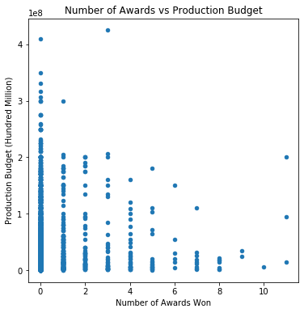
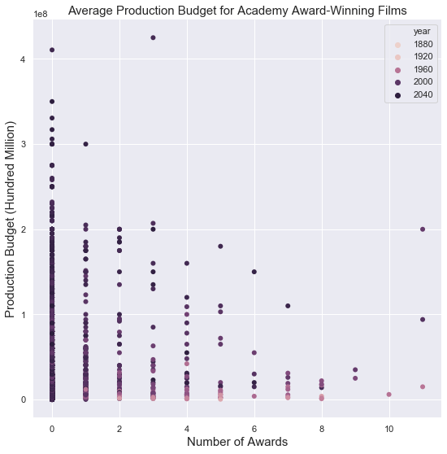
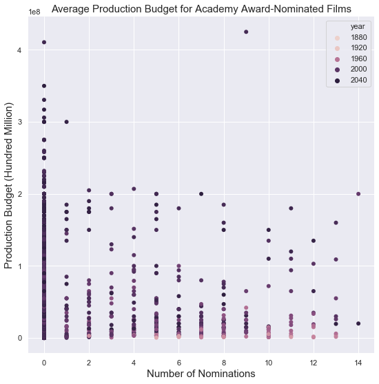
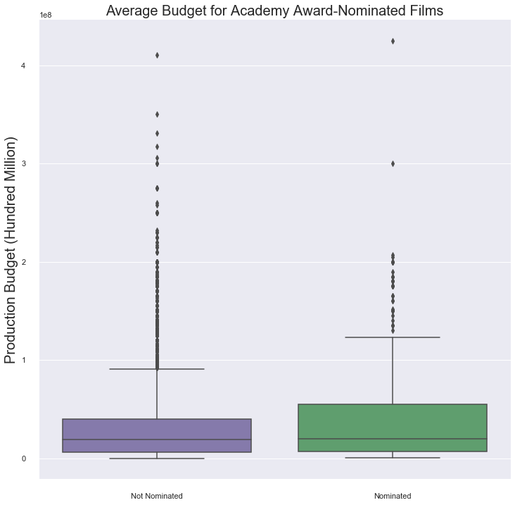
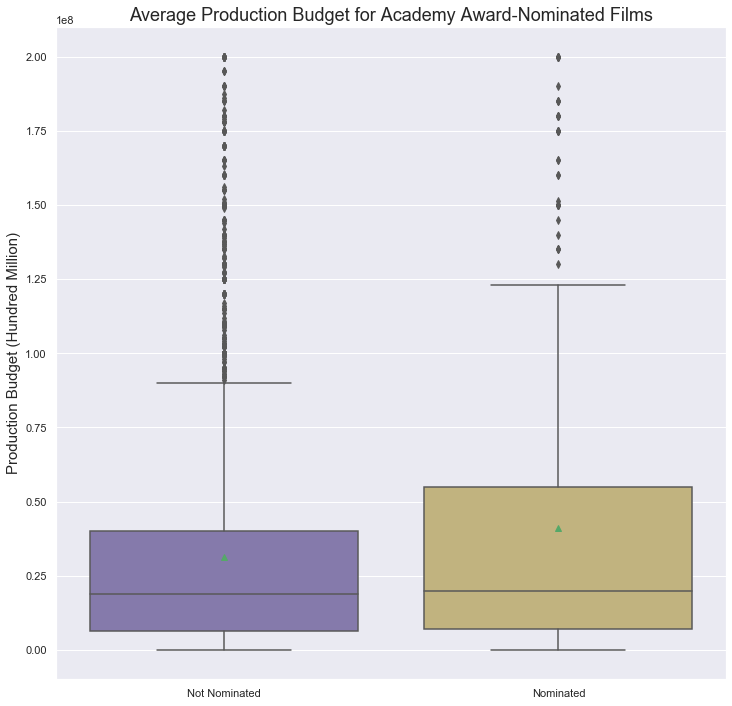
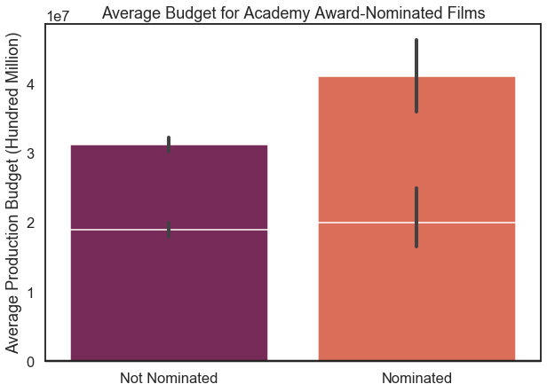

# README

## Goals and Objectives

We were tasked with analyzing movie data from the likes of IMDb, tmdb (the movie database), and Box Office Mojo, to create actionable insight that Microsoft can use to start a film studio.

Our initial view took note of the production budgets and profits from a list of +5,000 films. Other sets had data regarding the film crew, countries where the films were released, etc.

**Objectives** 
Our clear objectives consisted of answering 2 group questions and 1 individual question per team member. 

Here I will be describing the group questions and my individual question:


## Group Question 2: Does an Academy Award require a certain budget?

This question explores the relationship between film production budgets and one of the highest-level artistic recognitions for a film, the Academy Award. Since Academy Awards nominations are known to help drive subsequent box-office sales (see [this link](https://knowledge.wharton.upenn.edu/article/oscars-economics/#:~:text=%E2%80%9CAccording%20to%20the%20data%2C%20it,the%20movie%2C%E2%80%9D%20he%20said.&text=%E2%80%9CThere's%20no%20evidence%20that%20%5BOscar,%2C%20your%20salary%20goes%20up.%E2%80%9D)), is there any way we can possibly quantify differences between award-nominated films and non-award nominated films? Can we see how much Microsoft would generally need to spend to create an award-winning film?

Our hypothesis is that it costs more money to hire better acting talent, writers, directors, the rest of the professional film crew, special fx etc, which should result in a better chance at an Academy Award. 

Let's try to see if, based on our data, making an Academy Award-worthy film requires a certain budget range.


```python
import pandas as pd
import os
```


### Import data

Let's batch import our data sets to save some time.


```python
from glob import glob
```

```python
csv_files = glob("./zippedData/*.csv.gz")
csv_files
```
    ['./zippedData/imdb.title.crew.csv.gz',
     './zippedData/tmdb.movies.csv.gz',
     './zippedData/imdb.title.akas.csv.gz',
     './zippedData/imdb.title.ratings.csv.gz',
     './zippedData/imdb.name.basics.csv.gz',
     './zippedData/imdb.title.basics.csv.gz',
     './zippedData/tn.movie_budgets.csv.gz',
     './zippedData/bom.movie_gross.csv.gz',
     './zippedData/imdb.title.principals.csv.gz']

```python
type(csv_files)
d = {}
```

```python
for file in csv_files:              #creating a new dictionary for each .csv file
    d[file] = pd.read_csv(file)
```


### Clean file names

Let's clean the file titles, for easier accessibility throughout our EDA, and create their respective dataframes.


```python
csv_files_dict = {}
for filename in csv_files:
    filename_cleaned = os.path.basename(filename).replace(".csv", "").replace(".", "_").replace('_gz','') # cleaning the filenames
    filename_df = pd.read_csv(filename, index_col=0)
    csv_files_dict[filename_cleaned] = filename_df
```

```python
csv_files_dict.keys()
```

    dict_keys(['imdb_title_crew', 'tmdb_movies', 'imdb_title_akas', 'imdb_title_ratings', 'imdb_name_basics', 'imdb_title_basics', 'tn_movie_budgets', 'bom_movie_gross', 'imdb_title_principals'])


```python

```


### Creating SQL tables from DFs


```python
import sqlite3
```

```python
conn = sqlite3.connect("movies_db.sqlite") 
cur = conn.cursor()
```

```python
def create_sql_table_from_df(df, name, conn):     #batch-creating sql tables from multiple dataframes, with a for loop.
    try:
        df.to_sql(name, conn)
        print(f"Created table {name}")
    
    except Exception as e:
        print(f"could not make table {name}")
        print(e)
```


```python
for name, table in csv_files_dict.items():
    create_sql_table_from_df(table, name, conn)
```

 
```python
cur.execute("select name from sqlite_master where type='table';").fetchall()
```


    [('imdb_title_crew',),
     ('tmdb_movies',),
     ('imdb_title_akas',),
     ('imdb_title_ratings',),
     ('imdb_name_basics',),
     ('imdb_title_basics',),
     ('tn_movie_budgets',),
     ('bom_movie_gross',),
     ('imdb_title_principals',),
     ('films_by_awards.csv',),
     ('films_by_awards',),
     ('films_by_awards1',),
     ('films_by_awards2',),
     ('tn_movie_budgets2',),
     ('tn_movie_budgets_clean',)]


For this question, we will be starting with the tn_movie_budgets dataframe, as this dataframe has the higher number of films with monetary information. 


```python
tn_movie_budgets_df = csv_files_dict['tn_movie_budgets']
```

```python
tn_movie_budgets_df.info()
```

    <class 'pandas.core.frame.DataFrame'>
    Int64Index: 5782 entries, 1 to 82
    Data columns (total 5 columns):
    release_date         5782 non-null object
    movie                5782 non-null object
    production_budget    5782 non-null object
    domestic_gross       5782 non-null object
    worldwide_gross      5782 non-null object
    dtypes: object(5)
    memory usage: 271.0+ KB


```python

#Checking for null values:

tn_movie_budgets_df.isna().sum()
```

    release_date         0
    movie                0
    production_budget    0
    domestic_gross       0
    worldwide_gross      0
    dtype: int64


### Data Cleaning

Let's create a separate column in tn_movie_budgets for release year only. This will help us merge our scraped wikipedia table.


```python
tn_movie_budgets_df['year'] =  pd.DatetimeIndex(tn_movie_budgets_df['release_date']).year
```


Now let's use a function to clean up our monetary columns, so that we can simply calculate the worldwide profit of each film.


```python
def convert_amt_to_int(df, col):
    df[col] = df[col].str.replace("$", "").str.replace(",", "").astype('int')       #replacing unwanted characters
    return df
```
```python
money_cols = ['production_budget', 'domestic_gross', 'worldwide_gross']

for col in money_cols:
    tn_movie_budgets_df = convert_amt_to_int(tn_movie_budgets_df, col)
```


```python
tn_movie_budgets_df.info()
```

    <class 'pandas.core.frame.DataFrame'>
    Int64Index: 5782 entries, 1 to 82
    Data columns (total 6 columns):
    release_date         5782 non-null object
    movie                5782 non-null object
    production_budget    5782 non-null int64
    domestic_gross       5782 non-null int64
    worldwide_gross      5782 non-null int64
    year                 5782 non-null int64
    dtypes: int64(4), object(2)
    memory usage: 316.2+ KB


Checking values to make sure they are clean


```python
for col in tn_movie_budgets_df:
    print(f'Viewing values in col: {col}')
    print(f'Top 5 values:\n{tn_movie_budgets_df[col].value_counts(normalize = True)[:5]}')
    print("-------------------")
```

    Viewing values in col: release_date
    Top 5 values:
    Dec 31, 2014    0.004151
    Dec 31, 2015    0.003978
    Dec 31, 2010    0.002594
    Dec 31, 2008    0.002421
    Dec 31, 2009    0.002248
    Name: release_date, dtype: float64
    -------------------
    Viewing values in col: movie
    Top 5 values:
    King Kong       0.000519
    Home            0.000519
    Halloween       0.000519
    Poltergeist     0.000346
    Total Recall    0.000346
    Name: movie, dtype: float64
    -------------------
    Viewing values in col: production_budget
    Top 5 values:
    20000000    0.039952
    10000000    0.036666
    30000000    0.030612
    15000000    0.029920
    25000000    0.029575
    Name: production_budget, dtype: float64
    -------------------
    Viewing values in col: domestic_gross
    Top 5 values:
    0           0.094777
    8000000     0.001557
    2000000     0.001211
    7000000     0.001211
    10000000    0.001038
    Name: domestic_gross, dtype: float64
    -------------------
    Viewing values in col: worldwide_gross
    Top 5 values:
    0          0.063473
    8000000    0.001557
    7000000    0.001038
    2000000    0.001038
    4000000    0.000692
    Name: worldwide_gross, dtype: float64
    -------------------
    Viewing values in col: year
    Top 5 values:
    2015    0.058457
    2010    0.047388
    2008    0.045659
    2006    0.044967
    2014    0.044102
    Name: year, dtype: float64
    -------------------


Making a new columns for worldwide gross profit. Maybe we can test award winners against profit later!


```python
tn_movie_budgets_df['budget_gross_profit'] = tn_movie_budgets_df['worldwide_gross'] - tn_movie_budgets_df['production_budget']

```

```python
create_sql_table_from_df(tn_movie_budgets_df, 'tn_movie_budgets_clean', conn)
```


### Importing scraped Academy Award table

Let's import the dataframe of our scraped Academy-Award winning films, and clean up the column names.


```python
df2 = pd.read_csv('films_by_awards.csv')
df2.rename(columns = {"Film\n": "film", "Awards\n": "awards", "Nominations\n": "nominations", "Year\n": "year"}, inplace=True)
df2
create_sql_table_from_df(df2, 'films_by_awards2', conn)
```


```python
df2.info()
```

    <class 'pandas.core.frame.DataFrame'>
    RangeIndex: 1316 entries, 0 to 1315
    Data columns (total 5 columns):
    Unnamed: 0     1316 non-null int64
    film           1316 non-null object
    year           1316 non-null object
    awards         1316 non-null object
    nominations    1316 non-null object
    dtypes: int64(1), object(4)
    memory usage: 51.5+ KB


### Joining separate data tables

Let's join our Academy Award winner data to our table of gross and profit data.


```python
cur.execute('''SELECT b.*, awards, nominations
                FROM tn_movie_budgets_clean b
                LEFT JOIN films_by_awards2 a
                ON a.film = b.movie
                AND a.year = b.year                                
                ORDER BY budget_gross_profit DESC                  
                ''')                            # we needed to join our scraped table on two conditions, because some 
                                                #films were created on multiple years with the same name.            
awards_to_budget_df = pd.DataFrame(cur.fetchall())
awards_to_budget_df.columns = [x[0] for x in cur.description]
awards_to_budget_df.head()
```


```python
import seaborn as sns
import matplotlib.pyplot as plt
%matplotlib inline
```

### Further cleaning of new data


```python
awards_to_budget_df['awards'].unique()
```


    array(['3', '11', None, '2', '1', '4', '6', '7', '5', '8 (2)', '8',
           '4 (1)', '0 (1)', '1 (1)', '9', '0 (2)', '10', '5 (1)', '7 (1)'],
          dtype=object)


```python
awards_to_budget_df['nominations'].unique()
```


    array(['9', '14', None, '7', '2', '11', '3', '5', '4', '1', '6', '8',
           '13', '10', '12', '10[4]\n', '0', '6[11]\n'], dtype=object)


Let's remove any extra characters included from the Wikipedia table, to leave only the number of competitive awards for each film. Let's also convert any null values to 0, for graphing purposes later on.


```python
def clean_vals(df, col):
    df[col] = df[col].str.rstrip('\n').str.replace("\(.*\)", "").fillna("0").astype('int')
    return df
```


```python
academy_award_cols = ['awards']

for col in academy_award_cols:
    awards_to_budget_df = clean_vals(awards_to_budget_df, col)
```


```python
awards_to_budget_df['awards'].unique()
```


    array([ 3, 11,  0,  2,  1,  4,  6,  7,  5,  8,  9, 10])


```python
awards_to_budget_df['nominations'].unique()
```

    array(['9', '14', None, '7', '2', '11', '3', '5', '4', '1', '6', '8',
           '13', '10', '12', '10[4]\n', '0', '6[11]\n'], dtype=object)


Cleaning the nominations column. This took quite a bit of tries as we tried to separate the "\n" first and then the bracketed footnote. Eventually we stepped back onto a simple but effective solution of dividing the string at the cutoff of our desired value, which was the inner bracket "["


```python
'10[4]\n'.split('[')
```

    ['10', '4]\n']


```python
value_split = awards_to_budget_df['nominations'].str.split('[').fillna("0")
```


```python
type(value_split)
```


    pandas.core.series.Series


```python
(value_split[0][0])
```

    '9'

Reassigning the cleaned value back to the 'nominations' column


```python
awards_to_budget_df['nominations'] = value_split.str.get(0).astype('int')
```


```python
awards_to_budget_df['nominations'].unique()
```

    array([ 9, 14,  0,  7,  2, 11,  3,  5,  4,  1,  6,  8, 13, 10, 12])


### Cleaning Out Movies that Grossed 0 dollars

Remove movies which have not been released yet, or made absolutely no money whatsoever.


```python
current_movies = awards_to_budget_df[awards_to_budget_df['worldwide_gross'] == 0]

```

```python
gross_index = awards_to_budget_df[awards_to_budget_df['worldwide_gross'] == 0].index
awards_to_budget_df.drop(gross_index, inplace=True)
```


```python
awards_to_budget_df.info()
```

    <class 'pandas.core.frame.DataFrame'>
    Int64Index: 5415 entries, 0 to 5781
    Data columns (total 10 columns):
    id                     5415 non-null int64
    release_date           5415 non-null object
    movie                  5415 non-null object
    production_budget      5415 non-null int64
    domestic_gross         5415 non-null int64
    worldwide_gross        5415 non-null int64
    year                   5415 non-null int64
    budget_gross_profit    5415 non-null int64
    awards                 5415 non-null int64
    nominations            5415 non-null int64
    dtypes: int64(8), object(2)
    memory usage: 465.4+ KB


### Nominated or Not nominated?

Let's create a column for the boolean value of nomination (nominated or not).


```python
awards_to_budget_df['nominated'] = (awards_to_budget_df['nominations'] > 0)

```


### Stats Check

Checking summary statistics to get a feel for the distribution of the sample.


```python
awards_to_budget_df.describe()
```


## Exploring Visualizations

Let's try to make sense of our data by exploring some visualizations

### Awards vs Production Budget


```python
awards_to_budget_df.plot.scatter(x='awards', y='production_budget', figsize=(6,6))
plt.xlabel("Number of Awards Won")
plt.ylabel("Production Budget (Hundred Million)")
plt.title("Number of Awards vs Production Budget");

```





This quick scatter plot shows us that many films with relatively low production budgets were able to not only get nominated but win Academy Awards. 

#### Seaborn Visualizations

Let's make use of seaborn visuals and map a different color to each film based upon the range of release date they fall into.


```python
import seaborn as sns
```


```python
sns.set(style="darkgrid")


# Draw a scatter plot while assigning point colors and sizes to different
# variables in the dataset
f, ax = plt.subplots(figsize=(9, 9))
sns.despine(f, left=True, bottom=True)
sns.scatterplot(x="awards", y="production_budget",
                hue="year",
                hue_order='year',
                sizes=(1, 8), linewidth=0,
                data=awards_to_budget_df, ax=ax)

ax.set_ylabel("Production Budget (Hundred Million)", fontsize=15)
ax.set_xlabel('Number of Awards', fontsize=15)
ax.set_title("Average Production Budget for Academy Award-Winning Films", fontsize=15);
```





Here we can see that older Academy Award-winning films generally have lower production budgets. Perhaps earlier film companies had less access to capital investments as the film industry took time to grow in popularity.

### Nominations vs Production Budget

In order to have won an Academy Award, a film must first be nominated for that award. Let's explore those numbers.


```python
sns.set(style="darkgrid")


# Draw a scatter plot while assigning point colors and sizes to different
# variables in the dataset
f, ax = plt.subplots(figsize=(9, 9))
sns.despine(f, left=True, bottom=True)
sns.scatterplot(x="nominations", y="production_budget",
                hue="year",
                hue_order='year',
                sizes=(1, 8), linewidth=0,
                data=awards_to_budget_df, ax=ax);

ax.set_ylabel("Production Budget (Hundred Million)", fontsize=15)
ax.set_xlabel('Number of Nominations', fontsize=15)
ax.set_title("Average Production Budget for Academy Award-Nominated Films", fontsize=15);

```





There are more films for the nomination categories now. The majority of nominated films seem to spend around $200 Million or less.


### Nominated or Not vs Production Budget

Maybe it would be smarter to try a boxplot in order to better understand the distribution of production budgets against whether they were nominated or not. 


```python

f, ax = plt.subplots(figsize=(12, 12))

sns.boxplot(x="nominated", y="production_budget",
             palette=["m", "g"],
            data=awards_to_budget_df)

ax.set_ylabel("Production Budget (Hundred Million)", fontsize=20)
ax.set_xlabel('',)
ax.set(xticklabels=["Not Nominated", "Nominated"])
ax.set_title("Average Budget for Academy Award-Nominated Films", fontsize=20);

sns.despine(offset=10, trim=True)
```





### Removing furthest outliers from data

The our data is getting crunched by some far-reaching outliers. Let's try removing the the top and bottom 1% of outliers and see if we can get a better idea of the distribution of each category.


```python
budget = awards_to_budget_df['production_budget']
removed_outliers = budget.between(budget.quantile(.01), budget.quantile(.99))
index_names = awards_to_budget_df[~removed_outliers].index                     # "~" is inverting the dataframe
print(index_names)
```

    Int64Index([   0,    2,    3,    4,    6,   13,   17,   19,   28,   29,   37,
                  45,   54,   61,   63,   65,   73,   81,   82,   85,   89,  101,
                 108,  123,  167,  170,  210,  232,  236,  246,  264,  396,  530,
                 633,  729,  883,  916, 1072, 1708, 2277, 2783, 2942, 3161, 3221,
                3292, 3310, 3360, 3383, 3456, 3501, 3518, 3535, 3547, 3559, 3563,
                3565, 3574, 3576, 3589, 3590, 3596, 3601, 3602, 3606, 3609, 3613,
                3616, 3619, 3623, 3630, 3633, 3638, 3660, 3661, 3662, 3664, 3665,
                3666, 3668, 3671, 3675, 3681, 3683, 3689, 3692, 3697, 3700, 3711,
                3717, 3718, 3719, 5341, 5781],
               dtype='int64')


```python

```
awards_to_budget_df.drop(index_names, inplace=True)
```


```python
awards_to_budget_df.describe() 
```


<div>
<style scoped>
    .dataframe tbody tr th:only-of-type {
        vertical-align: middle;
    }

    .dataframe tbody tr th {
        vertical-align: top;
    }

    .dataframe thead th {
        text-align: right;
    }
</style>
<table border="1" class="dataframe">
  <thead>
    <tr style="text-align: right;">
      <th></th>
      <th>id</th>
      <th>production_budget</th>
      <th>domestic_gross</th>
      <th>worldwide_gross</th>
      <th>year</th>
      <th>budget_gross_profit</th>
      <th>awards</th>
      <th>nominations</th>
    </tr>
  </thead>

The summary stats tell us that the mean has gone down slightly. The Max production budget is now only 200 Million, more than half of the highest budget of 425 Million  before.


## Final Visualizations

### New Distribution Boxplot


```python
f, ax = plt.subplots(figsize=(12, 12))


sns.boxplot(x="nominated", y="production_budget", palette=["m", "y"],
            data=awards_to_budget_df, showmeans=True, ax=ax)

ax.set(xticklabels=["Not Nominated", "Nominated"])


ax.set_ylabel("Production Budget (Hundred Million)", fontsize=15)
ax.set_xlabel('', fontsize=15)
ax.set_title("Average Production Budget for Academy Award-Nominated Films", fontsize=18);
```





Comparing the mean value (green triangle) with the median line, our boxplot shows us that the data set does not have a normal distribution, and is positively skewed. 

The average budget is still pulled higher by outliers, although the IQR of production_budgets reaches further for nominated films. Perhaps the concentration of older films on the low end of the budget scale is pulling back the median. 

Because of the skewed distribution, the median might give us the more accurate idea of award-winning production budget. Therefore, our hypothesis can not be confirmed here as *most* nominated films don't necessarily spend more than non-nominated ones.

### Average Budget vs Nomination Bar Plot

Let's try a different visualization of average production budget, and median production budget with a bar plot.


```python
sns.set(style="white", context="talk")


# Set up the matplotlib figure
f, (ax1) = plt.subplots(figsize=(10, 7), sharex=True)

# Generate some sequential data
x = awards_to_budget_df['nominated']
y1 = awards_to_budget_df['production_budget']
sns.barplot(x=x, y=y1, palette="rocket", ax=ax1)
ax1.axhline(0, color="k", clip_on=False)
ax1.set_ylabel("Average Production Budget (Hundred Million)")
ax1.set_xlabel('')
ax1.set(xticklabels=["Not Nominated", "Nominated"])
ax1.set_title("Average Budget for Academy Award-Nominated Films");

from numpy import median                                                 #
x = awards_to_budget_df['nominated']
y1 = awards_to_budget_df['production_budget']
sns.barplot(x=x, y=y1, palette="rocket", ax=ax1, estimator=median)
ax1.axhline(0, color="k", clip_on=False)
ax1.set_ylabel("Average Production Budget (Hundred Million)")
ax1.set_xlabel('')
ax1.set(xticklabels=["Not Nominated", "Nominated"])
ax1.set_title("Average Budget for Academy Award-Nominated Films");
```





It is easier to see now that the average for production budget is higher for award winning films, however the median budgets are just slightly higher for nominated films. 

### Average Profit vs Nomination

Now let's make a bar plot to see if award-nominated films do in fact make more money.


```python
sns.set(style="white", context="talk")


# Set up the matplotlib figure
f, (ax1) = plt.subplots(figsize=(10, 7), sharex=True)

# Generate some sequential data
x = awards_to_budget_df['nominated']
y1 = awards_to_budget_df['budget_gross_profit']
sns.barplot(x=x, y=y1, palette="rocket", ax=ax1)
ax1.axhline(0, color="k", clip_on=False)
ax1.set_ylabel("Average Profit (Hundred Million)")
ax1.set_xlabel('')
ax1.set(xticklabels=["Not Nominated", "Nominated"])
ax1.set_title("Average Profit for Academy Award-Nominated Films");

x = awards_to_budget_df['nominated']
y1 = awards_to_budget_df['budget_gross_profit']
sns.barplot(x=x, y=y1, palette="rocket", ax=ax1, estimator=median)
ax1.axhline(0, color="k", clip_on=False)
ax1.set_ylabel("Average Profit (Hundred Million)")
ax1.set_xlabel('')
ax1.set(xticklabels=["Not Nominated", "Nominated"])
ax1.set_title("Average Profit for Academy Award-Nominated Films");

```


This bar plot of average and median profit based on nominations helps us verify that nominated films return much higher profits.

Our bar plots of budget tells us that, on average, award-nominated films made way more money up front in the production phase. This would suggest that things like higher-quality production, renowned film writers, directors and actors is worth spending more money on. However, considering the positively skewed distribution, the median value tells us there is usually no big difference in production budget. It may be worth it to conduct a follow up analysis based only on the most recent films.

What we know for sure is, if a film is nominated for an award, the subsequent profits are then boosted substantially.

Future exploration: Are the budget and gross values adjusted for inflation? Could using only more recent films (within the last 20 years) give us more accurate values or perhaps a more normal distribution?


_______________________________________________________________________________________________________


## My Individual Question: What type of films win the most awards?


So our group questions covered the topics concerning profits vs number of international releases, and also production budgets vs Academy Awards. I wanted to expand a bit on the Academy Award topic, given that an award nomination not only greatly increases profits, but heightens the reputation of the film studio. 

If we could get a bit more insight into what genres of movies are more likely to win an award recently, then we can infer that Microsoft should aim to create a movie of that genre. 

Let's get started by importing our data.


```python
import pandas as pd
import os
import sqlite3
```

### Import Data Tables 

Let's bring in and view our initial scraped award table that we used in our Group Question


```python
conn = sqlite3.connect("movies_db.sqlite") 
cur = conn.cursor()
```

```python
cur.execute("select name from sqlite_master where type='table';").fetchall()
```

    [('imdb_title_crew',),
     ('tmdb_movies',),
     ('imdb_title_akas',),
     ('imdb_title_ratings',),
     ('imdb_name_basics',),
     ('imdb_title_basics',),
     ('tn_movie_budgets',),
     ('bom_movie_gross',),
     ('imdb_title_principals',),
     ('films_by_awards.csv',),
     ('films_by_awards',),
     ('films_by_awards1',),
     ('films_by_awards2',),
     ('tn_movie_budgets2',),
     ('tn_movie_budgets_clean',)]


As we have already created SQL tables in our group question notebook, we will skip to viewing the dataframes from those SQL tables.


```python
cur.execute('''SELECT *
               FROM films_by_awards2                
                ''') 

nominated_films_df = pd.DataFrame(cur.fetchall())
nominated_films_df.columns = [x[0] for x in cur.description]
nominated_films_df
```

```python
nominated_films_df.info()

```

    <class 'pandas.core.frame.DataFrame'>
    RangeIndex: 1316 entries, 0 to 1315
    Data columns (total 6 columns):
    index          1316 non-null int64
    Unnamed: 0     1316 non-null int64
    film           1316 non-null object
    year           1316 non-null object
    awards         1316 non-null object
    nominations    1316 non-null object
    dtypes: int64(2), object(4)
    memory usage: 61.8+ KB


```python
nominated_films_df['year'].unique()
```

    array(['2019', '2018', '2017', '2016', '2015', '2014', '2013', '2012',
           '2011', '2010', '2009', '2008', '2007', '2006', '2005', '2004',
           '2003', '2002', '2001', '2000', '1999', '1998', '1997', '1996',
           '1995', '1994', '1993', '1992', '1991', '1990', '1989', '1988',
           '1987', '1986', '1985', '1984', '1983', '1982', '1981', '1980',
           '1979', '1978', '1977', '1976', '1975', '1974', '1973', '1972',
           '1971', '1970', '1969', '1968', '1967', '1966', '1965', '1927/28',
           '1954', '1949', '1938', '1951', '1943', '1960', '1953', '1957',
           '1950', '1929/30', '1941', '1958', '1963', '1956', '1945', '1946',
           '1936', '1940', '1937', '1947', '1952', '1931/32', '1942', '1964',
           '1959', '1948', '1962', '1961', '1928/29', '1955', '1935', '1939',
           '1932/33', '1930/31', '1934', '1944'], dtype=object)


## Cleaning Data

Let's clean up these values containing two years, so that we can figure out how many films were awarded most recently (since 2010).


```python
value_split = nominated_films_df['year'].str.split('/')
```


```python
nominated_films_df['year'] = value_split.str.get(0).astype('int')
```


```python
nominated_films_df['year'].unique()
```


    array([2019, 2018, 2017, 2016, 2015, 2014, 2013, 2012, 2011, 2010, 2009,
           2008, 2007, 2006, 2005, 2004, 2003, 2002, 2001, 2000, 1999, 1998,
           1997, 1996, 1995, 1994, 1993, 1992, 1991, 1990, 1989, 1988, 1987,
           1986, 1985, 1984, 1983, 1982, 1981, 1980, 1979, 1978, 1977, 1976,
           1975, 1974, 1973, 1972, 1971, 1970, 1969, 1968, 1967, 1966, 1965,
           1927, 1954, 1949, 1938, 1951, 1943, 1960, 1953, 1957, 1950, 1929,
           1941, 1958, 1963, 1956, 1945, 1946, 1936, 1940, 1937, 1947, 1952,
           1931, 1942, 1964, 1959, 1948, 1962, 1961, 1928, 1955, 1935, 1939,
           1932, 1930, 1934, 1944])


Let's see how many films were awarded since 2010.


```python
newest_films = nominated_films_df['year'] > 2010    
newest_films.value_counts()
```

    False    1180
    True      136
    Name: year, dtype: int64


We have 136 films that were awarded since 2010.

Now let's view a table that contains films and their respective genres since 2010.


```python
cur.execute('''SELECT *
               FROM imdb_title_basics
               ORDER BY start_year
                ''') 

movies_df = pd.DataFrame(cur.fetchall())
movies_df.columns = [x[0] for x in cur.description]
movies_df
```


## Joining Awards Data to Genre Data

Let's do an inner-join of this imdb_title_basics table to our Awards data and hopefully we will have genre info for most of the recently-nominated films.


```python
cur.execute('''SELECT a.film, a.year, a.awards, a.nominations, b.genres
               FROM films_by_awards2 a
               JOIN imdb_title_basics b 
               ON a.film = b.primary_title
               AND a.year = b.start_year
                ''') 

awards_to_genres_df = pd.DataFrame(cur.fetchall())
awards_to_genres_df.columns = [x[0] for x in cur.description]
awards_to_genres_df
```


We are left with 120 rows, and a few apparent duplicates. Let's drop those duplicates below:

### Cleaning Duplicated Data


```python
awards_to_genres_df.drop_duplicates(subset='film', keep='last', inplace=True)
```


We are now left with the most recent 114 award winning films, and their attributed genres. Not too bad! My general thought for this data is that using the most recent 10 years of films would give a more accurate representation of the distribution of genres that are more likely to get awarded in the near future.

Let's get to work on creating a column for each genre, starting by splitting each row's list of genres.

### Reformatting Data 


```python
awards_to_genres_df['genres'] = awards_to_genres_df['genres'].apply(lambda x: x.split(",") if x in x else x)

#the above iterates through each rows for genre, splitting from the comma if a comma is contained
```


```python
awards_to_genres_df['genres'].head()
```

    1                 [Drama, Thriller]
    2        [Action, Biography, Drama]
    3                  [Drama, Romance]
    4              [Comedy, Drama, War]
    5    [Adventure, Animation, Comedy]
    Name: genres, dtype: object

Let's make a new set, by iterating through each separated value in genres with a for loop


```python
all_genres = set()                      
for genres in awards_to_genres_df['genres']:
    if genres:
        all_genres.update(genres)
```


```python
all_genres
```
    {'Action',
     'Adventure',
     'Animation',
     'Biography',
     'Comedy',
     'Crime',
     'Documentary',
     'Drama',
     'Family',
     'Fantasy',
     'History',
     'Horror',
     'Music',
     'Musical',
     'Mystery',
     'Romance',
     'Sci-Fi',
     'Sport',
     'Thriller',
     'War',
     'Western'}


Now let's iterate through each genre, creating a new column for each iteration (each genre) and assigning it a 0 value


```python
for genre in all_genres:
    awards_to_genres_df[genre] = np.zeros(shape=awards_to_genres_df.shape[0])
                                

for index, row in awards_to_genres_df.iterrows():   #iterates through the dataframe rows as pairs of index and row
    if row['genres']:                               #if the row contains the genres:
        for genre in row['genres']:                 #for each iteration (genre) of the genres list, 
            awards_to_genres_df.loc[index, genre] = 1                  #the column for that genre get a 1

awards_to_genres_df.info()
```

    <class 'pandas.core.frame.DataFrame'>
    Int64Index: 114 entries, 1 to 119
    Data columns (total 26 columns):
    film           114 non-null object
    year           114 non-null object
    awards         114 non-null object
    nominations    114 non-null object
    genres         114 non-null object
    Sport          114 non-null float64
    Musical        114 non-null float64
    Action         114 non-null float64
    Comedy         114 non-null float64
    Thriller       114 non-null float64
    Drama          114 non-null float64
    Sci-Fi         114 non-null float64
    War            114 non-null float64
    Animation      114 non-null float64
    Family         114 non-null float64
    Documentary    114 non-null float64
    Music          114 non-null float64
    Fantasy        114 non-null float64
    Crime          114 non-null float64
    Western        114 non-null float64
    Horror         114 non-null float64
    Mystery        114 non-null float64
    Adventure      114 non-null float64
    Biography      114 non-null float64
    Romance        114 non-null float64
    History        114 non-null float64
    dtypes: float64(21), object(5)
    memory usage: 29.0+ KB


Now all of our values in each column is filled.


We can now drop our old column of genre lists.


```python
awards_to_genres_df2 = awards_to_genres_df.drop(columns = 'genres')
```


```python

Looking good- let's just quickly check our nominations and awards columns for value cleanliness.


```python
awards_to_genres_df['nominations'].unique()
```


    array(['6', '4', '2', '11', '10', '1', '5', '7', '8', '3', '13', '14',
           '12', '9'], dtype=object)


```python
awards_to_genres_df['awards'].unique()
```


    array(['4', '2', '1', '3', '6', '7', '5'], dtype=object)


Now, let's make a list of each column and assign the genre columns to a variable.

### Extracting the Specific Data We Need


```python
cols = list(awards_to_genres_df.columns)
cols
```


    ['film',
     'year',
     'awards',
     'nominations',
     'genres',
     'Sport',
     'Musical',
     'Action',
     'Comedy',
     'Thriller',
     'Drama',
     'Sci-Fi',
     'War',
     'Animation',
     'Family',
     'Documentary',
     'Music',
     'Fantasy',
     'Crime',
     'Western',
     'Horror',
     'Mystery',
     'Adventure',
     'Biography',
     'Romance',
     'History']


```python
genre_cols = cols[5:]
```

let's create a dictionary of genres to store their respective value counts


```python
nominated_genre_count = {}       
for col in genre_cols:                       #iterate through the genre cols to only add genres where the count is 1 and add them to a dictionary
    count = np.sum(awards_to_genres_df[col] == 1).sum() 
    nominated_genre_count[col] = count
```


```python
nominated_genre_count
```


    {'Sport': 3,
     'Musical': 2,
     'Action': 12,
     'Comedy': 19,
     'Thriller': 16,
     'Drama': 78,
     'Sci-Fi': 9,
     'War': 3,
     'Animation': 10,
     'Family': 5,
     'Documentary': 9,
     'Music': 8,
     'Fantasy': 7,
     'Crime': 8,
     'Western': 1,
     'Horror': 4,
     'Mystery': 5,
     'Adventure': 24,
     'Biography': 32,
     'Romance': 14,
     'History': 12}


Now let's sort this dictionary by number of nominations!


```python
sorted_genre_count = {k: v for k, v in sorted(nominated_genre_count.items(), key=lambda item: item[1])}

#here, we iterated through each key-value pair and assigned the sorting key based on the second [1] item, the value

```
```python
sorted_genre_count
```


    {'Western': 1,
     'Musical': 2,
     'Sport': 3,
     'War': 3,
     'Horror': 4,
     'Family': 5,
     'Mystery': 5,
     'Fantasy': 7,
     'Music': 8,
     'Crime': 8,
     'Sci-Fi': 9,
     'Documentary': 9,
     'Animation': 10,
     'Action': 12,
     'History': 12,
     'Romance': 14,
     'Thriller': 16,
     'Comedy': 19,
     'Adventure': 24,
     'Biography': 32,
     'Drama': 78}


Now we are separating the keys and values of the dictionary for plotting.


```python
genres = list(sorted_genre_count.keys())
number_nominated = list(sorted_genre_count.values())
```

### Visualization


```python
import seaborn as sns
import matplotlib.pyplot as plt
sns.set(style="darkgrid", context="talk")

f, (ax1) = plt.subplots(figsize=(12, 8), sharex=True)

sns.barplot(x=number_nominated, y=genres, palette=("rocket_r"), ax=ax1)
ax1.set_ylabel("Genres", fontsize=20)
ax1.set_xlabel("Number of Films Awarded")
ax1.set_title("Number of Academy-Award Winners Since 2010 by Genre");
```


This chart tells us that Drama films win the most Academy Awards by far! With Biographies and Aventure films following in 2nd and 3rd, respectively.

As most films are a combination of 2 or 3 genres, I would suggest Microsoft ties dramatic themes to their films, and not stick by purely action or purely sci-fi for example. 

