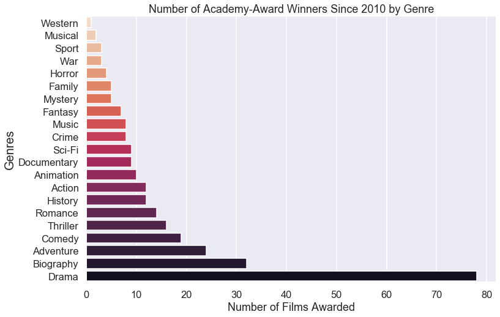

# What type of films win the most awards?

So our group questions covered the topics concerning profits vs number of international releases, and also production budgets vs Academy Awards. I wanted to expand a bit on the Academy Award topic, given that an award nomination not only greatly increases profits, but heightens the reputation of the film studio. 

If we could get a bit more insight into what genres of movies are more likely to win an award recently, then we can infer that Microsoft should aim to create a movie of that genre. 

Let's get started by importing our data.


```python
import pandas as pd
import os
import sqlite3
```

## Import Data Tables 

Let's bring in and view our initial scraped award table that we used in our Group Question


```python
conn = sqlite3.connect("movies_db.sqlite") 
cur = conn.cursor()
```


```python
cur.execute("select name from sqlite_master where type='table';").fetchall()
```


    [('imdb_title_crew',),
     ('tmdb_movies',),
     ('imdb_title_akas',),
     ('imdb_title_ratings',),
     ('imdb_name_basics',),
     ('imdb_title_basics',),
     ('tn_movie_budgets',),
     ('bom_movie_gross',),
     ('imdb_title_principals',),
     ('films_by_awards.csv',),
     ('films_by_awards',),
     ('films_by_awards1',),
     ('films_by_awards2',),
     ('tn_movie_budgets2',),
     ('tn_movie_budgets_clean',)]


As we have already created SQL tables in our group question notebook, we will skip to viewing the dataframes from those SQL tables.


```python
cur.execute('''SELECT *
               FROM films_by_awards2                
                ''') 

nominated_films_df = pd.DataFrame(cur.fetchall())
nominated_films_df.columns = [x[0] for x in cur.description]
nominated_films_df
```


<div>
<style scoped>
    .dataframe tbody tr th:only-of-type {
        vertical-align: middle;
    }

    .dataframe tbody tr th {
        vertical-align: top;
    }

    .dataframe thead th {
        text-align: right;
    }
</style>
<table border="1" class="dataframe">
  <thead>
    <tr style="text-align: right;">
      <th></th>
      <th>index</th>
      <th>Unnamed: 0</th>
      <th>film</th>
      <th>year</th>
      <th>awards</th>
      <th>nominations</th>
    </tr>
  </thead>
  <tbody>
    <tr>
      <td>0</td>
      <td>0</td>
      <td>0</td>
      <td>Parasite</td>
      <td>2019</td>
      <td>4</td>
      <td>6</td>
    </tr>
    <tr>
      <td>1</td>
      <td>1</td>
      <td>1</td>
      <td>Ford v Ferrari</td>
      <td>2019</td>
      <td>2</td>
      <td>4</td>
    </tr>
    <tr>
      <td>2</td>
      <td>2</td>
      <td>2</td>
      <td>Learning to Skateboard in a Warzone (If You're...</td>
      <td>2019</td>
      <td>1</td>
      <td>1</td>
    </tr>
    <tr>
      <td>3</td>
      <td>3</td>
      <td>3</td>
      <td>The Neighbors' Window</td>
      <td>2019</td>
      <td>1</td>
      <td>1</td>
    </tr>
    <tr>
      <td>4</td>
      <td>4</td>
      <td>4</td>
      <td>Little Women</td>
      <td>2019</td>
      <td>1</td>
      <td>6</td>
    </tr>
    <tr>
      <td>...</td>
      <td>...</td>
      <td>...</td>
      <td>...</td>
      <td>...</td>
      <td>...</td>
      <td>...</td>
    </tr>
    <tr>
      <td>1311</td>
      <td>1311</td>
      <td>1311</td>
      <td>The Yankee Doodle Mouse</td>
      <td>1943</td>
      <td>1</td>
      <td>1</td>
    </tr>
    <tr>
      <td>1312</td>
      <td>1312</td>
      <td>1312</td>
      <td>The Yearling</td>
      <td>1946</td>
      <td>2</td>
      <td>7</td>
    </tr>
    <tr>
      <td>1313</td>
      <td>1313</td>
      <td>1313</td>
      <td>Yesterday, Today and Tomorrow (Ieri, oggi, dom...</td>
      <td>1964</td>
      <td>1</td>
      <td>1</td>
    </tr>
    <tr>
      <td>1314</td>
      <td>1314</td>
      <td>1314</td>
      <td>You Can't Take It with You</td>
      <td>1938</td>
      <td>2</td>
      <td>7</td>
    </tr>
    <tr>
      <td>1315</td>
      <td>1315</td>
      <td>1315</td>
      <td>Zorba the Greek (Alexis Zorbas)</td>
      <td>1964</td>
      <td>3</td>
      <td>7</td>
    </tr>
  </tbody>
</table>
<p>1316 rows × 6 columns</p>
</div>


```python
nominated_films_df.info()

```

    <class 'pandas.core.frame.DataFrame'>
    RangeIndex: 1316 entries, 0 to 1315
    Data columns (total 6 columns):
    index          1316 non-null int64
    Unnamed: 0     1316 non-null int64
    film           1316 non-null object
    year           1316 non-null object
    awards         1316 non-null object
    nominations    1316 non-null object
    dtypes: int64(2), object(4)
    memory usage: 61.8+ KB
    


```python
nominated_films_df['year'].unique()
```


    array(['2019', '2018', '2017', '2016', '2015', '2014', '2013', '2012',
           '2011', '2010', '2009', '2008', '2007', '2006', '2005', '2004',
           '2003', '2002', '2001', '2000', '1999', '1998', '1997', '1996',
           '1995', '1994', '1993', '1992', '1991', '1990', '1989', '1988',
           '1987', '1986', '1985', '1984', '1983', '1982', '1981', '1980',
           '1979', '1978', '1977', '1976', '1975', '1974', '1973', '1972',
           '1971', '1970', '1969', '1968', '1967', '1966', '1965', '1927/28',
           '1954', '1949', '1938', '1951', '1943', '1960', '1953', '1957',
           '1950', '1929/30', '1941', '1958', '1963', '1956', '1945', '1946',
           '1936', '1940', '1937', '1947', '1952', '1931/32', '1942', '1964',
           '1959', '1948', '1962', '1961', '1928/29', '1955', '1935', '1939',
           '1932/33', '1930/31', '1934', '1944'], dtype=object)


## Cleaning Data

Let's clean up these values containing two years, so that we can figure out how many films were awarded most recently (since 2010).


```python
value_split = nominated_films_df['year'].str.split('/')
```


```python
nominated_films_df['year'] = value_split.str.get(0).astype('int')
```


```python
nominated_films_df['year'].unique()
```


    array([2019, 2018, 2017, 2016, 2015, 2014, 2013, 2012, 2011, 2010, 2009,
           2008, 2007, 2006, 2005, 2004, 2003, 2002, 2001, 2000, 1999, 1998,
           1997, 1996, 1995, 1994, 1993, 1992, 1991, 1990, 1989, 1988, 1987,
           1986, 1985, 1984, 1983, 1982, 1981, 1980, 1979, 1978, 1977, 1976,
           1975, 1974, 1973, 1972, 1971, 1970, 1969, 1968, 1967, 1966, 1965,
           1927, 1954, 1949, 1938, 1951, 1943, 1960, 1953, 1957, 1950, 1929,
           1941, 1958, 1963, 1956, 1945, 1946, 1936, 1940, 1937, 1947, 1952,
           1931, 1942, 1964, 1959, 1948, 1962, 1961, 1928, 1955, 1935, 1939,
           1932, 1930, 1934, 1944])


Let's see how many films were awarded since 2010.


```python
newest_films = nominated_films_df['year'] > 2010    
newest_films.value_counts()
```


    False    1180
    True      136
    Name: year, dtype: int64


We have 136 films that were awarded since 2010.

Now let's view a table that contains films and their respective genres since 2010.


```python
cur.execute('''SELECT *
               FROM imdb_title_basics
               ORDER BY start_year
                ''') 

movies_df = pd.DataFrame(cur.fetchall())
movies_df.columns = [x[0] for x in cur.description]
movies_df
```


<div>
<style scoped>
    .dataframe tbody tr th:only-of-type {
        vertical-align: middle;
    }

    .dataframe tbody tr th {
        vertical-align: top;
    }

    .dataframe thead th {
        text-align: right;
    }
</style>
<table border="1" class="dataframe">
  <thead>
    <tr style="text-align: right;">
      <th></th>
      <th>tconst</th>
      <th>primary_title</th>
      <th>original_title</th>
      <th>start_year</th>
      <th>runtime_minutes</th>
      <th>genres</th>
    </tr>
  </thead>
  <tbody>
    <tr>
      <td>0</td>
      <td>tt0146592</td>
      <td>Pál Adrienn</td>
      <td>Pál Adrienn</td>
      <td>2010</td>
      <td>136.0</td>
      <td>Drama</td>
    </tr>
    <tr>
      <td>1</td>
      <td>tt0154039</td>
      <td>So Much for Justice!</td>
      <td>Oda az igazság</td>
      <td>2010</td>
      <td>100.0</td>
      <td>History</td>
    </tr>
    <tr>
      <td>2</td>
      <td>tt0162942</td>
      <td>Children of the Green Dragon</td>
      <td>A zöld sárkány gyermekei</td>
      <td>2010</td>
      <td>89.0</td>
      <td>Drama</td>
    </tr>
    <tr>
      <td>3</td>
      <td>tt0230212</td>
      <td>The Final Journey</td>
      <td>The Final Journey</td>
      <td>2010</td>
      <td>120.0</td>
      <td>Drama</td>
    </tr>
    <tr>
      <td>4</td>
      <td>tt0312305</td>
      <td>Quantum Quest: A Cassini Space Odyssey</td>
      <td>Quantum Quest: A Cassini Space Odyssey</td>
      <td>2010</td>
      <td>45.0</td>
      <td>Adventure,Animation,Sci-Fi</td>
    </tr>
    <tr>
      <td>...</td>
      <td>...</td>
      <td>...</td>
      <td>...</td>
      <td>...</td>
      <td>...</td>
      <td>...</td>
    </tr>
    <tr>
      <td>146139</td>
      <td>tt6149054</td>
      <td>Fantastic Beasts and Where to Find Them 5</td>
      <td>Fantastic Beasts and Where to Find Them 5</td>
      <td>2024</td>
      <td>NaN</td>
      <td>Adventure,Family,Fantasy</td>
    </tr>
    <tr>
      <td>146140</td>
      <td>tt3095356</td>
      <td>Avatar 4</td>
      <td>Avatar 4</td>
      <td>2025</td>
      <td>NaN</td>
      <td>Action,Adventure,Fantasy</td>
    </tr>
    <tr>
      <td>146141</td>
      <td>tt10300398</td>
      <td>Untitled Star Wars Film</td>
      <td>Untitled Star Wars Film</td>
      <td>2026</td>
      <td>NaN</td>
      <td>Fantasy</td>
    </tr>
    <tr>
      <td>146142</td>
      <td>tt5637536</td>
      <td>Avatar 5</td>
      <td>Avatar 5</td>
      <td>2027</td>
      <td>NaN</td>
      <td>Action,Adventure,Fantasy</td>
    </tr>
    <tr>
      <td>146143</td>
      <td>tt5174640</td>
      <td>100 Years</td>
      <td>100 Years</td>
      <td>2115</td>
      <td>NaN</td>
      <td>Drama</td>
    </tr>
  </tbody>
</table>
<p>146144 rows × 6 columns</p>
</div>


## Joining Awards Data to Genre Data

Let's do an inner-join of this imdb_title_basics table to our Awards data and hopefully we will have genre info for most of the recently-nominated films.


```python
cur.execute('''SELECT a.film, a.year, a.awards, a.nominations, b.genres
               FROM films_by_awards2 a
               JOIN imdb_title_basics b 
               ON a.film = b.primary_title
               AND a.year = b.start_year
                ''') 

awards_to_genres_df = pd.DataFrame(cur.fetchall())
awards_to_genres_df.columns = [x[0] for x in cur.description]
awards_to_genres_df
```


<div>
<style scoped>
    .dataframe tbody tr th:only-of-type {
        vertical-align: middle;
    }

    .dataframe tbody tr th {
        vertical-align: top;
    }

    .dataframe thead th {
        text-align: right;
    }
</style>
<table border="1" class="dataframe">
  <thead>
    <tr style="text-align: right;">
      <th></th>
      <th>film</th>
      <th>year</th>
      <th>awards</th>
      <th>nominations</th>
      <th>genres</th>
    </tr>
  </thead>
  <tbody>
    <tr>
      <td>0</td>
      <td>Parasite</td>
      <td>2019</td>
      <td>4</td>
      <td>6</td>
      <td>Action,Horror,Sci-Fi</td>
    </tr>
    <tr>
      <td>1</td>
      <td>Parasite</td>
      <td>2019</td>
      <td>4</td>
      <td>6</td>
      <td>Drama,Thriller</td>
    </tr>
    <tr>
      <td>2</td>
      <td>Ford v Ferrari</td>
      <td>2019</td>
      <td>2</td>
      <td>4</td>
      <td>Action,Biography,Drama</td>
    </tr>
    <tr>
      <td>3</td>
      <td>Little Women</td>
      <td>2019</td>
      <td>1</td>
      <td>6</td>
      <td>Drama,Romance</td>
    </tr>
    <tr>
      <td>4</td>
      <td>Jojo Rabbit</td>
      <td>2019</td>
      <td>1</td>
      <td>6</td>
      <td>Comedy,Drama,War</td>
    </tr>
    <tr>
      <td>...</td>
      <td>...</td>
      <td>...</td>
      <td>...</td>
      <td>...</td>
      <td>...</td>
    </tr>
    <tr>
      <td>115</td>
      <td>Alice in Wonderland</td>
      <td>2010</td>
      <td>2</td>
      <td>3</td>
      <td>Fantasy,Musical</td>
    </tr>
    <tr>
      <td>116</td>
      <td>Black Swan</td>
      <td>2010</td>
      <td>1</td>
      <td>5</td>
      <td>Drama,Thriller</td>
    </tr>
    <tr>
      <td>117</td>
      <td>In a Better World</td>
      <td>2010</td>
      <td>1</td>
      <td>1</td>
      <td>Drama,Romance</td>
    </tr>
    <tr>
      <td>118</td>
      <td>The Wolfman</td>
      <td>2010</td>
      <td>1</td>
      <td>1</td>
      <td>Drama,Fantasy,Horror</td>
    </tr>
    <tr>
      <td>119</td>
      <td>Inside Job</td>
      <td>2010</td>
      <td>1</td>
      <td>1</td>
      <td>Crime,Documentary</td>
    </tr>
  </tbody>
</table>
<p>120 rows × 5 columns</p>
</div>


We are left with 120 rows, and some apparent duplicates. Let's drop those duplicates below:

### Cleaning Duplicated Data


```python
awards_to_genres_df.drop_duplicates(subset='film', keep='last', inplace=True)
```


```python
awards_to_genres_df[:50]
```


<div>
<style scoped>
    .dataframe tbody tr th:only-of-type {
        vertical-align: middle;
    }

    .dataframe tbody tr th {
        vertical-align: top;
    }

    .dataframe thead th {
        text-align: right;
    }
</style>
<table border="1" class="dataframe">
  <thead>
    <tr style="text-align: right;">
      <th></th>
      <th>film</th>
      <th>year</th>
      <th>awards</th>
      <th>nominations</th>
      <th>genres</th>
    </tr>
  </thead>
  <tbody>
    <tr>
      <td>1</td>
      <td>Parasite</td>
      <td>2019</td>
      <td>4</td>
      <td>6</td>
      <td>Drama,Thriller</td>
    </tr>
    <tr>
      <td>2</td>
      <td>Ford v Ferrari</td>
      <td>2019</td>
      <td>2</td>
      <td>4</td>
      <td>Action,Biography,Drama</td>
    </tr>
    <tr>
      <td>3</td>
      <td>Little Women</td>
      <td>2019</td>
      <td>1</td>
      <td>6</td>
      <td>Drama,Romance</td>
    </tr>
    <tr>
      <td>4</td>
      <td>Jojo Rabbit</td>
      <td>2019</td>
      <td>1</td>
      <td>6</td>
      <td>Comedy,Drama,War</td>
    </tr>
    <tr>
      <td>5</td>
      <td>Toy Story 4</td>
      <td>2019</td>
      <td>1</td>
      <td>2</td>
      <td>Adventure,Animation,Comedy</td>
    </tr>
    <tr>
      <td>6</td>
      <td>Joker</td>
      <td>2019</td>
      <td>2</td>
      <td>11</td>
      <td>Crime,Drama,Thriller</td>
    </tr>
    <tr>
      <td>7</td>
      <td>1917</td>
      <td>2019</td>
      <td>3</td>
      <td>10</td>
      <td>Drama,War</td>
    </tr>
    <tr>
      <td>8</td>
      <td>Judy</td>
      <td>2019</td>
      <td>1</td>
      <td>2</td>
      <td>Biography,Drama,History</td>
    </tr>
    <tr>
      <td>9</td>
      <td>Rocketman</td>
      <td>2019</td>
      <td>1</td>
      <td>1</td>
      <td>Biography,Drama,Music</td>
    </tr>
    <tr>
      <td>10</td>
      <td>American Factory</td>
      <td>2019</td>
      <td>1</td>
      <td>1</td>
      <td>Documentary</td>
    </tr>
    <tr>
      <td>11</td>
      <td>Green Book</td>
      <td>2018</td>
      <td>3</td>
      <td>5</td>
      <td>Biography,Comedy,Drama</td>
    </tr>
    <tr>
      <td>12</td>
      <td>Bohemian Rhapsody</td>
      <td>2018</td>
      <td>4</td>
      <td>5</td>
      <td>Biography,Drama,Music</td>
    </tr>
    <tr>
      <td>13</td>
      <td>Roma</td>
      <td>2018</td>
      <td>3</td>
      <td>10</td>
      <td>Drama</td>
    </tr>
    <tr>
      <td>14</td>
      <td>Black Panther</td>
      <td>2018</td>
      <td>3</td>
      <td>7</td>
      <td>Action,Adventure,Sci-Fi</td>
    </tr>
    <tr>
      <td>15</td>
      <td>The Favourite</td>
      <td>2018</td>
      <td>1</td>
      <td>10</td>
      <td>Biography,Drama,History</td>
    </tr>
    <tr>
      <td>16</td>
      <td>A Star Is Born</td>
      <td>2018</td>
      <td>1</td>
      <td>8</td>
      <td>Drama,Music,Romance</td>
    </tr>
    <tr>
      <td>17</td>
      <td>Vice</td>
      <td>2018</td>
      <td>1</td>
      <td>8</td>
      <td>Biography,Comedy,Drama</td>
    </tr>
    <tr>
      <td>18</td>
      <td>BlacKkKlansman</td>
      <td>2018</td>
      <td>1</td>
      <td>6</td>
      <td>Biography,Crime,Drama</td>
    </tr>
    <tr>
      <td>19</td>
      <td>First Man</td>
      <td>2018</td>
      <td>1</td>
      <td>4</td>
      <td>Biography,Drama,History</td>
    </tr>
    <tr>
      <td>20</td>
      <td>If Beale Street Could Talk</td>
      <td>2018</td>
      <td>1</td>
      <td>3</td>
      <td>Drama,Romance</td>
    </tr>
    <tr>
      <td>21</td>
      <td>Free Solo</td>
      <td>2018</td>
      <td>1</td>
      <td>1</td>
      <td>Documentary,Sport</td>
    </tr>
    <tr>
      <td>22</td>
      <td>Skin</td>
      <td>2018</td>
      <td>1</td>
      <td>1</td>
      <td>Biography,Drama</td>
    </tr>
    <tr>
      <td>23</td>
      <td>Spider-Man: Into the Spider-Verse</td>
      <td>2018</td>
      <td>1</td>
      <td>1</td>
      <td>Action,Adventure,Animation</td>
    </tr>
    <tr>
      <td>24</td>
      <td>The Shape of Water</td>
      <td>2017</td>
      <td>4</td>
      <td>13</td>
      <td>Adventure,Drama,Fantasy</td>
    </tr>
    <tr>
      <td>25</td>
      <td>Dunkirk</td>
      <td>2017</td>
      <td>3</td>
      <td>8</td>
      <td>Action,Drama,History</td>
    </tr>
    <tr>
      <td>26</td>
      <td>Three Billboards Outside Ebbing, Missouri</td>
      <td>2017</td>
      <td>2</td>
      <td>7</td>
      <td>Crime,Drama</td>
    </tr>
    <tr>
      <td>27</td>
      <td>Darkest Hour</td>
      <td>2017</td>
      <td>2</td>
      <td>6</td>
      <td>Biography,Drama,History</td>
    </tr>
    <tr>
      <td>28</td>
      <td>Blade Runner 2049</td>
      <td>2017</td>
      <td>2</td>
      <td>5</td>
      <td>Drama,Mystery,Sci-Fi</td>
    </tr>
    <tr>
      <td>30</td>
      <td>Coco</td>
      <td>2017</td>
      <td>2</td>
      <td>2</td>
      <td>Horror</td>
    </tr>
    <tr>
      <td>31</td>
      <td>Phantom Thread</td>
      <td>2017</td>
      <td>1</td>
      <td>6</td>
      <td>Drama,Romance</td>
    </tr>
    <tr>
      <td>32</td>
      <td>Call Me by Your Name</td>
      <td>2017</td>
      <td>1</td>
      <td>4</td>
      <td>Drama,Romance</td>
    </tr>
    <tr>
      <td>33</td>
      <td>Get Out</td>
      <td>2017</td>
      <td>1</td>
      <td>4</td>
      <td>Horror,Mystery,Thriller</td>
    </tr>
    <tr>
      <td>34</td>
      <td>I, Tonya</td>
      <td>2017</td>
      <td>1</td>
      <td>3</td>
      <td>Biography,Comedy,Drama</td>
    </tr>
    <tr>
      <td>35</td>
      <td>A Fantastic Woman</td>
      <td>2017</td>
      <td>1</td>
      <td>1</td>
      <td>Drama</td>
    </tr>
    <tr>
      <td>37</td>
      <td>Icarus</td>
      <td>2017</td>
      <td>1</td>
      <td>1</td>
      <td>Sci-Fi</td>
    </tr>
    <tr>
      <td>38</td>
      <td>Moonlight</td>
      <td>2016</td>
      <td>3</td>
      <td>8</td>
      <td>Drama</td>
    </tr>
    <tr>
      <td>39</td>
      <td>La La Land</td>
      <td>2016</td>
      <td>6</td>
      <td>14</td>
      <td>Comedy,Drama,Music</td>
    </tr>
    <tr>
      <td>40</td>
      <td>Hacksaw Ridge</td>
      <td>2016</td>
      <td>2</td>
      <td>6</td>
      <td>Biography,Drama,History</td>
    </tr>
    <tr>
      <td>41</td>
      <td>Manchester by the Sea</td>
      <td>2016</td>
      <td>2</td>
      <td>6</td>
      <td>Drama</td>
    </tr>
    <tr>
      <td>42</td>
      <td>Arrival</td>
      <td>2016</td>
      <td>1</td>
      <td>8</td>
      <td>Drama,Mystery,Sci-Fi</td>
    </tr>
    <tr>
      <td>43</td>
      <td>Fences</td>
      <td>2016</td>
      <td>1</td>
      <td>4</td>
      <td>Drama</td>
    </tr>
    <tr>
      <td>44</td>
      <td>Fantastic Beasts and Where to Find Them</td>
      <td>2016</td>
      <td>1</td>
      <td>2</td>
      <td>Adventure,Family,Fantasy</td>
    </tr>
    <tr>
      <td>45</td>
      <td>The Jungle Book</td>
      <td>2016</td>
      <td>1</td>
      <td>1</td>
      <td>Adventure,Drama,Family</td>
    </tr>
    <tr>
      <td>46</td>
      <td>O.J.: Made in America</td>
      <td>2016</td>
      <td>1</td>
      <td>1</td>
      <td>Biography,Crime,Documentary</td>
    </tr>
    <tr>
      <td>47</td>
      <td>The Salesman</td>
      <td>2016</td>
      <td>1</td>
      <td>1</td>
      <td>Drama,Thriller</td>
    </tr>
    <tr>
      <td>48</td>
      <td>Sing</td>
      <td>2016</td>
      <td>1</td>
      <td>1</td>
      <td>Animation,Comedy,Family</td>
    </tr>
    <tr>
      <td>49</td>
      <td>Suicide Squad</td>
      <td>2016</td>
      <td>1</td>
      <td>1</td>
      <td>Action,Adventure,Fantasy</td>
    </tr>
    <tr>
      <td>50</td>
      <td>Zootopia</td>
      <td>2016</td>
      <td>1</td>
      <td>1</td>
      <td>Adventure,Animation,Comedy</td>
    </tr>
    <tr>
      <td>52</td>
      <td>Spotlight</td>
      <td>2015</td>
      <td>2</td>
      <td>6</td>
      <td>Drama</td>
    </tr>
    <tr>
      <td>53</td>
      <td>Mad Max: Fury Road</td>
      <td>2015</td>
      <td>6</td>
      <td>10</td>
      <td>Action,Adventure,Sci-Fi</td>
    </tr>
  </tbody>
</table>
</div>


We are now left with the most recent 114 award winning films, and their attributed genres. Not too bad! My general thought for this data is that using the most recent 10 years of films would give a more accurate representation of the distribution of genres that are more likely to get awarded in the near future.

Let's get to work on creating a column for each genre, starting by splitting each row's list of genres.

## Reformatting Data 


```python
awards_to_genres_df['genres'] = awards_to_genres_df['genres'].apply(lambda x: x.split(",") if x in x else x)

#the above iterates through each rows for genre, splitting from the comma if a comma is contained
```


```python
awards_to_genres_df['genres'].head()
```


    1                 [Drama, Thriller]
    2        [Action, Biography, Drama]
    3                  [Drama, Romance]
    4              [Comedy, Drama, War]
    5    [Adventure, Animation, Comedy]
    Name: genres, dtype: object


Let's make a new set, by iterating through each separated value in genres with a for loop


```python
all_genres = set()                      
for genres in awards_to_genres_df['genres']:
    if genres:
        all_genres.update(genres)
```


```python
all_genres
```


    {'Action',
     'Adventure',
     'Animation',
     'Biography',
     'Comedy',
     'Crime',
     'Documentary',
     'Drama',
     'Family',
     'Fantasy',
     'History',
     'Horror',
     'Music',
     'Musical',
     'Mystery',
     'Romance',
     'Sci-Fi',
     'Sport',
     'Thriller',
     'War',
     'Western'}


Now let's iterate through each genre, creating a new column for each iteration (each genre) and assigning it a 0 value


```python
for genre in all_genres:
    awards_to_genres_df[genre] = np.zeros(shape=awards_to_genres_df.shape[0])
                                
awards_to_genres_df.head()
```


<div>
<style scoped>
    .dataframe tbody tr th:only-of-type {
        vertical-align: middle;
    }

    .dataframe tbody tr th {
        vertical-align: top;
    }

    .dataframe thead th {
        text-align: right;
    }
</style>
<table border="1" class="dataframe">
  <thead>
    <tr style="text-align: right;">
      <th></th>
      <th>film</th>
      <th>year</th>
      <th>awards</th>
      <th>nominations</th>
      <th>genres</th>
      <th>Sport</th>
      <th>Musical</th>
      <th>Action</th>
      <th>Comedy</th>
      <th>Thriller</th>
      <th>...</th>
      <th>Music</th>
      <th>Fantasy</th>
      <th>Crime</th>
      <th>Western</th>
      <th>Horror</th>
      <th>Mystery</th>
      <th>Adventure</th>
      <th>Biography</th>
      <th>Romance</th>
      <th>History</th>
    </tr>
  </thead>
  <tbody>
    <tr>
      <td>1</td>
      <td>Parasite</td>
      <td>2019</td>
      <td>4</td>
      <td>6</td>
      <td>[Drama, Thriller]</td>
      <td>0.0</td>
      <td>0.0</td>
      <td>0.0</td>
      <td>0.0</td>
      <td>0.0</td>
      <td>...</td>
      <td>0.0</td>
      <td>0.0</td>
      <td>0.0</td>
      <td>0.0</td>
      <td>0.0</td>
      <td>0.0</td>
      <td>0.0</td>
      <td>0.0</td>
      <td>0.0</td>
      <td>0.0</td>
    </tr>
    <tr>
      <td>2</td>
      <td>Ford v Ferrari</td>
      <td>2019</td>
      <td>2</td>
      <td>4</td>
      <td>[Action, Biography, Drama]</td>
      <td>0.0</td>
      <td>0.0</td>
      <td>0.0</td>
      <td>0.0</td>
      <td>0.0</td>
      <td>...</td>
      <td>0.0</td>
      <td>0.0</td>
      <td>0.0</td>
      <td>0.0</td>
      <td>0.0</td>
      <td>0.0</td>
      <td>0.0</td>
      <td>0.0</td>
      <td>0.0</td>
      <td>0.0</td>
    </tr>
    <tr>
      <td>3</td>
      <td>Little Women</td>
      <td>2019</td>
      <td>1</td>
      <td>6</td>
      <td>[Drama, Romance]</td>
      <td>0.0</td>
      <td>0.0</td>
      <td>0.0</td>
      <td>0.0</td>
      <td>0.0</td>
      <td>...</td>
      <td>0.0</td>
      <td>0.0</td>
      <td>0.0</td>
      <td>0.0</td>
      <td>0.0</td>
      <td>0.0</td>
      <td>0.0</td>
      <td>0.0</td>
      <td>0.0</td>
      <td>0.0</td>
    </tr>
    <tr>
      <td>4</td>
      <td>Jojo Rabbit</td>
      <td>2019</td>
      <td>1</td>
      <td>6</td>
      <td>[Comedy, Drama, War]</td>
      <td>0.0</td>
      <td>0.0</td>
      <td>0.0</td>
      <td>0.0</td>
      <td>0.0</td>
      <td>...</td>
      <td>0.0</td>
      <td>0.0</td>
      <td>0.0</td>
      <td>0.0</td>
      <td>0.0</td>
      <td>0.0</td>
      <td>0.0</td>
      <td>0.0</td>
      <td>0.0</td>
      <td>0.0</td>
    </tr>
    <tr>
      <td>5</td>
      <td>Toy Story 4</td>
      <td>2019</td>
      <td>1</td>
      <td>2</td>
      <td>[Adventure, Animation, Comedy]</td>
      <td>0.0</td>
      <td>0.0</td>
      <td>0.0</td>
      <td>0.0</td>
      <td>0.0</td>
      <td>...</td>
      <td>0.0</td>
      <td>0.0</td>
      <td>0.0</td>
      <td>0.0</td>
      <td>0.0</td>
      <td>0.0</td>
      <td>0.0</td>
      <td>0.0</td>
      <td>0.0</td>
      <td>0.0</td>
    </tr>
  </tbody>
</table>
<p>5 rows × 26 columns</p>
</div>


```python
for index, row in awards_to_genres_df.iterrows():   #iterates through the dataframe rows as pairs of index and row
    if row['genres']:                               #if the row contains the genres:
        for genre in row['genres']:                 #for each iteration (genre) of the genres list, 
            awards_to_genres_df.loc[index, genre] = 1                  #the column for that genre get a 1

awards_to_genres_df.info()
```

    <class 'pandas.core.frame.DataFrame'>
    Int64Index: 114 entries, 1 to 119
    Data columns (total 26 columns):
    film           114 non-null object
    year           114 non-null object
    awards         114 non-null object
    nominations    114 non-null object
    genres         114 non-null object
    Sport          114 non-null float64
    Musical        114 non-null float64
    Action         114 non-null float64
    Comedy         114 non-null float64
    Thriller       114 non-null float64
    Drama          114 non-null float64
    Sci-Fi         114 non-null float64
    War            114 non-null float64
    Animation      114 non-null float64
    Family         114 non-null float64
    Documentary    114 non-null float64
    Music          114 non-null float64
    Fantasy        114 non-null float64
    Crime          114 non-null float64
    Western        114 non-null float64
    Horror         114 non-null float64
    Mystery        114 non-null float64
    Adventure      114 non-null float64
    Biography      114 non-null float64
    Romance        114 non-null float64
    History        114 non-null float64
    dtypes: float64(21), object(5)
    memory usage: 29.0+ KB
    

Now all of our values in each column is filled.


```python
awards_to_genres_df.head()
```


<div>
<style scoped>
    .dataframe tbody tr th:only-of-type {
        vertical-align: middle;
    }

    .dataframe tbody tr th {
        vertical-align: top;
    }

    .dataframe thead th {
        text-align: right;
    }
</style>
<table border="1" class="dataframe">
  <thead>
    <tr style="text-align: right;">
      <th></th>
      <th>film</th>
      <th>year</th>
      <th>awards</th>
      <th>nominations</th>
      <th>genres</th>
      <th>Sport</th>
      <th>Musical</th>
      <th>Action</th>
      <th>Comedy</th>
      <th>Thriller</th>
      <th>...</th>
      <th>Music</th>
      <th>Fantasy</th>
      <th>Crime</th>
      <th>Western</th>
      <th>Horror</th>
      <th>Mystery</th>
      <th>Adventure</th>
      <th>Biography</th>
      <th>Romance</th>
      <th>History</th>
    </tr>
  </thead>
  <tbody>
    <tr>
      <td>1</td>
      <td>Parasite</td>
      <td>2019</td>
      <td>4</td>
      <td>6</td>
      <td>[Drama, Thriller]</td>
      <td>0.0</td>
      <td>0.0</td>
      <td>0.0</td>
      <td>0.0</td>
      <td>1.0</td>
      <td>...</td>
      <td>0.0</td>
      <td>0.0</td>
      <td>0.0</td>
      <td>0.0</td>
      <td>0.0</td>
      <td>0.0</td>
      <td>0.0</td>
      <td>0.0</td>
      <td>0.0</td>
      <td>0.0</td>
    </tr>
    <tr>
      <td>2</td>
      <td>Ford v Ferrari</td>
      <td>2019</td>
      <td>2</td>
      <td>4</td>
      <td>[Action, Biography, Drama]</td>
      <td>0.0</td>
      <td>0.0</td>
      <td>1.0</td>
      <td>0.0</td>
      <td>0.0</td>
      <td>...</td>
      <td>0.0</td>
      <td>0.0</td>
      <td>0.0</td>
      <td>0.0</td>
      <td>0.0</td>
      <td>0.0</td>
      <td>0.0</td>
      <td>1.0</td>
      <td>0.0</td>
      <td>0.0</td>
    </tr>
    <tr>
      <td>3</td>
      <td>Little Women</td>
      <td>2019</td>
      <td>1</td>
      <td>6</td>
      <td>[Drama, Romance]</td>
      <td>0.0</td>
      <td>0.0</td>
      <td>0.0</td>
      <td>0.0</td>
      <td>0.0</td>
      <td>...</td>
      <td>0.0</td>
      <td>0.0</td>
      <td>0.0</td>
      <td>0.0</td>
      <td>0.0</td>
      <td>0.0</td>
      <td>0.0</td>
      <td>0.0</td>
      <td>1.0</td>
      <td>0.0</td>
    </tr>
    <tr>
      <td>4</td>
      <td>Jojo Rabbit</td>
      <td>2019</td>
      <td>1</td>
      <td>6</td>
      <td>[Comedy, Drama, War]</td>
      <td>0.0</td>
      <td>0.0</td>
      <td>0.0</td>
      <td>1.0</td>
      <td>0.0</td>
      <td>...</td>
      <td>0.0</td>
      <td>0.0</td>
      <td>0.0</td>
      <td>0.0</td>
      <td>0.0</td>
      <td>0.0</td>
      <td>0.0</td>
      <td>0.0</td>
      <td>0.0</td>
      <td>0.0</td>
    </tr>
    <tr>
      <td>5</td>
      <td>Toy Story 4</td>
      <td>2019</td>
      <td>1</td>
      <td>2</td>
      <td>[Adventure, Animation, Comedy]</td>
      <td>0.0</td>
      <td>0.0</td>
      <td>0.0</td>
      <td>1.0</td>
      <td>0.0</td>
      <td>...</td>
      <td>0.0</td>
      <td>0.0</td>
      <td>0.0</td>
      <td>0.0</td>
      <td>0.0</td>
      <td>0.0</td>
      <td>1.0</td>
      <td>0.0</td>
      <td>0.0</td>
      <td>0.0</td>
    </tr>
  </tbody>
</table>
<p>5 rows × 26 columns</p>
</div>


We can now drop our old column of genre lists.


```python
awards_to_genres_df2 = awards_to_genres_df.drop(columns = 'genres')
```


```python
awards_to_genres_df2
```


<div>
<style scoped>
    .dataframe tbody tr th:only-of-type {
        vertical-align: middle;
    }

    .dataframe tbody tr th {
        vertical-align: top;
    }

    .dataframe thead th {
        text-align: right;
    }
</style>
<table border="1" class="dataframe">
  <thead>
    <tr style="text-align: right;">
      <th></th>
      <th>film</th>
      <th>year</th>
      <th>awards</th>
      <th>nominations</th>
      <th>Sport</th>
      <th>Musical</th>
      <th>Action</th>
      <th>Comedy</th>
      <th>Thriller</th>
      <th>Drama</th>
      <th>...</th>
      <th>Music</th>
      <th>Fantasy</th>
      <th>Crime</th>
      <th>Western</th>
      <th>Horror</th>
      <th>Mystery</th>
      <th>Adventure</th>
      <th>Biography</th>
      <th>Romance</th>
      <th>History</th>
    </tr>
  </thead>
  <tbody>
    <tr>
      <td>1</td>
      <td>Parasite</td>
      <td>2019</td>
      <td>4</td>
      <td>6</td>
      <td>0.0</td>
      <td>0.0</td>
      <td>0.0</td>
      <td>0.0</td>
      <td>1.0</td>
      <td>1.0</td>
      <td>...</td>
      <td>0.0</td>
      <td>0.0</td>
      <td>0.0</td>
      <td>0.0</td>
      <td>0.0</td>
      <td>0.0</td>
      <td>0.0</td>
      <td>0.0</td>
      <td>0.0</td>
      <td>0.0</td>
    </tr>
    <tr>
      <td>2</td>
      <td>Ford v Ferrari</td>
      <td>2019</td>
      <td>2</td>
      <td>4</td>
      <td>0.0</td>
      <td>0.0</td>
      <td>1.0</td>
      <td>0.0</td>
      <td>0.0</td>
      <td>1.0</td>
      <td>...</td>
      <td>0.0</td>
      <td>0.0</td>
      <td>0.0</td>
      <td>0.0</td>
      <td>0.0</td>
      <td>0.0</td>
      <td>0.0</td>
      <td>1.0</td>
      <td>0.0</td>
      <td>0.0</td>
    </tr>
    <tr>
      <td>3</td>
      <td>Little Women</td>
      <td>2019</td>
      <td>1</td>
      <td>6</td>
      <td>0.0</td>
      <td>0.0</td>
      <td>0.0</td>
      <td>0.0</td>
      <td>0.0</td>
      <td>1.0</td>
      <td>...</td>
      <td>0.0</td>
      <td>0.0</td>
      <td>0.0</td>
      <td>0.0</td>
      <td>0.0</td>
      <td>0.0</td>
      <td>0.0</td>
      <td>0.0</td>
      <td>1.0</td>
      <td>0.0</td>
    </tr>
    <tr>
      <td>4</td>
      <td>Jojo Rabbit</td>
      <td>2019</td>
      <td>1</td>
      <td>6</td>
      <td>0.0</td>
      <td>0.0</td>
      <td>0.0</td>
      <td>1.0</td>
      <td>0.0</td>
      <td>1.0</td>
      <td>...</td>
      <td>0.0</td>
      <td>0.0</td>
      <td>0.0</td>
      <td>0.0</td>
      <td>0.0</td>
      <td>0.0</td>
      <td>0.0</td>
      <td>0.0</td>
      <td>0.0</td>
      <td>0.0</td>
    </tr>
    <tr>
      <td>5</td>
      <td>Toy Story 4</td>
      <td>2019</td>
      <td>1</td>
      <td>2</td>
      <td>0.0</td>
      <td>0.0</td>
      <td>0.0</td>
      <td>1.0</td>
      <td>0.0</td>
      <td>0.0</td>
      <td>...</td>
      <td>0.0</td>
      <td>0.0</td>
      <td>0.0</td>
      <td>0.0</td>
      <td>0.0</td>
      <td>0.0</td>
      <td>1.0</td>
      <td>0.0</td>
      <td>0.0</td>
      <td>0.0</td>
    </tr>
    <tr>
      <td>...</td>
      <td>...</td>
      <td>...</td>
      <td>...</td>
      <td>...</td>
      <td>...</td>
      <td>...</td>
      <td>...</td>
      <td>...</td>
      <td>...</td>
      <td>...</td>
      <td>...</td>
      <td>...</td>
      <td>...</td>
      <td>...</td>
      <td>...</td>
      <td>...</td>
      <td>...</td>
      <td>...</td>
      <td>...</td>
      <td>...</td>
      <td>...</td>
    </tr>
    <tr>
      <td>115</td>
      <td>Alice in Wonderland</td>
      <td>2010</td>
      <td>2</td>
      <td>3</td>
      <td>0.0</td>
      <td>1.0</td>
      <td>0.0</td>
      <td>0.0</td>
      <td>0.0</td>
      <td>0.0</td>
      <td>...</td>
      <td>0.0</td>
      <td>1.0</td>
      <td>0.0</td>
      <td>0.0</td>
      <td>0.0</td>
      <td>0.0</td>
      <td>0.0</td>
      <td>0.0</td>
      <td>0.0</td>
      <td>0.0</td>
    </tr>
    <tr>
      <td>116</td>
      <td>Black Swan</td>
      <td>2010</td>
      <td>1</td>
      <td>5</td>
      <td>0.0</td>
      <td>0.0</td>
      <td>0.0</td>
      <td>0.0</td>
      <td>1.0</td>
      <td>1.0</td>
      <td>...</td>
      <td>0.0</td>
      <td>0.0</td>
      <td>0.0</td>
      <td>0.0</td>
      <td>0.0</td>
      <td>0.0</td>
      <td>0.0</td>
      <td>0.0</td>
      <td>0.0</td>
      <td>0.0</td>
    </tr>
    <tr>
      <td>117</td>
      <td>In a Better World</td>
      <td>2010</td>
      <td>1</td>
      <td>1</td>
      <td>0.0</td>
      <td>0.0</td>
      <td>0.0</td>
      <td>0.0</td>
      <td>0.0</td>
      <td>1.0</td>
      <td>...</td>
      <td>0.0</td>
      <td>0.0</td>
      <td>0.0</td>
      <td>0.0</td>
      <td>0.0</td>
      <td>0.0</td>
      <td>0.0</td>
      <td>0.0</td>
      <td>1.0</td>
      <td>0.0</td>
    </tr>
    <tr>
      <td>118</td>
      <td>The Wolfman</td>
      <td>2010</td>
      <td>1</td>
      <td>1</td>
      <td>0.0</td>
      <td>0.0</td>
      <td>0.0</td>
      <td>0.0</td>
      <td>0.0</td>
      <td>1.0</td>
      <td>...</td>
      <td>0.0</td>
      <td>1.0</td>
      <td>0.0</td>
      <td>0.0</td>
      <td>1.0</td>
      <td>0.0</td>
      <td>0.0</td>
      <td>0.0</td>
      <td>0.0</td>
      <td>0.0</td>
    </tr>
    <tr>
      <td>119</td>
      <td>Inside Job</td>
      <td>2010</td>
      <td>1</td>
      <td>1</td>
      <td>0.0</td>
      <td>0.0</td>
      <td>0.0</td>
      <td>0.0</td>
      <td>0.0</td>
      <td>0.0</td>
      <td>...</td>
      <td>0.0</td>
      <td>0.0</td>
      <td>1.0</td>
      <td>0.0</td>
      <td>0.0</td>
      <td>0.0</td>
      <td>0.0</td>
      <td>0.0</td>
      <td>0.0</td>
      <td>0.0</td>
    </tr>
  </tbody>
</table>
<p>114 rows × 25 columns</p>
</div>


Looking good- let's just quickly check our nominations and awards columns for value cleanliness.


```python
awards_to_genres_df['nominations'].unique()
```


    array(['6', '4', '2', '11', '10', '1', '5', '7', '8', '3', '13', '14',
           '12', '9'], dtype=object)


```python
awards_to_genres_df['awards'].unique()
```


    array(['4', '2', '1', '3', '6', '7', '5'], dtype=object)


Now, let's make a list of each column and assign the genre columns to a variable.

## Extracting the Specific Data We Need


```python
cols = list(awards_to_genres_df.columns)
cols
```


    ['film',
     'year',
     'awards',
     'nominations',
     'genres',
     'Sport',
     'Musical',
     'Action',
     'Comedy',
     'Thriller',
     'Drama',
     'Sci-Fi',
     'War',
     'Animation',
     'Family',
     'Documentary',
     'Music',
     'Fantasy',
     'Crime',
     'Western',
     'Horror',
     'Mystery',
     'Adventure',
     'Biography',
     'Romance',
     'History']


```python
genre_cols = cols[5:]
```

let's create a dictionary of genres to store their respective value counts


```python
nominated_genre_count = {}       
for col in genre_cols:                       #iterate through the genre cols to only add genres where the count is 1 and add them to a dictionary
    count = np.sum(awards_to_genres_df[col] == 1).sum() 
    nominated_genre_count[col] = count
```


```python
nominated_genre_count
```


    {'Sport': 3,
     'Musical': 2,
     'Action': 12,
     'Comedy': 19,
     'Thriller': 16,
     'Drama': 78,
     'Sci-Fi': 9,
     'War': 3,
     'Animation': 10,
     'Family': 5,
     'Documentary': 9,
     'Music': 8,
     'Fantasy': 7,
     'Crime': 8,
     'Western': 1,
     'Horror': 4,
     'Mystery': 5,
     'Adventure': 24,
     'Biography': 32,
     'Romance': 14,
     'History': 12}


Now let's sort this dictionary by number of nominations!


```python
sorted_genre_count = {k: v for k, v in sorted(nominated_genre_count.items(), key=lambda item: item[1])}

#here, we iterated through each key-value pair and assigned the sorting key based on the second [1] item, the value

```


```python
sorted_genre_count
```


    {'Western': 1,
     'Musical': 2,
     'Sport': 3,
     'War': 3,
     'Horror': 4,
     'Family': 5,
     'Mystery': 5,
     'Fantasy': 7,
     'Music': 8,
     'Crime': 8,
     'Sci-Fi': 9,
     'Documentary': 9,
     'Animation': 10,
     'Action': 12,
     'History': 12,
     'Romance': 14,
     'Thriller': 16,
     'Comedy': 19,
     'Adventure': 24,
     'Biography': 32,
     'Drama': 78}


Now we are separating the keys and values of the dictionary for plotting.


```python
genres = list(sorted_genre_count.keys())
number_nominated = list(sorted_genre_count.values())
```

## Exploring Visualization


```python
import seaborn as sns
import matplotlib.pyplot as plt
sns.set(style="darkgrid", context="talk")

f, (ax1) = plt.subplots(figsize=(12, 8), sharex=True)

sns.barplot(x=number_nominated, y=genres, palette=("rocket_r"), ax=ax1)
ax1.set_ylabel("Genres", fontsize=20)
ax1.set_xlabel("Number of Films Awarded")
ax1.set_title("Number of Academy-Award Winners Since 2010 by Genre");
```





This chart tells us that Drama films win the most Academy Awards by far! With Biographies and Aventure films following in 2nd and 3rd, respectively.

As most films are a combination of 2 or 3 genres, I would suggest Microsoft ties dramatic themes to their films, and not stick by purely action or purely sci-fi for example. 
