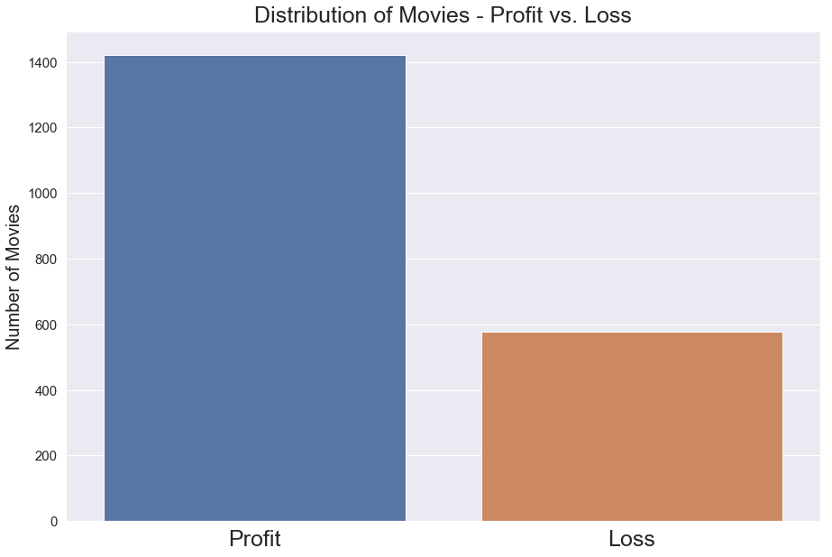
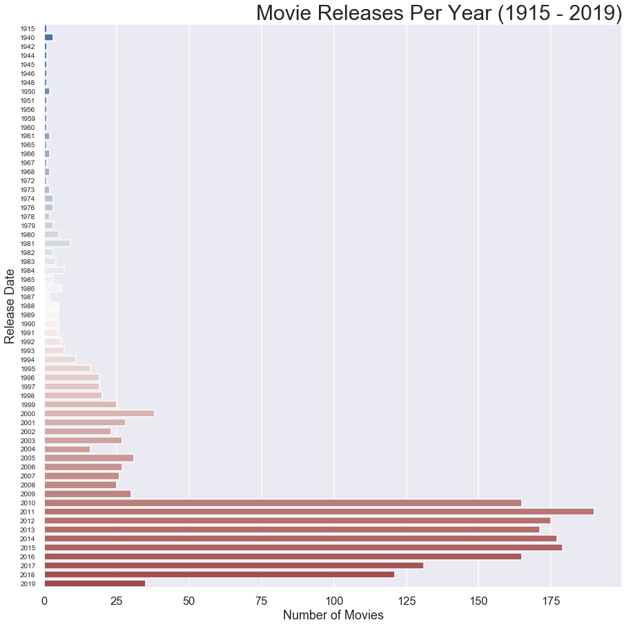

# Individual Question - Why do some international movies flop?

**Taylor Stanley**

**Full-Time**

**Scheduled Project Review: Wed Jun 24, 2020 11am – 11:45am**

**Abhineet Kulkarni**

**BLOG POST URL: https://medium.com/@tcastanley/movie-analysis-why-do-some-international-movies-flop-287db1792cca?sk=aef5c279f461a2868fb17bc2530d6036**

# Set up Notebook & Import Data


```python
import pandas as pd
import numpy as np
import seaborn as sns
import matplotlib.pyplot as plt

%matplotlib inline
```


```python
pd.set_option('display.max_rows', 500)
pd.set_option('display.max_columns', 500)
pd.set_option('display.width', 1000)
```


```python
df_movie_money = pd.read_csv('CLEAN-BOM_budget_revenues.csv')
df_movie_money = df_movie_money.drop('Unnamed: 0', axis=1)
df_movie_money.head()
```


<div>
<style scoped>
    .dataframe tbody tr th:only-of-type {
        vertical-align: middle;
    }

    .dataframe tbody tr th {
        vertical-align: top;
    }

    .dataframe thead th {
        text-align: right;
    }
</style>
<table border="1" class="dataframe">
  <thead>
    <tr style="text-align: right;">
      <th></th>
      <th>release_date</th>
      <th>primary_title</th>
      <th>production_budget</th>
      <th>domestic_gross</th>
      <th>worldwide_gross</th>
    </tr>
  </thead>
  <tbody>
    <tr>
      <th>0</th>
      <td>2009-12-18</td>
      <td>Avatar</td>
      <td>425000000.0</td>
      <td>760507625.0</td>
      <td>2.776345e+09</td>
    </tr>
    <tr>
      <th>1</th>
      <td>2011-05-20</td>
      <td>Pirates of the Caribbean: On Stranger Tides</td>
      <td>410600000.0</td>
      <td>241063875.0</td>
      <td>1.045664e+09</td>
    </tr>
    <tr>
      <th>2</th>
      <td>2019-06-07</td>
      <td>Dark Phoenix</td>
      <td>350000000.0</td>
      <td>42762350.0</td>
      <td>1.497624e+08</td>
    </tr>
    <tr>
      <th>3</th>
      <td>2015-05-01</td>
      <td>Avengers: Age of Ultron</td>
      <td>330600000.0</td>
      <td>459005868.0</td>
      <td>1.403014e+09</td>
    </tr>
    <tr>
      <th>4</th>
      <td>2017-12-15</td>
      <td>Star Wars Ep. VIII: The Last Jedi</td>
      <td>317000000.0</td>
      <td>620181382.0</td>
      <td>1.316722e+09</td>
    </tr>
  </tbody>
</table>
</div>


```python
df_title_country = pd.read_csv('CLEAN-title_countrylist_count.csv')
df_title_country = df_title_country.drop('Unnamed: 0', axis=1)
df_title_country.head()
```


<div>
<style scoped>
    .dataframe tbody tr th:only-of-type {
        vertical-align: middle;
    }

    .dataframe tbody tr th {
        vertical-align: top;
    }

    .dataframe thead th {
        text-align: right;
    }
</style>
<table border="1" class="dataframe">
  <thead>
    <tr style="text-align: right;">
      <th></th>
      <th>primary_title</th>
      <th>country_list</th>
      <th>country_count</th>
    </tr>
  </thead>
  <tbody>
    <tr>
      <th>0</th>
      <td>!Women Art Revolution</td>
      <td>['Russian Federation', 'United States']</td>
      <td>2</td>
    </tr>
    <tr>
      <th>1</th>
      <td>#1 Serial Killer</td>
      <td>['United States']</td>
      <td>1</td>
    </tr>
    <tr>
      <th>2</th>
      <td>#5</td>
      <td>['United States']</td>
      <td>1</td>
    </tr>
    <tr>
      <th>3</th>
      <td>#50Fathers</td>
      <td>['United States']</td>
      <td>1</td>
    </tr>
    <tr>
      <th>4</th>
      <td>#66</td>
      <td>['Indonesia']</td>
      <td>1</td>
    </tr>
  </tbody>
</table>
</div>


## Merge Datasets

**Merging two previously cleaned data sets together to continue further analysis.**


```python
df_money_country_combined = df_movie_money.merge(df_title_country, on='primary_title')
print(df_money_country_combined.shape)
df_money_country_combined.head()
```

    (2312, 7)
    


<div>
<style scoped>
    .dataframe tbody tr th:only-of-type {
        vertical-align: middle;
    }

    .dataframe tbody tr th {
        vertical-align: top;
    }

    .dataframe thead th {
        text-align: right;
    }
</style>
<table border="1" class="dataframe">
  <thead>
    <tr style="text-align: right;">
      <th></th>
      <th>release_date</th>
      <th>primary_title</th>
      <th>production_budget</th>
      <th>domestic_gross</th>
      <th>worldwide_gross</th>
      <th>country_list</th>
      <th>country_count</th>
    </tr>
  </thead>
  <tbody>
    <tr>
      <th>0</th>
      <td>2009-12-18</td>
      <td>Avatar</td>
      <td>425000000.0</td>
      <td>760507625.0</td>
      <td>2.776345e+09</td>
      <td>['Japan']</td>
      <td>1</td>
    </tr>
    <tr>
      <th>1</th>
      <td>2011-05-20</td>
      <td>Pirates of the Caribbean: On Stranger Tides</td>
      <td>410600000.0</td>
      <td>241063875.0</td>
      <td>1.045664e+09</td>
      <td>['Japan', 'Sweden', 'Peru', 'Ukraine', 'United...</td>
      <td>39</td>
    </tr>
    <tr>
      <th>2</th>
      <td>2019-06-07</td>
      <td>Dark Phoenix</td>
      <td>350000000.0</td>
      <td>42762350.0</td>
      <td>1.497624e+08</td>
      <td>['France', 'Mexico', 'Italy', 'Poland', 'Hunga...</td>
      <td>32</td>
    </tr>
    <tr>
      <th>3</th>
      <td>2015-05-01</td>
      <td>Avengers: Age of Ultron</td>
      <td>330600000.0</td>
      <td>459005868.0</td>
      <td>1.403014e+09</td>
      <td>['Azerbaijan', 'Peru', 'United States', 'Israe...</td>
      <td>34</td>
    </tr>
    <tr>
      <th>4</th>
      <td>2018-04-27</td>
      <td>Avengers: Infinity War</td>
      <td>300000000.0</td>
      <td>678815482.0</td>
      <td>2.048134e+09</td>
      <td>['Argentina', 'Spain', 'Serbia', 'United State...</td>
      <td>31</td>
    </tr>
  </tbody>
</table>
</div>


# Data Cleaning & Feature Engineering

**- Add Foreign Gross Feature**

**- Add Net Revenue Feature**

**- Add Return on Investment Feature**


```python
df_money_country_combined['foreign_gross'] = df_money_country_combined[
    'worldwide_gross'] - df_money_country_combined['domestic_gross']

df_money_country_combined['net_revenue'] = df_money_country_combined[
    'worldwide_gross'] - df_money_country_combined['production_budget']

df_money_country_combined['return_on_investment'] = (
    (df_money_country_combined[
        'worldwide_gross'] - df_money_country_combined[
        'production_budget'])/df_money_country_combined[
        'production_budget'])
df_money_country_combined.head()
```


<div>
<style scoped>
    .dataframe tbody tr th:only-of-type {
        vertical-align: middle;
    }

    .dataframe tbody tr th {
        vertical-align: top;
    }

    .dataframe thead th {
        text-align: right;
    }
</style>
<table border="1" class="dataframe">
  <thead>
    <tr style="text-align: right;">
      <th></th>
      <th>release_date</th>
      <th>primary_title</th>
      <th>production_budget</th>
      <th>domestic_gross</th>
      <th>worldwide_gross</th>
      <th>country_list</th>
      <th>country_count</th>
      <th>foreign_gross</th>
      <th>net_revenue</th>
      <th>return_on_investment</th>
    </tr>
  </thead>
  <tbody>
    <tr>
      <th>0</th>
      <td>2009-12-18</td>
      <td>Avatar</td>
      <td>425000000.0</td>
      <td>760507625.0</td>
      <td>2.776345e+09</td>
      <td>['Japan']</td>
      <td>1</td>
      <td>2.015838e+09</td>
      <td>2.351345e+09</td>
      <td>5.532577</td>
    </tr>
    <tr>
      <th>1</th>
      <td>2011-05-20</td>
      <td>Pirates of the Caribbean: On Stranger Tides</td>
      <td>410600000.0</td>
      <td>241063875.0</td>
      <td>1.045664e+09</td>
      <td>['Japan', 'Sweden', 'Peru', 'Ukraine', 'United...</td>
      <td>39</td>
      <td>8.046000e+08</td>
      <td>6.350639e+08</td>
      <td>1.546673</td>
    </tr>
    <tr>
      <th>2</th>
      <td>2019-06-07</td>
      <td>Dark Phoenix</td>
      <td>350000000.0</td>
      <td>42762350.0</td>
      <td>1.497624e+08</td>
      <td>['France', 'Mexico', 'Italy', 'Poland', 'Hunga...</td>
      <td>32</td>
      <td>1.070000e+08</td>
      <td>-2.002376e+08</td>
      <td>-0.572108</td>
    </tr>
    <tr>
      <th>3</th>
      <td>2015-05-01</td>
      <td>Avengers: Age of Ultron</td>
      <td>330600000.0</td>
      <td>459005868.0</td>
      <td>1.403014e+09</td>
      <td>['Azerbaijan', 'Peru', 'United States', 'Israe...</td>
      <td>34</td>
      <td>9.440081e+08</td>
      <td>1.072414e+09</td>
      <td>3.243841</td>
    </tr>
    <tr>
      <th>4</th>
      <td>2018-04-27</td>
      <td>Avengers: Infinity War</td>
      <td>300000000.0</td>
      <td>678815482.0</td>
      <td>2.048134e+09</td>
      <td>['Argentina', 'Spain', 'Serbia', 'United State...</td>
      <td>31</td>
      <td>1.369319e+09</td>
      <td>1.748134e+09</td>
      <td>5.827114</td>
    </tr>
  </tbody>
</table>
</div>


**- Add Profit/Loss Feature**


```python
def profit_loss_function(ROI):
    
    '''This function takes in an ROI and determins if it value constitues a 
    profit or a loss on a particular investment.
    
    Returns:
    str 'profit' or 'loss'
    
    Eg:
    INPUT:
    profit_loss_function(1.5)
    
    OUTPUT:
    'profit'
    '''
    
    if ROI == 0:
        x = 'break-even'
    if ROI > 0:
        x = 'Profit'
    else:
        x = 'Loss'
    return x
df_money_country_combined['profit/loss'] = df_money_country_combined['return_on_investment'].map(lambda x: profit_loss_function(x))
df_money_country_combined.head()
```


<div>
<style scoped>
    .dataframe tbody tr th:only-of-type {
        vertical-align: middle;
    }

    .dataframe tbody tr th {
        vertical-align: top;
    }

    .dataframe thead th {
        text-align: right;
    }
</style>
<table border="1" class="dataframe">
  <thead>
    <tr style="text-align: right;">
      <th></th>
      <th>release_date</th>
      <th>primary_title</th>
      <th>production_budget</th>
      <th>domestic_gross</th>
      <th>worldwide_gross</th>
      <th>country_list</th>
      <th>country_count</th>
      <th>foreign_gross</th>
      <th>net_revenue</th>
      <th>return_on_investment</th>
      <th>profit/loss</th>
    </tr>
  </thead>
  <tbody>
    <tr>
      <th>0</th>
      <td>2009-12-18</td>
      <td>Avatar</td>
      <td>425000000.0</td>
      <td>760507625.0</td>
      <td>2.776345e+09</td>
      <td>['Japan']</td>
      <td>1</td>
      <td>2.015838e+09</td>
      <td>2.351345e+09</td>
      <td>5.532577</td>
      <td>Profit</td>
    </tr>
    <tr>
      <th>1</th>
      <td>2011-05-20</td>
      <td>Pirates of the Caribbean: On Stranger Tides</td>
      <td>410600000.0</td>
      <td>241063875.0</td>
      <td>1.045664e+09</td>
      <td>['Japan', 'Sweden', 'Peru', 'Ukraine', 'United...</td>
      <td>39</td>
      <td>8.046000e+08</td>
      <td>6.350639e+08</td>
      <td>1.546673</td>
      <td>Profit</td>
    </tr>
    <tr>
      <th>2</th>
      <td>2019-06-07</td>
      <td>Dark Phoenix</td>
      <td>350000000.0</td>
      <td>42762350.0</td>
      <td>1.497624e+08</td>
      <td>['France', 'Mexico', 'Italy', 'Poland', 'Hunga...</td>
      <td>32</td>
      <td>1.070000e+08</td>
      <td>-2.002376e+08</td>
      <td>-0.572108</td>
      <td>Loss</td>
    </tr>
    <tr>
      <th>3</th>
      <td>2015-05-01</td>
      <td>Avengers: Age of Ultron</td>
      <td>330600000.0</td>
      <td>459005868.0</td>
      <td>1.403014e+09</td>
      <td>['Azerbaijan', 'Peru', 'United States', 'Israe...</td>
      <td>34</td>
      <td>9.440081e+08</td>
      <td>1.072414e+09</td>
      <td>3.243841</td>
      <td>Profit</td>
    </tr>
    <tr>
      <th>4</th>
      <td>2018-04-27</td>
      <td>Avengers: Infinity War</td>
      <td>300000000.0</td>
      <td>678815482.0</td>
      <td>2.048134e+09</td>
      <td>['Argentina', 'Spain', 'Serbia', 'United State...</td>
      <td>31</td>
      <td>1.369319e+09</td>
      <td>1.748134e+09</td>
      <td>5.827114</td>
      <td>Profit</td>
    </tr>
  </tbody>
</table>
</div>


**- Add Country Count Category Feature**


```python
def country_count_category(value):
    '''This function is meant to be mapped along a DataFrame series.  It is 
    specifically meant to take in a country_count value from a dataframe and 
    assigns it to the appropriate category.  These categories can be 
    manipulated as needed, see the commented out potential changes below.
    
    Returns:
    Assigned categorical value
    
    Example:
    df['country_count'].map(lambda x: country_count_category(x))'''
    
    if value <=10:
        value = '2 - 10'
    elif value > 10 and value <= 20:
        value = '11 - 20'
    elif value > 20 and value <= 30:
        value = '21 - 30'
    elif value > 30 and value <= 40:
        value = '31 - 40'
    else: 
#         value > 40 and value <= 50:
        value = '41 +'
#     elif value > 50 and value <= 60:
#         value = '51 - 60'
#     else: 
#         value = '61 +'
    return value
    
df_money_country_combined['country_count_category'] = df_money_country_combined['country_count'].map(lambda x: country_count_category(x))
df_money_country_combined.head()
```


<div>
<style scoped>
    .dataframe tbody tr th:only-of-type {
        vertical-align: middle;
    }

    .dataframe tbody tr th {
        vertical-align: top;
    }

    .dataframe thead th {
        text-align: right;
    }
</style>
<table border="1" class="dataframe">
  <thead>
    <tr style="text-align: right;">
      <th></th>
      <th>release_date</th>
      <th>primary_title</th>
      <th>production_budget</th>
      <th>domestic_gross</th>
      <th>worldwide_gross</th>
      <th>country_list</th>
      <th>country_count</th>
      <th>foreign_gross</th>
      <th>net_revenue</th>
      <th>return_on_investment</th>
      <th>profit/loss</th>
      <th>country_count_category</th>
    </tr>
  </thead>
  <tbody>
    <tr>
      <th>0</th>
      <td>2009-12-18</td>
      <td>Avatar</td>
      <td>425000000.0</td>
      <td>760507625.0</td>
      <td>2.776345e+09</td>
      <td>['Japan']</td>
      <td>1</td>
      <td>2.015838e+09</td>
      <td>2.351345e+09</td>
      <td>5.532577</td>
      <td>Profit</td>
      <td>2 - 10</td>
    </tr>
    <tr>
      <th>1</th>
      <td>2011-05-20</td>
      <td>Pirates of the Caribbean: On Stranger Tides</td>
      <td>410600000.0</td>
      <td>241063875.0</td>
      <td>1.045664e+09</td>
      <td>['Japan', 'Sweden', 'Peru', 'Ukraine', 'United...</td>
      <td>39</td>
      <td>8.046000e+08</td>
      <td>6.350639e+08</td>
      <td>1.546673</td>
      <td>Profit</td>
      <td>31 - 40</td>
    </tr>
    <tr>
      <th>2</th>
      <td>2019-06-07</td>
      <td>Dark Phoenix</td>
      <td>350000000.0</td>
      <td>42762350.0</td>
      <td>1.497624e+08</td>
      <td>['France', 'Mexico', 'Italy', 'Poland', 'Hunga...</td>
      <td>32</td>
      <td>1.070000e+08</td>
      <td>-2.002376e+08</td>
      <td>-0.572108</td>
      <td>Loss</td>
      <td>31 - 40</td>
    </tr>
    <tr>
      <th>3</th>
      <td>2015-05-01</td>
      <td>Avengers: Age of Ultron</td>
      <td>330600000.0</td>
      <td>459005868.0</td>
      <td>1.403014e+09</td>
      <td>['Azerbaijan', 'Peru', 'United States', 'Israe...</td>
      <td>34</td>
      <td>9.440081e+08</td>
      <td>1.072414e+09</td>
      <td>3.243841</td>
      <td>Profit</td>
      <td>31 - 40</td>
    </tr>
    <tr>
      <th>4</th>
      <td>2018-04-27</td>
      <td>Avengers: Infinity War</td>
      <td>300000000.0</td>
      <td>678815482.0</td>
      <td>2.048134e+09</td>
      <td>['Argentina', 'Spain', 'Serbia', 'United State...</td>
      <td>31</td>
      <td>1.369319e+09</td>
      <td>1.748134e+09</td>
      <td>5.827114</td>
      <td>Profit</td>
      <td>31 - 40</td>
    </tr>
  </tbody>
</table>
</div>


```python
df_money_country_combined.describe()
```


<div>
<style scoped>
    .dataframe tbody tr th:only-of-type {
        vertical-align: middle;
    }

    .dataframe tbody tr th {
        vertical-align: top;
    }

    .dataframe thead th {
        text-align: right;
    }
</style>
<table border="1" class="dataframe">
  <thead>
    <tr style="text-align: right;">
      <th></th>
      <th>production_budget</th>
      <th>domestic_gross</th>
      <th>worldwide_gross</th>
      <th>country_count</th>
      <th>foreign_gross</th>
      <th>net_revenue</th>
      <th>return_on_investment</th>
    </tr>
  </thead>
  <tbody>
    <tr>
      <th>count</th>
      <td>2.312000e+03</td>
      <td>2.312000e+03</td>
      <td>2.312000e+03</td>
      <td>2312.000000</td>
      <td>2.312000e+03</td>
      <td>2.312000e+03</td>
      <td>2312.000000</td>
    </tr>
    <tr>
      <th>mean</th>
      <td>3.616620e+07</td>
      <td>4.542157e+07</td>
      <td>1.094395e+08</td>
      <td>16.823529</td>
      <td>6.401789e+07</td>
      <td>7.327325e+07</td>
      <td>2.938161</td>
    </tr>
    <tr>
      <th>std</th>
      <td>4.975889e+07</td>
      <td>7.692804e+07</td>
      <td>2.125942e+08</td>
      <td>11.901914</td>
      <td>1.419744e+08</td>
      <td>1.765303e+08</td>
      <td>15.251251</td>
    </tr>
    <tr>
      <th>min</th>
      <td>1.400000e+03</td>
      <td>0.000000e+00</td>
      <td>0.000000e+00</td>
      <td>1.000000</td>
      <td>0.000000e+00</td>
      <td>-2.002376e+08</td>
      <td>-1.000000</td>
    </tr>
    <tr>
      <th>25%</th>
      <td>5.000000e+06</td>
      <td>6.330352e+05</td>
      <td>2.507176e+06</td>
      <td>4.000000</td>
      <td>6.354900e+04</td>
      <td>-2.000000e+06</td>
      <td>-0.649132</td>
    </tr>
    <tr>
      <th>50%</th>
      <td>1.800000e+07</td>
      <td>1.847207e+07</td>
      <td>3.147508e+07</td>
      <td>18.000000</td>
      <td>9.988500e+06</td>
      <td>1.088659e+07</td>
      <td>0.664908</td>
    </tr>
    <tr>
      <th>75%</th>
      <td>4.462500e+07</td>
      <td>5.476247e+07</td>
      <td>1.099793e+08</td>
      <td>27.000000</td>
      <td>5.684128e+07</td>
      <td>7.053940e+07</td>
      <td>2.699245</td>
    </tr>
    <tr>
      <th>max</th>
      <td>4.250000e+08</td>
      <td>7.605076e+08</td>
      <td>2.776345e+09</td>
      <td>47.000000</td>
      <td>2.015838e+09</td>
      <td>2.351345e+09</td>
      <td>415.564740</td>
    </tr>
  </tbody>
</table>
</div>


## Final Step of Cleaning

**- Remove rows without any usable financial data.**


```python
df_money_country_combined = df_money_country_combined[(df_money_country_combined['worldwide_gross'] != 0)
                                  &
                                  (df_money_country_combined['domestic_gross'] != 0)]

df_money_country_combined.head()
```


<div>
<style scoped>
    .dataframe tbody tr th:only-of-type {
        vertical-align: middle;
    }

    .dataframe tbody tr th {
        vertical-align: top;
    }

    .dataframe thead th {
        text-align: right;
    }
</style>
<table border="1" class="dataframe">
  <thead>
    <tr style="text-align: right;">
      <th></th>
      <th>release_date</th>
      <th>primary_title</th>
      <th>production_budget</th>
      <th>domestic_gross</th>
      <th>worldwide_gross</th>
      <th>country_list</th>
      <th>country_count</th>
      <th>foreign_gross</th>
      <th>net_revenue</th>
      <th>return_on_investment</th>
      <th>profit/loss</th>
      <th>country_count_category</th>
    </tr>
  </thead>
  <tbody>
    <tr>
      <th>0</th>
      <td>2009-12-18</td>
      <td>Avatar</td>
      <td>425000000.0</td>
      <td>760507625.0</td>
      <td>2.776345e+09</td>
      <td>['Japan']</td>
      <td>1</td>
      <td>2.015838e+09</td>
      <td>2.351345e+09</td>
      <td>5.532577</td>
      <td>Profit</td>
      <td>2 - 10</td>
    </tr>
    <tr>
      <th>1</th>
      <td>2011-05-20</td>
      <td>Pirates of the Caribbean: On Stranger Tides</td>
      <td>410600000.0</td>
      <td>241063875.0</td>
      <td>1.045664e+09</td>
      <td>['Japan', 'Sweden', 'Peru', 'Ukraine', 'United...</td>
      <td>39</td>
      <td>8.046000e+08</td>
      <td>6.350639e+08</td>
      <td>1.546673</td>
      <td>Profit</td>
      <td>31 - 40</td>
    </tr>
    <tr>
      <th>2</th>
      <td>2019-06-07</td>
      <td>Dark Phoenix</td>
      <td>350000000.0</td>
      <td>42762350.0</td>
      <td>1.497624e+08</td>
      <td>['France', 'Mexico', 'Italy', 'Poland', 'Hunga...</td>
      <td>32</td>
      <td>1.070000e+08</td>
      <td>-2.002376e+08</td>
      <td>-0.572108</td>
      <td>Loss</td>
      <td>31 - 40</td>
    </tr>
    <tr>
      <th>3</th>
      <td>2015-05-01</td>
      <td>Avengers: Age of Ultron</td>
      <td>330600000.0</td>
      <td>459005868.0</td>
      <td>1.403014e+09</td>
      <td>['Azerbaijan', 'Peru', 'United States', 'Israe...</td>
      <td>34</td>
      <td>9.440081e+08</td>
      <td>1.072414e+09</td>
      <td>3.243841</td>
      <td>Profit</td>
      <td>31 - 40</td>
    </tr>
    <tr>
      <th>4</th>
      <td>2018-04-27</td>
      <td>Avengers: Infinity War</td>
      <td>300000000.0</td>
      <td>678815482.0</td>
      <td>2.048134e+09</td>
      <td>['Argentina', 'Spain', 'Serbia', 'United State...</td>
      <td>31</td>
      <td>1.369319e+09</td>
      <td>1.748134e+09</td>
      <td>5.827114</td>
      <td>Profit</td>
      <td>31 - 40</td>
    </tr>
  </tbody>
</table>
</div>


# Data Exploration Analysis & Visualization

## A Mean vs. Median Look at Our Data


```python
df_money_country_combined.groupby('profit/loss').median()
```


<div>
<style scoped>
    .dataframe tbody tr th:only-of-type {
        vertical-align: middle;
    }

    .dataframe tbody tr th {
        vertical-align: top;
    }

    .dataframe thead th {
        text-align: right;
    }
</style>
<table border="1" class="dataframe">
  <thead>
    <tr style="text-align: right;">
      <th></th>
      <th>production_budget</th>
      <th>domestic_gross</th>
      <th>worldwide_gross</th>
      <th>country_count</th>
      <th>foreign_gross</th>
      <th>net_revenue</th>
      <th>return_on_investment</th>
    </tr>
    <tr>
      <th>profit/loss</th>
      <th></th>
      <th></th>
      <th></th>
      <th></th>
      <th></th>
      <th></th>
      <th></th>
    </tr>
  </thead>
  <tbody>
    <tr>
      <th>Loss</th>
      <td>14000000.0</td>
      <td>2000000.0</td>
      <td>4221341.0</td>
      <td>11</td>
      <td>511993.0</td>
      <td>-6283172.0</td>
      <td>-0.645164</td>
    </tr>
    <tr>
      <th>Profit</th>
      <td>27250000.0</td>
      <td>42901464.5</td>
      <td>82212396.5</td>
      <td>25</td>
      <td>37471168.0</td>
      <td>49355515.5</td>
      <td>2.075303</td>
    </tr>
  </tbody>
</table>
</div>


```python
df_money_country_combined.groupby('profit/loss').mean()
```


<div>
<style scoped>
    .dataframe tbody tr th:only-of-type {
        vertical-align: middle;
    }

    .dataframe tbody tr th {
        vertical-align: top;
    }

    .dataframe thead th {
        text-align: right;
    }
</style>
<table border="1" class="dataframe">
  <thead>
    <tr style="text-align: right;">
      <th></th>
      <th>production_budget</th>
      <th>domestic_gross</th>
      <th>worldwide_gross</th>
      <th>country_count</th>
      <th>foreign_gross</th>
      <th>net_revenue</th>
      <th>return_on_investment</th>
    </tr>
    <tr>
      <th>profit/loss</th>
      <th></th>
      <th></th>
      <th></th>
      <th></th>
      <th></th>
      <th></th>
      <th></th>
    </tr>
  </thead>
  <tbody>
    <tr>
      <th>Loss</th>
      <td>2.367195e+07</td>
      <td>7.006051e+06</td>
      <td>1.280020e+07</td>
      <td>11.946274</td>
      <td>5.794153e+06</td>
      <td>-1.087175e+07</td>
      <td>-0.601145</td>
    </tr>
    <tr>
      <th>Profit</th>
      <td>4.769707e+07</td>
      <td>7.100715e+07</td>
      <td>1.724806e+08</td>
      <td>21.046414</td>
      <td>1.014734e+08</td>
      <td>1.247835e+08</td>
      <td>5.195709</td>
    </tr>
  </tbody>
</table>
</div>


## What is the Distribution of Movies that are Profitable?


```python
plt.figure(figsize=(15,10))
sns.set(style='darkgrid')

sns.countplot(x=df_money_country_combined['profit/loss']);

plt.xlabel('')
plt.xticks(fontsize=25)
plt.ylabel('Number of Movies', fontsize=20)
plt.yticks(fontsize=15)
plt.title('Distribution of Movies - Profit vs. Loss', fontsize=25, pad=10);
```





## What is the Median Net Revenue of each?


```python
plt.figure(figsize=(15,10))

sns.barplot(x=df_money_country_combined['profit/loss'],
            y=df_money_country_combined['net_revenue'],
            estimator=np.median);

plt.ylim(-1e7, 6e7)
plt.xlabel('');
plt.xticks(fontsize=25);
plt.ylabel('Net Revenue (Tens of Millions $)', fontsize=20);
plt.yticks(fontsize=15);
plt.title('Median Net Revenue - Profit vs. Loss', fontsize=25, pad=10);
```

    C:\Users\tcast\anaconda3\envs\learn-env\lib\site-packages\scipy\stats\stats.py:1713: FutureWarning: Using a non-tuple sequence for multidimensional indexing is deprecated; use `arr[tuple(seq)]` instead of `arr[seq]`. In the future this will be interpreted as an array index, `arr[np.array(seq)]`, which will result either in an error or a different result.
      return np.add.reduce(sorted[indexer] * weights, axis=axis) / sumval
    


**Ok, so we know that movies tend to be profitable more times than not, though who would keep making movies if that WASN'T the case?!  We can also observe that the median net revenue for a profitable movies can be very substantial.  Next, let's take a look at how these trends have been throughout recent history.**

## Movie Trends Over Time


```python
latest_movie = df_money_country_combined['release_date'].max()
print(latest_movie)
earliest_movie = df_money_country_combined['release_date'].min()
print(earliest_movie)

def year_from_date(date):
    year = date.split('-')
    return year[0]

df_money_country_combined['release_date'] = df_money_country_combined['release_date'].map(lambda x: year_from_date(x))
df_money_country_combined.head()
```

    2019-06-14
    1915-02-08
    


<div>
<style scoped>
    .dataframe tbody tr th:only-of-type {
        vertical-align: middle;
    }

    .dataframe tbody tr th {
        vertical-align: top;
    }

    .dataframe thead th {
        text-align: right;
    }
</style>
<table border="1" class="dataframe">
  <thead>
    <tr style="text-align: right;">
      <th></th>
      <th>release_date</th>
      <th>primary_title</th>
      <th>production_budget</th>
      <th>domestic_gross</th>
      <th>worldwide_gross</th>
      <th>country_list</th>
      <th>country_count</th>
      <th>foreign_gross</th>
      <th>net_revenue</th>
      <th>return_on_investment</th>
      <th>profit/loss</th>
      <th>country_count_category</th>
    </tr>
  </thead>
  <tbody>
    <tr>
      <th>0</th>
      <td>2009</td>
      <td>Avatar</td>
      <td>425000000.0</td>
      <td>760507625.0</td>
      <td>2.776345e+09</td>
      <td>['Japan']</td>
      <td>1</td>
      <td>2.015838e+09</td>
      <td>2.351345e+09</td>
      <td>5.532577</td>
      <td>Profit</td>
      <td>2 - 10</td>
    </tr>
    <tr>
      <th>1</th>
      <td>2011</td>
      <td>Pirates of the Caribbean: On Stranger Tides</td>
      <td>410600000.0</td>
      <td>241063875.0</td>
      <td>1.045664e+09</td>
      <td>['Japan', 'Sweden', 'Peru', 'Ukraine', 'United...</td>
      <td>39</td>
      <td>8.046000e+08</td>
      <td>6.350639e+08</td>
      <td>1.546673</td>
      <td>Profit</td>
      <td>31 - 40</td>
    </tr>
    <tr>
      <th>2</th>
      <td>2019</td>
      <td>Dark Phoenix</td>
      <td>350000000.0</td>
      <td>42762350.0</td>
      <td>1.497624e+08</td>
      <td>['France', 'Mexico', 'Italy', 'Poland', 'Hunga...</td>
      <td>32</td>
      <td>1.070000e+08</td>
      <td>-2.002376e+08</td>
      <td>-0.572108</td>
      <td>Loss</td>
      <td>31 - 40</td>
    </tr>
    <tr>
      <th>3</th>
      <td>2015</td>
      <td>Avengers: Age of Ultron</td>
      <td>330600000.0</td>
      <td>459005868.0</td>
      <td>1.403014e+09</td>
      <td>['Azerbaijan', 'Peru', 'United States', 'Israe...</td>
      <td>34</td>
      <td>9.440081e+08</td>
      <td>1.072414e+09</td>
      <td>3.243841</td>
      <td>Profit</td>
      <td>31 - 40</td>
    </tr>
    <tr>
      <th>4</th>
      <td>2018</td>
      <td>Avengers: Infinity War</td>
      <td>300000000.0</td>
      <td>678815482.0</td>
      <td>2.048134e+09</td>
      <td>['Argentina', 'Spain', 'Serbia', 'United State...</td>
      <td>31</td>
      <td>1.369319e+09</td>
      <td>1.748134e+09</td>
      <td>5.827114</td>
      <td>Profit</td>
      <td>31 - 40</td>
    </tr>
  </tbody>
</table>
</div>


### Movie Releases Per Year


```python
plt.figure(figsize=(15,15));
sns.set(context='talk')

palette = sns.light_palette("darkblue", n_colors=2)

sns.countplot(y=df_money_country_combined['release_date'].sort_values(ascending=False), orient='h', palette='vlag');

plt.xlabel('Number of Movies');
plt.ylabel('Release Date');
plt.yticks(fontsize=10);
plt.title('Movie Releases Per Year (1915 - 2019)', fontsize=30, loc='right');
```





**As we can see, there is a massive spike in information available for movies made after 2010.  Let's take a look at data since the year 2000 though and give ourselves a better sample size.**

### Movies Released Between 2000 - 2019


```python
df_money_country_combined['release_date'] = df_money_country_combined['release_date'].astype(int)
df_money_country_combined = df_money_country_combined[df_money_country_combined['release_date'] >= 2000]
df_money_country_combined.head()
```


<div>
<style scoped>
    .dataframe tbody tr th:only-of-type {
        vertical-align: middle;
    }

    .dataframe tbody tr th {
        vertical-align: top;
    }

    .dataframe thead th {
        text-align: right;
    }
</style>
<table border="1" class="dataframe">
  <thead>
    <tr style="text-align: right;">
      <th></th>
      <th>release_date</th>
      <th>primary_title</th>
      <th>production_budget</th>
      <th>domestic_gross</th>
      <th>worldwide_gross</th>
      <th>country_list</th>
      <th>country_count</th>
      <th>foreign_gross</th>
      <th>net_revenue</th>
      <th>return_on_investment</th>
      <th>profit/loss</th>
      <th>country_count_category</th>
    </tr>
  </thead>
  <tbody>
    <tr>
      <th>0</th>
      <td>2009</td>
      <td>Avatar</td>
      <td>425000000.0</td>
      <td>760507625.0</td>
      <td>2.776345e+09</td>
      <td>['Japan']</td>
      <td>1</td>
      <td>2.015838e+09</td>
      <td>2.351345e+09</td>
      <td>5.532577</td>
      <td>Profit</td>
      <td>2 - 10</td>
    </tr>
    <tr>
      <th>1</th>
      <td>2011</td>
      <td>Pirates of the Caribbean: On Stranger Tides</td>
      <td>410600000.0</td>
      <td>241063875.0</td>
      <td>1.045664e+09</td>
      <td>['Japan', 'Sweden', 'Peru', 'Ukraine', 'United...</td>
      <td>39</td>
      <td>8.046000e+08</td>
      <td>6.350639e+08</td>
      <td>1.546673</td>
      <td>Profit</td>
      <td>31 - 40</td>
    </tr>
    <tr>
      <th>2</th>
      <td>2019</td>
      <td>Dark Phoenix</td>
      <td>350000000.0</td>
      <td>42762350.0</td>
      <td>1.497624e+08</td>
      <td>['France', 'Mexico', 'Italy', 'Poland', 'Hunga...</td>
      <td>32</td>
      <td>1.070000e+08</td>
      <td>-2.002376e+08</td>
      <td>-0.572108</td>
      <td>Loss</td>
      <td>31 - 40</td>
    </tr>
    <tr>
      <th>3</th>
      <td>2015</td>
      <td>Avengers: Age of Ultron</td>
      <td>330600000.0</td>
      <td>459005868.0</td>
      <td>1.403014e+09</td>
      <td>['Azerbaijan', 'Peru', 'United States', 'Israe...</td>
      <td>34</td>
      <td>9.440081e+08</td>
      <td>1.072414e+09</td>
      <td>3.243841</td>
      <td>Profit</td>
      <td>31 - 40</td>
    </tr>
    <tr>
      <th>4</th>
      <td>2018</td>
      <td>Avengers: Infinity War</td>
      <td>300000000.0</td>
      <td>678815482.0</td>
      <td>2.048134e+09</td>
      <td>['Argentina', 'Spain', 'Serbia', 'United State...</td>
      <td>31</td>
      <td>1.369319e+09</td>
      <td>1.748134e+09</td>
      <td>5.827114</td>
      <td>Profit</td>
      <td>31 - 40</td>
    </tr>
  </tbody>
</table>
</div>


```python
plt.figure(figsize=(15,15));
sns.set(context='talk')

palette = sns.light_palette("darkblue", n_colors=2)

sns.countplot(y=df_money_country_combined['release_date'].sort_values(ascending=False), palette='vlag');

plt.xlabel('Number of Movies', fontsize=25);
plt.ylabel('Release Date', fontsize=25);
plt.xticks(fontsize=15);
plt.yticks(fontsize=20);
plt.title('Movie Releases Per Year (2000 - 2019)', fontsize=30, loc='right');
```


## Revenue vs. Production Costs (2000 - 2019)

**Now that we have a lot of data for a pretty recent time frame, let's have a look at the relationship between costs and their associated revenues over the past 19 years.  What I am looking for is some sort of " Tipping Point", where we may be able to determine if a movie will be a profit or loss!  This may give us some insight into our question:**

**What makes international movies fail?**


```python
from matplotlib.ticker import MaxNLocator
print(df_money_country_combined.shape)
df_movies_over_time = df_money_country_combined.groupby('release_date').median()
print(df_movies_over_time.shape)

sns.set(style='whitegrid')

ax = plt.figure(figsize=(15,10)).gca()
ax.xaxis.set_major_locator(MaxNLocator(integer=True));

sns.lineplot(x='release_date',
             y='worldwide_gross',
             data=df_money_country_combined,
             estimator=np.median,
             ax=ax);

sns.lineplot(x='release_date',
             y='production_budget',
             data=df_money_country_combined,
             estimator=np.median,
             ax=ax);


plt.xlabel('Release Year', fontsize=22);
plt.xlim(2000,2019);
plt.xticks(size='x-large')

plt.ylabel('Hundreds of Millions $', fontsize=22);
plt.yticks(size='x-large')

plt.legend(['Worldwide Gross', 'Production Costs'], frameon=False, fontsize=30, loc='upper center', numpoints=3);
plt.title('Median Gross Revenue vs Production Costs (2000 - 2019)', fontsize=25, loc='center', pad=10);
```

    (1780, 12)
    (20, 7)
    

    C:\Users\tcast\anaconda3\envs\learn-env\lib\site-packages\scipy\stats\stats.py:1713: FutureWarning: Using a non-tuple sequence for multidimensional indexing is deprecated; use `arr[tuple(seq)]` instead of `arr[seq]`. In the future this will be interpreted as an array index, `arr[np.array(seq)]`, which will result either in an error or a different result.
      return np.add.reduce(sorted[indexer] * weights, axis=axis) / sumval
    


# Observation Conclusions

**We can observe above that there seemed to exist a relatively stable balance between costs and revenue up until around 2008.  We should also remember that we also had a very large increase in information available for movies made post 2010.  Regardless, we see a shift in the relationship afterwards as the gap between the two widens significantly.**

**So what does this mean?**

**Perhaps the rapid proliferation and improvement of web services around 2010 meant that production companies could reduce costs for their marketing efforts? What if there is a relationship here between the consumption of entertainment and fiction in the western world while it was going through the financial crisis of 2008? Or maybe that was the dawn of the superhero movie craze.  It is worth noting that between 2008-2011 Marvel released their Iron Man 1 & 2, The Incredible Hulk, Thor, and Captain America movies.  Seeing as the movies in this universe now account for a massive market share of the industry, it would not be unreasonable to think that they could have sparked new interest in films for an entire generation.**

# Future Work Recommendations

**- Having a much closer look at what happened with data collection techniques, movie industry technological leaps, and social media trends from the years 2008 - 2012.**

**- More information about the nature of the streaming industry would be an excellent contrast from the perspective of production costs.  Does that new business model have a similar relationship as observed above?**
